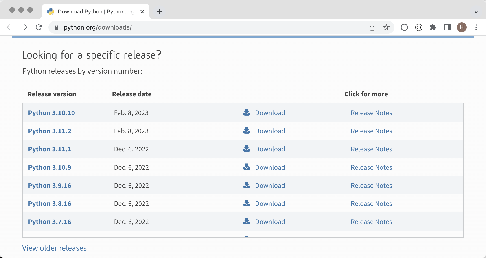
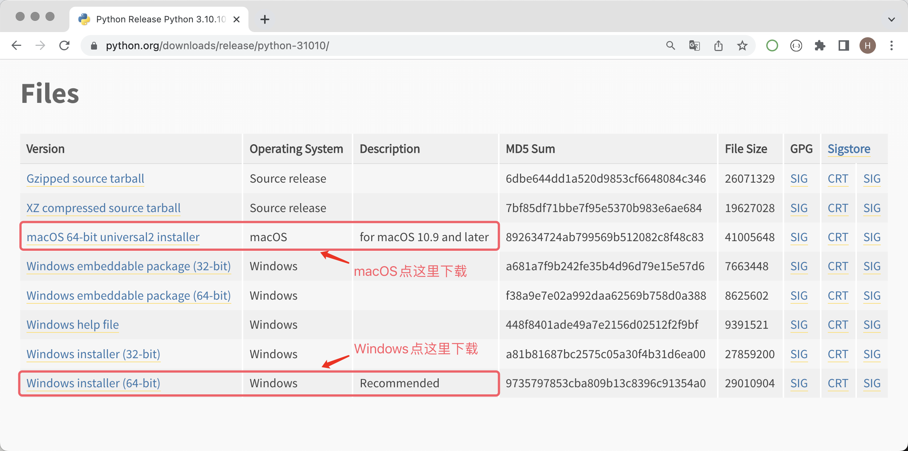

##  Python'la Tanışma

> **Translated to Turkish by** himmetcanumutlu

### Python'a Giriş

Python (İngiliz telaffuzu: /ˈpaɪθən/; Amerikan telaffuzu: /ˈpaɪθɑːn/), Hollandalı Guido van Rossum tarafından icat edilmiş bir programlama dilidir ve şu anda dünyanın en popüler ve en çok kullanıcıya sahip programlama dilidir. Python, kodun okunabilirliğine ve sözdiziminin sadeliğine vurgu yapar. Aynı derecede etkili olan C, C++ ve Java gibi dillere kıyasla Python, kullanıcının niyetini daha az kodla ifade etmesini sağlar. Aşağıda birkaç otoriter programlama dili sıralamasının Python'a verdiği konum yer almaktadır; 1. grafik TIOBE Index, 3. grafik ise IEEE Spectrum tarafından sağlanmıştır. Özellikle dikkat çeken 2. grafik, programlama dillerinin dünyanın en büyük kod barındırma platformu GitHub'daki popülerliğini gösterir; son dört yıldır Python bu sıralamada şampiyonluğu elinde tutmaktadır.

#### Python'un Tarihçesi

Aşağıda Python dilinin gelişim sürecindeki bazı önemli zaman noktaları yer almaktadır:

1. Aralık 1989: Guido van Rossum, sıkıcı Noel tatilini değerlendirmek için yeni bir betik dili ve yorumlayıcısı geliştirmeye karar verdi. Yeni dil, ABC dilinin halefi olacak ve esas olarak sistem yönetimi için Unix shell ve C dilinin yerini alacaktı. Guido, BBC dizisi 《*Monty Python's Flying Circus*》 sadık bir hayranı olduğu için yeni dile "Python" adını seçti.
2. Şubat 1991: Guido van Rossum, Python yorumlayıcısının ilk kodunu alt.sources haber grubunda yayınladı; sürüm 0.9.0 olarak işaretlendi.
3. Ocak 1994: Python 1.0 yayınlandı — hayalin başladığı yer.
4. Ekim 2000: Python 2.0 yayınlandı; Python'un geliştirme süreci daha şeffaf hale geldi, ekosistem yavaş yavaş oluşmaya başladı.
5. Aralık 2008: Python 3.0 yayınlandı; modern programlama dillerinin birçok yeni özelliğini getirdi ancak tamamen geriye dönük uyumlu değildi.
6. Nisan 2011: pip ilk kez yayınlandı; Python kendi paket yönetim aracına kavuştu.
7. Temmuz 2018: Guido van Rossum, "Ömür Boyu Hayırsever Diktatör" (BDFL — açık kaynak topluluğunda anlaşmazlık çıktığında son kararı veren kişi) görevinden "kalıcı izin" alacağını duyurdu.
8. Ocak 2020: Python 2 ve Python 3'ün 11 yıl birlikte var olmasının ardından resmi olarak Python 2'nin güncelleme ve bakımı durduruldu; kullanıcıların bir an önce Python 3'e geçmesi istendi.
9. Günümüz: Python; büyük dil modelleri (GPT-3, GPT-4, BERT vb.), bilgisayarla görme (görüntü tanıma, nesne tespiti, görüntü üretimi vb.), akıllı öneri sistemleri (YouTube, Netflix, ByteDance vb.), otonom sürüş (Waymo, Apollo vb.), konuşma tanıma, veri bilimi, nicel ticaret, otomasyon testi ve otomasyonlu operasyon gibi alanlarda yaygın olarak kullanılmaktadır; Python'un ekosistemi de oldukça zengindir.

> **Not**: Çoğu yazılımın sürüm numarası genellikle A.B.C biçiminde üç bölüme ayrılır. A, ana sürüm numarasıdır ve yazılım tamamen yeniden yazıldığında veya geriye dönük uyumsuz değişiklikler olduğunda artar; B, işlev güncellemesini gösterir ve yeni özellikler geldiğinde artar; C ise küçük değişiklikleri gösterir (örneğin bir hatanın düzeltilmesi) ve her değişiklikte artar.

#### Python'un Avantajları ve Dezavantajları

Python dilinin birçok avantajı vardır; birkaçını listeleyelim.

1. **Basit ve zarif**: diğer birçok dile kıyasla Python'a **başlamak daha kolaydır**.
2. Daha az kodla daha çok iş yapmanızı sağlar, **geliştirme verimliliğini artırır**.
3. Açık kaynak kodludur; **güçlü bir topluluğa ve ekosisteme** sahiptir.
4. **Yapılabilecek şeyler çok fazladır**, güçlü bir uyum sağlama yeteneği vardır.
5. **Yapıştırıcı (glue) bir dildir**: diğer dillerle geliştirilmiş bileşenleri birbirine bağlayabilir.
6. Yorumlamalı bir dildir, **platformlar arası** çalışması kolaydır; birçok işletim sisteminde çalışabilir.

Python'un en büyük dezavantajı **düşük yürütme verimliliğidir** (yorumlamalı dillerin ortak sorunu). Eğer kodun yürütme hızı sizin için daha önemliyse C, C++ veya Go daha iyi bir seçim olabilir.

### Python Ortamını Kurmak

"Bir işi iyi yapmak istiyorsan önce aletlerini hazırlamalısın." Python programlama yolculuğuna başlamak için önce bilgisayarınıza Python ortamını, yani Python programlarını çalıştırmak için gereken Python yorumlayıcısını kurmalısınız. Resmî Python 3 yorumlayıcısını kurmanızı öneririz; bu yorumlayıcı C diliyle yazılmıştır ve genellikle CPython olarak adlandırılır, şu anda sizin için en iyi seçim olabilir. Öncelikle resmî sitenin [indirme sayfasından](https://www.python.org/downloads/) indirme bağlantısını bulmalısınız. "Download" düğmesine tıklayıp indirme sayfasına girdikten sonra, işletim sisteminize uygun Python 3 kurulum dosyasını seçmelisiniz; aşağıdaki gibidir.

İndirme sayfasına girdiğinizde bazı Python sürümlerinin Windows ve macOS için kurulum dosyası sağlamadığını, yalnızca kaynak kodunun sıkıştırılmış dosyasını sunduğunu görürsünüz. Linux'a aşina olanlar için kaynak koddan derleyerek kurulum yapılabilir; ancak Windows veya macOS kullananlar için kurulum dosyasını kullanmanızı **kesinlikle öneririz**. Örneğin Python 3.10 kurmak istiyorsanız, Python 3.10.10 veya 3.10.11 sürümünü seçerek Windows veya macOS kurulum paketini bulabilirsiniz; diğer sürümlerde yalnızca kaynak kod olabilir. Aşağıdaki gibidir.

#### Windows Ortamı

Aşağıda Windows 11 örneği üzerinden Windows işletim sistemine Python ortamının nasıl kurulacağını anlatıyoruz. Resmî siteden indirdiğiniz kurulum dosyasına çift tıklayın, bir kurulum sihirbazı açılacaktır; aşağıdaki gibidir.

Öncelikle "Add python.exe to PATH" seçeneğini işaretlemeyi unutmayın; bu, Python yorumlayıcısının Windows sistemindeki PATH ortam değişkenine eklenmesine yardımcı olur (anlamasanız da sorun değil, işaretleyin yeter). İkinci olarak "Use admin privileges when installing py.exe", kurulum sırasında yönetici yetkisi almak içindir, işaretlemeniz önerilir. Ardından "Customize Installation" (Özel Kurulum) seçeneğini seçin; bu profesyonellerin tercihidir ve siz de (şimdilik) o profesyonelsiniz. "Install Now" (varsayılan kurulum) önerilmez.

Ardından kurulum sihirbazı sizden gerekli "Optional Features" (İsteğe Bağlı Özellikler) seçeneklerini işaretlemenizi ister; burada hepsini seçebilirsiniz. Özellikle 2. madde, Python'un paket yönetim aracı pip'tir ve üçüncü taraf kütüphaneleri ve araçları kurmamıza yardımcı olur; mutlaka işaretlemeyi unutmayın, ardından "Next" (İleri) ile devam edin.

Sırada "Advanced Options" (Gelişmiş Seçenekler) ekranı var. Burada yalnızca "Add Python to environment variables" ve "Precompile standard library" seçeneklerini işaretlemenizi öneririz. Birincisi ortam değişkenlerini otomatik yapılandırır, ikincisi standart kütüphaneyi önceden derler (`.pyc` dosyaları üretir), böylece kullanım sırasında geçici derleme gerekmez. Yine aynı şey: anlamasanız da sorun değil, işaretleyin yeter. Aşağıdaki "Customize install location" (özel kurulum yolu) alanını, **kesinlikle** Çince karakter, boşluk veya başka özel karakter içermeyen özel bir yola çevirmenizi öneririz; bu, ileride birçok gereksiz sorunun önüne geçer. Ayarları tamamladıktan sonra "Install" ile kurulumu başlatın.

Kurulum başarılı olursa aşağıdakine benzer bir ekran görürsünüz. Başarının anahtar sözcüğü "successful"dır; kurulum başarısız olursa bu kelime "failed" olur.

Kurulum tamamlandıktan sonra Windows'un "Komut İstemi" (Command Prompt) veya PowerShell'ini açıp `python --version` veya `python -V` komutunu girerek kurulumun başarılı olup olmadığını kontrol edin; bu komut Python yorumlayıcısının sürüm numarasını gösterir. Aşağıdakine benzer bir ekran görürseniz tebrikler, Python ortamı başarıyla kurulmuştur. Burada ayrıca Python'un paket yönetim aracı pip'in çalışıp çalışmadığını da kontrol etmenizi öneririz; ilgili komut `pip --version` veya `pip -V`'dir.

> **Not**: Kurulum sırasında hata alırsanız veya kurulumun başarısız olduğu belirtilirse, büyük olasılıkla Windows sisteminizde bazı dinamik bağlantı kütüphanesi dosyaları veya gerekli derleme araçları eksiktir. [Microsoft'un resmî sitesinden](https://visualstudio.microsoft.com/zh-hans/downloads/) "Visual Studio 2022 Build Tools" (Visual Studio 2022 Derleme Araçları) indirerek onarabilirsiniz; aşağıdaki gibidir. Microsoft'un sitesinden indirmek zor geliyorsa, aşağıdaki Baidu ağ disk bağlantısıyla da onarım aracını alabilirsiniz — bağlantı: https://pan.baidu.com/s/1iNDnU5UVdDX5sKFqsiDg5Q  çıkarma kodu: cjs3.
>
> 
>
> Yukarıda indirdiğiniz "Visual Studio 2022 Derleme Araçları"nın çalışması için internet bağlantısı gerekir; çalıştırdıktan sonra aşağıdakine benzer bir ekran açılır. Onarım için ilgili seçenekleri işaretleyebilirsiniz. Onarım sürecinde internet üzerinden ilgili yazılım paketlerinin indirilmesi gerekir; bu biraz zaman alabilir. Onarım başarılı olduktan sonra işletim sisteminizi yeniden başlatmanız istenebilir.
>
> 

#### macOS Ortamı

macOS'ta Python ortamını kurmak Windows'a göre daha basittir. Resmî siteden indirdiğimiz kurulum paketi bir `pkg` dosyasıdır; çift tıklayıp sürekli "Devam" (Continue) düğmesine basarak kurulum tamamlanır; neredeyse hiçbir ayar ve işaretleme gerekmez. Aşağıdaki gibidir.

Kurulum tamamlandıktan sonra macOS'un "Terminal" aracına `python3 --version` komutunu girerek kurulumun başarılı olup olmadığını kontrol edebilirsiniz. Dikkat: buradaki komut `python` değil, `python3`'tür!!! Ardından paket yönetim aracını da kontrol edelim: `pip3 --version` komutunu girin; aşağıdaki gibidir.

#### Diğer Kurulum Yöntemleri

Bazıları yeni başlayanlara doğrudan [Anaconda](https://www.anaconda.com/download/success) kurmalarını önerebilir; çünkü Anaconda, Python yorumlayıcısını ve bazı yaygın üçüncü taraf kütüphaneleri sizin için kurar, ayrıca bazı pratik araçlar da sunar; yeni başlayanlar için oldukça uygundur. Kişisel olarak ben yeni başlayanlara doğrudan Anaconda kullanmalarını pek önermiyorum; çünkü Anaconda kurarken farkında olmadan işe yarar ya da yaramaz bir sürü üçüncü taraf kütüphane kurarsınız (oldukça fazla disk alanı kaplar), üstelik terminaliniz veya komut isteminiz Anaconda tarafından değiştirilir (her açılışta sanal ortam otomatik etkinleştirilir). Bunlar yazılım tasarımının **en az sürpriz ilkesine** aykırıdır. Anaconda'nın diğer küçük sorunlarına burada girmeyeceğiz. Mutlaka Anaconda kullanmak isterseniz Miniconda'yı deneyebilirsiniz; Anaconda ile aynı indirme sayfasındadır.

Yeni başlayanlar sık sık şöyle der veya duyar: "Python programı yazacağım, PyCharm kursam yeterli değil mi?" Burada kısaca açıklayalım: PyCharm yalnızca Python kodu yazmaya yardımcı olan bir araçtır; kendi başına Python kodu çalıştırma yeteneği yoktur. Python kodunu çalıştıran şey, yukarıda kurduğumuz Python yorumlayıcısıdır. Tabii bazı PyCharm sürümleri, Python projesi oluştururken bilgisayarınızda Python ortamı bulamazsa internetten Python yorumlayıcısı indirmenizi önerir. PyCharm'ın kurulumu ve kullanımı bir sonraki derse bırakılmıştır.

### Özet

Öğrendiklerimizi özetleyelim:

1. Python çok güçlü bir dildir, birçok şey yapabilir; bu yüzden öğrenmeye değer.
2. Python dilini kullanmak için önce Python ortamını, yani Python programlarını çalıştırmak için gereken Python yorumlayıcısını kurmalısınız.
3. Windows'ta Komut İstemi veya PowerShell'e `python --version` girerek; macOS'ta Terminal'e `python3 --version` girerek Python ortamının başarıyla kurulup kurulmadığını kontrol edebilirsiniz.
