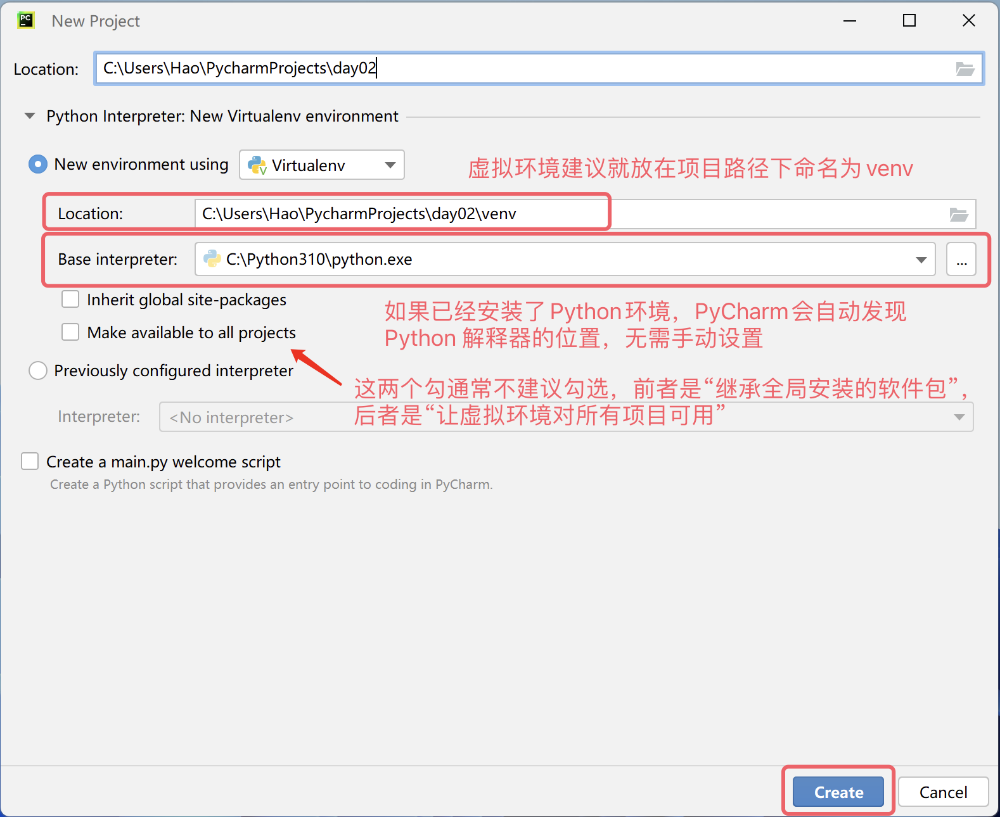

## İlk Python Programı

> **Translated to Turkish by** himmetcanumutlu

Önceki derste Python dilinin geçmişi ve bugünü hakkında biraz bilgi edindik ve Python programlarını çalıştırmak için gereken yorumlayıcı ortamını hazırladık. Eminim herkes Python programlama yolculuğuna başlamak için sabırsızlanıyordur. Ancak yeni bir soru var: Python programını nereye yazacağız ve nasıl çalıştıracağız?

### Kod Yazma Araçları

Aşağıda Python kodu yazmak ve çalıştırmak için kullanılabilecek birkaç aracı anlatıyoruz; ihtiyacınıza göre uygun olanı seçebilirsiniz. Elbette yeni başlayanlar için kişisel olarak PyCharm'ı öneriyorum; çünkü çok fazla yapılandırma gerektirmez, son derece güçlüdür ve yeni başlayanlara karşı oldukça dostanedir. PyCharm'ı duyduysanız veya seviyorsanız, aşağıdaki diğer araçların tanıtımını atlayıp doğrudan PyCharm bölümüne geçebilirsiniz.

#### Varsayılan Etkileşimli Ortam

Windows'un "Komut İstemi" veya "PowerShell" aracını açıp `python` yazıp `Enter` tuşuna basarsanız, bu komut bizi etkileşimli bir ortama götürür. Etkileşimli ortam, bir satır kod yazıp `Enter`'a bastığınızda kodun hemen çalıştırıldığı ve sonuç üretiyorsa sonucun pencerede gösterildiği ortamdır; aşağıdaki gibidir.

```Bash
Python 3.10.10
Type "help", "copyright", "credits" or "license" for more information.
>>> 2 * 3
6
>>> 2 + 3
5
>>>
```

> **Not**: macOS kullananlar "Terminal" aracını açıp `python3` yazarak etkileşimli ortama girer.

Etkileşimli ortamdan çıkmak isterseniz, etkileşimli ortamda `quit()` yazabilirsiniz; aşağıdaki gibidir.

```Bash
>>> quit()
```

#### Daha İyi Etkileşimli Ortam - IPython

Yukarıdaki etkileşimli ortamın kullanıcı deneyimi pek iyi değildir; kullandıkça fark edersiniz. Onu IPython ile değiştirebiliriz, çünkü IPython çok daha güçlü düzenleme ve etkileşim özellikleri sunar. Komut İstemi'nde veya Terminal'de Python'un paket yönetim aracı `pip` ile IPython'u kurabilirsiniz; aşağıdaki gibidir.

```bash
pip install ipython
```

> **İpucu**: Yukarıdaki komutla IPython kurmadan önce, `pip config set global.index-url https://pypi.doubanio.com/simple` veya `pip config set global.index-url https://pypi.tuna.tsinghua.edu.cn/simple/` komutuyla indirme kaynağını Çin'deki Douban veya Tsinghua aynasına çevirebilirsiniz; aksi takdirde indirme ve kurulum süreci çok yavaş olabilir.

Ardından aşağıdaki komutla IPython'u başlatıp etkileşimli ortama girebilirsiniz.

```bash
ipython
```

> **Not**: Bir de Jupyter adında web tabanlı bir IPython vardır; ona ihtiyaç duyduğumuz yerde anlatacağız.

#### Metin Düzenleme Harikası - Visual Studio Code

Visual Studio Code, Microsoft tarafından geliştirilmiş; Windows, Linux ve macOS gibi işletim sistemlerinde çalışabilen bir kod düzenleme harikasıdır. Sözdizimi vurgulama, otomatik tamamlama, çok noktalı düzenleme, çalıştırma ve hata ayıklama gibi bir dizi kullanışlı özelliği destekler ve birçok programlama dilini destekler. İleri düzey bir metin düzenleme aracı seçecekseniz Visual Studio Code'u kesinlikle öneririz; [indirme](https://code.visualstudio.com/), kurulum ve kullanımıyla ilgili ayrıntıları merak edenler kendi başına inceleyebilir.


#### Entegre Geliştirme Ortamı - PyCharm

Python ile ticari proje geliştiriyorsanız daha profesyonel bir araç olan PyCharm'ı kullanmanızı öneririz. PyCharm, Çekya merkezli [JetBrains](https://www.jetbrains.com/) adlı şirketin Python dili için sunduğu bir entegre geliştirme ortamıdır (IDE). Entegre geliştirme ortamı, genellikle kod yazma, kod çalıştırma, kod hata ayıklama, kod analizi ve sürüm kontrolü gibi bir dizi güçlü özelliği ve pratik işlemi bir arada sunan bir geliştirme aracıdır; bu nedenle ticari proje geliştirmeye özellikle uygundur. PyCharm'ın [indirme bağlantısını](<https://www.jetbrains.com/pycharm/download>) JetBrains şirketinin resmî sitesinde bulabilirsiniz; aşağıdaki gibidir.


Resmî olarak iki PyCharm sürümü sunulur: biri ücretsiz Topluluk Sürümü (Community Edition); işlevleri görece daha azdır ama yeni başlayanlar için fazlasıyla yeterlidir. Diğeri ücretli Profesyonel Sürüm (Professional Edition); çok güçlüdür ama yıllık veya aylık ücret gerektirir; yeni kullanıcılar 30 gün ücretsiz deneyebilir. PyCharm'ın kurulumu hiç de zor değildir; indirdiğiniz kurulum dosyasını çalıştırıp neredeyse tüm varsayılan ayarlarla kurulumu yapabilirsiniz. Windows kullananlar için bir adımda, aşağıdaki gibi "Masaüstü kısayolu oluştur" ve "Sağ tık menüsüne 'Open Folder as Project' ekle" seçeneklerini işaretleyebilirsiniz.


PyCharm'ı ilk çalıştırdığınızda, PyCharm ayarlarını içe aktarmanızı isteyen ekranda doğrudan "Do not import settings" seçeneğini seçin; ardından aşağıdaki gibi bir karşılama ekranı görürsünüz. Burada önce "Customize" seçeneğine tıklayarak PyCharm'a bazı kişisel ayarlar yapabilirsiniz.


Ardından "Projects" sekmesinde "New Project"e tıklayarak yeni bir proje oluşturabilirsiniz; burada ayrıca "mevcut bir projeyi açabilir" veya "sürüm kontrol sunucusundan (VCS) proje alabilirsiniz"; aşağıdaki gibidir.


Proje oluştururken projenin yolunu belirtmeniz ve bir "sanal ortam" oluşturmanız gerekir; her Python projesinin kendi özel sanal ortamında çalışmasını öneririz. Sisteminizde henüz Python ortamı yoksa PyCharm resmî indirme bağlantısını sunar; "Create" düğmesine tıklayıp proje oluşturduğunuzda internetten Python yorumlayıcısını indirir; aşağıdaki gibidir.


Elbette bunu önermiyoruz, çünkü bir önceki derste Python ortamını zaten kurmuştuk. Sistemde Python ortamı varsa PyCharm genellikle Python yorumlayıcısının konumunu otomatik bulur ve buna dayanarak sanal ortam oluşturur; bu yüzden göreceğiniz ekran aşağıdaki gibi olmalıdır.



> **Not**: Yukarıdaki ekran görüntüleri Windows'tandır; macOS kullanıyorsanız gördüğünüz proje yolu ve Python yorumlayıcı yolu yukarıdakinden farklı olacaktır.

Projeyi oluşturduktan sonra aşağıdaki gibi bir ekran görürsünüz. Proje klasörüne sağ tıklayıp "New" menüsünden "Python File" seçerek bir Python dosyası oluşturabilirsiniz; dosyaya ad verirken İngilizce harf ve alt çizgi kombinasyonu kullanmanız önerilir. Oluşturulan Python dosyası otomatik açılır ve düzenlenebilir duruma gelir.


Ardından kod penceresine Python kodumuzu yazabiliriz. Kodu yazdıktan sonra pencerede sağ tıklayıp "Run" menü öğesini seçerek kodu çalıştırabilirsiniz; alttaki "Run" penceresi kodun çalışma sonucunu gösterir; aşağıdaki gibidir.


İşte, ilk Python programımız çalıştı, harika değil mi? Bu arada PyCharm'ın "Günlük İpucu" (Tip of the Day) adında, size PyCharm kullanımıyla ilgili küçük ipuçları öğreten bir açılır penceresi vardır; aşağıdaki gibidir. Gerekmiyorsa doğrudan kapatabilirsiniz; bir daha görünmesini istemiyorsanız kapatmadan önce "Don't show tips on startup" seçeneğini işaretleyin.


### Merhaba Dünya

Sektör geleneğine göre, herhangi bir programlama dilini öğrenirken yazdığımız ilk program `hello, world` çıktısını verir; çünkü bu kod, büyük Dennis Ritchie'nin (C dilinin babası; Ken Thompson ile birlikte Unix işletim sistemini geliştirmiştir) ve Brian Kernighan'ın (awk dilinin mucidi) ölümsüz eseri 《*The C Programming Language*》 kitabındaki ilk koddur. Aşağıda bunun Python dilindeki karşılığı yer alır.

```python
print('hello, world')
```

> **Dikkat**: Yukarıdaki koddaki parantez ve tek tırnaklar İngilizce giriş modunda yazılmalıdır; yanlışlıkla Çince parantez veya tek tırnak yazarsanız, kodu çalıştırırken `SyntaxError: invalid character '（' (U+FF08)` veya `SyntaxError: invalid character '‘' (U+2018)` gibi hata mesajları görürsünüz.

Yukarıdaki kodda yalnızca bir deyim vardır; bu deyimde `print` adlı bir fonksiyon kullandık; bu fonksiyon belirttiğimiz içeriği ekrana yazdırmamıza yardımcı olur. `print` fonksiyonunun parantezi içindeki `'hello, world'` bir string'dir ve bir metin parçasını temsil eder. Python dilinde bir string'i tek tırnak veya çift tırnakla ifade edebiliriz. C, C++ veya Java gibi dillerden farklı olarak, Python'daki deyimlerin sonuna noktalı virgül koyarak deyimin bittiğini belirtmek gerekmez; yani yeni bir deyim yazmak istiyorsanız yeni satıra geçmeniz yeterlidir; aşağıdaki gibidir. Ayrıca Python kodunun çalışması için `main` adlı bir giriş fonksiyonu yazmak da gerekmez; çalıştırılabilir C, C++ veya Java kodu yazarken giriş fonksiyonu sağlamak zorunludur ve birçok programcı buna aşinadır, ancak Python dilinde bu gerekli değildir.

```python
print('hello, world')
print('goodbye, world')
```

PyCharm gibi bir entegre geliştirme ortamı kullanmıyorsanız, Python programını çalıştırmak için doğrudan Python yorumlayıcısını da çağırabilirsiniz. Yukarıdaki kodu `example01.py` adlı bir dosyaya kaydedebiliriz. Windows için bu dosyanın `C:\code` dizininde olduğunu varsayalım; "Komut İstemi" veya "PowerShell"i açıp aşağıdaki komutu girerek çalıştırabilirsiniz.

```powershell
python C:\code\example01.py
```

macOS için dosyamızın `/Users/Hao` dizininde olduğunu varsayalım; o zaman Terminal'e aşağıdaki komutu girerek programı çalıştırabilirsiniz.

```Bash
python3 /Users/Hao/example01.py
```

> **İpucu**: Yol çok uzunsa ve elle yazmak istemiyorsanız, dosyayı sürükleyip doğrudan "Komut İstemi"ne veya "Terminal"e bırakabilirsiniz; böylece tam dosya yolu otomatik girilir.

Yukarıdaki kodu değiştirmeyi deneyebilirsiniz; örneğin tek tırnak içindeki `hello, world` metnini başka bir içerikle değiştirebilir veya bu tür deyimlerden birkaç tane daha yazabilirsiniz; nasıl bir sonuç çıkacağına bakın. Hatırlatmak gerekir ki Python kodu yazarken her satıra yalnızca bir deyim yazmanız en iyisidir. `;` kullanarak birden çok deyimi tek satıra yazmak mümkün olsa da bu, kodu çok çirkinleştirir ve okunabilirliğini bozar.

### Kodunuza Yorum Ekleyin

Yorumlar, programlama dilinin önemli bir parçasıdır; kodun ne işe yaradığını açıklayarak kodun okunabilirliğini artırır. Elbette, kodda geçici olarak çalışmasını istemediğimiz bölümleri yorum haline getirerek devre dışı bırakabiliriz; böylece o kodu yeniden kullanmak istediğinizde yorum işaretini kaldırmanız yeterli olur. Basitçe söylemek gerekirse **yorumlar kodun daha kolay anlaşılmasını sağlar ama kodun çalışma sonucunu etkilemez**.

Python'da iki tür yorum vardır:

1. Tek satırlık yorum: `#` ve boşluk ile başlar; `#`'dan itibaren satırın geri kalanını yorum haline getirir.
2. Çok satırlı yorum: üç tırnakla (genellikle çift tırnak) başlar ve üç tırnakla biter; genellikle çok satırlı açıklama eklemek için kullanılır.

```python
"""
İlk Python programı - hello, world

Version: 1.0
Author: 骆昊 (jackfrued)
"""
# print('hello, world')
print("Merhaba, dünya!")
```

### Özet

Böylece ilk Python programımızı çalıştırmış olduk; büyük bir başarı duygusu değil mi?! Öğrenmeye devam ettiğiniz sürece, kısa bir süre sonra Python ile çok daha havalı şeyler yapabileceğiz. Günümüzde programlama, tıpkı İngilizce gibi, birçok insan için edinilmesi gereken bir beceridir.
