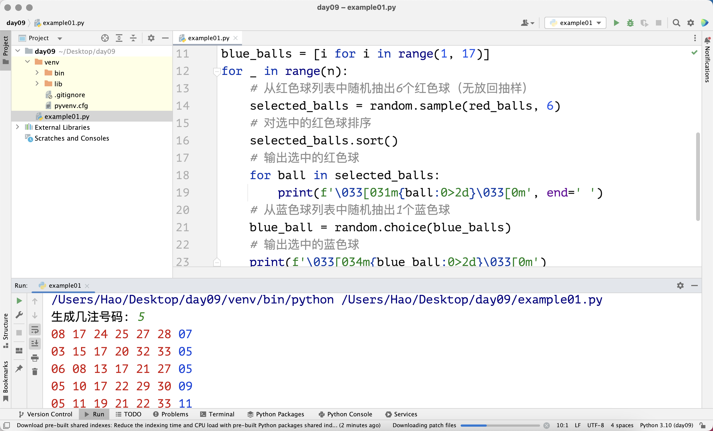

## Yaygın Veri Yapıları: Liste-2

> **Translated to Turkish by** himmetcanumutlu

### Liste Metotları

Liste tipindeki değişkenler, bir listeyi işlememize yardımcı olan birçok metoda sahiptir. Diyelim ki `foos` adında bir listemiz ve listenin `bar` adında bir metodu var; o zaman liste metodunu kullanmanın sözdizimi `foos.bar()` biçimindedir. Bu, nesne referansı üzerinden nesnenin metodunu çağırma sözdizimidir. Nesne yönelimli programlamayı anlatırken bu sözdizimini ayrıntılı işleyeceğiz; bu sözdizimine "nesneye mesaj gönderme" de denir.

#### Eleman Ekleme ve Silme

Liste değiştirilebilir (mutable) bir kaptır; yani kaba eleman ekleyebilir, kaptan eleman çıkarabilir ya da kaptaki mevcut elemanları değiştirebiliriz. Listeye eleman **eklemek** için `append`, **araya sokmak** için `insert` metodunu kullanabiliriz. Append, elemanı listenin sonuna ekler; insert ise belirtilen konuma yeni eleman ekler; aşağıdaki koda bakın.

```python
languages = ['Python', 'Java', 'C++']
languages.append('JavaScript')
print(languages)  # ['Python', 'Java', 'C++', 'JavaScript']
languages.insert(1, 'SQL')
print(languages)  # ['Python', 'SQL', 'Java', 'C++', 'JavaScript']
```

Listeden belirli bir elemanı silmek için `remove` metodunu kullanabiliriz. Dikkat: silinecek eleman listede yoksa `ValueError` hatası oluşur ve program çöker; bu yüzden eleman silerken önce daha önce anlattığımız üyelik işlemiyle kontrol etmeniz önerilir. `pop` metodunu da listeden eleman silmek için kullanabiliriz; `pop` varsayılan olarak listedeki son elemanı siler; elbette bir konum verip o konumdaki elemanı da silebilirsiniz. `pop` ile eleman silerken indeks aralık dışına çıkarsa `IndexError` hatası oluşur ve program çöker. Bunların dışında listenin `clear` metodu listedeki tüm elemanları temizler; kod aşağıdaki gibidir.

```python
languages = ['Python', 'SQL', 'Java', 'C++', 'JavaScript']
if 'Java' in languages:
    languages.remove('Java')
if 'Swift' in languages:
    languages.remove('Swift')
print(languages)  # ['Python', 'SQL', 'C++', 'JavaScript']
languages.pop()
temp = languages.pop(1)
print(temp)       # SQL
languages.append(temp)
print(languages)  # ['Python', 'C++', 'SQL']
languages.clear()
print(languages)  # []
```

> **Not**: `pop` metodu eleman silerken silinen elemanı döndürür; yukarıdaki kodda `pop` metodunun sildiği elemanı `temp` adlı değişkene atadık. Elbette isterseniz bu elemanı, yukarıdaki `languages.append(temp)` kodunda olduğu gibi listeye yeniden ekleyebilirsiniz.

Burada küçük bir soru daha var: örneğin `languages` listesinde birden çok `'Python'` varsa, `languages.remove('Python')` tüm `'Python'` elemanlarını mı siler, yoksa ilk `'Python'` elemanını mı? Önce tahmin edin, sonra kendiniz deneyin.

Listeden eleman silmenin bir yolu daha vardır: Python'daki `del` anahtar sözcüğünün ardına silinecek elemanı yazmak. Bu yöntemle `pop` metoduna indeks vererek eleman silmek arasında esaslı bir fark yoktur; ancak `pop` silinen elemanı döndürürken `del` performans açısından biraz daha iyidir. Çünkü `del`'in karşılık geldiği alt seviye bytecode komutu `DELETE_SUBSCR`, `pop`'un karşılık geldiği komutlar ise `CALL_METHOD` ve `POP_TOP`'tur. Anlamıyorsanız üzerinde durmayın.

```python
items = ['Python', 'Java', 'C++']
del items[1]
print(items)  # ['Python', 'C++']
```

#### Eleman Konumu ve Sıklığı

Listenin `index` metodu, bir elemanın listedeki indeks konumunu bulur; eleman bulunamazsa `index` metodu `ValueError` hatası üretir. Listenin `count` metodu ise bir elemanın listede kaç kez geçtiğini sayar; kod aşağıdaki gibidir.

```python
items = ['Python', 'Java', 'Java', 'C++', 'Kotlin', 'Python']
print(items.index('Python'))     # 0
# 'Python' elemanını indeks 1'den itibaren ara
print(items.index('Python', 1))  # 5
print(items.count('Python'))     # 2
print(items.count('Kotlin'))     # 1
print(items.count('Swfit'))      # 0
# 'Java' elemanını indeks 3'ten itibaren ara
print(items.index('Java', 3))    # ValueError: 'Java' is not in list
```

#### Eleman Sıralama ve Ters Çevirme

Listenin `sort` işlemi liste elemanlarını sıralar, `reverse` işlemi ise elemanları ters çevirir; kod aşağıdaki gibidir.

```python
items = ['Python', 'Java', 'C++', 'Kotlin', 'Swift']
items.sort()
print(items)  # ['C++', 'Java', 'Kotlin', 'Python', 'Swift']
items.reverse()
print(items)  # ['Swift', 'Python', 'Kotlin', 'Java', 'C++']
```

### Liste Anlama (Comprehension)

Python'da liste, **anlama (comprehension)** adı verilen özel bir hazır değer sözdizimiyle de oluşturulabilir. Aşağıda liste anlamayı kullanmanın ne faydası olduğunu örneklerle açıklayalım.

Senaryo 1: `1` ile `99` arasında olup `3`'e veya `5`'e bölünebilen sayılardan oluşan bir liste oluşturun.

```python
items = []
for i in range(1, 100):
    if i % 3 == 0 or i % 5 == 0:
        items.append(i)
print(items)
```

Aynı işi liste anlama ile yapalım; kod aşağıdaki gibidir.

```python
items = [i for i in range(1, 100) if i % 3 == 0 or i % 5 == 0]
print(items)
```

Senaryo 2: `nums1` adında bir tam sayı listesi var; `nums1`'deki karşılık gelen elemanların karesinden oluşan yeni bir `nums2` listesi oluşturun.

```python
nums1 = [35, 12, 97, 64, 55]
nums2 = []
for num in nums1:
    nums2.append(num ** 2)
print(nums2)
```

Aynı işi liste anlama ile yapalım; kod aşağıdaki gibidir.

```python
nums1 = [35, 12, 97, 64, 55]
nums2 = [num ** 2 for num in nums1]
print(nums2)
```

Senaryo 3: `nums1` adında bir tam sayı listesi var; `nums1`'deki `50`'den büyük elemanları `nums2` listesine koyun.

```python
nums1 = [35, 12, 97, 64, 55]
nums2 = []
for num in nums1:
    if num > 50:
        nums2.append(num)
print(nums2)
```

Aynı işi liste anlama ile yapalım; kod aşağıdaki gibidir.

```python
nums1 = [35, 12, 97, 64, 55]
nums2 = [num for num in nums1 if num > 50]
print(nums2)
```

Liste anlama ile liste oluşturmak hem daha sade ve zarif bir kod üretir, hem de `for-in` döngüsü ve `append` metoduyla boş listeye eleman eklemeye kıyasla performans açısından daha iyidir. Anlamanın neden daha iyi performansı olduğunu soracak olursanız: Python yorumlayıcısının bytecode komutlarında anlamaya özel bir komut vardır (`LIST_APPEND` komutu); `for` döngüsü ise listeye eleman eklemek için metot çağrısı (`LOAD_METHOD` ve `CALL_METHOD` komutları) kullanır ve metot çağrısının kendisi nispeten maliyetli bir işlemdir. Bunu anlamadıysanız sorun değil; "**listeyi oluşturmak için kesinlikle anlama sözdizimini kullanın**" sonucunu aklınızda tutmanız yeterli.

### İç İçe Listeler

Python dili, listedeki elemanların aynı veri tipinde olmasını zorunlu kılmaz; yani bir listedeki elemanlar herhangi bir veri tipinde olabilir; buna listenin kendisi de dahildir. Listedeki elemanlar da listeyse buna iç içe (nested) liste denir. İç içe listeler tabloları veya matematikteki matrisleri temsil etmek için kullanılabilir. Örneğin 5 öğrencinin 3 dersinin notlarını saklamak istersek aşağıdaki gibi bir liste kullanabiliriz.

```python
scores = [[95, 83, 92], [80, 75, 82], [92, 97, 90], [80, 78, 69], [65, 66, 89]]
print(scores[0])
print(scores[0][1])
```

Yukarıdaki iç içe listede her eleman, bir öğrencinin 3 dersinin notuna karşılık gelir; örneğin `[95, 83, 92]`; bu listedeki `83` ise o öğrencinin bir dersinin notudur. Bu değere erişmek için iki kez indeksleme işlemi yapabiliriz: `scores[0][1]`. `scores[0]`, `[95, 83, 92]` listesini verir; bir kez daha `[1]` indekslemesiyle o listenin ikinci elemanına ulaşırız.

5 öğrencinin 3 dersinin notlarını klavyeden girip listeye kaydetmek istersek aşağıdaki kodu kullanabiliriz.

```python
scores = []
for _ in range(5):
    temp = []
    for _ in range(3):
        score = int(input('Girin: '))
        temp.append(score)
    scores.append(temp)
print(scores)
```

Rastgele sayı üreterek 5 öğrencinin 3 dersinin notlarını oluşturup listeye kaydetmek istersek liste anlamayı kullanabiliriz; kod aşağıdaki gibidir.

```python
import random

scores = [[random.randrange(60, 101) for _ in range(3)] for _ in range(5)]
print(scores)
```

> **Not**: Yukarıdaki `[random.randrange(60, 101) for _ in range(3)]` kodu, 3 rastgele tam sayıdan oluşan bir liste üretir; bu kodu bir başka liste anlamanın içine eleman olarak yerleştirdik. Bu elemanlardan 5 tane üretilir ve sonuçta bir iç içe liste elde edilir.

### Listenin Uygulamaları

Aşağıda çift renkli top (lottery) rastgele numara seçme örneğiyle listenin uygulamasını açıklayalım. Çift renkli top, Çin Refah Piyangosu tarafından satılan bir loto türüdür; her bahis numarası `6` kırmızı top ve `1` mavi toptan oluşur. Kırmızı top numaraları `1` ile `33` arasından, mavi top numarası ise `1` ile `16` arasından seçilir. Her bahiste `6` kırmızı top ve `1` mavi top seçilir; aşağıdaki gibidir.


> **İpucu**: Zhihu'da çeşitli piyango türlerinin özüne dair oldukça çarpıcı bir söz vardır; burada paylaşalım: "**Emek vermeden kazanç sağlayan kurgusal bir insan yarat, emek vermeden kazanmak isteyen bir grup insanı kandır, sonunda gerçekten emek vermeden kazanan bir kesimi besle.**" Olasılık kavramına sahip olmayan birçok insan, piyangoda kazanıp kazanmama olasılığının %50 olduğunu bile düşünür; yine birçok insan, kazanma olasılığı %1 ise 100 kez alınca kesin kazanacağını sanır; bunların hepsi son derece absürt düşüncelerdir. Bu yüzden **hayatınızı koruyun, kumardan uzak durun; özellikle de olasılık konusunda hiçbir şey bilmiyorsanız**!

Şimdi Python programıyla bir grup rastgele numara üretelim.

```python
"""
Çift renkli top rastgele numara seçme programı

Author: 骆昊 (jackfrued)
Version: 1.0
"""
import random

red_balls = list(range(1, 34))
selected_balls = []
# Seçilen listeye 6 kırmızı top ekle
for _ in range(6):
    # Seçilen kırmızı topun indeks konumunu temsil eden rastgele tam sayı üret
    index = random.randrange(len(red_balls))
    # Seçilen topu kırmızı top listesinden çıkarıp seçilen listeye ekle
    selected_balls.append(red_balls.pop(index))
# Seçilen kırmızı topları sırala
selected_balls.sort()
# Seçilen kırmızı topları yazdır
for ball in selected_balls:
    print(f'\033[031m{ball:0>2d}\033[0m', end=' ')
# Rastgele 1 mavi top seç
blue_ball = random.randrange(1, 17)
# Seçilen mavi topu yazdır
print(f'\033[034m{blue_ball:0>2d}\033[0m')
```

> **Not**: Yukarıdaki koddaki `print(f'\033[0m...\033[0m')` çıktının rengini kontrol etmek içindir; kırmızı top kırmızı, mavi top mavi yazdırılır. Üç nokta, yazdırmak istediğimiz içeriği temsil eder; `\033[0m` bir kontrol kodudur ve tüm öznitelikleri kapatır, yani önceki kontrol kodları geçersiz olur; basitçe bir ayırıcı olarak da düşünebilirsiniz. `m`'den önceki `0`, konsolun görüntüleme biçiminin varsayılan değer olduğunu belirtir; `0` atlanabilir, `1` parlak, `5` yanıp sönme, `7` ters görüntüleme demektir. `0` ile `m` arasına renk bildiren sayılar yazılabilir; örneğin `30` siyah, `31` kırmızı, `32` yeşil, `33` sarı, `34` mavi demektir.

Yukarıdaki kodu basitleştirmek için `random` modülünün `sample` ve `choice` fonksiyonlarını da kullanabiliriz; ilki geri koymadan rastgele örnekleme, ikincisi ise rastgele tek eleman seçme işlemini yapar; değiştirilen kod aşağıdaki gibidir.

```python
"""
Çift renkli top rastgele numara seçme programı

Author: 骆昊 (jackfrued)
Version: 1.1
"""
import random

red_balls = [i for i in range(1, 34)]
blue_balls = [i for i in range(1, 17)]
# Kırmızı top listesinden rastgele 6 kırmızı top çek (geri koymadan örnekleme)
selected_balls = random.sample(red_balls, 6)
# Seçilen kırmızı topları sırala
selected_balls.sort()
# Seçilen kırmızı topları yazdır
for ball in selected_balls:
    print(f'\033[031m{ball:0>2d}\033[0m', end=' ')
# Mavi top listesinden rastgele 1 mavi top çek
blue_ball = random.choice(blue_balls)
# Seçilen mavi topu yazdır
print(f'\033[034m{blue_ball:0>2d}\033[0m')
```

Rastgele `N` bahis numarası üretmek istersek, yukarıdaki kodu `N` kez çalışan bir döngüye koymamız yeterlidir; aşağıdaki gibidir.

```python
"""
Çift renkli top rastgele numara seçme programı

Author: 骆昊 (jackfrued)
Version: 1.2
"""
import random

n = int(input('Kaç bahis numarası üretilsin: '))
red_balls = [i for i in range(1, 34)]
blue_balls = [i for i in range(1, 17)]
for _ in range(n):
    # Kırmızı top listesinden rastgele 6 kırmızı top çek (geri koymadan örnekleme)
    selected_balls = random.sample(red_balls, 6)
    # Seçilen kırmızı topları sırala
    selected_balls.sort()
    # Seçilen kırmızı topları yazdır
    for ball in selected_balls:
        print(f'\033[031m{ball:0>2d}\033[0m', end=' ')
    # Mavi top listesinden rastgele 1 mavi top çek
    blue_ball = random.choice(blue_balls)
    # Seçilen mavi topu yazdır
    print(f'\033[034m{blue_ball:0>2d}\033[0m')
```

Yukarıdaki kodu PyCharm'da çalıştırıp `5` girersek, çalışma sonucu aşağıdaki gibi görünür.



Burada size `rich` adında bir Python üçüncü taraf kütüphanesini tanıtalım; en basit şekilde en güzel çıktıyı üretmemize yardımcı olur. Terminalde Python paket yönetim aracı pip ile bu üçüncü taraf kütüphaneyi kurabilirsiniz. PyCharm kullananlar, pip komutunu PyCharm'ın terminal penceresinde kullanarak rich'i projenin sanal ortamına kurmalıdır; komut aşağıdaki gibidir.

```bash
pip install rich
```


Yukarıdaki görseldeki gibi rich başarıyla kurulduktan sonra çıktıyı aşağıdaki kodla kontrol edebiliriz.

```python
"""
Çift renkli top rastgele numara seçme programı

Author: 骆昊 (jackfrued)
Version: 1.3
"""
import random

from rich.console import Console
from rich.table import Table

# Konsol oluştur
console = Console()

n = int(input('Kaç bahis numarası üretilsin: '))
red_balls = [i for i in range(1, 34)]
blue_balls = [i for i in range(1, 17)]

# Tablo oluştur ve başlık ekle
table = Table(show_header=True)
for col_name in ('Sıra', 'Kırmızı top', 'Mavi top'):
    table.add_column(col_name, justify='center')

for i in range(n):
    selected_balls = random.sample(red_balls, 6)
    selected_balls.sort()
    blue_ball = random.choice(blue_balls)
    # Tabloya satır ekle (sıra, kırmızı top, mavi top)
    table.add_row(
        str(i + 1),
        f'[red]{" ".join([f"{ball:0>2d}" for ball in selected_balls])}[/red]',
        f'[blue]{blue_ball:0>2d}[/blue]'
    )

# Tabloyu konsola yazdır
console.print(table)
```

> **Not**: Yukarıdaki kodun 31. satırı, kırmızı top numaralarını string'e çevirip bir listede saklamak için liste anlama sözdizimini kullanır; `" ".join([...])` listedeki birden çok string'i boşlukla birleştirip tek bir string oluşturur; anlamadıysanız şimdilik bırakabilirsiniz. String içindeki `[red]...[/red]` çıktı rengini kırmızıya, 32. satırdaki `[blue]...[/blue]` ise maviye ayarlar. rich kütüphanesi hakkında daha fazla bilgi için [resmî dokümana](https://github.com/textualize/rich/blob/master/README.cn.md) bakabilirsiniz.

Son çıktı aşağıdaki gibi görünür; böyle bir çıktıya bakınca ruh haliniz daha iyi olmuyor mu?


### Özet

Python'da listenin altında yatan yapı, dinamik olarak genişleyebilen bir dizidir; liste elemanları bilgisayar belleğinde ardışık olarak saklanır; bu yüzden **rastgele erişim** mümkündür (geçerli bir indeksle karşılık gelen elemana, işlem süresi listedeki eleman sayısından bağımsız olacak şekilde ulaşılır). Bu alt seviye saklama ayrıntılarına şimdilik dokunmamıza gerek yok; her listenin metodunun asimptotik zaman karmaşıklığını (bir metodun çalışma süresinin listedeki eleman sayısıyla ilişkisini) anlamanız da gerekmiyor. Önce listeyle iş yerindeki sorunları çözmeyi öğrenin; bence bu daha önemli.
