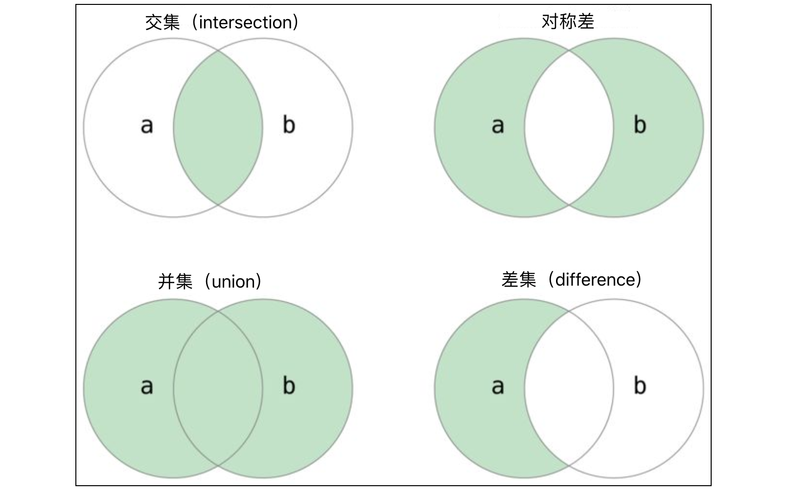

## Yaygın Veri Yapıları: Küme (Set)

> **Translated to Turkish by** himmetcanumutlu

Liste ve demeti öğrendikten sonra, **küme (set)** adında bir kap tipini daha öğrenelim. Küme kelimesine kesinlikle yabancı değilsinizdir; matematik derslerinde bu kavram vardır. **Belirli bir aralıktaki, kesin ve birbirinden ayırt edilebilen şeyleri bir bütün olarak ele alırsak**, bu bütün bir kümedir; kümedeki her şeye kümenin **elemanı** denir. Genellikle kümenin şu koşulları sağlaması gerekir:

1. **Sırasızlık**: Bir kümede her elemanın konumu eşittir; elemanlar arasında sıra yoktur.
2. **Teklik (ayrıklık)**: Bir kümede hiçbir iki eleman aynı değildir; yani bir eleman kümede yalnızca bir kez bulunabilir.
3. **Belirlilik**: Bir küme ve herhangi bir eleman verildiğinde, o eleman ya kümeye aittir ya da ait değildir; ikisinden biri kesinlikle doğrudur, belirsiz bir duruma izin verilmez.

Python programındaki küme ile matematikteki küme arasında esaslı bir fark yoktur; vurgulanması gereken, yukarıda sözünü ettiğimiz sırasızlık ve tekliktir. Sırasızlık, kümedeki elemanların listedeki elemanlar gibi bir sırasının olmadığını ve indeksleme işlemiyle herhangi bir elemana erişilemeyeceğini ifade eder; **küme, indeksleme işlemini desteklemez**. Ayrıca kümenin tekliği, **kümede yinelenen eleman bulunamayacağını** belirler; bu da kümeyi listeden ayıran noktadır; yinelenen bir elemanı kümeye ekleyemeyiz. Küme tipi doğal olarak `in` ve `not in` üyelik işlemlerini destekler; böylece bir elemanın kümeye ait olup olmadığını belirleyebiliriz; yani yukarıda sözünü ettiğimiz belirlilik özelliği budur. **Kümenin üyelik işlemi performans açısından listenin üyelik işleminden üstündür**; bunu kümenin alt seviye saklama özellikleri belirler. Bu konuyu şimdilik tartışmayacağız; bu sonucu aklınızda tutmanız yeterli.

> **Not**: Küme, alt seviyede karma (hash) depolama kullanır. Karma depolamayı bilmeyenler, "Hello Algo" sitesindeki [karma tablo](https://www.hello-algo.com/chapter_hashing/) anlatımına bakabilir; yazarın açık kaynak ruhu için teşekkürler.

### Küme Oluşturmak

Python'da küme oluşturmak için `{}` hazır değer sözdizimi kullanılabilir; `{}` içinde en az bir eleman olmalıdır, çünkü elemansız `{}` boş küme değil, boş bir sözlüktür (sözlük tipini bir sonraki derste anlatacağız). Elbette Python'un yerleşik `set` fonksiyonuyla da küme oluşturulabilir; doğrusu `set` bir fonksiyon değil, küme nesnesi oluşturan bir kurucudur; bu bilgiyi nesne yönelimli programlamayı anlatırken işleyeceğiz. `set` fonksiyonuyla boş bir küme oluşturabilir ya da diğer dizileri kümeye dönüştürebilirsiniz; örneğin `set('hello')`, `4` karakter içeren bir küme verir (yinelenen `l` karakteri kümede yalnızca bir kez bulunur). Bu iki yöntemin dışında, daha önce liste oluşturmak için kullandığımız anlama sözdizimiyle de küme oluşturulabilir.

```python
set1 = {1, 2, 3, 3, 3, 2}
print(set1)

set2 = {'banana', 'pitaya', 'apple', 'apple', 'banana', 'grape'}
print(set2)

set3 = set('hello')
print(set3)

set4 = set([1, 2, 2, 3, 3, 3, 2, 1])
print(set4)

set5 = {num for num in range(1, 20) if num % 3 == 0 or num % 7 == 0}
print(set5)
```

Hatırlatmak gerekir ki kümedeki elemanlar `hashable` (karma hesaplanabilir) tipte olmalıdır. `hashable` tip, karma kodu hesaplanabilen veri tipidir; genellikle değiştirilemez tipler `hashable` tiptir; tam sayı (`int`), kayan noktalı sayı (`float`), mantıksal değer (`bool`), string (`str`), demet (`tuple`) gibi. Değiştirilebilir tipler `hashable` değildir; çünkü değiştirilebilir tiplerin belirli bir karma kodu hesaplanamaz, bu yüzden kümeye konamazlar. Örneğin listeyi kümenin elemanı yapamayız; aynı şekilde kümenin kendisi de değiştirilebilir bir tip olduğundan, küme de kümenin elemanı olamaz. İç içe liste (elemanları da liste olan liste) oluşturabiliriz ama iç içe küme oluşturamayız; küme kullanırken buna dikkat etmelisiniz.

> **Dostça uyarı**: Yukarıda sözü edilen karma kod ve karma depolama kavramlarını anlamadıysanız şimdilik bırakabilirsiniz; çünkü bunlar Python dilini öğrenmeye ve kullanmaya devam etmenizi engellemez. Elbette bilgisayar bölümünde okuyanlar için karma depolamayı anlamamak pek affedilebilir değil; hemen konuyu çalışmalısınız.

### Elemanlar Üzerinde Gezinme

Kümede kaç eleman olduğunu `len` fonksiyonuyla öğrenebiliriz; ancak kümedeki elemanların belirli bir sırası olmadığından, indeksleme işlemiyle gezinemeyiz. Elbette küme elemanları üzerinde gezinmek için yine `for-in` döngüsünü kullanabiliriz; kod aşağıdaki gibidir.

```python
set1 = {'Python', 'C++', 'Java', 'Kotlin', 'Swift'}
for elem in set1:
    print(elem)
```

> **İpucu**: Yukarıdaki kodun çıktısına bakın; kelimelerin çıktı sırasından kümenin sırasızlığını hissedebilirsiniz.

### Küme İşlemleri

Python, küme tipi için çok zengin işlemler sunar; başlıcaları şunlardır: üyelik işlemi, kesişim, birleşim, fark işlemi ve karşılaştırma işlemi (eşitlik, alt küme, üst küme) vb.

#### Üyelik İşlemi

Bir elemanın kümede olup olmadığını `in` ve `not in` üyelik işlemleriyle kontrol edebiliriz; kod aşağıdaki gibidir.

```python
set1 = {11, 12, 13, 14, 15}
print(10 in set1)      # False 
print(15 in set1)      # True
set2 = {'Python', 'Java', 'C++', 'Swift'}
print('Ruby' in set2)  # False
print('Java' in set2)  # True
```

#### İkili İşlemler

Kümenin ikili işlemleri esas olarak kesişim, birleşim, fark ve simetrik fark gibi işlemlerdir; bu işlemler operatörlerle ya da küme tipinin metotlarıyla yapılabilir; kod aşağıdaki gibidir.



```python
set1 = {1, 2, 3, 4, 5, 6, 7}
set2 = {2, 4, 6, 8, 10}

# Kesişim
print(set1 & set2)                      # {2, 4, 6}
print(set1.intersection(set2))          # {2, 4, 6}

# Birleşim
print(set1 | set2)                      # {1, 2, 3, 4, 5, 6, 7, 8, 10}
print(set1.union(set2))                 # {1, 2, 3, 4, 5, 6, 7, 8, 10}

# Fark
print(set1 - set2)                      # {1, 3, 5, 7}
print(set1.difference(set2))            # {1, 3, 5, 7}

# Simetrik fark
print(set1 ^ set2)                      # {1, 3, 5, 7, 8, 10}
print(set1.symmetric_difference(set2))  # {1, 3, 5, 7, 8, 10}
```

Yukarıdaki koddan da görülebileceği gibi, iki kümenin kesişimini almak için `&` operatörü ile `intersection` metodu tamamen aynı işi yapar; operatörü kullanmak açıkça daha sezgiseldir ve kod daha kısadır. Belirtmek gerekir ki kümenin ikili işlemleri atama işlemiyle birleşerek bileşik atama işlemleri oluşturabilir; örneğin `set1 |= set2`, `set1 = set1 | set2`'ye denktir ve `|=` ile aynı işi yapan metod `update`'tir; `set1 &= set2`, `set1 = set1 & set2`'ye denktir ve `&=` ile aynı işi yapan metod `intersection_update`'tir; kod aşağıdaki gibidir.

```python
set1 = {1, 3, 5, 7}
set2 = {2, 4, 6}
set1 |= set2
# set1.update(set2)
print(set1)  # {1, 2, 3, 4, 5, 6, 7}
set3 = {3, 6, 9}
set1 &= set3
# set1.intersection_update(set3)
print(set1)  # {3, 6}
set2 -= set1
# set2.difference_update(set1)
print(set2)  # {2, 4}
```

#### Karşılaştırma İşlemi

İki kümenin eşitliğini `==` ve `!=` ile belirleyebiliriz; iki kümedeki elemanlar tamamen aynıysa `==` karşılaştırmasının sonucu `True`, aksi halde `False` olur. Küme `A`'nın her elemanı küme `B`'nin elemanıysa, küme `A`'ya küme `B`'nin **alt kümesi** denir; yani $\small{\forall{a} \in {A}}$ için $\small{{a} \in {B}}$ ise $\small{{A} \subseteq {B}}$ olur; `A`, `B`'nin alt kümesidir; tersinden `B`, `A`'nın **üst kümesidir**. `A`, `B`'nin alt kümesiyse ve `A` `B`'ye eşit değilse, `A`, `B`'nin **öz alt kümesidir**. Python, küme tipi için alt küme ve üst küme belirleme operatörleri sunar; bunlar aslında çok iyi bildiğimiz `<`, `<=`, `>`, `>=` operatörleridir. Elbette kümeler arasındaki ilişkiyi `issubset` ve `issuperset` metotlarıyla da belirleyebiliriz; kod aşağıdaki gibidir.

```python
set1 = {1, 3, 5}
set2 = {1, 2, 3, 4, 5}
set3 = {5, 4, 3, 2, 1}

print(set1 < set2)   # True
print(set1 <= set2)  # True
print(set2 < set3)   # False
print(set2 <= set3)  # True
print(set2 > set1)   # True
print(set2 == set3)  # True

print(set1.issubset(set2))    # True
print(set2.issuperset(set1))  # True
```

> **Not**: Yukarıdaki kodda `set1 < set2`, `set1`'in `set2`'nin öz alt kümesi olup olmadığını; `set1 <= set2`, `set1`'in `set2`'nin alt kümesi olup olmadığını; `set2 > set1` ise `set2`'nin `set1`'in üst kümesi olup olmadığını belirler. Elbette `set1.issubset(set2)` ile `set1`'in `set2`'nin alt kümesi, `set2.issuperset(set1)` ile `set2`'nin `set1`'in üst kümesi olup olmadığını da belirleyebiliriz.

### Küme Metotları

Az önce söylediğimiz gibi Python'daki küme değiştirilebilir bir tiptir; küme metotlarıyla kümeye eleman ekleyebilir veya kümeden eleman silebiliriz.

```python
set1 = {1, 10, 100}

# Eleman ekle
set1.add(1000)
set1.add(10000)
print(set1)  # {1, 100, 1000, 10, 10000}

# Eleman sil
set1.discard(10)
if 100 in set1:
    set1.remove(100)
print(set1)  # {1, 1000, 10000}

# Elemanları temizle
set1.clear()
print(set1)  # set()
```

> **Not**: Eleman silen `remove` metodu, eleman kümede yoksa `KeyError` hatası üretir; bu yüzden yukarıdaki kodda önce üyelik işlemiyle elemanın kümede olup olmadığını kontrol ettik. Küme tipinin bir de `pop` metodu vardır; kümeden rastgele bir eleman siler ve silinen elemanı döndürür (elde eder); `remove` ve `discard` metotları ise yalnızca elemanı siler, silinen elemanı döndürmez.

Küme tipinin `isdisjoint` adında bir metodu da vardır; iki kümenin ortak elemanı olup olmadığını belirler. Ortak eleman yoksa `True`, varsa `False` döndürür; kod aşağıdaki gibidir.

```python
set1 = {'Java', 'Python', 'C++', 'Kotlin'}
set2 = {'Kotlin', 'Swift', 'Java', 'Dart'}
set3 = {'HTML', 'CSS', 'JavaScript'}
print(set1.isdisjoint(set2))  # False
print(set1.isdisjoint(set3))  # True
```

### Değişmez Küme

Python'da bir de değiştirilemez tipte küme vardır; adı `frozenset`'tir. `set` ile `frozenset` arasındaki fark, `list` ile `tuple` arasındaki fark gibidir. `frozenset` değiştirilemez bir tip olduğundan karma kodu hesaplanabilir; bu yüzden `set` içinde eleman olarak kullanılabilir. Eleman ekleyip silme dışında `frozenset`, diğer açılardan `set` ile aynıdır; aşağıdaki kod `frozenset`'in kullanımını basitçe gösterir.

```python
fset1 = frozenset({1, 3, 5, 7})
fset2 = frozenset(range(1, 6))
print(fset1)          # frozenset({1, 3, 5, 7})
print(fset2)          # frozenset({1, 2, 3, 4, 5})
print(fset1 & fset2)  # frozenset({1, 3, 5})
print(fset1 | fset2)  # frozenset({1, 2, 3, 4, 5, 7})
print(fset1 - fset2)  # frozenset({7})
print(fset1 < fset2)  # False
```

### Özet

Python'daki **küme tipi sırasız bir kaptır**, **yinelenen elemana izin vermez**; alt seviyede karma depolama kullandığından kümedeki elemanlar `hashable` tipte olmalıdır. Küme ile liste arasındaki en büyük fark, **kümedeki elemanların sırasının olmaması**, dolayısıyla **indeksleme işlemiyle elemanlara erişilememesidir**; ancak küme, kesişim, birleşim, fark gibi ikili işlemleri yapabilir ve ilişkisel operatörlerle iki küme arasında üst küme, alt küme gibi ilişkilerin olup olmadığını kontrol edebilir.
