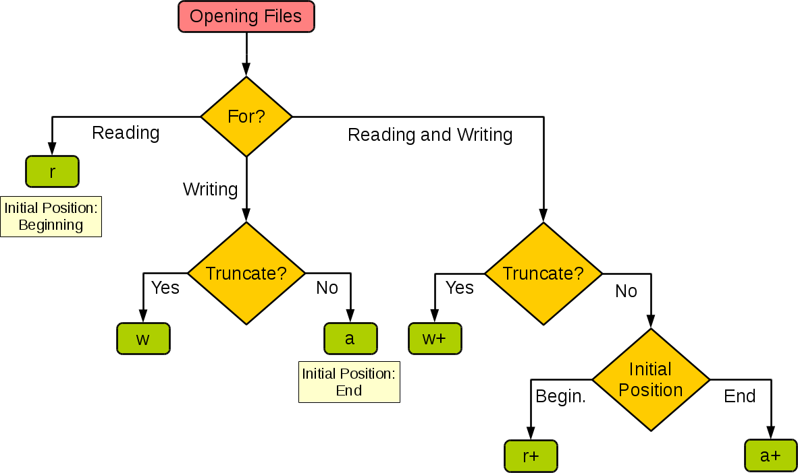

## Dosya Okuma/Yazma ve İstisna Yönetimi

> **Translated to Turkish by** himmetcanumutlu

Gerçek geliştirmede sık sık veriyi kalıcı hale getirme senaryolarıyla karşılaşırız. Kalıcılaştırma (persistence), veriyi uzun süre saklayamayan depolama ortamından (genellikle bellek) uzun süre saklayabilen depolama ortamına (genellikle disk) taşımaktır. Veriyi kalıcılaştırmanın en doğrudan ve basit yolu, **dosya sistemi** aracılığıyla veriyi **dosyaya** kaydetmektir.

Bilgisayarın **dosya sistemi**, bilgisayar verilerini depolayan ve düzenleyen bir yöntemdir; veriye erişmeyi ve veriyi aramayı kolaylaştırır. Dosya sistemi, sabit disk, CD, flash bellek gibi fiziksel aygıtların veri bloğu kavramı yerine **dosya** ve **ağaç yapılı dizin** soyut mantıksal kavramlarını kullanır. Kullanıcı, veriyi kaydetmek için dosya sistemini kullanırken verinin diskin hangi veri bloğunda saklandığıyla ilgilenmez; yalnızca dosyanın yolunu ve adını hatırlaması yeterlidir. Yeni veri yazmadan önce, diskteki hangi veri bloğunun kullanılmadığını bilmeye gerek yoktur; diskteki depolama alanının yönetimi (tahsis ve serbest bırakma) dosya sistemi tarafından otomatik yapılır; kullanıcı yalnızca verinin hangi dosyaya yazıldığını hatırlamalıdır.

### Dosya Açma ve Kapatma

Dosya sistemi sayesinde dosyalar aracılığıyla veri okuyup yazmak çok kolaydır; Python'da dosya işlemi yapmak oldukça basittir. Python'un yerleşik `open` fonksiyonuyla dosya açabiliriz; `open` fonksiyonunu kullanırken, fonksiyonun parametreleriyle **dosya adı**, **işlem modu** ve **karakter kodlaması** gibi bilgileri belirleyip dosya üzerinde okuma/yazma işlemi yapabiliriz. Burada sözü edilen işlem modu, ne tür bir dosya açılacağını (karakter dosyası veya ikili dosya) ve ne tür bir işlem yapılacağını (okuma, yazma veya ekleme) belirtir; aşağıdaki tablodaki gibidir.

| İşlem modu | Anlamı                         |
| -------- | -------------------------------- |
| `'r'`    | Okuma (varsayılan)                    |
| `'w'`    | Yazma (önceki içeriği keser)       |
| `'x'`    | Yazma; dosya zaten varsa hata üretir |
| `'a'`    | Ekleme; içeriği mevcut dosyanın sonuna yazar |
| `'b'`    | İkili (binary) mod                       |
| `'t'`    | Metin modu (varsayılan)                 |
| `'+'`    | Güncelleme (hem okuma hem yazma)         |

Aşağıdaki görsel, programın ihtiyacına göre `open` fonksiyonunun işlem modunun nasıl ayarlanacağını gösterir.



`open` fonksiyonunu kullanırken, açılan dosya bir karakter dosyası (metin dosyası) ise `encoding` parametresiyle dosyayı okurken/yazarken kullanılacak karakter kodlamasını belirleyebilirsiniz. Karakter kodlaması ve karakter kümesi kavramlarını bilmiyorsanız [《Karakter Kümesi ve Karakter Kodlaması》](https://www.cnblogs.com/skynet/archive/2011/05/03/2035105.html) yazısına bakabilirsiniz; burada ayrıntıya girmiyoruz.

`open` fonksiyonuyla dosya başarıyla açıldıktan sonra bir dosya nesnesi döndürülür; bu nesneyle dosya üzerinde okuma/yazma işlemi yapabiliriz. Dosya açılamazsa `open` fonksiyonu istisna üretir; buna birazdan değineceğiz. Açılan dosyayı kapatmak isterseniz, dosya nesnesinin `close` metodunu kullanabilirsiniz; böylece dosya işlemi bitince dosya serbest bırakılır.

### Metin Dosyası Okuma/Yazma

`open` fonksiyonuyla metin dosyası açarken, dosya adını belirtip dosyanın işlem modunu `'r'` yapmamız gerekir; belirtilmezse varsayılan değer de `'r'`'dir. Karakter kodlaması belirtmek gerekirse `encoding` parametresini geçebilirsiniz; belirtilmezse varsayılan değer `None`'dur ve dosya okunurken işletim sisteminin varsayılan kodlaması kullanılır. Hatırlatmak isteriz ki dosyayı kaydederken kullanılan kodlama ile `encoding` parametresinde belirtilen kodlamanın aynı olduğundan emin olamıyorsanız, karakterler çözülemediği için dosya okuma başarısız olabilir.

Aşağıdaki örnek, bir düz metin dosyasının (genellikle yalnızca karakterlerin ham kodlamasından oluşan dosya; zengin metnin aksine düz metin, karakter stili kontrol öğeleri içermez ve en basit metin düzenleyiciyle doğrudan okunabilir) nasıl okunacağını gösterir.

```python
file = open('mese-agacina.txt', 'r', encoding='utf-8')
print(file.read())
file.close()
```

> **Not**: 《Meşe Ağacına》, şair Shu Ting'in Mart 1977'de yazdığı bir aşk şiiridir ve en sevdiğim modern şiirlerden biridir. İçeriği şöyledir:
>
> Seni seviyorsam,
> Asla tırmanan bir sarmaşık gibi değil,
> Yüksek dalına konup gösteriş yapmam;
> Seni seviyorsam,
> Asla sadık bir kuş gibi değil,
> Gölgene monoton şarkılar söylemem;
> Ne de bir pınar gibi,
> Yıl boyu serin teselli taşımam;
> Ne de sarp bir zirve gibi,
> Boyunu artırıp heybetini vurgulamam.
> Hatta güneş ışığı,
> Hatta bahar yağmuru.
>
> Hayır, bunların hiçbiri yetmez!
> Yanında bir kapok ağacı olmalıyım,
> Bir ağaç suretinde durmalıyım seninle.
> Kökler, toprağın altında sımsıkı;
> Yapraklar, bulutlarda birbirine değer.
> Her rüzgâr geçişinde,
> Birbirimizi selamlarız,
> Ama kimse,
> Anlamaz dilimizi.
> Senin tunç dalların, demir gövden var,
> Kılıç gibi, mızrak gibi, süngü gibi de;
> Benim kızıl çiçeklerim var,
> Ağır bir iç çekiş gibi,
> Bir de yiğit meşale gibi.
>
> Soğuk dalgaları, fırtınaları, yıldırımları birlikte göğüsleriz;
> Sisi, akan bulutu, gökkuşağını birlikte paylaşırız.
> Sanki sonsuza dek ayrı,
> Ama ömür boyu birbirine bağlı.
> İşte büyük aşk budur,
> Vefa tam da buradadır:
> Aşk,
> Yalnızca yüce bedenini değil,
> Israr ettiğin konumu da sever,
> Ayaklarının altındaki toprağı da.

Dosya nesnesinin `read` metodunu kullanarak dosyayı okumanın yanı sıra, dosyayı satır satır okumak için `for-in` döngüsünü kullanabilir ya da `readlines` metoduyla dosyayı satırlara ayırıp bir liste kabına okuyabiliriz; kod aşağıdaki gibidir.

```python
file = open('mese-agacina.txt', 'r', encoding='utf-8')
for line in file:
    print(line, end='')
file.close()

file = open('mese-agacina.txt', 'r', encoding='utf-8')
lines = file.readlines()
for line in lines:
    print(line, end='')
file.close()
```

Dosyaya içerik yazmak istiyorsak, dosyayı açarken işlem modu olarak `w` veya `a` kullanabiliriz; birincisi önceki metni kesip yeni içerik yazar, ikincisi ise yeni içeriği mevcut içeriğin sonuna ekler.

```python
file = open('mese-agacina.txt', 'a', encoding='utf-8')
file.write('\nBaşlık: 《Meşe Ağacına》')
file.write('\nYazar: Shu Ting')
file.write('\nTarih: Mart 1977')
file.close()
```

### İstisna Yönetim Mekanizması

Yukarıdaki koda dikkat edin: `open` fonksiyonunda belirtilen dosya yoksa ya da açılamıyorsa istisnai durum oluşur ve program çöker. Kodun sağlam ve hataya dayanıklı olması için **çalışma zamanında sorun çıkarabilecek kodu, Python'un istisna mekanizmasıyla uygun şekilde işleyebiliriz**. Python'da istisnayla ilgili beş anahtar sözcük vardır: `try`, `except`, `else`, `finally` ve `raise`. Önce aşağıdaki koda bakalım, sonra bu anahtar sözcüklerin kullanımını anlatalım.

```python
file = None
try:
    file = open('mese-agacina.txt', 'r', encoding='utf-8')
    print(file.read())
except FileNotFoundError:
    print('Belirtilen dosya açılamıyor!')
except LookupError:
    print('Bilinmeyen bir kodlama belirtildi!')
except UnicodeDecodeError:
    print('Dosya okunurken kod çözme hatası!')
finally:
    if file:
        file.close()
```

Python'da, çalışma zamanında sorun çıkarabilecek kodu `try` bloğuna koyabiliriz; `try`'den sonra istisnayı yakalayıp ilgili işlemi yapmak için bir veya daha fazla `except` bloğu gelebilir. Örneğin yukarıdaki kodda dosya bulunamazsa `FileNotFoundError`, bilinmeyen kodlama belirtilirse `LookupError`, dosya okunurken belirtilen kodlamayla çözülemezse `UnicodeDecodeError` oluşur; bu yüzden `try`'den sonra bu üç farklı istisnai durumu ayrı ayrı işleyen üç `except` bloğu koyduk. `except`'ten sonra `else` bloğu da eklenebilir; bu, `try` içindeki kodda istisna oluşmadığında çalıştırılacak koddur; `else` içindeki kod istisna yakalamaz; yani istisnai bir durumla karşılaşılırsa program istisna nedeniyle sonlanır ve istisna bilgisi bildirilir. Son olarak `finally` bloğuyla açılan dosyayı kapatıp programda edinilen dış kaynağı serbest bırakırız. `finally` bloğundaki kod, program normal de olsa istisna da olsa çalışır; hatta `sys` modülünün `exit` fonksiyonu çağrılıp Python programı sonlandırılsa bile `finally` bloğundaki kod yine çalışır (çünkü `exit` fonksiyonunun özü, `SystemExit` istisnası üretmektir). Bu yüzden `finally` bloğuna "her zaman çalışan kod bloğu" deriz; dış kaynakları serbest bırakmak için en uygun yerdir.

Python'da çok sayıda yerleşik istisna tipi vardır; yukarıdaki kodda kullanılan istisna tipleri ve önceki derslerde karşılaştığımız istisna tiplerinin dışında daha birçok istisna tipi vardır; kalıtım yapısı aşağıdaki gibidir.

```
BaseException
 +-- SystemExit
 +-- KeyboardInterrupt
 +-- GeneratorExit
 +-- Exception
      +-- StopIteration
      +-- StopAsyncIteration
      +-- ArithmeticError
      |    +-- FloatingPointError
      |    +-- OverflowError
      |    +-- ZeroDivisionError
      +-- AssertionError
      +-- AttributeError
      +-- BufferError
      +-- EOFError
      +-- ImportError
      |    +-- ModuleNotFoundError
      +-- LookupError
      |    +-- IndexError
      |    +-- KeyError
      +-- MemoryError
      +-- NameError
      |    +-- UnboundLocalError
      +-- OSError
      |    +-- BlockingIOError
      |    +-- ChildProcessError
      |    +-- ConnectionError
      |    |    +-- BrokenPipeError
      |    |    +-- ConnectionAbortedError
      |    |    +-- ConnectionRefusedError
      |    |    +-- ConnectionResetError
      |    +-- FileExistsError
      |    +-- FileNotFoundError
      |    +-- InterruptedError
      |    +-- IsADirectoryError
      |    +-- NotADirectoryError
      |    +-- PermissionError
      |    +-- ProcessLookupError
      |    +-- TimeoutError
      +-- ReferenceError
      +-- RuntimeError
      |    +-- NotImplementedError
      |    +-- RecursionError
      +-- SyntaxError
      |    +-- IndentationError
      |         +-- TabError
      +-- SystemError
      +-- TypeError
      +-- ValueError
      |    +-- UnicodeError
      |         +-- UnicodeDecodeError
      |         +-- UnicodeEncodeError
      |         +-- UnicodeTranslateError
      +-- Warning
           +-- DeprecationWarning
           +-- PendingDeprecationWarning
           +-- RuntimeWarning
           +-- SyntaxWarning
           +-- UserWarning
           +-- FutureWarning
           +-- ImportWarning
           +-- UnicodeWarning
           +-- BytesWarning
           +-- ResourceWarning
```

Yukarıdaki kalıtım yapısından görülebileceği gibi, Python'daki tüm istisnalar `BaseException`'ın alt tipidir; onun dört doğrudan alt sınıfı vardır: `SystemExit`, `KeyboardInterrupt`, `GeneratorExit` ve `Exception`. `SystemExit`, yorumlayıcının çıkmayı istediğini; `KeyboardInterrupt`, kullanıcının programı kesintiye uğrattığını (`Ctrl+c`'ye bastığını); `GeneratorExit` ise üretecin istisna oluştuğunda çıkışı bildirdiğini gösterir. Bu istisnaları anlamadıysanız sorun değil, öğrenmeye devam edin. Öne çıkan `Exception` sınıfı, olağan istisna tiplerinin üst tipidir; birçok istisna doğrudan ya da dolaylı olarak `Exception` sınıfından kalıtım alır. Python'un yerleşik istisna tipleri uygulamanın ihtiyacını karşılamıyorsa, kendi istisna tipimizi tanımlayabiliriz; özel istisna tipi de doğrudan ya da dolaylı olarak `Exception` sınıfından kalıtım almalıdır; elbette ihtiyaca göre metotları yeniden yazabilir veya ekleyebilirsiniz.

Python'da `raise` anahtar sözcüğüyle istisna fırlatabilir (istisna nesnesi fırlatabilir), çağıran taraf da `try...except...` yapısıyla istisnayı yakalayıp işleyebilir. Örneğin fonksiyonda, fonksiyonun çalışma koşulu sağlanmadığında, sorunun nerede olduğunu çağırana bildirmek için istisna fırlatılabilir; çağıran da istisnayı yakalayıp işleyerek kodun istisnadan kurtulmasını sağlar. İstisna tanımlama ve fırlatma kodu aşağıdaki gibidir.

```python
class InputError(ValueError):
    """Özel istisna tipi"""
    pass


def fac(num):
    """Faktöriyel hesapla"""
    if num < 0:
        raise InputError('Yalnızca negatif olmayan tam sayıların faktöriyeli hesaplanabilir')
    if num in (0, 1):
        return 1
    return num * fac(num - 1)
```

Faktöriyel hesaplayan `fac` fonksiyonunu çağırıp `try...except...` yapısıyla hatalı girdi istisnasını yakalayalım ve istisna nesnesini yazdıralım (istisna bilgisini gösterelim); girdi doğruysa faktöriyeli hesaplayıp programı bitirelim.

```python
flag = True
while flag:
    num = int(input('n = '))
    try:
        print(f'{num}! = {fac(num)}')
        flag = False
    except InputError as err:
        print(err)
```

### Bağlam Yöneticisi Sözdizimi

`open` fonksiyonunun döndürdüğü dosya nesnesi için, `with` bağlam yöneticisi sözdizimini de kullanabiliriz; dosya işlemi bittikten sonra dosya nesnesinin `close` metodu otomatik çalıştırılır. Böylece kod daha sade ve zarif olur; çünkü dosyayı kapatıp kaynağı serbest bırakmak için artık `finally` bloğu yazmaya gerek kalmaz. Hatırlatmak isteriz ki her nesne `with` bağlam sözdizimine konamaz; yalnızca **bağlam yöneticisi protokolüne** uyan (`__enter__` ve `__exit__` sihirli metotlarına sahip) nesneler bu sözdizimini kullanabilir. Python standart kütüphanesindeki `contextlib` modülü de `with` bağlam sözdizimini destekler; kullanacağımız yerde anlatacağız.

`with` bağlam sözdizimiyle yeniden yazılan kod aşağıdaki gibidir.

```python
try:
    with open('mese-agacina.txt', 'r', encoding='utf-8') as file:
        print(file.read())
except FileNotFoundError:
    print('Belirtilen dosya açılamıyor!')
except LookupError:
    print('Bilinmeyen bir kodlama belirtildi!')
except UnicodeDecodeError:
    print('Dosya okunurken kod çözme hatası!')
```

### İkili Dosya Okuma/Yazma

İkili dosya okuma/yazma, metin dosyası okuma/yazmaya benzer; ancak dikkat edilmesi gereken nokta, `open` fonksiyonuyla dosya açarken okuma işlemi için işlem modunun `'rb'`, yazma işlemi için ise `'wb'` olmasıdır. Ayrıca metin dosyası okurken/yazarken `read` metodunun dönüş değeri ile `write` metodunun parametresi `str` nesnesi (string) iken, ikili dosya okurken/yazarken `read` metodunun dönüş değeri ile `write` metodunun parametresi `bytes-like` nesnedir (bayt dizisi). Aşağıdaki kod, mevcut yoldaki `guido.jpg` adlı görsel dosyasını `guido-kopya.jpg` dosyasına kopyalar.

```python
try:
    with open('guido.jpg', 'rb') as file1:
        data = file1.read()
    with open('guido-kopya.jpg', 'wb') as file2:
        file2.write(data)
except FileNotFoundError:
    print('Belirtilen dosya açılamıyor.')
except IOError:
    print('Dosya okunurken/yazılırken hata oluştu.')
print('Program sona erdi.')
```

Kopyalanacak görsel dosyası çok büyükse, dosya içeriğini bir kerede belleğe okumak çok büyük bellek tüketimine yol açabilir; bellek kullanımını azaltmak için `read` metoduna `size` parametresi verip her seferde okunacak bayt sayısını belirleyebilir, döngüyle okuyup yazarak yukarıdaki işlemi tamamlayabiliriz; kod aşağıdaki gibidir.

```python
try:
    with open('guido.jpg', 'rb') as file1, open('guido-kopya.jpg', 'wb') as file2:
        data = file1.read(512)
        while data:
            file2.write(data)
            data = file1.read()
except FileNotFoundError:
    print('Belirtilen dosya açılamıyor.')
except IOError:
    print('Dosya okunurken/yazılırken hata oluştu.')
print('Program sona erdi.')
```

###  Özet

Dosya okuma/yazma işlemiyle veriyi kalıcılaştırabiliriz. Python'da `open` fonksiyonuyla dosya nesnesi elde edilebilir; dosya nesnesinin `read` ve `write` metotlarıyla dosya okuma/yazma işlemi gerçekleştirilebilir. Program çalışırken öngörülemeyen istisnai durumlarla karşılaşabilir; bu durumları Python'un istisna mekanizmasıyla işleyebiliriz. Python'un istisna mekanizması esas olarak `try`, `except`, `else`, `finally` ve `raise` olmak üzere beş çekirdek anahtar sözcükten oluşur. `try`'den sonraki `except` deyimi zorunlu değildir; `finally` deyimi de zorunlu değildir; ancak ikisinden birinin mutlaka bulunması gerekir. `except` deyimi bir veya daha fazla olabilir; birden çok `except`, yazım sırasına göre belirtilen istisnayla sırayla eşleşir; istisna zaten işlendiyse sonraki `except` deyimlerine girilmez. `except` deyiminde demet kullanarak aynı anda birden çok istisna tipi de yakalanabilir. `except` deyiminden sonra istisna tipi belirtilmezse varsayılan olarak tüm istisnalar yakalanır. İstisna yakalandıktan sonra `raise` ile yeniden fırlatılabilir; ancak aynı istisnayı yakalayıp yeniden fırlatmak önerilmez. Mantığı bilmeden tüm istisnaları yakalamak önerilmez; bu, programdaki ciddi sorunları gizleyebilir. Son olarak vurgulayalım: **normal iş mantığını yürütmek veya program akışını kontrol etmek için istisna mekanizmasını kullanmayın**; basitçe söylemek gerekirse istisna mekanizmasını kötüye kullanmayın; bu, yeni başlayanların sık yaptığı bir hatadır.
