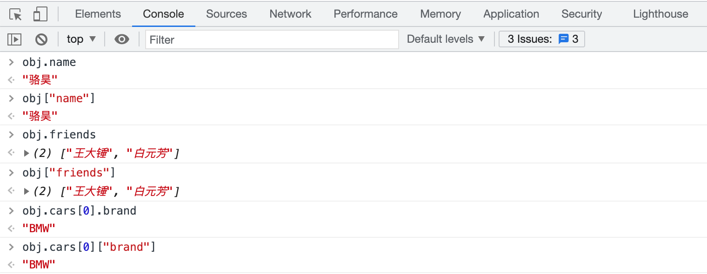
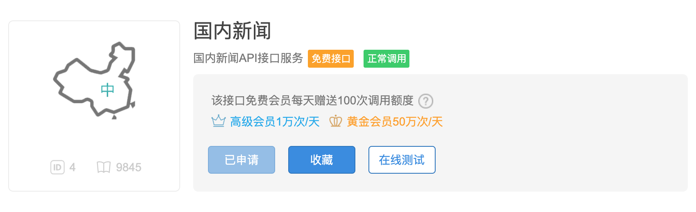
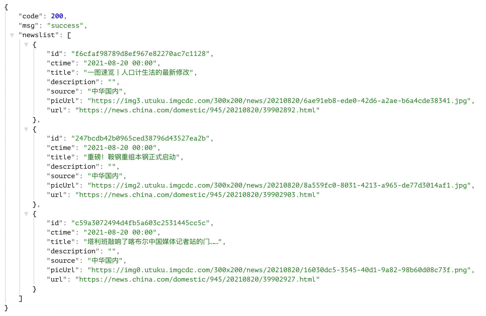

## Nesnelerin Serileştirilmesi ve Serileştirmeden Çıkarılması

> **Translated to Turkish by** himmetcanumutlu

### JSON'a Genel Bakış

Yukarıdaki anlatımla, metin ve ikili veriyi dosyaya nasıl kaydedeceğimizi öğrendik. O halde bir soru daha var: bir liste ya da sözlükteki veriyi dosyaya kaydetmek istersek ne yapmalıyız? Python'da programdaki veriyi JSON biçiminde kaydedebiliriz. JSON, "JavaScript Object Notation"ın kısaltmasıdır; aslında JavaScript dilinde nesne oluşturmak için kullanılan bir hazır değer sözdizimiydi; bugün diller ve platformlar arası veri alışverişinde yaygın olarak kullanılmaktadır. JSON kullanmamızın nedeni çok basittir: yapısı kompakttır ve düz metindir; her işletim sistemi ve programlama dili düz metni işleyebilir; bu da **diller ve platformlar arası veri alışverişinin** ön koşuludur. Günümüzde JSON, **heterojen sistemler arasında veri alışverişinin fiili standardı** olarak XML'in (Genişletilebilir İşaretleme Dili) yerini büyük ölçüde almıştır. [JSON'un resmî sitesinde](https://www.json.org/json-zh.html) JSON hakkında daha fazla bilgi bulabilirsiniz; bu site, her dilin JSON veri biçimini işlemek için kullanabileceği araçları ve üçüncü taraf kütüphaneleri de sunar.

```JavaScript
{
    name: "骆昊",
    age: 40,
    friends: ["Ahmet Yılmaz", "Ali Yıldız"],
    cars: [
        {"brand": "BMW", "max_speed": 240},
        {"brand": "Benz", "max_speed": 280},
        {"brand": "Audi", "max_speed": 280}
    ]
}
```

Yukarıdaki, JSON'un basit bir örneğidir; fark etmişsinizdir ki Python'daki sözlüğe çok benzer ve iç içe yapıyı destekler; tıpkı Python sözlüğündeki değerin başka bir sözlük olabilmesi gibi. Aşağıdaki kodu tarayıcının konsoluna girmeyi deneyebiliriz (Chrome tarayıcısı için "Diğer araçlar" menüsünden "Geliştirici araçları" alt menüsünü bulup tarayıcının konsolunu açabilirsiniz). Tarayıcı konsolu, JavaScript kodu çalıştırmak için etkileşimli bir ortam sunar (Python'un etkileşimli ortamına benzer); aşağıdaki kod bir JavaScript nesnesi oluşturur ve onu `obj` adlı değişkene atar.

```JavaScript
let obj = {
    name: "骆昊",
    age: 40,
    friends: ["Ahmet Yılmaz", "Ali Yıldız"],
    cars: [
        {"brand": "BMW", "max_speed": 240},
        {"brand": "Benz", "max_speed": 280},
        {"brand": "Audi", "max_speed": 280}
    ]
}
```


Yukarıdaki `obj`, JavaScript'te bir nesnedir; `obj.name` veya `obj["name"]` olmak üzere iki yolla `name`'e karşılık gelen değere ulaşabiliriz; aşağıdaki gibidir. Fark edilebileceği gibi, `obj["name"]` ile veri alma biçimi, Python sözlüğünde anahtarla değer alan indeksleme işlemiyle tamamen aynıdır; Python'da da `json` adlı modül, sözlük ile JSON arasında çift yönlü dönüşümü destekler.



JSON'da kullandığımız veri tipleri (JavaScript veri tipleri) ile Python'daki veri tipleri arasındaki karşılığı bulmak da kolaydır; aşağıdaki iki tabloya bakabilirsiniz.

Tablo 1: JavaScript veri tiplerinin (değerlerinin) Python veri tiplerine (değerlerine) karşılığı

| JSON         | Python       |
| ------------ | ------------ |
| `object`      |`dict`|
| `array`      |`list`|
| `string`     | `str`        |
| `number ` |`int` / `float`|
| `number` (gerçek)   |`float`|
| `boolean` (`true` / `false`) | `bool` (`True` / `False`) |
| `null`       | `None`       |

Tablo 2: Python veri tiplerinin (değerlerinin) JavaScript veri tiplerine (değerlerine) karşılığı

| Python                      | JSON                         |
| --------------------------- | ---------------------------- |
| `dict`                      | `object`                     |
| `list` / `tuple`            | `array`                      |
| `str`                       | `string`                     |
| `int` / `float`             | `number`                     |
| `bool` （`True` / `False`） | `boolean` (`true` / `false`) |
| `None`                      | `null`                       |

### JSON Biçimindeki Verileri Okuma/Yazma

Python'da bir sözlüğü JSON biçimine (string olarak) dönüştürmek istiyorsanız `json` modülünün `dumps` fonksiyonunu kullanabilirsiniz; kod aşağıdaki gibidir.

```python
import json

my_dict = {
    'name': '骆昊',
    'age': 40,
    'friends': ['Ahmet Yılmaz', 'Ali Yıldız'],
    'cars': [
        {'brand': 'BMW', 'max_speed': 240},
        {'brand': 'Audi', 'max_speed': 280},
        {'brand': 'Benz', 'max_speed': 280}
    ]
}
print(json.dumps(my_dict))
```

Yukarıdaki kodu çalıştırınca çıktı aşağıdaki gibidir; Çince karakterlerin Unicode kodlamayla gösterildiği fark edilebilir.

```JSON
{"name": "骆昊", "age": 40, "friends": ["王大锤", "白元芳"], "cars": [{"brand": "BMW", "max_speed": 240}, {"brand": "Audi", "max_speed": 280}, {"brand": "Benz", "max_speed": 280}]}
```

Bir sözlüğü JSON biçimine dönüştürüp metin dosyasına yazmak istiyorsanız, `dumps` fonksiyonunu `dump` fonksiyonuyla değiştirip dosya nesnesini geçmeniz yeterlidir; kod aşağıdaki gibidir.

```python
import json

my_dict = {
    'name': '骆昊',
    'age': 40,
    'friends': ['Ahmet Yılmaz', 'Ali Yıldız'],
    'cars': [
        {'brand': 'BMW', 'max_speed': 240},
        {'brand': 'Audi', 'max_speed': 280},
        {'brand': 'Benz', 'max_speed': 280}
    ]
}
with open('data.json', 'w') as file:
    json.dump(my_dict, file)
```

Yukarıdaki kodu çalıştırınca `data.json` dosyası oluşturulur; dosyanın içeriği, yukarıdaki kodun çıktısıyla aynıdır.

`json` modülünün dört önemli fonksiyonu vardır:

- `dump` - Python nesnesini JSON biçiminde dosyaya serileştirir
- `dumps` - Python nesnesini JSON biçiminde string'e dönüştürür
- `load` - Dosyadaki JSON verisini nesneye serileştirmeden çıkarır
- `loads` - String içeriğini Python nesnesine serileştirmeden çıkarır

Burada iki kavram ortaya çıktı: biri serileştirme, diğeri serileştirmeden çıkarma. [Vikipedi](https://zh.wikipedia.org/)'deki açıklama şöyledir: "Serileştirme (serialization), bilgisayar bilimindeki veri işlemede, veri yapısını veya nesne durumunu saklanabilir ya da aktarılabilir bir biçime dönüştürmektir; böylece gerektiğinde eski durumuna geri döndürülebilir ve serileştirilmiş veriden baytlar yeniden alındığında, bu baytlar kullanılarak asıl nesnenin kopyası üretilebilir. Bu işlemin tersi, yani bir dizi bayttan veri yapısını çıkarma işlemi ise serileştirmeden çıkarmadır (deserialization)."

Aşağıdaki kodla yukarıda oluşturduğumuz `data.json` dosyasını okuyup JSON biçimindeki veriyi Python'daki sözlüğe geri dönüştürebiliriz.

```python
import json

with open('data.json', 'r') as file:
    my_dict = json.load(file)
    print(type(my_dict))
    print(my_dict)
```

### Paket Yönetim Aracı pip

Python standart kütüphanesindeki `json` modülü, veri serileştirme ve serileştirmeden çıkarmada performans açısından pek ideal değildir; bu sorunu çözmek için `json` yerine üçüncü taraf `ujson` kütüphanesi kullanılabilir. Üçüncü taraf kütüphane, şirket içinde geliştirilip kullanılmayan ve resmî standart kütüphaneden gelmeyen Python modülleridir; bu modüller genellikle başka şirketler, kuruluşlar veya kişiler tarafından geliştirilir; bu yüzden üçüncü taraf kütüphane denir. Python dilinin standart kütüphanesi geliştirmemizi kolaylaştıran birçok modül sunsa da, güçlü bir dil için ekosisteminin de çok zengin olması kaçınılmazdır.

Python yorumlayıcısını kurarken varsayılan olarak pip kurulumu işaretlenmiştir; komut isteminde veya terminalde `pip --version` ile pip'in kurulu olup olmadığını kontrol edebilirsiniz. Pip, Python'un paket yönetim aracıdır; pip ile Python'un üçüncü taraf kütüphanelerini veya araçlarını arayabilir, kurabilir, kaldırabilir ve güncelleyebilirsiniz. Örneğin `json` modülünün yerine kullanılacak `ujson`'u kurmak için aşağıdaki komutu kullanabilirsiniz.

```Bash
pip install ujson
```

Varsayılan olarak pip, üçüncü taraf kütüphanelerle ilgili verileri almak için `https://pypi.org/simple/` adresine erişir; ancak Çin'den bu siteye erişim hızı pek iyi olmadığından, Çin'deki kullanıcılar bu varsayılan indirme kaynağı yerine Douban veya Tsinghua Üniversitesi tarafından sağlanan aynaları kullanabilir; üçüncü taraf kütüphane kurulumu şu komutlarla yapılır.

```Bash
pip config set global.index-url https://pypi.doubanio.com/simple
pip install ujson
```

`pip search` komutuyla ada göre gerekli üçüncü taraf kütüphaneyi arayabilir, `pip list` komutuyla kurulu üçüncü taraf kütüphaneleri görebilirsiniz. Bir üçüncü taraf kütüphaneyi güncellemek istiyorsanız `pip install -U` veya `pip install --upgrade` kullanabilirsiniz; silmek istiyorsanız `pip uninstall` komutunu kullanabilirsiniz.

`ujson` üçüncü taraf kütüphanesini arama.

```Bash
pip search ujson

micropython-cpython-ujson (0.2)  - MicroPython module ujson ported to CPython
pycopy-cpython-ujson (0.2)       - Pycopy module ujson ported to CPython
ujson (3.0.0)                    - Ultra fast JSON encoder and decoder for Python
ujson-bedframe (1.33.0)          - Ultra fast JSON encoder and decoder for Python
ujson-segfault (2.1.57)          - Ultra fast JSON encoder and decoder for Python. Continuing 
                                   development.
ujson-ia (2.1.1)                 - Ultra fast JSON encoder and decoder for Python (Internet 
                                   Archive fork)
ujson-x (1.37)                   - Ultra fast JSON encoder and decoder for Python
ujson-x-legacy (1.35.1)          - Ultra fast JSON encoder and decoder for Python
drf_ujson (1.2)                  - Django Rest Framework UJSON Renderer
drf-ujson2 (1.6.1)               - Django Rest Framework UJSON Renderer
ujsonDB (0.1.0)                  - A lightweight and simple database using ujson.
fast-json (0.3.2)                - Combines best parts of json and ujson for fast serialization
decimal-monkeypatch (0.4.3)      - Python 2 performance patches: decimal to cdecimal, json to 
                                   ujson for psycopg2
```

Kurulu üçüncü taraf kütüphaneleri görüntüleme.

```Bash
pip list

Package                       Version
----------------------------- ----------
aiohttp                       3.5.4
alipay                        0.7.4
altgraph                      0.16.1
amqp                          2.4.2
...							  ...
```

`ujson` üçüncü taraf kütüphanesini güncelleme.

```Bash
pip install -U ujson
```

`ujson` üçüncü taraf kütüphanesini silme.

```Bash
pip uninstall -y ujson
```

> **İpucu**: pip'in kendisini güncellemek istiyorsanız, macOS için `pip install -U pip` komutunu kullanabilirsiniz. Windows'ta komutu `python -m pip install -U --user pip` olarak değiştirebilirsiniz.

### Ağ API'si ile Veri Alma

Kendi programımızda hava durumu, trafik, uçuş gibi bilgileri göstermek istiyorsak, bu bilgileri kendimiz sağlayamayız; bu yüzden ağ veri hizmetlerini kullanmamız gerekir. Günümüzde ağ veri hizmetlerinin (veya ağ API'lerinin) büyük çoğunluğu [HTTP](https://zh.wikipedia.org/wiki/%E8%B6%85%E6%96%87%E6%9C%AC%E4%BC%A0%E8%BE%93%E5%8D%8F%E8%AE%AE) veya HTTPS üzerinden JSON biçiminde veri sunar. Python programıyla belirtilen URL'ye (Tekdüzen Kaynak Bulucu) HTTP isteği gönderebiliriz; bu URL, sözünü ettiğimiz ağ API'sidir. İstek başarılı olursa HTTP yanıtı döner; HTTP yanıtının mesaj gövdesinde ihtiyacımız olan JSON biçimindeki veri bulunur. HTTP hakkında bilgi için Ruan Yifeng'in [《HTTP Protokolüne Giriş》](http://www.ruanyifeng.com/blog/2016/08/http.html) yazısına bakabilirsiniz.

Çin'de ağ API arayüzü sunan birçok site vardır; örneğin [Juhe](https://www.juhe.cn/) ve [Baidu AI Cloud](https://apis.baidu.com/) gibi; bu sitelerde ücretsiz ve ücretli veri arayüzleri bulunur; yurt dışındaki [{API}Search](http://apis.io/) sitesi de benzer işlev sunar; merak edenler kendileri inceleyebilir. Aşağıdaki örnek, [`requests`](http://docs.python-requests.org/zh_CN/latest/) kütüphanesini (HTTP üzerinden ağ kaynağına erişen üçüncü taraf kütüphane) kullanarak ağ API'sine erişip Çin'deki haberleri çekmeyi ve haber başlıklarını ve bağlantılarını göstermeyi gösterir. Bu örnekte [Tianapi](https://www.tianapi.com/) adlı sitenin sunduğu Çin haberleri veri arayüzünü kullandık; buradaki kimlik (API Key) bilgisini kendiniz sitede kayıt olup başvurmanız gerekir. Tianapi sitesinde kayıt olduktan sonra API Key otomatik atanır; ancak arayüze erişip veri almak için doğrulama e-postası veya cep telefonu bağlamanız, ardından kullanacağınız arayüz için başvuru yapmanız gerekir; aşağıdaki gibidir.



Python ile URL üzerinden ağa bağlanırken `requests` üçüncü taraf kütüphanesini kullanmanızı öneririz; hem basittir hem güçlüdür; ancak kendiniz kurmanız gerekir.

```Bash
pip install requests
```

Çin'deki haberleri çekip haber başlıklarını ve bağlantılarını gösterme.

```python
import requests

resp = requests.get('http://api.tianapi.com/guonei/?key=APIKey&num=10')
if resp.status_code == 200:
    data_model = resp.json()
    for news in data_model['newslist']:
        print(news['title'])
        print(news['url'])
        print('-' * 60)
```

Yukarıdaki kod, `requests` modülünün `get` fonksiyonuyla Tianapi'ın Çin haberleri arayüzüne bir istek gönderir; istek sürecinde sorun olmazsa `get` fonksiyonu bir `Response` nesnesi döndürür; bu nesnenin `status_code` özniteliği HTTP yanıt durum kodunu ifade eder. Anlamadıysanız sorun değil; yalnızca değerine odaklanın; değer `200` veya `2` ile başlayan başka bir değerse isteğimiz başarılı demektir. `Response` nesnesinin `json()` metoduyla dönen JSON biçimindeki veri doğrudan Python sözlüğüne dönüştürülür; çok pratiktir. Tianapi'ın Çin haberleri arayüzünün döndürdüğü JSON biçimindeki veri (bir kısmı) aşağıdaki gibidir.



> **İpucu**: Yukarıdaki koddaki `APIKey` değerini, kendinizin Tianapi sitesinde başvurduğu API Key ile değiştirmelisiniz. Tianapi sitesinde ayrıca çok ilginç birçok API arayüzü sunulur; örneğin çöp ayrıştırma, rüya tabiri vb.; yukarıdaki koda benzeterek bu arayüzleri çağırabilirsiniz. Her arayüzün karşılık gelen bir arayüz dokümanı vardır; dokümanda arayüzün nasıl kullanılacağına dair ayrıntılı açıklama bulunur.

###  Özet

Python'da serileştirme ve serileştirmeden çıkarma için `json` modülünün yanı sıra `pickle` ve `shelve` modülleri de kullanılabilir; ancak bu iki modül, veriyi serileştirmek için kendine özgü serileştirme protokolleri kullandığından, serileştirilen veri yalnızca Python tarafından tanınır. Bu iki modül hakkında bilgi için merak edenler internetten kaynak arayabilir. JSON biçimindeki veriyi işlemek, açıkça bir programcının edinmesi gereken bir beceridir; çünkü ister ağ API arayüzüne erişin ister başkalarına ağ API arayüzü sunun, JSON biçimindeki veriyi işleme bilgisine ihtiyacınız vardır.
