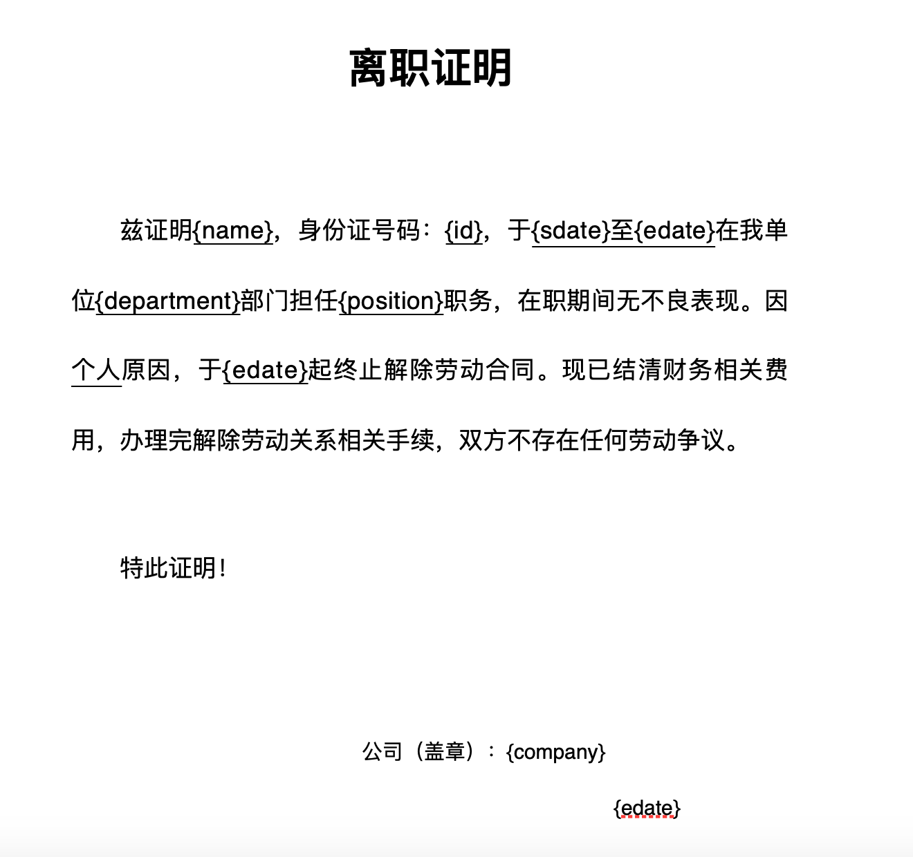

## Python ile Word ve PowerPoint Dosyaları

> **Translated to Turkish by** himmetcanumutlu

Günlük işlerde, birçok basit ve tekrarlayan iş aslında tamamen Python programına devredilebilir; örneğin örnek dosyaya (şablon dosyaya) dayanarak topluca çok sayıda Word dosyası veya PowerPoint dosyası üretmek. Word, Microsoft'un geliştirdiği bir kelime işlemci programıdır; muhtemelen yabancı değildir; günlük ofis işlerinde birçok resmî belge Word ile yazılır ve düzenlenir; günümüzde kullanılan Word dosyalarının uzantısı genellikle `.docx`'tir. PowerPoint, Microsoft'un geliştirdiği bir sunum programıdır; Microsoft Office serisinin bir üyesidir; iş insanları, öğretmenler ve öğrenciler gibi gruplarca yaygın kullanılır; genellikle "slayt" olarak da adlandırılır. Python'da Word işlemek için `python-docx` adlı üçüncü taraf kütüphane, PowerPoint üretmek için de `python-pptx` adlı üçüncü taraf kütüphane kullanılabilir.

### Word Belgesi ile Çalışmak

Önce aşağıdaki komutla `python-docx` üçüncü taraf kütüphanesini kurabiliriz.

```bash
pip install python-docx
```

[Resmî dokümanın](https://python-docx.readthedocs.io/en/latest/) anlatımına göre, aşağıdaki kodla basit bir Word belgesi üretebiliriz.

```python
from docx import Document
from docx.shared import Cm, Pt

from docx.document import Document as Doc

# Word belgesini temsil eden Doc nesnesi oluştur
document = Document()  # type: Doc
# Büyük başlık ekle
document.add_heading('Python Öğrenmek Keyifli', 0)
# Paragraf ekle
p = document.add_paragraph('Python çok popüler bir programlama dilidir, hem')
run = p.add_run('basit')
run.bold = True
run.font.size = Pt(18)
p.add_run(' hem de')
run = p.add_run('zarif')
run.font.size = Pt(18)
run.underline = True
p.add_run('.')

# Birinci düzey başlık ekle
document.add_heading('Heading, level 1', level=1)
# Stil içeren paragraf ekle
document.add_paragraph('Intense quote', style='Intense Quote')
# Sırasız liste ekle
document.add_paragraph(
    'first item in unordered list', style='List Bullet'
)
document.add_paragraph(
    'second item in ordered list', style='List Bullet'
)
# Sıralı liste ekle
document.add_paragraph(
    'first item in ordered list', style='List Number'
)
document.add_paragraph(
    'second item in ordered list', style='List Number'
)

# Görsel ekle (yol ve görselin var olması gerekir)
document.add_picture('resources/guido.jpg', width=Cm(5.2))

# Bölüm sonu ekle
document.add_section()

records = (
    ('骆昊', 'Erkek', '1995-5-5'),
    ('Ayşe Demir', 'Kadın', '1992-2-2')
)
# Tablo ekle
table = document.add_table(rows=1, cols=3)
table.style = 'Dark List'
hdr_cells = table.rows[0].cells
hdr_cells[0].text = 'Ad'
hdr_cells[1].text = 'Cinsiyet'
hdr_cells[2].text = 'Doğum tarihi'
# Tabloya satır ekle
for name, sex, birthday in records:
    row_cells = table.add_row().cells
    row_cells[0].text = name
    row_cells[1].text = sex
    row_cells[2].text = birthday

# Sayfa sonu ekle
document.add_page_break()

# Belgeyi kaydet
document.save('demo.docx')
```

> **İpucu**: Yukarıdaki kodun 7. satırındaki `# type: Doc` yorumu, PyCharm'da kod tamamlama ipucu almak içindir; çünkü nesnenin somut veri tipi bilinmezse PyCharm sonraki kodda `Doc` nesnesi için kod tamamlama ipucu veremez.

Yukarıdaki kodu çalıştırıp oluşan Word belgesini açın; sonuç aşağıdaki gibidir.

&nbsp;&nbsp;

Var olan bir Word dosyasının tüm paragraflarını gezip karşılık gelen içeriği almak için aşağıdaki kodu kullanabiliriz.

```python
from docx import Document
from docx.document import Document as Doc

doc = Document('resources/istifa-belgesi.docx')  # type: Doc
for no, p in enumerate(doc.paragraphs):
    print(no, p.text)
```

> **İpucu**: Yukarıdaki koddaki Word dosyasına ihtiyacınız varsa, aşağıdaki Baidu ağ disk adresinden edinebilirsiniz. Bağlantı: https://pan.baidu.com/s/1rQujl5RQn9R7PadB2Z5g_g  çıkarma kodu: e7b4.

Okunan içerik aşağıdaki gibidir.

```
0 
1 İ Ş T E N  A Y R I L I Ş  B E L G E S İ
2 
3 İşbu belge ile, Ahmet Yılmaz, TC Kimlik No: 100200199512120001, 7 Ağustos 2018 - 28 Haziran 2020 tarihleri arasında kuruluşumuzun Geliştirme bölümünde Java Geliştirme Mühendisi olarak çalışmış, görev süresince olumsuz bir davranışı görülmemiştir. Kişisel nedenlerle, 28 Haziran 2020 tarihi itibarıyla iş sözleşmesi feshedilmiştir. Mali konulara ilişkin tüm ödemeler yapılmış, iş ilişkisinin sona erdirilmesine ilişkin işlemler tamamlanmış olup taraflar arasında herhangi bir iş uyuşmazlığı bulunmamaktadır.
4 
5 İşbu belgeyi onaylarız!
6 
7 
8 Şirket adı (mühür): Örnek Teknoloji A.Ş.
9    			28 Haziran 2020
```

Bu noktada birçok okuyucunun aklına gelmiştir: yukarıdaki işten ayrılış belgesini bir şablon dosyaya dönüştürüp, ad, kimlik numarası, işe giriş ve işten çıkış tarihleri gibi bilgileri yer tutucularla değiştirebiliriz; böylece yer tutucuları değiştirerek gerçek ihtiyaca göre karşılık gelen bilgileri yazabilir ve Word belgelerini topluca üretebiliriz.

Yukarıdaki düşünceye göre, önce işten ayrılış belgesinin bir şablon dosyasını düzenleyelim; aşağıdaki gibidir.



Sonra bu dosyayı okuyup yer tutucuları gerçek bilgilerle değiştirerek yeni bir Word belgesi üretebiliriz; aşağıdaki gibidir.

```python
from docx import Document
from docx.document import Document as Doc

# Gerçek bilgileri sözlük biçiminde listede sakla
employees = [
    {
        'name': '骆昊',
        'id': '100200198011280001',
        'sdate': '1 Mart 2008',
        'edate': '29 Şubat 2012',
        'department': 'Ürün Geliştirme',
        'position': 'Mimar',
        'company': 'Örnek Teknoloji A.Ş.'
    },
    {
        'name': 'Ahmet Yılmaz',
        'id': '510210199012125566',
        'sdate': '1 Ocak 2019',
        'edate': '30 Nisan 2021',
        'department': 'Ürün Geliştirme',
        'position': 'Python Geliştirme Mühendisi',
        'company': 'Örnek Yazılım A.Ş.'
    },
    {
        'name': 'Ayşe Demir',
        'id': '2102101995103221599',
        'sdate': '10 Mayıs 2020',
        'edate': '5 Mart 2021',
        'department': 'Ürün Geliştirme',
        'position': 'Java Geliştirme Mühendisi',
        'company': 'Örnek Kurumsal Yönetim A.Ş.'
    },
]
# Liste üzerinde döngüyle gezin, topluca Word belgesi üret 
for emp_dict in employees:
    # İşten ayrılış belgesi şablon dosyasını oku
    doc = Document('resources/istifa-belgesi-sablonu.docx')  # type: Doc
    # Tüm paragraflarda döngüyle yer tutucu ara
    for p in doc.paragraphs:
        if '{' not in p.text:
            continue
        # Paragraf içeriği doğrudan değiştirilemez, aksi halde stil kaybolur
        # bu yüzden paragraftaki öğeler üzerinde döngüyle arama-değiştirme yap
        for run in p.runs:
            if '{' not in run.text:
                continue
            # Yer tutucuyu gerçek içerikle değiştir
            start, end = run.text.find('{'), run.text.find('}')
            key, place_holder = run.text[start + 1:end], run.text[start:end + 1]
            run.text = run.text.replace(place_holder, emp_dict[key])
    # Her kişi için bir Word belgesi kaydet
    doc.save(f'{emp_dict["name"]}-istifa-belgesi.docx')
```

Yukarıdaki kodu çalıştırınca, mevcut yolda üç Word belgesi oluşur; aşağıdaki gibidir.


### PowerPoint Oluşturma

Önce `python-pptx` adlı üçüncü taraf kütüphaneyi kurmamız gerekir; komut aşağıdaki gibidir.

```Bash
pip install python-pptx
```

Python ile PowerPoint işlemeye dair içeriği, gerçek kullanım senaryosu çok fazla olmadığından burada ayrıntılı anlatmak istemiyorum; merak edenler `python-pptx`'in [resmî dokümanını](https://python-pptx.readthedocs.io/en/latest/) okuyabilir; aşağıda yalnızca resmî dokümandan alınmış bir kod parçasını gösteriyoruz.

```python
from pptx import Presentation

# Slayt nesnesi oluştur
pres = Presentation()

# Ana düzeni seçip bir sayfa ekle
title_slide_layout = pres.slide_layouts[0]
slide = pres.slides.add_slide(title_slide_layout)
# Başlık ve alt başlık alanlarını al
title = slide.shapes.title
subtitle = slide.placeholders[1]
# Başlık ve alt başlığı düzenle
title.text = "Welcome to Python"
subtitle.text = "Life is short, I use Python"

# Ana düzeni seçip bir sayfa ekle
bullet_slide_layout = pres.slide_layouts[1]
slide = pres.slides.add_slide(bullet_slide_layout)
# Sayfadaki tüm şekilleri al
shapes = slide.shapes
# Başlık ve gövdeyi al
title_shape = shapes.title
body_shape = shapes.placeholders[1]
# Başlığı düzenle
title_shape.text = 'Introduction'
# Gövde içeriğini düzenle
tf = body_shape.text_frame
tf.text = 'History of Python'
# Bir birinci düzey paragraf ekle
p = tf.add_paragraph()
p.text = 'X\'max 1989'
p.level = 1
# Bir ikinci düzey paragraf ekle
p = tf.add_paragraph()
p.text = 'Guido began to write interpreter for Python.'
p.level = 2

# Slaytı kaydet
pres.save('test.pptx')
```

Yukarıdaki kodu çalıştırınca oluşan PowerPoint dosyası aşağıdaki gibidir.


### Özet

Python programıyla ofis otomasyonu sorunlarını çözmek gerçekten çok havalı; bizi sıkıcı ve zahmetli işlerden kurtarabilir. Bu tür kodlar yazmak, bir kez yapıp sürekli yararlanılan bir işe girişmektir; kod yazma süreci pek keyifli olmasa da, bu kodları kullanırken çok mutlu olacaksınız.
