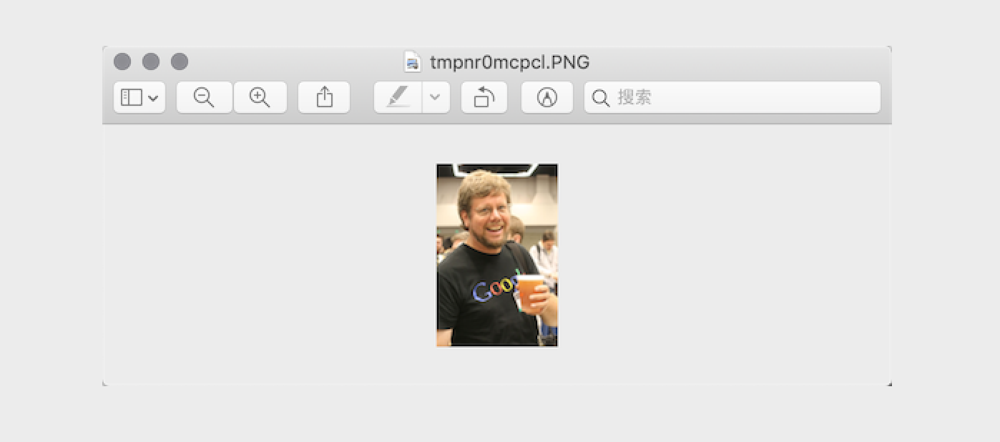
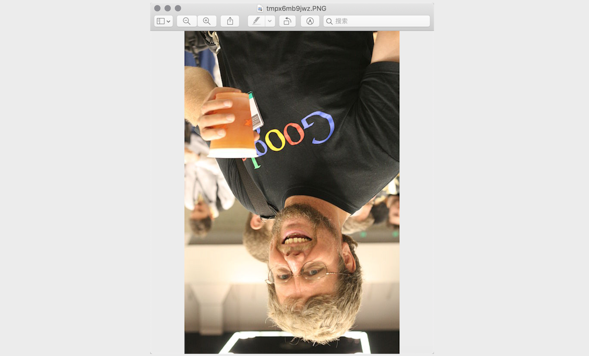
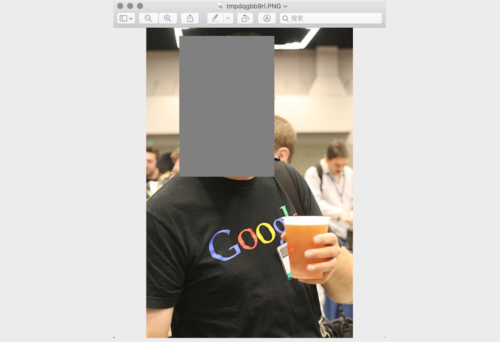

## Python ile Görüntü İşleme

> **Translated to Turkish by** himmetcanumutlu

### Temel Bilgiler

1. Renk. Boyayla resim yapma deneyiminiz varsa, kırmızı, sarı ve mavi boyayı karıştırınca başka renkler elde edilebileceğini bilirsiniz; aslında bu üç renk, resim sanatındaki üç ana renktir; daha fazla ayrıştırılamayan temel renklerdir. Bilgisayarda, kırmızı, yeşil ve mavi renk ışığını farklı oranlarda üst üste bindirerek başka renkler oluşturabiliriz; bu yüzden bu üç renk, renk ışığının üç ana rengidir. Bilgisayar sistemlerinde bir rengi genellikle RGB değeri veya RGBA değeri olarak ifade ederiz (A, Alpha kanalını temsil eder; görüntünün pikselinden geçen miktarı, yani saydamlığı belirler).

   |     Adı     |      RGB değeri      |      Adı     |     RGB değeri     |
   | :---------: | :-------------: | :----------: | :-----------: |
   | Beyaz | (255, 255, 255) |  Kırmızı   |  (255, 0, 0)  |
   | Yeşil |   (0, 255, 0)   |  Mavi  |  (0, 0, 255)  |
   | Gri  | (128, 128, 128) | Sarı | (255, 255, 0) |
   | Siyah |    (0, 0, 0)    | Mor | (128, 0, 128) |

2. Piksel. Sayı dizisiyle temsil edilen bir görüntü için en küçük birim, görüntüdeki tek renkli küçük karelerdir; bu küçük karelerin her birinin belirli bir konumu ve atanmış bir renk değeri vardır; bu küçük karelerin rengi ve konumu, görüntünün son halini belirler; bölünemez birimlerdir, genellikle **piksel** (pixel) deriz. Her görüntü belirli miktarda piksel içerir; bu pikseller görüntünün ekranda göründüğü boyutu belirler; fotoğraf çekmeyi veya selfie çekmeyi seviyorsanız piksel kelimesine yabancı değilsinizdir.

### Pillow ile Görüntü İşleme

Pillow, ünlü Python görüntü işleme kütüphanesi PIL'den gelişen bir daldır; Pillow ile görüntü sıkıştırma ve görüntü işleme gibi çeşitli işlemler yapılabilir. Pillow'u kurmak için aşağıdaki komutu kullanabilirsiniz.

```Shell
pip install pillow
```

Pillow'da en önemlisi `Image` sınıfıdır; `Image` modülünün `open` fonksiyonuyla görüntü okunup `Image` tipinde bir nesne elde edilir.

1. Görüntü okuma ve gösterme

   ```python
   from PIL import Image
   
   # Görüntüyü okuyup Image nesnesi al
   image = Image.open('guido.jpg')
   # Image nesnesinin format özniteliğiyle görüntünün biçimini al
   print(image.format) # JPEG
   # Image nesnesinin size özniteliğiyle görüntünün boyutunu al
   print(image.size)   # (500, 750)
   # Image nesnesinin mode özniteliğiyle görüntünün modunu al
   print(image.mode)   # RGB
   # Image nesnesinin show metoduyla görüntüyü göster
   image.show()
   ```

   

2. Görüntüyü kırpma

   ```python
   # Image nesnesinin crop metoduyla kırpma bölgesini belirleyip görüntüyü kırp
   image.crop((80, 20, 310, 360)).show()
   ```

   

3. Küçük resim (thumbnail) oluşturma

   ```python
   # Image nesnesinin thumbnail metoduyla belirtilen boyutta küçük resim üret
   image.thumbnail((128, 128))
   image.show()
   ```

   

4. Görüntüyü ölçekleme ve yapıştırma

   ```python
   # Yazarın fotoğrafını okuyup Image nesnesi al
   author_image = Image.open('author.png')
   # Guido'nun fotoğrafını okuyup Image nesnesi al
   guido_image = Image.open('guido.jpg')
   # Guido'nun fotoğrafından başını kırp
   guido_head = guido_image.crop((80, 20, 310, 360))
   width, height = guido_head.size
   # Image nesnesinin resize metoduyla görüntünün boyutunu değiştir
   # Image nesnesinin paste metoduyla Guido'nun başını yazarın fotoğrafına yapıştır
   author_image.paste(guido_head.resize((int(width / 1.5), int(height / 1.5))), (172, 40))
   author_image.show()
   ```

   

5. Döndürme ve çevirme

   ```python
   image = Image.open('guido.jpg')
   # Image nesnesinin rotate metoduyla görüntüyü döndür
   image.rotate(45).show()
   # Image nesnesinin transpose metoduyla görüntüyü çevir
   # Image.FLIP_LEFT_RIGHT - yatay çevirme
   # Image.FLIP_TOP_BOTTOM - dikey çevirme
   image.transpose(Image.FLIP_TOP_BOTTOM).show()
   ```

   

6. Piksellerle çalışma

   ```python
   for x in range(80, 310):
       for y in range(20, 360):
           # Image nesnesinin putpixel metoduyla görüntünün belirtilen pikselini değiştir
           image.putpixel((x, y), (128, 128, 128))
   image.show()
   ```

   

7. Filtre efektleri

   ```python
   from PIL import ImageFilter
   
   # Image nesnesinin filter metoduyla görüntüye filtre uygula
   # ImageFilter modülü birçok hazır filtre içerir, ayrıca filtre özelleştirilebilir
   image.filter(ImageFilter.CONTOUR).show()
   ```

   

### Pillow ile Çizim

Pillow'da `ImageDraw` adında bir modül vardır; bu modülün `Draw` fonksiyonu bir `ImageDraw` nesnesi döndürür; `ImageDraw` nesnesinin `arc`, `line`, `rectangle`, `ellipse`, `polygon` gibi metotlarıyla görüntü üzerine yay, çizgi, dikdörtgen, elips, çokgen gibi şekiller çizilebilir; ayrıca bu nesnenin `text` metoduyla görüntüye yazı da eklenebilir.


Yukarıdaki görüntüyü çizmek için tam kod aşağıdaki gibidir.

```python
import random

from PIL import Image, ImageDraw, ImageFont


def random_color():
    """Rastgele renk üret"""
    red = random.randint(0, 255)
    green = random.randint(0, 255)
    blue = random.randint(0, 255)
    return red, green, blue


width, height = 800, 600
# 800*600 boyutunda, arka planı beyaz bir görüntü oluştur
image = Image.new(mode='RGB', size=(width, height), color=(255, 255, 255))
# Bir ImageDraw nesnesi oluştur
drawer = ImageDraw.Draw(image)
# Yazı tipi ve boyut belirterek ImageFont nesnesi al
font = ImageFont.truetype('Kongxin.ttf', 32)
# ImageDraw nesnesinin text metoduyla yazı çiz
drawer.text((300, 50), 'Hello, world!', fill=(255, 0, 0), font=font)
# ImageDraw nesnesinin line metoduyla iki çapraz düz çizgi çiz
drawer.line((0, 0, width, height), fill=(0, 0, 255), width=2)
drawer.line((width, 0, 0, height), fill=(0, 0, 255), width=2)
xy = width // 2 - 60, height // 2 - 60, width // 2 + 60, height // 2 + 60
# ImageDraw nesnesinin rectangle metoduyla dikdörtgen çiz
drawer.rectangle(xy, outline=(255, 0, 0), width=2)
# ImageDraw nesnesinin ellipse metoduyla elips çiz
for i in range(4):
    left, top, right, bottom = 150 + i * 120, 220, 310 + i * 120, 380
    drawer.ellipse((left, top, right, bottom), outline=random_color(), width=8)
# Görüntüyü göster
image.show()
# Görüntüyü kaydet
image.save('result.png')
```

> **Dikkat**: Yukarıdaki kodda kullanılan yazı tipi dosyasını kendiniz hazırlamanız gerekir; beğendiğiniz bir yazı tipi dosyasını seçip kod dizinine koyabilirsiniz.

###  Özet

Python diliyle geliştirme yaparken, görüntü işlemek için Pillow'un yanı sıra daha güçlü OpenCV kütüphanesini de kullanabilirsiniz; OpenCV (**Open** Source **C**omputer **V**ision Library), platformlar arası bir bilgisayarlı görü kütüphanesidir; gerçek zamanlı görüntü işleme, bilgisayarlı görü ve örüntü tanıma programları geliştirmek için kullanılabilir. Günlük işlerimizde birçok zahmetli ve sıkıcı görev aslında Python programıyla yapılabilir; programlamanın amacı, bilgisayarın sorunları çözmemize yardım etmesini sağlayıp tekrarlayan sıkıcı emeği azaltmaktır. Bu bölüm sayesinde Python programıyla çizim yapmanın ve görüntü değiştirmenin keyfini hissettiğinize inanıyorum; aslında Python'un yapabilecekleri bunlarla sınırlı değil; öğrenmeye devam edin.
