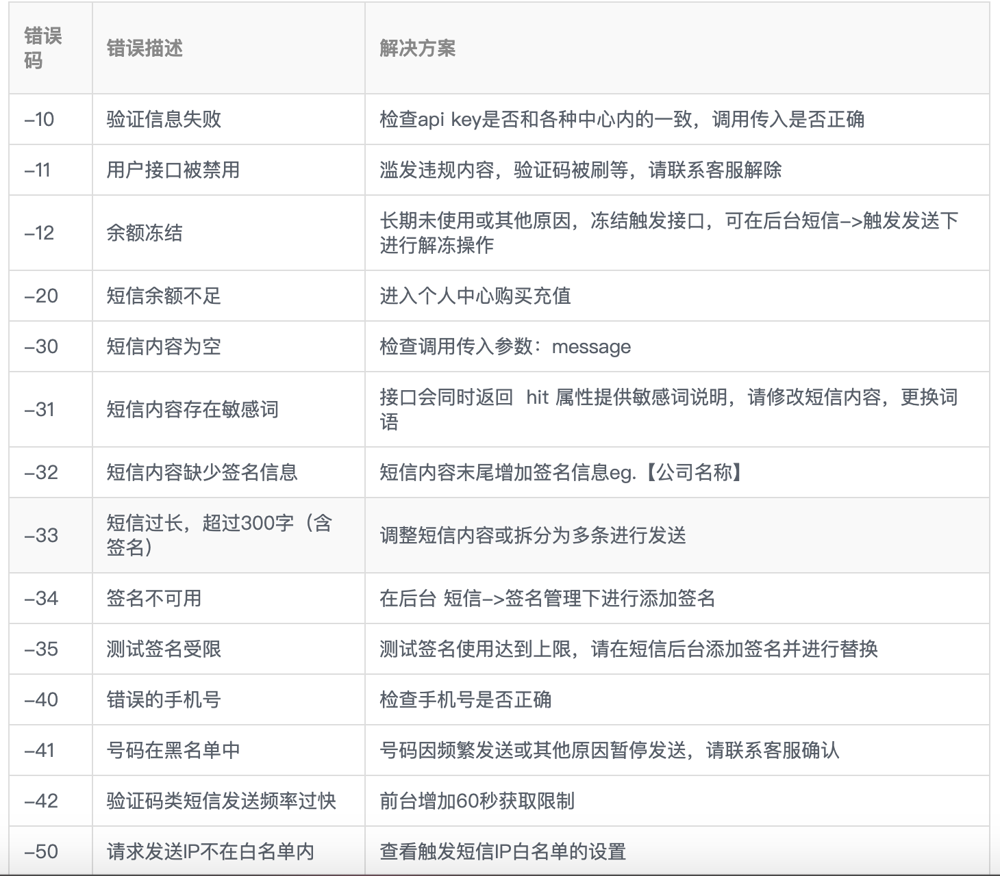

## Python ile E-posta ve SMS Gönderme

> **Translated to Turkish by** himmetcanumutlu

Önceki derslerde Python programıyla otomatik olarak Excel, Word ve PDF belgeleri üretmeyi öğrettik; şimdi bir adım daha ileri gidip üretilen belgeleri e-postayla belirtilen alıcılara gönderebilir, sonra SMS ile karşı tarafa e-posta gönderdiğimizi bildirebiliriz. Bu işler Python programıyla da kolayca ve keyifle çözülebilir.

### E-posta Gönderme

Anlık mesajlaşma yazılımlarının bu kadar geliştiği günümüzde, e-posta hâlâ internette en yaygın kullanılan uygulamalardan biridir. Şirketlerin adaylara iş teklifi göndermesi, web sitelerinin kullanıcıya hesap etkinleştirme bağlantısı göndermesi, bankaların müşterilerine yatırım ürünlerini tanıtması gibi işler neredeyse hep e-postayla yapılır; bu görevler de programlarla otomatik yapılmalıdır.

Web sitesi kaynaklarına erişmek için HTTP (Hiper Metin Aktarım Protokolü) kullanabiliriz; HTTP bir uygulama düzeyi protokoldür ve TCP (Aktarım Kontrol Protokolü) üzerine kuruludur; TCP birçok uygulama düzeyi protokole güvenilir veri aktarım hizmeti sunar. E-posta göndermek için SMTP (Basit Posta Aktarım Protokolü) kullanılır; o da TCP üzerine kurulu bir uygulama düzeyi protokoldür ve posta gönderenin posta sunucusuyla nasıl iletişim kuracağının ayrıntılarını belirler. Python, `smtplib` adlı modülle bu işlemleri `SMTP_SSL` nesnesine basitleştirmiştir; bu nesnenin `login` ve `sendmail` metotlarıyla e-posta gönderme işlemi tamamlanır.

Önce ek, görsel ve diğer hiper metin içeriği içermeyen son derece basit bir e-posta göndermeyi deneyelim. E-posta göndermek için önce posta sunucusuna bağlanmak gerekir; kendi posta sunucumuzu kurabiliriz, ancak bu iş yeni başlayanlara pek dostane değildir; bunun yerine üçüncü taraf e-posta hizmetlerini kullanabiliriz. Örneğin ben <www.126.com> adresinde bir hesap açtım; giriş yaptıktan sonra ayarlardan SMTP hizmetini etkinleştirince bir posta sunucusu elde etmiş olurum; somut işlem aşağıdaki gibidir.


Telefonla yukarıdaki QR kodu tarayıp SMS göndererek yetki kodunu (authorization code) alabilirsiniz; SMS başarıyla gönderildikten sonra "Gönderdim"e tıklayıp yetki kodunu alabilirsiniz. Yetki kodunu iyi saklamanız gerekir; çünkü sızarsa başkaları sizin kimliğinizi kullanarak e-posta gönderebilir. Şimdi e-posta gönderme kodunu yazabiliriz; aşağıdaki gibidir.

```python
import smtplib
from email.header import Header
from email.mime.multipart import MIMEMultipart
from email.mime.text import MIMEText

# E-posta gövde nesnesi oluştur
email = MIMEMultipart()
# Gönderici, alıcı ve konuyu ayarla
email['From'] = 'xxxxxxxxx@126.com'
email['To'] = 'yyyyyy@qq.com;zzzzzz@1000phone.com'
email['Subject'] = Header('İlk yarı yıl çalışma raporu', 'utf-8')
# E-posta gövde içeriğini ekle
content = """Alman medyasına göre, yerel saatle 9'unda, Alman makinist sendikası üyeleri oylama yaptı;
yerel saatle 10'undan itibaren ülke çapında grev yapılmasına karar verildi. Yük taşımacılığındaki grev,
yerel saatle 10'u 19:00'da başladı. Ardından 11'i 02:00'den 13'ü 02:00'ye kadar Almanya genelinde
yolcu taşımacılığı ve demir yolu altyapısında 48 saatlik grev yapılacak."""
email.attach(MIMEText(content, 'plain', 'utf-8'))

# SMTP_SSL nesnesi oluştur (posta sunucusuna bağlan)
smtp_obj = smtplib.SMTP_SSL('smtp.126.com', 465)
# Kullanıcı adı ve yetki koduyla giriş yap
smtp_obj.login('xxxxxxxxx@126.com', 'posta sunucusunun yetki kodu')
# E-posta gönder (gönderici, alıcı, e-posta içeriği (string))
smtp_obj.sendmail(
    'xxxxxxxxx@126.com',
    ['yyyyyy@qq.com', 'zzzzzz@1000phone.com'],
    email.as_string()
)
```

Ek içeren bir e-posta göndermek istiyorsanız, ek içeriğini BASE64 kodlamasına çevirmeniz yeterlidir; o zaman normal metin içeriğinden neredeyse farksız olur. BASE64, ikili veriyi 64 yazdırılabilir karakterle temsil eden bir gösterim yöntemidir; ikili veriyi temsil etmek, aktarmak veya saklamak gereken birçok durumda kullanılır; e-posta da bunlardan biridir. Bu kodlama yöntemini anlamayanlar için [《Base64 Notları》](http://www.ruanyifeng.com/blog/2008/06/base64.html) yazısını okumayı öneririz. Daha önce de belirttiğimiz gibi, Python standart kütüphanesinin `base64` modülü BASE64 kodlama/kod çözme desteği sunar.

Aşağıdaki kod, ek içeren e-postanın nasıl gönderileceğini gösterir.

```python
import smtplib
from email.header import Header
from email.mime.multipart import MIMEMultipart
from email.mime.text import MIMEText
from urllib.parse import quote

# E-posta gövde nesnesi oluştur
email = MIMEMultipart()
# Gönderici, alıcı ve konuyu ayarla
email['From'] = 'xxxxxxxxx@126.com'
email['To'] = 'zzzzzzzz@1000phone.com'
email['Subject'] = Header('İşten ayrılış belgenizi teslim alın', 'utf-8')
# E-posta gövde içeriğini ekle (HTML etiketiyle düzenlenmiş içerik)
content = """<p>Sevgili eski meslektaşım:</p>
<p>İhtiyacınız olan işten ayrılış belgesi ekte, teslim alınız!</p>
<br>
<p>Saygılarımla,</p>
<hr>
<p>Ayşe Demir</p>"""
email.attach(MIMEText(content, 'html', 'utf-8'))
# Ek olarak kullanılacak dosyayı oku
with open(f'resources/ahmet-yilmaz-istifa-belgesi.docx', 'rb') as file:
    attachment = MIMEText(file.read(), 'base64', 'utf-8')
    # İçerik tipini belirt
    attachment['content-type'] = 'application/octet-stream'
    # Dosya adını yüzdelik kodlamaya çevir
    filename = quote('ahmet-yilmaz-istifa-belgesi.docx')
    # İçeriğin nasıl işleneceğini belirt
    attachment['content-disposition'] = f'attachment; filename="{filename}"'

# SMTP_SSL nesnesi oluştur (posta sunucusuna bağlan)
smtp_obj = smtplib.SMTP_SSL('smtp.126.com', 465)
# Kullanıcı adı ve yetki koduyla giriş yap
smtp_obj.login('xxxxxxxxx@126.com', 'posta sunucusunun yetki kodu')
# E-posta gönder (gönderici, alıcı, e-posta içeriği (string))
smtp_obj.sendmail(
    'xxxxxxxxx@126.com',
    'zzzzzzzz@1000phone.com',
    email.as_string()
)
```

Python ile e-posta göndermeyi kolaylaştırmak için yukarıdaki kodu fonksiyona kapsülleyebiliriz; kullanırken yalnızca posta sunucusu alan adını, portunu, kullanıcı adını ve yetki kodunu ayarlamanız yeterlidir.

```python
import smtplib
from email.header import Header
from email.mime.multipart import MIMEMultipart
from email.mime.text import MIMEText
from urllib.parse import quote

# Posta sunucusu alan adı (kendiniz değiştirin)
EMAIL_HOST = 'smtp.126.com'
# Posta servis portu (genellikle 465)
EMAIL_PORT = 465
# Posta sunucusuna giriş hesabı (kendiniz değiştirin)
EMAIL_USER = 'xxxxxxxxx@126.com'
# SMTP hizmetinin yetki kodu (kendiniz değiştirin)
EMAIL_AUTH = 'posta sunucusunun yetki kodu'


def send_email(*, from_user, to_users, subject='', content='', filenames=[]):
    """E-posta gönder
    
    :param from_user: gönderici
    :param to_users: alıcı; birden çok alıcı İngilizce noktalı virgülle ayrılır
    :param subject: e-postanın konusu
    :param content: e-posta gövde içeriği
    :param filenames: ek olarak gönderilecek dosya yolları
    """
    email = MIMEMultipart()
    email['From'] = from_user
    email['To'] = to_users
    email['Subject'] = subject

    message = MIMEText(content, 'plain', 'utf-8')
    email.attach(message)
    for filename in filenames:
        with open(filename, 'rb') as file:
            pos = filename.rfind('/')
            display_filename = filename[pos + 1:] if pos >= 0 else filename
            display_filename = quote(display_filename)
            attachment = MIMEText(file.read(), 'base64', 'utf-8')
            attachment['content-type'] = 'application/octet-stream'
            attachment['content-disposition'] = f'attachment; filename="{display_filename}"'
            email.attach(attachment)

    smtp = smtplib.SMTP_SSL(EMAIL_HOST, EMAIL_PORT)
    smtp.login(EMAIL_USER, EMAIL_AUTH)
    smtp.sendmail(from_user, to_users.split(';'), email.as_string())
```

### SMS Gönderme

SMS gönderme de projelerde yaygın bir işlevdir; web sitelerinin kayıt kodu, doğrulama kodu ve pazarlama bilgileri temelde SMS ile kullanıcıya gönderilir. SMS göndermek üçüncü taraf platform desteği gerektirir; aşağıda [Luosimao platformu](https://luosimao.com/) örneğiyle Python programıyla SMS göndermeyi anlatıyoruz. Hesap açma ve SMS hizmeti satın alma ayrıntılarını burada anlatmıyoruz; platformun müşteri hizmetlerine danışabilirsiniz.


Ardından, `requests` kütüphanesiyle platformun sunduğu SMS ağ geçidine bir HTTP isteği gönderip, SMS alacak telefon numarasını ve SMS içeriğini parametre olarak geçerek SMS gönderebiliriz; kod aşağıdaki gibidir.

```python
import random

import requests


def send_message_by_luosimao(tel, message):
    """SMS gönder (Luosimao SMS ağ geçidini çağır)"""
    resp = requests.post(
        url='http://sms-api.luosimao.com/v1/send.json',
        auth=('api', 'key-kayittan-sonra-platformun-verdgi-KEY'),
        data={
            'mobile': tel,
            'message': message
        },
        timeout=10,
        verify=False
    )
    return resp.json()


def gen_mobile_code(length=6):
    """Belirtilen uzunlukta telefon doğrulama kodu üret"""
    return ''.join(random.choices('0123456789', k=length))


def main():
    code = gen_mobile_code()
    message = f'SMS doğrulama kodunuz {code}; kimseye söylemeyin! 【Python Dersi】'
    print(send_message_by_luosimao('13500112233', message))


if __name__ == '__main__':
    main()
```

Yukarıdaki Luosimao SMS ağ geçidi `http://sms-api.luosimao.com/v1/send.json` isteği JSON biçiminde veri döndürür; `{'error': 0, 'msg': 'OK'}` dönerse SMS başarıyla gönderilmiş demektir; `error` değeri `0` değilse, resmî [geliştirici dokümanına](https://luosimao.com/docs/api/) bakarak hangi aşamada sorun olduğunu öğrenebilirsiniz. Luosimao platformunun yaygın hata tipleri aşağıdaki gibidir.



Günümüzde çoğu SMS platformu, SMS içeriğine imza eklenmesini zorunlu kılar; aşağıdaki görselde Luosimao platformunda yapılandırdığım SMS imzası "【Python Dersi】" görülmektedir. Hassas içerik içeren bazı SMS'lerde SMS şablonunu da önceden yapılandırmak gerekir; merak edenler kendileri inceleyebilir. Genellikle platformlar, SMS'in kötüye kullanılmasını önlemek için "IP beyaz listesi" ayarlanmasını da ister; nasıl yapılandırılacağını bilmiyorsanız platformun müşteri hizmetlerine danışabilirsiniz.

Elbette Çin'de birçok SMS platformu vardır; okuyucular kendi ihtiyaçlarına göre seçebilir (genellikle ücret bütçesi, SMS ulaşma oranı, kullanım kolaylığı gibi göstergeler dikkate alınır); ticari projede SMS hizmeti kullanmak gerekiyorsa, SMS platformunun sunduğu paket hizmeti satın almanız önerilir.

### Özet

Aslında e-posta göndermek de SMS göndermek gibi üçüncü taraf hizmet çağrısıyla da yapılabilir; gerçek ticari projelerde, kendi posta sunucunuzu kurmanızı veya e-posta göndermek için üçüncü taraf hizmet satın almanızı öneririz; bu daha güvenilir bir seçimdir.
