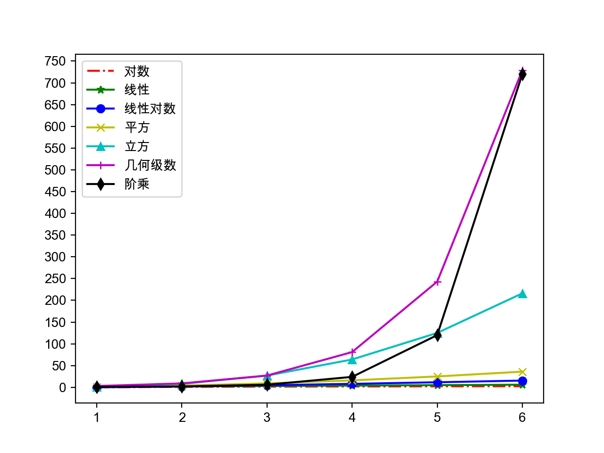

## Python Dilinde İleri Seviye

> **Translated to Turkish by** himmetcanumutlu

### Önemli Bilgi Noktaları

- Anlama (comprehension) kullanımı

  ```Python
  prices = {
      'AAPL': 191.88,
      'GOOG': 1186.96,
      'IBM': 149.24,
      'ORCL': 48.44,
      'ACN': 166.89,
      'FB': 208.09,
      'SYMC': 21.29
  }
  # Fiyatı 100 TL'den büyük hisselerle yeni bir sözlük oluştur
  prices2 = {key: value for key, value in prices.items() if value > 100}
  print(prices2)
  ```

  > Not: Anlama (comprehension), liste, küme ve sözlük üretmek için kullanılabilir.

- İç içe listenin tuzağı

  ```Python
  names = ['Ali Yılmaz', 'Ayşe Demir', 'Veli Kaya', 'Fatma Şahin', 'Ahmet Çelik']
  courses = ['Türkçe', 'Matematik', 'İngilizce']
  # Beş öğrencinin üç dersinin notlarını gir
  # Yanlış - bkz. http://pythontutor.com/visualize.html#mode=edit
  # scores = [[None] * len(courses)] * len(names)
  scores = [[None] * len(courses) for _ in range(len(names))]
  for row, name in enumerate(names):
      for col, course in enumerate(courses):
          scores[row][col] = float(input(f'{name} adlı öğrencinin {course} notunu girin: '))
          print(scores)
  ```

  [Python Tutor](http://pythontutor.com/) - KODU GÖRSELLEŞTİR VE CANLI YARDIM AL

- `heapq` modülü (yığın sıralama)

  ```Python
  """
  Listedeki en büyük veya en küçük N elemanı bul
  Yığın yapısı (büyük yığın / küçük yığın)
  """
  import heapq
  
  list1 = [34, 25, 12, 99, 87, 63, 58, 78, 88, 92]
  list2 = [
      {'name': 'IBM', 'shares': 100, 'price': 91.1},
      {'name': 'AAPL', 'shares': 50, 'price': 543.22},
      {'name': 'FB', 'shares': 200, 'price': 21.09},
      {'name': 'HPQ', 'shares': 35, 'price': 31.75},
      {'name': 'YHOO', 'shares': 45, 'price': 16.35},
      {'name': 'ACME', 'shares': 75, 'price': 115.65}
  ]
  print(heapq.nlargest(3, list1))
  print(heapq.nsmallest(3, list1))
  print(heapq.nlargest(2, list2, key=lambda x: x['price']))
  print(heapq.nlargest(2, list2, key=lambda x: x['shares']))
  ```

- `itertools` modülü

  ```Python
  """
  Yineleme araçları modülü
  """
  import itertools
  
  # ABCD'nin tüm permütasyonlarını üret
  itertools.permutations('ABCD')
  # ABCDE'nin 5'ten 3'lü kombinasyonunu üret
  itertools.combinations('ABCDE', 3)
  # ABCD ve 123'ün kartezyen çarpımını üret
  itertools.product('ABCD', '123')
  # ABC'nin sonsuz döngü dizisini üret
  itertools.cycle(('A', 'B', 'C'))
  ```

- `collections` modülü

  Yaygın araç sınıfları:

  - `namedtuple`: Adlandırılmış demet; bir sınıf fabrikasıdır; tipin adını ve öznitelik listesini alarak bir sınıf oluşturur.
  - `deque`: Çift uçlu kuyruk; listenin alternatif gerçeklemesidir. Python'daki liste altta diziye dayanırken, `deque` altta çift bağlantılı listeye dayanır; bu yüzden başa ve sona eleman ekleyip silmeniz gerektiğinde `deque` daha iyi performans gösterir, asimptotik zaman karmaşıklığı $O(1)$'dir.
  - `Counter`: `dict`'in alt sınıfıdır; anahtar eleman, değer elemanın sayısıdır; `most_common()` metodu en sık geçen elemanları almamıza yardımcı olur. `Counter` ile `dict` arasındaki kalıtım ilişkisinin tartışmaya açık olduğunu düşünüyorum; CARP ilkesine göre `Counter` ile `dict` arasındaki ilişki, birleşim ilişkisi olarak tasarlanmalıdır.
  - `OrderedDict`: `dict`'in alt sınıfıdır; anahtar-değer çiftlerinin eklenme sırasını kaydeder; hem sözlük hem bağlantılı liste davranışı gösterir.
  - `defaultdict`: Sözlük tipine benzer; ancak varsayılan fabrika fonksiyonuyla anahtarın varsayılan değerini alabilir; sözlükteki `setdefault()` metoduna göre daha verimlidir.

  ```Python
  """
  Dizide en sık geçen elemanı bul
  """
  from collections import Counter
  
  words = [
      'look', 'into', 'my', 'eyes', 'look', 'into', 'my', 'eyes',
      'the', 'eyes', 'the', 'eyes', 'the', 'eyes', 'not', 'around',
      'the', 'eyes', "don't", 'look', 'around', 'the', 'eyes',
      'look', 'into', 'my', 'eyes', "you're", 'under'
  ]
  counter = Counter(words)
  print(counter.most_common(3))
  ```

### Veri Yapıları ve Algoritmalar

- Algoritma: Bir sorunu çözme yöntemi ve adımları.

- Bir algoritmanın iyi-kötü değerlendirmesi: asimptotik zaman karmaşıklığı ve asimptotik uzay karmaşıklığı.

- Asimptotik zaman karmaşıklığının büyük O gösterimi:
  -  - sabit zaman karmaşıklığı - Bloom filtresi / karma depolama
  -  - logaritmik zaman karmaşıklığı - yarıya bölerek arama (ikili arama)
  -  - doğrusal zaman karmaşıklığı - sıralı arama / sayma sıralaması
  -  - log-doğrusal zaman karmaşıklığı - ileri sıralama algoritmaları (birleştirmeli sıralama, hızlı sıralama)
  -  - karesel zaman karmaşıklığı - basit sıralama algoritmaları (seçmeli sıralama, eklemeli sıralama, kabarcık sıralama)
  -  - kübik zaman karmaşıklığı - Floyd algoritması / matris çarpımı
  -  - geometrik dizi zaman karmaşıklığı - Hanoi Kuleleri
  -  - faktöriyel zaman karmaşıklığı - gezgin satıcı problemi - NPC

  

  

- Sıralama algoritmaları (seçmeli, kabarcık ve birleştirmeli) ve arama algoritmaları (sıralı ve yarıya bölerek)

  ```Python
  def select_sort(items, comp=lambda x, y: x < y):
      """Basit seçmeli sıralama"""
      items = items[:]
      for i in range(len(items) - 1):
          min_index = i
          for j in range(i + 1, len(items)):
              if comp(items[j], items[min_index]):
                  min_index = j
          items[i], items[min_index] = items[min_index], items[i]
      return items
  ```

  ```Python
  def bubble_sort(items, comp=lambda x, y: x > y):
      """Kabarcık sıralama"""
      items = items[:]
      for i in range(len(items) - 1):
          swapped = False
          for j in range(len(items) - 1 - i):
              if comp(items[j], items[j + 1]):
                  items[j], items[j + 1] = items[j + 1], items[j]
                  swapped = True
          if not swapped:
              break
      return items
  ```

  ```Python
  def bubble_sort(items, comp=lambda x, y: x > y):
      """Çalkalama sıralaması (kabarcık sıralamanın gelişmiş sürümü)"""
      items = items[:]
      for i in range(len(items) - 1):
          swapped = False
          for j in range(len(items) - 1 - i):
              if comp(items[j], items[j + 1]):
                  items[j], items[j + 1] = items[j + 1], items[j]
                  swapped = True
          if swapped:
              swapped = False
              for j in range(len(items) - 2 - i, i, -1):
                  if comp(items[j - 1], items[j]):
                      items[j], items[j - 1] = items[j - 1], items[j]
                      swapped = True
          if not swapped:
              break
      return items
  ```

  ```Python
  def merge(items1, items2, comp=lambda x, y: x < y):
      """Birleştir (iki sıralı listeyi tek sıralı listede birleştir)"""
      items = []
      index1, index2 = 0, 0
      while index1 < len(items1) and index2 < len(items2):
          if comp(items1[index1], items2[index2]):
              items.append(items1[index1])
              index1 += 1
          else:
              items.append(items2[index2])
              index2 += 1
      items += items1[index1:]
      items += items2[index2:]
      return items
  
  
  def merge_sort(items, comp=lambda x, y: x < y):
      return _merge_sort(list(items), comp)
  
  
  def _merge_sort(items, comp):
      """Birleştirmeli sıralama"""
      if len(items) < 2:
          return items
      mid = len(items) // 2
      left = _merge_sort(items[:mid], comp)
      right = _merge_sort(items[mid:], comp)
      return merge(left, right, comp)
  ```

  ```Python
  def seq_search(items, key):
      """Sıralı arama"""
      for index, item in enumerate(items):
          if item == key:
              return index
      return -1
  ```

  ```Python
  def bin_search(items, key):
      """Yarıya bölerek arama (ikili arama)"""
      start, end = 0, len(items) - 1
      while start <= end:
          mid = (start + end) // 2
          if key > items[mid]:
              start = mid + 1
          elif key < items[mid]:
              end = mid - 1
          else:
              return mid
      return -1
  ```

- Yaygın algoritmalar:

  - Kapsamlı arama (brute force) - tüm olasılıkları doğrulayıp doğru cevabı bulana dek dener.
  - Açgözlü (greedy) algoritma - çözerken her adımda o an en iyi görünen seçimi yapar; en iyi çözümü hedeflemez, tatmin edici çözümü hızla bulur.
  - Böl ve yönet (divide and conquer) - karmaşık bir sorunu iki veya daha fazla aynı/benzer alt soruna böler, alt sorunları daha küçük alt sorunlara böler, doğrudan çözülebilecek düzeye gelince alt sorunların çözümlerini birleştirip asıl sorunun çözümünü elde eder.
  - Geri izleme (backtracking) - seçim kriterine göre ileri arar; bir adımda asıl seçimin iyi olmadığını veya hedefe ulaşamadığını görünce bir adım geri dönüp yeniden seçer.
  - Dinamik programlama - temel düşünce de çözülecek sorunu birkaç alt soruna bölmek, alt sorunları çözüp sonuçlarını saklamak, böylece çok sayıda yinelenen hesaplamadan kaçınmaktır.

  Kapsamlı arama örneği: 100 para 100 tavuk ve beş kişinin balık paylaşımı.

  ```Python
  # Horoz 5 TL, tavuk 3 TL, civciv 3 tanesi 1 TL
  # 100 TL ile 100 tavuk al; horoz/tavuk/civciv kaçar tane?
  for x in range(20):
      for y in range(33):
          z = 100 - x - y
          if 5 * x + 3 * y + z // 3 == 100 and z % 3 == 0:
              print(x, y, z)
  
  # A, B, C, D, E beş kişi bir gece birlikte balık tutar; sonunda yorgun düşüp uyurlar
  # Ertesi gün A ilk uyanır; balığı 5 paya böler, artan 1 balığı atar, kendi payını alır
  # B ikinci uyanır; o da balığı 5 paya böler, artan 1'i atar, kendi payını alır
  # Sonra C, D, E sırayla uyanıp aynı şekilde böler; en az kaç balık tutmuşlardır?
  fish = 6
  while True:
      total = fish
      enough = True
      for _ in range(5):
          if (total - 1) % 5 == 0:
              total = (total - 1) // 5 * 4
          else:
              enough = False
              break
      if enough:
          print(fish)
          break
      fish += 5
  ```

  Açgözlü algoritma örneği: Diyelim ki bir hırsızın en fazla 20 kg çalıntı eşya alabilen bir sırt çantası var; bir eve giriyor ve aşağıdaki tablodaki eşyaları buluyor. Açıkça tüm eşyaları çantaya koyamaz; hangi eşyaları alıp hangilerini bırakacağına karar vermelidir.

  |  Adı  | Fiyat (TL) | Ağırlık (kg) |
  | :----: | :----------: | :--------: |
  |  Bilgisayar  |     200      |     20     |
  | Radyo |      20      |     4      |
  |   Saat   |     175      |     10     |
  |  Vazo  |      50      |     2      |
  |   Kitap   |      10      |     1      |
  |  Tablo  |      90      |     9      |

  ```Python
  """
  Açgözlü algoritma: çözerken her adımda o an en iyi görünen seçimi yapar; en iyi çözümü hedeflemez, tatmin edici çözümü hızla bulur.
  Girdi:
  20 6
  Bilgisayar 200 20
  Radyo 20 4
  Saat 175 10
  Vazo 50 2
  Kitap 10 1
  Tablo 90 9
  """
  class Thing(object):
      """Eşya"""
  
      def __init__(self, name, price, weight):
          self.name = name
          self.price = price
          self.weight = weight
  
      @property
      def value(self):
          """Fiyat-ağırlık oranı"""
          return self.price / self.weight
  
  
  def input_thing():
      """Eşya bilgisini gir"""
      name_str, price_str, weight_str = input().split()
      return name_str, int(price_str), int(weight_str)
  
  
  def main():
      """Ana fonksiyon"""
      max_weight, num_of_things = map(int, input().split())
      all_things = []
      for _ in range(num_of_things):
          all_things.append(Thing(*input_thing()))
      all_things.sort(key=lambda x: x.value, reverse=True)
      total_weight = 0
      total_price = 0
      for thing in all_things:
          if total_weight + thing.weight <= max_weight:
              print(f'Hırsız {thing.name} aldı')
              total_weight += thing.weight
              total_price += thing.price
      print(f'Toplam değer: {total_price} TL')
  
  
  if __name__ == '__main__':
      main()
  ```

  Böl ve yönet örneği: [Hızlı sıralama](https://zh.wikipedia.org/zh/%E5%BF%AB%E9%80%9F%E6%8E%92%E5%BA%8F).

  ```Python
  """
  Hızlı sıralama - pivot seçip elemanları böler; soldakiler pivottan küçük, sağdakiler büyüktür
  """
  def quick_sort(items, comp=lambda x, y: x <= y):
      items = list(items)[:]
      _quick_sort(items, 0, len(items) - 1, comp)
      return items
  
  
  def _quick_sort(items, start, end, comp):
      if start < end:
          pos = _partition(items, start, end, comp)
          _quick_sort(items, start, pos - 1, comp)
          _quick_sort(items, pos + 1, end, comp)
  
  
  def _partition(items, start, end, comp):
      pivot = items[end]
      i = start - 1
      for j in range(start, end):
          if comp(items[j], pivot):
              i += 1
              items[i], items[j] = items[j], items[i]
      items[i + 1], items[end] = items[end], items[i + 1]
      return i + 1
  ```

  Geri izleme örneği: [At Turu](https://zh.wikipedia.org/zh/%E9%AA%91%E5%A3%AB%E5%B7%A1%E9%80%BB).

  ```Python
  """
  Özyinelemeli geri izleme: seçim kriterine göre ileri arar; bir adımda asıl seçimin iyi olmadığını veya hedefe ulaşamadığını görünce bir adım geri dönüp yeniden seçer.
  Klasik sorunlar: at turu, sekiz vezir ve labirent yol bulma.
  """
  import sys
  import time
  
  SIZE = 5
  total = 0
  
  
  def print_board(board):
      for row in board:
          for col in row:
              print(str(col).center(4), end='')
          print()
  
  
  def patrol(board, row, col, step=1):
      if row >= 0 and row < SIZE and \
          col >= 0 and col < SIZE and \
          board[row][col] == 0:
          board[row][col] = step
          if step == SIZE * SIZE:
              global total
              total += 1
              print(f'{total}. yürüyüş: ')
              print_board(board)
          patrol(board, row - 2, col - 1, step + 1)
          patrol(board, row - 1, col - 2, step + 1)
          patrol(board, row + 1, col - 2, step + 1)
          patrol(board, row + 2, col - 1, step + 1)
          patrol(board, row + 2, col + 1, step + 1)
          patrol(board, row + 1, col + 2, step + 1)
          patrol(board, row - 1, col + 2, step + 1)
          patrol(board, row - 2, col + 1, step + 1)
          board[row][col] = 0
  
  
  def main():
      board = [[0] * SIZE for _ in range(SIZE)]
      patrol(board, SIZE - 1, SIZE - 1)
  
  
  if __name__ == '__main__':
      main()
  ```

  Dinamik programlama örneği: Alt listenin elemanlarının toplamının maksimum değeri.

  > Not: Alt liste, listede indeksleri (konumları) ardışık elemanlardan oluşan listedir; listedeki elemanlar `int` tipindedir; pozitif tam sayı, 0 ve negatif tam sayı içerebilir; program listedeki elemanları alır, alt listenin elemanlarının toplamının maksimum değerini çıkarır. Örneğin:
  >
  > Girdi: 1 -2 3 5 -3 2
  >
  > Çıktı: 8
  >
  > Girdi: 0 -2 3 5 -1 2
  >
  > Çıktı: 9
  >
  > Girdi: -9 -2 -3 -5 -3
  >
  > Çıktı: -2

  ```Python
  def main():
      items = list(map(int, input().split()))
      overall = partial = items[0]
      for i in range(1, len(items)):
          partial = max(items[i], partial + items[i])
          overall = max(partial, overall)
      print(overall)
  
  
  if __name__ == '__main__':
      main()
  ```

  > **Not**: Bu sorunun en kolay akla gelen çözümü iç içe döngü kullanmaktır; ancak kodun zaman performansı çok kötü olur. Dinamik programlama düşüncesini kullanarak, yalnızca iki ek değişkenle, $O(N^2)$ karmaşıklığındaki sorun $O(N)$'e indirgenir.

### Fonksiyon Kullanım Biçimleri

- Fonksiyonu "birinci sınıf vatandaş" olarak görmek

  - Fonksiyon değişkene atanabilir
  - Fonksiyon, fonksiyonun parametresi olabilir
  - Fonksiyon, fonksiyonun dönüş değeri olabilir

- Yüksek dereceli fonksiyonların kullanımı (`filter`, `map` ve alternatifleri)

  ```Python
  items1 = list(map(lambda x: x ** 2, filter(lambda x: x % 2, range(1, 10))))
  items2 = [x ** 2 for x in range(1, 10) if x % 2]
  ```

- Konumsal parametre, değişken sayıda parametre, anahtar sözcük parametresi, adlandırılmış anahtar sözcük parametresi

- Parametrelerin üst bilgisi (kod okunabilirliği sorunu)

- Anonim ve satır içi fonksiyonların kullanımı (`lambda` fonksiyonu)

- Kapsam ve görünürlük sorunları

  - Python'un değişken arama LEGB sırası (Local >>> Embedded >>> Global >>> Built-in)

  - `global` ve `nonlocal` anahtar sözcüklerinin işlevi

    `global`: Global değişken bildirir veya tanımlar (ya mevcut global kapsamdaki değişkeni doğrudan kullanır, ya da bir değişken tanımlayıp global kapsama koyar).

    `nonlocal`: İç içe kapsamdaki değişkeni kullanmayı bildirir (iç içe kapsamda bu değişken mutlaka var olmalıdır, aksi halde hata verir).

- Dekoratör fonksiyonları (dekoratörü kullanmak ve iptal etmek)

  Örnek: Fonksiyonun çalışma süresini yazdıran dekoratör.

  ```Python
  def record_time(func):
      """Fonksiyonu süsleyen özel dekoratör"""
      
      @wraps(func)
      def wrapper(*args, **kwargs):
          start = time()
          result = func(*args, **kwargs)
          print(f'{func.__name__}: {time() - start} saniye')
          return result
          
      return wrapper
  ```

  Dekoratörün `print` fonksiyonuyla bağ kurmasını istemiyorsanız, parametrelendirilebilen bir dekoratör yazabilirsiniz.

  ```Python
  from functools import wraps
  from time import time
  
  
  def record(output):
      """Parametrelendirilebilen dekoratör"""
  	
  	def decorate(func):
  		
  		@wraps(func)
  		def wrapper(*args, **kwargs):
  			start = time()
  			result = func(*args, **kwargs)
  			output(func.__name__, time() - start)
  			return result
              
  		return wrapper
  	
  	return decorate
  ```

  ```Python
  from functools import wraps
  from time import time
  
  
  class Record():
      """Sınıf tanımlayarak dekoratör tanımlama"""
  
      def __init__(self, output):
          self.output = output
  
      def __call__(self, func):
  
          @wraps(func)
          def wrapper(*args, **kwargs):
              start = time()
              result = func(*args, **kwargs)
              self.output(func.__name__, time() - start)
              return result
  
          return wrapper
  ```

  > **Not**: Süsleme işlevine sahip fonksiyona `@wraps` dekoratörü eklendiğinden, `func.__wrapped__` ile süslenmeden önceki fonksiyon veya sınıfa ulaşılıp dekoratörün etkisi kaldırılabilir.

  Örnek: Dekoratörle tek örnek (singleton) desenini gerçekleştirmek.

  ```Python
  from functools import wraps
  
  
  def singleton(cls):
      """Sınıfı süsleyen dekoratör"""
      instances = {}
  
      @wraps(cls)
      def wrapper(*args, **kwargs):
          if cls not in instances:
              instances[cls] = cls(*args, **kwargs)
          return instances[cls]
  
      return wrapper
  
  
  @singleton
  class President:
      """Başkan (tek örnek sınıf)"""
      pass
  ```

  > **İpucu**: Yukarıdaki kodda kapsam (closure) kullanıldı; fark ettiniz mi? Küçük bir soru daha var: yukarıdaki kod iş parçacığı güvenli tek örnek gerçeklemiyor; iş parçacığı güvenli tek örnek nasıl yapılır?

  İş parçacığı güvenli tek örnek dekoratörü.

  ```Python
  from functools import wraps
  from threading import RLock
  
  
  def singleton(cls):
      """İş parçacığı güvenli tek örnek dekoratörü"""
      instances = {}
      locker = RLock()
  
      @wraps(cls)
      def wrapper(*args, **kwargs):
          if cls not in instances:
              with locker:
                  if cls not in instances:
                      instances[cls] = cls(*args, **kwargs)
          return instances[cls]
  
      return wrapper
  ```

  > **İpucu**: Yukarıdaki kod, kilit işlemi için `with` bağlam sözdizimini kullanır; çünkü kilit nesnesi zaten bağlam yöneticisi nesnesidir (`__enter__` ve `__exit__` sihirli metotlarını destekler). `wrapper` fonksiyonunda önce kilitsiz bir kontrol, sonra kilitli kontrol yaptık; bu, doğrudan kilitli kontrol yapmaktan daha iyi performanslıdır; nesne zaten oluşturulduysa kilitlemeye gerek kalmadan doğrudan nesneyi döndürürüz.

### Nesne Yönelimli Programlama Bilgileri

- Üç temel direk: kapsülleme, kalıtım, çok biçimlilik

  Örnek: Maaş hesaplama sistemi.

  ```Python
  """
  Aylık maaş sistemi - bölüm müdürü ayda 15000, programcı saatte 200, satış elemanı 1800 taban + satış tutarının %5'i komisyon
  """
  from abc import ABCMeta, abstractmethod
  
  
  class Employee(metaclass=ABCMeta):
      """Çalışan (soyut sınıf)"""
  
      def __init__(self, name):
          self.name = name
  
      @abstractmethod
      def get_salary(self):
          """Aylık maaşı hesapla (soyut metot)"""
          pass
  
  
  class Manager(Employee):
      """Bölüm müdürü"""
  
      def get_salary(self):
          return 15000.0
  
  
  class Programmer(Employee):
      """Programcı"""
  
      def __init__(self, name, working_hour=0):
          self.working_hour = working_hour
          super().__init__(name)
  
      def get_salary(self):
          return 200.0 * self.working_hour
  
  
  class Salesman(Employee):
      """Satış elemanı"""
  
      def __init__(self, name, sales=0.0):
          self.sales = sales
          super().__init__(name)
  
      def get_salary(self):
          return 1800.0 + self.sales * 0.05
  
  
  class EmployeeFactory:
      """Çalışan oluşturan fabrika (fabrika deseni - nesne kullanıcısı ile nesne arasındaki bağı çözer)"""
  
      @staticmethod
      def create(emp_type, *args, **kwargs):
          """Çalışan oluştur"""
          all_emp_types = {'M': Manager, 'P': Programmer, 'S': Salesman}
          cls = all_emp_types[emp_type.upper()]
          return cls(*args, **kwargs) if cls else None
  
  
  def main():
      """Ana fonksiyon"""
      emps = [
          EmployeeFactory.create('M', 'Mehmet Yönetici'), 
          EmployeeFactory.create('P', 'Ayşe Geliştirici', 120),
          EmployeeFactory.create('P', 'Ali Kodcu', 85), 
          EmployeeFactory.create('S', 'Veli Satıcı', 123000),
      ]
      for emp in emps:
          print(f'{emp.name}: {emp.get_salary():.2f} TL')
  
  
  if __name__ == '__main__':
      main()
  ```

- Sınıflar arasındaki ilişkiler

  - is-a ilişkisi: kalıtım
  - has-a ilişkisi: birleşim / kümeleme / bileşim
  - use-a ilişkisi: bağımlılık

  Örnek: Poker oyunu.

  ```Python
  """
  Deneyim: sembolik sabit her zaman hazır değer sabitten üstündür; sabit listesi (enum) sembolik sabit tanımlamanın en iyi yoludur
  """
  from enum import Enum, unique
  
  import random
  
  
  @unique
  class Suite(Enum):
      """Renk"""
  
      SPADE, HEART, CLUB, DIAMOND = range(4)
  
      def __lt__(self, other):
          return self.value < other.value
  
  
  class Card:
      """Kart"""
  
      def __init__(self, suite, face):
          """Başlatıcı metot"""
          self.suite = suite
          self.face = face
  
      def show(self):
          """Kart yüzünü göster"""
          suites = ['♠︎', '♥︎', '♣︎', '♦︎']
          faces = ['', 'A', '2', '3', '4', '5', '6', '7', '8', '9', '10', 'J', 'Q', 'K']
          return f'{suites[self.suite.value]}{faces[self.face]}'
  
      def __repr__(self):
          return self.show()
  
  
  class Poker:
      """Deste"""
  
      def __init__(self):
          self.index = 0
          self.cards = [Card(suite, face)
                        for suite in Suite
                        for face in range(1, 14)]
  
      def shuffle(self):
          """Deste kar (rastgele karıştır)"""
          random.shuffle(self.cards)
          self.index = 0
  
      def deal(self):
          """Kart dağıt"""
          card = self.cards[self.index]
          self.index += 1
          return card
  
      @property
      def has_more(self):
          return self.index < len(self.cards)
  
  
  class Player:
      """Oyuncu"""
  
      def __init__(self, name):
          self.name = name
          self.cards = []
  
      def get_one(self, card):
          """Bir kart çek"""
          self.cards.append(card)
  
      def sort(self, comp=lambda card: (card.suite, card.face)):
          """Elindeki kartları düzenle"""
          self.cards.sort(key=comp)
  
  
  def main():
      """Ana fonksiyon"""
      poker = Poker()
      poker.shuffle()
      players = [Player('Doğu'), Player('Batı'), Player('Güney'), Player('Kuzey')]
      while poker.has_more:
          for player in players:
                  player.get_one(poker.deal())
      for player in players:
          player.sort()
          print(player.name, end=': ')
          print(player.cards)
  
  
  if __name__ == '__main__':
      main()
  ```

  > **Not**: Yukarıdaki kod, pokerin dört rengini göstermek için Emoji karakterleri kullanır; Emoji karakterleri desteklemeyen bazı sistemlerde görünmeyebilir.

- Nesnelerin kopyalanması (derin kopya ve sığ kopya)

- Çöp toplama, döngüsel referans ve zayıf referans

  Python otomatik bellek yönetimi kullanır; bu yönetim mekanizması **referans sayacına** dayanır, ayrıca **işaretle-süpür** ve **kuşaklı toplama** olmak üzere iki yardımcı mekanizmayı da içerir.

  ```C
  typedef struct _object {
      /* Referans sayacı */
      int ob_refcnt;
      /* Nesne işaretçisi */
      struct _typeobject *ob_type;
  } PyObject;
  ```

  ```C
  /* Referans sayacını artıran makro tanımı */
  #define Py_INCREF(op)   ((op)->ob_refcnt++)
  /* Referans sayacını azaltan makro tanımı */
  #define Py_DECREF(op) \ // sayacı azalt
      if (--(op)->ob_refcnt != 0) \
          ; \
      else \
          __Py_Dealloc((PyObject *)(op))
  ```

  Referans sayacının +1 artmasına neden olan durumlar:

  - Nesne oluşturulur, örneğin `a = 23`
  - Nesne referans alır, örneğin `b = a`
  - Nesne, bir fonksiyona parametre olarak geçilir, örneğin `f(a)`
  - Nesne, bir kapta eleman olarak saklanır, örneğin `list1 = [a, a]`

  Referans sayacının -1 azalmasına neden olan durumlar:

  - Nesnenin takma adı açıkça yok edilir, örneğin `del a`
  - Nesnenin takma adına yeni bir nesne atanır, örneğin `a = 24`
  - Bir nesne kapsamından çıkar, örneğin f fonksiyonu çalışması bitince f fonksiyonundaki yerel değişkenler (global değişkenler değil)
  - Nesnenin bulunduğu kap yok edilir veya nesne kaptan silinir

  Referans sayacı döngüsel referans sorununa yol açabilir; döngüsel referans da bellek sızıntısına neden olur; aşağıdaki kod gibi. Bu sorunu çözmek için Python "işaretle-süpür" ve "kuşaklı toplama"yı getirmiştir. Bir nesne oluşturulduğunda birinci kuşağa konur; birinci kuşağın çöp kontrolünde hayatta kalırsa ikinci kuşağa, aynı şekilde ikinci kuşağın kontrolünde hayatta kalırsa üçüncü kuşağa konur.

  ```Python
  # Döngüsel referans bellek sızıntısına yol açar - Python referans sayacının yanında işaretle-süpür ve kuşaklı toplama da getirmiştir
  # Python 3.6'dan önce __del__ sihirli metodunu yeniden yazmak döngüsel referans işlemini etkisiz kılardı
  # Döngüsel referans istemiyorsanız zayıf referans kullanabilirsiniz
  list1 = []
  list2 = [] 
  list1.append(list2)
  list2.append(list1)
  ```

  Çöp toplamaya neden olan durumlar:

  - `gc.collect()` çağrılması
  - `gc` modülünün sayacının eşiğe ulaşması
  - Programın çıkması

  Döngüsel referansta iki nesne de `__del__` metodunu tanımlamışsa, `gc` modülü bu erişilemez nesneleri yok etmez; çünkü `gc` modülü önce hangi nesnenin `__del__` metodunu çağıracağını bilemez; bu sorun Python 3.6'da çözülmüştür.

  Döngüsel referans sorununu çözmek için `weakref` modülüyle zayıf referans da oluşturulabilir.

- Sihirli öznitelikler ve metotlar (bkz. 《Python Sihirli Metotlar Rehberi》)

  Üzerinde düşünülmesi gereken birkaç soru:

  - Özel nesneler işlem yapmak için operatörleri kullanabilir mi?
  - Özel nesneler `set` içine konabilir mi? Yinelenenler atılabilir mi?
  - Özel nesneler `dict` anahtarı olabilir mi?
  - Özel nesneler bağlam sözdizimini kullanabilir mi?

- Karışım (Mixin)

  Örnek: Yalnızca belirtilen anahtar yoksa anahtar-değer çifti eklenebilen özel sözlük.

  ```Python
  class SetOnceMappingMixin:
      """Özel karışım sınıfı"""
      __slots__ = ()
  
      def __setitem__(self, key, value):
          if key in self:
              raise KeyError(str(key) + ' zaten ayarlanmış')
          return super().__setitem__(key, value)
  
  
  class SetOnceDict(SetOnceMappingMixin, dict):
      """Özel sözlük"""
      pass
  
  
  my_dict= SetOnceDict()
  try:
      my_dict['username'] = 'jackfrued'
      my_dict['username'] = 'hellokitty'
  except KeyError:
      pass
  print(my_dict)
  ```

- Üst programlama (metaprogramming) ve üst sınıflar (metaclass)

  Nesneler sınıflarla, sınıflar üst sınıflarla oluşturulur; üst sınıf, sınıf oluşturmanın üst bilgisini sağlar. Tüm sınıflar doğrudan ya da dolaylı olarak `object`'ten, tüm üst sınıflar da doğrudan ya da dolaylı olarak `type`'tan kalıtım alır.

  Örnek: Üst sınıfla tek örnek desenini gerçekleştirmek.

  ```Python
  import threading
  
  
  class SingletonMeta(type):
      """Özel üst sınıf"""
  
      def __init__(cls, *args, **kwargs):
          cls.__instance = None
          cls.__lock = threading.RLock()
          super().__init__(*args, **kwargs)
  
      def __call__(cls, *args, **kwargs):
          if cls.__instance is None:
              with cls.__lock:
                  if cls.__instance is None:
                      cls.__instance = super().__call__(*args, **kwargs)
          return cls.__instance
  
  
  class President(metaclass=SingletonMeta):
      """Başkan (tek örnek sınıf)"""
      
      pass
  ```

- Nesne yönelimli tasarım ilkeleri

  - Tek sorumluluk ilkesi (**S**RP) - bir sınıf yalnızca kendi işini yapmalıdır (sınıf tasarımı yüksek uyumlu olmalıdır)
  - Açık-kapalı ilkesi (**O**CP) - yazılım varlıkları genişletmeye açık, değişikliğe kapalı olmalıdır
  - Bağımlılığı tersine çevirme ilkesi (DIP) - soyuta programla (zayıf tipli dillerde zaten zayıflamıştır)
  - Liskov yerine geçme ilkesi (**L**SP) - her zaman üst sınıf nesnesi yerine alt sınıf nesnesi kullanılabilmelidir
  - Arayüz ayırma ilkesi (**I**SP) - arayüz küçük ve uzmanlaşmış olmalı, büyük ve kapsayıcı olmamalıdır (Python'da arayüz kavramı yoktur)
  - Bileşim-kümeleme yeniden kullanım ilkesi (CARP) - kodu yeniden kullanmak için kalıtım yerine güçlü birleşim ilişkisini tercih et
  - En az bilgi ilkesi (Demeter yasası, Lo**D**) - zorunlu ilişkisi olmayan nesnelere mesaj gönderme

  > **Not**: Yukarıda kalın harflerle işaretlenen harfler bir araya gelince nesne yönelimli **SOLID** ilkesini oluşturur.

- GoF tasarım desenleri

  - Yaratıcı desenler: tek örnek, fabrika, inşacı, prototip
  - Yapısal desenler: uyarlayıcı, cephe, vekil
  - Davranışsal desenler: yineleyici, gözlemci, durum, strateji

  Örnek: Takılıp çıkarılabilir özet (hash) algoritması (strateji deseni).

  ```Python
  class StreamHasher:
      """Özet üretici"""
  
      def __init__(self, alg='md5', size=4096):
          self.size = size
          alg = alg.lower()
          self.hasher = getattr(__import__('hashlib'), alg.lower())()
  
      def __call__(self, stream):
          return self.to_digest(stream)
  
      def to_digest(self, stream):
          """On altılı biçimde özet üret"""
          for buf in iter(lambda: stream.read(self.size), b''):
              self.hasher.update(buf)
          return self.hasher.hexdigest()
  
  def main():
      """Ana fonksiyon"""
      hasher1 = StreamHasher()
      with open('Python-3.7.6.tgz', 'rb') as stream:
          print(hasher1.to_digest(stream))
      hasher2 = StreamHasher('sha1')
      with open('Python-3.7.6.tgz', 'rb') as stream:
          print(hasher2(stream))
  
  
  if __name__ == '__main__':
      main()
  ```

### Yineleyiciler ve Üreteçler

- Yineleyici, yineleyici protokolünü gerçekleyen nesnedir.

  - Python'da `protocol` veya `interface` gibi protokol tanımlama anahtar sözcüğü yoktur.
  - Python'da protokol, sihirli metotlarla ifade edilir.
  - `__iter__` ve `__next__` sihirli metotları yineleyici protokolüdür.

  ```Python
  class Fib(object):
      """Yineleyici"""
      
      def __init__(self, num):
          self.num = num
          self.a, self.b = 0, 1
          self.idx = 0
     
      def __iter__(self):
          return self
  
      def __next__(self):
          if self.idx < self.num:
              self.a, self.b = self.b, self.a + self.b
              self.idx += 1
              return self.a
          raise StopIteration()
  ```

- Üreteç, sözdizimi basitleştirilmiş yineleyicidir.

  ```Python
  def fib(num):
      """Üreteç"""
      a, b = 0, 1
      for _ in range(num):
          a, b = b, a + b
          yield a
  ```

- Üreteç, eş yordama (coroutine) evrilir.

  Üreteç nesnesinin `send()` metoduyla veri gönderilebilir; gönderilen veri, üreteç fonksiyonundaki `yield` ifadesinin aldığı değer olur. Böylece üreteç eş yordam olarak kullanılabilir; eş yordam, basitçe birbiriyle iş birliği yapabilen alt programlardır.

  ```Python
  def calc_avg():
      """Akışkan ortalama hesapla"""
      total, counter = 0, 0
      avg_value = None
      while True:
          value = yield avg_value
          total, counter = total + value, counter + 1
          avg_value = total / counter
  
  
  gen = calc_avg()
  next(gen)
  print(gen.send(10))
  print(gen.send(20))
  print(gen.send(30))
  ```

### Eş Zamanlı Programlama

Python'da eş zamanlı programlamanın üç yolu vardır: çoklu iş parçacığı, çoklu işlem ve asenkron I/O. Eş zamanlı programlamanın faydası, programın çalışma verimliliğini artırması ve kullanıcı deneyimini iyileştirmesidir; dezavantajı ise eş zamanlı programların geliştirilmesinin ve hata ayıklanmasının zor olması, ayrıca diğer programlara pek dostane olmamasıdır.

- Çoklu iş parçacığı: Python'da `Thread` sınıfı; `Lock`, `Condition`, `Event`, `Semaphore` ve `Barrier` ile desteklenir. Python'da GIL, birden çok iş parçacığının yerel bytecode'u aynı anda çalıştırmasını engeller; bu kilit CPython için zorunludur; çünkü CPython'un bellek yönetimi iş parçacığı güvenli değildir. GIL nedeniyle çoklu iş parçacığı CPU'nun çok çekirdekli özelliğinden yararlanamaz.

  ```Python
  """
  Mülakat sorusu: süreç ve iş parçacığı arasındaki fark ve ilişki?
  Süreç - işletim sisteminin bellek ayırdığı temel birim - bir süreç bir veya daha fazla iş parçacığı içerebilir
  İş parçacığı - işletim sisteminin CPU ayırdığı temel birim
  Eş zamanlı programlama (concurrent programming)
  1. Çalışma performansını artır - programda nedensellik ilişkisi olmayan bölümler eş zamanlı çalışsın
  2. Kullanıcı deneyimini iyileştir - uzun süren işlemler programın donmasına neden olmasın
  """
  import glob
  import os
  import threading
  
  from PIL import Image
  
  PREFIX = 'thumbnails'
  
  
  def generate_thumbnail(infile, size, format='PNG'):
      """Belirtilen görsel dosyasının küçük resmini üret"""
  	file, ext = os.path.splitext(infile)
  	file = file[file.rfind('/') + 1:]
  	outfile = f'{PREFIX}/{file}_{size[0]}_{size[1]}.{ext}'
  	img = Image.open(infile)
  	img.thumbnail(size, Image.ANTIALIAS)
  	img.save(outfile, format)
  
  
  def main():
      """Ana fonksiyon"""
  	if not os.path.exists(PREFIX):
  		os.mkdir(PREFIX)
  	for infile in glob.glob('images/*.png'):
  		for size in (32, 64, 128):
              # İş parçacığı oluştur ve başlat
  			threading.Thread(
  				target=generate_thumbnail, 
  				args=(infile, (size, size))
  			).start()
  			
  
  if __name__ == '__main__':
  	main()
  ```

  Birden çok iş parçacığının kaynak için rekabet etmesi.

  ```Python
  """
  Çoklu iş parçacığı programı, kaynak rekabeti yoksa genellikle basittir
  Birden çok iş parçacığı kritik kaynak için rekabet ettiğinde, gerekli koruma yoksa veri bozulur
  Not: Kritik kaynak, birden çok iş parçacığının rekabet ettiği kaynaktır
  """
  import time
  import threading
  
  from concurrent.futures import ThreadPoolExecutor
  
  
  class Account(object):
      """Banka hesabı"""
  
      def __init__(self):
          self.balance = 0.0
          self.lock = threading.Lock()
  
      def deposit(self, money):
          # Kilitle kritik kaynağı koru
          with self.lock:
              new_balance = self.balance + money
              time.sleep(0.001)
              self.balance = new_balance
  
  
  def main():
      """Ana fonksiyon"""
      account = Account()
      # İş parçacığı havuzu oluştur
      pool = ThreadPoolExecutor(max_workers=10)
      futures = []
      for _ in range(100):
          future = pool.submit(account.deposit, 1)
          futures.append(future)
      # İş parçacığı havuzunu kapat
      pool.shutdown()
      for future in futures:
          future.result()
      print(account.balance)
  
  
  if __name__ == '__main__':
      main()
  ```
  
  Yukarıdaki programı değiştirip hesaba para yatıran 5 iş parçacığı ve hesaptan para çeken 5 iş parçacığı başlatalım; para çekerken bakiye yetersizse iş parçacığı beklemeye geçsin. Bu hedefe ulaşmak için para yatıran ve çeken iş parçacıklarını çizelgelemek gerekir; bakiye yetersizken para çeken iş parçacığı durup kilidi bırakır, para yatıran iş parçacığı parayı yatırdıktan sonra para çeken iş parçacığını uyararak beklemekten uyandırır. İş parçacığı çizelgeleme için `threading` modülünün `Condition` nesnesi kullanılabilir; bu nesne de kilide dayanır; kod aşağıdaki gibidir:
  
  ```Python
  """
  Birden çok iş parçacığı bir kaynak için rekabet eder - kritik kaynağı koru - kilit (Lock/RLock)
  Birden çok iş parçacığı birden çok kaynak için rekabet eder (iş parçacığı sayısı > kaynak sayısı) - semafor (Semaphore)
  Birden çok iş parçacığının çizelgelenmesi - iş parçacığını duraklat / bekleyen iş parçacığını uyandır - Condition
  """
  from concurrent.futures import ThreadPoolExecutor
  from random import randint
  from time import sleep
  
  import threading
  
  
  class Account:
      """Banka hesabı"""
  
      def __init__(self, balance=0):
          self.balance = balance
          lock = threading.RLock()
          self.condition = threading.Condition(lock)
  
      def withdraw(self, money):
          """Para çek"""
          with self.condition:
              while money > self.balance:
                  self.condition.wait()
              new_balance = self.balance - money
              sleep(0.001)
              self.balance = new_balance
  
      def deposit(self, money):
          """Para yatır"""
          with self.condition:
              new_balance = self.balance + money
              sleep(0.001)
              self.balance = new_balance
              self.condition.notify_all()
  
  
  def add_money(account):
      while True:
          money = randint(5, 10)
          account.deposit(money)
          print(threading.current_thread().name, 
                ':', money, '====>', account.balance)
          sleep(0.5)
  
  
  def sub_money(account):
      while True:
          money = randint(10, 30)
          account.withdraw(money)
          print(threading.current_thread().name, 
                ':', money, '<====', account.balance)
          sleep(1)
  
  
  def main():
      account = Account()
      with ThreadPoolExecutor(max_workers=15) as pool:
          for _ in range(5):
              pool.submit(add_money, account)
          for _ in range(10):
              pool.submit(sub_money, account)
  
  
  if __name__ == '__main__':
      main()
  ```
  
- Çoklu işlem: Çoklu işlem GIL sorununu etkili biçimde çözer; çoklu işlemi gerçekleştiren ana sınıf `Process`'tir; diğer yardımcı sınıflar `threading` modülündekilere benzer; süreçler arası veri paylaşımı için boru (pipe) ve soket kullanılabilir; `multiprocessing` modülündeki `Queue` sınıfı, boru ve kilit mekanizmasına dayanarak birden çok sürecin paylaştığı kuyruk sunar. Aşağıda resmî dokümandan çoklu işlem ve süreç havuzu örneği yer alır.

  ```Python
  """
  Çoklu işlem ve süreç havuzunun kullanımı
  Çoklu iş parçacığı, GIL nedeniyle CPU'nun çok çekirdekli özelliğinden yararlanamaz
  Hesaplama yoğun görevlerde çoklu işlem düşünülmelidir
  time python3 example22.py
  real    0m11.512s
  user    0m39.319s
  sys     0m0.169s
  Çoklu işlem sonrası gerçek çalışma süresi 11.512 saniye; kullanıcı süresi 39.319 saniye, gerçek sürenin yaklaşık 4 katı
  Bu da programımızın çoklu işlemle CPU'nun çok çekirdekli özelliğini kullandığını gösterir; bu bilgisayarda 4 çekirdekli CPU var
  """
  import concurrent.futures
  import math
  
  PRIMES = [
      1116281,
      1297337,
      104395303,
      472882027,
      533000389,
      817504243,
      982451653,
      112272535095293,
      112582705942171,
      112272535095293,
      115280095190773,
      115797848077099,
      1099726899285419
  ] * 5
  
  
  def is_prime(n):
      """Asal sayı belirle"""
      if n % 2 == 0:
          return False
  
      sqrt_n = int(math.floor(math.sqrt(n)))
      for i in range(3, sqrt_n + 1, 2):
          if n % i == 0:
              return False
      return True
  
  
  def main():
      """Ana fonksiyon"""
      with concurrent.futures.ProcessPoolExecutor() as executor:
          for number, prime in zip(PRIMES, executor.map(is_prime, PRIMES)):
              print('%d asal mı: %s' % (number, prime))
  
  
  if __name__ == '__main__':
      main()
  ```

  > **Önemli**: **Çoklu iş parçacığı ile çoklu işlemin karşılaştırması**.
  >
  > Aşağıdaki durumlarda çoklu iş parçacığı kullanılmalıdır:
  >
  > 1. Program çok sayıda paylaşılan durumu (özellikle değiştirilebilir durumu) koruyorsa; Python'daki liste, sözlük ve küme iş parçacığı güvenlidir; bu yüzden paylaşılan durumu korumak için işlem yerine iş parçacığı kullanmanın maliyeti nispeten düşüktür.
  > 2. Program zamanının büyük bölümünü I/O işlemlerinde harcıyorsa; çok fazla paralel hesaplama ihtiyacı yoksa ve çok fazla bellek kaplamıyorsa.
  >
  > Aşağıdaki durumlarda çoklu işlem kullanılmalıdır:
  >
  > 1. Program hesaplama yoğun görevler yürütüyorsa (ör. bytecode işlemleri, veri işleme, bilimsel hesaplama).
  > 2. Programın girdisi paralel olarak bloklara bölünebiliyorsa ve sonuçlar birleştirilebiliyorsa.
  > 3. Programın bellek kullanımı kısıtlı değilse ve I/O işlemlerine (dosya okuma/yazma, soket vb.) güçlü bağımlılığı yoksa.

- Asenkron işleme: Zamanlayıcının görev kuyruğundan görevleri seçer; zamanlayıcı bu görevleri sırayla değil, aralarında geçiş yaparak yürütür; görevlerin belirli bir sırada çalışacağını garanti edemeyiz; çünkü sıra, kuyruktaki bir görevin CPU işlem süresini başka göreve bırakmaya istekli olup olmamasına bağlıdır. Asenkron görevler genellikle çok görevli iş birliğiyle işlenir; çalışma süresi ve sırası belirsiz olduğundan, görev sonucunu almak için geri çağrı (callback) programlama veya `future` nesnesi gerekir. Python 3, `asyncio` modülü ve `await` ile `async` anahtar sözcükleriyle (Python 3.7'de resmen anahtar sözcük oldu) asenkron işlemeyi destekler.

  ```Python
  """
  Asenkron I/O - async / await
  """
  import asyncio
  
  
  def num_generator(m, n):
      """Belirtilen aralıkta sayı üreteci"""
      yield from range(m, n + 1)
  
  
  async def prime_filter(m, n):
      """Asal sayı filtresi"""
      primes = []
      for i in num_generator(m, n):
          flag = True
          for j in range(2, int(i ** 0.5 + 1)):
              if i % j == 0:
                  flag = False
                  break
          if flag:
              print('Prime =>', i)
              primes.append(i)
  
          await asyncio.sleep(0.001)
      return tuple(primes)
  
  
  async def square_mapper(m, n):
      """Kare eşleyicisi"""
      squares = []
      for i in num_generator(m, n):
          print('Square =>', i * i)
          squares.append(i * i)
  
          await asyncio.sleep(0.001)
      return squares
  
  
  def main():
      """Ana fonksiyon"""
      loop = asyncio.get_event_loop()
      future = asyncio.gather(prime_filter(2, 100), square_mapper(1, 100))
      future.add_done_callback(lambda x: print(x.result()))
      loop.run_until_complete(future)
      loop.close()
  
  
  if __name__ == '__main__':
      main()
  ```

  > **Not**: Yukarıdaki kod, `get_event_loop` fonksiyonuyla sistemin varsayılan olay döngüsünü alır; `gather` fonksiyonuyla bir `future` nesnesi elde edilir; `future` nesnesinin `add_done_callback` metoduyla çalışma tamamlandığında çağrılacak geri çağrı eklenir; `loop` nesnesinin `run_until_complete` metodu, `future` nesnesiyle eş yordam sonucunu bekler.

  Python'da `aiohttp` adında bir üçüncü taraf kütüphane vardır; asenkron HTTP istemcisi ve sunucusu sunar; bu kütüphane `asyncio` modülüyle birlikte çalışabilir ve `Future` nesnelerini destekler. Python 3.6'da asenkron çalışan fonksiyonları tanımlamak ve asenkron bağlam oluşturmak için `async` ve `await` eklendi; Python 3.7'de resmen anahtar sözcük oldular. Aşağıdaki kod, 5 URL'den sayfaları asenkron çekip düzenli ifadenin adlandırılmış yakalama grubuyla sitenin başlığını çıkarır.

  ```Python
  import asyncio
  import re
  
  import aiohttp
  
  PATTERN = re.compile(r'\<title\>(?P<title>.*)\<\/title\>')
  
  
  async def fetch_page(session, url):
      async with session.get(url, ssl=False) as resp:
          return await resp.text()
  
  
  async def show_title(url):
      async with aiohttp.ClientSession() as session:
          html = await fetch_page(session, url)
          print(PATTERN.search(html).group('title'))
  
  
  def main():
      urls = ('https://www.python.org/',
              'https://git-scm.com/',
              'https://www.jd.com/',
              'https://www.taobao.com/',
              'https://www.douban.com/')
      loop = asyncio.get_event_loop()
      cos = [show_title(url) for url in urls]
      loop.run_until_complete(asyncio.wait(cos))
      loop.close()
  
  
  if __name__ == '__main__':
      main()
  ```

  > **Önemli**: **Asenkron I/O ile çoklu işlemin karşılaştırması**.
  >
  > Program gerçek eş zamanlılığa veya paralelliğe değil, daha çok asenkron işleme ve geri çağırmaya bağımlıysa, `asyncio` iyi bir seçimdir. Programda çok sayıda bekleme ve uyuma varsa da `asyncio` düşünülmelidir; gerçek zamanlı veri işleme ihtiyacı olmayan web uygulama sunucuları yazmak için çok uygundur.

  Python'da paralel görevleri işlemek için `joblib`, `PyMP` gibi birçok üçüncü taraf kütüphane de vardır. Gerçek geliştirmede sistemin ölçeklenebilirliğini ve eş zamanlılığını artırmak için genellikle dikey ölçekleme (tek düğümün işlem kapasitesini artırma) ve yatay ölçekleme (tek düğümü birden çok düğüme dönüştürme) olmak üzere iki yöntem vardır. Uygulamaların bağını çözmek için mesaj kuyruğu kullanılabilir; mesaj kuyruğu, çoklu iş parçacığı senkron kuyruğunun genişletilmiş sürümüdür; farklı makinelerdeki uygulamalar iş parçacıkları gibidir, paylaşılan dağıtık mesaj kuyruğu ise eski programdaki Queue'dur. Mesaj kuyruğunun (mesaj odaklı ara katman) en popüler ve standartlaşmış gerçeklemesi AMQP'dir (Gelişmiş Mesaj Kuyruğu Protokolü); AMQP finans sektöründen gelir; kuyruklama, yönlendirme, güvenilir aktarım, güvenlik gibi işlevler sunar; en ünlü gerçeklemeleri Apache'nin ActiveMQ'su ve RabbitMQ'dur.

  Görevleri asenkronlaştırmak için `Celery` adlı üçüncü taraf kütüphane kullanılabilir. `Celery`, Python ile yazılmış dağıtık görev kuyruğudur; dağıtık mesajlarla çalışır; arka uç mesaj aracısı olarak RabbitMQ veya Redis kullanabilir.
