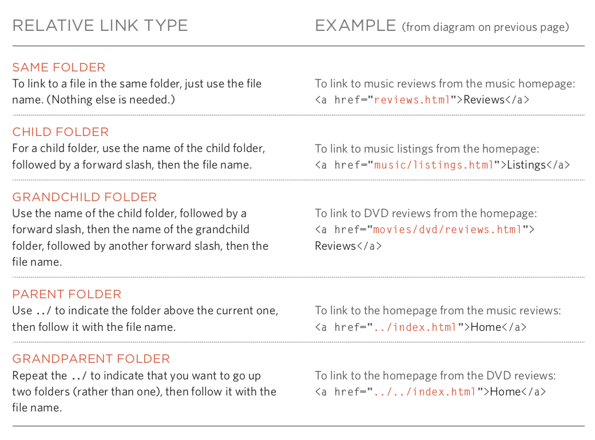
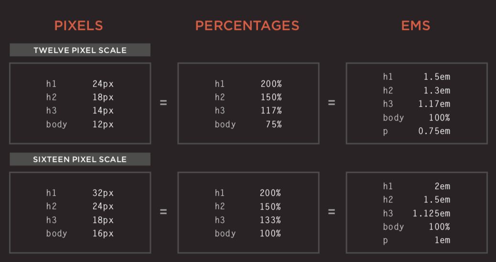
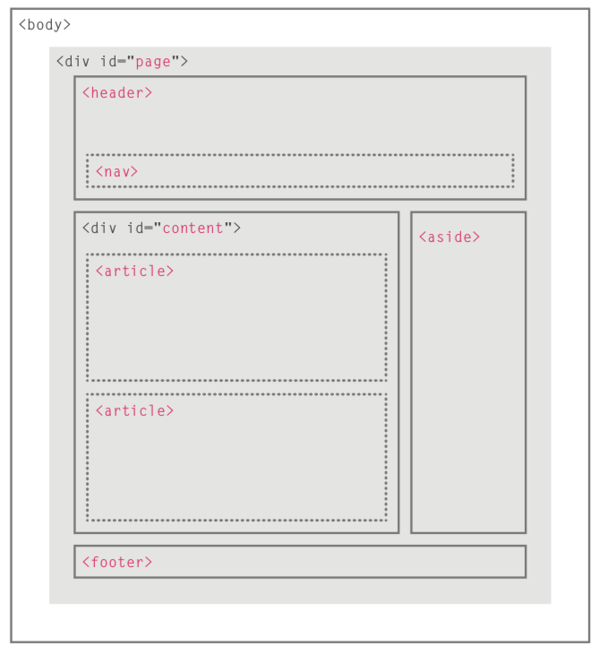
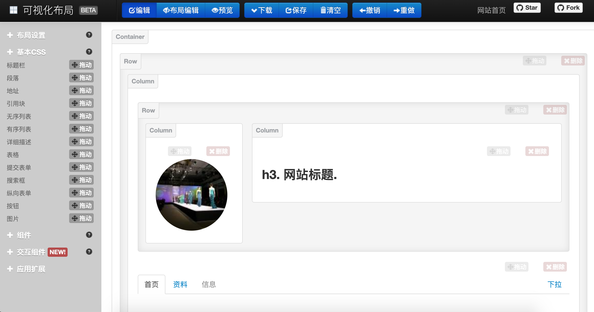

## Web Ön Yüzüne Genel Bakış

> **Translated to Turkish by** himmetcanumutlu

> **Not**: Bu yazıda kullanılan bazı görseller, *Jon Duckett*'in *[HTML and CSS: Design and Build Websites](https://www.amazon.cn/dp/1118008189/ref=sr_1_5?__mk_zh_CN=%E4%BA%9A%E9%A9%AC%E9%80%8A%E7%BD%91%E7%AB%99&keywords=html+%26+css&qid=1554609325&s=gateway&sr=8-5)* kitabından alınmıştır; bu, ön yüz için çok iyi bir başlangıç kitabıdır; merak edenler Amazon veya başka sitelerde kitabın satın alma bağlantısını bulabilir.

HTML, web sayfalarını tanımlayan bir dildir; tam adı Hyper-Text Markup Language'dir (Hiper Metin İşaretleme Dili). Web sayfalarını gezerken gördüğümüz metin, düğme, görsel, video gibi öğeler, HTML ile yazılır ve tarayıcı tarafından görüntülenir.

### HTML'in Kısa Tarihi

1. Ekim 1991: Bir gayri resmî CERN ([Avrupa Nükleer Araştırma Merkezi](https://zh.wikipedia.org/wiki/%E6%AD%90%E6%B4%B2%E6%A0%B8%E5%AD%90%E7%A0%94%E7%A9%B6%E7%B5%84%E7%B9%94)) belgesi 18 HTML etiketini ilk kez kamuya açtı; bu belgenin yazarı fizikçi [Tim Berners-Lee](https://zh.wikipedia.org/wiki/%E8%92%82%E5%A7%86%C2%B7%E4%BC%AF%E7%BA%B3%E6%96%AF-%E6%9D%8E)'dir; bu nedenle o, [World Wide Web'in](https://zh.wikipedia.org/wiki/%E4%B8%87%E7%BB%B4%E7%BD%91) mucidi ve [World Wide Web Konsorsiyumu](https://zh.wikipedia.org/wiki/%E4%B8%87%E7%BB%B4%E7%BD%91%E8%81%94%E7%9B%9F)'nun başkanıdır.
2. Kasım 1995: HTML 2.0 standardı yayımlandı (RFC 1866).
3. Ocak 1997: HTML 3.2, [W3C](https://zh.wikipedia.org/wiki/W3C) önerilen standardı olarak yayımlandı.
4. Aralık 1997: HTML 4.0, W3C önerilen standardı olarak yayımlandı.
5. Aralık 1999: HTML 4.01, W3C önerilen standardı olarak yayımlandı.
6. Ocak 2008: HTML5, W3C tarafından çalışma taslağı olarak yayımlandı.
7. Mayıs 2011: W3C, HTML5'i "son çağrı" (Last Call) aşamasına taşıdı.
8. Aralık 2012: W3C, HTML5'i "aday öneri" aşamasına taşıdı.
9. Ekim 2014: HTML5, kararlı W3C önerilen standardı olarak yayımlandı; bu, HTML5'in standartlaşmasının tamamlandığı anlamına gelir.

#### HTML5'in Yeni Özellikleri

1. Yerel çoklu ortam desteği getirdi (audio ve video etiketleri)
2. Programlanabilir içerik getirdi (canvas etiketi)
3. Semantik web getirdi (article, aside, details, figure, footer, header, nav, section, summary gibi etiketler)
4. Yeni form kontrolleri getirdi (takvim, e-posta, arama, kaydırıcı vb.)
5. Çevrimdışı depolamaya daha iyi destek getirdi (localStorage ve sessionStorage)
6. Konum, sürükle-bırak, WebSocket, arka plan görevleri gibi desteği getirdi

### Etiketlerle İçerik Taşımak


####  Yapı

- html
  - head
    - title
    - meta
  - body

#### Metin

- Başlık (heading) ve paragraf (paragraph)
  - h1 ~ h6
  - p
- Üst simge (superscript) ve alt simge (subscript)
  - sup
  - sub
- Boşluk (beyaz boşluk daraltma)
- Satır sonu (break) ve yatay cetvel (horizontal ruler)
  - br
  - hr
- Semantik etiketler
  - Kalın ve vurgu - strong
  - Alıntı - blockquote
  - Kısaltma ve baş harfler - abbr / acronym
  - Atıf - cite
  - Sahip iletişim bilgisi - address
  - İçeriğin değiştirilmesi - ins / del

#### Liste (list)

 - Sıralı liste (ordered list) - ol / li
 - Sırasız liste (unordered list) - ul / li
 - Tanımlı liste (definition list) - dl / dt / dd

#### Bağlantı (anchor)

- Sayfa bağlantısı
- Çapa bağlantısı
- İşlev bağlantısı

#### Görsel (image)

- Görselin saklanma konumu

  

- Görsel ve genişlik/yükseklik

- Doğru görsel biçimini seçmek
  - JPEG
  - GIF
  - PNG

- Vektör grafik

- Semantik etiketler - figure / figcaption

#### Tablo (table)

- Temel tablo yapısı - table / tr / td / th
- Tablo başlığı - caption
- Satır ve sütun birleştirme - rowspan özniteliği / colspan özniteliği
- Uzun tablolar - thead / tbody / tfoot

#### Form (form)

- Önemli öznitelikler - action / method / enctype
- Form kontrolü (input) - type özniteliği
  - Metin kutusu - `text` / parola kutusu - `password` / sayı kutusu - `number`
  - E-posta - `email` / telefon - `tel` / tarih - `date` / kaydırıcı - `range` / URL - `url` / arama - `search`
  - Tek seçim düğmesi - `radio` / çoklu seçim düğmesi - `checkbox`
  - Dosya yükleme - `file` / gizli alan - `hidden`
  - Gönder düğmesi - `submit` / görsel düğme - `image` / sıfırlama düğmesi - `reset`
- Açılır liste - select / option
- Metin alanı (çok satırlı metin) - textarea
- Form öğelerini gruplama - fieldset / legend

#### Ses ve Video (audio / video)

- Video biçimleri ve oynatıcı
- Video barındırma hizmetleri
- Video eklemenin hazırlıkları
- video etiketi ve öznitelikleri - autoplay / controls / loop / muted / preload / src
- audio etiketi ve öznitelikleri - autoplay / controls / loop / muted / preload / src / width / height / poster

#### Pencere (frame)

- Çerçeve kümesi (eski, önerilmez) - frameset / frame

- Gömülü pencere - iframe

#### Diğer

- Belge tipi

  ```HTML
  <!doctype html>
  ```

  ```HTML
  <!DOCTYPE HTML PUBLIC "-//W3C//DTD HTML 4.01//EN" "http://www.w3.org/TR/html4/strict.dtd">
  ```

  ```HTML
  <!DOCTYPE HTML PUBLIC "-//W3C//DTD HTML 4.01 Transitional//EN" "http://www.w3.org/TR/html4/loose.dtd">
  ```

- Yorum

  ```HTML
  <!-- Bu bir yorumdur, yorum iç içe olamaz -->
  ```

- Öznitelikler
  - id: benzersiz kimlik
  - class: öğenin ait olduğu sınıf, farklı öğeleri ayırmak için kullanılır
  - title: öğenin ek bilgisi (fareyle üzerine gelinince araç ipucu metni gösterilir)
  - tabindex: Tab tuşuyla geçiş sırası
  - contenteditable: öğenin düzenlenebilir olup olmadığı
  - draggable: öğenin sürüklenebilir olup olmadığı

- Blok düzeyi öğeler / satır düzeyi öğeler

- Karakter varlıkları (varlık değiştirme)

  

### CSS ile Sayfa Render Etmek

#### Giriş

- CSS'in işlevi

- CSS'in çalışma prensibi

- Kurallar, özellikler ve değerler

  

- Yaygın seçiciler

  

#### Renk (color)

- Rengin nasıl belirtileceği
- Renk terimleri ve renk karşıtlığı
- Arka plan rengi

#### Metin (text / font)

- Metnin boyutu ve yazı tipi (font-size / font-family)

  

  

- Kalınlık, stil, esneme ve dekorasyon (font-weight / font-style / font-stretch / text-decoration)

  

- Satır aralığı (line-height), harf aralığı (letter-spacing) ve kelime aralığı (word-spacing)

- Hizalama (text-align) ve girinti (text-indent)

- Bağlantı stilleri (:link / :visited / :active / :hover)

- CSS3 yeni özellikleri
  - Gölge efekti - text-shadow
  - İlk harf ve ilk satır metni (:first-letter / :first-line)
  - Kullanıcıya yanıt verme

#### Kutu (box model)

- Kutu boyutunun kontrolü (width / height)

  

- Kutunun kenarlığı, dış boşluğu ve iç boşluğu (border / margin / padding)

  

- Kutunun gösterilmesi ve gizlenmesi (display / visibility)

- CSS3 yeni özellikleri
  - Kenarlık görseli (border-image)
  - Gölge (box-shadow)
  - Yuvarlak köşe (border-radius)

#### Liste, Tablo ve Form

- Listenin madde işareti (list-style)
- Tablonun kenarlığı ve arka planı (border-collapse)
- Form kontrolünün görünümü
- Form kontrolünün hizalanması
- Tarayıcının geliştirici araçları

#### Görsel

- Görselin boyutunu kontrol etme (display: inline-block)
- Görseli hizalama
- Arka plan görseli (background / background-image / background-repeat / background-position)

#### Düzen

- Öğenin konumunu kontrol etme (position / z-index)
  - Normal akış
  - Göreli konumlandırma
  - Mutlak konumlandırma
  - Sabit konumlandırma
  - Kayan öğeler (float / clear)
- Site düzeni

  - HTML5 düzeni

    
- Ekran boyutuna uyum
  - Sabit genişlikli düzen
  - Akışkan düzen
  - Düzen ızgarası

### JavaScript ile Davranışı Kontrol Etmek

#### JavaScript Temel Sözdizimi

- Deyimler ve yorumlar
- Değişkenler ve veri tipleri
  - Bildirim ve atama
  - Basit ve karmaşık veri tipleri
  - Değişken adlandırma kuralları
- İfadeler ve operatörler
  - Atama operatörleri
  - Aritmetik operatörler
  - Karşılaştırma operatörleri
  - Mantıksal operatörler: `&&`, `||`, `!`
- Dallanma yapısı
  - `if...else...`
  - `switch...case...default...`
- Döngü yapısı
  - `for` döngüsü
  - `while` döngüsü
  - `do...while` döngüsü
- Diziler
  - Dizi oluşturma
  - Dizideki elemanları işleme
- Fonksiyonlar
  - Fonksiyon bildirme
  - Fonksiyon çağırma
  - Parametreler ve dönüş değeri
  - Anonim fonksiyonlar
  - Anında çağrılan fonksiyonlar

#### Nesne Yönelimli Programlama

 - Nesne kavramı
 - Nesne oluşturan hazır değer sözdizimi
 - Üye erişim operatörü
 - Nesne oluşturan kurucu sözdizimi
    - `this` anahtar sözcüğü
 - Öznitelik ekleme ve silme
    - `delete` anahtar sözcüğü
 - Standart nesneler
    - `Number` / `String` / `Boolean` / `Symbol` / `Array` / `Function` 
    - `Date` / `Error` / `Math` / `RegExp` / `Object` / `Map` / `Set`
    - `JSON` / `Promise` / `Generator` / `Reflect` / `Proxy`

#### BOM

 - `window` nesnesinin öznitelikleri ve metotları
 - `history` nesnesi
    - `forward()` / `back()` / `go()`
 - `location` nesnesi
 - `navigator` nesnesi
 - `screen` nesnesi

#### DOM

 - DOM ağacı
 - Öğelere erişim
    - `getElementById()` / `querySelector()`
    - `getElementsByClassName()` / `getElementsByTagName()` / `querySelectorAll()`
    - `parentNode` / `previousSibling` / `nextSibling` / `children` / `firstChild` / `lastChild`
- Öğeleri işleme
  - `nodeValue`
  - `innerHTML` / `textContent` / `createElement()` / `createTextNode()` / `appendChild()` / `insertBefore()` / `removeChild()`
  - `className` / `id` / `hasAttribute()` / `getAttribute()` / `setAttribute()` / `removeAttribute()`
- Olay işleme
  - Olay tipleri
    - UI olayları: `load` / `unload` / `error` / `resize` / `scroll`
    - Klavye olayları: `keydown` / `keyup` / `keypress`
    - Fare olayları: `click` / `dblclick` / `mousedown` / `mouseup` / `mousemove` / `mouseover` / `mouseout`
    - Odak olayları: `focus` / `blur`
    - Form olayları: `input` / `change` / `submit` / `reset` / `cut` / `copy` / `paste` / `select`
  - Olay bağlama
    - HTML olay işleyicisi (önerilmez; çünkü etiket ile kod ayrılmalıdır)
    - Geleneksel DOM olay işleyicisi (yalnızca bir geri çağrı fonksiyonu eklenebilir)
    - Olay dinleyicisi (eski tarayıcılarda desteklenmez)
  - Olay akışı: olay yakalama / olay kabarcıklanması
  - Olay nesnesi (düşük sürüm IE'de window.event)
    - `target` (bazı tarayıcılar srcElement kullanır)
    - `type`
    - `cancelable`
    - `preventDefault()`
    - `stopPropagation()` (düşük sürüm IE'de cancelBubble)
  - Fare olayları - olayın gerçekleştiği konum
    - Ekran konumu: `screenX` ve `screenY`
    - Sayfa konumu: `pageX` ve `pageY`
    - İstemci konumu: `clientX` ve `clientY`
  - Klavye olayları - hangi tuşa basıldı
    - `keyCode` özniteliği (bazı tarayıcılar `which` kullanır)
    - `String.fromCharCode(event.keyCode)`
  - HTML5 olayları
    - `DOMContentLoaded`
    - `hashchange`
    - `beforeunload`

#### JavaScript API

- İstemci tarafı depolama - `localStorage` ve `sessionStorage`

  ```JavaScript
  localStorage.colorSetting = '#a4509b';
  localStorage['colorSetting'] = '#a4509b';
  localStorage.setItem('colorSetting', '#a4509b');
  ```

- Konum bilgisi alma - `geolocation`

  ```JavaScript
  navigator.geolocation.getCurrentPosition(function(pos) { 		  
      console.log(pos.coords.latitude)
      console.log(pos.coords.longitude)
  })
  ```

- Sunucudan veri alma - Fetch API
- Grafik çizme - `<canvas>` API'si
- Ses ve video - `<audio>` ve `<video>` API'si

### Ön Yüz Framework'leri

#### Aşamalı (progressive) framework - [Vue.js](<https://cn.vuejs.org/>)

Ön/arka uç ayrımıyla geliştirmede (ön yüz render) zorunlu framework.

##### Hızlı Başlangıç

1. Vue'nun JavaScript dosyasını ekleyin; yine CDN sunucusundan yüklemenizi öneririz.

   ```HTML
   <script src="https://cdn.jsdelivr.net/npm/vue"></script>
   ```

2. Veri bağlama (bildirimsel render).

   ```HTML
   <div id="app">
   	<h1>{{ product }} stok bilgisi</h1>
   </div>
   
   <script src="https://cdn.jsdelivr.net/npm/vue"></script>
   <script>
   	const app = new Vue({
   		el: '#app',
   		data: {
   			product: 'iPhone X'
   		}
   	});
   </script>
   ```

3. Koşul ve döngü.

   ```HTML
   <div id="app">
   	<h1>Stok bilgisi</h1>
       <hr>
   	<ul>
   		<li v-for="product in products">
   			{{ product.name }} - {{ product.quantity }}
   			<span v-if="product.quantity === 0">
   				Tükendi
   			</span>
   		</li>
   	</ul>
   </div>
   
   <script src="https://cdn.jsdelivr.net/npm/vue"></script>
   <script>
   	const app = new Vue({
   		el: '#app',
   		data: {
   			products: [
   				{"id": 1, "name": "iPhone X", "quantity": 20},
   				{"id": 2, "name": "Huawei Mate20", "quantity": 0},
   				{"id": 3, "name": "Xiaomi Mix3", "quantity": 50}
   			]
   		}
   	});
   </script>
   ```

4. Hesaplanan özellikler.

   ```HTML
   <div id="app">
   	<h1>Stok bilgisi</h1>
   	<hr>
   	<ul>
   		<li v-for="product in products">
   			{{ product.name }} - {{ product.quantity }}
   			<span v-if="product.quantity === 0">
   				Tükendi
   			</span>
   		</li>
   	</ul>
   	<h2>Toplam stok: {{ totalQuantity }} adet</h2>
   </div>
   
   <script src="https://cdn.jsdelivr.net/npm/vue"></script>
   <script>
   	const app = new Vue({
   		el: '#app',
   		data: {
   			products: [
   				{"id": 1, "name": "iPhone X", "quantity": 20},
   				{"id": 2, "name": "Huawei Mate20", "quantity": 0},
   				{"id": 3, "name": "Xiaomi Mix3", "quantity": 50}
   			]
   		},
   		computed: {
   			totalQuantity() {
   				return this.products.reduce((sum, product) => {
   					return sum + product.quantity
   				}, 0);
   			}
   		}
   	});
   </script>
   ```

5. Olayları işleme.

   ```HTML
   <div id="app">
   	<h1>Stok bilgisi</h1>
   	<hr>
   	<ul>
   		<li v-for="product in products">
   			{{ product.name }} - {{ product.quantity }}
   			<span v-if="product.quantity === 0">
   				Tükendi
   			</span>
   			<button @click="product.quantity += 1">
   				Stok artır
   			</button>
   		</li>
   	</ul>
   	<h2>Toplam stok: {{ totalQuantity }} adet</h2>
   </div>
   
   <script src="https://cdn.jsdelivr.net/npm/vue"></script>
   <script>
   	const app = new Vue({
   		el: '#app',
   		data: {
   			products: [
   				{"id": 1, "name": "iPhone X", "quantity": 20},
   				{"id": 2, "name": "Huawei Mate20", "quantity": 0},
   				{"id": 3, "name": "Xiaomi Mix3", "quantity": 50}
   			]
   		},
   		computed: {
   			totalQuantity() {
   				return this.products.reduce((sum, product) => {
   					return sum + product.quantity
   				}, 0);
   			}
   		}
   	});
   </script>
   ```

6. Kullanıcı girdisi.

   ```HTML
   <div id="app">
   	<h1>Stok bilgisi</h1>
   	<hr>
   	<ul>
   		<li v-for="product in products">
   			{{ product.name }} - 
   			<input type="number" v-model.number="product.quantity" min="0">
   			<span v-if="product.quantity === 0">
   				Tükendi
   			</span>
   			<button @click="product.quantity += 1">
   				Stok artır
   			</button>
   		</li>
   	</ul>
   	<h2>Toplam stok: {{ totalQuantity }} adet</h2>
   </div>
   
   <script src="https://cdn.jsdelivr.net/npm/vue"></script>
   <script>
   	const app = new Vue({
   		el: '#app',
   		data: {
   			products: [
   				{"id": 1, "name": "iPhone X", "quantity": 20},
   				{"id": 2, "name": "Huawei Mate20", "quantity": 0},
   				{"id": 3, "name": "Xiaomi Mix3", "quantity": 50}
   			]
   		},
   		computed: {
   			totalQuantity() {
   				return this.products.reduce((sum, product) => {
   					return sum + product.quantity
   				}, 0);
   			}
   		}
   	});
   </script>
   ```

7. Ağ üzerinden JSON verisi yükleme.

   ```HTML
   <div id="app">
   	<h2>Stok bilgisi</h2>
   	<ul>
   		<li v-for="product in products">
   			{{ product.name }} - {{ product.quantity }}
   			<span v-if="product.quantity === 0">
   				Tükendi
   			</span>
   		</li>
   	</ul>
   </div>
   
   <script src="https://cdn.jsdelivr.net/npm/vue"></script>
   <script>
   	const app = new Vue({
   		el: '#app',
   		data: {
   			products: []
   		}，
   		created() {
   			fetch('https://jackfrued.top/api/products')
   				.then(response => response.json())
   				.then(json => {
   					this.products = json
   				});
   		}
   	});
   </script>
   ```

##### İskele aracı kullanma - vue-cli

Vue, ticari proje geliştirme için çok pratik bir iskele aracı olan vue-cli'yi sunar; bu araçla geliştirme, test ve çalışma ortamlarını elle yapılandırma adımları atlanır; geliştirici yalnızca çözülecek soruna odaklanır.

1. İskeleyi kur.
2. Projeyi oluştur.
3. Bağımlılık paketlerini kur.
4. Projeyi çalıştır.


#### UI framework - [Element](<http://element-cn.eleme.io/#/zh-CN>)

Vue 2.0 tabanlı masaüstü bileşen kütüphanesi; kullanıcı arayüzü oluşturmak için kullanılır; duyarlı düzeni destekler.

1. Element'in CSS ve JavaScript dosyalarını ekleyin.

   ```HTML
   <!-- Stili ekle -->
   <link rel="stylesheet" href="https://unpkg.com/element-ui/lib/theme-chalk/index.css">
   <!-- Bileşen kütüphanesini ekle -->
   <script src="https://unpkg.com/element-ui/lib/index.js"></script>
   ```

2. Basit bir örnek.

   ```HTML
   <!DOCTYPE html>
   <html>
   	<head>
   		<meta charset="UTF-8">
   		<link rel="stylesheet" href="https://unpkg.com/element-ui/lib/theme-chalk/index.css">
   	</head>
   	<body>
   		<div id="app">
   			<el-button @click="visible = true">Tıkla</el-button>
   			<el-dialog :visible.sync="visible" title="Hello world">
   				<p>Element'i kullanmaya başlayın</p>
   			</el-dialog>
               </div>
   	</body>
   	<script src="https://unpkg.com/vue/dist/vue.js"></script>
   	<script src="https://unpkg.com/element-ui/lib/index.js"></script>
   	<script>
   		new Vue({
   			el: '#app',
   			data: {
   				visible: false,
   			}
   		})
   	</script>
   </html>
   ```

3. Bileşenleri kullanma.

   ```HTML
   <!DOCTYPE html>
   <html>
   	<head>
   		<meta charset="UTF-8">
   		<link rel="stylesheet" href="https://unpkg.com/element-ui/lib/theme-chalk/index.css">
   	</head>
   	<body>
   		<div id="app">
   			<el-table :data="tableData" stripe style="width: 100%">
   				<el-table-column prop="date" label="Tarih" width="180">
   				</el-table-column>
   				<el-table-column prop="name" label="Ad" width="180">
   				</el-table-column>
   				<el-table-column prop="address" label="Adres">
   				</el-table-column>
   			</el-table>
   		</div>
   	</body>
   	<script src="https://unpkg.com/vue/dist/vue.js"></script>
   	<script src="https://unpkg.com/element-ui/lib/index.js"></script>
   	<script>
   		new Vue({
   			el: '#app',
   			data: {
   				tableData:  [
   					{
   						date: '2016-05-02',
   						name: 'Ali Yılmaz',
   						address: 'İstanbul Kadıköy, Bağdat Cad. No:1518'
   					}, 
   					{
   						date: '2016-05-04',
   						name: 'Ayşe Demir',
   						address: 'İstanbul Kadıköy, Bağdat Cad. No:1517'
   					}, 
   					{
   						date: '2016-05-01',
   						name: 'Veli Kaya',
   						address: 'İstanbul Kadıköy, Bağdat Cad. No:1519'
   					}, 
   					{
   						date: '2016-05-03',
   						name: 'Fatma Şahin',
   						address: 'İstanbul Kadıköy, Bağdat Cad. No:1516'
   					}
   				]
   			}
   		})
   	</script>
   </html>
   ```


#### Rapor framework'ü - [ECharts](<https://echarts.baidu.com>)

Baidu'nun çıkardığı açık kaynak görselleştirme kütüphanesi; çeşitli rapor tiplerini üretmek için yaygın kullanılır.


#### Flexbox tabanlı CSS framework - [Bulma](<https://bulma.io/>)

Bulma, Flexbox tabanlı modern bir CSS framework'üdür; çıkış noktası mobil öncelikli (Mobile First) ve modüler tasarımdır; basit veya karmaşık içerik düzenlerini kolayca gerçekleştirmek için kullanılabilir; CSS bilmeyen geliştiriciler bile onunla güzel sayfalar özelleştirebilir.

```HTML
<!DOCTYPE html>
<html lang="en">
<head>
	<meta charset="UTF-8">
	<title>Bulma</title>
	<link href="https://cdn.bootcss.com/bulma/0.7.4/css/bulma.min.css" rel="stylesheet">
	<style type="text/css">
		div { margin-top: 10px; }
		.column { color: #fff; background-color: #063; margin: 10px 10px; text-align: center; }
	</style>
</head>
<body>
	<div class="columns">
		<div class="column">1</div>
		<div class="column">2</div>
		<div class="column">3</div>
		<div class="column">4</div>
	</div>
	<div>
		<a class="button is-primary">Primary</a>
		<a class="button is-link">Link</a>
		<a class="button is-info">Info</a>
		<a class="button is-success">Success</a>
		<a class="button is-warning">Warning</a>
		<a class="button is-danger">Danger</a>
	</div>
	<div>
		<progress class="progress is-danger is-medium" max="100">60%</progress>
	</div>
	<div>
		<table class="table is-hoverable">
			<tr>
				<th>One</th>
				<th>Two</th>
			</tr>
			<tr>
				<td>Three</td>
				<td>Four</td>
			</tr>
			<tr>
				<td>Five</td>
				<td>Six</td>
			</tr>
			<tr>
				<td>Seven</td>
				<td>Eight</td>
			</tr>
			<tr>
				<td>Nine</td>
				<td>Ten</td>
			</tr>
			<tr>
				<td>Eleven</td>
				<td>Twelve</td>
			</tr>
		</table>
	</div>
</body>
</html>
```

#### Duyarlı düzen framework'ü - [Bootstrap](<http://www.bootcss.com/>)

Web uygulamalarını hızla geliştirmek için kullanılan ön yüz framework'ü; duyarlı düzeni destekler.

1. Özellikler
   - Yaygın tarayıcıları ve mobil cihazları destekler
   - Öğrenmesi kolaydır
   - Duyarlı tasarım

2. İçerik
   - Izgara sistemi
   - Kapsüllenmiş CSS
   - Hazır bileşenler
   - JavaScript eklentileri

3. Görselleştirme

       
