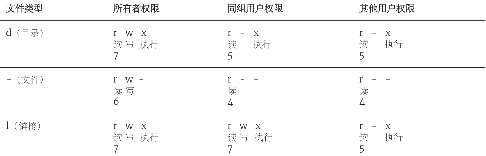
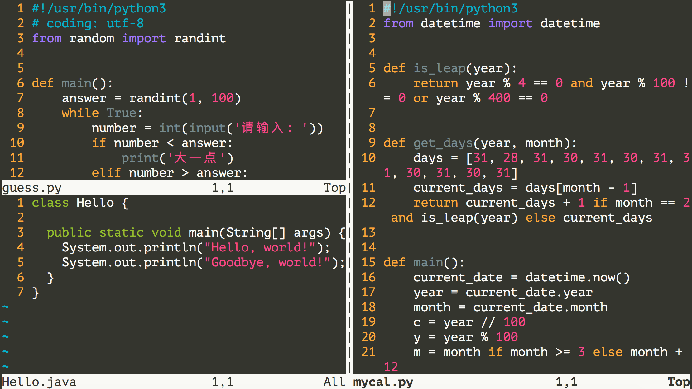
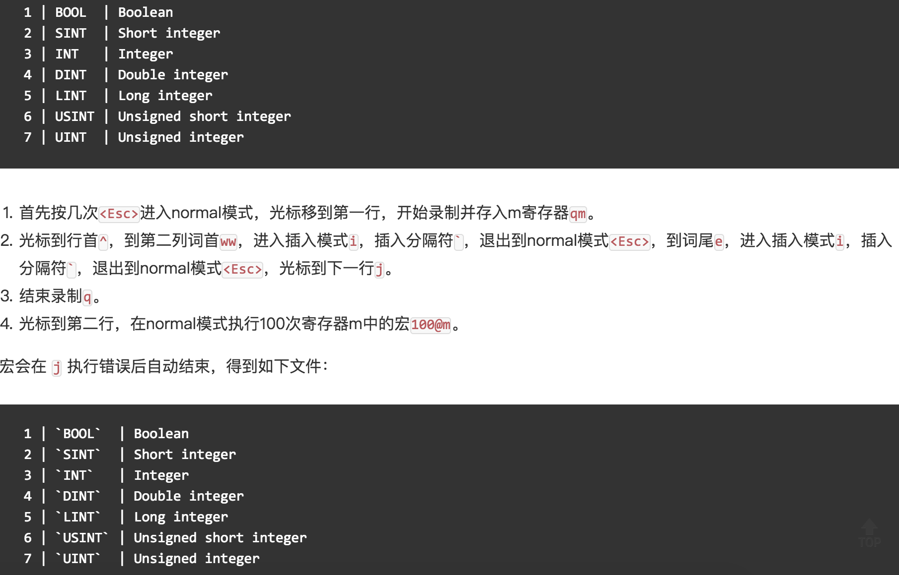

## Linux İşletim Sistemini Keşfetmek

> **Translated to Turkish by** himmetcanumutlu

> **Not**: Bu yazıdaki Linux komut anlatımları CentOS adlı Linux dağıtımına dayanır; ben Alibaba Cloud sunucusu kullanıyorum, sistem sürümü CentOS Linux release 7.6.1810. Farklı Linux dağıtımlarında Shell komutları ve araç programları arasında bazı farklar olabilir, ancak bu farklar çok küçüktür.

### İşletim Sistemi Gelişim Tarihi

Yalnızca donanımı olan ama yazılımı olmayan bilgisayar sistemine "çıplak makine" denir; günlük bilgisayar işlerini (depolama ve hesaplama gibi) "çıplak makine" ile yapmak çok zordur; bu yüzden donanımı kontrol etmek için belirli yazılımlar gerekir. Bilgisayar donanımına en yakın yazılım, sistem yazılımıdır; bunların en önemlisi de "işletim sistemi"dir. "İşletim sistemi", tüm bilgisayar donanım ve yazılım kaynaklarını kontrol edip yöneten, kaynak tahsisi ve görev düzenlemesi yapan, sistem kullanıcılarına ve diğer yazılımlara arayüz ve ortam sağlayan programlar bütünüdür.

#### İşletim Sistemi Olmayan Dönem (elle işletim)

Bilgisayarın ilk doğduğu ve işletim sisteminin olmadığı dönemde insanlar önce program delgi şeridini (veya kartını) bilgisayara takar, sonra giriş makinesini başlatıp programı bilgisayara gönderir, ardından konsol anahtarlarıyla programı çalıştırırdı. Program bittiğinde yazıcı sonucu basar, kullanıcı şeridi (veya kartı) çıkarıp alırdı. İkinci kullanıcı makineye geçip aynı adımları tekrar ederdi. Tüm süreçte kullanıcı makineyi tek başına kullanır, CPU elle işlemleri bekler, kaynak kullanımı son derece düşüktü.

#### Toplu İşlem (batch) Sistemi

Önce bilgisayarda bir gözetim programı başlatılır; gözetim programının kontrolünde bilgisayar, bir veya daha fazla kullanıcının işini otomatik ve toplu halde işleyebilir. Bir grup iş bittiğinde gözetim programı, giriş makinesinden işleri okuyup teyp makinesine kaydeder. Yukarıdaki adımlara göre görevler tekrarlanır. Gözetim programı sürekli işleri işleyip işlerin otomatik devrini sağlar; iş kurma süresi ve elle işlem süresi azalır, bilgisayar kaynaklarının kullanımı artar. Toplu işlem sistemi; tek kanallı toplu işlem, çok kanallı toplu işlem, çevrimiçi toplu işlem ve çevrimdışı toplu işlem olarak ayrılabilir.

#### Zaman Paylaşımlı ve Gerçek Zamanlı Sistemler

Zaman paylaşımlı sistem, işlemcinin çalışma süresini çok kısa zaman dilimlerine böler ve zaman dilimlerine göre işlemciyi sırayla her çevrimiçi işe tahsis eder. Bir iş, kendisine ayrılan zaman diliminde hesaplamasını bitiremezse geçici olarak kesilir, işlemci başka bir işe verilir, bir sonraki çizelgelemede kaldığı yerden devam eder. Bilgisayar çok hızlı olduğundan işler çok hızlı döner ve her kullanıcıya bilgisayarı tek başına kullanıyormuş hissi verir. Her kullanıcı kendi terminali üzerinden sisteme çeşitli işlem kontrol komutları gönderebilir ve tam insan-makine etkileşimiyle işini tamamlar. Zaman paylaşımlı sistemin kullanıcı komutlarına zamanında yanıt verememesi sorununu çözmek için, olayları katı zaman aralığında işleyebilen ve rastgele dış olaylara zamanında yanıt veren gerçek zamanlı sistemler ortaya çıkmıştır.

#### Genel Amaçlı İşletim Sistemi

1. 1960'lar: IBM'in System/360 serisi makineleri tek tip OS/360 işletim sistemine sahip oldu.

2. 1965: AT&T'nin Bell Laboratuvarları, GE ve MIT'nin iş birliği planına katılıp MULTICS'i geliştirmeye başladı.

3. 1969: MULTICS projesi başarısız oldu; Ken Thompson evde boş otururken "Space Travel" oyununu oynamak için, o dönemde emekliye ayrılmış PDP-7'de assembly diliyle Unics'i geliştirdi.

   > Not: Unix gibi büyük bir işletim sisteminin, evde boş oturan bir programcı (üstelik karısı çocukları da alıp baba evine gitmişken) tarafından, emekliye ayrılmış bir cihazda oyun oynamak için geliştirilmiş olması inanılmaz.

4. 1970~1971: Ken Thompson ve Dennis Ritchie, B diliyle PDP-11 üzerinde Unics'i yeniden yazdı ve Brian Kernighan'ın önerisiyle adını Unix olarak değiştirdi.

   

5. 1972~1973: Dennis Ritchie, taşınabilirliği zayıf B dilinin yerine C dilini icat etti ve Unix'i C diliyle yeniden yazma çalışmasını başlattı.

6. 1974: Unix, neredeyse tamamen C diliyle gerçeklenen dönüm noktası 5. sürümünü çıkardı.

7. 1979: Unix 7. sürümünden itibaren AT&T yeni kullanım koşulları yayımlayıp Unix'i özelleştirdi.

8. 1987: Prof. Andrew S. Tanenbaum, derste öğrencilere işletim sisteminin çalışma ayrıntılarını anlatabilmek için, AT&T'nin hiçbir kaynak kodunu kullanmadan, telif hakkı tartışmasından kaçınmak amacıyla Unix ile uyumlu bir işletim sistemi geliştirmeye karar verdi; bu sisteme Minix adı verildi.

   

9. 1991: Linus Torvalds, Finlandiya'daki Helsinki Üniversitesi'nde okurken Minix üzerinde bazı geliştirmeler yapmayı denedi; ancak Minix yalnızca öğretim amaçlı bir işletim sistemi olduğundan işlevi güçlü değildi. Okulun haber grubunda ve e-posta sisteminde dosya okuyup indirmeyi kolaylaştırmak için Linus disk sürücüsü ve dosya sistemi yazdı; bunlar Linux çekirdeğinin ilk biçimini oluşturdu.

   

Aşağıdaki görsel Unix işletim sistemi ailesinin soyağacıdır.


### Linux'a Genel Bakış

Linux genel amaçlı bir işletim sistemidir. Bir işletim sistemi; görev çizelgeleme, bellek tahsisi, çevre birimlerinin I/O işlemleri gibi işlerden sorumludur. İşletim sistemi genellikle çekirdek (diğer programları çalıştıran, disk, yazıcı gibi donanım aygıtlarını yöneten çekirdek program) ve sistem programları (aygıt sürücüleri, alt seviye kütüphaneler, shell, hizmet programları vb.) olmak üzere iki bölümden oluşur.

Linux çekirdeği, Fin Linus Torvalds tarafından geliştirildi ve Eylül 1991'de yayımlandı. Linux işletim sistemi ise internet çağının bir ürünüdür; dünyadaki birçok geliştiricinin birlikte geliştirdiği özgür bir işletim sistemidir (özgür ile ücretsizin aynı kavram olmadığına dikkat edin; farkını öğrenmek için [buraya tıklayın](https://www.debian.org/intro/free)).

### Linux Sisteminin Avantajları

1. Genel amaçlı işletim sistemidir, belirli donanıma bağlı değildir.
2. C diliyle yazılmıştır, taşınabilirliği güçlüdür, çekirdek programlama arayüzü vardır.
3. Çok kullanıcılı ve çok görevli çalışmayı, güvenli katmanlı dosya sistemini destekler.
4. Çok sayıda yardımcı program, eksiksiz ağ işlevi ve güçlü destek dokümanı.
5. Güvenilir güvenlik ve iyi kararlılık, geliştiricilere daha dostane.

### Linux Dağıtım Sürümleri

1. [Redhat](https://www.redhat.com/en)
2. [Ubuntu](https://www.ubuntu.com/)
3. [CentOS](https://www.centos.org/)
4. [Fedora](https://getfedora.org/)
5. [Debian](https://www.debian.org/)
6. [openSUSE](https://www.opensuse.org/)

### Temel Komutlar

Linux sistem komutları genellikle şu biçimdedir:

```Shell
komut adı [adlandırılmış parametre] [komut nesnesi]
```

1. Giriş bilgisini alma - **w** / **who** / **last**/ **lastb**.

   ```Shell
   [root ~]# w
    23:31:16 up 12:16,  2 users,  load average: 0.00, 0.01, 0.05
   USER     TTY      FROM             LOGIN@   IDLE   JCPU   PCPU WHAT
   root     pts/0    182.139.66.250   23:03    4.00s  0.02s  0.00s w
   jackfrue pts/1    182.139.66.250   23:26    3:56   0.00s  0.00s -bash
   [root ~]# who
   root     pts/0        2018-04-12 23:03 (182.139.66.250)
   jackfrued pts/1        2018-04-12 23:26 (182.139.66.250)
   [root ~]# who am i
   root     pts/0        2018-04-12 23:03 (182.139.66.250)
   [root ~]# who mom likes
   root     pts/0        2018-04-12 23:03 (182.139.66.250)
   [root ~]# last
   root     pts/0        117.136.63.184   Sun May 26 18:57   still logged in   
   reboot   system boot  3.10.0-957.10.1. Mon May 27 02:52 - 19:10  (-7:-42)   
   root     pts/4        117.136.63.184   Sun May 26 18:51 - crash  (08:01)    
   root     pts/4        117.136.63.184   Sun May 26 18:49 - 18:49  (00:00)    
   root     pts/3        117.136.63.183   Sun May 26 18:35 - crash  (08:17)    
   root     pts/2        117.136.63.183   Sun May 26 18:34 - crash  (08:17)    
   root     pts/0        117.136.63.183   Sun May 26 18:10 - crash  (08:42)    
   ```

2. Kullandığınız Shell'i görüntüleme - **ps**.

   Shell, "kabuk" veya "kabuk programı" olarak da adlandırılır; kullanıcı ile işletim sistemi çekirdeği arasındaki çevirmendir; basitçe insan ile bilgisayar arasındaki arayüz ve etkileşim yüzeyidir. Günümüzde birçok Linux sisteminin varsayılan Shell'i bash'tir (<u>B</u>ourne <u>A</u>gain <u>SH</u>ell); çünkü tab tuşuyla komut ve yol tamamlama yapabilir, geçmiş komutları saklayabilir, ortam değişkenlerini kolayca yapılandırabilir ve toplu işlem yapabilir.

   ```Shell
   [root ~]# ps
     PID TTY          TIME CMD
    3531 pts/0    00:00:00 bash
    3553 pts/0    00:00:00 ps
   ```

3. Komutun açıklamasını ve konumunu görüntüleme - **whatis** / **which** / **whereis**.

   ```Shell
   [root ~]# whatis ps
   ps (1)        - report a snapshot of the current processes.
   [root ~]# whatis python
   python (1)    - an interpreted, interactive, object-oriented programming language
   [root ~]# whereis ps
   ps: /usr/bin/ps /usr/share/man/man1/ps.1.gz
   [root ~]# whereis python
   python: /usr/bin/python /usr/bin/python2.7 /usr/lib/python2.7 /usr/lib64/python2.7 /etc/python /usr/include/python2.7 /usr/share/man/man1/python.1.gz
   [root ~]# which ps
   /usr/bin/ps
   [root ~]# which python
   /usr/bin/python
   ```

4. Ekrandaki içeriği temizleme - **clear**.

5. Yardım dokümanını görüntüleme - **man** / **info** / **--help** / **apropos**.
   ```Shell
   [root@izwz97tbgo9lkabnat2lo8z ~]# ps --help
   Usage:
    ps [options]
    Try 'ps --help <simple|list|output|threads|misc|all>'
     or 'ps --help <s|l|o|t|m|a>'
    for additional help text.
   For more details see ps(1).
   [root@izwz97tbgo9lkabnat2lo8z ~]# man ps
   PS(1)                                User Commands                                PS(1)
   NAME
          ps - report a snapshot of the current processes.
   SYNOPSIS
          ps [options]
   DESCRIPTION
   ...
   ```

6. Sistem ve ana makine adını görüntüleme - **uname** / **hostname**.

   ```Shell
   [root@izwz97tbgo9lkabnat2lo8z ~]# uname
   Linux
   [root@izwz97tbgo9lkabnat2lo8z ~]# hostname
   izwz97tbgo9lkabnat2lo8z
   [root@iZwz97tbgo9lkabnat2lo8Z ~]# cat /etc/centos-release
   CentOS Linux release 7.6.1810 (Core)
   ```

   > Not: `cat`, dosya içeriğini birleştirip standart çıktıya yazdıran komuttur; ileride anlatılacak; `/etc`, Linux sisteminde çok önemli bir dizindir; birçok yapılandırma dosyasını saklar; `centos-release` bu dizindeki bir dosyadır; benim kullandığım dağıtım CentOS 7.6 olduğu için burada böyle bir dosya vardır.

7. Saat ve tarih - **date** / **cal**.

   ```Shell
   [root@iZwz97tbgo9lkabnat2lo8Z ~]# date
   Wed Jun 20 12:53:19 CST 2018
   [root@iZwz97tbgo9lkabnat2lo8Z ~]# cal
         June 2018
   Su Mo Tu We Th Fr Sa
                   1  2
    3  4  5  6  7  8  9
   10 11 12 13 14 15 16
   17 18 19 20 21 22 23
   24 25 26 27 28 29 30
   [root@iZwz97tbgo9lkabnat2lo8Z ~]# cal 5 2017
         May 2017
   Su Mo Tu We Th Fr Sa
       1  2  3  4  5  6
    7  8  9 10 11 12 13
   14 15 16 17 18 19 20
   21 22 23 24 25 26 27
   28 29 30 31
   ```

8. Yeniden başlatma ve kapatma - **reboot** / **shutdown**.

   ```Shell
   [root ~]# shutdown -h +5
   Shutdown scheduled for Sun 2019-05-26 19:34:27 CST, use 'shutdown -c' to cancel.
   [root ~]# 
   Broadcast message from root (Sun 2019-05-26 19:29:27 CST):
   
   The system is going down for power-off at Sun 2019-05-26 19:34:27 CST!
   [root ~]# shutdown -c
   
   Broadcast message from root (Sun 2019-05-26 19:30:22 CST):
   
   The system shutdown has been cancelled at Sun 2019-05-26 19:31:22 CST!
   [root ~]# shutdown -r 23:58
   Shutdown scheduled for Sun 2019-05-26 23:58:00 CST, use 'shutdown -c' to cancel.
   [root ~]# shutdown -c
   
   Broadcast message from root (Sun 2019-05-26 19:31:06 CST):
   
   The system shutdown has been cancelled at Sun 2019-05-26 19:32:06 CST!
   ```

   > Not: `shutdown` komutu çalıştırılırken sisteme giriş yapmış kullanıcılara uyarı gönderilir; komutun arkasına uyarı mesajı ekleyerek varsayılan uyarıyı değiştirebilir, `-h` parametresinden sonra `now` yazarak hemen kapatmayı ifade edebilirsiniz.

9. Oturumu kapatma -  **exit** / **logout**.

10. Geçmiş komutları görüntüleme - **history**.

  ```Shell
  [root@iZwz97tbgo9lkabnat2lo8Z ~]# history
  ...
  452  ls
  453  cd Python-3.6.5/
  454  clear
  455  history
  [root@iZwz97tbgo9lkabnat2lo8Z ~]# !454
  ```

  > **Not**: Geçmiş komutları gördükten sonra `!geçmiş komut numarası` ile o komutu yeniden çalıştırabilirsiniz; `history -c` ile geçmiş komutlar temizlenir.

### Yardımcı Programlar

#### Dosya ve Klasör İşlemleri

1. Boş dizin oluşturma/silme - **mkdir** / **rmdir**.

   ```Shell
   [root ~]# mkdir abc
   [root ~]# mkdir -p xyz/abc
   [root ~]# rmdir abc
   ```

2. Dosya oluşturma/silme - **touch** / **rm**.

   ```Shell
   [root ~]# touch readme.txt
   [root ~]# touch error.txt
   [root ~]# rm error.txt
   rm: remove regular empty file ‘error.txt’? y
   [root ~]# rm -rf xyz
   ```

   - `touch` komutu boş dosya oluşturmak veya dosya zamanını değiştirmek için kullanılır. Linux sisteminde bir dosyanın üç zamanı vardır:
     - İçeriğin değiştirilme zamanı - mtime.
     - İznin değiştirilme zamanı - ctime.
     - Son erişim zamanı - atime.
   - `rm`'nin birkaç önemli parametresi:
     - `-i`: Etkileşimli silme, her silme öğesi için soru sorulur.
     - `-r`: Dizini ve içindeki dosya ve dizinleri özyinelemeli siler.
     - `-f`: Zorla siler, olmayan dosyaları yok sayar, hiçbir uyarı vermez.

3. Mevcut çalışma dizinini değiştirme ve görüntüleme - **cd** / **pwd**.

   > Not: `cd` komutundan sonra göreli yol (mevcut yolu referans alır) veya mutlak yol (`/` ile başlar) verilerek belirtilen dizine geçilebilir; `cd ..` ile bir üst dizine dönülür. Bir üst dizinin de üstüne dönmek için `cd` komutuna nasıl bir parametre verilmesi gerektiğini düşünün.

4. Dizin içeriğini görüntüleme - **ls**.

   - `-l`: Dosya ve dizinleri uzun biçimde görüntüler.
   - `-a`: Noktayla başlayan dosya ve dizinleri (gizli dosyalar) gösterir.
   - `-R`: Dizinle karşılaşınca özyinelemeli açılır (dizinin altındaki dosya ve dizinleri listelemeye devam eder).
   - `-d`: Yalnızca dizini listeler, başka içerik listelemez.
   - `-S` / `-t`: Boyuta / zamana göre sıralar.

5. Dosya içeriğini görüntüleme - **cat** / **tac** / **head** / **tail** / **more** / **less** / **rev** / **od**.

   ```Shell
   [root ~]# wget http://www.sohu.com/ -O sohu.html
   --2018-06-20 18:42:34--  http://www.sohu.com/
   Resolving www.sohu.com (www.sohu.com)... 14.18.240.6
   Connecting to www.sohu.com (www.sohu.com)|14.18.240.6|:80... connected.
   HTTP request sent, awaiting response... 200 OK
   Length: 212527 (208K) [text/html]
   Saving to: ‘sohu.html’
   100%[==================================================>] 212,527     --.-K/s   in 0.03s
   2018-06-20 18:42:34 (7.48 MB/s) - ‘sohu.html’ saved [212527/212527]
   [root ~]# cat sohu.html
   ...
   [root ~]# head -10 sohu.html
   <!DOCTYPE html>
   <html>
   <head>
   <title>搜狐</title>
   <meta name="Keywords" content="搜狐,门户网站,新媒体,网络媒体,新闻,财经,体育,娱乐,时尚,汽车,房产,科技,图片,论坛,微博,博客,视频,电影,电视剧"/>
   <meta name="Description" content="搜狐网为用户提供24小时不间断的最新资讯，及搜索、邮件等网络服务。内容包括全球热点事件、突发新闻、时事评论、热播影视剧、体育赛事、行业动态、生活服务信息，以及论坛、博客、微博、我的搜狐等互动空间。" />
   <meta name="shenma-site-verification" content="1237e4d02a3d8d73e96cbd97b699e9c3_1504254750">
   <meta charset="utf-8"/>
   <meta http-equiv="X-UA-Compatible" content="IE=Edge,chrome=1"/>
   [root ~]# tail -2 sohu.html
   </body>
   </html>
   [root ~]# less sohu.html
   ...
   [root ~]# cat -n sohu.html | more
   ...
   ```

   > **Not**: Yukarıda `wget` adlı bir komut kullanıldı; o bir ağ indirme programıdır; belirtilen URL'den kaynak indirir.

6. Dosya kopyalama/taşıma - **cp** / **mv**.

   ```Shell
   [root ~]# mkdir backup
   [root ~]# cp sohu.html backup/
   [root ~]# cd backup
   [root backup]# ls
   sohu.html
   [root backup]# mv sohu.html sohu_index.html
   [root backup]# ls
   sohu_index.html
   ```

7. Dosya yeniden adlandırma - **rename**.

  ```Shell
  [root@iZwz97tbgo9lkabnat2lo8Z ~]# rename .htm .html *.htm
  ```

8. Dosya ve içerik arama - **find** / **grep**.

   ```Shell
   [root@iZwz97tbgo9lkabnat2lo8Z ~]# find / -name "*.html"
   /root/sohu.html
   /root/backup/sohu_index.html
   [root@izwz97tbgo9lkabnat2lo8z ~]# find . -atime 7 -type f -print
   [root@izwz97tbgo9lkabnat2lo8z ~]# find . -type f -size +2k
   [root@izwz97tbgo9lkabnat2lo8z ~]# find . -type f -name "*.swp" -delete
   [root@iZwz97tbgo9lkabnat2lo8Z ~]# grep "<script>" sohu.html -n
   20:<script>
   [root@iZwz97tbgo9lkabnat2lo8Z ~]# grep -E \<\/?script.*\> sohu.html -n
   20:<script>
   22:</script>
   24:<script src="//statics.itc.cn/web/v3/static/js/es5-shim-08e41cfc3e.min.js"></script>
   25:<script src="//statics.itc.cn/web/v3/static/js/es5-sham-1d5fa1124b.min.js"></script>
   26:<script src="//statics.itc.cn/web/v3/static/js/html5shiv-21fc8c2ba6.js"></script>
   29:<script type="text/javascript">
   52:</script>
   ...
   ```
   > **Not**: `grep` string ararken düzenli ifade kullanabilir; düzenli ifade kullanmanız gerekirse `grep -E` veya doğrudan `egrep` kullanın.

9. Bağlantı oluşturma ve görüntüleme - **ln** / **readlink**.

   ```Shell
   [root@iZwz97tbgo9lkabnat2lo8Z ~]# ls -l sohu.html
   -rw-r--r-- 1 root root 212131 Jun 20 19:15 sohu.html
   [root@iZwz97tbgo9lkabnat2lo8Z ~]# ln /root/sohu.html /root/backup/sohu_backup
   [root@iZwz97tbgo9lkabnat2lo8Z ~]# ls -l sohu.html
   -rw-r--r-- 2 root root 212131 Jun 20 19:15 sohu.html
   [root@iZwz97tbgo9lkabnat2lo8Z ~]# ln /root/sohu.html /root/backup/sohu_backup2
   [root@iZwz97tbgo9lkabnat2lo8Z ~]# ls -l sohu.html
   -rw-r--r-- 3 root root 212131 Jun 20 19:15 sohu.html
   [root@iZwz97tbgo9lkabnat2lo8Z ~]# ln -s /etc/centos-release sysinfo
   [root@iZwz97tbgo9lkabnat2lo8Z ~]# ls -l sysinfo
   lrwxrwxrwx 1 root root 19 Jun 20 19:21 sysinfo -> /etc/centos-release
   [root@iZwz97tbgo9lkabnat2lo8Z ~]# cat sysinfo
   CentOS Linux release 7.4.1708 (Core)
   [root@iZwz97tbgo9lkabnat2lo8Z ~]# cat /etc/centos-release
   CentOS Linux release 7.4.1708 (Core)
   ```

   > **Not**: Bağlantılar sabit bağlantı (hard link) ve yumuşak bağlantı (sembolik bağlantı) olarak ikiye ayrılır. Sabit bağlantı, dosya verisine işaret eden bir gösterici gibidir; tıpkı Python'daki nesnenin referans sayacı gibi, her sabit bağlantı eklediğinizde dosyanın karşılık gelen bağlantı sayısı 1 artar; ancak dosyanın bağlantı sayısı 0 olduğunda, dosyanın karşılık geldiği depolama alanı başka bir dosya tarafından üzerine yazılabilir. Dosya silerken aslında diskteki veriyi silmeyiz; sildiğimiz yalnızca bir gösterici, yani verinin bir kullanım kaydıdır. Bu yüzden "dosya parçalayıcı" gibi yazılımlar dosyayı "parçalarken" dosya göstericisini silmenin yanı sıra dosyanın karşılık geldiği depolama bölgesine veri doldurarak dosyanın geri getirilememesini sağlar. Yumuşak bağlantı, Windows'taki kısayola benzer; yumuşak bağlantının işaret ettiği dosya silindiğinde yumuşak bağlantı geçersiz olur.

10. Sıkıştırma/açma ve arşivleme/arşivden çıkarma - **gzip** / **gunzip** / **xz**.

  ```Shell
  [root@iZwz97tbgo9lkabnat2lo8Z ~]# wget http://download.redis.io/releases/redis-4.0.10.tar.gz
  --2018-06-20 19:29:59--  http://download.redis.io/releases/redis-4.0.10.tar.gz
  Resolving download.redis.io (download.redis.io)... 109.74.203.151
  Connecting to download.redis.io (download.redis.io)|109.74.203.151|:80... connected.
  HTTP request sent, awaiting response... 200 OK
  Length: 1738465 (1.7M) [application/x-gzip]
  Saving to: ‘redis-4.0.10.tar.gz’
  100%[==================================================>] 1,738,465   70.1KB/s   in 74s
  2018-06-20 19:31:14 (22.9 KB/s) - ‘redis-4.0.10.tar.gz’ saved [1738465/1738465]
  [root@iZwz97tbgo9lkabnat2lo8Z ~]# ls redis*
  redis-4.0.10.tar.gz
  [root@iZwz97tbgo9lkabnat2lo8Z ~]# gunzip redis-4.0.10.tar.gz
  [root@iZwz97tbgo9lkabnat2lo8Z ~]# ls redis*
  redis-4.0.10.tar
  ```

11. Arşivleme ve arşivden çıkarma - **tar**.

   ```Shell
   [root@iZwz97tbgo9lkabnat2lo8Z ~]# tar -xvf redis-4.0.10.tar
   redis-4.0.10/
   redis-4.0.10/.gitignore
   redis-4.0.10/00-RELEASENOTES
   redis-4.0.10/BUGS
   redis-4.0.10/CONTRIBUTING
   redis-4.0.10/COPYING
   redis-4.0.10/INSTALL
   redis-4.0.10/MANIFESTO
   redis-4.0.10/Makefile
   redis-4.0.10/README.md
   redis-4.0.10/deps/
   redis-4.0.10/deps/Makefile
   redis-4.0.10/deps/README.md
   ...
   ```

   > Not: Arşivleme (arşiv oluşturma) ve arşivden çıkarma, `tar` komutuyla yapılır; arşiv oluşturmak için genellikle `-cvf` üç parametresi gerekir; `c` oluşturma (create), `v` arşiv oluşturma ayrıntısını gösterme (verbose), `f` arşiv dosyasını belirtme (file) anlamına gelir; arşivden çıkarmak için `-xvf` parametresi eklenir; `x` çıkarma (extract) anlamına gelir, diğer iki parametre arşiv oluşturmayla aynıdır.

12. Standart girdiyi komut satırı parametresine dönüştürme - **xargs**.

    Aşağıdaki komut mevcut yoldaki html dosyalarını bulur, sonra `xargs` ile bu dosyaları parametre olarak `rm` komutuna geçirir; dosya bulup silme işlemini gerçekleştirir.

   ```Shell
   [root@iZwz97tbgo9lkabnat2lo8Z ~]# find . -type f -name "*.html" | xargs rm -f
   ```

    Aşağıdaki komut a.txt dosyasındaki çok satırlı içeriği tek satıra dönüştürüp b.txt dosyasına yazar; `<` a.txt'den girdi okumayı, `>` komutun sonucunu b.txt'ye yazmayı ifade eder.

   ```Shell
   [root@iZwz97tbgo9lkabnat2lo8Z ~]# xargs < a.txt > b.txt
   ```

   > **Not**: Bu komut, yukarıda gösterildiği gibi genellikle boru (süreçler arası iletişimin bir yolu) ve yeniden yönlendirme (girdi/çıktının konumunu yeniden belirleme) işlemlerinde kullanılır; ileride boru işlemi ve girdi/çıktı yeniden yönlendirmesi anlatılacak.

13. Dosya veya dizini gösterme - **basename** / **dirname**.

14. Diğer ilgili araçlar. 

   - **sort** - içeriği sıralar
   - **uniq** - bitişik yinelenen içeriği kaldırır
   - **tr** - belirtilen içeriği yeni içerikle değiştirir
   - **cut** / **paste** - içeriği keser / yapıştırır
   - **split** - dosyayı böler
   - **file** - dosya tipini belirler
   - **wc** - dosyanın satır, kelime ve bayt sayısını sayar
   - **iconv** - kodlama dönüşümü

   ```Shell
   [root ~]# cat foo.txt
   grape
   apple
   pitaya
   [root ~]# cat bar.txt
   100
   200
   300
   400
   [root ~]# paste foo.txt bar.txt
   grape   100
   apple   200
   pitaya  300
           400
   [root ~]# paste foo.txt bar.txt > hello.txt
   [root ~]# cut -b 4-8 hello.txt
   pe      10
   le      20
   aya     3
   0
   [root ~]# cat hello.txt | tr '\t' ','
   grape,100
   apple,200
   pitaya,300
   ,400
   [root ~]# split -l 100 sohu.html hello
   [root ~]# wget https://www.baidu.com/img/bd_logo1.png
   [root ~]# file bd_logo1.png
   bd_logo1.png: PNG image data, 540 x 258, 8-bit colormap, non-interlaced
   [root ~]# wc sohu.html
     2979   6355 212527 sohu.html
   [root ~]# wc -l sohu.html
   2979 sohu.html
   [root ~]# wget http://www.qq.com -O qq.html
   [root ~]# iconv -f gb2312 -t utf-8 qq.html
   ```

#### Boru ve Yeniden Yönlendirme

1. Boru kullanımı - **\|**.

   Örnek: Mevcut dizindeki dosya sayısını bulma.

   ```Shell
   [root ~]# find ./ | wc -l
   6152
   ```

   Örnek: Mevcut yoldaki dosya ve klasörleri listeleyip her öğeye numara verme.

   ```Shell
   [root ~]# ls | cat -n
        1  dump.rdb
        2  mongodb-3.6.5
        3  Python-3.6.5
        4  redis-3.2.11
        5  redis.conf
   ```

   Örnek: record.log içinde AAA geçen ama BBB geçmeyen kayıtların toplamını bulma

   ```Shell
   [root ~]# cat record.log | grep AAA | grep -v BBB | wc -l
   ```

2. Çıktı yeniden yönlendirme ve hata yeniden yönlendirme - **\>** / **>>** / **2\>**.

   ```Shell
   [root ~]# cat readme.txt
   banana
   apple
   grape
   apple
   grape
   watermelon
   pear
   pitaya
   [root ~]# cat readme.txt | sort | uniq > result.txt
   [root ~]# cat result.txt
   apple
   banana
   grape
   pear
   pitaya
   watermelon
   ```

3. Girdi yeniden yönlendirme - **\<**.

   ```Shell
   [root ~]# echo 'hello, world!' > hello.txt
   [root ~]# wall < hello.txt
   [root ~]#
   Broadcast message from root (Wed Jun 20 19:43:05 2018):
   hello, world!
   [root ~]# echo 'I will show you some code.' >> hello.txt
   [root ~]# wall < hello.txt
   [root ~]#
   Broadcast message from root (Wed Jun 20 19:43:55 2018):
   hello, world!
   I will show you some code.
   ```

4. Çoklu yönlendirme - **tee**.

    Aşağıdaki komut, `ls` komutunun sonucunu terminalde göstermenin yanı sıra `ls.txt` dosyasına da ekler.

   ```Shell
   [root ~]# ls | tee -a ls.txt
   ```

#### Takma Adlar

1. **alias**

   ```Shell
   [root ~]# alias ll='ls -l'
   [root ~]# alias frm='rm -rf'
   [root ~]# ll
   ...
   drwxr-xr-x  2 root       root   4096 Jun 20 12:52 abc
   ...
   [root ~]# frm abc
   ```

2. **unalias**

   ```Shell
   [root ~]# unalias frm
   [root ~]# frm sohu.html
   -bash: frm: command not found
   ```

#### Metin İşleme

1. Karakter akışı düzenleyici - **sed**.

   sed, metin içeriğini işleyen, filtreleyen ve dönüştüren bir araçtır. `fruit.txt` adında, içeriği aşağıdaki gibi olan bir dosya olduğunu varsayalım.

   ```Shell
   [root ~]# cat -n fruit.txt 
        1  banana
        2  grape
        3  apple
        4  watermelon
        5  orange
   ```

   Şimdi 2. satırdan sonra bir pitaya ekleyelim.

   ```Shell
   [root ~]# sed '2a pitaya' fruit.txt 
   banana
   grape
   pitaya
   apple
   watermelon
   orange
   ```

   > Dikkat: Az önceki komut, daha önce anlattığımız birçok komut gibi fruit.txt dosyasını değiştirmez; yeni satır eklenmiş içeriği terminale yazar; fruit.txt'ye kaydetmek istiyorsanız çıktı yeniden yönlendirmesini kullanabilirsiniz.

   2. satırdan önce bir waxberry ekleyelim.

   ```Shell
   [root ~]# sed '2i waxberry' fruit.txt
   banana
   waxberry
   grape
   apple
   watermelon
   orange
   ```

   3. satırı silelim.

   ```Shell
   [root ~]# sed '3d' fruit.txt
   banana
   grape
   watermelon
   orange
   ```

   2. satırdan 4. satıra kadarını silelim.

   ```Shell
   [root ~]# sed '2,4d' fruit.txt
   banana
   orange
   ```

   Metindeki a karakterini @ ile değiştirelim.

   ```Shell
   [root ~]# sed 's#a#@#' fruit.txt 
   b@nana
   gr@pe
   @pple
   w@termelon
   or@nge
   ```

   Metindeki a karakterini @ ile değiştirelim (global mod).

   ```Shell
   [root ~]# sed 's#a#@#g' fruit.txt 
   b@n@n@
   gr@pe
   @pple
   w@termelon
   or@nge
   ```

2. Örüntü eşleştirme ve işleme dili - **awk**.

   awk bir programlama dilidir; Linux sisteminde metin işlemek için en güçlü araçtır; yazarlarından biri ve şimdiki bakımcısı, daha önce sözünü ettiğimiz Brian Kernighan'dır (ken ve dmr'nin en yakın arkadaşı). Bu komutla metinden belirtilen sütun çıkarılabilir, düzenli ifadeyle istediğimiz içerik alınabilir, belirtilen satır gösterilebilir ve istatistik ve hesaplama yapılabilir; kısacası çok güçlüdür.

   `fruit2.txt` adında, içeriği aşağıdaki gibi olan bir dosya olduğunu varsayalım.

   ```Shell
   [root ~]# cat fruit2.txt 
   1       banana      120
   2       grape       500
   3       apple       1230
   4       watermelon  80
   5       orange      400
   ```

   Dosyanın 3. satırını göster.

   ```Shell
   [root ~]# awk 'NR==3' fruit2.txt 
   3       apple       1230
   ```

   Dosyanın 2. sütununu göster.

   ```Shell
   [root ~]# awk '{print $2}' fruit2.txt 
   banana
   grape
   apple
   watermelon
   orange
   ```

   Dosyanın son sütununu göster.

   ```Shell
   [root ~]# awk '{print $NF}' fruit2.txt 
   120
   500
   1230
   80
   400
   ```

   Sonundaki sayı 300'den büyük veya eşit olan satırları göster.

   ```Shell
   [root ~]# awk '{if($3 >= 300) {print $0}}' fruit2.txt 
   2       grape       500
   3       apple       1230
   5       orange      400
   ```

   Yukarıda gösterilenler awk komutunun buzdağının görünen kısmıdır; gerisini okuyucunun pratikte keşfetmesine bırakıyoruz.

### Kullanıcı Yönetimi

1. Kullanıcı oluşturma ve silme - **useradd** / **userdel**.

   ```Shell
   [root home]# useradd hellokitty
   [root home]# userdel hellokitty
   ```

   - `-d` - kullanıcı oluştururken kullanıcının ana dizinini belirtir
   - `-g` - kullanıcı oluştururken kullanıcının ait olduğu grubu belirtir

2. Kullanıcı grubu oluşturma ve silme - **groupadd** / **groupdel**.

   > Not: Kullanıcı grubu, esas olarak bir grup içindeki tüm kullanıcıları yönetmeyi kolaylaştırmak içindir.

3. Parola değiştirme - **passwd**.

   ```Shell
   [root ~]# passwd hellokitty
   New password: 
   Retype new password: 
   passwd: all authentication tokens updated successfully.
   ```

   > Not: Parola girilirken ve doğrulanırken ekranda görünmez ve tek seferde girilmelidir (geri silme tuşu kullanılamaz); parola ve doğrulama parolası aynı olmalıdır. `passwd` komutu kullanılırken komutun etki edeceği nesne belirtilmezse mevcut kullanıcının parolası değiştirilir. Kullanıcı parolalarını topluca değiştirmek istiyorsanız `chpasswd` komutunu kullanabilirsiniz.

   - `-l` / `-u` - kullanıcıyı kilitle / kilidini aç.
   - `-d` - kullanıcının parolasını temizle.
   - `-e` - parolayı hemen süresi dolacak şekilde ayarla; kullanıcı girişte parolasını değiştirmek zorunda kalır.
   - `-i` - parolanın süresi dolduktan kaç gün sonra kullanıcının devre dışı bırakılacağını ayarla.

4. Parola geçerlilik süresini görüntüleme ve değiştirme - **chage**.

   hellokitty kullanıcısının 100 gün sonra parola değiştirmesini zorunlu kıl, süre dolmadan 15 gün önce bildir, süre dolduktan 7 gün sonra kullanıcıyı devre dışı bırak.

   ```Shell
   chage -M 100 -W 15 -I 7 hellokitty
   ```

5. Kullanıcı değiştirme - **su**.

   ```Shell
   [root ~]# su hellokitty
   [hellokitty root]$
   ```

6. Yönetici olarak komut çalıştırma - **sudo**.

   ```Shell
   [hellokitty ~]$ ls /root
   ls: cannot open directory /root: Permission denied
   [hellokitty ~]$ sudo ls /root
   [sudo] password for hellokitty:
   ```

   > **Not**: Kullanıcının yönetici olarak komut çalıştırabilmesi için sudoers listesinde yer alması gerekir; sudoers dosyası `/etc` dizinindedir; bu dosyayı doğrudan düzenlemek istiyorsanız aşağıdaki komutu da kullanabilirsiniz.

7. sudoers dosyasını düzenleme - **visudo**.

   Burada kullanılan düzenleyici vi'dir; vi bilgisi ileride anlatılacak. Dosyanın bir kısmı şöyledir:

   ```
   ## Allow root to run any commands anywhere 
   root    ALL=(ALL)   ALL
   
   ## Allows members of the 'sys' group to run networking, software, 
   ## service management apps and more.
   # %sys ALL = NETWORKING, SOFTWARE, SERVICES, STORAGE, DELEGATING, PROCESSES, LOCATE, DRIVERS
   ## Allows people in group wheel to run all commands
   %wheel  ALL=(ALL)   ALL
   
   ## Same thing without a password
   # %wheel    ALL=(ALL)   NOPASSWD: ALL
   
   ## Allows members of the users group to mount and unmount the
   ## cdrom as root
   # %users  ALL=/sbin/mount /mnt/cdrom, /sbin/umount /mnt/cdrom
   
   ## Allows members of the users group to shutdown this system
   # %users  localhost=/sbin/shutdown -h now
   ```

8. Kullanıcı ve kullanıcı grubu bilgisini gösterme - **id**.

9. Diğer kullanıcılara mesaj gönderme -**write** / **wall**.

   Gönderen:

   ```Shell
   [root ~]# write hellokitty
   Dinner is on me.
   Call me at 6pm.
   ```

   Alıcı:

   ```Shell
   [hellokitty ~]$ 
   Message from root on pts/0 at 17:41 ...
   Dinner is on me.
   Call me at 6pm.
   EOF
   ```

10. Diğer kullanıcıların mesajlarını alıp almamayı görüntüleme/ayarlama - **mesg**.

   ```Shell
   [hellokitty ~]$ mesg
   is y
   [hellokitty ~]$ mesg n
   [hellokitty ~]$ mesg
   is n
   ```

### Dosya Sistemi

#### Dosya ve Yol

1. Adlandırma kuralları: Dosya adının en uzun uzunluğu dosya sistemi tipine bağlıdır; genellikle dosya adı 255 karakteri geçmemelidir; çoğu karakter dosya adında kullanılabilse de en iyisi İngilizce büyük/küçük harf, rakam, alt çizgi ve nokta gibi simgeler kullanmaktır. Dosya adında boşluk kullanılabilir ama mümkün olduğunca kaçınılmalıdır; aksi halde dosya adını girerken çift tırnak içine almanız veya boşluğu `\` ile kaçırmanız gerekir.
2. Uzantı: Linux'ta dosya uzantısı isteğe bağlıdır, ancak uzantı kullanmak dosya içeriğini anlamaya yardımcı olur. Bazı uygulamalar dosyayı uzantıyla tanır, ancak çoğu uygulama dosya uzantısına bağlı değildir; `file` komutu dosyayı tanırken tipi uzantıya göre belirlemez.
3. Gizli dosyalar: Noktayla başlayan dosyalar Linux'ta gizli dosyadır (görünmez dosya).

#### Dizin Yapısı

1. /bin - temel komutların ikili dosyaları.
2. /boot - önyükleyicinin statik dosyaları.
3. /dev - aygıt dosyaları.
4. **/etc** - yapılandırma dosyaları.
5. /home - normal kullanıcı ana dizinlerinin üst dizini.
6. /lib - paylaşılan kütüphane dosyaları.
7. /lib64 - paylaşılan 64 bit kütüphane dosyaları.
8. /lost+found - bağlantısız dosyaları saklar.
9. /media - otomatik tanınan aygıtların bağlama dizini.
10. /mnt - geçici dosya sistemi bağlama noktası.
11. /opt - isteğe bağlı eklenti yazılım paketlerinin kurulum yeri.
12. /proc - çekirdek ve süreç bilgisi.
13. **/root** - süper yöneticinin ana dizini.
14. /run - sistemin çalışma zamanında ihtiyaç duyduğu şeyleri saklar.
15. /sbin - süper kullanıcının ikili dosyaları.
16. /sys - aygıtların sözde dosya sistemi.
17. /tmp - geçici klasör.
18. **/usr** - kullanıcı uygulamaları dizini.
19. /var - değişken veri dizini.

#### Erişim İzinleri

1. **chmod** - dosya modu bitlerini değiştirir.

   ```Shell
   [root ~]# ls -l
   ...
   -rw-r--r--  1 root       root 211878 Jun 19 16:06 sohu.html
   ...
   [root ~]# chmod g+w,o+w sohu.html
   [root ~]# ls -l
   ...
   -rw-rw-rw-  1 root       root 211878 Jun 19 16:06 sohu.html
   ...
   [root ~]# chmod 644 sohu.html
   [root ~]# ls -l
   ...
   -rw-r--r--  1 root       root 211878 Jun 19 16:06 sohu.html
   ...
   ```
   > Not: Yukarıdaki örnekten görülebileceği gibi, `chmod` ile dosya modu bitlerini değiştirmenin iki yolu vardır: biri karakter belirleme yöntemi, diğeri sayı belirleme yöntemidir. `chmod` dışında, `umask` ile yeni dosyaların varsayılan izinlerinden hangi izinlerin çıkarılacağı ayarlanabilir.

   Uzun biçimde dizin veya dosya görüntülenirken sonuç ve izinlere karşılık gelen değerler aşağıdaki tablodadır.

   

2. **chown** - dosya sahibini değiştirir.

    ```Shell
    [root ~]# ls -l
    ...
    -rw-r--r--  1 root root     54 Jun 20 10:06 readme.txt
    ...
    [root ~]# chown hellokitty readme.txt
    [root ~]# ls -l
    ...
    -rw-r--r--  1 hellokitty root     54 Jun 20 10:06 readme.txt
    ...
    ```

3. **chgrp** - kullanıcı grubunu değiştirir.

#### Disk Yönetimi

1. Dosya sisteminin disk kullanım durumunu listeleme - **df**.

   ```Shell
   [root ~]# df -h
   Filesystem      Size  Used Avail Use% Mounted on
   /dev/vda1        40G  5.0G   33G  14% /
   devtmpfs        486M     0  486M   0% /dev
   tmpfs           497M     0  497M   0% /dev/shm
   tmpfs           497M  356K  496M   1% /run
   tmpfs           497M     0  497M   0% /sys/fs/cgroup
   tmpfs           100M     0  100M   0% /run/user/0
   ```

2. Disk bölüm tablosu işlemi - **fdisk**.

   ```Shell
   [root ~]# fdisk -l
   Disk /dev/vda: 42.9 GB, 42949672960 bytes, 83886080 sectors
   Units = sectors of 1 * 512 = 512 bytes
   Sector size (logical/physical): 512 bytes / 512 bytes
   I/O size (minimum/optimal): 512 bytes / 512 bytes
   Disk label type: dos
   Disk identifier: 0x000a42f4
      Device Boot      Start         End      Blocks   Id  System
   /dev/vda1   *        2048    83884031    41940992   83  Linux
   Disk /dev/vdb: 21.5 GB, 21474836480 bytes, 41943040 sectors
   Units = sectors of 1 * 512 = 512 bytes
   Sector size (logical/physical): 512 bytes / 512 bytes
   I/O size (minimum/optimal): 512 bytes / 512 bytes
   ```

3. Disk bölümleme aracı - **parted**.

4. Dosya sistemini biçimlendirme - **mkfs**.

   ```Shell
   [root ~]# mkfs -t ext4 -v /dev/sdb
   ```

   - `-t` - dosya sisteminin tipini belirtir.
   - `-c` - dosya sistemi oluştururken disk hasarını kontrol eder.
   - `-v` - ayrıntılı bilgi gösterir.

5. Dosya sistemi kontrolü - **fsck**.

6. Dosyayı dönüştürme veya kopyalama - **dd**.

7. Bağlama/çözme - **mount** / **umount**.

8. Takas bölümü oluşturma/etkinleştirme/kapatma - **mkswap** / **swapon** / **swapoff**.

> **Not**: Yukarıdaki komutları çalıştırmak belirli bir risk taşır; bu komutların kullanımını bilmiyorsanız gelişigüzel kullanmayın; kullanırken referans materyale bakıp işlem yapın ve işlem öncesi bunu yapmak istediğinizi doğrulayın.

### Düzenleyici - vim

1. vim'i başlatma. `vi` veya `vim` komutuyla vim başlatılabilir; başlatırken dosya adı belirtilerek bir dosya açılabilir; dosya adı belirtilmezse, kaydederken dosya adı belirtilebilir.

   ```Shell
   [root ~]# vim guess.py
   ```

2. Komut modu, düzenleme modu ve son satır modu: vim başlatıldığında komut moduna (Normal mod) girilir; komut modunda İngilizce `i` harfi girilince düzenleme moduna (Insert mod) girilir, ekranın altında `-- INSERT --` ipucu görünür; düzenleme modunda `Esc`'e basınca komut moduna dönülür; bu sırada İngilizce `:` girilince son satır moduna girilir; son satır modunda `q!` girilerek mevcut çalışmayı kaydetmeden vim'den zorla çıkılır; komut modunda `v` girilince görsel moda (Visual mod) girilir, imleçle bir bölge seçilip ilgili işlem yapılabilir.

3. vim'i kaydetme ve kapatma: komut modunda `:` girilip son satır moduna geçilir, `wq` girilerek kaydedip çıkılır; düzenlenen içerikten vazgeçmek istiyorsanız `q!` ile zorla çıkılır (bunu az önce belirttik); komut modunda doğrudan `ZZ` girilerek de kaydedip çıkılır. Yalnızca kaydetmek istiyorsanız son satır modunda `w` girin; `w`'den sonra boşluk koyup kaydedilecek dosya adını belirtebilirsiniz.

4. İmleç işlemleri.

   - Komut modunda `h`, `j`, `k`, `l` ile imleci sırasıyla sola, aşağı, yukarı, sağa hareket ettirebilirsiniz; harften önce sayı koyarak hareket mesafesi belirtilir; örneğin `10h` 10 karakter sola gitmek demektir.
   - Komut modunda `Ctrl+y` ve `Ctrl+e` ile bir satır yukarı/aşağı kaydırma, `Ctrl+f` ve `Ctrl+b` ile ileri/geri sayfa çevirme yapılabilir.
   - Komut modunda İngilizce `G` harfi ile imleç dosyanın sonuna, `gg` ile dosyanın başına taşınır; `G`'den önce sayı koyarak imleç belirtilen satıra taşınabilir.

5. Metin işlemleri.

   - Silme: komut modunda `dd` ile tüm satır silinir; `dd`'den önce sayı koyarak silinecek satır sayısı belirtilir; `d$` ile imleçten satır sonuna, `d0` ile imleçten satır başına kadar silinir; bir kelime silmek için `dw`; tüm metni silmek için `:%d` (burada `:` komut modundan son satır moduna geçmek içindir).
   - Kopyalama ve yapıştırma: komut modunda `yy` ile tüm satır kopyalanır; `yy`'den önce sayı koyarak kopyalanacak satır sayısı belirtilir; `p` ile kopyalanan içerik imlecin bulunduğu yere yapıştırılır.
   - Geri alma ve yineleme: komut modunda `u` ile önceki işlem geri alınır; `Ctrl+r` ile geri alınan işlem yinelenir.
   - İçeriği sıralama: komut modunda `%!sort`.

6. Arama ve değiştirme.

   - Arama için `/` girilip son satır moduna geçilir ve eşleşecek içerik için düzenli ifade verilir; örneğin `/doc.*\.`; `n` ile ileri, `N` ile geri arama yapılır.
   - Değiştirme için `:` girilip son satır moduna geçilir ve arama aralığı, düzenli ifade, değiştirilecek içerik ve eşleştirme seçenekleri belirtilir; örneğin `:1,$s/doc.*/hello/gice`, burada:
     - `g` - global: global eşleştirme.
     - `i` - ignore case: büyük/küçük harf duyarsız.
     - `c` - confirm: değiştirirken onay ister.
     - `e` - error: hataları yok sayar.

7. Parametre ayarları: `:` girilip son satır moduna geçildikten sonra vim ayarlanabilir.

   - Tab tuşunun boşluk sayısını ayarlama: `set ts=4`

   - Satır numarasını gösterme/gizleme: `set nu` / `set nonu`

   - Sözdizimi vurgulamayı açma/kapama: `syntax on` / `syntax off`

   - Cetveli gösterme (imlecin bulunduğu satır ve sütun): `set ruler`

   - Arama sonucu vurgusunu açma/kapama: `set hls` / `set nohls`

     > Not: Yukarıdaki ayarların her vim başlatılışında otomatik geçerli olmasını istiyorsanız, bunları kullanıcı ana dizinindeki .vimrc dosyasına yazmanız gerekir.

8. İleri ipuçları

   - Birden çok dosyayı karşılaştırma.

     ```Shell
     [root ~]# vim -d foo.txt bar.txt
     ```
     

   - Birden çok dosya açma.

     ```Shell
     [root ~]# vim foo.txt bar.txt hello.txt
     ```

     vim başlatıldıktan sonra yalnızca bir pencere foo.txt'yi gösterir; son satır modunda `ls` girilerek açılan üç dosya görülebilir; son satır modunda `b <num>` girilerek başka bir dosya gösterilebilir; örneğin `:b 2` ile bar.txt, `:b 3` ile hello.txt gösterilir.

   - Pencere bölme ve değiştirme.

     Son satır modunda `sp` veya `vs` girilerek pencere yatay veya dikey bölünür; böylece aynı anda birden çok düzenleme penceresi açılabilir; `Ctrl+w`'ye iki kez basılarak düzenleme pencereleri arasında geçiş yapılır; bir pencerede çıkış işlemi yalnızca o pencereyi kapatır, diğer pencereler kalır.

     

   - Kısayol eşleme: vim'de bazı yaygın işlemler kısayola eşlenerek verimlilik artırılabilir.
     - Örnek 1: komut modunda `F4`'e basınca ilk satırdan başlayarak 10000 satır silme işlemini çalıştır.

       `:map <F4> gg10000dd`。

       Örnek 2: düzenleme modunda `__main` yazınca doğrudan `if __name__ == '__main__':` olarak tamamla.

       `:inoremap __main if __name__ == '__main__':`

     > Not: Yukarıdaki örnek 2'deki `inoremap` içindeki `i`, eşlenen tuşun düzenleme modunda kullanılacağını; `nore` ise özyinelememesini belirtir; bu çok önemlidir; aksi halde tuşun karşılık geldiği içerikte yine tuşun kendisi geçerse özyineleme oluşur (sonsuz döngüye girer). Eşlenen kısayolun her vim başlatılışında geçerli olmasını istiyorsanız, eşlemeyi kullanıcı ana dizinindeki .vimrc dosyasına yazmanız gerekir.

   - Makro kaydetme.

     - Komut modunda `qa` girilerek makro kaydı başlatılır (`a` yazmacın adıdır; başka İngilizce harf veya 0-9 rakamı da olabilir).

     - İşlemlerinizi (imleç işlemleri, düzenleme işlemleri vb.) yapın; bunlar kaydedilir.

     - Kayıt tamamlandıysa `q`'ya basıp kaydı bitirin.

     - `@a` (`a` az önce kullanılan yazmacın adı) ile makroyu oynatın; birden çok kez oynatmak için öne sayı koyun; örneğin `100@a` makroyu 100 kez oynatır.

     - Makro kaydını deneyimlemek için aşağıdaki örneği deneyebilirsiniz; bu örnek [Harttle Land sitesinden](https://harttle.land/tags.html#Vim) alınmıştır; bu sitede vim kullanımıyla ilgili birçok ipucu bulunur; merak edenler inceleyebilir.

       

### Yazılım Kurulumu ve Yapılandırması

#### Paket Yönetim Aracı Kullanma

1. **yum** - Yellowdog Updater Modified.
   - `yum search`: yazılım paketi arar, örneğin `yum search nginx`.
   - `yum list installed`: kurulu paketleri listeler, örneğin `yum list installed | grep zlib`.
   - `yum install`: paket kurar, örneğin `yum install nginx`.
   - `yum remove`: paketi siler, örneğin `yum remove nginx`.
   - `yum update`: paketi günceller, örneğin `yum update` tüm paketleri, `yum update tar` yalnızca tar'ı günceller.
   - `yum check-update`: güncellenebilecek paketleri kontrol eder.
   - `yum info`: paket bilgisini gösterir, örneğin `yum info nginx`.
2. **rpm** - Redhat Package Manager.
   - Paket kurma: `rpm -ivh <paketadı>.rpm`.
   - Paket kaldırma: `rpm -e <paketadı>`.
   - Paket sorgulama: `rpm -qa`; örneğin `rpm -qa | grep mysql` ile MySQL ile ilgili paket kurulu mu kontrol edilir.

Aşağıda Nginx örneğiyle yum kullanarak yazılım kurulumu gösteriliyor.

```Shell
[root ~]# yum -y install nginx
...
Installed:
  nginx.x86_64 1:1.12.2-2.el7
Dependency Installed:
  nginx-all-modules.noarch 1:1.12.2-2.el7
  nginx-mod-http-geoip.x86_64 1:1.12.2-2.el7
  nginx-mod-http-image-filter.x86_64 1:1.12.2-2.el7
  nginx-mod-http-perl.x86_64 1:1.12.2-2.el7
  nginx-mod-http-xslt-filter.x86_64 1:1.12.2-2.el7
  nginx-mod-mail.x86_64 1:1.12.2-2.el7
  nginx-mod-stream.x86_64 1:1.12.2-2.el7
Complete!
[root ~]# yum info nginx
Loaded plugins: fastestmirror
Loading mirror speeds from cached hostfile
Installed Packages
Name        : nginx
Arch        : x86_64
Epoch       : 1
Version     : 1.12.2
Release     : 2.el7
Size        : 1.5 M
Repo        : installed
From repo   : epel
Summary     : A high performance web server and reverse proxy server
URL         : http://nginx.org/
License     : BSD
Description : Nginx is a web server and a reverse proxy server for HTTP, SMTP, POP3 and
            : IMAP protocols, with a strong focus on high concurrency, performance and low
            : memory usage.
[root ~]# nginx -v
nginx version: nginx/1.12.2
```

Nginx'i kaldırma.

```Shell
[root ~]# yum -y remove nginx
```

Aşağıda MySQL örneğiyle rpm kullanarak yazılım kurulumu gösteriliyor. MySQL kurmak için önce [MySQL resmî sitesinden](https://www.mysql.com/) karşılık gelen [RPM dosyasını](https://dev.mysql.com/downloads/mysql/) indirmeniz gerekir; elbette kullandığınız Linux sistemine uygun sürümü seçmelisiniz. MySQL artık Oracle'ın bir ürünüdür; MySQL satın alındıktan sonra MySQL'in yazarı, MariaDB adında bir MySQL çatalı yaptı; yum ile kurulabilir.

```Shell
[root mysql]# ls
mysql-community-client-5.7.22-1.el7.x86_64.rpm
mysql-community-common-5.7.22-1.el7.x86_64.rpm
mysql-community-libs-5.7.22-1.el7.x86_64.rpm
mysql-community-server-5.7.22-1.el7.x86_64.rpm
[root mysql]# yum -y remove mariadb-libs
[root mysql]# yum -y install libaio
[root mysql]#rpm -ivh mysql-community-common-5.7.26-1.el7.x86_64.rpm
...
[root mysql]#rpm -ivh mysql-community-libs-5.7.26-1.el7.x86_64.rpm
...
[root mysql]#rpm -ivh mysql-community-client-5.7.26-1.el7.x86_64.rpm
...
[root mysql]#rpm -ivh mysql-community-server-5.7.26-1.el7.x86_64.rpm
...
```

> Not: MySQL ile [MariaDB](https://mariadb.org/)'nin alt seviye bağımlılık kütüphaneleri çakıştığından, yukarıda önce `yum` ile mariadb-libs adlı bağımlılık kütüphanesini kaldırıp, asenkron I/O işlemlerini destekleyen libaio adlı bağımlılık kütüphanesini kurduk. MySQL ile MariaDB arasındaki ilişki hakkında [Vikipedi](https://zh.wikipedia.org/wiki/MariaDB)'deki MariaDB tanıtımına bakabilirsiniz.

Kurulan MySQL'i kaldırma.

```Shell
[root ~]# rpm -qa | grep mysql | xargs rpm -e
```

#### İndirme, Açma ve Ortam Değişkeni Yapılandırma

Aşağıda MongoDB örneğiyle bu tür yazılımların nasıl kurulacağı gösteriliyor.

```Shell
[root ~]# wget https://fastdl.mongodb.org/linux/mongodb-linux-x86_64-rhel70-3.6.5.tgz
--2018-06-21 18:32:53--  https://fastdl.mongodb.org/linux/mongodb-linux-x86_64-rhel70-3.6.5.tgz
Resolving fastdl.mongodb.org (fastdl.mongodb.org)... 52.85.83.16, 52.85.83.228, 52.85.83.186, ...
Connecting to fastdl.mongodb.org (fastdl.mongodb.org)|52.85.83.16|:443... connected.
HTTP request sent, awaiting response... 200 OK
Length: 100564462 (96M) [application/x-gzip]
Saving to: ‘mongodb-linux-x86_64-rhel70-3.6.5.tgz’
100%[==================================================>] 100,564,462  630KB/s   in 2m 9s
2018-06-21 18:35:04 (760 KB/s) - ‘mongodb-linux-x86_64-rhel70-3.6.5.tgz’ saved [100564462/100564462]
[root ~]# gunzip mongodb-linux-x86_64-rhel70-3.6.5.tgz
[root ~]# tar -xvf mongodb-linux-x86_64-rhel70-3.6.5.tar
mongodb-linux-x86_64-rhel70-3.6.5/README
mongodb-linux-x86_64-rhel70-3.6.5/THIRD-PARTY-NOTICES
mongodb-linux-x86_64-rhel70-3.6.5/MPL-2
mongodb-linux-x86_64-rhel70-3.6.5/GNU-AGPL-3.0
mongodb-linux-x86_64-rhel70-3.6.5/bin/mongodump
mongodb-linux-x86_64-rhel70-3.6.5/bin/mongorestore
mongodb-linux-x86_64-rhel70-3.6.5/bin/mongoexport
mongodb-linux-x86_64-rhel70-3.6.5/bin/mongoimport
mongodb-linux-x86_64-rhel70-3.6.5/bin/mongostat
mongodb-linux-x86_64-rhel70-3.6.5/bin/mongotop
mongodb-linux-x86_64-rhel70-3.6.5/bin/bsondump
mongodb-linux-x86_64-rhel70-3.6.5/bin/mongofiles
mongodb-linux-x86_64-rhel70-3.6.5/bin/mongoreplay
mongodb-linux-x86_64-rhel70-3.6.5/bin/mongoperf
mongodb-linux-x86_64-rhel70-3.6.5/bin/mongod
mongodb-linux-x86_64-rhel70-3.6.5/bin/mongos
mongodb-linux-x86_64-rhel70-3.6.5/bin/mongo
mongodb-linux-x86_64-rhel70-3.6.5/bin/install_compass
[root ~]# vim .bash_profile
...
PATH=$PATH:$HOME/bin:$HOME/mongodb-linux-x86_64-rhel70-3.6.5/bin
export PATH
...
[root ~]# source .bash_profile
[root ~]# mongod --version
db version v3.6.5
git version: a20ecd3e3a174162052ff99913bc2ca9a839d618
OpenSSL version: OpenSSL 1.0.1e-fips 11 Feb 2013
allocator: tcmalloc
modules: none
build environment:
    distmod: rhel70
    distarch: x86_64
    target_arch: x86_64
[root ~]# mongo --version
MongoDB shell version v3.6.5
git version: a20ecd3e3a174162052ff99913bc2ca9a839d618
OpenSSL version: OpenSSL 1.0.1e-fips 11 Feb 2013
allocator: tcmalloc
modules: none
build environment:
    distmod: rhel70
    distarch: x86_64
    target_arch: x86_64
```

> Not: Elbette MongoDB'yi yum ile de kurabilirsiniz; ayrıntılar için [resmî sitedeki](https://docs.mongodb.com/master/administration/install-on-linux/) açıklamalara bakabilirsiniz.

#### Kaynak Koddan Derleyerek Kurulum

1. Python 3.6 kurulumu.

   ```Shell
   [root ~]# yum install gcc
   [root ~]# wget https://www.python.org/ftp/python/3.6.5/Python-3.6.5.tgz
   [root ~]# gunzip Python-3.6.5.tgz
   [root ~]# tar -xvf Python-3.6.5.tar
   [root ~]# cd Python-3.6.5
   [root ~]# ./configure --prefix=/usr/local/python36 --enable-optimizations
   [root ~]# yum -y install zlib-devel bzip2-devel openssl-devel ncurses-devel sqlite-devel readline-devel tk-devel gdbm-devel db4-devel libpcap-devel xz-devel
   [root ~]# make && make install
   ...
   [root ~]# ln -s /usr/local/python36/bin/python3.6 /usr/bin/python3
   [root ~]# python3 --version
   Python 3.6.5
   [root ~]# python3 -m pip install -U pip
   [root ~]# pip3 --version
   ```

   > Not: Yukarıda Python kurulduktan sonra PATH ortam değişkenini de kaydetmeniz gerekir; Python kurulum yolundaki bin klasörünün mutlak yolunu PATH ortam değişkenine ekleyin. Ortam değişkeni kaydetmek için kullanıcı ana dizinindeki .bash_profile veya /etc dizinindeki profile dosyası değiştirilebilir; farkları, birincinin kullanıcı ortam değişkeni, ikincinin sistem ortam değişkeni olmasıdır.

2. Redis-3.2.12 kurulumu.

   ```Shell
   [root ~]# wget http://download.redis.io/releases/redis-3.2.12.tar.gz
   [root ~]# gunzip redis-3.2.12.tar.gz
   [root ~]# tar -xvf redis-3.2.12.tar
   [root ~]# cd redis-3.2.12
   [root ~]# make && make install
   [root ~]# redis-server --version
   Redis server v=3.2.12 sha=00000000:0 malloc=jemalloc-4.0.3 bits=64 build=5bc5cd3c03d6ceb6
   [root ~]# redis-cli --version
   redis-cli 3.2.12
   ```

### Hizmetleri Yapılandırma

Linux sisteminde çeşitli hizmetler kurup yapılandırabiliriz; yani Linux'u veritabanı sunucusu, web sunucusu, önbellek sunucusu, dosya sunucusu, mesaj kuyruğu sunucusu vb. haline getirebiliriz. Linux'taki çoğu hizmet arka plan süreci (daemon) olarak ayarlanır (sistem arka planında çalışır; hizmet çalıştığı için Linux'un durmasına neden olmaz); bu yüzden kurduğumuz hizmetlerin adının sonunda genellikle `d` harfi vardır; bu, İngilizce `daemon` kelimesinin kısaltmasıdır; örneğin güvenlik duvarı hizmeti firewalld, kurduğumuz MySQL hizmeti mysqld, Apache sunucusu httpd gibi. Hizmeti kurduktan sonra `systemctl` veya `service` komutuyla hizmetin başlatılması ve durdurulması yapılabilir; somut işlem aşağıdaki gibidir.

1. Güvenlik duvarı hizmetini başlatma.

   ```Shell
   [root ~]# systemctl start firewalld
   ```

2. Güvenlik duvarı hizmetini durdurma.

   ```Shell
   [root ~]# systemctl stop firewalld
   ```

3. Güvenlik duvarı hizmetini yeniden başlatma.

   ```Shell
   [root ~]# systemctl restart firewalld
   ```

4. Güvenlik duvarı hizmetinin durumunu görüntüleme.

    ```Shell
    [root ~]# systemctl status firewalld
    ```

5. Güvenlik duvarı hizmetini açılışta otomatik başlatmayı etkinleştirme/devre dışı bırakma.

   ```Shell
   [root ~]# systemctl enable firewalld
   Created symlink from /etc/systemd/system/dbus-org.fedoraproject.FirewallD1.service to /usr/lib/systemd/system/firewalld.service.
   Created symlink from /etc/systemd/system/multi-user.target.wants/firewalld.service to /usr/lib/systemd/system/firewalld.service.
   [root ~]# systemctl disable firewalld
   Removed symlink /etc/systemd/system/multi-user.target.wants/firewalld.service.
   Removed symlink /etc/systemd/system/dbus-org.fedoraproject.FirewallD1.service.
   ```

### Zamanlanmış Görevler

1. Belirtilen zamanda komut çalıştırma.

   - **at** - görevi kuyruğa alır, belirtilen zamanda çalıştırır.
   - **atq** - çalıştırılacak görev kuyruğunu görüntüler.
   - **atrm** - kuyruktan çalıştırılacak görevi siler.

   3 gün sonra 17:00'de çalıştırılacak görev belirleme.

   ```Shell
   [root ~]# at 5pm+3days
   at> rm -f /root/*.html
   at> <EOT>
   job 9 at Wed Jun  5 17:00:00 2019
   ```

   Çalıştırılacak görev kuyruğunu görüntüleme.

   ```Shell
   [root ~]# atq
   9       Wed Jun  5 17:00:00 2019 a root
   ```

   Kuyruktan belirtilen görevi silme.

   ```Shell
   [root ~]$ atrm 9
   ```

2. Zamanlanmış görev tablosu - **crontab**.

   ```Shell
   [root ~]# crontab -e
   * * * * * echo "hello, world!" >> /root/hello.txt
   59 23 * * * rm -f /root/*.log
   ```
   > Not: `crontab -e` komutu vim'i açıp Cron ifadesini düzenleyip tetiklenecek görevi belirlemenizi sağlar; yukarıda iki zamanlanmış görev belirledik: biri her dakika /root dizinindeki hello.txt'ye `hello, world!` ekler; diğeri her gün 23:59'da /root dizinindeki log uzantılı dosyaları siler. Cron ifadesinin nasıl yazılacağını bilmiyorsanız /etc/crontab dosyasındaki ipuçlarına bakabilir (aşağıda anlatılacak) ya da arama motorunda "Cron ifadesi çevrimiçi üreteci" arayarak Cron ifadesi üretebilirsiniz.

   crontab ile ilgili dosyalar `/etc` dizinindedir; `/etc` dizinindeki crontab dosyasını değiştirerek de zamanlanmış görev belirlenebilir.

   ```Shell
   [root ~]# cd /etc
   [root etc]# ls -l | grep cron
   -rw-------.  1 root root      541 Aug  3  2017 anacrontab
   drwxr-xr-x.  2 root root     4096 Mar 27 11:56 cron.d
   drwxr-xr-x.  2 root root     4096 Mar 27 11:51 cron.daily
   -rw-------.  1 root root        0 Aug  3  2017 cron.deny
   drwxr-xr-x.  2 root root     4096 Mar 27 11:50 cron.hourly
   drwxr-xr-x.  2 root root     4096 Jun 10  2014 cron.monthly
   -rw-r--r--   1 root root      493 Jun 23 15:09 crontab
   drwxr-xr-x.  2 root root     4096 Jun 10  2014 cron.weekly
   [root etc]# vim crontab
     1 SHELL=/bin/bash
     2 PATH=/sbin:/bin:/usr/sbin:/usr/bin
     3 MAILTO=root
     4
     5 # For details see man 4 crontabs
     6
     7 # Example of job definition:
     8 # .---------------- minute (0 - 59)
     9 # |  .------------- hour (0 - 23)
    10 # |  |  .---------- day of month (1 - 31)
    11 # |  |  |  .------- month (1 - 12) OR jan,feb,mar,apr ...
    12 # |  |  |  |  .---- day of week (0 - 6) (Sunday=0 or 7) OR sun,mon,tue,wed,thu,fri,sat
    13 # |  |  |  |  |
    14 # *  *  *  *  * user-name  command to be executed
   ```


### Ağ Erişimi ve Yönetimi

1. Güvenli uzak bağlantı - **ssh**.

    ```Shell
    [root ~]$ ssh root@120.77.222.217
    The authenticity of host '120.77.222.217 (120.77.222.217)' can't be established.
    ECDSA key fingerprint is SHA256:BhUhykv+FvnIL03I9cLRpWpaCxI91m9n7zBWrcXRa8w.
    ECDSA key fingerprint is MD5:cc:85:e9:f0:d7:07:1a:26:41:92:77:6b:7f:a0:92:65.
    Are you sure you want to continue connecting (yes/no)? yes
    Warning: Permanently added '120.77.222.217' (ECDSA) to the list of known hosts.
    root@120.77.222.217's password: 
    ```

2. Ağ üzerinden kaynak alma - **wget**.

   - -b arka plan indirme modu
   - -O belirtilen dizine indirme
   - -r özyinelemeli indirme

3. E-posta gönderme ve alma - **mail**.

4. Ağ yapılandırma aracı (eski) - **ifconfig**.

   ```Shell
   [root ~]# ifconfig eth0
   eth0: flags=4163<UP,BROADCAST,RUNNING,MULTICAST>  mtu 1500
           inet 172.18.61.250  netmask 255.255.240.0  broadcast 172.18.63.255
           ether 00:16:3e:02:b6:46  txqueuelen 1000  (Ethernet)
           RX packets 1067841  bytes 1296732947 (1.2 GiB)
           RX errors 0  dropped 0  overruns 0  frame 0
           TX packets 409912  bytes 43569163 (41.5 MiB)
           TX errors 0  dropped 0 overruns 0  carrier 0  collisions 
   ```

5. Ağ yapılandırma aracı (yeni) - **ip**.

   ```Shell
   [root ~]# ip address
   1: lo: <LOOPBACK,UP,LOWER_UP> mtu 65536 qdisc noqueue state UNKNOWN qlen 1
       link/loopback 00:00:00:00:00:00 brd 00:00:00:00:00:00
       inet 127.0.0.1/8 scope host lo
          valid_lft forever preferred_lft forever
   2: eth0: <BROADCAST,MULTICAST,UP,LOWER_UP> mtu 1500 qdisc pfifo_fast state UP qlen 1000
       link/ether 00:16:3e:02:b6:46 brd ff:ff:ff:ff:ff:ff
       inet 172.18.61.250/20 brd 172.18.63.255 scope global eth0
          valid_lft forever preferred_lft forever
   ```

6. Ağ erişilebilirlik kontrolü - **ping**.

   ```Shell
   [root ~]# ping www.baidu.com -c 3
   PING www.a.shifen.com (220.181.111.188) 56(84) bytes of data.
   64 bytes from 220.181.111.188 (220.181.111.188): icmp_seq=1 ttl=51 time=36.3 ms
   64 bytes from 220.181.111.188 (220.181.111.188): icmp_seq=2 ttl=51 time=36.4 ms
   64 bytes from 220.181.111.188 (220.181.111.188): icmp_seq=3 ttl=51 time=36.4 ms
   --- www.a.shifen.com ping statistics ---
   3 packets transmitted, 3 received, 0% packet loss, time 2002ms
   rtt min/avg/max/mdev = 36.392/36.406/36.427/0.156 ms
   ```

7. Yönlendirme tablosunu gösterme veya yönetme - **route**.

8. Ağ hizmetlerini ve portları görüntüleme - **netstat** / **ss**.

   ```Shell
   [root ~]# netstat -nap | grep nginx
   ```

9. Ağ dinleme ve paket yakalama - **tcpdump**.

10. Güvenli dosya kopyalama - **scp**.

  ```Shell
  [root ~]# scp root@1.2.3.4:/root/guido.jpg hellokitty@4.3.2.1:/home/hellokitty/pic.jpg
  ```

11. Dosya senkronizasyon aracı - **rsync**.

    > Not: `rsync` ile dosyaların otomatik senkronizasyonu yapılabilir; bu, dosya sunucuları için oldukça önemlidir. Bu komutun kullanımını proje dağıtımını anlatırken ayrıntılı açıklayacağız.

12. Güvenli dosya aktarımı - **sftp**.

    ```Shell
    [root ~]# sftp root@1.2.3.4
    root@1.2.3.4's password:
    Connected to 1.2.3.4.
    sftp>
    ```

    - `help`: yardım bilgisini gösterir.

    - `ls`/`lls`: uzak/yerel dizin listesini gösterir.

    - `cd`/`lcd`: uzak/yerel yolu değiştirir.

    - `mkdir`/`lmkdir`: uzak/yerel dizin oluşturur.

    - `pwd`/`lpwd`: uzak/yerel mevcut çalışma dizinini gösterir.

    - `get`: dosya indirir.

    - `put`: dosya yükler.

    - `rm`: uzak dosyayı siler.

    - `bye`/`exit`/`quit`: sftp'den çıkar.

### Süreç Yönetimi

1. Süreçleri görüntüleme - **ps**.

   ```Shell
   [root ~]# ps -ef
   UID        PID  PPID  C STIME TTY          TIME CMD
   root         1     0  0 Jun23 ?        00:00:05 /usr/lib/systemd/systemd --switched-root --system --deserialize 21
   root         2     0  0 Jun23 ?        00:00:00 [kthreadd]
   ...
   [root ~]# ps -ef | grep mysqld
   root      4943  4581  0 22:45 pts/0    00:00:00 grep --color=auto mysqld
   mysql    25257     1  0 Jun25 ?        00:00:39 /usr/sbin/mysqld --daemonize --pid-file=/var/run/mysqld/mysqld.pid
   ```

2. Süreç durum ağacını gösterme - **pstree**.

    ```Shell
    [root ~]# pstree
    systemd─┬─AliYunDun───18*[{AliYunDun}]
            ├─AliYunDunUpdate───3*[{AliYunDunUpdate}]
            ├─2*[agetty]
            ├─aliyun-service───2*[{aliyun-service}]
            ├─atd
            ├─auditd───{auditd}
            ├─dbus-daemon
            ├─dhclient
            ├─irqbalance
            ├─lvmetad
            ├─mysqld───28*[{mysqld}]
            ├─nginx───2*[nginx]
            ├─ntpd
            ├─polkitd───6*[{polkitd}]
            ├─rsyslogd───2*[{rsyslogd}]
            ├─sshd───sshd───bash───pstree
            ├─systemd-journal
            ├─systemd-logind
            ├─systemd-udevd
            └─tuned───4*[{tuned}]
    ```

3. Belirtilen koşulla eşleşen süreci bulma - **pgrep**.

   ```Shell
   [root ~]$ pgrep mysqld
   3584
   ```

4. Süreç numarasıyla süreci sonlandırma - **kill**.

   ```Shell
   [root ~]$ kill -l
    1) SIGHUP       2) SIGINT       3) SIGQUIT      4) SIGILL       5) SIGTRAP
    6) SIGABRT      7) SIGBUS       8) SIGFPE       9) SIGKILL     10) SIGUSR1
   11) SIGSEGV     12) SIGUSR2     13) SIGPIPE     14) SIGALRM     15) SIGTERM
   16) SIGSTKFLT   17) SIGCHLD     18) SIGCONT     19) SIGSTOP     20) SIGTSTP
   21) SIGTTIN     22) SIGTTOU     23) SIGURG      24) SIGXCPU     25) SIGXFSZ
   26) SIGVTALRM   27) SIGPROF     28) SIGWINCH    29) SIGIO       30) SIGPWR
   31) SIGSYS      34) SIGRTMIN    35) SIGRTMIN+1  36) SIGRTMIN+2  37) SIGRTMIN+3
   38) SIGRTMIN+4  39) SIGRTMIN+5  40) SIGRTMIN+6  41) SIGRTMIN+7  42) SIGRTMIN+8
   43) SIGRTMIN+9  44) SIGRTMIN+10 45) SIGRTMIN+11 46) SIGRTMIN+12 47) SIGRTMIN+13
   48) SIGRTMIN+14 49) SIGRTMIN+15 50) SIGRTMAX-14 51) SIGRTMAX-13 52) SIGRTMAX-12
   53) SIGRTMAX-11 54) SIGRTMAX-10 55) SIGRTMAX-9  56) SIGRTMAX-8  57) SIGRTMAX-7
   58) SIGRTMAX-6  59) SIGRTMAX-5  60) SIGRTMAX-4  61) SIGRTMAX-3  62) SIGRTMAX-2
   63) SIGRTMAX-1  64) SIGRTMAX
   [root ~]# kill 1234
   [root ~]# kill -9 1234
   ```

5. Süreç adıyla süreci sonlandırma - **killall** / **pkill**.

    mysqld adlı süreci sonlandırma.

    ```Shell
    [root ~]# pkill mysqld
    ```

    hellokitty kullanıcısının tüm süreçlerini sonlandırma.

    ```Shell
    [root ~]# pkill -u hellokitty
    ```

    > Not: Bu işlem hellokitty kullanıcısının sunucuyla bağlantısını koparır.

6. Süreci arka plana alma.

   - `Ctrl+Z` - kısayol; süreci durdurup arka plana alır.
   - `&` - süreci arka planda çalıştırır.

   ```Shell
   [root ~]# mongod &
   [root ~]# redis-server
   ...
   ^Z
   [4]+  Stopped                 redis-server
   ```

7. Arka plan süreçlerini sorgulama - **jobs**.

   ```Shell
   [root ~]# jobs
   [2]   Running                 mongod &
   [3]-  Stopped                 cat
   [4]+  Stopped                 redis-server
   ```

8. Süreci arka planda çalıştırmaya devam ettirme - **bg**.

   ```Shell
   [root ~]# bg %4
   [4]+ redis-server &
   [root ~]# jobs
   [2]   Running                 mongod &
   [3]+  Stopped                 cat
   [4]-  Running                 redis-server &
   ```

9. Arka plan sürecini ön plana alma - **fg**.

    ```Shell
    [root ~]# fg %4
    redis-server
    ```

    > Not: Ön plana alınan süreç `Ctrl+C` ile sonlandırılabilir.

10. Program/süreç çalışma önceliğini ayarlama - **nice** / **renice**.

11. Kullanıcı çıkış yaptıktan sonra sürecin çalışmaya devam etmesi - **nohup**.

     ```Shell
     [root ~]# nohup ping www.baidu.com > result.txt &
     ```

12. Sürecin sistem çağrılarını izleme - **strace**.

     ```Shell
     [root ~]# pgrep mysqld
     8803
     [root ~]# strace -c -p 8803
     strace: Process 8803 attached
     ^Cstrace: Process 8803 detached
     % time     seconds  usecs/call     calls    errors syscall
     ------ ----------- ----------- --------- --------- ----------------
      99.18    0.005719        5719         1           restart_syscall
       0.49    0.000028          28         1           mprotect
       0.24    0.000014          14         1           clone
       0.05    0.000003           3         1           mmap
       0.03    0.000002           2         1           accept
     ------ ----------- ----------- --------- --------- ----------------
     100.00    0.005766                     5           total
     ```

     > Not: Bu komutun kullanımı ve parametreleri karmaşıktır; gerçekten kullanacağınız zaman gerçek ihtiyaca göre incelemenizi öneririz.

13. Mevcut çalışma düzeyini görüntüleme - **runlevel**.

     ```Shell
     [root ~]# runlevel
     N 3
     ```

14. Süreçlerin kaynak kullanımını gerçek zamanlı izleme - **top**.

     ```Shell
     [root ~]# top
     top - 23:04:23 up 3 days, 14:10,  1 user,  load average: 0.00, 0.01, 0.05
     Tasks:  65 total,   1 running,  64 sleeping,   0 stopped,   0 zombie
     %Cpu(s):  0.3 us,  0.3 sy,  0.0 ni, 99.3 id,  0.0 wa,  0.0 hi,  0.0 si,  0.0 st
     KiB Mem :  1016168 total,   191060 free,   324700 used,   500408 buff/cache
     KiB Swap:        0 total,        0 free,        0 used.   530944 avail Mem
     ...
     ```

     - `-c` - sürecin tam yolunu gösterir.
     - `-d` - iki ekran yenileme arasındaki süreyi (saniye) belirtir.
     - `-i` - boşta veya zombi süreçleri göstermez.
     - `-p` - belirtilen sürecin bilgisini gösterir.

### Sistem Tanılama

1. Sistem açılış hatası tanılaması - **dmesg**.

2. Sistem etkinlik bilgisini görüntüleme - **sar**.

   ```Shell
   [root ~]# sar -u -r 5 10
   Linux 3.10.0-957.10.1.el7.x86_64 (izwz97tbgo9lkabnat2lo8z)      06/02/2019      _x86_64_        (2 CPU)
   
   06:48:30 PM     CPU     %user     %nice   %system   %iowait    %steal     %idle
   06:48:35 PM     all      0.10      0.00      0.10      0.00      0.00     99.80
   
   06:48:30 PM kbmemfree kbmemused  %memused kbbuffers  kbcached  kbcommit   %commit  kbactive   kbinact   kbdirty
   06:48:35 PM   1772012   2108392     54.33    102816   1634528    784940     20.23    793328   1164704         0
   ```

   - `-A` - tüm aygıtların (CPU, bellek, disk) çalışma durumunu gösterir.
   - `-u` - tüm CPU'ların yükünü gösterir.
   - `-d` - tüm disklerin kullanımını gösterir.
   - `-r` - bellek kullanımını gösterir.
   - `-n` - ağ çalışma durumunu gösterir.

3. Bellek kullanımını görüntüleme - **free**.

   ```Shell
   [root ~]# free
                 total        used        free      shared  buff/cache   available
   Mem:        1016168      323924      190452         356      501792      531800
   Swap:             0           0           0
   ```

4. Sanal bellek istatistiği - **vmstat**.

   ```Shell
   [root ~]# vmstat
   procs -----------memory---------- ---swap-- -----io---- -system-- ------cpu-----
    r  b   swpd   free   buff  cache   si   so    bi    bo   in   cs us sy id wa st
    2  0      0 204020  79036 667532    0    0     5    18  101   58  1  0 99  0  0
   ```

5. CPU bilgi istatistiği - **mpstat**.

   ```Shell
   [root ~]# mpstat
   Linux 3.10.0-957.5.1.el7.x86_64 (iZ8vba0s66jjlfmo601w4xZ)       05/30/2019      _x86_64_        (1 CPU)
   
   01:51:54 AM  CPU    %usr   %nice    %sys %iowait    %irq   %soft  %steal  %guest  %gnice   %idle
   01:51:54 AM  all    0.71    0.00    0.17    0.04    0.00    0.00    0.00    0.00    0.00   99.07
   ```

6. Sürecin bellek kullanımını görüntüleme - **pmap**.

   ```Shell
   [root ~]# ps
     PID TTY          TIME CMD
    4581 pts/0    00:00:00 bash
    5664 pts/0    00:00:00 ps
   [root ~]# pmap 4581
   4581:   -bash
   0000000000400000    884K r-x-- bash
   00000000006dc000      4K r---- bash
   00000000006dd000     36K rw--- bash
   00000000006e6000     24K rw---   [ anon ]
   0000000001de0000    400K rw---   [ anon ]
   00007f82fe805000     48K r-x-- libnss_files-2.17.so
   00007f82fe811000   2044K ----- libnss_files-2.17.so
   ...
   ```

7. Aygıt CPU ve I/O istatistiklerini raporlama - **iostat**.

   ```Shell
   [root ~]# iostat
   Linux 3.10.0-693.11.1.el7.x86_64 (iZwz97tbgo9lkabnat2lo8Z)      06/26/2018      _x86_64_       (1 CPU)
   avg-cpu:  %user   %nice %system %iowait  %steal   %idle
              0.79    0.00    0.20    0.04    0.00   98.97
   Device:            tps    kB_read/s    kB_wrtn/s    kB_read    kB_wrtn
   vda               0.85         6.78        21.32    2106565    6623024
   vdb               0.00         0.01         0.00       2088          0
   ```

8. Tüm PCI aygıtlarını gösterme - **lspci**.

   ```Shell
   [root ~]# lspci
   00:00.0 Host bridge: Intel Corporation 440FX - 82441FX PMC [Natoma] (rev 02)
   00:01.0 ISA bridge: Intel Corporation 82371SB PIIX3 ISA [Natoma/Triton II]
   00:01.1 IDE interface: Intel Corporation 82371SB PIIX3 IDE [Natoma/Triton II]
   00:01.2 USB controller: Intel Corporation 82371SB PIIX3 USB [Natoma/Triton II] (rev 01)
   00:01.3 Bridge: Intel Corporation 82371AB/EB/MB PIIX4 ACPI (rev 03)
   00:02.0 VGA compatible controller: Cirrus Logic GD 5446
   00:03.0 Ethernet controller: Red Hat, Inc. Virtio network device
   00:04.0 Communication controller: Red Hat, Inc. Virtio console
   00:05.0 SCSI storage controller: Red Hat, Inc. Virtio block device
   00:06.0 SCSI storage controller: Red Hat, Inc. Virtio block device
   00:07.0 Unclassified device [00ff]: Red Hat, Inc. Virtio memory balloon
   ```

9. Süreçler arası iletişim tesislerinin durumunu gösterme - **ipcs**.

   ```Shell
   [root ~]# ipcs
   
   ------ Message Queues --------
   key        msqid      owner      perms      used-bytes   messages    
   
   ------ Shared Memory Segments --------
   key        shmid      owner      perms      bytes      nattch     status      
   
   ------ Semaphore Arrays --------
   key        semid      owner      perms      nsems
   ```

### Shell Programlama

Daha önce Shell'in kullanıcı ile işletim sistemi arasındaki bağlantıyı kuran bir uygulama olduğunu söylemiştik; insan-makine etkileşimi arayüzü sunar; kullanıcı bu arayüz üzerinden işletim sistemi çekirdeğinin hizmetlerine erişir. Shell betiği, Shell için yazılmış bir betik programıdır; Shell betiğiyle sistem yönetimi yapılabilir ve dosya işlemleri gerçekleştirilebilir. Kısacası Shell betiği yazmak, Linux kullananlar için standart bir beceri olmalıdır.

İnternette Shell betiği hakkında çok sayıda bilgi vardır; burada Shell betiğini kapsamlı ve sistemli anlatmayacağım; aşağıdaki kodla Shell betiğini sezgisel olarak tanıyalım.

Örnek 1: İki tam sayı m ve n girilsin; m'den n'ye tam sayıların toplamı hesaplansın.

```Shell
#!/usr/bin/bash
printf 'm = '
read m
printf 'n = '
read n
a=$m
sum=0
while [ $a -le $n ]
do
    sum=$[ sum + a ]
    a=$[ a + 1 ]
done
echo 'Sonuç: '$sum
```

Örnek 2: Otomatik klasör ve belirtilen sayıda dosya oluşturma.

```Shell
#!/usr/bin/bash
printf 'Klasör adını girin: '
read dir
printf 'Dosya adını girin: '
read file
printf 'Dosya sayısını girin (<1000): '
read num
if [ $num -ge 1000 ]
then
    echo 'Dosya sayısı 1000'i geçemez'
else
    if [ -e $dir -a -d $dir ]
    then
        rm -rf $dir
    else
        if [ -e $dir -a -f $dir ]
        then
            rm -f $dir
        fi
    fi
    mkdir -p $dir
    index=1
    while [ $index -le $num ]
    do
        if [ $index -lt 10 ]
        then
            pre='00'
        elif [ $index -lt 100 ]
        then
            pre='0'
        else
            pre=''
        fi
        touch $dir'/'$file'_'$pre$index
        index=$[ index + 1 ]
    done
fi
```

Örnek 3: Belirtilen sürümde Redis'i otomatik kurma.

```Shell
#!/usr/bin/bash
install_redis() {
    if ! which redis-server > /dev/null
    then
        cd /root
        wget $1$2'.tar.gz' >> install.log
        gunzip /root/$2'.tar.gz'
        tar -xf /root/$2'.tar'
        cd /root/$2
        make >> install.log
        make install >> install.log
        echo 'Kurulum tamamlandı'
    else
        echo 'Redis zaten kurulu'
    fi
}

install_redis 'http://download.redis.io/releases/' $1
```

### İlgili Kaynaklar

1. Linux komut satırı yaygın kısayolları

   | Kısayol     | İşlev Açıklaması                                     |
   | ---------- | -------------------------------------------- |
   | tab        | Komutu veya yolu otomatik tamamlar                           |
   | Ctrl+a     | İmleci komut satırının başına taşır                       |
   | Ctrl+e     | İmleci komut satırının sonuna taşır                       |
   | Ctrl+f     | İmleci bir karakter sağa taşır                       |
   | Ctrl+b     | İmleci bir karakter sola taşır                       |
   | Ctrl+k     | İmleçten satır sonuna kadarını keser                       |
   | Ctrl+u     | İmleçten satır başına kadarını keser                       |
   | Ctrl+w     | İmlecin önündeki bir kelimeyi keser                       |
   | Ctrl+y     | Kesilen içeriği yapıştırır                       |
   | Ctrl+c     | Çalışan görevi keser                           |
   | Ctrl+h     | İmlecin önündeki bir karakteri siler                       |
   | Ctrl+d     | Mevcut komut satırından çıkar                               |
   | Ctrl+r     | Geçmiş komutları arar                                 |
   | Ctrl+g     | Geçmiş komut aramasından çıkar                             |
   | Ctrl+l     | Ekrandaki tüm içeriği temizler ve en üstte yeni bir satır açar |
   | Ctrl+s     | Terminali kilitleyip geçici olarak girdi alınamaz hale getirir                 |
   | Ctrl+q     | Terminal kilidinden çıkar                                 |
   | Ctrl+z     | Terminalde çalışan görevi durdurup arka plana alır           |
   | !!         | Bir önceki komutu çalıştırır                               |
   | !sayı      | Sayıya karşılık gelen geçmiş komutu çalıştırır                       |
   | !harf      | Harfle başlayan en son komutu çalıştırır                   |
   | !$ / Esc+. | Bir önceki komutun son parametresini alır                   |
   | Esc+b      | Mevcut kelimenin başına taşır                         |
   | Esc+f      | Mevcut kelimenin sonuna taşır                         |

2. man ile komut el kitabı içeriği açıklaması

   | El kitabındaki başlık | İşlev Açıklaması                                                     |
   | ------------ | ------------------------------------------------------------ |
   | NAME         | Komutun açıklaması ve tanıtımı                                             |
   | SYNOPSIS     | Komutu kullanmanın temel sözdizimi                                         |
   | DESCRIPTION  | Komutun ayrıntılı açıklaması, parametrelerin işlevi; bazen bu bilgiler OPTIONS'ta yer alır |
   | OPTIONS      | Komutla ilgili parametre seçeneklerinin açıklaması                                       |
   | EXAMPLES     | Komutu kullanma referans örnekleri                                         |
   | EXIT STATUS  | Komutun bitiş çıkış durum kodu; genellikle 0 başarılı yürütme demektir                      |
   | SEE ALSO     | Komutla ilgili diğer komut veya bilgiler                                   |
   | BUGS         | Komutla ilgili kusurların açıklaması                                       |
   | AUTHOR       | Komutun yazarının tanıtımı                                             |
