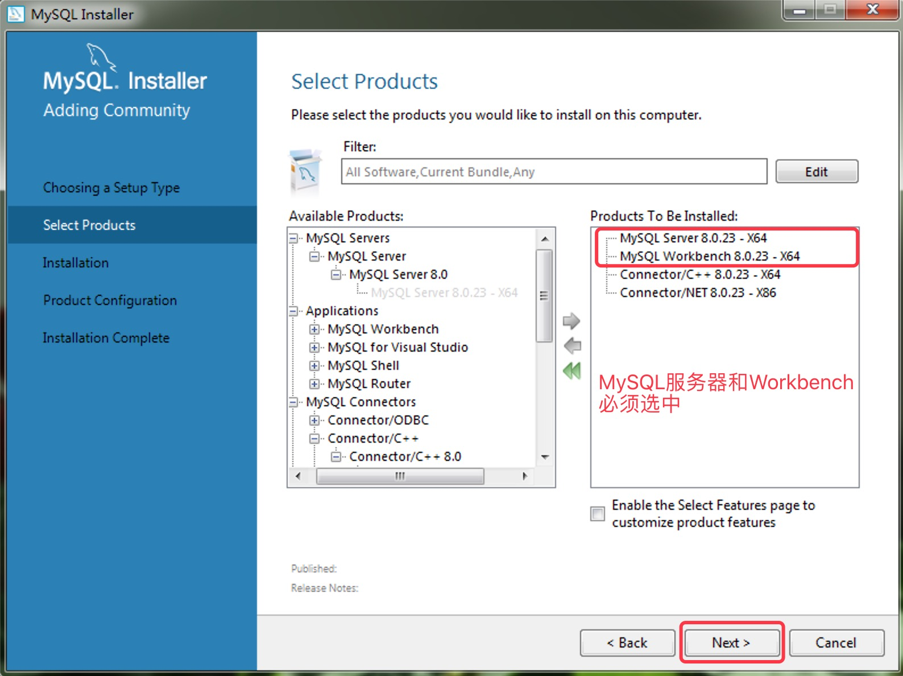
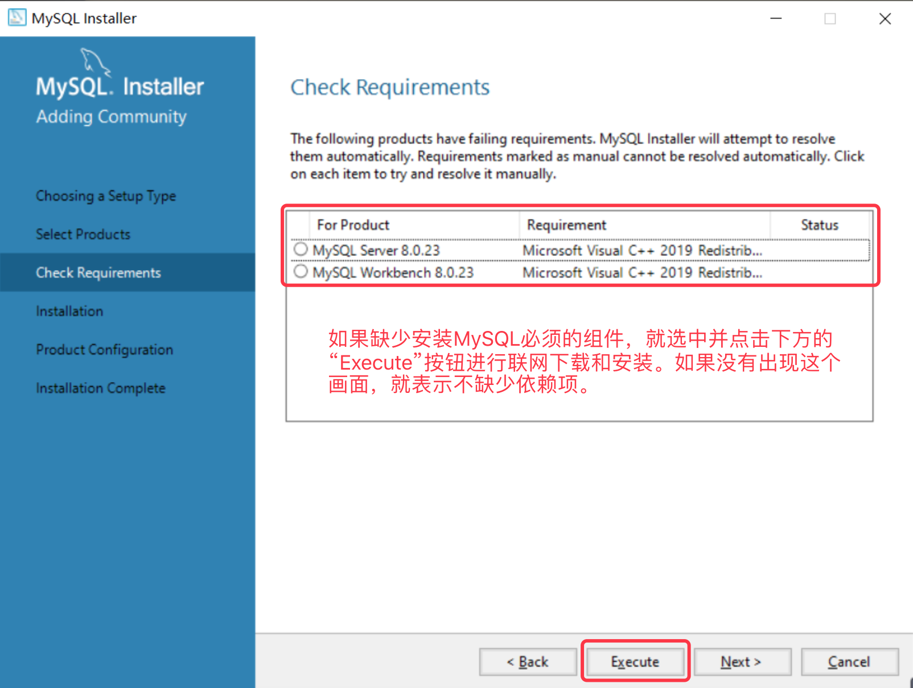
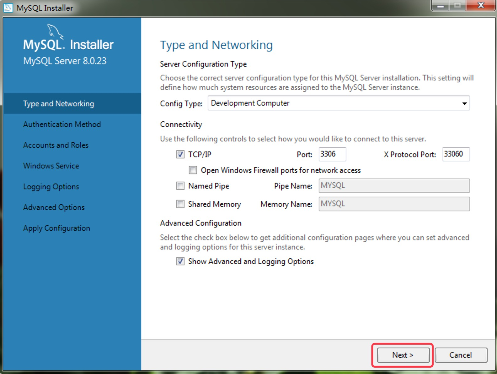
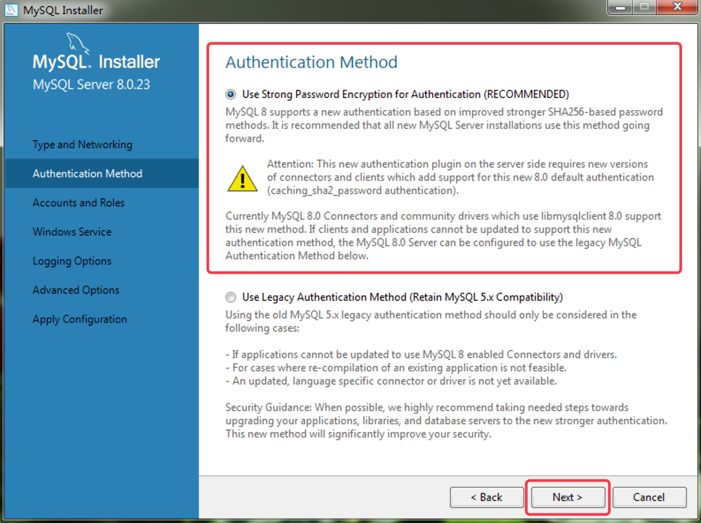
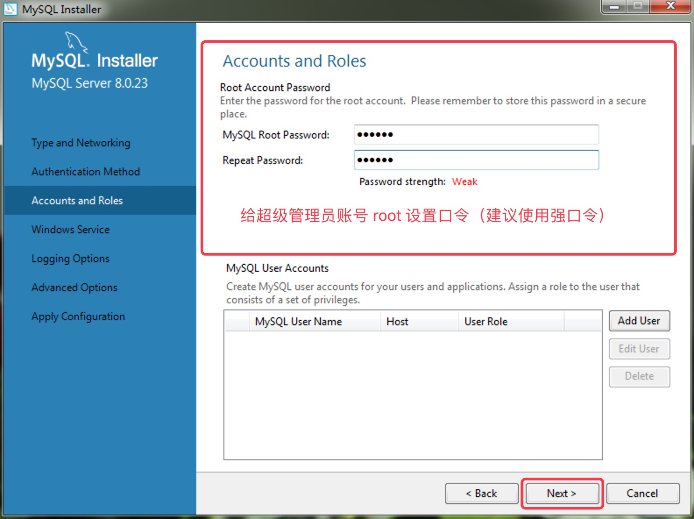
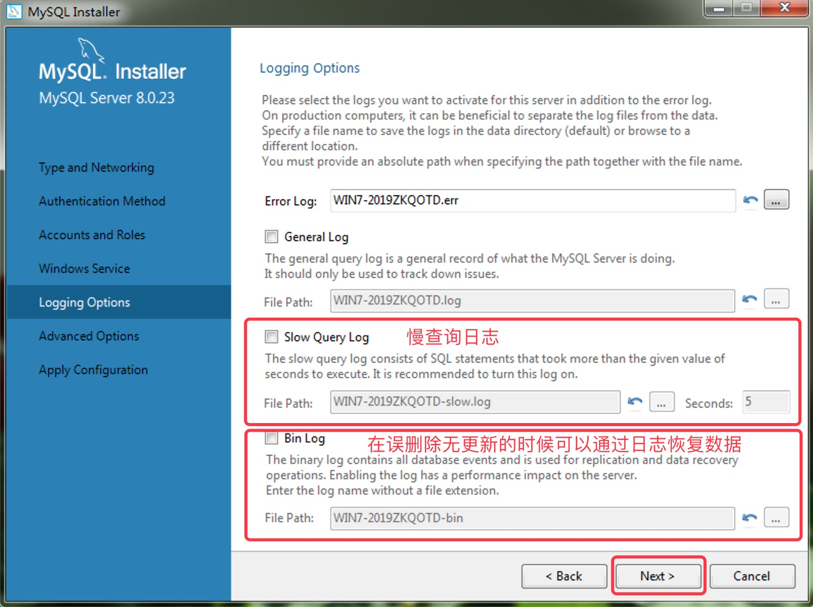
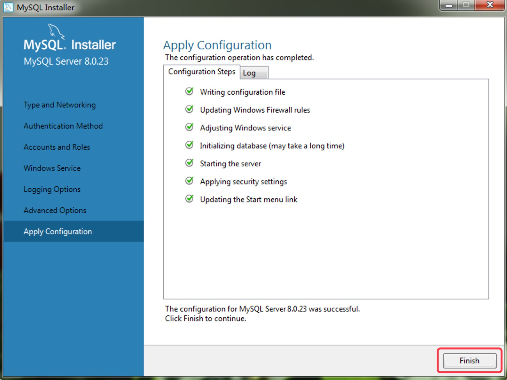
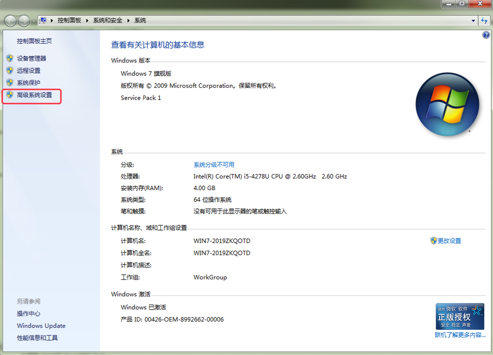
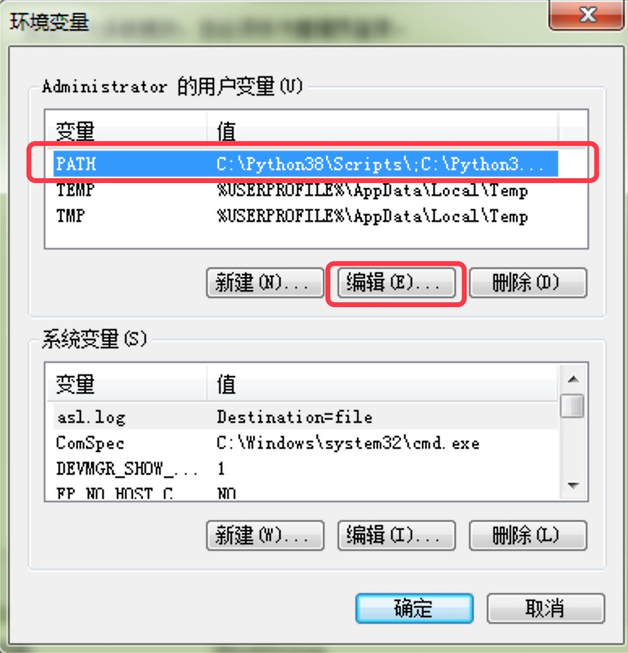

## İlişkisel Veritabanları ve MySQL'e Genel Bakış

> **Translated to Turkish by** himmetcanumutlu

### İlişkisel Veritabanlarına Genel Bakış

1. Veri kalıcılaştırma - veriyi uzun süre saklayabilen depolama ortamına kaydetmek; elektrik kesilse bile veri kaybolmaz.

2. Veritabanı gelişim tarihi - ağ veritabanı, hiyerarşik veritabanı, ilişkisel veritabanı, NoSQL veritabanı, NewSQL veritabanı.

   > 1970'te IBM araştırmacısı E.F.Codd, *Communication of the ACM* dergisinde *A Relational Model of Data for Large Shared Data Banks* adlı makaleyi yayımladı; **ilişkisel model** kavramını ortaya koyup ilişkisel modelin kuramsal temelini attı. Daha sonra Codd, normal biçim kuramını ve ilişkisel sistemleri ölçen 12 standardı anlatan çok sayıda makale yayımlayarak ilişkisel veritabanlarının temelini matematiksel kuramla attı.

3. İlişkisel veritabanı özellikleri.

   - Kuramsal temel: **ilişkisel cebir** (küme kuramı, birinci dereceden yüklemler, ilişkisel işlemler).
   - Somut görünüm: veriyi **iki boyutlu tablolarla** (satır ve sütunlu) düzenler.
   - Programlama dili: **Yapılandırılmış Sorgu Dili** (SQL).
       - DDL: Veri Tanımlama Dili
       - DML: Veri İşleme Dili
       - DCL: Veri Kontrol Dili
       - TCL: İşlem (Transaction) Kontrol Dili
   
4. ER modeli (Varlık-İlişki modeli) ve kavramsal model diyagramı.

   **ER modeli**, tam adıyla **Varlık-İlişki Modeli** (Entity-Relationship Model), Çin asıllı Amerikalı bilgisayar bilimci Peter Chen tarafından ortaya konmuştur; kavramsal veri modelinin üst düzey açıklama biçimidir; aşağıdaki gibidir.

   

   - Varlık - dikdörtgen kutu
   - Öznitelik - elips kutu
   - İlişki - eşkenar dörtgen kutu
   - Çokluk - 1:1 (bire bir) / 1:N (bire çok) / M:N (çoka çok)

   Gerçek proje geliştirmede, kavramsal veri modelini çizmek için veritabanı modelleme araçlarını (PowerDesigner gibi) kullanabilir, sonra hedef veritabanı sistemini ayarlayıp kavramsal modeli fiziksel modele dönüştürebilir (aşağıdaki gibi) ve en sonunda iki boyutlu tabloları oluşturan SQL'i üretebiliriz (birçok araç, tasarladığımız fiziksel model diyagramına ve belirlenen hedef veritabanına göre SQL dışa aktarabilir veya doğrudan veri tabloları üretebilir).

   

5. İlişkisel veritabanı ürünleri.
   - [Oracle](https://www.oracle.com/index.html) - şu anda dünyada en yaygın kullanılan veritabanı yönetim sistemidir; genel amaçlı bir veritabanı sistemi olarak eksiksiz veri yönetim işlevine sahiptir; ilişkisel bir veritabanı olarak tam ilişkisel bir üründür; dağıtık bir veritabanı olarak dağıtık işleme işlevini gerçekleştirir. Oracle'ın yeni sürümlerinde çok kiracılı mimari de eklenmiştir; bu mimariyle veritabanı bulutu kolayca dağıtılıp yönetilir.
   - [DB2](https://www.ibm.com/analytics/us/en/db2/) - IBM tarafından geliştirilen, esas olarak Unix (IBM'in kendi [AIX](https://zh.wikipedia.org/wiki/AIX)'i dahil), Linux ve Windows sunucu sürümü gibi sistemlerde çalışan ilişkisel veritabanı ürünüdür. DB2 uzun bir geçmişe sahiptir ve en erken SQL kullanan veritabanı ürünü olarak kabul edilir; oldukça güçlü iş zekâsı işlevine sahiptir.
   - [SQL Server](https://www.microsoft.com/en-us/sql-server/) - Microsoft tarafından geliştirilen ve yaygınlaştırılan ilişkisel veritabanı ürünüdür; başlangıçta küçük ve orta ölçekli işletmelerin veri yönetimine uygundu, ancak son yıllarda kullanım alanı genişlemiş, bazı büyük işletmeler ve hatta çok uluslu şirketler de veri yönetim sistemlerini bununla kurmaya başlamıştır.
   - [MySQL](https://www.mysql.com/) - MySQL açık kaynak kodludur; herkes GPL (General Public License) lisansı altında indirip kişisel ihtiyaca göre değiştirebilir. MySQL; hızı, güvenilirliği ve uyarlanabilirliği sayesinde ilgi görmüştür.
   - [PostgreSQL]() - BSD lisansı altında dağıtılan açık kaynaklı ilişkisel veritabanı ürünüdür.

### MySQL'e Giriş

MySQL, başlangıçta İsveç'teki MySQL AB şirketi tarafından geliştirilen açık kaynaklı bir ilişkisel veritabanı yönetim sistemidir; bu şirket 2008'de Sun Microsystems tarafından satın alındı. 2009'da Oracle, Sun Microsystems'i satın aldı; bu yüzden MySQL şu anda da Oracle'ın bir ürünüdür.

MySQL, geçmişte yüksek performansı, düşük maliyeti ve iyi güvenilirliği sayesinde en popüler açık kaynak veritabanı haline gelmiş ve bu yüzden küçük ve orta ölçekli web sitelerinin geliştirilmesinde yaygın kullanılmıştır. MySQL olgunlaştıkça, daha büyük ölçekli web siteleri ve uygulamalarda da giderek kullanılmaya başlanmıştır; örneğin Wikipedia, Google, Facebook, Baidu, Taobao, Tencent, Sina, Qunar gibi platformlar veri kalıcılaştırma hizmeti için MySQL kullanmıştır.

Oracle, Sun Microsystems'i satın aldıktan sonra MySQL ticari sürümünün fiyatını büyük ölçüde artırdı ve Oracle bir başka özgür yazılım projesi olan [OpenSolaris](https://zh.wikipedia.org/wiki/OpenSolaris)'in geliştirilmesini artık desteklemedi; bu yüzden özgür yazılım topluluğunda, Oracle'ın MySQL topluluk sürümünü (MySQL'in dağıtım sürümleri içindeki tek ücretsiz sürüm) desteklemeye devam edip etmeyeceği konusunda endişe oluştu. MySQL'in kurucusu Michael Widenius, MySQL'i temel alarak [MariaDB](https://zh.wikipedia.org/wiki/MariaDB) (kızının adıyla adlandırılan veritabanı) çatalını oluşturdu. Eskiden MySQL kullanan birçok şirket (örneğin Wikipedia), MySQL'den MariaDB'ye geçişi tamamladı.

### MySQL Kurulumu

#### Windows Ortamı

1. [Resmî sitenin](https://www.mysql.com/) sunduğu [indirme bağlantısından](https://dev.mysql.com/downloads/windows/installer/8.0.html) "MySQL Community Edition Server" kurulum programını indirin; aşağıdaki gibidir; çevrimdışı kurulum sürümü MySQL Installer'ı indirmenizi öneririz.

    

2. Installer'ı çalıştırıp aşağıdaki adımlara göre kurulum yapın.

    - Özel kurulumu seçin.

    

    - Kurulacak bileşenleri seçin.

    

    - Bağımlılıklar eksikse, önce bağımlılıkları kurun.

    

    - Kuruluma başlamaya hazırlanın.

    

    - Kurulum tamamlandı.

    

    - Yapılandırma sihirbazını çalıştırmaya hazırlanın.

    

3. Kurulum sonrası yapılandırma sihirbazını çalıştırın.

    - Sunucu tipini ve ağı yapılandırın.

    

    - Kimlik doğrulama yöntemini yapılandırın (parolayı koruma biçimi).

        

    - Kullanıcı ve rolleri yapılandırın.

        

    - Windows hizmet adını ve açılışta otomatik başlamayı yapılandırın.

        

    - Günlüğü yapılandırın.

        

    - Gelişmiş seçenekleri yapılandırın.

        

    - Yapılandırmayı uygulayın.

        

4. Windows sisteminin "Hizmetler" penceresinden MySQL'i başlatabilir veya durdurabilirsiniz.

    

5. Komut istemi penceresinde MySQL istemci aracını kullanmak için PATH ortam değişkenini yapılandırın.

    - Windows'un "Sistem" penceresini açıp "Gelişmiş sistem ayarları"na tıklayın.

        

    - "Sistem Özellikleri"nin "Gelişmiş" penceresinde "Ortam Değişkenleri" düğmesine tıklayın.

        

    - PATH ortam değişkenini düzenleyip MySQL kurulum yolundaki `bin` klasörünün yolunu PATH ortam değişkenine ekleyin.

        

    - Yapılandırma tamamlandıktan sonra "Komut İstemi"nde MySQL komut satırı aracını kullanmayı deneyebilirsiniz.

        

#### Linux Ortamı

Aşağıda CentOS 7.x ortamı örneğiyle MySQL 5.7.x kurulumu gösteriliyor; başka Linux sistemlerinde başka MySQL sürümleri kurmak gerekirse, lütfen ilgili kurulum eğitimini internette kendiniz arayın.

1. MySQL kurulumu.

    MySQL [resmî sitesinden](<https://www.mysql.com/>) kurulum dosyasını indirebilirsiniz. Önce indirme sayfasında platformu ve sürümü seçin, sonra ilgili indirme bağlantısını bulup tüm kurulum dosyalarını içeren arşiv dosyasını doğrudan indirin; arşivden çıkardıktan sonra paket yönetim aracıyla kurulum yapın.

   ```Shell
   wget https://dev.mysql.com/get/Downloads/MySQL-5.7/mysql-5.7.26-1.el7.x86_64.rpm-bundle.tar
   tar -xvf mysql-5.7.26-1.el7.x86_64.rpm-bundle.tar
   ```

    Sistemde MariaDB ile ilgili dosyalar varsa, önce MariaDB ile ilgili dosyaları kaldırmak gerekir.

   ```Shell
   yum list installed | grep mariadb | awk '{print $1}' | xargs yum erase -y
   ```

    Kullanılabilecek alt seviye bağımlılık kütüphanelerini güncelleyin ve kurun.

   ```Bash
   yum update
   yum install -y libaio libaio-devel
   ```

    Ardından aşağıdaki sırayla RPM (Redhat Package Manager) aracıyla MySQL kurulabilir.

   ```Shell
   rpm -ivh mysql-community-common-5.7.26-1.el7.x86_64.rpm
   rpm -ivh mysql-community-libs-5.7.26-1.el7.x86_64.rpm
   rpm -ivh mysql-community-libs-compat-5.7.26-1.el7.x86_64.rpm
   rpm -ivh mysql-community-devel-5.7.26-1.el7.x86_64.rpm
   rpm -ivh mysql-community-client-5.7.26-1.el7.x86_64.rpm
   rpm -ivh mysql-community-server-5.7.26-1.el7.x86_64.rpm
   ```

    Aşağıdaki komutla kurulu MySQL ile ilgili paketleri görüntüleyebilirsiniz.

   ```Shell
   rpm -qa | grep mysql
   ```

2. MySQL yapılandırması.

   MySQL'in yapılandırma dosyası `/etc` dizininde olup adı `my.cnf`'tir; varsayılan yapılandırma dosyası içeriği aşağıdaki gibidir.

   ```Shell
   cat /etc/my.cnf
   ```

   ```INI
   # For advice on how to change settings please see
   # http://dev.mysql.com/doc/refman/5.7/en/server-configuration-defaults.html
   
   [mysqld]
   #
   # Remove leading # and set to the amount of RAM for the most important data
   # cache in MySQL. Start at 70% of total RAM for dedicated server, else 10%.
   # innodb_buffer_pool_size = 128M
   #
   # Remove leading # to turn on a very important data integrity option: logging
   # changes to the binary log between backups.
   # log_bin
   #
   # Remove leading # to set options mainly useful for reporting servers.
   # The server defaults are faster for transactions and fast SELECTs.
   # Adjust sizes as needed, experiment to find the optimal values.
   # join_buffer_size = 128M
   # sort_buffer_size = 2M
   # read_rnd_buffer_size = 2M
   datadir=/var/lib/mysql
   socket=/var/lib/mysql/mysql.sock
   
   # Disabling symbolic-links is recommended to prevent assorted security risks
   symbolic-links=0
   
   log-error=/var/log/mysqld.log
   pid-file=/var/run/mysqld/mysqld.pid
   ```

   Yapılandırma dosyasıyla MySQL hizmetinin kullandığı portu, karakter kümesini, maksimum bağlantı sayısını, soket kuyruğu boyutunu, maksimum veri paketi boyutunu, günlük dosyasının konumunu, günlük süre sonu süresini vb. değiştirebiliriz. Elbette yapılandırma dosyasını değiştirerek MySQL sunucusunda performans ayarı ve güvenlik yönetimi de yapabiliriz.

3. MySQL hizmetini başlatma.

    MySQL'i başlatmak için aşağıdaki komut kullanılabilir.

   ```Shell
   service mysqld start
   ```

    CentOS 7'de MySQL'i başlatmak için aşağıdaki komut daha çok önerilir.

   ```Shell
   systemctl start mysqld
   ```

    MySQL başarıyla başlatıldıktan sonra, ağ portu kullanımını kontrol etmek için aşağıdaki komut kullanılabilir; MySQL varsayılan olarak `3306` portunu kullanır.

   ```Shell
   netstat -ntlp | grep mysql
   ```

    `mysqld` adında bir süreç olup olmadığını bulmak için aşağıdaki komut da kullanılabilir.

   ```Shell
   pgrep mysqld
   ```

4. MySQL istemci aracıyla sunucuya bağlanma.

    Komut satırı aracı:

   ```Shell
   mysql -u root -p
   ```

   > Not: İstemciyi başlatırken `-u` parametresi kullanıcı adını belirtir; MySQL'in varsayılan süper yönetim hesabı `root`'tur; `-p` parola girileceğini belirtir; başka bir ana makineye (yerel değil) bağlanılıyorsa `-h` ile bağlanılacak ana makinenin adı veya IP adresi belirtilebilir.

    MySQL ilk kez kurulduysa, varsayılan başlangıç parolasını bulmak için aşağıdaki komut kullanılabilir.

   ```Shell
   cat /var/log/mysqld.log | grep password
   ```

    Yukarıdaki komut MySQL günlüğünde `password` geçen satırı gösterir; sonuçtaki `root@localhost:` kısmından sonrası varsayılan başlangıç parolasıdır.

    İstemci aracına girdikten sonra, süper yöneticinin (root) erişim parolasını `123456` olarak değiştirmek için aşağıdaki komutlar kullanılabilir.

   ```SQL
   set global validate_password_policy=0;
   set global validate_password_length=6;
   alter user 'root'@'localhost' identified by '123456';
   ```

   > **Not**: MySQL'in yeni sürümleri varsayılan olarak zayıf parolanın kullanıcı parolası olmasına izin vermez; bu yüzden yukarıdaki kod, kullanıcı parolası doğrulama stratejisini ve parola uzunluğunu değiştirdi. Aslında zayıf parola kullanmamalıyız; çünkü kullanıcı parolasının kaba kuvvetle kırılma riski vardır. Son yıllarda **veritabanına saldırıp veri çalma ve veritabanını rehin alıp Bitcoin fidye isteme** olayları sık yaşanıyor; bu olası risklerden kaçınmak için en önemlisi **veritabanı sunucusunu genel ağa açmamaktır** (en iyisi veritabanını iç ağda tutmak, en azından veritabanı sunucusunun erişim portunu genel ağa açmamaktır); ayrıca `root` hesabının parolasını iyi saklamak gerekir; uygulama sistemi veritabanına erişirken genellikle `root` hesabını kullanmaz, **uygun yetkilere sahip başka hesaplar oluşturup onlarla erişir**.

    İstemci aracıyla MySQL sunucusuna yeniden bağlanırken yeni parolayı kullanabilirsiniz. Gerçek geliştirmede, kullanıcı işlemlerini kolaylaştırmak için grafik istemci araçlarıyla MySQL sunucusuna bağlanılabilir; bunlar:

   - MySQL Workbench (resmî araç)

       

   - Navicat for MySQL (arayüzü basit ve kullanıcı dostu)

       
   

#### macOS Ortamı

macOS sisteminde MySQL kurmak nispeten basittir; az önce sözünü ettiğimiz resmî siteden DMG kurulum dosyasını indirip çalıştırmanız yeterlidir; indirirken Intel çip mi yoksa Apple M1 çip mi kullandığınıza göre indirme bağlantısını seçmelisiniz; aşağıdaki gibidir.


Kurulum başarılı olduktan sonra "Sistem Tercihleri"nde "MySQL" bulunabilir; aşağıdaki ekranda MySQL sunucusunu başlatıp durdurabilir, MySQL çekirdek dosyalarının yolunu yapılandırabilirsiniz.


### MySQL Temel Komutları

#### Görüntüleme Komutları

1. Tüm veritabanlarını görüntüleme

```SQL
show databases;
```

2. Tüm karakter kümelerini görüntüleme

```SQL
show character set;
```

3. Tüm sıralama kurallarını görüntüleme

```SQL
show collation;
```

4. Tüm motorları görüntüleme

```SQL
show engines;
```

5. Tüm günlük dosyalarını görüntüleme

```SQL
show binary logs;
```

6. Veritabanı altındaki tüm tabloları görüntüleme

```SQL
show tables;
```

#### Yardım Alma

MySQL komut satırı aracında `help` komutu veya `?` ile yardım alınabilir; aşağıdaki gibidir.

1. `show` komutunun yardımını görüntüleme.

    ```MySQL
    ? show
    ```

2. Hangi yardım içerikleri olduğunu görüntüleme.

    ```MySQL
    ? contents
    ```

3. Fonksiyonların yardımını alma.

    ```MySQL
    ? functions
    ```

4. Veri tiplerinin yardımını alma.

    ```MySQL
    ? data types
    ```

#### Diğer Komutlar

1. Sunucu bağlantısı kurma/yeniden kurma - `connect` / `resetconnection`.

2. Mevcut girdiyi temizleme - `\c`. Girdi hatalı olduğunda `\c` ile mevcut girdiyi hemen temizleyip yeniden başlayabilirsiniz.

3. Sonlandırıcıyı (ayırıcıyı) değiştirme - `delimiter`. Varsayılan sonlandırıcı `;`'dir; bu komutla başka bir karaktere değiştirilebilir; örneğin `$` sembolüne değiştirmek için `delimiter $` komutu kullanılabilir.

4. Sistem varsayılan düzenleyicisini açma - `edit`. Düzenleyip kaydedip kapattıktan sonra komut satırı düzenlenen içeriği otomatik çalıştırır.

5. Sunucu durumunu görüntüleme - `status`.

6. Varsayılan istemciyi değiştirme - `prompt`.

7. Sistem komutu çalıştırma - `system`. Sistem komutu `system` komutunun arkasına yazılıp çalıştırılabilir; `system` komutu `\!` olarak da kısaltılabilir.

8. SQL dosyası çalıştırma - `source`. `source` komutundan sonra SQL dosyasının yolu yazılır.

9. Çıktıyı yeniden yönlendirme - `tee` / `notee`. Komutun çıktısı belirtilen dosyaya yönlendirilebilir.

10. Veritabanı değiştirme - `use`.

11. Uyarı bilgisini gösterme - `warnings`.

12. Komut satırından çıkma - `quit` veya `exit`.
