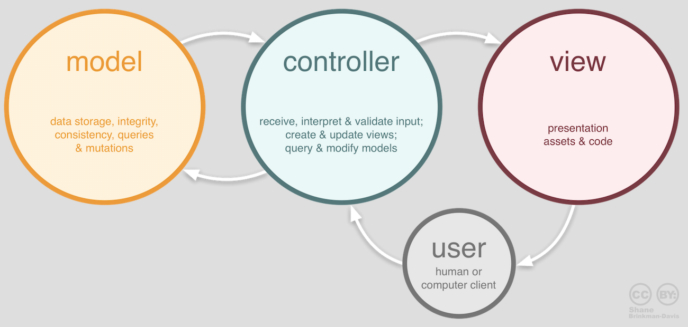
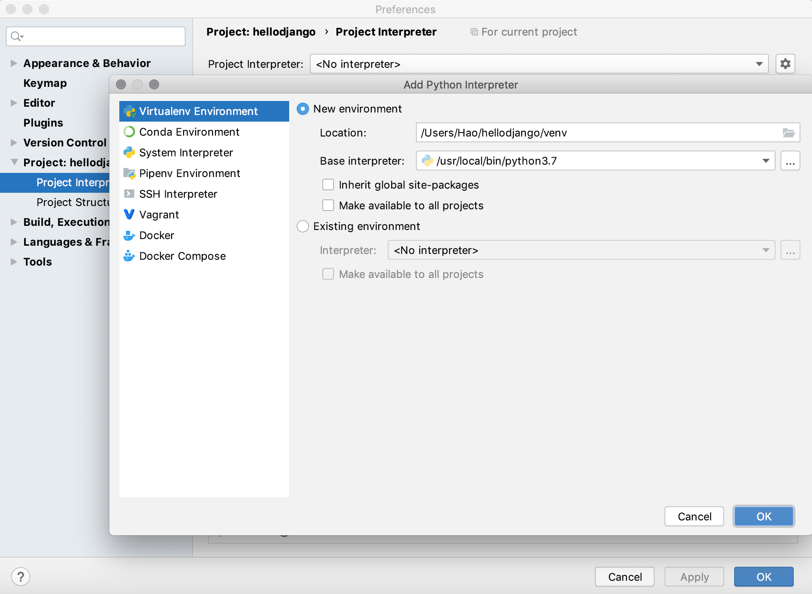
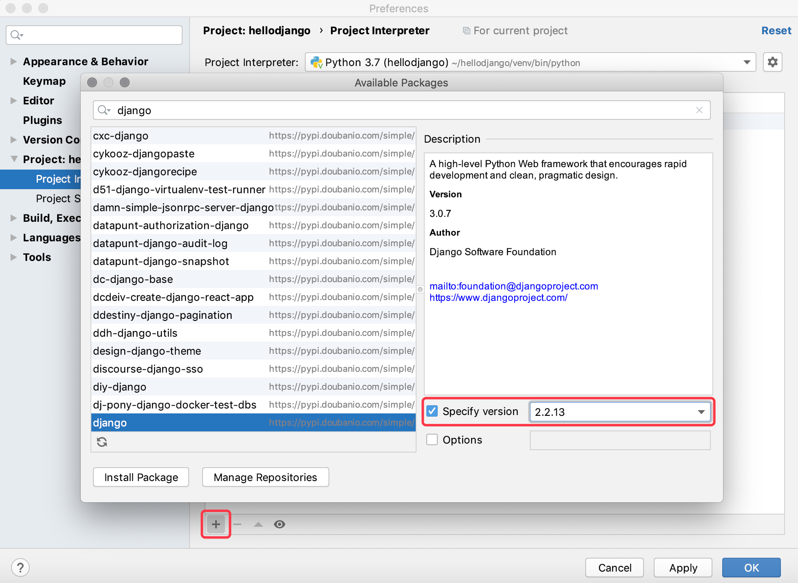
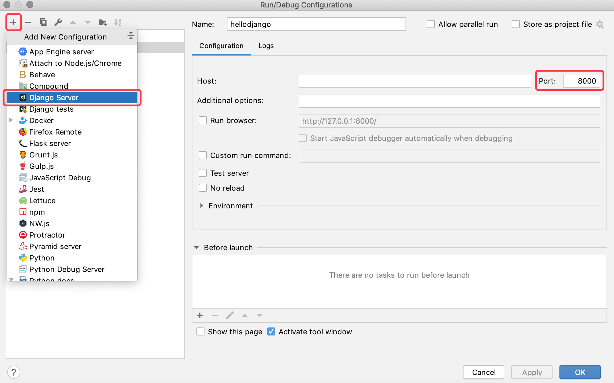

## Django'ya Hızlı Başlangıç

> **Translated to Turkish by** himmetcanumutlu

Web geliştirmenin ilk dönemlerinde geliştiriciler her sayfayı elle yazmak zorundaydı; örneğin bir haber portal sitesinde her gün HTML sayfaları değiştirilirdi; site ölçeği ve hacmi büyüdükçe bu yaklaşım kesinlikle çok kötü hale gelir. Bu sorunu çözmek için geliştiriciler, Web sunucusu için dinamik içerik üretmek üzere program kullanmayı düşündü; yani sayfadaki dinamik içerik artık elle yazılmıyor, programla otomatik üretiliyor. Bu teknoloji en başta CGI (Ortak Ağ Geçidi Arayüzü) olarak adlandırıldı; elbette zamanla CGI'ın sorunları da giderek arttı; örneğin çok sayıda yinelenen şablon kod, genel olarak düşük performans gibi. Yeni bir kahramanın arandığı bu ortamda, PHP, ASP, JSP gibi Web uygulama geliştirme teknolojileri 1990'ların ortalarında ve sonlarında mantar gibi ortaya çıktı. Genellikle Web uygulaması derken, tarayıcı üzerinden ağ kaynaklarına erişilen uygulamayı kastediyoruz; tarayıcının yaygınlığı ve kullanım kolaylığı sayesinde Web uygulamaları pratik ve basittir; uygulama kurma ve güncelleme zahmetinden kurtarır; geliştirici açısından da kullanıcının hangi işletim sistemini kullandığıyla ilgilenmek gerekmez, hatta PC mi mobil mi olduğunu ayırt etmek bile gerekmez.

### Web Uygulama Mekanizması ve Terimleri

Aşağıdaki görsel, Web uygulamasının çalışma akışını gösterir; ilgili terimler aşağıdaki tablodadır.


> Not: Deneyimli okuyucuların fark edeceğine inanıyorum ki bu şekilde aslında birçok şey eksik; örneğin ters proxy sunucusu, veritabanı sunucusu, güvenlik duvarı gibi; ayrıca şekildeki her düğüm, gerçek proje dağıtımında bir düğüm kümesinden oluşan bir küme olabilir. Elbette bunlar hakkında bir fikriniz yoksa sorun değil; devam edin, ileride tek tek anlatacağız.

| Terim          | Açıklama                                                         |
| ------------- | ------------------------------------------------------------ |
| **URL/URI**   | Tekdüzen Kaynak Bulucu/Tekdüzen Kaynak Tanımlayıcı, ağ kaynağının benzersiz kimliği            |
| **Alan adı**      | Web sunucusu adresine karşılık gelen, hatırlanması kolay bir string ad                |
| **DNS**       | Alan adı çözümleme hizmeti; alan adını ilgili IP adresine çevirir                   |
| **IP adresi**    | Ağdaki ana makinenin kimliği; IP adresiyle farklı ana makineler ayırt edilir         |
| **HTTP**      | Hiper Metin Aktarım Protokolü; TCP üzerine kurulu uygulama düzeyi protokol; World Wide Web veri iletişiminin temeli |
| **Ters proxy**  | İstemci adına sunucuya istek gönderir, sonra sunucunun döndürdüğü kaynağı istemciye döndürür |
| **Web sunucusu** | HTTP isteği kabul eder, sonra istekte bulunana HTML dosyası, düz metin, görsel gibi kaynakları döndürür |
| **Nginx**     | Yüksek performanslı Web sunucusu; ayrıca [ters proxy](https://zh.wikipedia.org/wiki/%E5%8F%8D%E5%90%91%E4%BB%A3%E7%90%86), [yük dengeleme](https://zh.wikipedia.org/wiki/%E8%B4%9F%E8%BD%BD%E5%9D%87%E8%A1%A1) ve [HTTP önbelleği](https://zh.wikipedia.org/wiki/HTTP%E7%BC%93%E5%AD%98) olarak kullanılabilir |

#### HTTP Protokolü

Burada HTTP protokolü üzerinde biraz duralım. HTTP (Hiper Metin Aktarım Protokolü), TCP (Aktarım Kontrol Protokolü) üzerine kurulu uygulama düzeyi bir protokoldür; TCP'nin sunduğu güvenilir aktarım hizmetini kullanarak Web uygulamalarında veri alışverişini gerçekleştirir. Vikipedi'deki açıklamaya göre HTTP'yi tasarlamanın asıl amacı, [HTML](https://zh.wikipedia.org/wiki/HTML) sayfalarını yayımlayıp almak için bir yöntem sunmaktır; yani bu protokol, tarayıcı ile Web sunucusu arasında aktarılan verinin taşıyıcısıdır. Bu protokolün ayrıntıları ve güncel durumu hakkında [《HTTP Protokolüne Giriş》](http://www.ruanyifeng.com/blog/2016/08/http.html), [《İnternet Protokolüne Giriş》](http://www.ruanyifeng.com/blog/2012/05/internet_protocol_suite_part_i.html) serisi ve [《HTTPS Protokolünü Anlamak》](http://www.ruanyifeng.com/blog/2014/09/illustration-ssl.html) yazılarını okuyabilirsiniz. Aşağıdaki görsel, Sichuan İl Ağ İletişim Teknolojisi Anahtar Laboratuvarı'nda öğrenim ve çalışma dönemimde, açık kaynak protokol analiz aracı Ethereal (paket yakalama aracı WireShark'ın öncülü) ile Baidu ana sayfasına erişirken yakalanan HTTP istek ve yanıt paketleridir (protokol verisi); Ethereal ağ adaptöründen geçen veriyi yakaladığı için, fiziksel bağlantı katmanından uygulama katmanına kadar protokol verisi net görülür.

HTTP isteği (istek satırı + istek başlığı + boş satır + [mesaj gövdesi]):


HTTP yanıtı (yanıt satırı + yanıt başlığı + boş satır + mesaj gövdesi):


>  **Not**: Bu iki görsel 10 Eylül 2009 sabahı elde edildi; sararmış fotoğraflar gibi duran bu ekran görüntüleri HTTP'nin ne olduğunu anlamanıza yardımcı olur umarım. Elbette profesyonel paket yakalama aracınız yoksa, tarayıcının sunduğu "Geliştirici araçları" ile de HTTP istek ve yanıtının veri biçimini görüntüleyebilirsiniz.

### Django'ya Genel Bakış

Python'ın yüzden fazla Web framework'ü vardır; anahtar sözcüklerinden bile fazladır. Web framework, Web sunucu tarafı uygulamaları geliştirmek için kullanılan altyapıdır; halk diliyle söylersek bir dizi kapsüllenmiş modül ve araçtır. Aslında Web framework olmasa da socket veya [CGI](https://zh.wikipedia.org/wiki/%E9%80%9A%E7%94%A8%E7%BD%91%E5%85%B3%E6%8E%A5%E5%8F%A3) ile Web sunucu tarafı uygulaması geliştirebiliriz; ancak bunun maliyeti ticari projelerde genellikle kabul edilemez. Web framework ile karmaşayı basite indirger, uygulama oluşturma, güncelleme ve genişletme iş yükünü azaltırız. Python'ın yüzden fazla Web framework'ü olduğunu söyledik; bunlar Django, Flask, Tornado, Sanic, Pyramid, Bottle, Web2py, web.py gibi framework'leri içerir.

Yukarıdaki Python Web framework'leri arasında Django kuşkusuz en temsili ağır sıklettir; geliştiriciler Django ile güvenilir Web uygulamalarını hızla geliştirebilir; çünkü Web geliştirmedeki gereksiz yükü azaltır, yaygın tasarım ve geliştirme kalıplarını kapsüller ve MVC mimarisini destekler (Django'da buna MTV mimarisi denir). MVC, yazılım sistem geliştirme alanında evrensel geçerli bir mimaridir; sistemdeki bileşenleri Model, View ve Controller olmak üzere üç parçaya ayırıp böylece modelin (veri) ve görünümün (gösterim) bağını çözer. Model ve görünüm ayrıldığı için, bağı çözülmüş model ile görünümü birbirine bağlayan bir aracı gerekir; bu rolü Controller üstlenir. Belli bir ölçeğe ulaşan yazılım sistemleri MVC mimarisini (veya MVC'den evrilen başka mimarileri) kullanır. Django projesinde buna MTV deriz; MTV'deki M, MVC'deki M'den farklı değildir; veriyi temsil eden modeldir; T web sayfası şablonunu (veriyi gösteren görünüm) temsil eder; V ise görünüm fonksiyonunu temsil eder. Django framework'ünde görünüm fonksiyonu, Django framework'ünün kendisiyle birlikte MVC'deki C'nin rolünü üstlenir.



Django framework'ü 2003'te doğdu; gerçek bir uygulamada büyümüş bir projedir; Lawrence Yayın Grubu'na bağlı çevrimiçi haber sitesinin içerik yönetim sistemi (CMS) Ar-Ge ekibi (başlıca Adrian Holovaty ve Simon Willison) tarafından geliştirildi; adını Belçikalı çingene caz gitaristi Django Reinhardt'tan alır. Django framework'ü 2005 yazında açık kaynak framework olarak yayımlandı; Django ile çok kısa sürede işlevi tam bir web sitesi kurulabilir; çünkü programcının yerine o tekrarlayan ve sıkıcı işleri yapar; geriye kalan gerçekten anlamlı çekirdek işi programcıya bırakır; bu da DRY (Don't Repeat Yourself; Kendini Tekrar Etme) ilkesinin en iyi uygulamasıdır. Birçok başarılı site ve uygulama Python diliyle geliştirilmiştir; Çin'de temsili siteler: Zhihu, Douban, Guokr, Sohu, 101 Go, Poster, Beishuba, Duitang, m.sohu, Codoon, ifworld, Guoku gibi; bunların arasında Django kullanan ürünler de vardır.

### Hızlı Başlangıç

#### İlk Django Projesi

1. Python ortamını kontrol et: Django 1.11, Python 2.7 veya Python 3.4 ve üzeri gerektirir; Django 2.0, Python 3.4 ve üzeri; Django 2.1 ve 2.2, Python 3.5 ve üzeri; Django 3.0, Python 3.6 ve üzeri gerektirir.

   > **Not**: Django framework'ünün farklı sürümlerinin gerektirdiği Python yorumlayıcı ortamını, Django resmî dokümanının [SSS](https://docs.djangoproject.com/zh-hans/3.0/faq/install/#faq-python-version-support) bölümünde bulabilirsiniz.

   macOS terminalinde aşağıdaki komutla Python yorumlayıcı sürümünü kontrol edebilirsiniz; Windows'ta komut istemine `python --version` yazılabilir.
   
   ```Bash
python3 --version
   ```
   
   Python'un etkileşimli ortamında aşağıdaki kodu çalıştırarak da Python yorumlayıcı sürümünü görebilirsiniz.
   
   ```Shell
   import sys
   sys.version
   sys.version_info
   ```
   
2. Paket yönetim aracını güncelleyip Django ortamını kurun (Django projesi oluşturmak için).

   > **Not**: Bu dokümanı güncellerken Django'nun en son kararlı sürümü 3.0.7 idi; Django 3.0 ASGI desteği sunup tam çift yönlü asenkron iletişimi sağlar, ancak kullanım deneyimi şimdilik sıradan; bu yüzden Django 3.0 kullanmanızı şimdilik önermiyoruz; aşağıda Django 2.2.13 sürümünü kuruyoruz. `pip` ile üçüncü taraf kütüphane ve araç kurarken `==` ile kurulacak sürüm belirtilebilir.
   
   ```Bash
   pip3 install -U pip
   pip3 install django==2.2.13
   ```
   
3. Django ortamını kontrol edip `django-admin` komutuyla Django projesi oluşturun (proje adı hellodjango).

   ```Shell
   django-admin --version
   django-admin startproject hellodjango
   ```

4. PyCharm ile oluşturulan Django projesini açıp ona sanal ortam ekleyin.

   

   Yukarıdaki görseldeki gibi, PyCharm'ın proje tarayıcısında en üstteki `hellodjango` klasörü Python proje klasörüdür; bu klasörün adı önemli değildir; Django projesi de bu klasörün adıyla ilgilenmez. Bu klasörün altında aynı adlı bir klasör vardır; bu Django proje klasörüdür; içinde `__init__.py`, `settings.py`, `urls.py`, `wsgi.py` olmak üzere dört dosya bulunur; `hellodjango` adlı Django proje klasörüyle aynı düzeyde bir de `manage.py` adlı dosya vardır; bu dosyaların işlevleri şunlardır:

   - `hellodjango/__init__.py`: Boş dosya; Python yorumlayıcısına bu dizinin bir Python paketi olarak görülmesi gerektiğini söyler.
   - `hellodjango/settings.py`: Django projesinin yapılandırma dosyası.
   - `hellodjango/urls.py`: Django projesinin URL eşleme bildirimi; sitenin "içindekileri" gibidir.
   - `hellodjango/wsgi.py`: Projenin WSGI uyumlu Web sunucusunda çalışmasını sağlayan giriş dosyası.
   - `manage.py`: Django projesini yöneten betik programı.

   > Not: WSGI'nin tam adı Web Sunucusu Ağ Geçidi Arayüzü'dür; Vikipedi'deki açıklama şudur: "Python dili için tanımlanmış, [Web sunucusu](https://zh.wikipedia.org/wiki/%E7%B6%B2%E9%A0%81%E4%BC%BA%E6%9C%8D%E5%99%A8) ile [Web uygulaması](https://zh.wikipedia.org/wiki/%E7%BD%91%E7%BB%9C%E5%BA%94%E7%94%A8%E7%A8%8B%E5%BA%8F) veya framework arasındaki basit ve evrensel bir arayüz".

   Sanal ortam oluşturma arayüzü aşağıdaki gibidir.

   

5. Proje bağımlılıklarını kurun.

   Yöntem 1: PyCharm'ın terminalini açıp terminalde `pip` komutuyla Django projesinin bağımlılıklarını kurun.

   > **Not**: Proje için Python 3 yorumlayıcı ortamına dayalı sanal ortam oluşturulduğundan, sanal ortamdaki `python` komutu Python 3 yorumlayıcısına, `pip` komutu ise Python 3 paket yönetim aracına karşılık gelir.

   ```Shell
   pip install django==2.2.13
   ```

   Yöntem 2: PyCharm'ın tercihlerinde projenin yorumlayıcı ortamını ve kurulu üçüncü taraf kütüphaneleri bulabilirsiniz; ekle düğmesine tıklayıp yeni bağımlılık kurabilirsiniz; hatırlatmak isteriz ki Django bağımlılığını kurarken sürüm numarası belirtilmelidir; aksi halde bu dokümanın güncellendiği tarihteki en son 3.0.7 sürümü kurulur.

   

   Aşağıdaki görsel Django ve Python sürümlerinin karşılığını gösterir; kendiniz eşleştirin.

   | Django sürümü | Python sürümü                                |
   | ---------- | ----------------------------------------- |
   | 1.8        | 2.7、3.2、3.3、3.4、3.5                   |
   | 1.9、1.10  | 2.7、3.4、3.5                             |
   | 1.11       | 2.7、3.4、3.5、3.6、3.7（Django 1.11.17） |
   | 2.0        | 3.4、3.5、3.6、3.7                        |
   | 2.1        | 3.5、3.6、3.7                             |
   | 2.2        | 3.5、3.6、3.7、3.8（Django 2.2.8）        |
   | 3.0        | 3.6、3.7、3.8                             |

6. Django'nun yerleşik sunucusunu başlatıp projeyi çalıştırın.

   Yöntem 1: "Run" menüsünden "Edit Configuration"ı seçip "Django server"ı yapılandırarak projeyi çalıştırın (profesyonel PyCharm için).

   

   Yöntem 2: "Run" menüsünden "Edit Configuration"ı seçip "Python" programı çalıştırmayı yapılandırın (profesyonel ve topluluk sürümü PyCharm için).

   

   Yöntem 3: PyCharm'ın terminalinde komutla projeyi çalıştırın (profesyonel ve topluluk sürümü PyCharm için).

   ```Shell
   python manage.py runserver
   ```

7. Çalışma sonucunu görüntüleyin.

  Tarayıcıya `http://127.0.0.1:8000` yazıp sunucumuza erişin; sonuç aşağıdaki gibidir.

   

   > **Not**：
   >
   > 1. Yeni başlatılan Django yerleşik sunucusu yalnızca geliştirme ve test ortamında kullanılabilir; çünkü bu sunucu saf Python ile yazılmış hafif bir Web sunucusudur; üretim ortamında kullanıma uygun değildir.
   > 2. Kodu değiştirdiyseniz, değişikliğin geçerli olması için Django yerleşik sunucusunu yeniden başlatmanız gerekmez. Ancak yeni proje dosyası eklediğinizde bu sunucu otomatik yeniden yüklenmez; o zaman sunucuyu elle yeniden başlatmanız gerekir.
   > 3. Terminalde `python manage.py help` komutuyla Django yönetim betiğinin kullanılabilir komut parametrelerini görebilirsiniz.
   > 4. `python manage.py runserver` ile sunucu başlatırken, sonrasına IP adresi ve port numarası belirtmek için parametre ekleyebilirsiniz; varsayılan olarak sunucu yerel makinenin `8000` portunda çalışır.
   > 5. Terminalde çalışan sunucuyu Ctrl+C ile durdurabilirsiniz. PyCharm'ın "çalıştırma yapılandırması" ile çalışan sunucuyu, penceredeki kapat düğmesine tıklayarak sonlandırabilirsiniz.
   > 6. Aynı portta birden çok sunucu başlatılamaz; çünkü adres çakışmasına yol açar (port, IP adresinin uzantısıdır ve bilgisayar ağı adresinin bir parçasıdır).
8. Projenin yapılandırma dosyası `settings.py`'yi değiştirin.

   Django uluslararasılaştırmayı ve yerelleştirmeyi destekleyen bir framework'tür; bu yüzden az önce gördüğümüz Django projesinin varsayılan ana sayfası da uluslararasılaştırmayı destekler; yapılandırma dosyasını değiştirip varsayılan dili Çince'ye, saat dilimini de Doğu sekizinci dilimine ayarlayabiliriz.

   Değişiklikten önceki yapılandırmayı bulun (`settings.py` dosyasının 100. satırından sonra).

   ```Python
   LANGUAGE_CODE = 'en-us'
   TIME_ZONE = 'UTC'
   ```

   Aşağıdaki içerikle değiştirin.

   ```Python
   LANGUAGE_CODE = 'zh-hans'
   TIME_ZONE = 'Asia/Chongqing'
   ```

   Sayfayı yenileyip dil kodu ve saat dilimi değiştikten sonraki sonucu görebilirsiniz.

   

#### Kendi Uygulamanızı Oluşturma

Kendi Web uygulamanızı geliştirmek istiyorsanız, önce Django projesinde "uygulama" oluşturmanız gerekir; bir Django projesi bir veya daha fazla uygulama içerebilir.

1. PyCharm'ın terminalinde aşağıdaki komutu çalıştırıp `first` adlı uygulamayı oluşturun.

   ```Shell
   python manage.py startapp first
   ```

   Yukarıdaki komutu çalıştırmak mevcut yolda `first` dizinini oluşturur; dizin yapısı şöyledir:

   - `__init__.py`: Boş dosya; Python yorumlayıcısına bu dizinin bir Python paketi olarak görülmesi gerektiğini söyler.
   - `admin.py`: Modeli kaydetmek için kullanılır; Django framework'ünün yerleşik yönetim panelinde modeli yönetmek içindir.
   -  `apps.py`: Mevcut uygulamanın yapılandırma dosyası.
   - `migrations`: Modelle ilgili veritabanı geçiş bilgilerini saklar.
     - `__init__.py`: Boş dosya; Python yorumlayıcısına bu dizinin bir Python paketi olarak görülmesi gerektiğini söyler.
   - `models.py`: Uygulamanın veri modelini saklar (MTV'deki M).
   - `tests.py`: Uygulamanın çeşitli işlevlerini test eden test sınıflarını ve fonksiyonlarını içerir.
   - `views.py`: Kullanıcının HTTP isteğini işleyip HTTP yanıtı döndüren fonksiyon veya sınıflar (MTV'deki V).

2. Uygulama dizinindeki görünüm dosyası `views.py`'yi değiştirin.

   ```Python
   from django.http import HttpResponse
   

   def show_index(request):
       return HttpResponse('<h1>Hello, Django!</h1>')
   ```
   
4. Django proje dizinindeki `urls.py` dosyasını değiştirip görünüm fonksiyonunu kullanıcının tarayıcıda istekte bulunduğu yolla eşleştirin.

   ```Python
   from django.contrib import admin
   from django.urls import path, include

   from first.views import show_index
   
   urlpatterns = [
       path('admin/', admin.site.urls),
       path('hello/', show_index),
   ]
   ```
   
5. Projeyi yeniden çalıştırıp tarayıcıda `http://127.0.0.1:8000/hello/` adresine erişin.

5. Yukarıda kodla tarayıcıya içerik ürettik; ama yine statik içerik. Dinamik içerik üretmek istiyorsanız, `views.py` dosyasını değiştirip aşağıdaki kodu ekleyin.

   ```Python
   from random import sample
   
   from django.http import HttpResponse
   
   
   def show_index(request):
       fruits = [
           'Apple', 'Orange', 'Pitaya', 'Durian', 'Waxberry', 'Blueberry',
           'Grape', 'Peach', 'Pear', 'Banana', 'Watermelon', 'Mango'
       ]
       selected_fruits = sample(fruits, 3)
       content = '<h3>Bugün önerilen meyveler:</h3>'
       content += '<hr>'
       content += '<ul>'
       for fruit in selected_fruits:
           content += f'<li>{fruit}</li>'
       content += '</ul>'
       return HttpResponse(content)
   ```

6. Sayfayı yenileyip programın çalışma sonucuna bakın; her yenilemede farklı içerik görüp görmediğinize bakın.


#### Şablon Kullanma

Yukarıda HTML kodu birleştirerek tarayıcıya dinamik içerik üretme yaklaşımı gerçek geliştirmede kabul edilemez; çünkü gerçek projede ön yüz sayfaları çok karmaşık olabilir ve bu dinamik içerik birleştirme yöntemiyle tamamlanamaz; bunu mutlaka düşünmüşsünüzdür. Bu sorunu çözmek için önceden bir şablon sayfası (MTV'deki T) hazırlayabiliriz; şablon sayfa, yer tutucu ve şablon komutları içeren bir HTML sayfasıdır.

Django framework'ünde `render` adlı pratik bir fonksiyon şablonu render etme işlemini yapar. Render, veriyle şablon sayfasındaki şablon komutlarını ve yer tutucuları değiştirmektir; buradaki render'a arka uç render'ı denir; yani sayfanın render işlemi sunucu tarafında tamamlanıp tarayıcıya çıktı verilir. Arka uç render yaklaşımı, Web uygulamasının erişimi arttığında sunucuya büyük yük bindirir; bu yüzden giderek daha fazla Web uygulaması ön uç render'ı seçer; yani sunucu yalnızca sayfanın ihtiyaç duyduğu veriyi (genellikle JSON biçiminde) sağlar, tarayıcıda JavaScript koduyla bu veri alınıp sayfa render edilir. Ön uç render konusunu ileriki derslerde anlatacağız; şimdilik şablon sayfasıyla arka uç render yaklaşımını kullanıyoruz; somut adımlar aşağıdadır.

Şablon sayfası kullanmanın adımları şunlardır.

1. Proje dizininde `templates` adlı klasör oluşturun.

   

2. `index.html` şablon sayfasını ekleyin.

   > **Not**: Gerçek proje geliştirmede statik sayfayı ön yüz geliştirici sağlar; arka uç geliştiricinin statik sayfayı, Python programıyla render edilebilmesi için şablon sayfaya dönüştürmesi gerekir; bu yaklaşım yukarıda sözünü ettiğimiz arka uç render'ıdır.

   ```HTML
   <!DOCTYPE html>
   <html lang="en">
       <head>
           <meta charset="UTF-8">
           <title>Ana sayfa</title>
           <style>
               #fruits {
                   font-size: 1.25em;
               }
           </style>
       </head>
       <body>
           <h1>Bugün önerilen meyveler:</h1>
           <hr>
           <ul id="fruits">
               
               <li>{{ fruit }}</li>
               
           </ul>
       </body>
   </html>
   ```
   Yukarıdaki şablon sayfada `{{ fruit }}` gibi şablon yer tutucu sözdizimini ve `` gibi şablon komutlarını kullandık; bunlar Django Şablon Dili'nin (DTL) bir parçasıdır. Şablon sözdizimi ve komutları hakkında resmî dokümana bakabilirsiniz; bu içeriklerin anlaşılması kolaydır; fazla açıklama gerekmez; şablon komutları ve sözdizimi için [resmî dokümana]() başvurabilirsiniz.

3. `views.py` dosyasını değiştirip `render` fonksiyonuyla şablon sayfasını render edin.

   ```Python
   from random import sample
   
   from django.shortcuts import render
   
   
   def show_index(request):
       fruits = [
           'Apple', 'Orange', 'Pitaya', 'Durian', 'Waxberry', 'Blueberry',
           'Grape', 'Peach', 'Pear', 'Banana', 'Watermelon', 'Mango'
       ]
       selected_fruits = sample(fruits, 3)
       return render(request, 'index.html', {'fruits': selected_fruits})
   ```

   `render` fonksiyonunun ilk parametresi istek nesnesi `request`, ikinci parametresi render edilecek şablon sayfanın adı, üçüncü parametresi sayfaya render edilecek veridir; veriyi şablona bir sözlükle veririz; sözlükteki anahtarlar, şablon sayfada kullanılan şablon komutlarındaki veya yer tutuculardaki değişken adlarıdır.

4. Bu noktada görünüm fonksiyonundaki `render` hâlâ `index.html` şablon dosyasını bulamaz; `settings.py` dosyasını değiştirip şablon dosyasının yolunu yapılandırmak gerekir. `settings.py` dosyasını değiştirip `TEMPLATES` yapılandırmasını bulun, içindeki `DIRS` yapılandırmasını değiştirin.

   ```Python
   TEMPLATES = [
       {
           'BACKEND': 'django.template.backends.django.DjangoTemplates',
           'DIRS': [os.path.join(BASE_DIR, 'templates'), ],
           'APP_DIRS': True,
           'OPTIONS': {
               'context_processors': [
                   'django.template.context_processors.debug',
                   'django.template.context_processors.request',
                   'django.contrib.auth.context_processors.auth',
                   'django.contrib.messages.context_processors.messages',
               ],
           },
       },
   ]
   ```

5. Projeyi yeniden çalıştırıp veya doğrudan sayfayı yenileyip sonucu görün.

### Özet

Böylece Django framework'üyle çok küçük bir Web uygulaması tamamladık; hiçbir pratik değeri olmasa da bu proje sayesinde Django framework'ü hakkında sezgisel bir fikir edinebilirsiniz. Django öğrenmek için en iyi kaynak kuşkusuz [resmî dokümanıdır](https://docs.djangoproject.com/zh-hans/2.0/); resmî doküman çoklu dil desteği sunar ve yeni başlayanlara Django kullanmayı öğreten yeni başlayan eğitimleri vardır; Django'yu resmî dokümanını okuyarak öğrenip kullanmanızı öneririz. Elbette Turing Topluluğu'nun yayımladığı [《Django Temel Eğitimi》](http://www.ituring.com.cn/book/2630) de yeni başlayanlara uygun bir giriş kitabıdır; merak edenler bağlantıya tıklayıp satın alabilir. 
