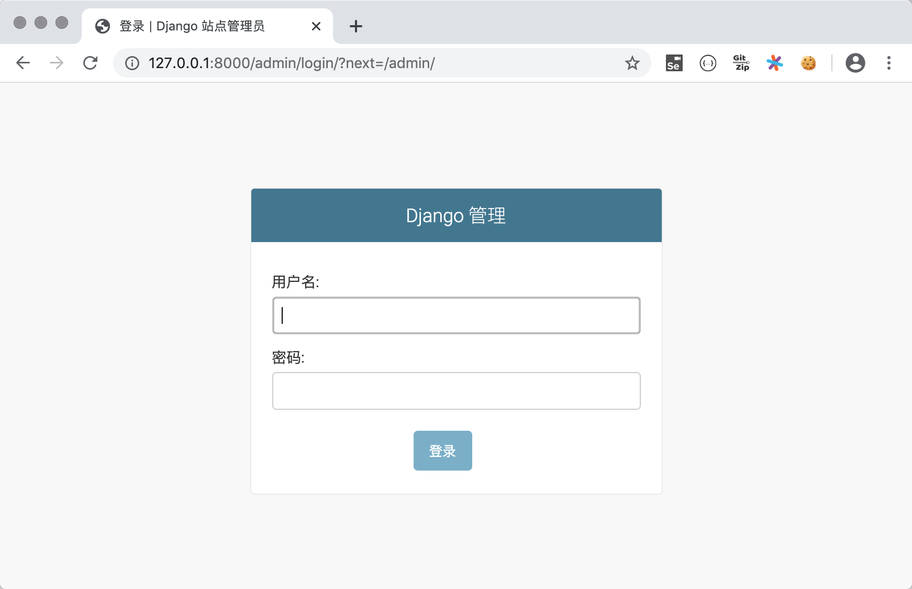
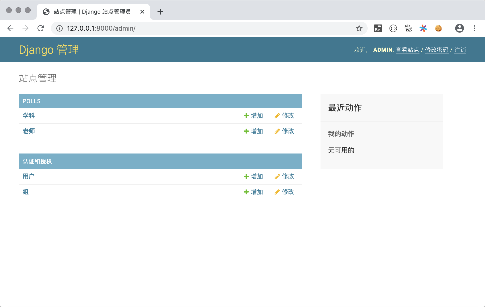
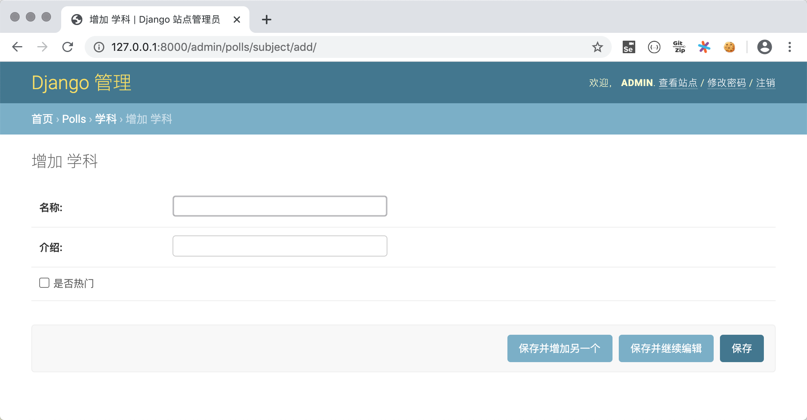
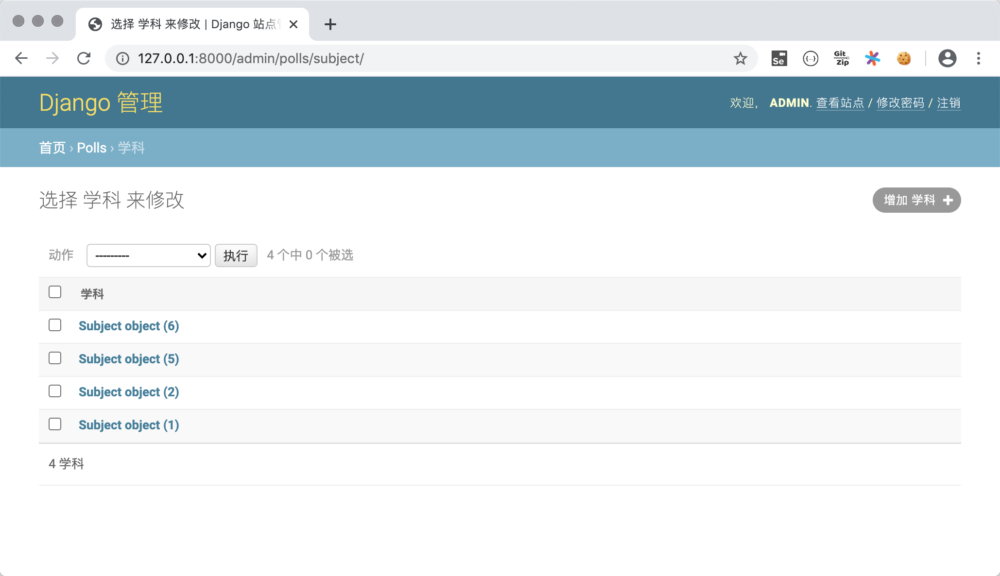
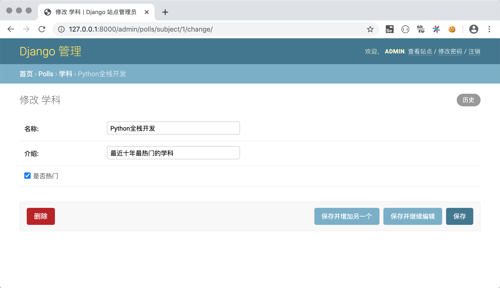
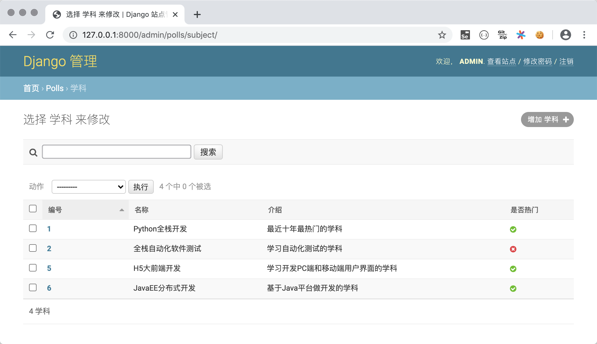

## Modelleri Derinlemesine İncelemek

> **Translated to Turkish by** himmetcanumutlu

Bir önceki bölümde Django'nun MVC mimarisine dayanan bir Web framework'ü olduğunu söyledik; MVC mimarisi "model" ile "görünümün" bağını çözmeyi hedefler. "Model" en açık ifadeyle veridir (verinin gösterimi); bu yüzden genellikle "veri modeli" de denir. Gerçek projede veri modeli genellikle veritabanıyla kalıcılaştırılır; ilişkisel veritabanı geçmişte ve bugün kalıcılaştırmanın ilk tercihidir. Aşağıda bir oylama projesiyle model ile ilgili bilgileri anlatıyoruz. Oylama projesinin ana sayfası, bir çevrimiçi eğitim platformundaki tüm dersleri gösterir; bir derse tıklayınca o dersin öğretmenleri ve bilgileri görülür; kullanıcı giriş yaptıktan sonra öğretmeni görüntüleme sayfasında öğretmene olumlu veya olumsuz oy verebilir; giriş yapmamış kullanıcılar giriş sayfasından giriş yapabilir; kayıt olmamış kullanıcılar kayıt sayfasından kişisel bilgilerini girerek kayıt olabilir. Bu projede veri kalıcılaştırma için MySQL veritabanını kullanıyoruz.

### Proje ve Uygulama Oluşturma

Önce Django projesi `vote`'u oluşturup ona sanal ortam ve bağımlılıklar ekleyelim. Ardından proje altında `polls` adlı uygulamayı ve şablon sayfalarını saklayan `templates` klasörünü oluşturalım; proje klasörünün yapısı aşağıdaki gibidir.


Yukarıda açıklanan proje gereksinimine göre dört statik sayfa hazırladık: dersleri gösteren `subjects.html`, ders öğretmenlerini gösteren `teachers.html`, giriş sayfası `login.html`, kayıt sayfası `register.html`; birazdan bu statik sayfaları Django projesinin ihtiyaç duyduğu şablon sayfalara dönüştüreceğiz.

### İlişkisel Veritabanı MySQL'i Yapılandırma 

1. MySQL'de veritabanı oluşturun, kullanıcı oluşturun, kullanıcıya bu veritabanına erişim yetkisi verin.

   ```SQL
   create database vote default charset utf8;
   create user 'hellokitty'@'%' identified by 'Hellokitty.618';
   grant all privileges on vote.* to 'hellokitty'@'%';
   flush privileges;
   ```

2. MySQL'de ders ve öğretmen bilgisini saklayan iki boyutlu tabloları oluşturun (kullanıcı bilgisini saklayan tablo sonra ele alınacak).

   ```SQL
   use vote;
   
   -- Ders tablosu oluştur
   create table `tb_subject`
   (
   	`no` integer auto_increment comment 'Ders numarası',
       `name` varchar(50) not null comment 'Ders adı',
       `intro` varchar(1000) not null default '' comment 'Ders tanıtımı',
       `is_hot` boolean not null default 0 comment 'Popüler ders mi',
       primary key (`no`)
   );
   -- Öğretmen tablosu oluştur
   create table `tb_teacher`
   (
       `no` integer auto_increment comment 'Öğretmen numarası',
       `name` varchar(20) not null comment 'Öğretmen adı',
       `sex` boolean not null default 1 comment 'Öğretmen cinsiyeti',
       `birth` date not null comment 'Doğum tarihi',
       `intro` varchar(1000) not null default '' comment 'Öğretmen tanıtımı',
       `photo` varchar(255) not null default '' comment 'Öğretmen fotoğrafı',
       `gcount` integer not null default 0 comment 'Olumlu oy sayısı',
       `bcount` integer not null default 0 comment 'Olumsuz oy sayısı',
       `sno` integer not null comment 'Bağlı ders',
       primary key (`no`),
       foreign key (`sno`) references `tb_subject` (`no`)
   );
   ```

3. Sanal ortamda MySQL veritabanına bağlanmak için gerekli bağımlılığı kurun.

   ```Bash
   pip install mysqlclient
   ```

   > **Not**: Bazı nedenlerle `mysqlclient` üçüncü taraf kütüphanesi kurulamıyorsa, alternatifi `pymysql` kullanılabilir; `pymysql` saf Python ile geliştirilmiş, MySQL'e bağlanan Python kütüphanesidir; kurulumu daha kolay başarılı olur; ancak Django proje klasörünün `__init__.py` dosyasına aşağıdaki kodu eklemek gerekir.
   >
   > ```Python
   > import pymysql
   > 
   > pymysql.install_as_MySQLdb()
   > ```
   >
   > Django 2.2 ve üzeri sürüm kullanıyorsanız, PyMySQL ile Django framework'ünün uyumluluk sorunu da yaşanır; uyumluluk sorunu projenin çalışmamasına yol açar; GitHub'daki PyMySQL deposunun [Issues](https://github.com/PyMySQL/PyMySQL/issues/790) bölümündeki yönteme göre çözülmelidir. Genel olarak `pymysql` kullanmak zahmetlidir; öncelikle `mysqlclient` kurmanızı kesinlikle öneririz.

4. Projenin settings.py dosyasını değiştirin; önce oluşturduğumuz `polls` uygulamasını kurulu projelere (`INSTALLED_APPS`) ekleyin, sonra MySQL'i kalıcılaştırma çözümü olarak yapılandırın.

   ```Python
   INSTALLED_APPS = [
       'django.contrib.admin',
       'django.contrib.auth',
       'django.contrib.contenttypes',
       'django.contrib.sessions',
       'django.contrib.messages',
       'django.contrib.staticfiles',
       'polls',
   ]
   
   DATABASES = {
       'default': {
           # Veritabanı motoru yapılandırması
           'ENGINE': 'django.db.backends.mysql',
           # Veritabanının adı
           'NAME': 'vote',
           # Veritabanı sunucusunun IP adresi (yerel makine için localhost veya 127.0.0.1 yazılabilir)
           'HOST': 'localhost',
           # MySQL hizmetini başlatan port numarası
           'PORT': 3306,
           # Veritabanı kullanıcı adı ve parolası
           'USER': 'hellokitty',
           'PASSWORD': 'Hellokitty.618',
           # Veritabanının kullandığı karakter kümesi
           'CHARSET': 'utf8',
           # Veritabanı zaman ve tarihinin saat dilimi ayarı
           'TIME_ZONE': 'Asia/Chongqing',
       }
   }
   ```

   ENGINE özelliğini yapılandırırken yaygın seçenekler şunlardır:

   - `'django.db.backends.sqlite3'`: SQLite gömülü veritabanı.
   - `'django.db.backends.postgresql'`: BSD lisansı altında dağıtılan açık kaynak ilişkisel veritabanı ürünü.
   - `'django.db.backends.mysql'`: Oracle'ın ekonomik ve verimli veritabanı ürünü.
   - `'django.db.backends.oracle'`: Oracle'ın ilişkisel veritabanı amiral gemisi ürünü.

   Diğer yapılandırmalar için resmî dokümandaki [veritabanı yapılandırması](https://docs.djangoproject.com/zh-hans/2.0/ref/databases/#third-party-notes) bölümüne bakabilirsiniz.

5. Django framework'ü veri kalıcılaştırma sorununu çözmek için ORM sunar; ORM Türkçeye "Nesne-İlişkisel Eşleme" olarak çevrilir. Python nesne yönelimli bir programlama dili olduğundan, Python programında veriyi saklamak için nesne modeli kullanırız; ilişkisel veritabanı ise ilişkisel modeli, yani iki boyutlu tabloyla veri saklar; bu iki model birbiriyle uyuşmaz. ORM kullanmak, nesne modeli ile ilişkisel model arasında **çift yönlü dönüşüm** sağlamak içindir; böylece Python kodunda SQL deyimi ve imleç işlemi yazmak gerekmez; çünkü bunlar ORM tarafından otomatik yapılır. Django'nun ORM'ini kullanarak, az önce oluşturduğumuz ders ve öğretmen tablolarını doğrudan Django'daki model sınıflarına dönüştürebiliriz.

   ```Bash
   python manage.py inspectdb > polls/models.py
   ```

   Otomatik üretilen model sınıflarını biraz ayarlayabiliriz; kod aşağıdaki gibidir.

   ```Python
   from django.db import models
   
   
   class Subject(models.Model):
       no = models.AutoField(primary_key=True, verbose_name='Numara')
       name = models.CharField(max_length=50, verbose_name='Ad')
       intro = models.CharField(max_length=1000, verbose_name='Tanıtım')
       is_hot = models.BooleanField(verbose_name='Popüler mi')
   
       class Meta:
           managed = False
           db_table = 'tb_subject'
   
   
   class Teacher(models.Model):
       no = models.AutoField(primary_key=True, verbose_name='Numara')
       name = models.CharField(max_length=20, verbose_name='Ad')
       sex = models.BooleanField(default=True, verbose_name='Cinsiyet')
       birth = models.DateField(verbose_name='Doğum tarihi')
       intro = models.CharField(max_length=1000, verbose_name='Kişisel tanıtım')
       photo = models.ImageField(max_length=255, verbose_name='Fotoğraf')
       good_count = models.IntegerField(default=0, db_column='gcount', verbose_name='Olumlu oy')
       bad_count = models.IntegerField(default=0, db_column='bcount', verbose_name='Olumsuz oy')
       subject = models.ForeignKey(Subject, models.DO_NOTHING, db_column='sno')
   
       class Meta:
           managed = False
           db_table = 'tb_teacher'
   ```
   
   > **Not**: Model sınıfları doğrudan ya da dolaylı olarak `Model` sınıfından kalıtım alır; model sınıfı ilişkisel veritabanının iki boyutlu tablosuna, model nesnesi tablodaki kayda, model nesnesinin özelliği de tablodaki alana karşılık gelir. Yukarıdaki model sınıfının özellik tanımını tam anlamadıysanız, bu yazının sonundaki "Model Tanımı Referansı" bölümüne bakabilirsiniz.

### ORM ile Model CRUD İşlemleri

Django framework'ünün ORM'i sayesinde, veri CRUD (ekleme, silme, değiştirme, sorgulama) işlemlerini doğrudan nesne yönelimli biçimde yapabiliriz. PyCharm'ın terminalinde aşağıdaki komutu girip Django projesinin etkileşimli ortamına girebilir, sonra model işlemlerini deneyebilirsiniz.

```Bash
python manage.py shell
```

#### Ekleme

```Python
from polls.models import Subject

subject1 = Subject(name='Python Full Stack Geliştirme', intro='Şu anın en popüler dersi', is_hot=True)
subject1.save()
subject2 = Subject(name='Full Stack Yazılım Testi', intro='Otomasyon testi öğrenilen ders', is_hot=False)
subject2.save()
subject3 = Subject(name='JavaEE Dağıtık Geliştirme', intro='Java diline dayalı sunucu uygulama geliştirme', is_hot=True)
```

#### Silme

```Python
subject = Subject.objects.get(no=2)
subject.delete()
```

#### Güncelleme

```Shell
subject = Subject.objects.get(no=1)
subject.name = 'Python Full Stack + Yapay Zeka'
subject.save()
```

#### Sorgulama

1. Tüm nesneleri sorgulama.

```Shell
Subject.objects.all()
```

2. Veri filtreleme.

```Shell
# Adı 'Python Full Stack + Yapay Zeka' olan dersi sorgula
Subject.objects.filter(name='Python Full Stack + Yapay Zeka')

# Adında 'Full Stack' geçen dersi sorgula (bulanık sorgu)
Subject.objects.filter(name__contains='Full Stack')
Subject.objects.filter(name__startswith='Full Stack')
Subject.objects.filter(name__endswith='Full Stack')

# Tüm popüler dersleri sorgula
Subject.objects.filter(is_hot=True)

# Numarası 3'ten büyük 10'dan küçük dersleri sorgula
Subject.objects.filter(no__gt=3).filter(no__lt=10)
Subject.objects.filter(no__gt=3, no__lt=10)

# Numarası 3 ile 7 arasında olan dersleri sorgula
Subject.objects.filter(no__ge=3, no__le=7)
Subject.objects.filter(no__range=(3, 7))
```

3. Tek nesne sorgulama.

```Shell
# Birincil anahtarı 1 olan dersi sorgula
Subject.objects.get(pk=1)
Subject.objects.get(no=1)
Subject.objects.filter(no=1).first()
Subject.objects.filter(no=1).last()
```

4. Sıralama.

```Shell
# Tüm dersleri numaraya göre artan sırala
Subject.objects.order_by('no')
# Tüm departmanları departman numarasına göre azalan sırala
Subject.objects.order_by('-no')
```

5. Dilimleme (sayfalama sorgusu).

```Shell
# Numaraya göre küçükten büyüğe ilk 3 dersi sorgula
Subject.objects.order_by('no')[:3]
```

6. Sayım.

```Python
# Toplam kaç ders olduğunu sorgula
Subject.objects.count()
```

7. Gelişmiş sorgu.

```Shell
# Numarası 1 olan dersin öğretmenlerini sorgula
Teacher.objects.filter(subject__no=1)
Subject.objects.get(pk=1).teacher_set.all() 

# Adında 'Full Stack' geçen dersin öğretmenlerini sorgula
Teacher.objects.filter(subject__name__contains='Full Stack') 
```

> **Not 1**: Öğretmen ile ders arasında çoğa-bir yabancı anahtar ilişkisi olduğundan, ders üzerinden o dersin öğretmenleri ters yönde sorgulanabilir (bire-çok ilişkide "bir" tarafından "çok" tarafını sorgulama); ters sorgulama özelliğinin varsayılan adı `sınıf adı küçük_set` biçimindedir (yukarıdaki `teacher_set` gibi); elbette model oluştururken `ForeignKey`'in `related_name` özelliğiyle ters sorgulama özelliğinin adı belirtilebilir. Ters sorgulama yapılmasını istemiyorsanız `related_name` özelliğini `'+'` veya `'+'` ile başlayan bir string yapabilirsiniz.

> **Not 2**: ORM birden çok nesne sorgularken QuerySet nesnesi döndürür; QuerySet tembel sorgulama kullanır; yani QuerySet nesnesi oluşturulurken hiçbir veritabanı işlemi yapılmaz; nesne gerçekten kullanıldığında (QuerySet değerlendiğinde) veritabanına SQL deyimi gönderilip karşılık gelen sonuç alınır; gerçek geliştirmede buna dikkat etmek gerekir!

> **Not 3**: Birden çok veriyi güncellemek istiyorsanız, model nesnelerini tek tek alıp özelliklerini değiştirmek yerine, doğrudan QuerySet nesnesinin `update()` metoduyla birden çok veriyi tek seferde güncelleyebilirsiniz.


### Django Yönetim Paneliyle Model Yönetimi

Model sınıflarını oluşturduktan sonra, Django framework'ünün yerleşik yönetim uygulaması (`admin` uygulaması) ile model yönetimi yapılabilir. Gerçek uygulamada bu panel ihtiyacımızı karşılamayabilir; ancak Django öğrenirken `admin` uygulamasıyla modellerimizi yönetebilir, aynı zamanda bir projenin yönetim sisteminin hangi işlevlere ihtiyaç duyduğunu anlayabiliriz. Django'nun yerleşik `admin` uygulamasını kullanmanın adımları şunlardır.

1. `admin` uygulamasının ihtiyaç duyduğu tabloları veritabanına geçirin. `admin` uygulamasının kendisi de veritabanı desteğine ihtiyaç duyar; ayrıca `admin` uygulamasında ilgili veri modeli sınıfları zaten tanımlanmıştır; model geçiş işlemiyle gerekli iki boyutlu tabloları veritabanında otomatik oluşturabiliriz.

   ```Bash
   python manage.py migrate
   ```
   
2. `admin` uygulamasına erişecek süper kullanıcı hesabı oluşturun; burada kullanıcı adı, e-posta ve parola girilir.

   ```Shell
   python manage.py createsuperuser
   ```

   > **Not**: Parola girilirken ekranda görünmez ve geri silinemez; tek seferde girilmelidir.

3. Projeyi çalıştırıp tarayıcıda `http://127.0.0.1:8000/admin` adresine gidin; az önce oluşturduğunuz süper kullanıcı hesabı ve parolasıyla giriş yapın.

   

   Giriş yaptıktan sonra yönetici işlem platformuna girilir.

   

   Dikkat: henüz `admin` uygulamasında daha önce oluşturduğumuz model sınıflarını göremiyoruz; bunun için `polls` uygulamasının `admin.py` dosyasında yönetilecek modelleri kaydetmemiz gerekir.

4. Model sınıflarını kaydedin.

   ```Python
   from django.contrib import admin
   
   from polls.models import Subject, Teacher

   admin.site.register(Subject)
   admin.site.register(Teacher)
   ```
   
   Model sınıflarını kaydettikten sonra onları yönetim panelinde görebilirsiniz.
   
   

5. Model üzerinde CRUD işlemleri.

   Yönetici platformunda model üzerinde C (ekleme), R (görüntüleme), U (güncelleme), D (silme) işlemleri yapılabilir; aşağıdaki gibidir.

   - Ders ekleme.

       

   - Tüm dersleri görüntüleme.

       

   - Ders silme ve güncelleme.

       

6. Model yönetim sınıfını kaydedin.

   Fark etmişsinizdir ki az önce panelde departman bilgisini görüntülerken gösterilen bilgi sezgisel değildi; bunun için `admin.py` dosyasını tekrar değiştirip model yönetim sınıfını kaydederek modelleri panelde daha iyi yönetebiliriz.

   ```Python
   from django.contrib import admin
   
   from polls.models import Subject, Teacher
   
   
   class SubjectModelAdmin(admin.ModelAdmin):
       list_display = ('no', 'name', 'intro', 'is_hot')
       search_fields = ('name', )
       ordering = ('no', )
   
   
   class TeacherModelAdmin(admin.ModelAdmin):
       list_display = ('no', 'name', 'sex', 'birth', 'good_count', 'bad_count', 'subject')
       search_fields = ('name', )
       ordering = ('no', )
   
   
   admin.site.register(Subject, SubjectModelAdmin)
   admin.site.register(Teacher, TeacherModelAdmin)
   ```
   
   
   
   
   
   Modeli daha iyi görüntülemek için `Subject` sınıfına `__str__` sihirli metodunu ekleyip bu metotta dersin adını döndürelim. Böylece yukarıdaki görseldeki öğretmeni görüntüleme sayfasında öğretmenin bağlı dersi gösterilirken, `Subject object(1)` gibi anlaşılmaz bilgi yerine dersin adı görünür.

### Ders Sayfası ve Öğretmen Sayfası Efektini Gerçekleştirme

1. `polls/views.py` dosyasını değiştirip ders ve öğretmen sayfalarının render'ını yapan görünüm fonksiyonlarını yazın.

    ```Python
    from django.shortcuts import render, redirect
    
    from polls.models import Subject, Teacher
    
    
    def show_subjects(request):
        subjects = Subject.objects.all().order_by('no')
        return render(request, 'subjects.html', {'subjects': subjects})
    
    
    def show_teachers(request):
        try:
            sno = int(request.GET.get('sno'))
            teachers = []
            if sno:
                subject = Subject.objects.only('name').get(no=sno)
                teachers = Teacher.objects.filter(subject=subject).order_by('no')
            return render(request, 'teachers.html', {
                'subject': subject,
                'teachers': teachers
            })
        except (ValueError, Subject.DoesNotExist):
            return redirect('/')
   ```

2. `templates/subjects.html` ve `templates/teachers.html` şablon sayfalarını değiştirin.

    `subjects.html`

     ```HTML
    <!DOCTYPE html>
    <html lang="en">
    <head>
        <meta charset="UTF-8">
        <title>Ders Bilgisi</title>
        <style>
            #container {
                width: 80%;
                margin: 10px auto;
            }
            .user {
                float: right;
                margin-right: 10px;
            }
            .user>a {
                margin-right: 10px;
            }
            #main>dl>dt {
                font-size: 1.5em;
                font-weight: bold;
            }
            #main>dl>dd {
                font-size: 1.2em;
            }
            a {
                text-decoration: none;
                color: darkcyan;
            }
        </style>
    </head>
    <body>
        <div id="container">
            <div class="user">
                <a href="login.html">Kullanıcı Girişi</a>
                <a href="register.html">Hızlı Kayıt</a>
            </div>
            <h1>Örnek Akademi Tüm Dersleri</h1>
            <hr>
            <div id="main">
                
                <dl>
                    <dt>
                        <a href="/teachers/?sno={{ subject.no }}">{{ subject.name }}</a>
                        
                        
                        
                    </dt>
                    <dd>{{ subject.intro }}</dd>
                </dl>
                
            </div>
        </div>
    </body>
    </html>
     ```

    `teachers.html`

    ```HTML
    <!DOCTYPE html>
    <html lang="en">
    <head>
        <meta charset="UTF-8">
        <title>Öğretmen Bilgisi</title>
        <style>
            #container {
                width: 80%;
                margin: 10px auto;
            }
            .teacher {
                width: 100%;
                margin: 0 auto;
                padding: 10px 0;
                border-bottom: 1px dashed gray;
                overflow: auto;
            }
            .teacher>div {
                float: left;
            }
            .photo {
                height: 140px;
                border-radius: 75px;
                overflow: hidden;
                margin-left: 20px;
            }
            .info {
                width: 75%;
                margin-left: 30px;
            }
            .info div {
                clear: both;
                margin: 5px 10px;
            }
            .info span {
                margin-right: 25px;
            }
            .info a {
                text-decoration: none;
                color: darkcyan;
            }
        </style>
    </head>
    <body>
        <div id="container">
            <h1>{{ subject.name }} dersinin öğretmen bilgileri</h1>
            <hr>
            
                <h2>Bu dersin öğretmen bilgisi yok</h2>
            
            
            <div class="teacher">
                <div class="photo">
                    
                </div>
                <div class="info">
                    <div>
                        <span><strong>Ad: {{ teacher.name }}</strong></span>
                        <span>Cinsiyet: {{ teacher.sex | yesno:'Erkek,Kadın' }}</span>
                        <span>Doğum tarihi: {{ teacher.birth | date:'j n Y'}}</span>
                    </div>
                    <div class="intro">{{ teacher.intro }}</div>
                    <div class="comment">
                        <a href="">Olumlu</a>&nbsp;(<strong>{{ teacher.good_count }}</strong>)
                        &nbsp;&nbsp;&nbsp;&nbsp;
                        <a href="">Olumsuz</a>&nbsp;<strong>{{ teacher.bad_count }}</strong>)
                    </div>
                </div>
            </div>
            
            <a href="/">Ana sayfaya dön</a>
        </div>
    </body>
    </html>
    ```

3. `vote/urls.py` dosyasını değiştirip URL eşlemesini gerçekleştirin.

    ```Python
    from django.contrib import admin
    from django.urls import path
    
    from polls.views import show_subjects, show_teachers
    
    urlpatterns = [
        path('admin/', admin.site.urls),
        path('', show_subjects),
        path('teachers/', show_teachers),
    ]
    ```

Bu noktada sayfadaki görseller (statik kaynaklar) henüz düzgün görüntülenmiyor; şablon sayfadaki statik kaynakların nasıl işleneceğini bir sonraki bölümde anlatacağız.

### Ek İçerik

#### Django Model En İyi Uygulamaları

1. Model ve ilişki alanlarını doğru adlandırın.
2. Uygun `related_name` özelliği ayarlayın.
3. `ForeignKeyField(unique=True)` yerine `OneToOneField` kullanın.
4. Modeli "geçiş işlemi" (migrate) ile ekleyin.
5. Normal biçim düzeyini düşürmeniz gereken senaryolarda NoSQL kullanın.
6. Mantıksal tip boş olabiliyorsa `NullBooleanField` kullanın.
7. İş mantığını modelde tutun.
8. `ObjectDoesNotExists` yerine `<ModelName>.DoesNotExists` kullanın.
9. Veritabanında geçersiz veri bulunmasın.
10. `QuerySet` üzerinde `len()` fonksiyonu çağırmayın.
11. `QuerySet`'in `exists()` metodunun dönüş değerini `if` koşulunda kullanın.
12. Para ile ilgili veriyi saklamak için `FloatField` değil `DecimalField` kullanın.
13. `__str__` metodunu tanımlayın.
14. Veri dosyalarını aynı dizinde tutmayın.

> **Not**: Yukarıdaki içerik STEELKIWI sitesindeki [*Best Practice working with Django models in Python*](https://steelkiwi.com/blog/best-practices-working-django-models-python/) yazısından alınmıştır; merak edenler orijinali okuyabilir.

#### Model Tanımı Referansı

##### Alanlar

Alan adlarına ilişkin kısıtlar

- Alan adı Python'un ayrılmış sözcüğü olamaz; aksi halde sözdizimi hatası olur
- Alan adında birden çok ardışık alt çizgi olamaz; aksi halde ORM sorgu işlemi etkilenir

Django model alan sınıfları

| Alan sınıfı                  | Açıklama                                                         |
| ----------------------- | ------------------------------------------------------------ |
| `AutoField`             | Otomatik artan ID alanı                                                   |
| `BigIntegerField`       | 64 bit işaretli tam sayı                                               |
| `BinaryField`           | İkili veri saklayan alan, Python'ın `bytes` tipine karşılık gelir                |
| `BooleanField`          | `True` veya `False` saklar                                          |
| `CharField`             | Uzunluğu küçük string                                             |
| `DateField`             | Tarih saklar, `auto_now` ve `auto_now_add` özellikleri vardır                   |
| `DateTimeField`         | Tarih ve saati saklar, iki ek özellik yukarıdakiyle aynı                             |
| `DecimalField`          | Sabit hassasiyetli ondalık saklar; `max_digits` (anlamlı basamak) ve `decimal_places` (ondalık basamak) olmak üzere iki zorunlu parametresi vardır |
| `DurationField`         | Zaman aralığı saklar                                                 |
| `EmailField`            | `CharField` ile aynıdır, `EmailValidator` ile doğrulanabilir                |
| `FileField`             | Dosya yükleme alanı                                                 |
| `FloatField`            | Kayan noktalı sayı saklar                                                   |
| `ImageField`            | Diğerleri `FileField` ile aynıdır, yüklenenin geçerli görsel olduğunu doğrular                |
| `IntegerField`          | 32 bit işaretli tam sayı saklar.                                         |
| `GenericIPAddressField` | IPv4 veya IPv6 adresi saklar                                           |
| `NullBooleanField`      | `True`, `False` veya `null` değeri saklar                                |
| `PositiveIntegerField`  | İşaretsiz tam sayı saklar (yalnızca pozitif sayı)                               |
| `SlugField`             | Slug (kısa etiket) saklar                                         |
| `SmallIntegerField`     | 16 bit işaretli tam sayı saklar                                           |
| `TextField`             | Büyük miktarda metin saklar                                         |
| `TimeField`             | Saat saklar                                                     |
| `URLField`              | URL saklayan `CharField`                                         |
| `UUIDField`             | Evrensel benzersiz tanımlayıcı saklar                                           |

##### Alan Özellikleri

Genel alan özellikleri

| Seçenek             | Açıklama                                                         |
| ---------------- | ------------------------------------------------------------ |
| `null`           | Veritabanındaki ilgili alanın `NULL` olmasına izin verilir mi, varsayılan `False`            |
| `blank`          | Panel model yönetiminde veri doğrulanırken `NULL` olmasına izin verilir mi, varsayılan `False`      |
| `choices`        | Alanın seçeneklerini belirler; her demetteki ilk değer modelde kullanılan, ikinci değer insanın okuyabildiği değerdir |
| `db_column`      | Alanın veritabanı tablosundaki sütun adı; belirtilmezse alan adı kullanılır       |
| `db_index`       | `True` yapılırsa bu alanda indeks oluşturulur                             |
| `db_tablespace`  | İndeksli alan için kullanılan tablo alanını ayarlar, varsayılan `DEFAULT_INDEX_TABLESPACE` |
| `default`        | Alanın varsayılan değeri                                                 |
| `editable`       | Alan panelde veya `ModelForm`'da gösterilir mi, varsayılan `True`      |
| `error_messages` | Alan istisna fırlattığında gösterilecek varsayılan mesajın sözlüğü; anahtarlar `null`, `blank`, `invalid`, `invalid_choice`, `unique` ve `unique_for_date` içerir |
| `help_text`      | Form bileşeninin yanında gösterilen ek yardım metni.                         |
| `primary_key`    | Alanı modelin birincil anahtarı yapar; belirtilmezse otomatik `AutoField` birincil anahtar olarak eklenir, salt okunur. |
| `unique`         | `True` yapılırsa tablodaki alan değeri benzersiz olmalıdır                     |
| `verbose_name`   | Alanın panelde gösterilen adı; belirtilmezse alan adı kullanılır         |

`ForeignKey` özellikleri

1. `limit_choices_to`: Değer bir Q nesnesi veya Q nesnesi döndüren bir fonksiyondur; panelde hangi nesnelerin gösterileceğini kısıtlar.
2. `related_name`: İlişkili nesnenin ilişki yöneticisini almak için kullanılır (ters sorgulama); ters yöne izin verilmiyorsa `'+'` veya `'+'` ile biten bir değer olmalıdır.
3. `to_field`: İlişkilendirilen alanı belirtir; varsayılan ilişkili nesnenin birincil anahtar alanıdır.
4. `db_constraint`: Yabancı anahtar için kısıt oluşturulur mu, varsayılan `True`.
5. `on_delete`: Yabancı anahtarın ilişkili olduğu nesne silindiğinde yapılacak işlem; `django.db.models` içinde tanımlı değerler:
   - `CASCADE`: Kademeli silme.
   - `PROTECT`: `ProtectedError` fırlatır, referans alınan nesnenin silinmesini engeller.
   - `SET_NULL`: Yabancı anahtarı `null` yapar; yalnızca `null` özelliği `True` olduğunda yapılabilir.
   - `SET_DEFAULT`: Yabancı anahtarı varsayılan değere ayarlar; varsayılan değer sağlandığında yapılabilir.

`ManyToManyField` özellikleri

1. `symmetrical`: Simetrik çoğa-çok ilişki kurulur mu.
2. `through`: Çoğa-çok ilişkiyi koruyan ara tablonun Django modelini belirtir.
3. `throughfields`: Ara model tanımlandığında çoğa-çok ilişkiyi kuran alanları belirleyebilir.
4. `db_table`: Çoğa-çok ilişkiyi koruyan ara tablonun adını belirtir.

##### Model Üst Veri Seçenekleri

| Seçenek                    | Açıklama                                                         |
| ----------------------- | ------------------------------------------------------------ |
| `abstract`              | True yapılırsa model soyut üst sınıftır                                   |
| `app_label`             | Modeli tanımlayan uygulama INSTALLED_APPS'te değilse bu özellikle belirtilebilir       |
| `db_table`              | Modelin kullandığı veri tablosu adı                                         |
| `db_tablespace`         | Modelin kullandığı veri tablosu alanı                                         |
| `default_related_name`  | İlişkili nesne bu modeli geri işaret ederken varsayılan ad; varsayılan <model_name>_set |
| `get_latest_by`         | Modelde sıralanabilir alanın adı.                                     |
| `managed`               | True yapılırsa Django geçişte veri tablosu oluşturur ve flush komutunda tabloyu kaldırır |
| `order_with_respect_to` | Nesneyi sıralanabilir olarak işaretler                                           |
| `ordering`              | Nesnenin varsayılan sıralaması                                               |
| `permissions`           | Nesne oluşturulurken yetki tablosuna yazılan ek yetkiler                               |
| `default_permissions`   | Varsayılan `('add', 'change', 'delete')`                          |
| `unique_together`       | Bir araya geldiğinde benzersiz olması gereken alan adları                         |
| `index_together`        | Birlikte indeks oluşturulacak birden çok alan adı                                 |
| `verbose_name`          | Nesne için insanın okuyabildiği ad                                     |
| `verbose_name_plural`   | Nesnenin çoğul adı                                           |

#### Sorgu Referansı

##### Alana göre aramada kullanılabilen koşullar

1. `exact` / `iexact`: Kesin eşleştirme / büyük-küçük harf duyarsız kesin eşleştirme sorgusu
2. `contains` / `icontains` / `startswith` / `istartswith` / `endswith` / `iendswith`: `like` tabanlı bulanık sorgu
3. `in`: Küme işlemi
4. `gt` / `gte` / `lt` / `lte`: Büyük / büyük eşit / küçük / küçük eşit ilişki işlemi
5. `range`: Belirtilen aralık sorgusu (SQL'de `between…and…`)
6. `year` / `month` / `day` / `week_day` / `hour` / `minute` / `second`: Tarih-saat sorgusu
7. `isnull`: Boş değer (True) veya boş olmayan değer (False) sorgusu
8. `search`: Tam metin indeksine dayalı tam metin arama (genellikle nadir kullanılır)
9. `regex` / `iregex`: Düzenli ifadeye dayalı bulanık eşleştirme sorgusu
