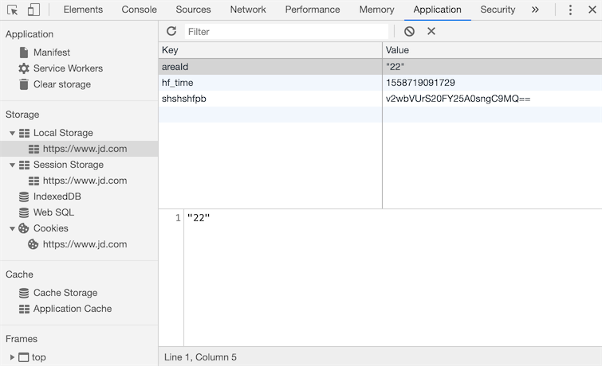

## Cookie ve Session

> **Translated to Turkish by** himmetcanumutlu

Bir önceki bölümdeki projeyi tamamlayıp "kullanıcı girişi" işlevini gerçekleştirelim ve yalnızca giriş yapan kullanıcıların oy verebilmesini kısıtlayalım.

### Kullanıcı Girişi İçin Hazırlık

Önce kullanıcı girişini gerçekleştirmek için bazı hazırlıklar yapalım.

1. Kullanıcı modelini oluşturun. Daha önce Django'nun ORM'iyle iki boyutlu tablodan modele dönüşümü (tersine mühendislik) anlatmıştık; bu sefer modeli iki boyutlu tabloya dönüştürmeyi (ileri mühendislik) deneyelim.

    ```Python
    class User(models.Model):
        """Kullanıcı"""
        no = models.AutoField(primary_key=True, verbose_name='Numara')
        username = models.CharField(max_length=20, unique=True, verbose_name='Kullanıcı adı')
        password = models.CharField(max_length=32, verbose_name='Parola')
        tel = models.CharField(max_length=20, verbose_name='Cep telefonu')
        reg_date = models.DateTimeField(auto_now_add=True, verbose_name='Kayıt zamanı')
        last_visit = models.DateTimeField(null=True, verbose_name='Son giriş zamanı')
    
        class Meta:
            db_table = 'tb_user'
            verbose_name = 'Kullanıcı'
            verbose_name_plural = 'Kullanıcı'
    ```
    
2. Aşağıdaki komutla geçiş dosyası oluşturup geçişi çalıştırarak `User` modelini doğrudan ilişkisel veritabanındaki `tb_user` iki boyutlu tablosuna dönüştürün.

    ```Bash
    python manage.py makemigrations polls
    python manage.py migrate polls
    ```

3. Aşağıdaki SQL ile doğrudan iki test verisi ekleyin; genellikle kullanıcının parolası veritabanında doğrudan saklanamaz; bu yüzden kullanıcı parolasını ilgili MD5 özetine dönüştürüyoruz. MD5 mesaj özeti algoritması, yaygın kullanılan bir parola özetleme fonksiyonudur (karma fonksiyonu); 128 bitlik bir karma değer üretir; bilgi aktarımının bütün ve tutarlı olmasını sağlar. Karma değer kullanılırken genellikle onaltılık string olarak ifade edilir; bu yüzden 128 bitlik MD5 özeti genellikle 32 onaltılık simge olarak gösterilir.

    ```SQL
    insert into `tb_user`
        (`username`, `password`, `tel`, `reg_date`)
    values
        ('wangdachui', '1c63129ae9db9c60c3e8aa94d3e00495', '13122334455', now()),
        ('hellokitty', 'c6f8cf68e5f68b0aa4680e089ee4742c', '13890006789', now());
    ```

    > **Not**: Yukarıda oluşturulan iki kullanıcının (`wangdachui` ve `hellokitty`) parolaları sırasıyla `1qaz2wsx` ve `Abc123!!`'dir.

4. Uygulama altına, kullanılacak araç fonksiyonlarını saklamak için `utils.py` adlı bir modül ekleyelim. Python standart kütüphanesindeki `hashlib` modülü MD5, SHA1, SHA256 gibi yaygın karma algoritmalarını kapsüller. Aşağıda `hashlib`'deki `md5` sınıfıyla string'i MD5 özetine dönüştüren fonksiyon yer alıyor.

    ```Python
    import hashlib
    
    
    def gen_md5_digest(content):
        return hashlib.md5(content.encode()).hexdigest()
    ```

5. Kullanıcı girişi görünüm fonksiyonunu ve şablon sayfayı yazın.

    Giriş sayfasını render eden görünüm fonksiyonunu ekleyin:

    ```Python
    def login(request: HttpRequest) -> HttpResponse:
        hint = ''
        return render(request, 'login.html', {'hint': hint})
    ```

    `login.html` şablon sayfasını ekleyin:

    ```HTML
    <!DOCTYPE html>
    <html lang="en">
    <head>
        <meta charset="UTF-8">
        <title>Kullanıcı Girişi</title>
        <style>
            #container {
                width: 520px;
                margin: 10px auto;
            }
            .input {
                margin: 20px 0;
                width: 460px;
                height: 40px;
            }
            .input>label {
                display: inline-block;
                width: 140px;
                text-align: right;
            }
            .input>img {
                width: 150px;
                vertical-align: middle;
            }
            input[name=captcha] {
                vertical-align: middle;
            }
            form+div {
                margin-top: 20px;
            }
            form+div>a {
                text-decoration: none;
                color: darkcyan;
                font-size: 1.2em;
            }
            .button {
                width: 500px;
                text-align: center;
                margin-top: 20px;
            }
            .hint {
                color: red;
                font-size: 12px;
            }
        </style>
    </head>
    <body>
        <div id="container">
            <h1>Kullanıcı Girişi</h1>
            <hr>
            <p class="hint">{{ hint }}</p>
            <form action="/login/" method="post">
                
                <fieldset>
                    <legend>Kullanıcı Bilgisi</legend>
                    <div class="input">
                        <label>Kullanıcı adı:</label>
                        <input type="text" name="username">
                    </div>
                    <div class="input">
                        <label>Parola:</label>
                        <input type="password" name="password">
                    </div>
                    <div class="input">
                        <label>Doğrulama kodu:</label>
                        <input type="text" name="captcha">
                        
                    </div>
                </fieldset>
                <div class="button">
                    <input type="submit" value="Giriş">
                    <input type="reset" value="Sıfırla">
                </div>
            </form>
            <div>
                <a href="/">Ana sayfaya dön</a>
                <a href="/register/">Yeni kullanıcı kaydı</a>
            </div>
        </div>
    </body>
    </html>
    ```

    Dikkat: yukarıdaki formda, forma bir gizli alan eklemek için `` şablon komutunu kullandık (tarayıcıda sayfanın kaynak kodunu görüntüleyerek bu komutun ürettiği, `type` özelliği `hidden` olan `input` etiketini görebilirsiniz); görevi, formda rastgele bir belirteç (token) üretip [Siteler Arası İstek Sahteciliği](<https://zh.wikipedia.org/wiki/%E8%B7%A8%E7%AB%99%E8%AF%B7%E6%B1%82%E4%BC%AA%E9%80%A0>)ni (kısaca CSRF) önlemektir; bu da Django'nun form gönderirkenki zorunlu koşuludur. Formumuzda böyle bir belirteç yoksa, form gönderildiğinde Django `403` (erişim yasak) yanıt durum kodu üretir; CSRF belirtecinden muafiyet ayarlamadığımız sürece. Aşağıdaki görsel CSRF hakkında basit ve canlı bir örnektir.

    

Şimdi doğrulama kodunu sağlayan ve kullanıcı girişini gerçekleştiren görünüm fonksiyonlarını yazabiliriz; ondan önce, bir Web uygulamasının kullanıcı takibini nasıl yaptığından ve Django'nun kullanıcı takibi için sunduğu destekten söz edelim. Bir Web uygulaması için, kullanıcı başarıyla giriş yaptıktan sonra sunucunun bu kullanıcının giriş yaptığını hatırlaması gerekir; böylece sunucu bu kullanıcıya daha iyi hizmet sunar; ayrıca yukarıda sözünü ettiğimiz CSRF de, oltalama sitesiyle kullanıcının giriş bilgisini çalıp kötü amaçlı işlem yapan bir saldırı yöntemidir; bunların hepsi kullanıcı takibi teknolojisine dayanır. Bu arka plan bilgisini anladıktan sonra, kullanıcı girişinde tam olarak hangi işlemlerin yapılması gerektiği netleşir.

### Kullanıcı Takibi

Günümüzde bir site, kim olduğunuzu ve sitedeki önceki etkinliklerinizi bir şekilde hatırlamazsa, sitenin kullanılabilirliğini ve pratikliğini kaybeder; bu da büyük olasılıkla site kullanıcılarının kaybına yol açar; bu yüzden bir kullanıcıyı hatırlamak (daha profesyonel adıyla **kullanıcı takibi**) çoğu Web uygulaması için zorunlu bir işlevdir.

Sunucu tarafında bir kullanıcıyı hatırlamanın en basit yolu bir nesne oluşturmaktır; bu nesneyle kullanıcıyla ilgili tüm bilgiler saklanabilir; bu nesneye genellikle session (kullanıcı oturum nesnesi) deriz. O zaman sorun şu: HTTP'nin kendisi **bağlantısız** (her istek-yanıt sürecinde sunucu, istemcinin isteğini yanıtladıktan sonra bağlantıyı koparır) ve **durumsuz** (istemci sunucuya yeniden istek attığında, sunucu bu istemcinin önceki hiçbir bilgisini bilemez) bir protokoldür; sunucu session nesnesiyle kullanıcı verisini saklasa bile, mevcut isteğin daha önce saklanan hangi session ile ilişkili olduğunu belirlemek için bir yol gerekir. Birçok kişinin aklına gelmiştir: her session nesnesine, session nesnesini tanımlamak için evrensel olarak benzersiz bir tanımlayıcı atayabiliriz; buna şimdilik sessionid diyelim; istemci her istek attığında bu sessionid'yi taşıdığı sürece, ona karşılık gelen session nesnesini bulmanın bir yolu olur; böylece iki istek arasında kullanıcının bilgisini hatırlamış oluruz; yani daha önce sözünü ettiğimiz kullanıcı takibi.

İstemcinin sessionid'yi hatırlayıp her istekte taşımasını sağlamanın birkaç yolu vardır:

1. URL yeniden yazma. URL yeniden yazma, URL içinde sessionid taşımaktır; örneğin: `http://www.example.com/index.html?sessionid=123456`; sunucu, sessionid parametresinin değerini alıp karşılık gelen session nesnesini bulur.

2. Gizli alan (örtük form alanı). Form gönderilirken, formda gizli alan ayarlayarak sunucuya ek veri gönderilebilir. Örneğin: `<input type="hidden" name="sessionid" value="123456">`.

3. Yerel depolama. Günümüz tarayıcıları cookie, localStorage, sessionStorage, IndexedDB gibi birçok yerel depolama çözümünü destekler. Bunların arasında cookie en eski ve en çok eleştirilen çözümdür; şimdi ilk olarak onu anlatacağız. Basitçe söylemek gerekirse cookie, tarayıcının geçici dosyalarında anahtar-değer çifti biçiminde saklanan veridir; her istekte, istek başlığı bu sitenin cookie'sini sunucuya taşır; sessionid'yi cookie'ye yazdığımız sürece, bir sonraki istekte sunucu istek başlığındaki cookie'yi okuyarak sessionid'yi alır; aşağıdaki gibidir.

   

   HTML5 çağında cookie dışında, az önce sözünü ettiğimiz localStorage, sessionStorage, IndexedDB gibi yeni yerel depolama API'leri de kullanılabilir; aşağıdaki gibidir.

   

**Özetlemek gerekirse**, kullanıcı takibini gerçekleştirmek için sunucu tarafı her kullanıcı oturumu için bir session nesnesi oluşturup session nesnesinin ID'sini tarayıcının cookie'sine yazabilir; kullanıcı bir sonraki isteğinde, tarayıcı HTTP istek başlığında sitenin kaydettiği cookie bilgisini taşır; böylece sunucu cookie'den session nesnesinin ID'sini bulup bu ID ile daha önce oluşturulan session nesnesini alır; session nesnesi kullanıcı verisini anahtar-değer çifti biçiminde saklayabildiğinden, daha önce session nesnesine kaydedilen bilgilerin tümü alınabilir; sunucu da bu bilgilere göre kullanıcının kimliğini belirleyip tercihlerini öğrenip daha iyi kişiselleştirilmiş hizmet sunar.

### Django Framework'ünün Session Desteği

Django projesi oluştururken, varsayılan yapılandırma dosyası `settings.py`'de `SessionMiddleware` adlı bir ara katman zaten etkinleştirilmiştir (ara katman bilgisini ileriki bölümde ayrıntılı anlatacağız; şimdilik varlığını bilmeniz yeterli); bu ara katman sayesinde, istek nesnesinin `session` özelliğiyle oturum nesnesini doğrudan işleyebiliriz. Daha önce söylediğimiz gibi, `session` özelliği sözlük gibi veri okuyup yazabilen bir kapsayıcı nesnesidir; bu yüzden kullanıcı verisini "anahtar-değer çifti" biçiminde tutabiliriz. Aynı zamanda `SessionMiddleware` ara katmanı cookie işlemlerini de kapsüller; cookie içinde sessionid saklanır; bunu yukarıda belirtmiştik.

Varsayılan olarak Django, session verisini serileştirip ilişkisel veritabanında saklar; Django 1.6 sonrası sürümlerde varsayılan serileştirme biçimi JSON serileştirmedir; ondan önce Pickle serileştirme kullanılıyordu. JSON serileştirme ile Pickle serileştirmenin farkı, birincinin nesneyi string'e (karakter biçiminde), ikincinin ise bayt dizisine (ikili biçimde) serileştirmesidir; güvenlik nedeniyle JSON serileştirme, şu anki Django framework'ünün varsayılan veri serileştirme biçimi olmuştur; bu da session'da sakladığımız verinin JSON serileştirilebilir olmasını gerektirir; aksi halde istisna oluşur. Ayrıca belirtmek gerekir ki session verisini ilişkisel veritabanında saklamak çoğu zaman en iyi seçim değildir; çünkü veritabanı büyük yük altında sistem performansının darboğazı olabilir; ileriki bölümlerde session'ı önbellek hizmetine nasıl kaydedip sistem performansını artıracağımızı anlatacağız.

### Kullanıcı Girişi Doğrulamasını Gerçekleştirme

Önce az önceki `polls/utils.py` dosyasında rastgele doğrulama kodu üreten `gen_random_code` fonksiyonunu yazalım; içerik aşağıdaki gibidir.

```Python
import random

ALL_CHARS = '0123456789abcdefghijklmnopqrstuvwxyzABCDEFGHIJKLMNOPQRSTUVWXYZ'


def gen_random_code(length=4):
    return ''.join(random.choices(ALL_CHARS, k=length))
```

Doğrulama kodu görselini üreten `Captcha` sınıfını yazın.

```Python
"""
Görsel doğrulama kodu
"""
import os
import random
from io import BytesIO

from PIL import Image
from PIL import ImageFilter
from PIL.ImageDraw import Draw
from PIL.ImageFont import truetype


class Bezier:
    """Bezier eğrisi"""

    def __init__(self):
        self.tsequence = tuple([t / 20.0 for t in range(21)])
        self.beziers = {}

    def make_bezier(self, n):
        """Bezier eğrisi çiz"""
        try:
            return self.beziers[n]
        except KeyError:
            combinations = pascal_row(n - 1)
            result = []
            for t in self.tsequence:
                tpowers = (t ** i for i in range(n))
                upowers = ((1 - t) ** i for i in range(n - 1, -1, -1))
                coefs = [c * a * b for c, a, b in zip(combinations,
                                                      tpowers, upowers)]
                result.append(coefs)
            self.beziers[n] = result
            return result


class Captcha:
    """Doğrulama kodu"""

    def __init__(self, width, height, fonts=None, color=None):
        self._image = None
        self._fonts = fonts if fonts else \
            [os.path.join(os.path.dirname(__file__), 'fonts', font)
             for font in ['Arial.ttf', 'Georgia.ttf', 'Action.ttf']]
        self._color = color if color else random_color(0, 200, random.randint(220, 255))
        self._width, self._height = width, height

    @classmethod
    def instance(cls, width=200, height=75):
        """Captcha nesnesini almak için kullanılan sınıf metodu"""
        prop_name = f'_instance_{width}_{height}'
        if not hasattr(cls, prop_name):
            setattr(cls, prop_name, cls(width, height))
        return getattr(cls, prop_name)

    def _background(self):
        """Arka planı çiz"""
        Draw(self._image).rectangle([(0, 0), self._image.size],
                                    fill=random_color(230, 255))

    def _smooth(self):
        """Görüntüyü yumuşat"""
        return self._image.filter(ImageFilter.SMOOTH)

    def _curve(self, width=4, number=6, color=None):
        """Eğri çiz"""
        dx, height = self._image.size
        dx /= number
        path = [(dx * i, random.randint(0, height))
                for i in range(1, number)]
        bcoefs = Bezier().make_bezier(number - 1)
        points = []
        for coefs in bcoefs:
            points.append(tuple(sum([coef * p for coef, p in zip(coefs, ps)])
                                for ps in zip(*path)))
        Draw(self._image).line(points, fill=color if color else self._color, width=width)

    def _noise(self, number=50, level=2, color=None):
        """Gürültü çiz"""
        width, height = self._image.size
        dx, dy = width / 10, height / 10
        width, height = width - dx, height - dy
        draw = Draw(self._image)
        for i in range(number):
            x = int(random.uniform(dx, width))
            y = int(random.uniform(dy, height))
            draw.line(((x, y), (x + level, y)),
                      fill=color if color else self._color, width=level)

    def _text(self, captcha_text, fonts, font_sizes=None, drawings=None, squeeze_factor=0.75, color=None):
        """Metni çiz"""
        color = color if color else self._color
        fonts = tuple([truetype(name, size)
                       for name in fonts
                       for size in font_sizes or (65, 70, 75)])
        draw = Draw(self._image)
        char_images = []
        for c in captcha_text:
            font = random.choice(fonts)
            c_width, c_height = draw.textsize(c, font=font)
            char_image = Image.new('RGB', (c_width, c_height), (0, 0, 0))
            char_draw = Draw(char_image)
            char_draw.text((0, 0), c, font=font, fill=color)
            char_image = char_image.crop(char_image.getbbox())
            for drawing in drawings:
                d = getattr(self, drawing)
                char_image = d(char_image)
            char_images.append(char_image)
        width, height = self._image.size
        offset = int((width - sum(int(i.size[0] * squeeze_factor)
                                  for i in char_images[:-1]) -
                      char_images[-1].size[0]) / 2)
        for char_image in char_images:
            c_width, c_height = char_image.size
            mask = char_image.convert('L').point(lambda i: i * 1.97)
            self._image.paste(char_image,
                              (offset, int((height - c_height) / 2)),
                              mask)
            offset += int(c_width * squeeze_factor)

    @staticmethod
    def _warp(image, dx_factor=0.3, dy_factor=0.3):
        """Görüntüyü eğrilt"""
        width, height = image.size
        dx = width * dx_factor
        dy = height * dy_factor
        x1 = int(random.uniform(-dx, dx))
        y1 = int(random.uniform(-dy, dy))
        x2 = int(random.uniform(-dx, dx))
        y2 = int(random.uniform(-dy, dy))
        warp_image = Image.new(
            'RGB',
            (width + abs(x1) + abs(x2), height + abs(y1) + abs(y2)))
        warp_image.paste(image, (abs(x1), abs(y1)))
        width2, height2 = warp_image.size
        return warp_image.transform(
            (width, height),
            Image.QUAD,
            (x1, y1, -x1, height2 - y2, width2 + x2, height2 + y2, width2 - x2, -y1))

    @staticmethod
    def _offset(image, dx_factor=0.1, dy_factor=0.2):
        """Görüntüyü kaydır"""
        width, height = image.size
        dx = int(random.random() * width * dx_factor)
        dy = int(random.random() * height * dy_factor)
        offset_image = Image.new('RGB', (width + dx, height + dy))
        offset_image.paste(image, (dx, dy))
        return offset_image

    @staticmethod
    def _rotate(image, angle=25):
        """Görüntüyü döndür"""
        return image.rotate(random.uniform(-angle, angle),
                            Image.BILINEAR, expand=1)

    def generate(self, captcha_text='', fmt='PNG'):
        """Doğrulama kodunu üret (metin ve görsel)
        :param captcha_text: doğrulama kodu metni
        :param fmt: üretilen doğrulama kodu görselinin biçimi
        :return: doğrulama kodu görselinin ikili verisi
        """
        self._image = Image.new('RGB', (self._width, self._height), (255, 255, 255))
        self._background()
        self._text(captcha_text, self._fonts,
                   drawings=['_warp', '_rotate', '_offset'])
        self._curve()
        self._noise()
        self._smooth()
        image_bytes = BytesIO()
        self._image.save(image_bytes, format=fmt)
        return image_bytes.getvalue()


def pascal_row(n=0):
    """Pascal üçgenini üret"""
    result = [1]
    x, numerator = 1, n
    for denominator in range(1, n // 2 + 1):
        x *= numerator
        x /= denominator
        result.append(x)
        numerator -= 1
    if n & 1 == 0:
        result.extend(reversed(result[:-1]))
    else:
        result.extend(reversed(result))
    return result


def random_color(start=0, end=255, opacity=255):
    """Rastgele renk al"""
    red = random.randint(start, end)
    green = random.randint(start, end)
    blue = random.randint(start, end)
    if opacity is None:
        return red, green, blue
    return red, green, blue, opacity
```

> **Not**: Yukarıdaki kodda üç yazı tipi dosyası kullanıldı; yazı tipi dosyaları `polls/fonts` dizinindedir; yazı tipi dosyalarını kendiniz ekleyebilirsiniz; ancak dosya adlarının yukarıdaki kodun 45. satırıyla aynı olmasına dikkat edin.

Şimdi doğrulama kodunu sağlayan görünüm fonksiyonunu tamamlayalım.

```Python
def get_captcha(request: HttpRequest) -> HttpResponse:
    """Doğrulama kodu"""
    captcha_text = gen_random_code()
    request.session['captcha'] = captcha_text
    image_data = Captcha.instance().generate(captcha_text)
    return HttpResponse(image_data, content_type='image/png')
```

Yukarıdaki kodun 4. satırına dikkat edin: rastgele üretilen doğrulama kodu string'ini session'a kaydettik; birazdan kullanıcı giriş yaparken session'da saklanan doğrulama kodu ile kullanıcının girdiği doğrulama kodunu karşılaştıracağız; kullanıcı doğru doğrulama kodunu girerse sonraki giriş akışı çalışır; kod aşağıdaki gibidir.

```Python
def login(request: HttpRequest) -> HttpResponse:
    hint = ''
    if request.method == 'POST':
        username = request.POST.get('username')
        password = request.POST.get('password')
        if username and password:
            password = gen_md5_digest(password)
            user = User.objects.filter(username=username, password=password).first()
            if user:
                request.session['userid'] = user.no
                request.session['username'] = user.username
                return redirect('/')
            else:
                hint = 'Kullanıcı adı veya parola hatalı'
        else:
            hint = 'Geçerli kullanıcı adı ve parola girin'
    return render(request, 'login.html', {'hint': hint})
```

>**Not**: Yukarıdaki kod kullanıcı adı ve parolayı doğrulamıyor; gerçek projede kullanıcı girdisini düzenli ifadeyle doğrulamanızı öneririz; aksi halde geçersiz veri veritabanına gönderilebilir veya başka güvenlik açıkları oluşabilir.

Yukarıdaki kodda, giriş başarılı olduğunda session'da kullanıcının numarası (`userid`) ve adı (`username`) saklanır; sayfa ana sayfaya yönlendirilir. Şimdi ana sayfanın kodunu biraz ayarlayıp sayfanın sağ üst köşesinde giriş yapan kullanıcının adını gösterebiliriz. Bu kodu `header.html` adlı ayrı bir HTML dosyasına yazdık; ana sayfada `<body>` etiketine `` ekleyerek bu sayfayı dahil edebiliriz; kod aşağıdaki gibidir.

```HTML
<div class="user">
    
    <span>{{ request.session.username }}</span>
    <a href="/logout">Çıkış</a>
    
    <a href="/login">Giriş</a>&nbsp;&nbsp;
    
    <a href="/register">Kayıt</a>
</div>
```

Kullanıcı giriş yapmamışsa sayfa giriş ve kayıt bağlantılarını gösterir; giriş başarılı olduğunda sayfada kullanıcı adı ve çıkış bağlantısı görünür; çıkış bağlantısına karşılık gelen görünüm fonksiyonu aşağıdadır; URL eşlemesi daha önce anlattığımıza benzer, tekrar anlatmayacağız.

```Python
def logout(request):
    """Çıkış"""
    request.session.flush()
    return redirect('/')
```

Yukarıdaki kod, session nesnesinin `flush` metoduyla oturumu yok eder; bir yandan sunucudaki session nesnesinin sakladığı kullanıcı verisini temizler, bir yandan da tarayıcı cookie'sinde saklanan sessionid'yi siler; birazdan cookie okuma/yazma işlemini açıklayacağız.

Projenin kullandığı veritabanındaki `django_session` adlı tabloyla tüm session'ları bulabiliriz; tablonun yapısı şöyledir:

| session_key                      | session_data                    | expire_date                |
| -------------------------------- | ------------------------------- | -------------------------- |
| c9g2gt5cxo0k2evykgpejhic5ae7bfpl | MmI4YzViYjJhOGMyMDJkY2M5Yzg3... | 2019-05-25 23:16:13.898522 |

Birinci sütun, tarayıcı cookie'sinde saklanan sessionid'dir; ikinci sütun, BASE64 ile kodlanmış session verisidir; Python'ın `base64` modülüyle çözülürse süreç ve sonuç aşağıdaki gibidir.

```Python
import base64

base64.b64decode('MmI4YzViYjJhOGMyMDJkY2M5Yzg3ZWIyZGViZmUzYmYxNzdlNDdmZjp7ImNhcHRjaGEiOiJzS3d0Iiwibm8iOjEsInVzZXJuYW1lIjoiamFja2ZydWVkIn0=')
```

Üçüncü sütun session'ın süre sonu zamanıdır; session süresi dolunca tarayıcının cookie'sinde saklanan sessionid geçersiz olur; ancak veritabanındaki ilgili kayıt hâlâ kalır; süresi dolmuş veriyi temizlemek istiyorsanız aşağıdaki komutu kullanabilirsiniz.

```Shell
python manage.py clearsessions
```

Django framework'ünün varsayılan session süre sonu iki haftadır (1209600 saniye); bu süreyi değiştirmek istiyorsanız proje yapılandırma dosyasına aşağıdaki kodu ekleyebilirsiniz.

```Python
# Oturum süre sonunu 1 gün (86400 saniye) olarak yapılandır
SESSION_COOKIE_AGE = 86400
```

Güvenlik gereksinimi yüksek birçok uygulama, tarayıcı penceresi kapatıldığında oturumun süresinin dolmasını ve kullanıcının hiçbir bilgisinin saklanmamasını ister; tarayıcı penceresi kapatıldığında oturumun süresinin dolmasını (cookie'deki sessionid geçersiz olsun) istiyorsanız aşağıdaki yapılandırmayı ekleyin.

```Python
# True yapılırsa tarayıcı penceresi kapatıldığında session süresi dolar
SESSION_EXPIRE_AT_BROWSER_CLOSE = True
```

Session verisini veritabanında saklamak istemiyorsanız önbelleğe koyabilirsiniz; ilgili yapılandırma aşağıdadır; önbelleğin yapılandırılması ve kullanımı ileride anlatılacak.

```Python
# Oturum nesnesinin önbellekte saklanmasını yapılandır
SESSION_ENGINE = 'django.contrib.sessions.backends.cache'
# Oturumu saklamak için hangi önbellek grubunun kullanılacağını yapılandır
SESSION_CACHE_ALIAS = 'default'
```

Session verisinin varsayılan serileştirme biçimini değiştirmek istiyorsanız, varsayılan `JSONSerializer`'ı `PickleSerializer` olarak değiştirebilirsiniz.

```Python
SESSION_SERIALIZER = 'django.contrib.sessions.serializers.PickleSerializer'
```

Şimdi yalnızca giriş yapan kullanıcıların öğretmene oy verebilmesini kısıtlayabiliriz; değiştirilen `praise_or_criticize` fonksiyonu aşağıdadır; `request.session`'dan `userid` alarak kullanıcının giriş yapıp yapmadığını belirleriz.

```Python
def praise_or_criticize(request: HttpRequest) -> HttpResponse:
    if request.session.get('userid'):
        try:
            tno = int(request.GET.get('tno'))
            teacher = Teacher.objects.get(no=tno)
            if request.path.startswith('/praise/'):
                teacher.good_count += 1
                count = teacher.good_count
            else:
                teacher.bad_count += 1
                count = teacher.bad_count
            teacher.save()
            data = {'code': 20000, 'mesg': 'Oylama başarılı', 'count': count}
        except (ValueError, Teacher.DoesNotExist):
            data = {'code': 20001, 'mesg': 'Oylama başarısız'}
    else:
        data = {'code': 20002, 'mesg': 'Önce giriş yapın'}
    return JsonResponse(data)
```

Elbette görünüm fonksiyonunu değiştirdikten sonra `teachers.html` de ayarlanmalıdır; kullanıcı giriş yapmamışsa giriş sayfasına yönlendirilir, giriş başarılı olunca oylama sayfasına dönülür; burada tekrar anlatmayacağız.

### Görünüm Fonksiyonunda Cookie Okuma/Yazma

Web projelerinde bu teknolojiyi daha iyi kullanmanıza yardımcı olmak için cookie kullanımını daha ayrıntılı açıklayalım. Django'nun kapsüllediği `HttpRequest` ve `HttpResponse` nesneleri sırasıyla cookie okuma/yazma işlemlerini sunar.

HttpRequest'in kapsüllediği özellik ve metotlar:

1. `COOKIES` özelliği - HTTP isteğinin taşıdığı tüm cookie'leri içerir.
2. `get_signed_cookie` metodu - İmzalı cookie'yi alır; imza doğrulaması başarısız olursa `BadSignature` istisnası üretir.

HttpResponse'un kapsüllediği metotlar:

1. `set_cookie` metodu - Bir anahtar-değer çifti ayarlar ve sonunda tarayıcıya yazar.
2. `set_signed_cookie` metodu - Yukarıdaki metotla benzer işlev görür; ancak cookie'yi imzalayarak kurcalamayı önler. Çünkü cookie'deki veri değiştirilirse, [anahtar](<https://zh.wikipedia.org/wiki/%E5%AF%86%E9%92%A5>)ı ve [tuzu](<https://zh.wikipedia.org/wiki/%E7%9B%90_(%E5%AF%86%E7%A0%81%E5%AD%A6)>) bilmeden geçerli imza üretilemez; böylece sunucu cookie'yi okurken veri ile imzanın uyuşmadığını fark edip `BadSignature` istisnası üretir. Buradaki anahtar, Django proje yapılandırma dosyasında belirttiğimiz `SECRET_KEY`'dir; tuz ise programda belirlenen bir string'dir; geçerli bir string olduğu sürece ne olursa olsun.

Yukarıdaki metotların somut kullanımını bilmiyorsanız, Django'nun [resmî dokümanına](<https://docs.djangoproject.com/en/2.1/ref/request-response/>) bakabilirsiniz; bu metotların nasıl kullanılacağını resmî dokümandan daha net anlatan bir kaynak yoktur.

Az önce söylediğimiz gibi, `SessionMiddleware` etkinleştirildikten sonra her `HttpRequest` nesnesi bir session özelliğine bağlanır; bu, sözlük benzeri bir nesnedir; kullanıcı verisini saklamanın yanı sıra tarayıcının cookie'yi destekleyip desteklemediğini denetleyen metotlar sunar:

1. `set_test_cookie` metodu - Test için cookie ayarlar.
2. `test_cookie_worked` metodu - Test cookie'sinin çalışıp çalışmadığını denetler.
3. `delete_test_cookie` metodu - Test cookie'sini siler.
4. `set_expiry` metodu - Oturumun süre sonu zamanını ayarlar.
5. `get_expire_age`/`get_expire_date` metodu - Oturumun süre sonunu alır.
6. `clear_expired` metodu - Süresi dolmuş oturumları temizler.

Aşağıda giriş yapmadan önce tarayıcının cookie'yi destekleyip desteklemediğini kontrol eden kod yer alıyor. Normalde tarayıcılar varsayılan olarak cookie desteğini açar; ancak bazı nedenlerle kullanıcı cookie işlevini devre dışı bırakmış olabilir; bu durumda görünüm fonksiyonunda bir kontrol sağlayabiliriz; tarayıcının cookie'yi desteklemediğini tespit edersek ilgili uyarıyı gösterebiliriz.

```Python
def login(request):
    if request.method == 'POST':
        if request.session.test_cookie_worked():
            request.session.delete_test_cookie()
            # Giriş işlemini yapacak kodunuzu buraya ekleyin
        else:
            return HttpResponse("Lütfen cookie'leri etkinleştirip tekrar deneyin.")
    request.session.set_test_cookie()
    return render_to_response('login.html')
```

### Cookie'nin Alternatifleri

Daha önce cookie'nin adının pek iyi olmadığını söylemiştik; elbette gerçek geliştirmede cookie'de kullanıcının hassas bilgilerini (parola, kredi kartı numarası gibi) saklamayız; ayrıca cookie'de saklanan veri genellikle kodlanır ve imzalanır. HTML5 destekleyen tarayıcılar için localStorage ve sessionStorage cookie'nin alternatifi olarak kullanılabilir; adlarından farkını tahmin edebilirsiniz: `localStorage`'ta saklanan veri uzun süre kalır; `sessionStorage`'ta saklanan veri ise tarayıcı kapatıldığında temizlenir. Bu cookie alternatiflerinin kullanımı için [MDN](<https://developer.mozilla.org/zh-CN/docs/Web>)e bakmanızı öneririz.
