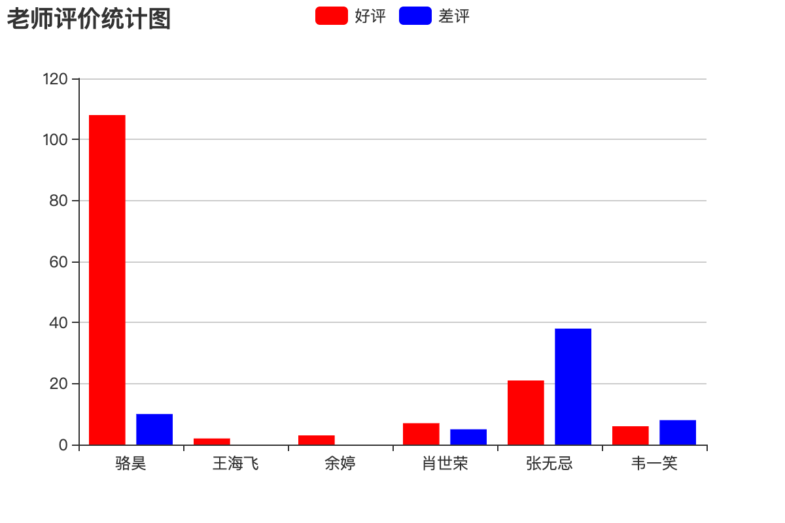

## Rapor Oluşturma

> **Translated to Turkish by** himmetcanumutlu

### Excel Raporu Dışa Aktarma

Rapor, veriyi tablo, grafik gibi biçimlerle dinamik olarak gösterir; bu yüzden bazıları raporu şöyle tanımlar:

```
Rapor = çeşitli biçimler + dinamik veri
```

Python programında Excel dosyası yazmayı destekleyen birçok üçüncü taraf kütüphane vardır: [`xlwt`](<https://xlwt.readthedocs.io/en/latest/>), [`xlwings`](<https://docs.xlwings.org/en/latest/quickstart.html>), [`openpyxl`](<https://openpyxl.readthedocs.io/en/latest/>), [`xlswriter`](<https://xlsxwriter.readthedocs.io/>) gibi. Bunlardan xlwt yalnızca xls biçimindeki Excel dosyalarını yazmayı desteklese de performansı fena değildir. Aşağıda `xlwt` örneğiyle Django projesinde Excel raporunun nasıl dışa aktarılacağını gösterelim.

`xlwt` kurulumu.

```Bash
pip install xlwt
```

Tüm öğretmen bilgisini içeren Excel tablosunu dışa aktaran görünüm fonksiyonu.

```Python
def export_teachers_excel(request):
    # Çalışma kitabı oluştur
    wb = xlwt.Workbook()
    # Çalışma sayfası ekle
    sheet = wb.add_sheet('Öğretmen bilgi tablosu')
    # Tüm öğretmen bilgilerini sorgula
    queryset = Teacher.objects.all()
    # Excel formuna başlık yaz
    colnames = ('Ad', 'Tanıtım', 'Olumlu oy', 'Olumsuz oy', 'Ders')
    for index, name in enumerate(colnames):
        sheet.write(0, index, name)
    # Hücrelere öğretmen verisini yaz
    props = ('name', 'detail', 'good_count', 'bad_count', 'subject')
    for row, teacher in enumerate(queryset):
        for col, prop in enumerate(props):
            value = getattr(teacher, prop, '')
            if isinstance(value, Subject):
                value = value.name
            sheet.write(row + 1, col, value)
    # Excel'i kaydet
    buffer = BytesIO()
    wb.save(buffer)
    # İkili veriyi yanıtın mesaj gövdesine yazıp MIME tipini ayarla
    resp = HttpResponse(buffer.getvalue(), content_type='application/vnd.ms-excel')
    # Çince dosya adını yüzdelik kodlamaya çevir
    filename = quote('ogretmenler.xls')
    # Yanıt başlığıyla tarayıcıya bu dosyayı ve dosya adını indireceğini bildir
    resp['content-disposition'] = f'attachment; filename*=utf-8\'\'{filename}'
    return resp
```

URL eşleme.

```Python
urlpatterns = [
    
    path('excel/', views.export_teachers_excel),
    
]
```

### PDF Raporu Dışa Aktarma

Django projesinde PDF raporu dışa aktarmak gerekirse, PDF dosyasının içeriğini üretmek için üçüncü taraf `reportlab` kütüphanesi kullanılabilir; sonra dosyanın ikili verisini tarayıcıya çıktı verip MIME tipini `application/pdf` olarak belirtebiliriz; somut kod aşağıdaki gibidir.

```Python
def export_pdf(request: HttpRequest) -> HttpResponse:
    buffer = io.BytesIO()
    pdf = canvas.Canvas(buffer)
    pdf.setFont("Helvetica", 80)
    pdf.setFillColorRGB(0.2, 0.5, 0.3)
    pdf.drawString(100, 550, 'hello, world!')
    pdf.showPage()
    pdf.save()
    resp = HttpResponse(buffer.getvalue(), content_type='application/pdf')
    resp['content-disposition'] = 'inline; filename="demo.pdf"'
    return resp
```

`reportlab` ile PDF raporunun içeriğini nasıl özelleştireceğiniz hakkında reportlab'ın [resmî dokümanına](https://www.reportlab.com/docs/reportlab-userguide.pdf) bakabilirsiniz.

### Ön Yüz İstatistik Grafiği Oluşturma

Projede ön yüz istatistik grafiği üretmek gerekirse, Baidu'nun [ECharts](<https://echarts.baidu.com/>)ını kullanabilirsiniz. Somut yöntem: arka uç, istatistik grafiğinin ihtiyaç duyduğu veriyi veri arayüzüyle döndürür; ön uç ECharts ile sütun grafiği, çizgi grafiği, pasta grafiği, dağılım grafiği gibi grafikleri render eder. Örneğin tüm öğretmenlerin olumlu ve olumsuz oy sayısını gösteren bir rapor üretmek istiyorsak aşağıdaki biçimde yapabiliriz.

```Python
def get_teachers_data(request):
    queryset = Teacher.objects.all()
    names = [teacher.name for teacher in queryset]
    good_counts = [teacher.good_count for teacher in queryset]
    bad_counts = [teacher.bad_count for teacher in queryset]
    return JsonResponse({'names': names, 'good': good_counts, 'bad': bad_counts})
```

URL eşleme.

```Python
urlpatterns = [
    path('teachers_data/', views.get_teachers_data),
]
```

ECharts ile sütun grafiği oluşturma.

```HTML
<!DOCTYPE html>
<html lang="en">
<head>
    <meta charset="UTF-8">
    <title>Öğretmen Değerlendirme İstatistiği</title>
</head>
<body>
    <div id="main" style="width: 600px; height: 400px"></div>
    <p>
        <a href="/">Ana sayfaya dön</a>
    </p>
    <script src="https://cdn.bootcss.com/echarts/4.2.1-rc1/echarts.min.js"></script>
    <script>
        var myChart = echarts.init(document.querySelector('#main'))
        fetch('/teachers_data/')
            .then(resp => resp.json())
            .then(json => {
                var option = {
                    color: ['#f00', '#00f'],
                    title: {
                        text: 'Öğretmen Değerlendirme İstatistik Grafiği'
                    },
                    tooltip: {},
                    legend: {
                        data:['Olumlu', 'Olumsuz']
                    },
                    xAxis: {
                        data: json.names
                    },
                    yAxis: {},
                    series: [
                        {
                            name: 'Olumlu',
                            type: 'bar',
                            data: json.good
                        },
                        {
                            name: 'Olumsuz',
                            type: 'bar',
                            data: json.bad
                        }
                    ]
                }
                myChart.setOption(option)
            })
    </script>
</body>
</html>
```

Çalışma sonucu aşağıdaki gibidir.


