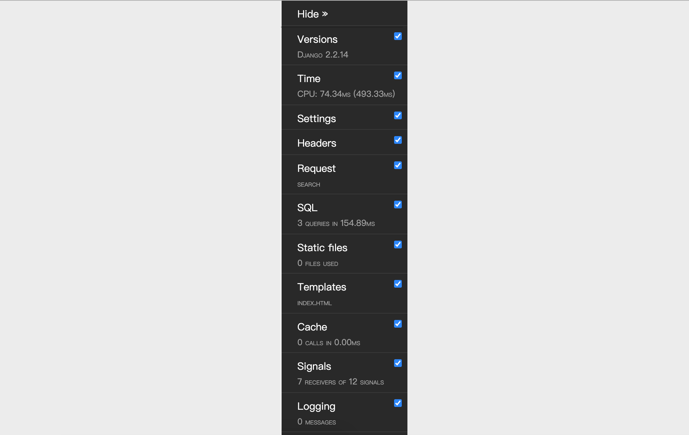

## Loglama ve Hata Ayıklama Araç Çubuğu

> **Translated to Turkish by** himmetcanumutlu

### Loglama Yapılandırması

Proje geliştirme aşamasında, geliştiricinin kod hata ayıklamasına yardımcı olmak için yeterli hata ayıklama bilgisini göstermek gereklidir; proje yayına alındıktan sonra, sistem çalışırken ortaya çıkan uyarı ve hataları kaydedip ilgili kişilerin sistemin durumunu anlaması ve kodu bakımını yapması gerekir. Aynı zamanda log verisi toplamak, sitenin dijital operasyonunun da temelini atar; sistem çalışma loglarını analiz ederek sitenin trafiğini ve trafik dağılımını izleyebilir, kullanıcıların kullanım alışkanlıklarını ve davranış kalıplarını çıkarabiliriz.

Şimdi Django'nun yapılandırma dosyasıyla loglamayı nasıl yapılandıracağımıza bakalım. Django'nun loglama yapılandırması, temelde resmî dokümana bakılarak projenin gerçek ihtiyacıyla birleştirilir; bu içerikler resmî dokümandan kopyalanıp yerel olarak ayarlanabilir; aşağıda bazı referans yapılandırmalar verilmiştir.

```Python
LOGGING = {
    'version': 1,
    # Mevcut loglayıcıların devre dışı bırakılıp bırakılmayacağı
    'disable_existing_loggers': False,
    # Log biçimlendiricisi
    'formatters': {
        'simple': {
            'format': '%(asctime)s %(module)s.%(funcName)s: %(message)s',
            'datefmt': '%Y-%m-%d %H:%M:%S',
        },
        'verbose': {
            'format': '%(asctime)s %(levelname)s [%(process)d-%(threadName)s] '
                      '%(module)s.%(funcName)s line %(lineno)d: %(message)s',
            'datefmt': '%Y-%m-%d %H:%M:%S',
        }
    },
    # Log filtresi
    'filters': {
        # Yalnızca Django yapılandırma dosyasında DEBUG True olduğunda işlev görür
        'require_debug_true': {
            '()': 'django.utils.log.RequireDebugTrue',
        },
    },
    # Log işleyicisi
    'handlers': {
        # Konsola çıktı verir
        'console': {
            'class': 'logging.StreamHandler',
            'level': 'DEBUG',
            'filters': ['require_debug_true'],
            'formatter': 'simple',
        },
        # Dosyaya çıktı verir (haftada bir keser)
        'file1': {
            'class': 'logging.handlers.TimedRotatingFileHandler',
            'filename': 'access.log',
            'when': 'W0',
            'backupCount': 12,
            'formatter': 'simple',
            'level': 'INFO',
        },
        # Dosyaya çıktı verir (günde bir keser)
        'file2': {
            'class': 'logging.handlers.TimedRotatingFileHandler',
            'filename': 'error.log',
            'when': 'D',
            'backupCount': 31,
            'formatter': 'verbose',
            'level': 'WARNING',
        },
    },
    # Loglayıcılar
    'loggers': {
        'django': {
            # Kullanılacak log işleyicileri
            'handlers': ['console', 'file1', 'file2'],
            # Log bilgisinin yukarı yayılıp yayılmayacağı
            'propagate': True,
            # Log düzeyi (nihai log düzeyi olmayabilir)
            'level': 'DEBUG',
        },
    }
}
```

Fark etmişsinizdir ki yukarıdaki log yapılandırmasındaki `formatters`, **log biçimlendiricisidir**; logun nasıl biçimlendirilip çıktılanacağını temsil eder; biçim yer tutucuları sırasıyla şunları belirtir:

1. `%(name)s` - Kaydedicinin adı
2. `%(levelno)s` - Sayı biçiminde log kayıt düzeyi
3. `%(levelname)s` - Log kayıt düzeyinin metin adı
4. `%(filename)s` - Log kayıt çağrısını çalıştıran kaynak dosyanın adı
5. `%(pathname)s` - Log kayıt çağrısını çalıştıran kaynak dosyanın yolu
6. `%(funcName)s` - Log kayıt çağrısını çalıştıran fonksiyonun adı
7. `%(module)s` - Log kayıt çağrısını çalıştıran modülün adı
8. `%(lineno)s` - Log kayıt çağrısını çalıştıran satır numarası
9. `%(created)s` - Log kaydının zamanı
10. `%(asctime)s` - Tarih ve saat
11. `%(msecs)s` - Milisaniye kısmı
12. `%(thread)d` - İş parçacığı ID'si (tam sayı)
13. `%(threadName)s` - İş parçacığı adı
14. `%(process)d` - Süreç ID'si (tam sayı)

Log yapılandırmasındaki handlers, **log işleyicisini** belirtir; basitçe logun konsola mı, dosyaya mı yoksa ağdaki sunucuya mı çıktılanacağını belirler; kullanılabilir işleyiciler:

1. `logging.StreamHandler(stream=None)` - `sys.stdout` veya `sys.stderr` gibi herhangi bir dosya nesnesine bilgi çıktılar
2. `logging.FileHandler(filename, mode='a', encoding=None, delay=False)` - Log mesajını dosyaya yazar
3. `logging.handlers.DatagramHandler(host, port)` - UDP protokolüyle log bilgisini belirtilen ana makine ve porta gönderir
4. `logging.handlers.HTTPHandler(host, url)` - HTTP GET veya POST ile log mesajını bir HTTP sunucusuna yükler
5. `logging.handlers.RotatingFileHandler(filename, mode='a', maxBytes=0, backupCount=0, encoding=None, delay=False)` - Log mesajını dosyaya yazar; dosya boyutu `maxBytes` değerini aşarsa yeni dosya üretip logu kaydeder
6. `logging.handlers.SocketHandler(host, port)` - TCP protokolüyle log bilgisini belirtilen ana makine ve porta gönderir
7. `logging.handlers.SMTPHandler(mailhost, fromaddr, toaddrs, subject, credentials=None, secure=None, timeout=1.0)` - Logu belirtilen e-posta adresine çıktılar
8. `logging.MemoryHandler(capacity, flushLevel=ERROR, target=None, flushOnClose=True)` - Logu bellek içindeki belirtilen ara belleğe çıktılar

Yukarıdaki her log işleyicisi `level` adlı bir özellik belirtir; bu, logun düzeyini temsil eder; farklı log düzeyleri, logda kaydedilen bilginin ciddiyetini yansıtır. Python'da altı düzey log tanımlanmıştır; düşükten yükseğe sırasıyla: NOTSET, DEBUG, INFO, WARNING, ERROR, CRITICAL.

Son olarak yapılandırılan **loglayıcı**, logu gerçekten çıktılamak için kullanılır; Django framework'ü aşağıdaki yerleşik kaydedicileri sunar:

1. `django` - Django hiyerarşisindeki tüm mesaj kaydedicileri
2. `django.request` - İstek işlemeyle ilgili log mesajları. 5xx yanıtı hata mesajı; 4xx yanıtı uyarı mesajı olarak görülür
3. `django.server` - runserver ile çağrılan sunucunun aldığı isteklerle ilgili log mesajları. 5xx yanıtı hata; 4xx yanıtı uyarı; diğer her şey INFO olarak kaydedilir
4. `django.template` - Şablon render ile ilgili log mesajları
5. `django.db.backends` - Veritabanı etkileşimiyle üretilen log mesajları; ORM framework'ünün çalıştırdığı SQL deyimlerini görmek istiyorsanız bu kaydediciyi kullanın.

Loglayıcıda yapılandırılan log düzeyi nihai düzey olmayabilir; çünkü log işleyicide yapılandırılan log düzeyine de bakılıp ikisinden daha yüksek olanı nihai log düzeyi olarak alınır.

### Django-Debug-Toolbar Yapılandırması

Django projenizi hata ayıklamak istiyorsanız, Django-Debug-Toolbar adlı harika araçtan kesinlikle geçemezsiniz; proje geliştirme aşamasında hata ayıklama ve optimizasyona yardımcı olan zorunlu bir araçtır; yapılandırdığınız anda aşağıdaki tablodaki proje çalışma bilgilerini kolayca görüntüleyebilirsiniz; bu bilgiler proje hata ayıklama ve Web uygulama performansını optimize etmede kritik önemdedir.

| Öğe        | Açıklama                              |
| ----------- | --------------------------------- |
| Versions    | Django'nun sürümü                      |
| Time        | Görünümün harcadığı süreyi gösterir                |
| Settings    | Yapılandırma dosyasındaki değerler                |
| Headers     | HTTP istek ve yanıt başlıklarının bilgisi          |
| Request     | İstekle ilgili çeşitli değişkenler ve bilgileri      |
| StaticFiles | Statik dosya yükleme durumu                  |
| Templates   | Şablonla ilgili bilgiler                    |
| Cache       | Önbelleğin kullanım durumu                    |
| Signals     | Django'nun yerleşik sinyal bilgileri              |
| Logging     | Kaydedilen log bilgileri                  |
| SQL         | Veritabanına gönderilen SQL deyimleri ve çalışma süreleri |

1. Django-Debug-Toolbar kurulumu.

   ```Shell
   pip install django-debug-toolbar
   ```

2. Yapılandırma - settings.py'yi değiştirin.

   ```Python
   INSTALLED_APPS = [
       'debug_toolbar',
   ]
   
   MIDDLEWARE = [
       'debug_toolbar.middleware.DebugToolbarMiddleware',
   ]
   
   DEBUG_TOOLBAR_CONFIG = {
       # jQuery kütüphanesini ekle
       'JQUERY_URL': 'https://cdn.bootcss.com/jquery/3.3.1/jquery.min.js',
       # Araç çubuğu daraltılsın mı
       'SHOW_COLLAPSED': True,
       # Araç çubuğu gösterilsin mi
       'SHOW_TOOLBAR_CALLBACK': lambda x: True,
   }
   ```

3. Yapılandırma - urls.py'yi değiştirin.

   ```Python
   if settings.DEBUG:
   
       import debug_toolbar
   
       urlpatterns.insert(0, path('__debug__/', include(debug_toolbar.urls)))
   ```

4. Django-Debug-Toolbar yapılandırıldıktan sonra sayfanın sağında bir hata ayıklama araç çubuğu görülür; aşağıdaki gibidir; yukarıda sözü edilen çalışma süresi, proje ayarları, istek başlığı, SQL, statik kaynak, şablon, önbellek, sinyal gibi çeşitli hata ayıklama bilgilerini içerir; görüntülemek çok pratiktir.

   

### ORM Kodunu Optimize Etme

Loglama veya Django-Debug-Toolbar yapılandırıldıktan sonra, daha önce öğretmen verisini Excel raporuna dışa aktaran görünüm fonksiyonunun çalışmasını inceleyebiliriz; burada ORM framework'ünün ürettiği SQL sorgusunun neye benzediğine odaklanıyoruz; sonuç sizi biraz şaşırtabilir. `Teacher.objects.all()` çalıştırıldıktan sonra, konsolda görülen veya Django-Debug-Toolbar'ın çıktıladığı SQL şöyledir:

```SQL
SELECT `tb_teacher`.`no`, `tb_teacher`.`name`, `tb_teacher`.`detail`, `tb_teacher`.`photo`, `tb_teacher`.`good_count`, `tb_teacher`.`bad_count`, `tb_teacher`.`sno` FROM `tb_teacher`; args=()
SELECT `tb_subject`.`no`, `tb_subject`.`name`, `tb_subject`.`intro`, `tb_subject`.`create_date`, `tb_subject`.`is_hot` FROM `tb_subject` WHERE `tb_subject`.`no` = 101; args=(101,)
SELECT `tb_subject`.`no`, `tb_subject`.`name`, `tb_subject`.`intro`, `tb_subject`.`create_date`, `tb_subject`.`is_hot` FROM `tb_subject` WHERE `tb_subject`.`no` = 101; args=(101,)
SELECT `tb_subject`.`no`, `tb_subject`.`name`, `tb_subject`.`intro`, `tb_subject`.`create_date`, `tb_subject`.`is_hot` FROM `tb_subject` WHERE `tb_subject`.`no` = 101; args=(101,)
SELECT `tb_subject`.`no`, `tb_subject`.`name`, `tb_subject`.`intro`, `tb_subject`.`create_date`, `tb_subject`.`is_hot` FROM `tb_subject` WHERE `tb_subject`.`no` = 101; args=(101,)
SELECT `tb_subject`.`no`, `tb_subject`.`name`, `tb_subject`.`intro`, `tb_subject`.`create_date`, `tb_subject`.`is_hot` FROM `tb_subject` WHERE `tb_subject`.`no` = 103; args=(103,)
SELECT `tb_subject`.`no`, `tb_subject`.`name`, `tb_subject`.`intro`, `tb_subject`.`create_date`, `tb_subject`.`is_hot` FROM `tb_subject` WHERE `tb_subject`.`no` = 103; args=(103,)
```

Buradaki soruna genellikle "1+N sorgusu" (bazı yerlerde "N+1 sorgusu") denir; aslında öğretmen verisini almak için yalnızca bir SQL gerekir; ancak öğretmen dersle ilişkilendirildiğinden, `N` kayıt öğretmen verisi sorguladığımızda Django'nun ORM framework'ü veritabanına, öğretmenin bağlı ders bilgisini sorgulamak için `N` adet SQL daha gönderir. Her SQL çalıştırmak büyük maliyet yaratır ve veritabanı sunucusuna yük bindirir; öğretmen ve ders sorgusunu tek SQL ile yapmak kesinlikle daha iyidir; bunu yapmak da kolaydır; aklınıza gelmiştir. Evet, birleştirme sorgusu kullanabiliriz; ama Django ORM framework'ü kullanırken bunu nasıl yaparız? Çoğa-bir ilişki için (oylama uygulamasındaki öğretmen ve ders gibi), `QuerySet`'in `select_related()` metodunu kullanarak ilişkili nesneyi yükleyebiliriz; çoğa-çok ilişki için (e-ticaret sitesindeki sipariş ve ürün gibi), `prefetch_related()` metodunu kullanarak ilişkili nesneyi yükleyebiliriz.

Öğretmen Excel raporunu dışa aktaran görünüm fonksiyonunda kodu aşağıdaki biçimde optimize edebiliriz.

```Python
queryset = Teacher.objects.all().select_related('subject')
```

Aslında ECharts ile ön yüz raporu üreten görünüm fonksiyonunda, öğretmenlerin olumlu ve olumsuz oy verisini sorgulama işlemi de optimize edilebilir; çünkü bu örnekte yalnızca öğretmenin adı, olumlu oy sayısı ve olumsuz oy sayısı olmak üzere üç veriyi almamız gerekiyor; ama varsayılan olarak üretilen SQL, öğretmen tablosunun tüm alanlarını sorgular. `QuerySet`'in `only()` metoduyla sorgulanacak özellikler belirtilebilir; `defer()` metoduyla da geçici olarak sorgulanması gerekmeyen özellikler belirtilebilir; böylece üretilen SQL, izdüşüm işlemiyle sorgulanacak sütunları belirleyip sorgu performansını iyileştirir; kod aşağıdaki gibidir:

```Python
queryset = Teacher.objects.all().only('name', 'good_count', 'bad_count')
```

Elbette her dersin öğretmenlerinin olumlu ve olumsuz oy ortalamasını saymak istiyorsak, Django'nun ORM framework'üyle de yapılabilir; kod aşağıdaki gibidir:

```Python
queryset = Teacher.objects.values('subject').annotate(good=Avg('good_count'), bad=Avg('bad_count'))
```

Burada elde edilen `QuerySet`'teki elemanlar sözlük nesneleridir; her sözlükte üç anahtar-değer çifti vardır: ders numarasını temsil eden `subject`, olumlu oy sayısını temsil eden `good` ve olumsuz oy sayısını temsil eden `bad`. Ders numarası yerine ders adını almak istiyorsanız kodu aşağıdaki biçimde ayarlayabilirsiniz:

```Python
queryset = Teacher.objects.values('subject__name').annotate(good=Avg('good_count'), bad=Avg('bad_count'))
```

Görüldüğü gibi Django'nun ORM framework'ü, ilişkisel veritabanındaki gruplama ve toplama sorgularını nesne yönelimli biçimde yapmamıza izin verir.
