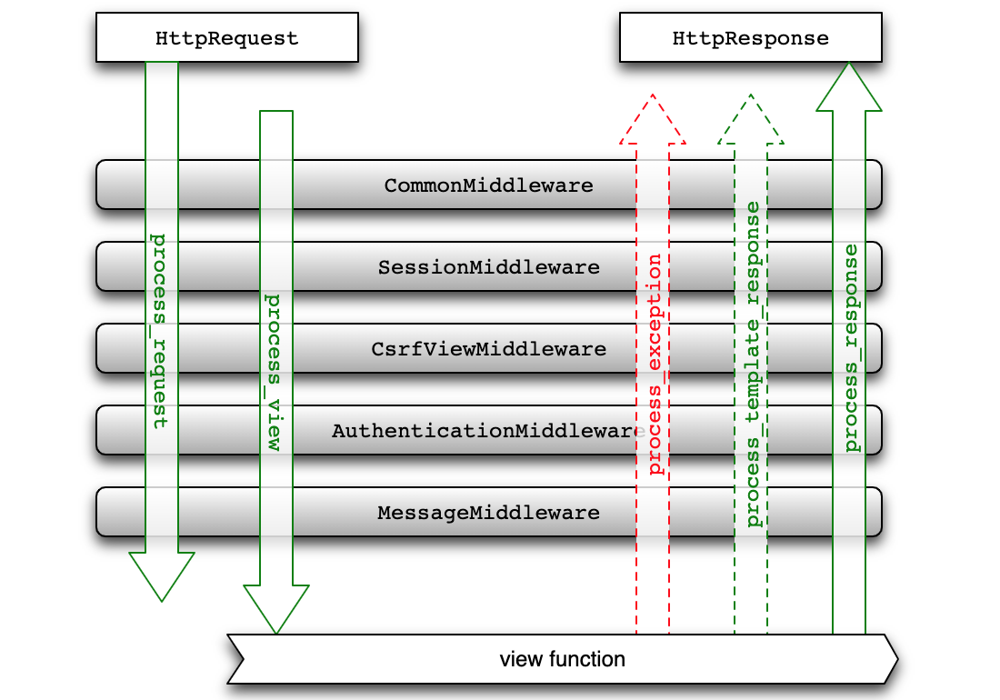

## Middleware Uygulamaları

> **Translated to Turkish by** himmetcanumutlu

Daha önce kullanıcının oy verebilmesi için giriş yapması gerektiği kısıtını gerçekleştirdik; ama yeni bir sorun var. Uygulamamızdaki birçok işlev, kullanıcının önce giriş yapmasını gerektiriyorsa — örneğin önceki Excel raporu dışa aktarma ve istatistik grafiği görüntüleme işlevlerini yalnızca giriş yapan kullanıcıların erişebileceği şekilde kısıtlarsak — her görünüm fonksiyonuna session'da `userid` olup olmadığını kontrol eden kod eklememiz gerekir mi? Cevap hayır; böyle yaparsak görünüm fonksiyonlarımız kaçınılmaz olarak yinelenen kodlarla dolar. Programlama ustası *Martin Fowler* şöyle demiştir: **Kodun birçok kötü kokusu vardır; tekrar en kötüsüdür**. Python programında dekoratörle fonksiyona ek yetenek kazandırabiliriz; Django projesinde kullanıcının giriş yapıp yapmadığını doğrulama gibi yinelenen kodu **middleware**'e koyabiliriz.

### Django Middleware'e Genel Bakış

Middleware, Web uygulamasının istek ve yanıt süreci arasına yerleştirilen bileşendir; tüm Web uygulamasında kesişen filtre rolü oynar; middleware ile istek ve yanıt kesilip filtrelenebilir (basitçe ek işlem yapılır). Genellikle bir middleware bileşeni yalnızca tek bir işi yapmaya odaklanır; örneğin Django framework'ü `SessionMiddleware` ile session desteğini, `AuthenticationMiddleware` ile session'a dayalı istek doğrulamasını gerçekleştirir. Birden çok middleware'i birleştirerek daha karmaşık görevler yapılabilir; Django framework'ü tam da böyle yapar.

Django projesinin yapılandırma dosyası middleware yapılandırmasını içerir; kod aşağıdaki gibidir.

```Python
MIDDLEWARE = [
    'django.middleware.security.SecurityMiddleware',
    'django.contrib.sessions.middleware.SessionMiddleware',
    'django.middleware.common.CommonMiddleware',
    'django.middleware.csrf.CsrfViewMiddleware',
    'django.contrib.auth.middleware.AuthenticationMiddleware',
    'django.contrib.messages.middleware.MessageMiddleware',
    'django.middleware.clickjacking.XFrameOptionsMiddleware',
]
```

Bu middleware'lerin işlevlerini kısaca açıklayalım:

1. `CommonMiddleware` - Temel ayar middleware'i; şu yapılandırma parametrelerini işleyebilir.
   - DISALLOWED_USER_AGENTS - İzin verilmeyen kullanıcı aracıları (tarayıcılar)
   - APPEND_SLASH - `/` eklenip eklenmeyeceği
   - USE_ETAG - Tarayıcı önbelleğiyle ilgili
2. `SecurityMiddleware` - Güvenlikle ilgili middleware; güvenlikle ilgili yapılandırma öğelerini işler.
   - SECURE_HSTS_SECONDS - HTTPS'i zorunlu kılma süresi
   - SECURE_HSTS_INCLUDE_SUBDOMAINS - HTTPS alt alan adlarını kapsar mı
   - SECURE_CONTENT_TYPE_NOSNIFF - Tarayıcının içerik tipini tahmin etmesine izin verilir mi
   - SECURE_BROWSER_XSS_FILTER - Siteler arası betik saldırı filtresi etkinleştirilsin mi
   - SECURE_SSL_REDIRECT - HTTPS bağlantısına yönlendirilsin mi
   - SECURE_REDIRECT_EXEMPT - HTTPS'e yönlendirmeden muaf tutma
3. `SessionMiddleware` - Oturum middleware'i.
4. `CsrfViewMiddleware` - Belirteç üreterek siteler arası istek sahteciliğini önleyen middleware.
5. `XFrameOptionsMiddleware` - İstek başlığı parametresi ayarlayarak tıklama kaçırma saldırısını önleyen middleware.

İstek sürecinde yukarıdaki middleware'ler yazılış sırasına göre yukarıdan aşağıya çalışır, sonra URL çözümleme yapılır ve istek en sonunda görünüm fonksiyonuna ulaşır; yanıt sürecinde yukarıdaki middleware'ler yazılış sırasına göre aşağıdan yukarıya çalışır; istekteki middleware çalışma sırasının tam tersidir.

### Özel Middleware

Django'da middleware'in iki gerçekleme biçimi vardır: sınıf tabanlı ve fonksiyon tabanlı; ikincisi dekoratör yazımına daha yakındır. Dekoratör aslında vekil deseninin uygulamasıdır; kesişen ilgi işlevlerini (normal iş mantığıyla zorunlu ilişkisi olmayan işlevler; kimlik doğrulama, log kaydı, kodlama dönüşümü gibi) vekile koyar; vekil nesne, vekalet edilen nesnenin davranışını tamamlayıp ek işlev ekler. Middleware, kullanıcının istek ve yanıtını kesip filtreleyip ek işlem yapar; bu noktada dekoratörle tamamen aynıdır; bu yüzden fonksiyon tabanlı middleware yazımı dekoratör yazımıyla neredeyse birebir aynıdır. Aşağıda özel middleware ile kullanıcı girişi doğrulamasını gerçekleştirelim.

```Python
"""
middlewares.py
"""
from django.http import JsonResponse
from django.shortcuts import redirect

# Giriş yapılması gereken kaynak yolları
LOGIN_REQUIRED_URLS = {'/praise/', '/criticize/', '/excel/', '/teachers_data/'}


def check_login_middleware(get_resp):

    def wrapper(request, *args, **kwargs):
        # İstenen kaynak yolu yukarıdaki kümede
        if request.path in LOGIN_REQUIRED_URLS:
            # Session'da userid varsa giriş yapılmış sayılır
            if 'userid' not in request.session:
                # Ajax isteği olup olmadığını belirle
                if request.is_ajax():
                    # Ajax isteği, kullanıcıya giriş yapmasını bildiren JSON verisi döndürür
                    return JsonResponse({'code': 10003, 'hint': 'Önce giriş yapın'})
                else:
                    backurl = request.get_full_path()
                    # Ajax olmayan istek doğrudan giriş sayfasına yönlendirilir
                    return redirect(f'/login/?backurl={backurl}')
        return get_resp(request, *args, **kwargs)

    return wrapper
```

Elbette dekoratör işlevi gören bir sınıf da tanımlayabiliriz; sınıfta `__call__` sihirli metodu varsa, bu sınıfın nesnesi fonksiyon gibi çağrılabilir; bu, middleware'i gerçekleştirmenin bir başka yoludur; mantık yukarıdaki kodla tamamen aynıdır.

Bir de sınıf tabanlı middleware gerçekleme biçimi vardır; bu biçim yeni Django sürümlerinde artık önerilmiyor; ancak karşılaşacağınız kodlarda bu yazımı görebilirsiniz; yaklaşık kod aşağıdaki gibidir.

```Python
from django.utils.deprecation import MiddlewareMixin


class MyMiddleware(MiddlewareMixin):

    def process_request(self, request):
        pass

    def process_view(self, request, view_func, view_args, view_kwargs):
        pass

    def process_template_response(self, request, response):
        pass

    def process_response(self, request, response):
        pass

    def process_exception(self, request, exception):
        pass
```

Yukarıdaki sınıftaki beş metot, middleware'in kanca (hook) fonksiyonlarıdır; sırasıyla kullanıcı isteği alındığında, görünüm fonksiyonuna girmeden önce, şablon render edilirken, yanıt döndürülürken ve istisna oluştuğunda geri çağrılır. Elbette bu metotları yazıp yazmamak middleware'in ihtiyacına göre belirlenir; her senaryoda beş metodu da yeniden yazmak gerekmez; aşağıdaki görselin bu yazımı anlamanıza yardımcı olacağına inanıyorum.



Middleware kodunu yazdıktan sonra, middleware'i etkinleştirmek için yapılandırma dosyasını değiştirmek gerekir.

```Python
MIDDLEWARE = [
    'django.middleware.security.SecurityMiddleware',
    'django.contrib.sessions.middleware.SessionMiddleware',
    'django.middleware.common.CommonMiddleware',
    'django.middleware.csrf.CsrfViewMiddleware',
    'django.contrib.auth.middleware.AuthenticationMiddleware',
    'django.contrib.messages.middleware.MessageMiddleware',
    'django.middleware.clickjacking.XFrameOptionsMiddleware',
    'debug_toolbar.middleware.DebugToolbarMiddleware',
    'vote.middlewares.check_login_middleware',
]
```

Yukarıdaki middleware listesindeki elemanların sırasına dikkat edin: kullanıcıdan istek alındığında middleware'ler yukarıdan aşağıya sırayla çalışır; bu middleware'ler çalıştıktan sonra istek en sonunda görünüm fonksiyonuna ulaşır. Elbette bu süreçte kullanıcının isteği kesilebilir; yukarıda özelleştirdiğimiz middleware gibi, kullanıcı giriş yapmadan korunan kaynağa erişirse, middleware isteği doğrudan giriş sayfasına yönlendirir; sonraki middleware'ler ve görünüm fonksiyonu çalışmaz. Kullanıcı isteğini yanıtlama sürecinde yukarıdaki middleware'ler aşağıdan yukarıya sırayla çalışır; böylece yanıta da ek işlem yapabiliriz.

Middleware'in çalışma sırası çok önemlidir; bağımlılık ilişkisi olan middleware'lerde, bağımlı olunan middleware mutlaka ona bağımlı olan middleware'in önüne konmalıdır; tıpkı az önce özelleştirdiğimiz middleware'in `SessionMiddleware`'in arkasına konması gerektiği gibi; çünkü kullanıcının giriş yapıp yapmadığını belirlemek için bu middleware'in isteğe bağladığı `session` nesnesine bağımlıyız.
