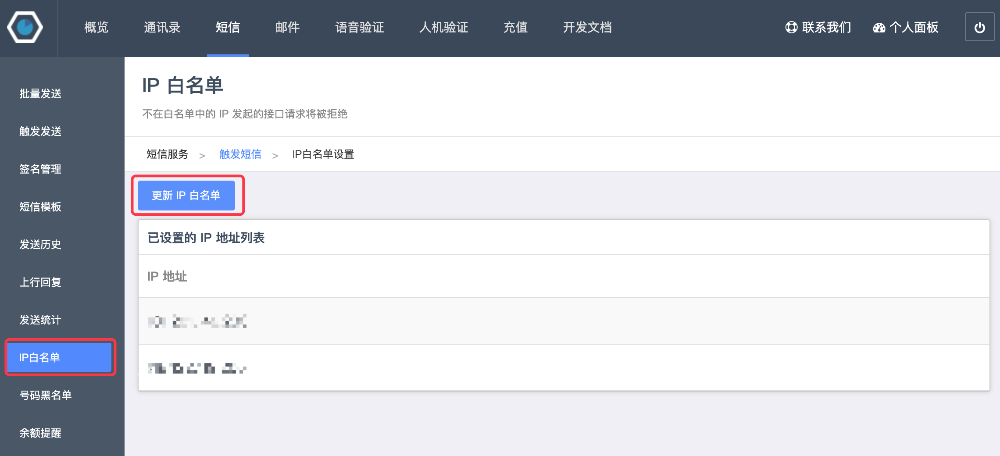
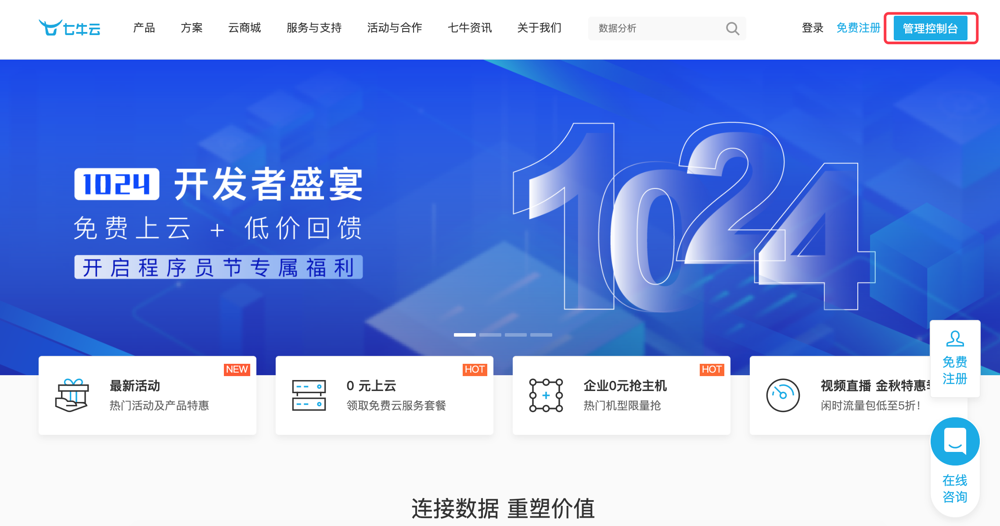
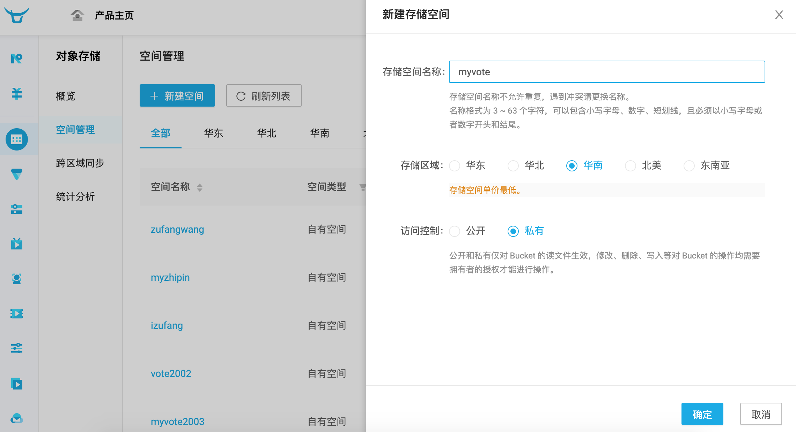

## Üçüncü Taraf Platform Entegrasyonu

> **Translated to Turkish by** himmetcanumutlu

Web uygulaması geliştirme sürecinde, kendi başımıza tamamlayamayacağımız bazı görevler vardır. Örneğin Web projemizde kişisel veya kurumsal gerçek ad doğrulaması yapmamız gerekebilir; kullanıcının verdiği kimlik bilgisinin gerçekliğini doğrulama yeteneğimiz olmadığı açıktır; bu durumda işlemi üçüncü taraf platformun sunduğu hizmetle yaparız. Bir örnek daha: projemizde çevrimiçi ödeme işlevi sunmamız gerekebilir; bu tür işler de genellikle kendimiz gerçeklemek yerine ödeme ağ geçidiyle yapılır; yalnızca WeChat, Alipay, UnionPay gibi üçüncü taraf platformlara bağlanmamız yeterlidir.

Projeye üçüncü taraf platform bağlamanın temelde iki yolu vardır: API entegrasyonu ve SDK entegrasyonu.

1. API entegrasyonu, üçüncü tarafın sunduğu URL'e erişerek işlem yapmak veya veri almaktır. Çin'de bu tür birçok platform çok sayıda yaygın hizmet sunar; örneğin [聚合数据](https://www.juhe.cn/) üzerinde yaşam hizmeti, finans teknolojisi, ulaşım-coğrafya, kontör yükleme gibi çeşitli API'ler vardır. Python programıyla ağ isteği atıp URL'e erişerek veri alabiliriz; bu API arayüzleri projemizdeki veri arayüzleriyle aynıdır; yalnızca projemizdeki API'ler kendimiz içindir, bu tür üçüncü taraf platformların sunduğu API'ler ise açıktır. Elbette açık olması ücretsiz olduğu anlamına gelmez; ticari değer taşıyan veri sunan API'lerin çoğu ücretlidir.
2. SDK entegrasyonu, üçüncü taraf kütüphane kurup o kütüphanenin kapsüllediği sınıf ve fonksiyonlarla üçüncü taraf platformun hizmetini kullanmaktır. Örneğin az önce sözünü ettiğimiz Alipay'e bağlanmak için önce Alipay'in SDK'sını kurup sonra Alipay'in kapsüllediği sınıf ve metotlarla ödeme hizmeti çağrısı yapılır.

Aşağıda somut örneklerle üçüncü taraf platforma nasıl bağlanılacağını anlatıyoruz.

### SMS Ağ Geçidine Bağlanma

Bir Web projesinde SMS hizmetinin kullanılabileceği birçok yer vardır: telefon doğrulama koduyla giriş, önemli mesaj bildirimi, ürün pazarlama SMS'i gibi. SMS gönderme işlevini gerçekleştirmek için SMS ağ geçidine bağlanılabilir; Çin'de tanınan SMS ağ geçitleri: Yunpian, NetEase Yunxin, Luosimao, SendCloud gibi; bu ağ geçitleri genellikle ücretsiz deneme sunar. Aşağıda [Luosimao](https://luosimao.com/) platformu örneğiyle projeye SMS ağ geçidinin nasıl bağlanacağını anlatıyoruz; diğer platformlar benzerdir.

1. Hesap açın; yeni kullanıcılar ücretsiz deneyebilir.

2. Yönetim paneline giriş yapıp SMS bölümüne girin.

3. "Tetikleyerek gönder"e tıklayıp kendinize özel API Key'i (kimlik) bulun.

    

4. "İmza yönetimi"ne tıklayıp SMS imzası ekleyin; SMS'ler imza taşımalıdır; ücretsiz deneme SMS'lerinde "【Test】" imzasını eklemek gerekir; aksi halde SMS gönderilemez.

    

5. "IP beyaz listesi"ne tıklayıp Django projesini çalıştıran sunucunun adresini (genel IP adresi; yerel çalıştırmada [xxx]() sitesini açıp kendi genel IP adresinize bakabilirsiniz) beyaz listeye ekleyin; aksi halde SMS gönderilemez.

    

6. Kalan SMS yoksa "Kontör yükleme" sayfasından "SMS hizmeti"ni seçip kontör yükleyin.

    

Şimdi Luosimao SMS ağ geçidini çağırıp SMS doğrulama kodu gönderme işlevini gerçekleştirelim; kod aşağıdaki gibidir.

```Python
def send_mobile_code(tel, code):
    """SMS doğrulama kodu gönderir"""
    resp = requests.post(
        url='http://sms-api.luosimao.com/v1/send.json',
        auth=('api', 'key-kendi-APIKey'),
        data={
            'mobile': tel,
            'message': f'SMS doğrulama kodunuz {code}; kimseye söylemeyin. 【Python Dersi】'
        },
        verify=False
    )
    return resp.json()
```

Yukarıdaki kodu çalıştırmak için önce `requests` üçüncü taraf kütüphanesini kurmak gerekir; bu kütüphane HTTP ağ isteğiyle ilgili işlevleri kapsüller; kullanımı çok basittir; daha önceki içerikte bu kütüphaneden söz etmiştik. `send_mobile_code` fonksiyonunun iki parametresi vardır: birincisi telefon numarası, ikincisi SMS doğrulama kodunun içeriği; 5. satırda kendi API Key'inizi vermelisiniz; yani yukarıdaki 2. adımda gördüğünüz kendi API Key'iniz. Luosimao SMS ağ geçidine yapılan istek JSON biçiminde veri döndürür; yukarıdaki kod için `{'err': 0, 'msg': 'ok'}` dönerse SMS başarıyla gönderilmiş demektir; `err` alanının değeri `0` değil de başka bir değerse SMS gönderilememiştir; Luosimao'nun resmî [geliştirici dokümanı](https://luosimao.com/docs/api/) sayfasında farklı sayıların anlamı görülebilir; örneğin `-20` bakiye yetersiz, `-32` SMS imzası eksik demektir.

Görünüm fonksiyonunda yukarıdaki fonksiyonu çağırıp SMS doğrulama kodu gönderme işlevini tamamlayabiliriz; birazdan bu işlevi kullanıcı kaydıyla birleştirebiliriz.

Rastgele doğrulama kodu üreten ve telefon numarasını doğrulayan fonksiyonlar.

```Python
import random
import re

TEL_PATTERN = re.compile(r'1[3-9]\d{9}')


def check_tel(tel):
    """Telefon numarasını kontrol eder"""
    return TEL_PATTERN.fullmatch(tel) is not None


def random_code(length=6):
    """Rastgele SMS doğrulama kodu üretir"""
    return ''.join(random.choices('0123456789', k=length))
```

SMS doğrulama kodu gönderen görünüm fonksiyonu.

```Python
@api_view(('GET', ))
def get_mobilecode(request, tel):
    """SMS doğrulama kodunu alır"""
    if check_tel(tel):
        redis_cli = get_redis_connection()
        if redis_cli.exists(f'vote:block-mobile:{tel}'):
            data = {'code': 30001, 'message': 'Lütfen 60 saniye içinde tekrar SMS doğrulama kodu göndermeyin'}
        else:
            code = random_code()
            send_mobile_code(tel, code)
            # Redis ile 60 saniye içinde tekrar SMS doğrulama kodu gönderilmesini engelle
            redis_cli.set(f'vote:block-mobile:{tel}', 'x', ex=60)
            # Doğrulama kodunu Redis'te 10 dakika tutar (geçerlilik 10 dakika)
            redis_cli.set(f'vote2:valid-mobile:{tel}', code, ex=600)
            data = {'code': 30000, 'message': 'SMS doğrulama kodu gönderildi, teslim alınız'}
    else:
        data = {'code': 30002, 'message': 'Geçerli bir telefon numarası girin'}
    return Response(data)
```

> **Not**: Yukarıdaki kod Redis ile iki ek işlev gerçekleştirir: biri kullanıcının 60 saniye içinde tekrar SMS doğrulama kodu göndermesini engellemek, diğeri kullanıcının SMS doğrulama kodunu 10 dakika saklamak; yani bu doğrulama kodunun geçerliliği yalnızca 10 dakikadır; kullanıcıdan kayıt sırasında bu kodu verip telefonun gerçekliğini doğrulamasını isteyebiliriz.

### Bulut Depolama Hizmetine Bağlanma

**Bulut depolama** dediğimizde, genellikle veriyi üçüncü tarafın sunduğu sanal sunucu ortamında saklamayı kastediyoruz; basitçe bazı veri veya kaynakları üçüncü taraf platforma emanet etmektir. Genellikle bulut depolama hizmeti veren şirketler büyük veri merkezleri işletir; bulut depolama ihtiyacı olan kişi veya kuruluşlar, depolama alanı satın alıp veya kiralayıp veri depolama ihtiyacını karşılar. Web uygulaması geliştirirken statik kaynakları, özellikle kullanıcının yüklediği statik kaynakları doğrudan bulut depolama hizmetine koyabiliriz; bulut depolama genellikle kullanıcının bu statik kaynağa erişebileceği ilgili URL'i sunar. Yurt içinde ve dışında tanınan bulut depolama hizmetleri (Amazon S3, Alibaba OSS2 gibi) genellikle uygun fiyatlıdır; kendi statik kaynak sunucumuzu kurmaya kıyasla bulut depolamanın maliyeti daha düşüktür; ayrıca genel bulut depolama platformları statik kaynağa erişimi hızlandırmak için CDN hizmeti de sunar; bu yüzden hangi açıdan bakarsanız bakın, Web uygulamasının verisini ve statik kaynaklarını bulut depolamayla yönetmek çok iyi bir seçimdir; bu kaynaklar kişisel veya ticari gizlilik içermiyorsa bulut depolamaya emanet edilebilir.

Aşağıda [Qiniu Cloud](https://www.qiniu.com/)'a bağlanma örneğiyle, kullanıcının yüklediği dosyanın Qiniu Cloud depolamaya nasıl kaydedileceğini anlatıyoruz. Qiniu Cloud, Çin'de tanınan bir bulut bilişim ve veri hizmeti sağlayıcısıdır; Qiniu Cloud; devasa dosya depolama, CDN, video isteğe bağlı oynatma, etkileşimli canlı yayın ve büyük ölçekli heterojen verinin akıllı analizi ve işlenmesi gibi alanlarda ürünlere sahiptir; ücretli olmayan kullanıcılar da ücretsiz bağlanıp hizmet kullanabilir. Qiniu Cloud'a bağlanma akışı şöyledir:

1. Hesap açıp yönetim konsoluna giriş yapın.

    

2. Soldaki menüden nesne depolamayı seçin.

    

3. Alan yönetiminde yeni alan oluşturun (örneğin: myvote); alan adının dolu olduğu belirtilirse başka bir ad deneyin. Dikkat: alan oluşturulduktan sonra özel alan adı bağlamanız istenir; henüz kendi alan adınız yoksa Qiniu Cloud'un sunduğu geçici alan adını kullanabilirsiniz; ancak geçici alan adı 30 gün sonra geri alınır; bu yüzden kendi alan adınızı hazırlamanız iyi olur (alan adı için kayıt gerekir; nasıl yapılacağını bilmiyorsanız ilgili kaynaklara bakın).

    

4. Sayfanın sağ üst köşesindeki kişisel avatarda "Anahtar yönetimi"ne tıklayıp kendi anahtarınızı görüntüleyin; birazdan kodda kullanıcı kimliğini doğrulamak için AK (AccessKey) ve SK (SecretKey) anahtarlarını kullanacağız.

    

5. Sayfanın üst menüsündeki "Doküman"a tıklayıp [Qiniu Geliştirici Merkezi](https://developer.qiniu.com/)ne girin; gezinme menüsünden "SDK & Araçlar"ı seçip "Resmî SDK" alt menüsüne tıklayın; Python'ı (sunucu tarafı) bulup "Doküman"a tıklayarak resmî dokümanı görüntüleyin.

    

Şimdi resmî dokümandaki örneği kurarak Qiniu Cloud'a bağlanıp onun bulut depolama ve diğer hizmetlerini kullanabiliriz. Önce aşağıdaki komutla Qiniu Cloud üçüncü taraf kütüphanesini kurun.

```Bash
pip install qiniu
```

Ardından `qiniu` modülündeki `put_file` ve `put_stream` fonksiyonlarıyla dosya yükleme yapılır; birincisi belirtilen yoldaki dosyayı yükler, ikincisi bellekteki ikili veriyi Qiniu Cloud'a yükler; somut kod aşağıdaki gibidir.

```Python
import qiniu

AUTH = qiniu.Auth('Anahtar yönetimindeki AccessKey', 'Anahtar yönetimindeki SecretKey')
BUCKET_NAME = 'myvote'


def upload_file_to_qiniu(key, file_path):
    """Belirtilen yoldaki dosyayı Qiniu Cloud'a yükler"""
    token = AUTH.upload_token(BUCKET_NAME, key)
    return qiniu.put_file(token, key, file_path)


def upload_stream_to_qiniu(key, stream, size):
    """İkili veri akışını Qiniu Cloud'a yükler"""
    token = AUTH.upload_token(BUCKET_NAME, key)
    return qiniu.put_stream(token, key, stream, None, size)
```

Aşağıda basit bir dosya yükleme ön yüz sayfası yer alır.

```HTML
<!DOCTYPE html>
<html lang="en">
<head>
    <meta charset="UTF-8">
    <title>Dosya Yükle</title>
</head>
<body>
    <form action="/upload/" method="post" enctype="multipart/form-data">
        <div>
            <input type="file" name="photo">
            <input type="submit" value="Yükle">
        </div>
    </form>
</body>
</html>
```

> **Not**: Ön yüzde form ile dosya yükleme yapılıyorsa, formun method özelliği post, enctype özelliği multipart/form-data olmalıdır; formdaki type özelliği file olan input etiketi, yüklenecek dosyanın dosya seçicisidir.

Yükleme işlevini gerçekleştiren görünüm fonksiyonu aşağıdaki gibidir.

```Python
from django.views.decorators.csrf import csrf_exempt


@csrf_exempt
def upload(request):
    # Yüklenen dosya 2.5M'den küçükse photo nesnesinin tipi InMemoryUploadedFile'dır, dosya bellekte
    # Yüklenen dosya 2.5M'yi aşarsa photo nesnesinin tipi TemporaryUploadedFile'dır, dosya geçici yolda
    photo = request.FILES.get('photo')
    _, ext = os.path.splitext(photo.name)
    # UUID ve asıl dosyanın uzantısıyla benzersiz yeni dosya adı üretir
    filename = f'{uuid.uuid1().hex}{ext}'
    # Bellekteki dosya için yukarıda kapsüllediğimiz upload_stream_to_qiniu ile Qiniu Cloud'a yüklenebilir
    # Dosya geçici yolda saklanıyorsa upload_file_to_qiniu ile yükleme yapılır
    upload_stream_to_qiniu(filename, photo.file, photo.size)
    return redirect('/static/html/upload.html')
```

> **Dikkat**: Yukarıdaki görünüm fonksiyonu `csrf_exempt` dekoratörünü kullanır; bu dekoratör formun CSRF belirteci sağlama zorunluluğundan muaf olmasını sağlar. Ayrıca kodun 11. satırı, evrensel benzersiz tanımlayıcı üretmek için `uuid` modülünün `uuid1` fonksiyonunu kullanır.

Projeyi çalıştırıp dosya yükleme işlevini deneyin; dosya başarıyla yüklendikten sonra Qiniu Cloud "Alan yönetimi"nde kendi alanınıza tıklayıp "Dosya yönetimi" arayüzüne girin; burada az önce yüklediğimiz dosyayı görebilir ve Qiniu Cloud'un sunduğu alan adıyla dosyaya erişebilirsiniz.


