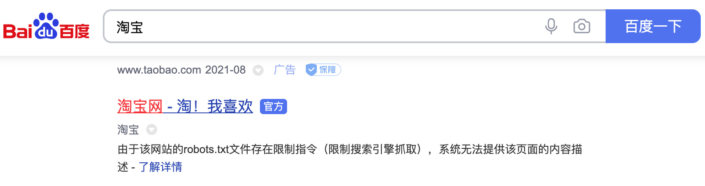
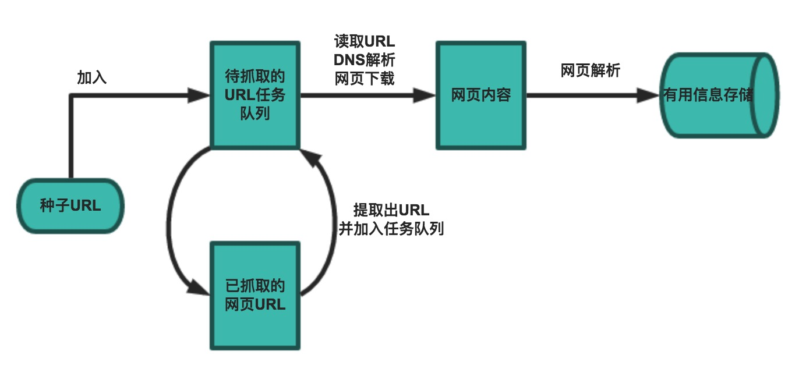

## Ağdan Veri Toplamaya Genel Bakış

> **Translated to Turkish by** himmetcanumutlu

Tarayıcı (crawler), sıkça ağ örümceği (spider) olarak da adlandırılır; belirli kurallara göre web sitelerini otomatik gezip ihtiyaç duyulan bilgiyi toplayan robot programıdır (otomasyon betik kodu); internet arama motorlarında ve veri toplamada yaygın kullanılır. İnternet ve tarayıcı kullanmış herkes bilir ki web sayfalarında, kullanıcının okuduğu metin bilgisinin yanı sıra bazı hiper bağlantılar da vardır; ağ tarayıcı tam da web sayfasındaki hiper bağlantı bilgisiyle, ağdaki diğer sayfaların adresini sürekli elde edip veri toplamaya devam eder. Bu yüzden ağdan veri toplama süreci, ağda dolaşan bir tarayıcı veya örümcek gibidir; bu yüzden mecazi olarak tarayıcı veya ağ örümceği denir.

### Tarayıcının Uygulama Alanları

İdeal durumda tüm ICP'ler (İnternet İçerik Sağlayıcı), diğer programların veri almasına izin verdikleri API arayüzlerini sunar; bu durumda tarayıcı programına hiç gerek kalmaz. Çin'de tanınan e-ticaret platformları (Taobao, JD gibi) ve sosyal platformlar (Weibo, WeChat gibi) kendi API arayüzlerini sunar; ancak bu tür API arayüzleri genellikle toplanabilecek veriyi ve toplama sıklığını kısıtlar. Çoğu şirket için sektör verisini ve rakip verisini zamanında almak, kurumsal hayatta kalmanın önemli halkalarından biridir; ancak çoğu işletme için veri, doğuştan gelen bir zayıflıktır. Bu durumda tarayıcıyı makul biçimde kullanıp veri toplamak ve içinden ticari değer taşıyan bilgiyi çıkarmak, bu işletmeler için hayati önem taşır.

Tarayıcının uygulama alanları aslında çok geniştir; aşağıda bir kısmını listeledik; merak edenler kendileri keşfedebilir.

1. Arama motoru
2. Haber toplama
3. Sosyal uygulama
4. Kamuoyu izleme
5. Sektör verisi

### Tarayıcının Yasal Boyutu

Sıkça duyarız: "Tarayıcı iyi yazılırsa, hapishanede tok tutar"; peki tarayıcı programı yazmak yasa dışı mıdır? Bu soruyu birkaç açıdan ele alabiliriz.

1. Ağ tarayıcı alanı henüz öncü bir aşamadadır; internet dünyası kendi oyun kurallarıyla belirli bir etik norm (Robots protokolü; tam adı "Ağ Tarayıcı Dışlama Standardı") oluştursa da, hukuki kısmı hâlâ kurulma ve olgunlaşma sürecindedir; yani bu alan şimdilik gri bir bölgedir.
2. "Yasaklanmayan şey serbesttir"; tarayıcı, tarayıcı gibi ön yüzde gösterilen veriyi (web sayfasındaki herkese açık bilgi) alıyorsa ve sitenin arka planındaki gizli, hassas bilgiyi almıyorsa, yasa ve yönetmelik kısıtından pek endişe etmeye gerek yoktur; çünkü şu anda büyük veri endüstri zincirinin gelişme hızı, hukukun olgunlaşma hızını çok aşmıştır.
3. Siteyi tararken, tarayıcınızın Robots protokolüne uymasını sağlamalı ve tarayıcı programının veri toplama hızını kontrol etmelisiniz; veriyi kullanırken sitenin fikri mülkiyetine saygı göstermelisiniz (Web 2.0 çağından beri web'deki verinin çoğu kullanıcılar tarafından sağlansa da, site platformu operasyon maliyetine katlanmıştır; kullanıcı kayıt olup içerik yayımlarken platform genellikle verinin sahipliğini, kullanım ve dağıtım hakkını elde etmiştir). Bu kuralları ihlal ederseniz, dava açıldığında kaybetme olasılığınız oldukça yüksektir.
4. Tarayıcı programı yazarken kimliğinizi uygun biçimde gizlemek gereklidir ve karşı tarafın, tarayıcınızın başkalarının taşınır malına (örneğin sunucu) zarar verdiğine dair kanıt sunamaması en iyisidir.
5. Tarayıcı kodunuzu genel ağda (kod barındırma platformu gibi) açık kaynak yapmayın veya sergilemeyin; bu davranışlar genellikle gereksiz sıkıntı getirir.

#### Robots Protokolü

Çoğu site bir `robots.txt` dosyası tanımlar; bu bir centilmenlik protokolüdür; tüm tarayıcıların uymak zorunda olduğu bir oyun kuralı değildir. Aşağıda Taobao'nun [`robots.txt`](http://www.taobao.com/robots.txt) dosyası örneğiyle Taobao'nun tarayıcılara ne gibi kısıtlar getirdiğine bakalım.

```
User-agent: Baiduspider
Disallow: /

User-agent: baiduspider
Disallow: /
```

Yukarıdaki dosyadan görülebileceği gibi Taobao, Baidu tarayıcısının kaynaklarını taramasını yasaklar; bu yüzden Baidu'da "Taobao" aradığınızda sonuçların altında şu görünür: "Bu sitenin `robots.txt` dosyasında kısıtlama komutu bulunduğundan (arama motorunun taraması kısıtlanmış), sistem bu sayfanın içerik açıklamasını sağlayamıyor". Baidu bir arama motoru olarak en azından görünüşte Taobao'nun `robots.txt` protokolüne uyar; bu yüzden kullanıcılar Baidu'dan Taobao'nun iç ürün bilgisini arayamaz.

Şekil 1. Baidu'da Taobao arama sonucu



Aşağıda Douban'ın [`robots.txt`](https://www.douban.com/robots.txt) dosyası var; kendiniz yorumlayıp ne gibi kısıtlar getirdiğine bakabilirsiniz.

```
User-agent: *
Disallow: /subject_search
Disallow: /amazon_search
Disallow: /search
Disallow: /group/search
Disallow: /event/search
Disallow: /celebrities/search
Disallow: /location/drama/search
Disallow: /forum/
Disallow: /new_subject
Disallow: /service/iframe
Disallow: /j/
Disallow: /link2/
Disallow: /recommend/
Disallow: /doubanapp/card
Disallow: /update/topic/
Disallow: /share/
Allow: /ads.txt
Sitemap: https://www.douban.com/sitemap_index.xml
Sitemap: https://www.douban.com/sitemap_updated_index.xml
# Crawl-delay: 5

User-agent: Wandoujia Spider
Disallow: /

User-agent: Mediapartners-Google
Disallow: /subject_search
Disallow: /amazon_search
Disallow: /search
Disallow: /group/search
Disallow: /event/search
Disallow: /celebrities/search
Disallow: /location/drama/search
Disallow: /j/
```

### Hiper Metin Aktarım Protokolü (HTTP)

Tarayıcıyı anlatmaya başlamadan önce Hiper Metin Aktarım Protokolü'nü (HTTP) kısaca gözden geçirelim; çünkü web sayfasında gördüğümüz içerik genellikle tarayıcının HTML'i (Hiper Metin İşaretleme Dili) çalıştırması sonucudur; HTTP ise HTML verisini aktaran protokoldür. HTTP, diğer birçok uygulama düzeyi protokol gibi TCP (Aktarım Kontrol Protokolü) üzerine kuruludur; TCP'nin sunduğu güvenilir aktarım hizmetini kullanarak Web uygulamalarında veri alışverişini gerçekleştirir. Vikipedi'deki açıklamaya göre HTTP'yi tasarlamanın asıl amacı, [HTML](https://zh.wikipedia.org/wiki/HTML) sayfalarını yayımlayıp almak için bir yöntem sunmaktır; yani bu protokol, tarayıcı ile Web sunucusu arasında aktarılan verinin taşıyıcısıdır. HTTP'nin ayrıntıları ve güncel durumu hakkında [《HTTP Protokolüne Giriş》](http://www.ruanyifeng.com/blog/2016/08/http.html), [《İnternet Protokolüne Giriş》](http://www.ruanyifeng.com/blog/2012/05/internet_protocol_suite_part_i.html), [《HTTPS Protokolünü Anlamak》](http://www.ruanyifeng.com/blog/2014/09/illustration-ssl.html) gibi yazıları okuyabilirsiniz.

Aşağıdaki görsel, Sichuan İl Ağ İletişim Teknolojisi Anahtar Laboratuvarı'nda çalışırken açık kaynak protokol analiz aracı Ethereal (WireShark'ın öncülü) ile Baidu ana sayfasına erişirken yakalanan HTTP istek ve yanıt paketleridir (protokol verisi); Ethereal ağ adaptöründen geçen veriyi yakaladığından, fiziksel bağlantı katmanından uygulama katmanına kadar protokol verisi net görülür.

Şekil 2. HTTP isteği


HTTP isteği genellikle istek satırı, istek başlığı, boş satır ve mesaj gövdesi olmak üzere dört kısımdan oluşur; sunucuya gönderilecek veri yoksa mesaj gövdesi zorunlu değildir. İstek satırında istek metodu (GET, POST gibi; aşağıdaki tabloda), kaynak yolu ve protokol sürümü bulunur; istek başlığı, tarayıcı, kodlama biçimi, tercih edilen dil, önbellek stratejisi gibi bilgileri içeren birkaç anahtar-değer çiftinden oluşur; istek başlığının ardından boş satır ve mesaj gövdesi gelir.


Şekil 3. HTTP yanıtı


HTTP yanıtı genellikle yanıt satırı, yanıt başlığı, boş satır ve mesaj gövdesi olmak üzere dört kısımdan oluşur; mesaj gövdesi sunucunun yanıt verdiği veridir; HTML sayfası olabileceği gibi JSON veya ikili veri de olabilir. Yanıt satırında protokol sürümü ve yanıt durum kodu bulunur; yanıt durum kodunun birçok türü vardır; yaygın olanlar aşağıdaki tablodadır.


#### İlgili Araçlar

Önce tarayıcı programı geliştirmeye yardımcı bazı yardımcı araçları tanıtalım; bu araçların size yarı yarıya kolaylık sağlayacağına inanıyoruz.

1. Chrome Developer Tools: Google Chrome tarayıcısının yerleşik geliştirici aracı. Bu aracın en sık kullanılan işlev modülleri:

   - Öğeler (Elements): HTML öğelerinin özniteliklerini, CSS özelliklerini görüntülemek veya değiştirmek, olayları dinlemek için kullanılır. CSS anında değiştirilip anında gösterilir; geliştiricinin sayfa hata ayıklamasını büyük ölçüde kolaylaştırır.
   - Konsol (Console): Tek seferlik kod çalıştırmak, JavaScript nesnelerini görüntülemek, hata ayıklama log bilgisini veya istisna bilgisini görmek için kullanılır. Konsol aslında JavaScript kodu çalıştıran etkileşimli bir ortamdır.
   - Kaynak (Sources): Sayfanın HTML kaynak kodunu, JavaScript kaynak kodunu, CSS kaynak kodunu görüntülemek için kullanılır; ayrıca en önemlisi JavaScript kaynak kodunu hata ayıklamak, koda kesme noktası eklemek ve adım adım çalıştırmaktır.
   - Ağ (Network): HTTP isteği, HTTP yanıtı ve ağ bağlantısıyla ilgili bilgiler içindir.
   - Uygulama (Application): Tarayıcının yerel depolamasını, arka plan görevlerini görüntülemek içindir; yerel depolama başlıca Cookie, Local Storage, Session Storage içerir.

   

2. Postman: Güçlü bir web hata ayıklama ve RESTful istek aracı. Postman isteği simüle etmemize yardımcı olur; isteğimizi özelleştirmeyi ve sunucunun yanıtını görüntülemeyi çok kolaylaştırır.

   

3. HTTPie: Komut satırı HTTP istemcisi.

   Kurulum.

   ```Bash
   pip install httpie
   ```

   Kullanım.

   ```Bash
   http --header http --header https://movie.douban.com/
   
   HTTP/1.1 200 OK
   Connection: keep-alive
   Content-Encoding: gzip
   Content-Type: text/html; charset=utf-8
   Date: Tue, 24 Aug 2021 16:48:00 GMT
   Keep-Alive: timeout=30
   Server: dae
   Set-Cookie: bid=58h4BdKC9lM; Expires=Wed, 24-Aug-22 16:48:00 GMT; Domain=.douban.com; Path=/
   Strict-Transport-Security: max-age=15552000
   Transfer-Encoding: chunked
   X-Content-Type-Options: nosniff
   X-DOUBAN-NEWBID: 58h4BdKC9lM
   ```

4. `builtwith` kütüphanesi: Sitenin kullandığı teknolojiyi tanıyan araç.

   Kurulum.

   ```Bash
   pip install builtwith
   ```

   Kullanım.

   ```Python
   import ssl
   
   import builtwith
   
   ssl._create_default_https_context = ssl._create_unverified_context
   print(builtwith.parse('http://www.bootcss.com/'))
   ```

5. `python-whois` kütüphanesi: Site sahibini sorgulayan araç.

   Kurulum.

   ```Bash
   pip3 install python-whois
   ```

   Kullanım.

   ```Python
   import whois
   
   print(whois.whois('https://www.bootcss.com'))
   ```

### Tarayıcının Temel Çalışma Akışı

Temel bir tarayıcı genellikle veri toplama (web sayfası indirme), veri işleme (web sayfası ayrıştırma) ve veri depolama (faydalı bilgiyi kalıcılaştırma) olmak üzere üç kısımdan oluşur; elbette daha ileri tarayıcılar veri toplama ve işlemede eş zamanlı programlama veya dağıtık teknoloji kullanır; bu da zamanlayıcı (iş parçacığı veya süreci ilgili görevi çalıştırmak üzere düzenleme), arka plan yönetim programı (tarayıcının çalışma durumunu izleme ve veri toplama sonucunu kontrol etme) gibi bileşenlerin katılımını gerektirir.



Genel olarak tarayıcının çalışma akışı şu adımları içerir:

1. Toplama hedefini (tohum sayfa / başlangıç sayfası) belirleyip web sayfasını alın.
2. Sunucuya erişilemediğinde, belirtilen yeniden deneme sayısına göre sayfayı yeniden indirmeyi deneyin.
3. Gerektiğinde kullanıcı aracısını ayarlayın veya gerçek IP'yi gizleyin; aksi halde sayfaya erişilemeyebilir.
4. Alınan sayfaya gerekli kod çözme işlemini uygulayıp ihtiyaç duyulan bilgiyi çıkarın.
5. Alınan sayfada bir şekilde (düzenli ifade gibi) sayfadaki bağlantı bilgisini çıkarın.
6. Bağlantıyı daha fazla işleyin (sayfayı alıp yukarıdaki işlemi tekrarlayın).
7. Faydalı bilgiyi sonraki işlemler için kalıcılaştırın.
