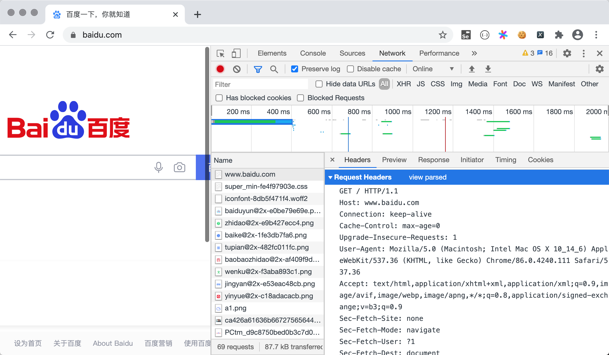
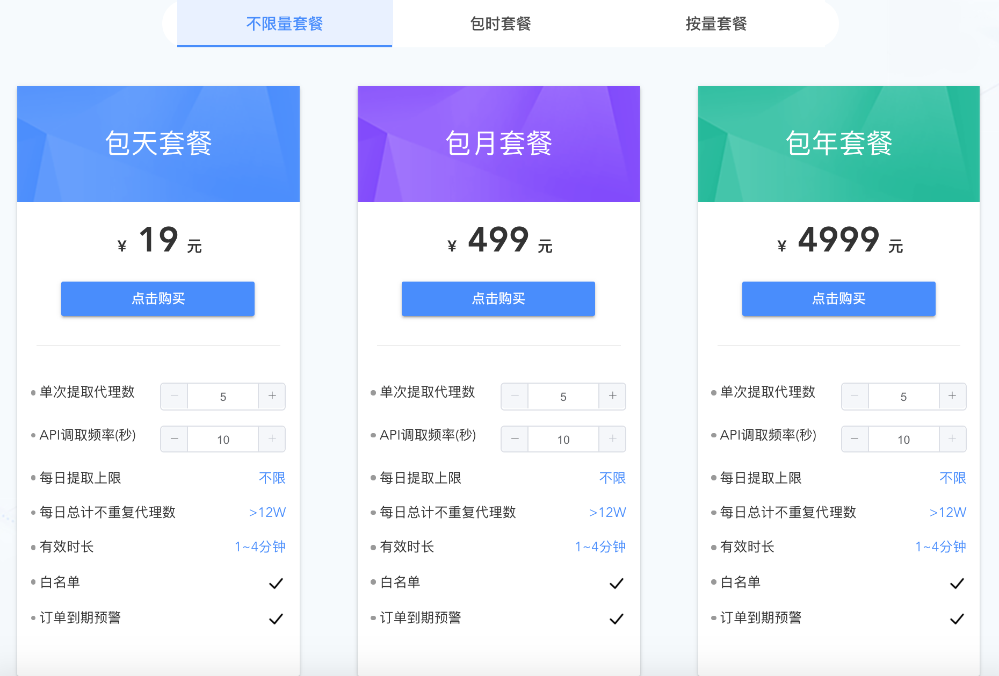

## Python ile Ağ Verisi Alma

> **Translated to Turkish by** himmetcanumutlu

Ağdan veri toplama, Python dilinin çok başarılı olduğu bir alandır; bir önceki derste ağdan veri toplama işlemini gerçekleştiren programa genellikle ağ tarayıcı veya örümcek programı dendiğini söylemiştik. Büyük veri çağında bile veri, küçük ve orta ölçekli işletmeler için hâlâ zor bir nokta ve zayıflıktır; bazı veriler açık veya ücretli veri arayüzleriyle elde edilir; diğer sektör verisi ve rakip verisi ise ağdan veri toplamayla elde edilmelidir. Ağ veri kaynağını hangi yöntemle alırsanız alın, Python dili çok iyi bir seçimdir; çünkü Python'un standart kütüphanesi ve üçüncü taraf kütüphaneleri ağdan veri toplamaya iyi destek sunar.

### requests Kütüphanesi

Python ile ağ verisi almak için `requests` adlı üçüncü taraf kütüphaneyi kullanmanızı öneririz; bu kütüphaneyi önceki derslerde aslında kullanmıştık. Resmî sitenin açıklamasına göre `requests`, Python standart kütüphanesini kapsüller; HTTP veya HTTPS üzerinden ağ kaynağına erişim işlemini basitleştirir. Derste HTTP'nin istek-yanıt tipi bir protokol olduğunu söylemiştik; tarayıcıya doğru [URL](https://developer.mozilla.org/zh-CN/docs/Learn/Common_questions/What_is_a_URL)i (genellikle web adresi denir) yazıp Enter'a bastığımızda, ağdaki [Web sunucusuna](https://developer.mozilla.org/zh-CN/docs/Learn/Common_questions/What_is_a_web_server) bir HTTP isteği göndeririz; sunucu isteği aldıktan sonra bize bir HTTP yanıtı verir. Chrome tarayıcısının menüsünden "Geliştirici araçları"nı açıp "Network" sekmesine geçerek HTTP istek ve yanıtının neye benzediğini görebilirsiniz; aşağıdaki gibidir.



`requests` kütüphanesiyle Python programının tarayıcı gibi Web sunucusuna istek atmasını ve sunucunun döndürdüğü yanıtı almasını sağlayabiliriz; yanıttan istediğimiz veriyi çıkarabiliriz. Tarayıcının bize sunduğu web sayfası [HTML](https://developer.mozilla.org/zh-CN/docs/Web/HTML) ile yazılır; tarayıcı HTML'in yorumlayıcı ortamı gibidir; gördüğümüz sayfadaki içerik HTML etiketlerinde bulunur. HTML kodunu aldıktan sonra, etiketin özniteliğinden veya etiket gövdesinden içerik çıkarabiliriz. Aşağıdaki örnek web sayfasının HTML kodunun nasıl alınacağını gösterir; `requests` kütüphanesinin `get` fonksiyonuyla Sohu ana sayfasının kodunu alırız.

```Python
import requests

resp = requests.get('https://www.sohu.com/')
if resp.status_code == 200:
    print(resp.text)
```

> **Not**: Yukarıdaki koddaki `resp` değişkeni bir `Response` nesnesidir (`requests` kütüphanesinin kapsüllediği tip); bu nesnenin `status_code` özelliğiyle yanıt durum kodu alınır; `text` özelliği sayfanın HTML kodunu almamıza yardımcı olur.

`Response` nesnesinin `text` özelliği bir string olduğundan, daha önce anlattığımız düzenli ifade bilgisini kullanarak sayfanın HTML kodundan haber başlığını ve bağlantısını çıkarabiliriz; kod aşağıdaki gibidir.

```Python
import re

import requests

pattern = re.compile(r'<a.*?href="(.*?)".*?title="(.*?)".*?>')
resp = requests.get('https://www.sohu.com/')
if resp.status_code == 200:
    all_matches = pattern.findall(resp.text)
    for href, title in all_matches:
        print(href)
        print(title)
```

Metin içeriği dışında, `requests` kütüphanesiyle URL üzerinden ikili kaynak da alınabilir. Aşağıdaki örnek Baidu logosunun nasıl alınıp `baidu.png` adlı yerel dosyaya kaydedileceğini gösterir. Baidu ana sayfasında logo üzerine sağ tıklayıp "Resim adresini kopyala" menüsüyle görselin URL'sini alabilirsiniz.

```Python
import requests

resp = requests.get('https://www.baidu.com/img/PCtm_d9c8750bed0b3c7d089fa7d55720d6cf.png')
with open('baidu.png', 'wb') as file:
    file.write(resp.content)
```

> **Not**: `Response` nesnesinin `content` özelliği, sunucunun yanıtladığı ikili veriyi alır.

`requests` kütüphanesi çok kullanışlıdır ve işlevi oldukça güçlü ve eksiksizdir; somut içeriği kullanırken parça parça açıklayacağız. `requests` kütüphanesi hakkında daha fazla bilgi için [resmî dokümanını](https://docs.python-requests.org/zh_CN/latest/) okuyabilirsiniz.

### Tarayıcı Kodu Yazma

Şimdi "Douban Movie" örneğiyle tarayıcı kodunun nasıl yazılacağını anlatalım. Yukarıdaki yönteme göre, önce `requests` ile web sayfasının HTML kodunu alıp tüm kodu uzun bir string olarak görürüz; böylece düzenli ifadenin yakalama grubuyla string'den ihtiyacımız olan içeriği çıkarabiliriz. Aşağıdaki kod, [Douban Movie](https://movie.douban.com/) sitesinden ilk 250 filmin adının nasıl alınacağını gösterir. [Douban Movie Top250](https://movie.douban.com/top250) sayfasının yapısı ve ilgili kod aşağıdadır; görüldüğü gibi her sayfada 25 film gösterilir; Top250 verisini almak için toplam 10 sayfaya erişmek gerekir; ilgili adres <https://movie.douban.com/top250?start=xxx> biçimindedir; buradaki `xxx` `0` ise ilk sayfa, `100` ise beşinci sayfaya erişilir. Kodun sade ve okunabilir olması için yalnızca filmin başlığını ve puanını alıyoruz.


```Python
import random
import re
import time

import requests

for page in range(1, 11):
    resp = requests.get(
        url=f'https://movie.douban.com/top250?start={(page - 1) * 25}',
        # HTTP istek başlığındaki User-Agent ayarlanmazsa, Douban tarayıcı olmadığını tespit edip isteğimizi engeller.
        # get fonksiyonunun headers parametresiyle User-Agent değeri ayarlanır; değer tarayıcının geliştirici aracında görülebilir.
        # Çoğu siteyi tarayıcıyla ziyaret ederken, tarayıcıyı tarayıcıdan gelen bir istek gibi gizlemek çok önemli bir adımdır.
        headers={'User-Agent': 'Mozilla/5.0 (Macintosh; Intel Mac OS X 10_14_6) AppleWebKit/537.36 (KHTML, like Gecko) Chrome/92.0.4515.159 Safari/537.36'}
    )
    # class özelliği title olan ve etiket gövdesi & ile başlamayan span etiketini düzenli ifadeyle bulup yakalama grubuyla etiket içeriğini çıkar
    pattern1 = re.compile(r'<span class="title">([^&]*?)</span>')
    titles = pattern1.findall(resp.text)
    # class özelliği rating_num olan span etiketini düzenli ifadeyle bulup yakalama grubuyla etiket içeriğini çıkar
    pattern2 = re.compile(r'<span class="rating_num".*?>(.*?)</span>')
    ranks = pattern2.findall(resp.text)
    # zip ile iki listeyi eşleştirip tüm film başlığı ve puanını döngüyle gez
    for title, rank in zip(titles, ranks):
        print(title, rank)
    # Sayfayı çok sık taramamak için rastgele 1-5 saniye bekle
    time.sleep(random.random() * 4 + 1)
```

> **Not**: Douban'ın robots protokolünü inceleyince, Douban'ın Baidu tarayıcısının verisini almasını reddetmediğini görürüz; bu yüzden tarayıcımızı Baidu'nun tarayıcısı gibi de gizleyebiliriz; `get` fonksiyonunun `headers` parametresini `headers={'User-Agent': 'BaiduSpider'}` olarak değiştirin.

### IP Proxy Kullanımı

Tarayıcı programının kimliğini gizlemesi, tarayıcı programı yazarken nispeten önemlidir; birçok site tarayıcıya karşı soğuktur; çünkü tarayıcılar çok fazla ağ bant genişliği tüketip çok sayıda geçersiz trafik üretir. Kimliği gizlemek için genellikle **ticari IP proxy** (Mogu Proxy, Zhima Proxy, Kuai Proxy gibi) kullanmak gerekir; böylece taranan site tarayıcı programının gerçek IP adresini alamaz ve IP adresine göre tarayıcıyı basitçe yasaklayamaz.

Aşağıda [Mogu Proxy](http://www.moguproxy.com/) örneğiyle ticari IP proxy kullanımını anlatıyoruz. Önce bu sitede hesap açmanız gerekir; hesap açtıktan sonra [satın alıp](http://www.moguproxy.com/buy) ilgili paketi alarak ticari IP proxy elde edebilirsiniz. Ticari kullanım için sınırsız paket almanızı öneririz; böylece gerçek ihtiyaca göre yeterince proxy IP adresi alabilirsiniz; öğrenme amaçlıysa süreli paket alabilir veya ihtiyacınıza göre karar verebilirsiniz. Mogu Proxy, proxy'ye bağlanmanın iki yolunu sunar: API gizli proxy ve HTTP tünel proxy; birincisi Mogu Proxy'nin API arayüzüne istek atıp proxy sunucu adresini almaktır; ikincisi doğrudan tek girişi (Mogu Proxy'nin sunduğu alan adı) kullanarak bağlanmaktır.



Aşağıda HTTP tünel proxy örneğiyle IP proxy'ye bağlanmayı anlatıyoruz; tarayıcıya proxy ayarlamak için Mogu Proxy'nin resmî sitesindeki kodu da doğrudan referans alabilirsiniz.

```Python
import requests

APP_KEY = 'Wnp******************************XFx'
PROXY_HOST = 'secondtransfer.moguproxy.com:9001'

for page in range(1, 11):
    resp = requests.get(
        url=f'https://movie.douban.com/top250?start={(page - 1) * 25}',
        # HTTP istek başlığında proxy'nin kimlik doğrulama biçimini ayarlamak gerekir
        headers={
            'Proxy-Authorization': f'Basic {APP_KEY}',
            'User-Agent': 'Mozilla/5.0 (Macintosh; Intel Mac OS X 10_14_6) AppleWebKit/537.36 (KHTML, like Gecko) Chrome/92.0.4515.159 Safari/537.36',
            'Accept-Language': 'zh-CN,zh;q=0.8,en-US;q=0.6,en;q=0.4'
        },
        # Proxy sunucusunu ayarla
        proxies={
            'http': f'http://{PROXY_HOST}',
            'https': f'https://{PROXY_HOST}'
        },
        verify=False
    )
    pattern1 = re.compile(r'<span class="title">([^&]*?)</span>')
    titles = pattern1.findall(resp.text)
    pattern2 = re.compile(r'<span class="rating_num".*?>(.*?)</span>')
    ranks = pattern2.findall(resp.text)
    for title, rank in zip(titles, ranks):
        print(title, rank)
```

> **Not**: Yukarıdaki kodda `APP_KEY`'i, kendi oluşturduğunuz siparişe karşılık gelen `Appkey` değeriyle değiştirmelisiniz; bu değer kullanıcı merkezindeki kullanıcı siparişlerinde görülebilir. Mogu Proxy, ücretsiz API proxy ve HTTP tünel proxy denemesi sunar; ancak deneme proxy'sinin bağlanma oranı garanti edilemez; ödeme gücünüz dahilinde bir proxy hizmeti satın alıp denemenizi öneririz.

###  Özet

Python dilinin yapabildikleri gerçekten çok; yalnızca ağdan veri toplama konusunda Python neredeyse rakipsizdir; çok sayıda işletme ve kişi ağdan ihtiyaç duyduğu veriyi Python ile alır; bu da belki ileride günlük işinizin bir parçası olur. Ayrıca düzenli ifade yazarak sayfadan içerik çıkarmak mümkün olsa da, ihtiyacı karşılayan bir düzenli ifade yazmak başlı başına kolay değildir; bu, özellikle yeni başlayanlar için belirgindir. Bir sonraki derste sayfadan veri çıkarmanın iki yöntemini daha tanıtacağız; performans açısından düzenli ifade kadar iyi olmasalar da kodlama karmaşıklığını azaltırlar; onları seveceğinize inanıyoruz.
