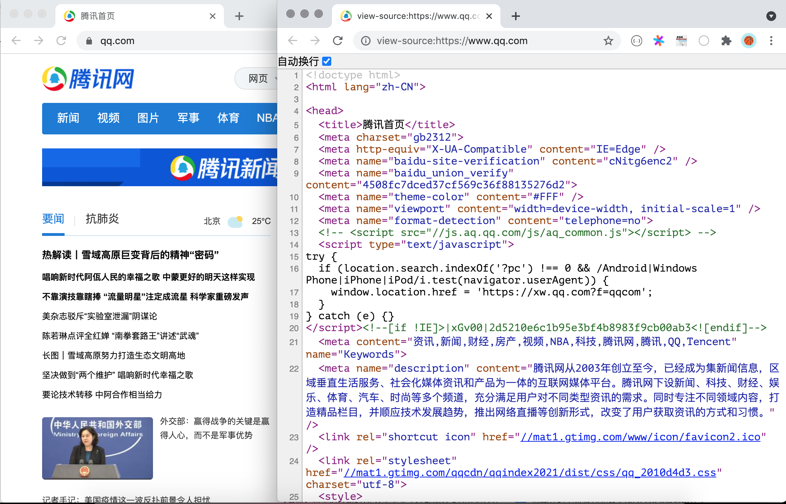

## Python ile HTML Sayfası Ayrıştırma

> **Translated to Turkish by** himmetcanumutlu

Önceki derslerde `requests` üçüncü taraf kütüphanesiyle ağ kaynağı almayı anlattık ve bazı ön yüz temellerini tanıttık. Şimdi HTML kodunun nasıl ayrıştırılacağını, sayfadan faydalı bilginin nasıl çıkarılacağını keşfetmeye devam edelim. Daha önce düzenli ifadenin yakalama grubuyla sayfa içeriği çıkarmayı denemiştik; ama doğru bir düzenli ifade yazmak da baş ağrıtan bir iştir. Bu sorunu çözmek için önce HTML sayfasının yapısını derinlemesine anlamamız, bu temelde sayfayı ayrıştırmanın diğer yöntemlerini incelememiz gerekir.

### HTML Sayfasının Yapısı

Tarayıcıda herhangi bir siteyi açıp fareyle sağ tıklayıp "Sayfa kaynağını görüntüle" menüsünü seçerek web sayfasına karşılık gelen HTML kodunu görebiliriz.



Kodun `1`. satırı belge tipi bildirimidir; `2`. satırdaki `<html>` etiketi, tüm sayfanın kök etiketinin başlangıç etiketidir; son satır kök etiketin bitiş etiketi `</html>`dir. `<html>` etiketinin altında `<head>` ve `<body>` olmak üzere iki alt etiket vardır; `<body>` etiketinin altına konan içerik tarayıcı penceresinde gösterilir; bu kısım web sayfasının gövdesidir; `<head>` etiketinin altına konan içerik tarayıcı penceresinde gösterilmez; ama sayfanın önemli üst bilgisini içerir; genellikle web sayfasının başı denir. HTML sayfasının yaklaşık kod yapısı aşağıdaki gibidir.

```HTML
<!doctype html>
<html>
    <head>
        <!-- Sayfanın üst bilgisi: karakter kodlaması, başlık, anahtar sözcük, medya sorgusu gibi -->
    </head>
    <body>
        <!-- Sayfanın gövdesi: tarayıcı penceresinde gösterilen içerik -->
    </body>
</html>
```

Etiket, Basamaklı Stil Sayfası (CSS) ve JavaScript, HTML sayfasını oluşturan üç unsurdur; etiket sayfada gösterilecek içeriği taşır, CSS sayfanın render'ından sorumludur, JavaScript ise sayfanın etkileşimli davranışını kontrol eder. HTML sayfasının ayrıştırmasını gerçekleştirmek için XPath sözdizimi kullanılabilir; XPath aslında XML'in bir sorgu sözdizimidir; HTML etiketinin hiyerarşik yapısına göre etiketteki içerik veya etiket özniteliği çıkarılabilir; ayrıca CSS seçicisiyle de sayfa öğeleri konumlanabilir; tıpkı CSS ile sayfa öğelerini render etmekle aynı mantıktır.

### XPath Ayrıştırma

XPath, XML (eXtensible Markup Language) belgesinde bilgi arayan bir sözdizimidir; XML de HTML gibi etiketle veri taşıyan bir etiket dilidir; farkı, XML etiketlerinin genişletilebilir ve özelleştirilebilir olması ve XML'in sözdizimine daha katı gereksinimler koymasıdır. XPath, XML belgesindeki düğümleri veya düğüm kümelerini seçmek için yol ifadesi kullanır; buradaki düğüm; eleman, öznitelik, metin, ad alanı, işleme komutu, yorum, kök düğüm gibi kavramları içerir. Aşağıda bir örnekle XPath ile sayfanın nasıl ayrıştırılacağını açıklayalım.

```XML
<?xml version="1.0" encoding="UTF-8"?>
<bookstore>
    <book>
      <title lang="eng">Harry Potter</title>
      <price>29.99</price>
    </book>
    <book>
      <title lang="zh">Learning XML</title>
      <price>39.95</price>
    </book>
</bookstore>
```

Yukarıdaki XML dosyası için aşağıdaki XPath sözdizimiyle belgedeki düğümleri alabiliriz.

| Yol ifadesi      | Sonuç                                                         |
| --------------- | ------------------------------------------------------------ |
| `/bookstore`    | bookstore kök elemanını seçer. **Dikkat**: Yol eğik çizgiyle ( / ) başlıyorsa bu yol her zaman elemana giden mutlak yolu temsil eder! |
| `//book`        | Belgedeki konumuna bakılmaksızın tüm book alt elemanlarını seçer.             |
| `//@lang`       | lang adlı tüm öznitelikleri seçer.                                  |
| `/bookstore/book[1]`               | bookstore alt elemanı olan ilk book elemanını seçer.                |
| `/bookstore/book[last()]`          | bookstore alt elemanı olan son book elemanını seçer.              |
| `/bookstore/book[last()-1]`        | bookstore alt elemanı olan sondan ikinci book elemanını seçer.            |
| `/bookstore/book[position()<3]`    | bookstore elemanının ilk iki book alt elemanını seçer.    |
| `//title[@lang]`                   | lang adlı özniteliğe sahip tüm title elemanlarını seçer.                  |
| `//title[@lang='eng']`             | lang özniteliğinin değeri eng olan tüm title elemanlarını seçer.   |
| `/bookstore/book[price>35.00]`     | bookstore elemanının, price elemanının değeri 35.00'den büyük olan tüm book elemanlarını seçer. |
| `/bookstore/book[price>35.00]/title` | bookstore elemanının book elemanlarının, price elemanının değeri 35.00'den büyük olan tüm title elemanlarını seçer. |

XPath joker karakter kullanımını da destekler; aşağıdaki gibidir.

| Yol ifadesi     | Sonuç                              |
| -------------- | --------------------------------- |
| `/bookstore/*` | bookstore elemanının tüm alt elemanlarını seçer. |
| `//*`          | Belgedeki tüm elemanları seçer.            |
| `//title[@*]`  | Özniteliği olan tüm title elemanlarını seçer.   |

Birden çok düğüm seçmek istiyorsanız aşağıdaki yöntemi kullanabilirsiniz.

| Yol ifadesi                         | Sonuç                                                         |
| ---------------------------------- | ------------------------------------------------------------ |
| `//book/title \| //book/price`     | book elemanının tüm title ve price elemanlarını seçer.                   |
| `//title \| //price`               | Belgedeki tüm title ve price elemanlarını seçer.                       |
| `/bookstore/book/title \| //price` | bookstore elemanının book elemanlarının tüm title elemanlarını ve belgedeki tüm price elemanlarını seçer. |

> **Not**: Yukarıdaki örnek "Runoob" sitesindeki [XPath Eğitimi](<https://www.runoob.com/xpath/xpath-tutorial.html>)nden alınmıştır; merak edenler orijinali okuyabilir.

Elbette XPath sözdizimini anlamıyor veya bilmiyorsanız, tarayıcının geliştirici aracında aşağıdaki yöntemle elemanın XPath sözdizimini görüntüleyebilirsiniz; aşağıdaki görsel Chrome geliştirici aracında Douban film detay bilgisindeki film başlığının XPath sözdizimini gösterir.


XPath ayrıştırma, üçüncü taraf `lxml` kütüphanesinin desteğini gerektirir; `lxml` kurmak için aşağıdaki komutu kullanabilirsiniz.

```Bash
pip install lxml
```

Şimdi XPath ayrıştırma yöntemiyle daha önce Douban Movie Top250'yi alan kodu yeniden yazalım; aşağıdaki gibidir.

```Python
from lxml import etree
import requests

for page in range(1, 11):
    resp = requests.get(
        url=f'https://movie.douban.com/top250?start={(page - 1) * 25}',
        headers={'User-Agent': 'BaiduSpider'}
    )
    tree = etree.HTML(resp.text)
    # XPath sözdizimiyle sayfadan film başlığını çıkar
    title_spans = tree.xpath('//*[@id="content"]/div/div[1]/ol/li/div/div[2]/div[1]/a/span[1]')
    # XPath sözdizimiyle sayfadan film puanını çıkar
    rank_spans = tree.xpath('//*[@id="content"]/div/div[1]/ol/li[1]/div/div[2]/div[2]/div/span[2]')
    for title_span, rank_span in zip(title_spans, rank_spans):
        print(title_span.text, rank_span.text)
```

### CSS Seçiciyle Ayrıştırma

CSS seçicisine ve JavaScript'e aşina geliştiriciler için CSS seçicisiyle sayfa elemanı almak daha basit bir seçim olabilir; çünkü tarayıcıda çalışan JavaScript'in kendisi `document` nesnesinin `querySelector()` ve `querySelectorAll()` metotlarıyla CSS seçicisine dayalı olarak sayfa elemanı alabilir. Python'da `beautifulsoup4` veya `pyquery` üçüncü taraf kütüphanesiyle aynı işi yapabiliriz. Beautiful Soup, HTML ve XML belgelerini ayrıştırmak, kapanmamış etiket gibi hatalı belgeleri onarmak için kullanılabilir; ayrıştırılacak sayfa için bellekte bir ağaç yapısı oluşturarak sayfadan veri çıkarma işlemini kapsüller. Beautiful Soup'u kurmak için aşağıdaki komut kullanılabilir.

```Python
pip install beautifulsoup4
```

Aşağıda `bs4` ile yeniden yazılan Douban Movie Top250 film adlarını alan kod yer alır.

```Python
import bs4
import requests

for page in range(1, 11):
    resp = requests.get(
        url=f'https://movie.douban.com/top250?start={(page - 1) * 25}',
        headers={'User-Agent': 'BaiduSpider'}
    )
    # BeautifulSoup nesnesi oluştur
    soup = bs4.BeautifulSoup(resp.text, 'lxml')
    # CSS seçicisiyle sayfadan film başlığını içeren span etiketini çıkar
    title_spans = soup.select('div.info > div.hd > a > span:nth-child(1)')
    # CSS seçicisiyle sayfadan film puanını içeren span etiketini çıkar
    rank_spans = soup.select('div.info > div.bd > div > span.rating_num')
    for title_span, rank_span in zip(title_spans, rank_spans):
        print(title_span.text, rank_span.text)
```

BeautifulSoup hakkında daha fazla bilgi için [resmî dokümanına](https://www.crummy.com/software/BeautifulSoup/bs4/doc.zh/) bakabilirsiniz.

###  Özet

Aşağıda üç ayrıştırma yöntemini kısaca karşılaştıralım.

| Ayrıştırma yöntemi       | İlgili modül       | Hız   | Kullanım zorluğu |
| -------------- | ---------------- | ------ | -------- |
| Düzenli ifadeyle ayrıştırma | `re`             | Hızlı     | Zor     |
| XPath ayrıştırma     | `lxml`           | Hızlı     | Orta     |
| CSS seçiciyle ayrıştırma | `bs4` veya `pyquery` | Belirsiz | Basit     |
