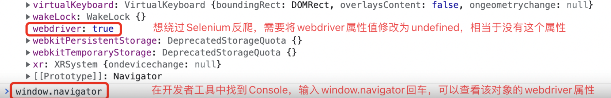

## Selenium ile Web Sayfasının Dinamik İçeriğini Çekme

> **Translated to Turkish by** himmetcanumutlu

Yetkili kuruluşların yayımladığı küresel internet erişilebilirlik denetim raporuna göre, dünyadaki web sitelerinin yaklaşık dörtte üçünün içeriği veya bir kısım içeriği JavaScript ile dinamik olarak üretilir; bu da tarayıcı penceresinde "Sayfa kaynağını görüntüle" denildiğinde bu içeriklerin HTML kodunda bulunamayacağı anlamına gelir; yani daha önce kullandığımız veri çekme yöntemi artık çalışmaz. Bu sorunu çözmenin temelde iki yolu vardır: biri dinamik içeriği sağlayan veri arayüzünü elde etmektir; bu yöntem mobil uygulamanın verisini çekmek için de uygundur; diğeri otomasyon test aracı Selenium ile tarayıcıyı çalıştırıp render edilmiş dinamik içeriği almaktır. İlk yöntem için tarayıcının "Geliştirici araçları"nı veya daha profesyonel paket yakalama araçlarını (Charles, Fiddler, Wireshark gibi) kullanarak veri arayüzünü elde edebiliriz; sonraki işlem bir önceki bölümdeki "360 görsel" sitesinden veri almayla aynıdır; burada tekrar anlatmayacağız. Bu bölümde otomasyon test aracı Selenium ile sitenin dinamik içeriğinin nasıl alınacağını anlatıyoruz.

### Selenium'a Giriş

Selenium bir otomasyon test aracıdır; onunla tarayıcıyı belirli davranışları yapmaya yönlendirip, sonunda tarayıcı geliştiricisinin web sayfasının dinamik içeriğini almasına yardımcı olur. Basitçe söylemek gerekirse, tarayıcı penceresinde görebildiğimiz her içerik Selenium ile alınabilir; JavaScript dinamik render teknolojisi kullanan siteler için Selenium önemli bir seçimdir. Aşağıda yine Chrome tarayıcısı örneğiyle Selenium'un kullanımını anlatıyoruz; önce Chrome tarayıcısını kurup sürücüsünü indirmeniz gerekir. Chrome tarayıcısının sürücüsü [ChromeDriver resmî sitesinden](https://chromedriver.chromium.org/downloads) indirilebilir; sürücünün sürümü tarayıcının sürümüne karşılık gelmelidir; tam karşılık gelen sürüm yoksa sürüm numarası en yakın olanı seçin.


### Selenium Kullanımı

Önce `pip` ile Selenium'u kurabiliriz; komut aşağıdaki gibidir.

```Shell
pip install selenium
```

#### Sayfa Yükleme

Şimdi aşağıdaki kodla Chrome tarayıcısını yönlendirip Baidu'yu açalım.

```Python
from selenium import webdriver

# Chrome tarayıcı nesnesi oluştur
browser = webdriver.Chrome()
# Belirtilen sayfayı yükle
browser.get('https://www.baidu.com/')
```

Chrome kullanmak istemiyorsanız, yukarıdaki kodu değiştirip diğer tarayıcıları kontrol edebilirsiniz; yalnızca ilgili tarayıcı nesnesini (Firefox, Safari gibi) oluşturmanız yeterlidir. Yukarıdaki programı çalıştırdığınızda aşağıdaki gibi bir hata görürseniz, Chrome tarayıcısının sürücüsünü PATH ortam değişkenine eklemediğimiz ve programda Chrome sürücüsünün konumunu belirtmediğimiz anlamına gelir.

```Shell
selenium.common.exceptions.WebDriverException: Message: 'chromedriver' executable needs to be in PATH. Please see https://sites.google.com/a/chromium.org/chromedriver/home
```

Bu sorunu çözmenin üç yolu vardır:

1. İndirilen ChromeDriver'ı mevcut PATH ortam değişkenine koyun; doğrudan Python yorumlayıcısıyla aynı dizine koymanız önerilir; çünkü Python kurarken Python yorumlayıcısının yolunu zaten PATH ortam değişkenine eklemiştik.

2. ChromeDriver'ı proje sanal ortamındaki `bin` klasörüne koyun (Windows'ta ilgili dizin `Scripts`tir); böylece ChromeDriver sanal ortamdaki Python yorumlayıcısıyla aynı konumda olur; kesinlikle bulunabilir.

3. Yukarıdaki kodu değiştirip Chrome nesnesi oluştururken `service` parametresiyle `Service` nesnesini yapılandırın ve `Service` nesnesinin `executable_path` parametresiyle ChromeDriver'ın konumunu belirtin; aşağıdaki gibidir:

    ```Python
    from selenium import webdriver
    from selenium.webdriver.chrome.service import Service
    
    browser = webdriver.Chrome(service=Service(executable_path='venv/bin/chromedriver'))
    browser.get('https://www.baidu.com/')
    ```

#### Eleman Bulma ve Kullanıcı Davranışını Taklit Etme

Şimdi kullanıcının Baidu ana sayfasındaki metin kutusuna arama anahtar sözcüğü girip "Baidu" düğmesine tıklamasını taklit etmeyi deneyelim. Sayfa yükleme tamamlandıktan sonra, `Chrome` nesnesinin `find_element` ve `find_elements` metotlarıyla sayfa elemanı alınabilir; Selenium CSS seçici, XPath, eleman adı (etiket adı), eleman ID'si, sınıf adı gibi birçok eleman alma yöntemini destekler; birincisi tek sayfa elemanı (`WebElement` nesnesi) alır, ikincisi birden çok sayfa elemanından oluşan liste alır. `WebElement` nesnesini aldıktan sonra `send_keys` ile kullanıcı girdi davranışı, `click` ile kullanıcı tıklama işlemi taklit edilebilir; kod aşağıdaki gibidir.

```Python
from selenium import webdriver
from selenium.webdriver.common.by import By

browser = webdriver.Chrome()
browser.get('https://www.baidu.com/')
# Eleman ID'siyle eleman al
kw_input = browser.find_element(By.ID, 'kw')
# Kullanıcı girdi davranışını taklit et
kw_input.send_keys('Python')
# CSS seçicisiyle eleman al
su_button = browser.find_element(By.CSS_SELECTOR, '#su')
# Kullanıcı tıklama davranışını taklit et
su_button.click()
```

Bir dizi eylem (örneğin sürükle-bırak) yapmak istiyorsanız `ActionChains` nesnesi oluşturabilirsiniz; merak edenler kendileri inceleyebilir.

#### Örtük Bekleme ve Açık Bekleme

Bilmeniz gereken bir ayrıntı daha var: sayfadaki elemanlar dinamik üretilebilir; `find_element` veya `find_elements` ile aldığımız sırada render henüz tamamlanmamış olabilir; bu durumda `NoSuchElementException` hatası oluşur. Bu sorunu çözmek için örtük bekleme kullanabiliriz; bekleme süresi ayarlayarak tarayıcının sayfa elemanını render etmesi beklenir. Ayrıca açık bekleme de kullanılabilir; `WebDriverWait` nesnesi oluşturup bekleme süresi ve koşulu ayarlanır; koşul sağlanmadığında önce bekleyip sonra sonraki işlemi deneyebiliriz; somut kod aşağıdaki gibidir.

```Python
from selenium import webdriver
from selenium.webdriver.common.by import By
from selenium.webdriver.support import expected_conditions
from selenium.webdriver.support.wait import WebDriverWait

browser = webdriver.Chrome()
# Tarayıcı penceresi boyutunu ayarla
browser.set_window_size(1200, 800)
browser.get('https://www.baidu.com/')
# Örtük bekleme süresini 10 saniye yap
browser.implicitly_wait(10)
kw_input = browser.find_element(By.ID, 'kw')
kw_input.send_keys('Python')
su_button = browser.find_element(By.CSS_SELECTOR, '#su')
su_button.click()
# Açık bekleme nesnesi oluştur
wait_obj = WebDriverWait(browser, 10)
# Bekleme koşulunu ayarla (arama sonucunun div'i görünene kadar bekle)
wait_obj.until(
    expected_conditions.presence_of_element_located(
        (By.CSS_SELECTOR, '#content_left')
    )
)
# Ekran görüntüsü al
browser.get_screenshot_as_file('python_result.png')
```

Yukarıda ayarlanan `presence_of_element_located` bekleme koşulu, belirtilen elemanın görünmesini bekler; aşağıdaki tablo yaygın bekleme koşullarını ve anlamlarını listeler.

| Bekleme koşulu                                 | Somut anlamı                              |
| ---------------------------------------- | ------------------------------------- |
| `title_is / title_contains`              | Başlık belirtilen içeriktir / başlık belirtilen içeriği içerir |
| `visibility_of`                          | Eleman görünür                              |
| `presence_of_element_located`            | Konumlanan eleman yüklenme tamamlandı                    |
| `visibility_of_element_located`          | Konumlanan eleman görünür oldu                    |
| `invisibility_of_element_located`        | Konumlanan eleman görünmez oldu                  |
| `presence_of_all_elements_located`       | Konumlanan tüm elemanlar yüklenme tamamlandı                |
| `text_to_be_present_in_element`          | Eleman belirtilen içeriği içerir                    |
| `text_to_be_present_in_element_value`    | Elemanın `value` özelliği belirtilen içeriği içerir       |
| `frame_to_be_available_and_switch_to_it` | Belirtilen iç pencereyi yükleyip ona geçer            |
| `element_to_be_clickable`                | Eleman tıklanabilir                            |
| `element_to_be_selected`                 | Eleman seçilmiş                            |
| `element_located_to_be_selected`         | Konumlanan eleman seçilmiş                      |
| `alert_is_present`                       | Alert penceresi görünür                       |

#### JavaScript Kodu Çalıştırma

Şelale biçiminde yüklenen sayfalarda, tarayıcı penceresinde daha fazla içerik yüklemek istiyorsanız, tarayıcı nesnesinin `execute_script` metoduyla JavaScript kodu çalıştırabilirsiniz. Bazı ileri düzey çekme işlemlerinde de benzer işlemler gerekebilir; tarayıcı kodunuz JavaScript desteğine ihtiyaç duyuyorsa, özellikle JavaScript'teki BOM ve DOM işlemlerini uygun biçimde öğrenmenizi öneririz. Yukarıdaki kodda ekran görüntüsü almadan önce aşağıdaki kodu ekleyip JavaScript ile sayfayı en alta kaydırabiliriz.

```Python
# JavaScript kodu çalıştır
browser.execute_script('document.documentElement.scrollTop = document.documentElement.scrollHeight')
```

#### Selenium Anti-Scraping Engeli Aşma

Bazı siteler özellikle Selenium'a karşı anti-scraping önlemi almıştır; çünkü Selenium ile yönlendirilen tarayıcıda konsolda aşağıdaki gibi `webdriver` özelliğinin değeri `true` görünür; bu kontrolü aşmak istiyorsanız, sayfayı yüklemeden önce JavaScript kodu çalıştırıp onu `undefined` yapabilirsiniz.



Öte yandan tarayıcı penceresindeki "Chrome otomatik test yazılımı tarafından kontrol ediliyor" bildirimini de gizleyebiliriz; tam kod aşağıdaki gibidir.

```Python
# Chrome parametre nesnesi oluştur
options = webdriver.ChromeOptions()
# Deneysel parametreler ekle
options.add_experimental_option('excludeSwitches', ['enable-automation'])
options.add_experimental_option('useAutomationExtension', False)
# Chrome tarayıcı nesnesi oluşturup parametreleri geç
browser = webdriver.Chrome(options=options)
# Chrome geliştirici protokolü komutu çalıştır (sayfa yüklenirken belirtilen JavaScript kodunu çalıştır)
browser.execute_cdp_cmd(
    'Page.addScriptToEvaluateOnNewDocument',
    {'source': 'Object.defineProperty(navigator, "webdriver", {get: () => undefined})'}
)
browser.set_window_size(1200, 800)
browser.get('https://www.baidu.com/')
```

#### Başsız Tarayıcı

Çoğu zaman veri çekerken tarayıcı penceresini görmemiz gerekmez; Chrome tarayıcısı ve ilgili sürücü olduğu sürece tarayıcımız çalışır. Tarayıcı penceresini görmek istemiyorsanız, aşağıdaki yöntemle başsız tarayıcı kullanabilirsiniz.

```Python
options = webdriver.ChromeOptions()
options.add_argument('--headless')
browser = webdriver.Chrome(options=options)
```

### API Referansı

Selenium ile ilgili daha çok bilgi var; burada tek tek anlatmayacağız; aşağıda tarayıcı nesnesinin ve `WebElement` nesnesinin yaygın özellik ve metotlarını listeliyoruz. Somut içerik için Selenium'un [resmî dokümanının Çince çevirisine](https://selenium-python-zh.readthedocs.io/en/latest/index.html) da bakabilirsiniz.

#### Tarayıcı Nesnesi

Tablo 1. Yaygın özellikler

| Özellik adı                  | Açıklama                             |
| ----------------------- | -------------------------------- |
| `current_url`           | Mevcut sayfanın URL'si                    |
| `current_window_handle` | Mevcut pencerenin tutamacı (referansı)           |
| `name`                  | Tarayıcının adı                     |
| `orientation`           | Mevcut cihazın yönü (yatay, dikey)     |
| `page_source`           | Mevcut sayfanın kaynak kodu (dinamik içerik dahil) |
| `title`                 | Mevcut sayfanın başlığı                   |
| `window_handles`        | Tarayıcının açtığı tüm pencerelerin tutamacı       |

Tablo 2. Yaygın metotlar

| Metot adı                                 | Açıklama                                |
| -------------------------------------- | ----------------------------------- |
| `back` / `forward`                     | Tarama geçmişinde geri/ileri           |
| `close` / `quit`                       | Mevcut tarayıcı penceresini kapatır / tarayıcı örneğinden çıkar |
| `get`                                  | Belirtilen URL'nin sayfasını tarayıcıya yükler       |
| `maximize_window`                      | Tarayıcı penceresini büyütür                  |
| `refresh`                              | Mevcut sayfayı yeniler                        |
| `set_page_load_timeout`                | Sayfa yükleme zaman aşımını ayarlar                |
| `set_script_timeout`                   | JavaScript çalıştırma zaman aşımını ayarlar        |
| `implicit_wait`                        | Elemanın bulunması veya hedef komutun tamamlanması için beklemeyi ayarlar    |
| `get_cookie` / `get_cookies`           | Belirtilen Cookie'yi alır / tüm Cookie'leri alır   |
| `add_cookie`                           | Cookie bilgisi ekler                    |
| `delete_cookie` / `delete_all_cookies` | Belirtilen Cookie'yi siler / tüm Cookie'leri siler |
| `find_element` / `find_elements`       | Tek eleman bulur / bir dizi eleman bulur       |

#### WebElement Nesnesi

Tablo 1. WebElement yaygın özellikleri

| Özellik adı     | Açıklama           |
| ---------- | -------------- |
| `location` | Elemanın konumu     |
| `size`     | Elemanın boyutu     |
| `text`     | Elemanın metin içeriği |
| `id`       | Elemanın ID'si      |
| `tag_name` | Elemanın etiket adı   |

Tablo 2. Yaygın metotlar

| Metot adı                           | Açıklama                                 |
| -------------------------------- | ------------------------------------ |
| `clear`                          | Metin kutusu veya metin alanındaki içeriği temizler           |
| `click`                          | Elemana tıklar                             |
| `get_attribute`                  | Elemanın öznitelik değerini alır                     |
| `is_displayed`                   | Elemanın kullanıcı için görünür olup olmadığını belirler             |
| `is_enabled`                     | Elemanın kullanılabilir durumda olup olmadığını belirler             |
| `is_selected`                    | Elemanın (tek seçim ve çoklu seçim düğmesi) seçili olup olmadığını belirler |
| `send_keys`                      | Metin girişini taklit eder                         |
| `submit`                         | Formu gönderir                             |
| `value_of_css_property`          | Belirtilen CSS özelliğinin değerini alır                  |
| `find_element` / `find_elements` | Tek alt eleman alır / bir dizi alt eleman alır    |
| `screenshot`                     | Eleman için anlık görüntü üretir                       |

### Basit Örnek

Aşağıdaki örnek Selenium ile "360 görsel" sitesinden görsel arayıp indirmeyi gösterir.

```Python
import os
import time
from concurrent.futures import ThreadPoolExecutor

import requests
from selenium import webdriver
from selenium.webdriver.common.by import By
from selenium.webdriver.common.keys import Keys

DOWNLOAD_PATH = 'images/'


def download_picture(picture_url: str):
    """
    Görseli indirip kaydeder
    :param picture_url: görselin URL'si
    """
    filename = picture_url[picture_url.rfind('/') + 1:]
    resp = requests.get(picture_url)
    with open(os.path.join(DOWNLOAD_PATH, filename), 'wb') as file:
        file.write(resp.content)


if not os.path.exists(DOWNLOAD_PATH):
    os.makedirs(DOWNLOAD_PATH)
browser = webdriver.Chrome()
browser.get('https://image.so.com/z?ch=beauty')
browser.implicitly_wait(10)
kw_input = browser.find_element(By.CSS_SELECTOR, 'input[name=q]')
kw_input.send_keys('güzel manzara')
kw_input.send_keys(Keys.ENTER)
for _ in range(10):
    browser.execute_script(
        'document.documentElement.scrollTop = document.documentElement.scrollHeight'
    )
    time.sleep(1)
imgs = browser.find_elements(By.CSS_SELECTOR, 'div.waterfall img')
with ThreadPoolExecutor(max_workers=32) as pool:
    for img in imgs:
        pic_url = img.get_attribute('src')
        pool.submit(download_picture, pic_url)
```

Yukarıdaki kodu çalıştırıp belirtilen dizine, anahtar sözcüğe göre aranan görsellerin indirilip indirilmediğini kontrol edin.
