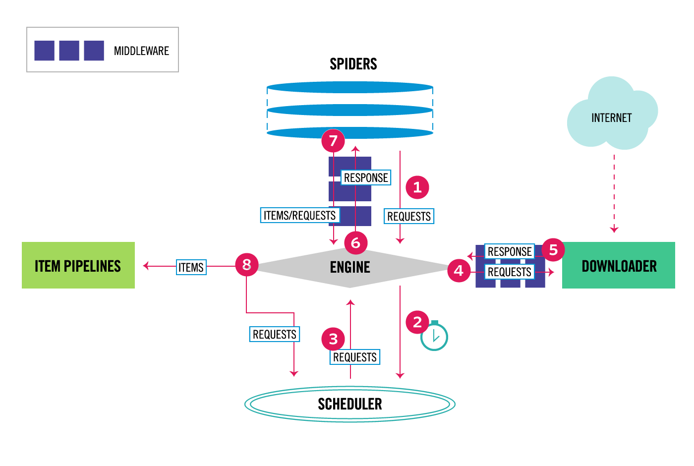

## Scraping Framework'ü Scrapy'ye Giriş

> **Translated to Turkish by** himmetcanumutlu

Birçok tarayıcı programı yazdıktan sonra, her tarayıcı yazarken sayfa alma, sayfa ayrıştırma, tarayıcı çizelgeleme, istisna işleme, anti-scraping'le başa çıkma gibi kodları baştan sona yeniden yazmanız gerektiğini fark edersiniz; bunların çoğu aslında basit ve sıkıcı tekrarlayan işlerdir. Peki tarayıcı kodu yazma verimliliğimizi artırmanın bir yolu yok mu? Cevap evet: tarayıcı framework'ü kullanmak; tüm tarayıcı framework'leri arasında Scrapy en popüler ve güçlü olanıdır.

### Scrapy'ye Genel Bakış

Scrapy, Python tabanlı çok popüler bir ağ tarayıcı framework'üdür; Web sitelerini çekmek ve sayfadan yapılandırılmış veri çıkarmak için kullanılabilir. Aşağıdaki görsel Scrapy'nin temel mimarisini gösterir; ana bileşenleri ve sistemin veri işleme akışını (sayılı kırmızı oklu) içerir.



#### Scrapy'nin Bileşenleri

Önce Scrapy'deki bileşenlerden söz edelim.

1. Scrapy motoru (Engine): Tüm sistemin veri işleme akışını kontrol eder.
2. Zamanlayıcı (Scheduler): Zamanlayıcı motordan istek kabul edip kuyruğa sırayla koyar; motor istek gönderdikten sonra geri döndürür.
3. İndirici (Downloader): İndiricinin başlıca görevi web sayfasını çekip sayfa içeriğini örümceğe (Spiders) döndürmektir.
4. Örümcek programı (Spiders): Örümcek, web sayfasını ayrıştırıp belirli URL'leri çeken, kullanıcı tarafından özelleştirilen sınıftır; her örümcek bir alan adını veya bir grup alan adını işler; basitçe belirli sitenin çekme ve ayrıştırma kurallarını tanımlayan modüldür.
5. Veri borusu (Item Pipeline): Borunun başlıca sorumluluğu, örümceğin web sayfasından çıkardığı veri kayıtlarını işlemektir; ana görevleri veriyi temizlemek, doğrulamak ve saklamaktır. Sayfa örümcek tarafından ayrıştırıldıktan sonra veri borusuna gönderilir ve birkaç belirli sırada işlenir. Her veri borusu bileşeni bir Python sınıfıdır; veri kaydını alıp işleyen metodu çalıştırır; ayrıca veri borusunda bir sonraki adıma geçip geçmeyeceğini veya doğrudan atıp atmadığını belirler. Veri borusunun yaygın görevleri: HTML verisini temizlemek, ayrıştırılan veriyi doğrulamak (kaydın gerekli alanları içerip içermediğini kontrol), yinelenen veri olup olmadığını kontrol etmek (yineleniyse atmak), ayrıştırılan veriyi veritabanına (ilişkisel veya NoSQL) saklamaktır.
6. Middleware'ler: Middleware, motor ile diğer bileşenler arasındaki kanca framework'üdür; esas olarak Scrapy'nin işlevini genişletmek için özel kod sağlar; indirici middleware ve örümcek middleware olmak üzere iki tür içerir.

#### Veri İşleme Akışı

Scrapy'nin tüm veri işleme akışı motor tarafından kontrol edilir; normal akış şu adımları içerir:

1. Motor örümceğe hangi siteyi işlemesi gerektiğini sorar ve örümceğin işleyeceği ilk URL'yi kendisine vermesini sağlar.

2. Motor, zamanlayıcıya işlenecek URL'yi kuyruğa koydurur.

3. Motor, zamanlayıcıdan sonraki çekilecek sayfayı alır.

4. Zamanlayıcı sonraki çekilecek URL'yi motora döndürür; motor onu indirici middleware üzerinden indiriciye gönderir.

5. Web sayfası indirici tarafından indirildikten sonra yanıt içeriği indirici middleware üzerinden motora gönderilir; indirme başarısız olursa motor zamanlayıcıya bu URL'yi kaydetmesini, birazdan yeniden indirmesini bildirir.

6. Motor indiricinin yanıtını alıp örümcek middleware üzerinden örümceğe işlemesi için gönderir.

7. Örümcek yanıtı işleyip çekilen veri kaydını döndürür; ayrıca takip edilecek yeni URL'leri motora gönderir.

8. Motor çekilen veri kaydını veri borusuna gönderir; yeni URL'leri zamanlayıcıya gönderip kuyruğa koydurur.

Yukarıdaki işlemlerin 2. adımından 8. adımına kadarı, zamanlayıcıda istenecek URL kalmayana dek tekrarlanır; tarayıcı çalışmayı durdurur.

### Scrapy Kurulumu ve Kullanımı

Python'un paket yönetim aracı `pip` ile Scrapy kurulabilir.

```Shell
pip install scrapy
```

Komut satırında `scrapy` komutuyla `demo` adlı projeyi oluşturun.

```Bash
scrapy startproject demo
```

Projenin dizin yapısı aşağıdaki gibidir.

```Shell
demo
|____ demo
|________ spiders
|____________ __init__.py
|________ __init__.py
|________ items.py
|________ middlewares.py
|________ pipelines.py
|________ settings.py
|____ scrapy.cfg
```

`demo` dizinine geçip aşağıdaki komutla `douban` adlı örümcek programını oluşturun.

```Bash
scrapy genspider douban movie.douban.com
```

#### Basit Bir Örnek

Şimdi Douban Movie Top250'nin film başlığını, puanını ve özlü sözünü çeken bir tarayıcı gerçekleyelim.

1. `items.py`'deki `Item` sınıfında alanları tanımlayın; bu alanlar veriyi saklar, sonraki işlemleri kolaylaştırır.

   ```Python
   import scrapy
   
   
   class DoubanItem(scrapy.Item):
       title = scrapy.Field()
       score = scrapy.Field()
       motto = scrapy.Field()
   ```
   
2. `spiders` klasöründeki `douban.py` dosyasını değiştirin; örümcek programının çekirdeğidir; sayfa ayrıştırma kodunu eklememiz gerekir. Burada `Response` nesnesini ayrıştırarak film bilgisini alırız; kod aşağıdaki gibidir.

   ```Python
   import scrapy
   from scrapy import Selector, Request
   from scrapy.http import HtmlResponse
   
   from demo.items import MovieItem
   
   
   class DoubanSpider(scrapy.Spider):
       name = 'douban'
       allowed_domains = ['movie.douban.com']
       start_urls = ['https://movie.douban.com/top250?start=0&filter=']
   
       def parse(self, response: HtmlResponse):
           sel = Selector(response)
           movie_items = sel.css('#content > div > div.article > ol > li')
           for movie_sel in movie_items:
               item = MovieItem()
               item['title'] = movie_sel.css('.title::text').extract_first()
               item['score'] = movie_sel.css('.rating_num::text').extract_first()
               item['motto'] = movie_sel.css('.inq::text').extract_first()
               yield item
   ```
   Yukarıdaki koddan, sayfa ayrıştırmak için CSS seçicisi kullanılabileceği kolayca görülür. Elbette isterseniz XPath veya düzenli ifadeyle de sayfa ayrıştırabilirsiniz; karşılık gelen metotlar `xpath` ve `re`'dir.

   Sonraki çekme isteklerini üretmek gerekirse, `yield` ile `Request` nesnesi üretebiliriz. `Request` nesnesinin iki çok önemli özelliği vardır: biri `url`, istenecek adresi temsil eder; biri `callback`, yanıt alındıktan sonra çalıştırılacak geri çağrı fonksiyonunu temsil eder. Yukarıdaki kodu biraz değiştirebiliriz.

   ```Python
   import scrapy
   from scrapy import Selector, Request
   from scrapy.http import HtmlResponse
   
   from demo.items import MovieItem
   
   
   class DoubanSpider(scrapy.Spider):
       name = 'douban'
       allowed_domains = ['movie.douban.com']
       start_urls = ['https://movie.douban.com/top250?start=0&filter=']
   
       def parse(self, response: HtmlResponse):
           sel = Selector(response)
           movie_items = sel.css('#content > div > div.article > ol > li')
           for movie_sel in movie_items:
               item = MovieItem()
               item['title'] = movie_sel.css('.title::text').extract_first()
               item['score'] = movie_sel.css('.rating_num::text').extract_first()
               item['motto'] = movie_sel.css('.inq::text').extract_first()
               yield item
   
           hrefs = sel.css('#content > div > div.article > div.paginator > a::attr("href")')
           for href in hrefs:
               full_url = response.urljoin(href.extract())
               yield Request(url=full_url)
   ```

   Bu noktada aşağıdaki komutla tarayıcıyı çalıştırabiliriz.

   ```Shell
   scrapy crawl movie
   ```

   Konsolda çekilen veriyi görebiliriz; bu veriyi dosyaya kaydetmek istiyorsanız `-o` parametresiyle dosya adı belirtilebilir; Scrapy çekilen veriyi JSON, CSV, XML gibi biçimlere dışa aktarmayı destekler.

   ```Shell
   scrapy crawl moive -o result.json
   ```

   Fark ettiniz mi bilmem, tarayıcıyı çalıştırıp elde edilen JSON dosyasında `275` veri var; bunun nedeni ana sayfanın yinelenerek çekilmesidir. Bu sorunu çözmek için yukarıdaki kodu biraz ayarlayıp, `parse` metodunda yeni sayfanın URL'sini ayrıştırmak yerine `start_requests` metoduyla çekilecek sayfaların URL'lerini önceden hazırlayabiliriz; ayarlanmış kod aşağıdaki gibidir.

   ```Python
   import scrapy
   from scrapy import Selector, Request
   from scrapy.http import HtmlResponse
   
   from demo.items import MovieItem
   
   
   class DoubanSpider(scrapy.Spider):
       name = 'douban'
       allowed_domains = ['movie.douban.com']
   
       def start_requests(self):
           for page in range(10):
               yield Request(url=f'https://movie.douban.com/top250?start={page * 25}')
   
       def parse(self, response: HtmlResponse):
           sel = Selector(response)
           movie_items = sel.css('#content > div > div.article > ol > li')
           for movie_sel in movie_items:
               item = MovieItem()
               item['title'] = movie_sel.css('.title::text').extract_first()
               item['score'] = movie_sel.css('.rating_num::text').extract_first()
               item['motto'] = movie_sel.css('.inq::text').extract_first()
               yield item
   ```

3. Tarayıcı verisini kalıcılaştırmak istiyorsanız, örümcek programının ürettiği `Item` nesnesini veri borusunda işleyebilirsiniz. Örneğin daha önce anlattığımız `openpyxl` ile Excel dosyasını işleyip veriyi Excel'e yazabiliriz; kod aşağıdaki gibidir.

   ```Python
   import openpyxl
   
   from demo.items import MovieItem
   
   
   class MovieItemPipeline:
   
       def __init__(self):
           self.wb = openpyxl.Workbook()
           self.sheet = self.wb.active
           self.sheet.title = 'Top250'
           self.sheet.append(('Ad', 'Puan', 'Özlü söz'))
   
       def process_item(self, item: MovieItem, spider):
           self.sheet.append((item['title'], item['score'], item['motto']))
           return item
   
       def close_spider(self, spider):
           self.wb.save('douban-film-verileri.xlsx')
   ```

   Yukarıdaki `process_item` ve `close_spider` geri çağrı metotlarıdır (kanca fonksiyonları); basitçe söylemek gerekirse Scrapy framework'ünün otomatik çağırdığı metotlardır. Örümcek programı bir `Item` nesnesi üretip motora verdiğinde, motor bu `Item` nesnesini veri borusuna verir; bu sırada yapılandırdığımız veri borusunun `parse_item` metodu çalıştırılır; böylece bu metotta veriyi alıp kalıcılaştırabiliriz. Diğer `close_spider` metodu, tarayıcı çalışmasını bitirmeden önce otomatik çalıştırılan metottur; yukarıdaki kodda Excel dosyasını burada kaydettik; bu kodun anlaşılması kolaydır.

   Özetle veri borusu şu işlemleri yapmamıza yardımcı olur:

   - HTML verisini temizler, çekilen veriyi doğrular.
   - Yinelenen gereksiz içeriği atar.
   - Çekilen sonucu kalıcılaştırır.

4. Projeyi yapılandırmak için `settings.py` dosyasını değiştirin; esas olarak şu birkaç yapılandırmayı değiştirmek gerekir.

   ```Python
   # Kullanıcı tarayıcısı
   USER_AGENT = 'Mozilla/5.0 (Macintosh; Intel Mac OS X 10_14_6) AppleWebKit/537.36 (KHTML, like Gecko) Chrome/92.0.4515.159 Safari/537.36'
   
   # Eş zamanlı istek sayısı 
   CONCURRENT_REQUESTS = 4
   
   # İndirme gecikmesi
   DOWNLOAD_DELAY = 3
   # İndirme gecikmesini rastgeleleştir
   RANDOMIZE_DOWNLOAD_DELAY = True
   
   # Tarayıcı protokolüne uyulsun mu
   ROBOTSTXT_OBEY = True
   
   # Veri borusunu yapılandır
   ITEM_PIPELINES = {
      'demo.pipelines.MovieItemPipeline': 300,
   }
   ```

   > **Not**: Yukarıdaki yapılandırma dosyasındaki `ITEM_PIPELINES` seçeneği bir sözlüktür; birden çok veri işleyen boru yapılandırılabilir; sonraki sayı yürütme önceliğini temsil eder; küçük sayı önce çalışır.
