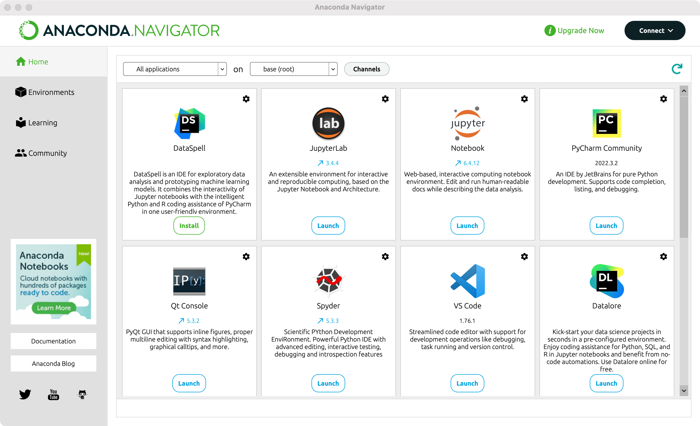
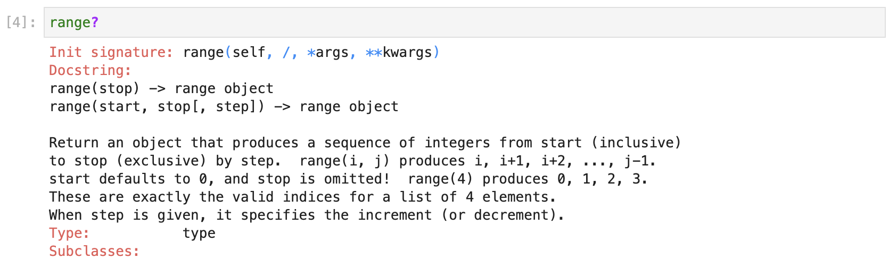
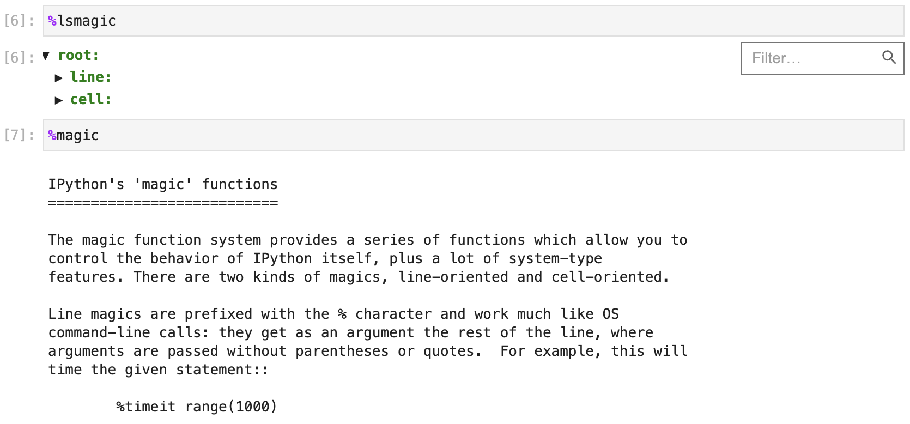

## Ortam Hazırlığı

> **Translated to Turkish by** himmetcanumutlu

Python ile veri bilimi işine hızla başlamak istiyorsanız, doğrudan Anaconda kurup Anaconda'nın içindeki Notebook veya JupyterLab aracıyla kod yazmanızı öneririz. Çünkü yeni başlayanlar için önce resmî Python yorumlayıcısını kurup sonra işte kullanılacak üçüncü taraf kütüphaneleri tek tek kurmak zahmetlidir; özellikle Windows ortamında derleme aracı veya DLL eksikliği nedeniyle kurulum sık sık başarısız olur; yeni başlayanların hata mesajına göre doğru çözümü uygulaması da zordur; ciddi hayal kırıklığı yaratabilir. Bilgisayarınızda Python yorumlayıcı ortamı zaten varsa, doğrudan Python paket yönetim aracı pip ile Jupyter kurup, gerçek iş ihtiyacına göre üçüncü taraf kütüphaneleri kurabilirsiniz; bu yöntem belirli deneyimi olan kullanıcılar içindir.

### Anaconda Kurulumu ve Kullanımı

Bireysel kullanıcılar Anaconda'nın [resmî sitesinden](https://www.anaconda.com/) "Kişisel Sürüm (Individual Edition)" kurulum programını indirebilir; kurulum bittikten sonra bilgisayarınızda Python ortamı ve Spyder (PyCharm'a benzer entegre geliştirme aracı) olur; ayrıca yukarıda sözünü ettiğimiz Python veri analizi üç harikası dahil, veri bilimiyle ilgili yaklaşık 200 araç paketi kurulur. Ayrıca Anaconda, conda adlı bir paket yönetim aracı sunar; bu araçla hem Python araç paketlerini yönetebilir hem de Python programı çalıştıracak sanal ortamlar oluşturabilirsiniz.


Yukarıdaki görseldeki gibi Anaconda resmî sitesindeki indirme bağlantısından işletim sisteminize uygun kurulum programını seçebilirsiniz; grafiksel kurulum programını seçmenizi öneririz; indirme bitince kurulum programına çift tıklayıp kuruluma başlayın. Kurulumda temelde varsayılan ayarlar yeterlidir; kurulum bitince macOS kullanıcıları "Uygulamalar" veya "Launchpad"de "Anaconda-Navigator" uygulamasını bulabilir; çalıştırınca aşağıdaki gibi bir arayüz görülür; burada yapılacak işlemi seçebiliriz.



Windows kullanıcıları için Anaconda'yı kurulum sihirbazının ipuçlarına ve önerilen seçeneklere göre kurmanız önerilir (kurulum yolu dışında seçilecek pek bir şey yok); kurulum bitince "Başlat menüsü"nde "Anaconda3" bulunur.

> **İpucu**: Anaconda yerine Miniconda seçebilirsiniz; Miniconda yalnızca Python yorumlayıcı ortamını ve bazı gerekli araçları kurar; diğer üçüncü taraf kütüphaneleri kullanıcı kendisi seçer. **Aslında ben Anaconda'yı pek sevmiyorum, çünkü acemi kullanıcılar için; Python ortamımız olduğunda ihtiyacımız olan üçüncü taraf kütüphaneleri tamamen kendi isteğimize göre kurabiliriz**.

#### conda Komutları

Yeni başlayan olmayan kullanıcılar, conda aracıyla bağımlılıkları yönetmek veya proje sanal ortamı oluşturmak istiyorsa terminalde veya komut isteminde conda komutunu kullanabilir. Windows kullanıcıları "Başlat menüsü"nden "Anaconda3"ü bulup "Anaconda Prompt" veya "Anaconda PowerShell"e tıklayarak conda'yı destekleyen komut istemini başlatabilir. Yeni başlayanlar yeni sanal ortam oluşturmak veya üçüncü taraf kütüphaneleri (bağımlılıkları) yönetmek istiyorsa, doğrudan "Anaconda-Navigator"daki "Environments"ı kullanıp görsel biçimde sanal ortamı ve bağımlılıkları yönetmeleri önerilir.

1. Sürüm ve yardım bilgisi.

    - Sürümü görüntüle: `conda -V` veya `conda --version`
    - Yardım al: `conda -h` veya `conda --help`
    - İlgili bilgi: `conda list`

2. Sanal ortamla ilgili.

    - Tüm sanal ortamları göster: `conda env list`
    - Sanal ortam oluştur: `conda create --name venv`
    - Python sürümü belirterek sanal ortam oluştur: `conda create --name venv python=3.7`
    - Python sürümü ve belirtilen bağımlılıklarla sanal ortam oluştur: `conda create --name venv python=3.7 numpy pandas`
    - Mevcut sanal ortamı klonlayarak sanal ortam oluştur: `conda create --name venv2 --clone venv`
    - Sanal ortamı paylaşıp belirtilen dosyaya yönlendir: `conda env export > environment.yml`
    - Paylaşılan sanal ortam dosyasından sanal ortam oluştur: `conda env create -f environment.yml`
    - Sanal ortamı etkinleştir: `conda activate venv`
    - Sanal ortamdan çık: `conda deactivate`
    - Sanal ortamı sil: `conda remove --name venv --all`

    > **Not**: Yukarıdaki komutlarda `venv` ve `venv2` sanal ortam klasörünün adlarıdır; beğendiğiniz bir adla değiştirebilirsiniz; ama **kesinlikle** İngilizce ve özel karakter içermeyen bir ad kullanmanızı öneririz.

3. Paket (üçüncü taraf kütüphane veya araç) yönetimi.

    - Kurulu paketleri görüntüle: `conda list`
    - Belirtilen paketi ara: `conda search matplotlib`
    - Belirtilen paketi kur: `conda install matplotlib`
    - Belirtilen paketi güncelle: `conda update matplotlib`
    - Belirtilen paketi kaldır: `conda remove matplotlib`

    > **Not**: Paket ararken, kurarken ve güncellerken varsayılan olarak resmî siteye bağlanılır; hız yetersizse resmî siteyi Çin'deki ayna sitelerle değiştirebilirsiniz; Tsinghua Üniversitesi'nin açık kaynak ayna sitesi önerilir. Varsayılan kaynağı Çin aynasıyla değiştirme komutları: `conda config --add channels https://mirrors.tuna.tsinghua.edu.cn/anaconda/pkgs/free/` ve `conda config --add channels https://mirrors.tuna.tsinghua.edu.cn/anaconda/pkgs/main`. Varsayılan kaynağa dönmek için `conda config --remove-key channels` komutu kullanılabilir.

### JupyterLab Kurulumu ve Kullanımı

#### Kurulum ve Başlatma

Anaconda kurduysanız, yukarıdaki yöntemle "Anaconda-Navigator"da Notebook veya JupyterLab'i doğrudan başlatabilirsiniz. Resmî açıklamaya göre JupyterLab yeni nesil Notebook'tur; daha dostane arayüz ve daha güçlü işlev sunar; JupyterLab kullanmanızı da öneririz. Windows kullanıcıları Başlat menüsünden "Anaconda Prompt" veya "Anaconda PowerShell"i açabilir; Anaconda'nın varsayılan sanal ortamı zaten etkin olduğundan, `jupyter lab` komutunu girip JupyterLab'i başlatmak yeterlidir. macOS sisteminde Anaconda kurulduktan sonra her terminal açılışında Anaconda'nın varsayılan sanal ortamı otomatik etkinleşir; yine `jupyter lab` komutuyla JupyterLab başlatılır.

Python ortamı kurulu ama Anaconda kurulu olmayan kullanıcılar, Python paket yönetim aracı `pip` ile JupyterLab kurabilir; kurulum bitince terminalde veya komut isteminde `jupyter lab` komutunu çalıştırıp JupyterLab'i başlatabilir; aşağıdaki gibidir.

JupyterLab kurulumu:

```Bash
pip install jupyterlab
```

Python veri analizi üç harikasını kurma:

```Bash
pip install numpy pandas matplotlib
```

JupyterLab başlatma:

```Bash
jupyter lab
```

JupyterLab, etkileşimli hesaplama için web tabanlı bir uygulamadır; kod geliştirme, doküman yazma, kod çalıştırma ve sonuç gösterme için kullanılabilir. Basitçe söylemek gerekirse web sayfasında doğrudan **kod yazabilir** ve **kod çalıştırabilirsiniz**; kodun çalışma sonucu da kod bloğunun altında gösterilir. Kod yazarken açıklama dokümanı yazmanız gerekirse, aynı sayfada Markdown biçiminde yazıp render edilmiş sonucu doğrudan görebilirsiniz. Ayrıca Notebook'un tasarım amacı birden çok programlama dilini destekleyen bir çalışma ortamı sunmaktır; şu anda Python, R, Julia, Scala dahil 40'tan fazla programlama dilini destekler.

Önce Python kodu yazmak için bir Notebook oluşturabiliriz; aşağıdaki gibidir.


Ardından kod yazıp doküman yazıp program çalıştırabiliriz; aşağıdaki gibidir.


#### Kullanım İpuçları

Python ile mühendislik proje geliştirme yapıyorsanız PyCharm kesinlikle en iyi seçimdir; entegre geliştirme ortamının tüm işlevlerini sunar; özellikle akıllı ipucu, kod tamamlama, otomatik düzeltme gibi işlevler geliştiriciyi çok rahatlatır. Python ile veri bilimi işi yapıyorsanız JupyterLab PyCharm'dan geri kalmaz; veri ve grafik gösteriminde JupyterLab daha üstündür. Bu yüzden JetBrains şirketi, JupyterLab'e rakip olarak DataSpell adlı yeni bir araç da geliştirdi; merak edenler inceleyebilir. Aşağıda JupyterLab'in bazı kullanım ipuçlarını tanıtıyoruz; verimliliği artırmanıza yardımcı olur umarız.

1. Otomatik tamamlama. JupyterLab'de kod yazarken `Tab` tuşuna basınca kod ipucu ve tamamlama alınır.

2. Yardım alma. Bir nesnenin (değişken, sınıf, fonksiyon gibi) ilgili bilgisini veya kullanımını öğrenmek istiyorsanız, nesnenin arkasına `?` koyup kodu çalıştırın; pencerenin altında ilgili bilgi görünür; nesneyi anlamamıza yardımcı olur; aşağıdaki gibidir.

    

3. Ad arama. Bir sınıf veya fonksiyonun adının yalnızca bir kısmını hatırlıyorsanız, `*` joker karakterini `?` ile birlikte kullanıp arama yapabilirsiniz; aşağıdaki gibidir.

    

4. Komut çağırma. JupyterLab'de `!` arkasına sistem komutu koyarak sistem komutu çalıştırabilirsiniz.

5. Sihirli komutlar. JupyterLab'de çok ilginç ve faydalı sihirli komutlar vardır; örneğin `%timeit` ile deyimin çalışma süresi ölçülebilir, `%pwd` ile mevcut çalışma dizini görüntülenebilir. Tüm sihirli komutları görmek için `%lsmagic`, sihirli komutların kullanımını öğrenmek için `%magic` kullanılabilir; aşağıdaki gibidir.

    

    Yaygın sihirli komutlar:

    | Sihirli komut                                    | İşlev açıklaması                                   |
    | ------------------------------------------- | ------------------------------------------ |
    | `%pwd`                                      | Mevcut çalışma dizinini görüntüler                           |
    | `%ls`                                       | Mevcut veya belirtilen klasörün içeriğini listeler               |
    | `%cat`                                      | Belirtilen dosyanın içeriğini görüntüler                         |
    | `%hist`                                     | Girdi geçmişini görüntüler                               |
    | `%matplotlib inline`                        | matplotlib çıktısı istatistik grafiğini sayfaya gömmeyi ayarlar   |
    | `%config Inlinebackend.figure_format='svg'` | İstatistik grafiğini SVG biçiminde (vektör grafik) ayarlar          |
    | `%run`                                      | Belirtilen programı çalıştırır                             |
    | `%load`                                     | Belirtilen dosyayı hücreye yükler                   |
    | `%quickref`                                 | IPython hızlı referansını gösterir                      |
    | `%timeit`                                   | Kodu birden çok kez çalıştırıp çalışma süresini ölçer             |
    | `%prun`                                     | `cProfile.run` ile kodu çalıştırıp profiler çıktısını gösterir |
    | `%who` / `%whos`                            | Ad alanındaki değişkenleri gösterir                       |
    | `%xdel`                                     | Bir nesneyi siler ve ona tüm referansları temizler           |

6. Kısayollar. JupyterLab'de birçok işlem kısayolla yapılabilir; kısayol verimliliği artırır. JupyterLab kısayolları, komut modu ve düzenleme modu kısayolları olarak ayrılır; düzenleme modu kod yazma veya doküman yazma durumudur; düzenleme modunda `Esc` ile komut moduna dönülür, komut modunda `Enter` ile düzenleme moduna girilir.

    Komut modu kısayolları:

    | Kısayol                                   | İşlev açıklaması                                     |
    | ---------------------------------------- | -------------------------------------------- |
    | `Alt` + `Enter`                          | Mevcut hücreyi çalıştırıp alta yeni hücre ekler         |
    | `Shift` + `Enter`                        | Mevcut hücreyi çalıştırıp alttaki hücreyi seçer             |
    | `Ctrl` + `Enter`                         | Mevcut hücreyi çalıştırır                               |
    | `j` / `k`, `Shift` + `j` / `Shift` + `k` | Alttaki/üstteki hücreyi seçer, ardışık alttaki/üstteki hücreleri seçer |
    | `a` / `b`                                | Alta/üste yeni hücre ekler                    |
    | `c` / `x`                                | Hücreyi kopyalar / keser                      |
    | `v` / `Shift` + `v`                      | Alta/üste hücre yapıştırır                        |
    | `dd` / `z`                               | Hücreyi siler / silinen hücreyi geri alır                |
    | `Shift` + `l`                            | Mevcut/tüm hücrelerin satır numarasını gösterir veya gizler                |
    | `Space` / `Shift` + `Space`              | Sayfayı aşağı/yukarı kaydırır                            |

    Düzenleme modu kısayolları:

    | Kısayol                     | İşlev açıklaması                               |
    | -------------------------- | -------------------------------------- |
    | `Shift` + `Tab`            | İpucu bilgisi alır                           |
    | `Ctrl` + `]`/ `Ctrl` + `[` | Girintiyi artırır/azaltır                          |
    | `Alt` + `Enter`            | Mevcut hücreyi çalıştırıp alta yeni hücre ekler   |
    | `Shift` + `Enter`          | Mevcut hücreyi çalıştırıp alttaki hücreyi seçer       |
    | `Ctrl` + `Enter`           | Mevcut hücreyi çalıştırır                         |
    | `Ctrl` + `Left` / `Right`  | İmleci satır başına/sonuna taşır                      |
    | `Ctrl` + `Up` / `Down`     | İmleci kodun başına/sonuna taşır                |
    | `Up` / `Down`              | İmleci bir satır yukarı/aşağı taşır veya önceki/sonraki hücreye geçer |

    > **Not**: macOS'ta `Alt` tuşunu `Option` ile, `Ctrl` tuşunu `Command` ile değiştirebilirsiniz.
