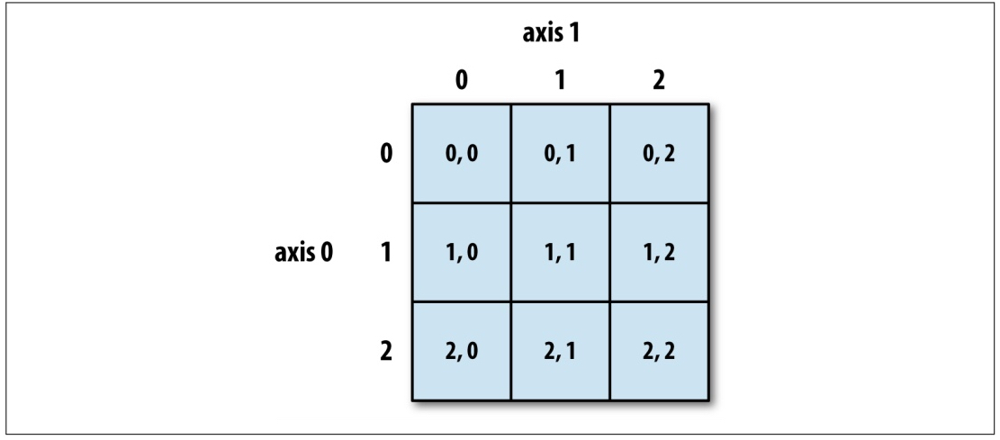
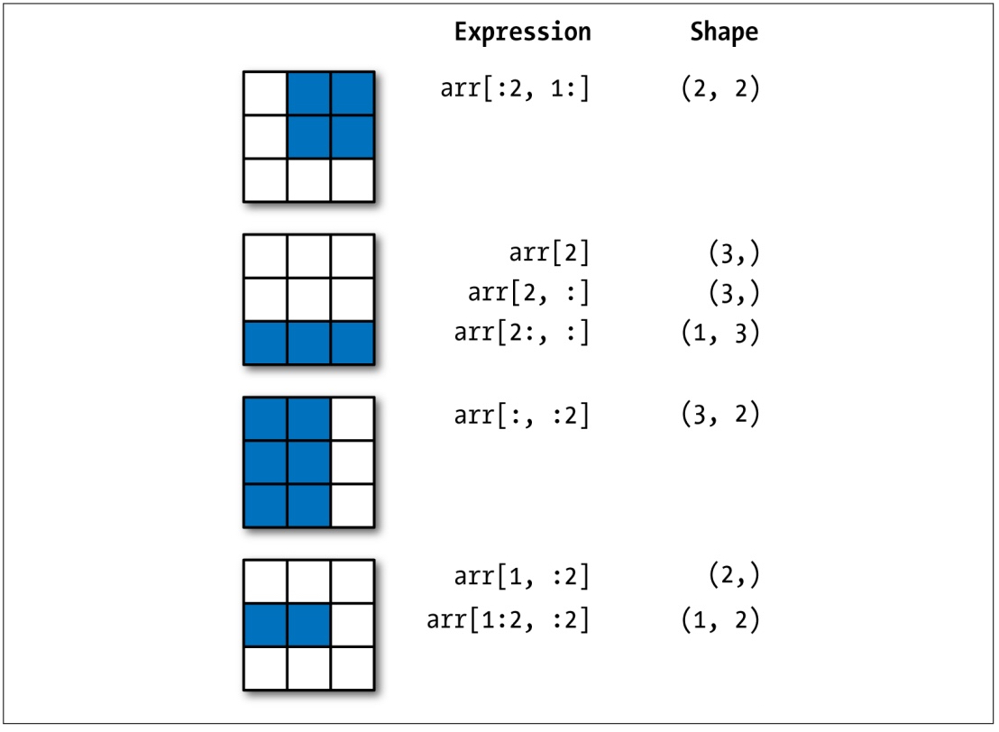
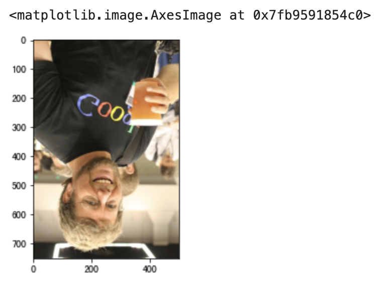
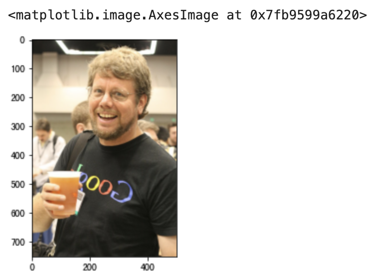

## NumPy Uygulamaları-1

> **Translated to Turkish by** himmetcanumutlu

NumPy, açık kaynaklı bir Python bilimsel hesaplama kütüphanesidir; **herhangi bir boyuttaki diziyi hızla işlemek için kullanılır**. NumPy **yaygın dizi ve matris işlemlerini destekler**; aynı sayısal hesaplama görevi için NumPy kullanmak yalnızca kodu çok daha sade yapmakla kalmaz, NumPy performans açısından da yerel Python'dan çok üstündür; en azından bir ila iki mertebe fark vardır; veri miktarı arttıkça NumPy'nin avantajı daha da belirginleşir.

NumPy'nin en çekirdek veri tipi `ndarray`dir; `ndarray` ile bir, iki ve çok boyutlu diziler işlenebilir; bu nesne hızlı ve esnek bir büyük veri kapsayıcısı gibidir. NumPy'nin alt seviye kodu C diliyle yazılmıştır; GIL sınırını çözer; `ndarray` veri saklayıp alırken veri ile verinin adresi ardışıktır; bu, yüksek verimli toplu işlem yapmayı garanti eder; performansı Python'daki `list`ten çok üstündür; öte yandan `ndarray` nesnesi veri işlemek için daha çok metot sunar; özellikle verinin istatistiksel özelliklerini alan metotlar; bu metotlar Python'un yerel `list`inde yoktur.

 ### Hazırlık

1. JupyterLab'i başlat

    ```Bash
    jupyter lab
    ```

    > **İpucu**: JupyterLab'i başlatmadan önce, veri analiziyle ilgili bağımlılıkları (üç harika ve ilgili bağımlılıklar) kurmanız önerilir. Anaconda kullanıyorsanız ayrıca kurmaya gerek yoktur; Anaconda Navigator üzerinden başlatılabilir.

2. İçe aktarma

    ```Python
    import numpy as np
    import pandas as pd
    import matplotlib.pyplot as plt
    ```

    > **Not**: JupyterLab başlatıldıysa ama ilgili bağımlılık kütüphanesi (örneğin `numpy`) kurulmadıysa, hücreye `%pip install numpy` yazıp çalıştırarak NumPy kurulabilir. Elbette hücreye `%pip install numpy pandas matplotlib` yazarak Python veri analizinin üç çekirdek üçüncü taraf kütüphanesini birden kurabiliriz. Yukarıdaki koda dikkat edin: yalnızca NumPy'yi değil, pandas ve matplotlib kütüphanelerini de içe aktardık.

### Dizi Nesnesi Oluşturma

`ndarray` nesnesi oluşturmanın birçok yolu vardır; aşağıda yaygın yöntemleri tanıtıyoruz.

Yöntem 1: `array` fonksiyonuyla `list`ten dizi nesnesi oluşturma

Kod:

```Python
array1 = np.array([1, 2, 3, 4, 5])
array1
```

Çıktı:

```
array([1, 2, 3, 4, 5])
```

Kod:

```Python
array2 = np.array([[1, 2, 3], [4, 5, 6]])
array2
```

Çıktı:

```
array([[1, 2, 3],
       [4, 5, 6]])
```

Yöntem 2: `arange` fonksiyonuyla değer aralığı ve adım belirterek dizi nesnesi oluşturma

Kod:

```Python
array3 = np.arange(0, 20, 2)
array3
```

Çıktı:

```
array([ 0,  2,  4,  6,  8, 10, 12, 14, 16, 18])
```

Yöntem 3: `linspace` fonksiyonuyla aralık ve eleman sayısı belirterek dizi nesnesi oluşturma (aritmetik dizi üretir)

Kod:

```Python
array4 = np.linspace(-1, 1, 11)
array4
```

Çıktı:

```
array([-1. , -0.8, -0.6, -0.4, -0.2,  0. ,  0.2,  0.4,  0.6,  0.8,  1. ])
```

Yöntem 4: `logspace` fonksiyonuyla geometrik dizi üretme

Kod:

```python
array5 = np.logspace(1, 10, num=10, base=2)
array5
```

> **Dikkat**: Geometrik dizinin başlangıç değeri $\small{2^1}$, bitiş değeri $\small{2^{10}}$; `num` eleman sayısı, `base` tabandır.

Çıktı:

```
array([   2.,    4.,    8.,   16.,   32.,   64.,  128.,  256.,  512., 1024.])
```

Yöntem 5: `fromstring` fonksiyonuyla string'den veri çıkarıp dizi nesnesi oluşturma

Kod:

```Python
array6 = np.fromstring('1, 2, 3, 4, 5', sep=',', dtype='i8')
array6 
```

Çıktı:

```
array([1, 2, 3, 4, 5])
```

Yöntem 6: `fromiter` fonksiyonuyla üreteçten (yineleyiciden) veri alıp dizi nesnesi oluşturma

Kod:

```Python
def fib(how_many):
    a, b = 0, 1
    for _ in range(how_many):
        a, b = b, a + b
        yield a


gen = fib(20)
array7 = np.fromiter(gen, dtype='i8')
array7
```

Çıktı:

```
array([   1,    1,    2,    3,    5,    8,   13,   21,   34,   55,   89,
        144,  233,  377,  610,  987, 1597, 2584, 4181, 6765])
```

Yöntem 7: `numpy.random` modülünün fonksiyonlarıyla rastgele sayı üretip dizi nesnesi oluşturma

10 adet $\small{[0, 1)}$ aralığında rastgele ondalık sayı üretme; kod:

```Python
array8 = np.random.rand(10)
array8
```

Çıktı:

```
array([0.45556132, 0.67871326, 0.4552213 , 0.96671509, 0.44086463,
       0.72650875, 0.79877188, 0.12153022, 0.24762739, 0.6669852 ])
```

10 adet $\small{[1, 100)}$ aralığında rastgele tam sayı üretme; kod:

```Python
array9 = np.random.randint(1, 100, 10)
array9
```

Çıktı:

```
array([29, 97, 87, 47, 39, 19, 71, 32, 79, 34])
```

20 adet $\small{\mu=50}$, $\small{\sigma=10}$ normal dağılımlı rastgele sayı üretme; kod:

```Python
array10 = np.random.normal(50, 10, 20)
array10
```

Çıktı:

```
array([55.04155586, 46.43510797, 20.28371158, 62.67884053, 61.23185964,
       38.22682148, 53.17126151, 43.54741592, 36.11268017, 40.94086676,
       63.27911699, 46.92688903, 37.1593374 , 67.06525656, 67.47269463,
       23.37925889, 31.45312239, 48.34532466, 55.09180924, 47.95702787])
```

$\small{[0, 1)}$ aralığında rastgele ondalık sayılardan oluşan 3 satır 4 sütunlu iki boyutlu dizi üretme; kod:

```Python
array11 = np.random.rand(3, 4)
array11
```

Çıktı:

```
array([[0.54017809, 0.46797771, 0.78291445, 0.79501326],
       [0.93973783, 0.21434806, 0.03592874, 0.88838892],
       [0.84130479, 0.3566601 , 0.99935473, 0.26353598]])
```

$\small{[1, 100)}$ aralığında rastgele tam sayılardan oluşan üç boyutlu dizi üretme; kod:

```Python
array12 = np.random.randint(1, 100, (3, 4, 5))
array12
```

Çıktı:

```
array([[[94, 26, 49, 24, 43],
        [27, 27, 33, 98, 33],
        [13, 73,  6,  1, 77],
        [54, 32, 51, 86, 59]],

       [[62, 75, 62, 29, 87],
        [90, 26,  6, 79, 41],
        [31, 15, 32, 56, 64],
        [37, 84, 61, 71, 71]],

       [[45, 24, 78, 77, 41],
        [75, 37,  4, 74, 93],
        [ 1, 36, 36, 60, 43],
        [23, 84, 44, 89, 79]]])
```

Yöntem 8: Tümü 0, tümü 1 veya belirtilen elemanlı dizi oluşturma

`zeros` fonksiyonu; kod:

```Python
array13 = np.zeros((3, 4))
array13
```

Çıktı:

```
array([[0., 0., 0., 0.],
       [0., 0., 0., 0.],
       [0., 0., 0., 0.]])
```

`ones` fonksiyonu; kod:

```Python
array14 = np.ones((3, 4))
array14
```

Çıktı:

```
array([[1., 1., 1., 1.],
       [1., 1., 1., 1.],
       [1., 1., 1., 1.]])
```

`full` fonksiyonu; kod:

```Python
array15 = np.full((3, 4), 10)
array15
```

Çıktı:

```
array([[10, 10, 10, 10],
       [10, 10, 10, 10],
       [10, 10, 10, 10]])
```

Yöntem 9: `eye` fonksiyonuyla birim matris oluşturma

Kod:

```Python
np.eye(4)
```

Çıktı:

```
array([[1., 0., 0., 0.],
       [0., 1., 0., 0.],
       [0., 0., 1., 0.],
       [0., 0., 0., 1.]])
```

Yöntem 10: Görsel okuyup ilgili üç boyutlu diziyi elde etme

Kod:

```Python
array16 = plt.imread('guido.jpg')
array16
```

Çıktı:

```
array([[[ 36,  33,  28],
        [ 36,  33,  28],
        [ 36,  33,  28],
        ...,
        [ 32,  31,  29],
        [ 32,  31,  27],
        [ 31,  32,  26]],

       [[ 37,  34,  29],
        [ 38,  35,  30],
        [ 38,  35,  30],
        ...,
        [ 31,  30,  28],
        [ 31,  30,  26],
        [ 30,  31,  25]],

       [[ 38,  35,  30],
        [ 38,  35,  30],
        [ 38,  35,  30],
        ...,
        [ 30,  29,  27],
        [ 30,  29,  25],
        [ 29,  30,  25]],

       ...,

       [[239, 178, 123],
        [237, 176, 121],
        [235, 174, 119],
        ...,
        [ 78,  68,  56],
        [ 75,  67,  54],
        [ 73,  65,  52]],

       [[238, 177, 120],
        [236, 175, 118],
        [234, 173, 116],
        ...,
        [ 82,  70,  58],
        [ 78,  68,  56],
        [ 75,  66,  51]],

       [[238, 176, 119],
        [236, 175, 118],
        [234, 173, 116],
        ...,
        [ 84,  70,  61],
        [ 81,  69,  57],
        [ 79,  67,  53]]], dtype=uint8)
```

> **Not**: Yukarıdaki kod mevcut yoldaki `guido.jpg` görselini okur; bilgisayar sistemindeki görsel genellikle birkaç satır ve sütundaki pikselden oluşur; her piksel de kırmızı, yeşil, mavi üç ana renkten oluşur; tam da üç boyutlu diziyle temsil edilebilir. Görsel okumak için `matplotlib` kütüphanesinin `imread` fonksiyonu kullanılır.

### Dizi Nesnesinin Özellikleri

`size` özelliği: Dizinin eleman sayısını alır.

Kod:

```Python
array17 = np.arange(1, 100, 2)
array18 = np.random.rand(3, 4)
print(array16.size)
print(array17.size)
print(array18.size)
```

Çıktı:

```
1125000
50
12
```

`shape` özelliği: Dizinin şeklini alır.

Kod:

```Python
print(array16.shape)
print(array17.shape)
print(array18.shape)
```

Çıktı:

```
(750, 500, 3)
(50,)
(3, 4)
```

`dtype` özelliği: Dizi elemanının veri tipini alır.

Kod:

```Python
print(array16.dtype)
print(array17.dtype)
print(array18.dtype)
```

Çıktı:

```
uint8
int64
float64
```

`ndarray` nesnesi elemanının veri tipleri için aşağıdaki tabloya bakın.


`ndim` özelliği: Dizinin boyutunu alır.

Kod:

```Python
print(array16.ndim)
print(array17.ndim)
print(array18.ndim)
```

Çıktı:

```
3
1
2
```

`itemsize` özelliği: Dizinin tek elemanının bellek alanında kapladığı bayt sayısını alır.

Kod:

```Python
print(array16.itemsize)
print(array17.itemsize)
print(array18.itemsize)
```

Çıktı:

```
1
8
8
```

`nbytes` özelliği: Dizinin tüm elemanlarının bellek alanında kapladığı bayt sayısını alır.

Kod:

```Python
print(array16.nbytes)
print(array17.nbytes)
print(array18.nbytes)
```

Çıktı:

```
1125000
400
96
```

### Dizinin İndeks İşlemleri

Python'daki liste gibi, NumPy'nin `ndarray` nesnesi de indeks ve dilim işlemi yapabilir; indeksle dizideki eleman alınır veya değiştirilir; dilimle dizinin bir kısmı alınır; dilim işlemine dilim indeksleme de deriz.

#### Normal İndeksleme

Python'daki `list` tipinin indeks işlemine benzer.

Kod:

```Python
array19 = np.arange(1, 10)
print(array19[0], array19[array19.size - 1])
print(array19[-array20.size], array19[-1])
```

Çıktı:

```
1 9
1 9
```

Kod:

```Python
array20 = np.array([[1, 2, 3], [4, 5, 6], [7, 8, 9]])
array20[2]
```

Çıktı:

```
array([7, 8, 9])
```

Kod:

```Python
print(array20[0][0])
print(array20[-1][-1])
```

Çıktı:

```
1
9
```

Kod:

```Python
print(array20[1][1])
print(array20[1, 1])
```

Çıktı:

```
5
5
```

Kod:

```Python
array20[1][1] = 10
array20
```

Çıktı:

```
array([[ 1,  2,  3],
       [ 4, 10,  6],
       [ 7,  8,  9]])
```

Kod:

```Python
array20[1] = [10, 11, 12]
array20
```

Çıktı:

```
array([[ 1,  2,  3],
       [10, 11, 12],
       [ 7,  8,  9]])
```

#### Dilim İndeksleme

Dilim indeksleme `[başlangıç indeksi:bitiş indeksi:adım]` biçimindeki sözdizimidir; **başlangıç indeksi** (varsayılan eksi sonsuz), **bitiş indeksi** (varsayılan artı sonsuz) ve **adımı** (varsayılan 1) belirterek diziden belirtilen kısmın elemanları alınıp yeni dizi oluşturulur. Başlangıç, bitiş indeksi ve adımın varsayılan değeri olduğundan hepsi atlanabilir; adım belirtilmezse ikinci iki nokta da atlanabilir. Tek boyutlu dizinin dilim işlemi Python'daki `list`in dilimine çok benzer; burada tekrar anlatmayacağız; iki boyutlu dizinin dilimi için aşağıdaki koda bakın; anlaşılması çok kolaydır.

Kod:

```Python
array20[:2, 1:]
```

Çıktı:

```
array([[ 2,  3],
       [11, 12]])
```

Kod:

```Python
array20[2, :]
```

Çıktı:

```
array([7, 8, 9])
```

Kod:

```Python
array20[2:, :]
```

Çıktı:

```
array([[7, 8, 9]])
```

Kod:

```Python
array20[:, :2]
```

Çıktı:

```
array([[ 1,  2],
       [10, 11],
       [ 7,  8]])
```

Kod:

```Python
array20[::2, ::2]
```

Çıktı:

```
array([[1, 3],
       [7, 9]])
```

Kod:

```Python
array20[::-2, ::-2]
```

Çıktı:

```
array([[9, 7],
       [3, 1]])
```

Dizinin indeks ve dilim işlemi hakkında aşağıdaki iki görselle izlenim güçlendirilebilir; bu iki görsel [《Python ile Veri Analizi》](https://item.jd.com/12398725.html) kitabından alınmıştır; kitap, pandas kütüphanesinin yazarı Wes McKinney'nin kaleme aldığı Python veri analizi alanının klasik ders kitabıdır; merak edenler orijinali satın alıp okuyabilir.

Şekil 1: İki boyutlu dizinin normal indekslemesi



Şekil 2: İki boyutlu dizinin dilim indekslemesi



#### Fancy İndeksleme

Fancy indeksleme, tam sayı saklayan diziyi bir dizinin indeksi olarak kullanmaktır; buradaki dizi NumPy'nin `ndarray`i olabileceği gibi Python'daki `list`, `tuple` gibi yinelenebilir tipler de olabilir; pozitif veya negatif indeks kullanılabilir.

Kod:

```Python
array19[[0, 1, 1, -1, 4, -1]]
```

Çıktı:

```
array([1, 2, 2, 9, 5, 9])
```

Kod:

```Python
array20[[0, 2]]
```

Çıktı:

```
array([[1, 2, 3],
       [7, 8, 9]])
```

Kod:

```Python
array20[[0, 2], [1, 2]]
```

Çıktı:

```
array([2, 9])
```

Kod:

```Python
array20[[0, 2], 1]
```

Çıktı:

```
array([2, 8])
```

#### Boolean İndeksleme

Boolean indeksleme, mantıksal değer saklayan diziyi bir dizinin indeksi olarak kullanmaktır; `True` olan elemanlar korunur, `False` olanlar seçilmez. Mantıksal değer dizisi elle oluşturulabileceği gibi ilişki işlemiyle de üretilebilir.

Kod:

```Python
array19[[True, True, False, False, True, False, False, True, True]]
```

Çıktı:

```
array([1, 2, 5, 8, 9])
```

Kod:

```Python
array19 > 5
```

Çıktı:

```
array([False, False, False, False, False,  True,  True,  True,  True])
```

Kod:

```Python
~(array19 > 5)
```

Çıktı:

```
array([ True,  True,  True,  True,  True, False, False, False, False])
```

> **Not**: `~` operatörü mantıksal dizideki değerleri mantıksal olarak ters çevirir; yani `True` `False`'a, `False` `True`'ya döner.

Kod:

```Python
array19[array19 > 5]
```

Çıktı:

```
array([6, 7, 8, 9])
```

Kod:

```Python
array19 % 2 == 0
```

Çıktı:

```
array([False,  True, False,  True, False,  True, False,  True, False])
```

Kod:

```Python
array19[array19 % 2 == 0]
```

Çıktı:

```
array([2, 4, 6, 8])
```

Kod:

```Python
(array19 > 5) & (array19 % 2 == 0)
```

Çıktı:

```
array([False, False, False, False, False,  True, False,  True, False])
```

> **Not**: `&` operatörü iki mantıksal diziye uygulanabilir; iki dizinin karşılık gelen elemanı da `True` ise sonuç `True`, aksi halde `False`'tır; bu operatörün kuralı Python'daki `and` operatörüne benzer; yalnızca etki ettiği nesne iki mantıksal dizidir.

Kod:

```Python
array19[(array19 > 5) & (array19 % 2 == 0)]
```

Çıktı:

```
array([6, 8])
```

Kod:

```Python
array19[(array19 > 5) | (array19 % 2 == 0)]
```

Çıktı:

```
array([2, 4, 6, 7, 8, 9])
```

> **Not**: `|` operatörü iki mantıksal diziye uygulanabilir; iki dizinin karşılık gelen elemanı da `False` ise sonuç `False`, aksi halde `True`'dur; bu operatörün kuralı Python'daki `or` operatörüne benzer; yalnızca etki ettiği nesne iki mantıksal dizidir.

Kod:

```Python
array20[array21 % 2 != 0]
```

Çıktı:

```
array([1, 3, 5, 7, 9])
```

İndeks işlemi hakkında şunu belirtmek gerekir: dilim indeksleme yeni dizi nesnesi oluştursa da, yeni dizi ile asıl dizi veriyi paylaşır; basitçe, yeni dizi nesnesiyle veya asıl dizi nesnesiyle dizideki veriyi değiştirirseniz, aslında bellekteki aynı veriyi değiştirmiş olursunuz. Fancy indeksleme ve boolean indeksleme de yeni dizi nesnesi oluşturur; ama yeni dizi asıl dizinin elemanlarını kopyalar; yeni dizi ile asıl dizi veri paylaşımı ilişkisinde değildir; bunu dizi nesnesinin `base` özelliğine bakarak görebilirsiniz; merak edenler kendileri inceleyebilir.

### Örnek: Dizi Dilimlemeyle Görüntü İşleme

Temel bilgi öğrenmek hep sıkıcı ve başarı duygusuzdur; o yüzden bir örnekle, yukarıda öğrendiğimiz dizi indeks ve dilim işleminin ne işe yaradığını gösterelim. Daha önce görselin üç boyutlu diziyle temsil edilebileceğini söylemiştik; o zaman görsele karşılık gelen üç boyutlu diziyle işlem yapıp görseli işleyebiliriz; aşağıdaki gibidir.

Görseli okuyup üç boyutlu dizi nesnesi oluşturma.

```Python
guido_image = plt.imread('guido.jpg')
plt.imshow(guido_image)
```


Dizinin 0. ekseninde ters dilim yapıp görselin dikey çevrilmesini sağlama.

```Python
plt.imshow(guido_image[::-1])
```



Dizinin 1. ekseninde ters dilim yapıp görselin yatay çevrilmesini sağlama.

```Python
plt.imshow(guido_image[:,::-1])
```



Dilimleme ile görseli kesip Guido amcanın kafasını çıkarma.

```Python
plt.imshow(guido_image[30:350, 90:300])
```


Dilimleme ile alt örnekleme (downsampling) yapma.

```Python
plt.imshow(guido_image[::10, ::10])
```


