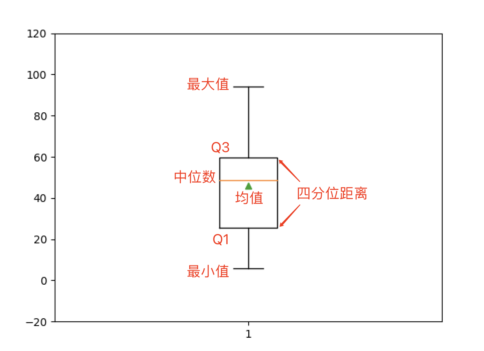
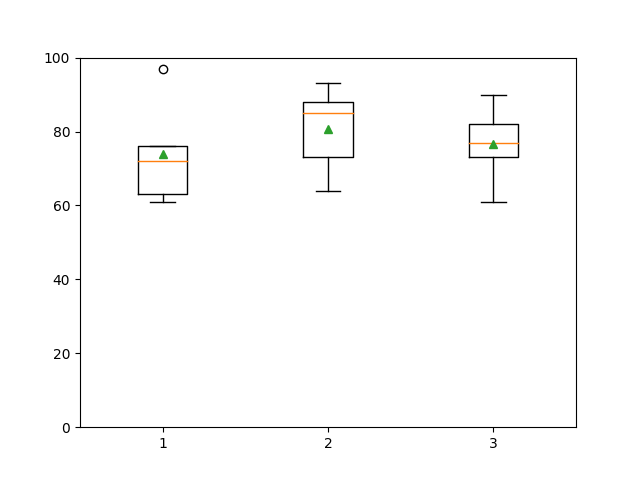

## NumPy Uygulamaları-2

> **Translated to Turkish by** himmetcanumutlu

### Dizi Nesnesinin Metotları

#### Tanımlayıcı İstatistik Bilgilerini Alma

Tanımlayıcı istatistikler esas olarak verinin merkezi eğilimini, yayılımını ve sıklık analizini içerir; merkezi eğilimde ortalamaya ve medyana, yayılımda uç değer, varyans, standart sapma gibi değerlere bakılır.

```Python
array1 = np.random.randint(1, 100, 10)
array1
```

Çıktı:

```
array([46, 51, 15, 42, 53, 71, 20, 62,  6, 94])
```

**Toplam, ortalama ve medyanı hesaplama.**

Kod:

```Python
print(array1.sum())
print(np.sum(array1))
print(array1.mean())
print(np.mean(array1))
print(np.median(array1))
print(np.quantile(array1, 0.5))
```

> **Not**: Yukarıdaki koddaki `mean`, `median` ve `quantile` sırasıyla NumPy'de aritmetik ortalama, medyan ve yüzdelik hesaplayan fonksiyonlardır; `quantile` fonksiyonunun ikinci parametresinin 0.5 olması %50 yüzdeliği, yani medyanı hesaplar.

Çıktı:

```
460
460
46.0
46.0
48.5
48.5
```

**Uç değer, ranj ve çeyrekler arası aralık.**

Kod:

```Python
print(array1.max())
print(np.amax(array1))
print(array1.min())
print(np.amin(array1))
print(np.ptp(array1))
print(np.ptp(array1))
q1, q3 = np.quantile(array1, [0.25, 0.75])
print(q3 - q1)
```

Çıktı:

```
94
94
6
6
88
88
34.25
```

**Varyans, standart sapma ve değişim katsayısı.**

Kod:

```Python
print(array1.var())
print(np.var(array1))
print(array1.std())
print(np.std(array1))
print(array1.std() / array1.mean())
```

Çıktı:

```
651.2
651.2
25.51862065237853
25.51862065237853
0.5547526228777941
```

**Kutu grafiği çizme.**

Kutu grafiği, kutu-bıyık grafiği olarak da adlandırılır; bir grup verinin yayılımını gösteren istatistik grafiğidir; kutu şeklinden dolayı bu adı almıştır. Esas olarak ham verinin dağılım özelliklerini yansıtır; ayrıca birden çok veri grubunun dağılım özelliğini karşılaştırabilir.

Kod:

```Python
plt.boxplot(array1, showmeans=True)
plt.ylim([-20, 120])
plt.show()
```

Çıktı:



Dikkate değer olan, iki boyutlu veya daha yüksek boyutlu dizilerde tanımlayıcı istatistik alırken `axis` adlı parametreyle ortalama, varyans gibi işlemlerin hangi eksen boyunca yapılacağının belirtilebilmesidir; `axis` parametresi farklı olduğunda sonuç çok farklı olabilir; aşağıdaki gibidir.

Kod:

```Python
array2 = np.random.randint(60, 101, (5, 3))
array2
```

Çıktı:

```
array([[72, 64, 73],
       [61, 73, 61],
       [76, 85, 77],
       [97, 88, 90],
       [63, 93, 82]])
```

Kod:

```Python
array2.mean()
```

Çıktı:

```
77.0
```

Kod:

```Python
array2.mean(axis=0)
```

Çıktı:

```
array([73.8, 80.6, 76.6])
```

Kod:

```Python
array2.mean(axis=1)
```

Çıktı:

```
array([69.66666667, 65.        , 79.33333333, 91.66666667, 79.33333333])
```

Kod:

```Python
array2.max(axis=0)
```

Çıktı:

```
array([97, 93, 90])
```

Kod:

```Python
array2.max(axis=1)
```

Çıktı:

```
array([73, 73, 85, 97, 93])
```

Kutu grafiğine tekrar bakalım; iki boyutlu dizide her sütun bir istatistik grafiği üretir; aşağıdaki gibidir.

Kod:

```Python
plt.boxplot(array2, showmeans=True)
plt.ylim([-20, 120])
plt.show()
```

Çıktı:



> **Not**: Kutu grafiğindeki küçük daireler aykırı değerleri gösterir; yani $\small{Q_3 + 1.5 \times IQR}$'dan büyük veya $\small{Q_1 - 1.5 \times IQR}$'dan küçük değerlerdir. Formüldeki 1.5 sabiti, kutu grafiği çizen `boxplot` fonksiyonunun `whis` parametresiyle değiştirilebilir; yaygın değerler 1.5 ve 3'tür; 3 yapmak genellikle aşırı aykırı değerleri işaretlemek içindir.

Belirtmek gerekir ki NumPy'nin dizi nesnesi geometrik ortalama, harmonik ortalama, kırpılmış ortalama gibi metotlar sunmaz; bu ihtiyaçlar için `scipy` adlı üçüncü taraf kütüphane kullanılabilir; onun `stats` modülü bu fonksiyonları sunar. Ayrıca bu modül mod, değişim katsayısı, çarpıklık ve basıklık hesaplayan fonksiyonlar da sunar; kod aşağıdaki gibidir.

Kod:

```python
from scipy import stats

print(np.mean(array1))                # Aritmetik ortalama
print(stats.gmean(array1))            # Geometrik ortalama
print(stats.hmean(array1))            # Harmonik ortalama
print(stats.tmean(array1, [10, 90]))  # Kırpılmış ortalama
print(stats.variation(array1))        # Değişim katsayısı
print(stats.skew(array1))             # Çarpıklık katsayısı
print(stats.kurtosis(array1))         # Basıklık katsayısı
```

Çıktı:

```
46.0
36.22349548825599
24.497219530825497
45.0
0.5547526228777941
0.11644192634527782
-0.7106251396024126
```

#### Diğer İlgili Metotlara Genel Bakış

1. `all()` / `any()` metodu: Dizinin tüm elemanlarının `True` olup olmadığını / dizide `True` olan eleman olup olmadığını belirler.

2. `astype()` metodu: Diziyi kopyalayıp elemanları belirtilen tipe dönüştürür.

3. `reshape()` metodu: Dizi nesnesinin şeklini ayarlar.

4. `dump()` metodu: Diziyi ikili dosyaya kaydeder; NumPy'deki `load()` fonksiyonuyla kaydedilen dosyadan veri yükleyip dizi oluşturulabilir.

     Kod:

    ```Python
    array.dump('array1-data')
    array3 = np.load('array1-data', allow_pickle=True)
    array3
    ```

     Çıktı:

    ```
    array([46, 51, 15, 42, 53, 71, 20, 62,  6, 94])
    ```

5. `tofile()` metodu: Dizi nesnesini dosyaya yazar.

   ```Python
   array1.tofile('array.txt', sep=',')
   ```

6. `fill()` metodu: Diziye belirtilen elemanı doldurur.

7. `flatten()` metodu: Çok boyutlu diziyi tek boyutlu diziye düzleştirir.

     Kod:

    ```Python
    array2.flatten()
    ```

     Çıktı:

    ```
    array([1, 2, 3, 4, 5, 6, 7, 8, 9])
    ```

8. `nonzero()` metodu: Sıfır olmayan elemanların indeksini döndürür.

9. `round()` metodu: Dizideki elemanları yuvarlar.

10. `sort()` metodu: Diziyi yerinde sıralar.

     Kod:

    ```Python
    array1.sort()
    array1
    ```

     Çıktı:

    ```
    array([ 6, 15, 20, 42, 46, 51, 53, 62, 71, 94])
    ```

11. `swapaxes()` ve `transpose()` metodu: Dizinin belirtilen eksenini değiştirir ve devriğini alır.

     Kod:

    ```Python
    array2.swapaxes(0, 1)
    ```

     Çıktı:

    ```
    array([[1, 4, 7],
           [2, 5, 8],
           [3, 6, 9]])
    ```

     Kod:

    ```Python
    array2.transpose()
    ```

     Çıktı:

    ```
    array([[1, 4, 7],
           [2, 5, 8],
           [3, 6, 9]])
    ```

12. `tolist()` metodu: Diziyi Python'daki `list`e dönüştürür.

     Kod:

    ```Python
    print(array2.tolist())
    print(type(array2.tolist()))
    ```

     Çıktı:

    ```
    [[1, 2, 3], [4, 5, 6], [7, 8, 9]]
    <class 'list'>
    ```
