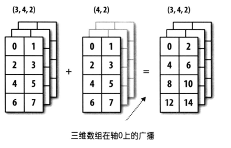
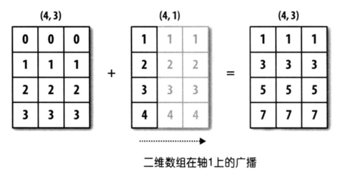

## NumPy Uygulamaları-3

> **Translated to Turkish by** himmetcanumutlu

### Dizinin İşlemleri

NumPy kullanmanın en pratik yanı, dizi elemanına işlem yapılırken her elemanı gezen döngü kodu yazmaya gerek olmamasıdır; tüm işlemler otomatik **vektörleştirilir**. Basitçe söylemek gerekirse NumPy'deki matematik işlemleri ve fonksiyonları otomatik olarak dizideki her üyeye uygulanır.

#### Dizi ile Skaler İşlemler

NumPy'nin dizisi bir sayıyla toplama, çıkarma, çarpma, bölme, mod, üs alma gibi işlemler yapabilir; ilgili işlem dizinin her elemanına uygulanır; aşağıdaki gibidir.

Kod:

```python
array1 = np.arange(1, 10)
print(array1 + 10)
print(array1 * 10)
```

Çıktı:

```
[11 12 13 14 15 16 17 18 19]
[10 20 30 40 50 60 70 80 90]
```

Yukarıdaki işlemler dışında ilişki işlemi de sorunsuzdur; daha önce boolean indekslemede karşılaşmıştık.

Kod:

```python
print(array1 > 5)
print(array1 % 2 == 0)
```

Çıktı:

```
[False False False False False  True  True  True  True]
[False  True False  True False  True False  True False]
```

#### Dizi ile Dizi İşlemleri

NumPy'nin dizisi diziyle de aritmetik ve ilişki işlemi yapabilir; işlem iki dizinin karşılık gelen elemanına uygulanır; bu, iki dizinin şeklinin (`shape` özelliğinin) aynı olmasını gerektirir; aşağıdaki gibidir.

Kod:

```python
array2 = np.array([1, 1, 1, 2, 2, 2, 3, 3, 3])
print(array1 + array2)
print(array1 * array2)
print(array1 ** array2)
```

Çıktı:

```
[ 2  3  4  6  7  8 10 11 12]
[ 1  2  3  8 10 12 21 24 27]
[  1   2   3  16  25  36 343 512 729]
```

Kod:

```python
print(array1 > array2)
print(array1 % array2 == 0)
```

Çıktı:

```
[False  True  True  True  True  True  True  True  True]
[ True  True  True  True False  True False False  True]
```

#### Evrensel Tekli Fonksiyonlar

NumPy'deki evrensel tekli fonksiyonların parametresi bir dizi nesnesidir; fonksiyon diziye eleman düzeyinde işlem yapar; örneğin `sqrt` fonksiyonu dizideki her elemanın karekökünü hesaplar, `log2` fonksiyonu dizideki her elemanın 2 tabanlı logaritmasını hesaplar; kod aşağıdaki gibidir.

Kod:

```python
print(np.sqrt(array1))
print(np.log2(array1))
```

Çıktı:

```
[1.         1.41421356 1.73205081 2.         2.23606798 2.44948974
 2.64575131 2.82842712 3.        ]
[0.         1.         1.5849625  2.         2.32192809 2.5849625
 2.80735492 3.         3.169925  ]
```

**Tablo 1: Evrensel tekli fonksiyonlar**

| Fonksiyon                             | Açıklama                                             |
| -------------------------------- | ------------------------------------------------ |
| `abs` / `fabs`                   | Mutlak değer fonksiyonu                                   |
| `sqrt`                           | Karekök fonksiyonu, `array ** 0.5`'e denktir            |
| `square`                         | Kare fonksiyonu, `array ** 2`'ye denktir                 |
| `exp`                            | $\small{e^x}$ hesaplayan fonksiyon, `np.e ** array`'e denktir |
| `log` / `log10` / `log2`         | Logaritma fonksiyonu (`e` tabanlı / `10` tabanlı / `2` tabanlı)         |
| `sign`                           | İşaret fonksiyonu (`1` - pozitif; `0` - sıfır; `-1` - negatif)    |
| `ceil` / `floor`                 | Yukarı yuvarlama / aşağı yuvarlama                                 |
| `isnan`                          | Mantıksal dizi döndürür; NaN `True`, NaN olmayan `False`    |
| `isfinite` / `isinf`             | Değerin sonsuz olup olmadığını belirleyen fonksiyon                         |
| `cos` / `cosh` / `sin`           | Trigonometrik fonksiyonlar                                         |
| `sinh` / `tan` / `tanh`          | Trigonometrik fonksiyonlar                                         |
| `arccos` / `arccosh` / `arcsin`  | Ters trigonometrik fonksiyonlar                                       |
| `arcsinh` / `arctan` / `arctanh` | Ters trigonometrik fonksiyonlar                                       |
| `rint` / `round`                 | Yuvarlama fonksiyonu                                     |

#### Evrensel İkili Fonksiyonlar

NumPy'deki evrensel ikili fonksiyonların parametreleri iki dizi nesnesidir; fonksiyon iki dizideki karşılık gelen elemana işlem yapar; örneğin `maximum` fonksiyonu iki dizideki karşılık gelen elemanların maksimumunu bulur, `power` fonksiyonu iki dizideki karşılık gelen elemanlara üs alma işlemi yapar; kod aşağıdaki gibidir.

Kod:

```python
array3 = np.array([[4, 5, 6], [7, 8, 9]])
array4 = np.array([[1, 2, 3], [3, 2, 1]])
print(np.maximum(array3, array4))
print(np.power(array3, array4))
```

Çıktı:

```
[[4 5 6]
 [7 8 9]]
[[  4  25 216]
 [343  64   9]]
```

**Tablo 2: Evrensel ikili fonksiyonlar**

| Fonksiyon                               | Açıklama                                                         |
| ---------------------------------- | ------------------------------------------------------------ |
| `add(x, y)` / `substract(x, y)`    | Toplama fonksiyonu / çıkarma fonksiyonu                                          |
| `multiply(x, y)` / `divide(x, y)`  | Çarpma fonksiyonu / bölme fonksiyonu                                          |
| `floor_divide(x, y)` / `mod(x, y)` | Tam bölme fonksiyonu / mod fonksiyonu                                          |
| `allclose(x, y)`                   | `x` ve `y` dizilerinin elemanlarının neredeyse eşit olup olmadığını kontrol eder                             |
| `power(x, y)`                      | `x` dizisinin $\small{x_{i}}$ elemanı ve `y` dizisinin $\small{y_{i}}$ elemanıyla $\small{x_{i}^{y_{i}}}$ hesaplar |
| `maximum(x, y)` / `fmax(x, y)`     | Elemanları ikişerli karşılaştırıp maksimum alır / maksimum alır (NaN yok sayılır)               |
| `minimum(x, y)` / `fmin(x, y)`     | Elemanları ikişerli karşılaştırıp minimum alır / minimum alır (NaN yok sayılır)               |
| `dot(x, y)`                        | Nokta çarpım (skaler çarpım, genellikle $\small{\cdot}$ ile gösterilir; Öklid uzayında kullanılır) |
| `inner(x, y)`                      | İç çarpım (iç çarpımın anlamı nokta çarpımdan üst düzeydedir; nokta çarpım iç çarpımın Öklid uzayı $\small{\mathbb{R}^{n}}$'deki özel durumudur; iç çarpım normlu vektör uzayına genellenebilir) |
| `cross(x, y) `                     | Çapraz çarpım (vektörel çarpım, genellikle $\small{\times}$ ile gösterilir; sonuç bir vektördür)     |
| `outer(x, y)`                      | Dış çarpım (tensör çarpım, genellikle $\small{\bigotimes}$ ile gösterilir; sonuç genellikle bir matristir) |
| `intersect1d(x, y)`                | `x` ve `y`'nin kesişimini hesaplar; bu elemanlardan oluşan sıralı dizi döndürür               |
| `union1d(x, y)`                    | `x` ve `y`'nin birleşimini hesaplar; bu elemanlardan oluşan sıralı dizi döndürür               |
| `in1d(x, y)`                       | `x`'in elemanlarının `y`'de olup olmadığını belirleyen mantıksal değer dizisi döndürür        |
| `setdiff1d(x, y)`                  | `x` ve `y`'nin farkını hesaplar; bu elemanlardan oluşan dizi döndürür                   |
| `setxor1d(x, y)`                   | `x` ve `y`'nin simetrik farkını hesaplar; bu elemanlardan oluşan dizi döndürür                 |

>**Not**: Vektör ve matris işlemlerini bir sonraki bölümde açıklıyoruz.

#### Yayın (Broadcasting) Mekanizması

Yukarıdaki dizi işlem örneklerinde iki dizinin şekli (`shape` özelliği) tamamen aynıydı; şimdi farklı şekildeki iki dizinin doğrudan ikili işlem veya evrensel ikili fonksiyonla işlem yapıp yapamayacağını inceleyelim; aşağıdaki örneğe bakın.

Kod:

```python
array5 = np.array([[0, 0, 0], [1, 1, 1], [2, 2, 2], [3, 3, 3]])
array6 = np.array([1, 2, 3])
array5 + array6
```

Çıktı:

```
array([[1, 2, 3],
       [2, 3, 4],
       [3, 4, 5],
       [4, 5, 6]])
```

Kod:

```python
array7 = np.array([[1], [2], [3], [4]])
array5 + array7
```

Çıktı:

```
array([[1, 1, 1],
       [3, 3, 3],
       [5, 5, 5],
       [7, 7, 7]])
```

Yukarıdaki örnekten, farklı şekildeki dizilerin de ikili işlem yapma şansı olduğunu görürüz; ama bu, herhangi şekildeki dizilerin ikili işlem yapabileceği anlamına gelmez. Basitçe söylemek gerekirse yalnızca iki dizinin arka kenar boyutu aynıysa veya arka kenar boyutu farklı ama bir dizinin arka kenar boyutu 1 ise yayın mekanizması tetiklenir. Yayın mekanizmasıyla NumPy, şekilleri farklı iki diziyi aynı şekle getirip ikili işlem yapar. Arka kenar boyutu, dizinin şeklinin (`shape` özelliğinin) arkadan öne doğru karşılık gelen kısmıdır; örnekle açıklayalım.


Yukarıdaki şekilde bir dizinin şekli `(4, 3)`, diğerinin şekli `(3, )`; arkadan öne doğru karşılık gelen kısım `3`; arka kenar boyutu aynı; yayın mekanizması uygulanabilir; ikinci dizi eksik eleman olan eksen yönünde kendini yayınlayıp sonunda iki dizinin şeklini aynı yapar.



Yukarıdaki şekilde bir dizinin şekli `(3, 4, 2)`, diğerinin şekli `(4, 2)`; arkadan öne doğru karşılık gelen kısım `(4, 2)`; arka kenar boyutu aynı; yayın mekanizması uygulanabilir; ikinci dizi eksik eleman olan eksen yönünde kendini yayınlayıp sonunda iki dizinin şeklini aynı yapar.



Yukarıdaki şekilde bir dizinin şekli `(4, 3)`, diğerinin şekli `(4, 1)`; bu, arka kenar boyutunun farklı olduğu durumdur; ama ikinci dizinin birinci diziden farklı yeri `1`'dir; ikinci dizi `1` olan o eksen boyunca kendini yayınlayıp sonunda iki dizinin şeklini aynı yapar.

> **Düşünce**: 3 satır 1 sütunluk iki boyutlu dizi ile 1 satır 3 sütunluk iki boyutlu dizi toplama işlemi yapabilir mi?

### Diğer Yaygın Fonksiyonlar

Yukarıdaki fonksiyonlar dışında NumPy diziyi işlemek için birçok fonksiyon daha sunar; `ndarray` nesnesinin birçok metodu da fonksiyon çağırılarak gerçekleştirilebilir; aşağıdaki tabloda bazı yaygın fonksiyonlar var.

**Tablo 3: NumPy diğer yaygın fonksiyonlar**

| Fonksiyon                           | Açıklama                                             |
| ------------------------------ | ------------------------------------------------ |
| `unique`                       | Dizideki yinelenen elemanları kaldırır; benzersiz elemanlardan oluşan sıralı dizi döndürür     |
| `copy`                         | Diziyi kopyalayıp elde edilen diziyi döndürür                           |
| `sort`                         | Dizi elemanları sıralandıktan sonraki kopyayı döndürür                         |
| `split` / `hsplit` / `vsplit`  | Diziyi birkaç alt diziye böler                           |
| `stack` / `hstack` / `vstack`  | Birden çok diziyi yeni diziye yığar                           |
| `concatenate`                  | Belirtilen eksen boyunca birden çok diziyi birleştirip yeni dizi oluşturur               |
| `append` / `insert`            | Dizi sonuna eleman ekler / dizinin belirtilen yerine eleman ekler      |
| `argwhere`                     | Dizideki sıfır olmayan elemanların konumunu bulur                          |
| `extract` / `select` / `where` | Belirtilen koşula göre diziden eleman çıkarır veya elemanı işler         |
| `flip`                         | Belirtilen eksen boyunca dizideki elemanları çevirir                       |
| `fromregex`                    | Dosya okuyup düzenli ifadeyle ayrıştırıp veri alarak dizi nesnesi oluşturur |
| `repeat` / `tile`              | Elemanı tekrarlayarak yeni dizi oluşturur                     |
| `roll`                         | Belirtilen eksen boyunca dizi elemanlarını kaydırır                       |
| `resize`                       | Dizinin boyutunu yeniden ayarlar                               |
| `place` / `put`                | Dizideki koşulu sağlayan / belirtilen elemanları belirtilen değerle değiştirir  |
| `partition`                    | Seçilen elemanla diziyi bir kez böler ve bölünmüş diziyi döndürür |

**Yineleneni kaldırma (yinelenen elemandan yalnızca biri kalır)**.

Kod:

```python
np.unique(array5)
```

Çıktı:

```
array([0, 1, 2, 3])
```

**Yığma ve birleştirme**.

Kod:

```python
array8 = np.array([[1, 1, 1], [2, 2, 2], [3, 3, 3]])
array9 = np.array([[4, 4, 4], [5, 5, 5], [6, 6, 6]])
np.hstack((array8, array9))
```

Çıktı:

```
array([[1, 1, 1, 4, 4, 4],
       [2, 2, 2, 5, 5, 5],
       [3, 3, 3, 6, 6, 6]])
```

Kod:

```python
np.vstack((array8, array9))
```

Çıktı:

```
array([[1, 1, 1],
       [2, 2, 2],
       [3, 3, 3],
       [4, 4, 4],
       [5, 5, 5],
       [6, 6, 6]])
```

Kod:

```python
np.concatenate((array8, array9))
```

Çıktı:

```
array([[1, 1, 1],
       [2, 2, 2],
       [3, 3, 3],
       [4, 4, 4],
       [5, 5, 5],
       [6, 6, 6]])
```

Kod:

```python
np.concatenate((array8, array9), axis=1)
```

Çıktı:

```
array([[1, 1, 1, 4, 4, 4],
       [2, 2, 2, 5, 5, 5],
       [3, 3, 3, 6, 6, 6]])
```

**Eleman ekleme ve araya ekleme**.

Kod:

```python
np.append(array1, [10, 100])
```

Çıktı:

```
array([  1,   2,   3,   4,   5,   6,   7,   8,   9,  10, 100])
```

Kod:

```python
np.insert(array1, 1, [98, 99, 100])
```

Çıktı:

```
array([  1,  98,  99, 100,   2,   3,   4,   5,   6,   7,   8,   9])
```

**Eleman çıkarma ve işleme**.

Kod:

```python
np.extract(array1 % 2 != 0, array1)
```

Çıktı:

```
array([1, 3, 5, 7, 9])
```

> **Not**: Yukarıdaki `extract` fonksiyonunun işlemi, daha önce anlattığımız boolean indekslemeye denktir.

Kod:

```python
np.select([array1 <= 3, array1 >= 7], [array1 * 10, array1 ** 2])
```

Çıktı:

```
array([10, 20, 30,  0,  0,  0, 49, 64, 81])
```

> **Not**: Yukarıdaki `select` fonksiyonunun ilk parametresi iki koşul belirler; ilk koşulu sağlayan elemanlara 10'la çarpma, ikinci koşulu sağlayan elemanlara kare alma işlemi uygulanır; iki koşulu da sağlayamayan elemanlar 0 olur.

Kod:

```python
np.where(array1 <= 5, array1 * 10, array1 ** 2)
```

Çıktı:

```
array([10, 20, 30, 40, 50, 36, 49, 64, 81])
```

> **Not**: Yukarıdaki `where` fonksiyonunun ilk parametresi koşulu verir; koşulu sağlayan elemanlara 10'la çarpma, sağlamayanlara kare alma işlemi uygulanır.

**Dizi elemanını tekrarlayıp yeni dizi oluşturma**.

Kod:

```python
np.repeat(array1, 3)
```

Çıktı:

```
array([1, 1, 1, 2, 2, 2, 3, 3, 3, 4, 4, 4, 5, 5, 5, 6, 6, 6, 7, 7, 7, 8, 8, 8, 9, 9, 9])
```

Kod:

```python
np.tile(array1, 2)
```

Çıktı:

```
array([1, 2, 3, 4, 5, 6, 7, 8, 9, 1, 2, 3, 4, 5, 6, 7, 8, 9])
```

**Dizi boyutunu ayarlama**.

Kod:

```python
np.resize(array1, (5, 3))
```

Çıktı:

```
array([[1, 2, 3],
       [4, 5, 6],
       [7, 8, 9],
       [1, 2, 3],
       [4, 5, 6]])
```

> **İpucu**: `array1` aslında 9 elemanlı tek boyutlu dizidir; `resize` fonksiyonuyla 5 satır 3 sütun toplam 15 elemanlı iki boyutlu diziye ayarlandı; eksik elemanlar asıl dizinin elemanları yeniden kullanılarak doldurulur.

Kod:

```python
 np.resize(array5, (2, 4))
```

Çıktı:

```
array([[0, 0, 0, 1],
       [1, 1, 2, 2]])
```

**Dizi elemanını değiştirme**.

Kod:

```python
np.put(array1, [0, 1, -1, 3, 5], [100, 200])
array1
```

Çıktı:

```
array([100, 200,   3, 200,   5, 100,   7,   8, 100])
```

> **Not**: Yukarıdaki `put` fonksiyonunun ikinci parametresi değiştirilecek elemanların indeksini verir; ama değiştirme değeri olarak yalnızca `100` ve `200` vardır; bu iki değer döngüsel kullanılır; bu yüzden indeksi `0`, `1`, `-1`, `3`, `5` olan elemanlar sırayla `100`, `200`, `100`, `200`, `100` olur.

Kod:

```python
np.place(array1, array1 > 5, [1, 2, 3])
array1
```

Çıktı:

```
array([1, 2, 3, 3, 5, 1, 2, 3, 1])
```

> **Dikkat**: `put` ve `place` fonksiyonları yeni dizi nesnesi döndürmez; asıl dizi üzerinde doğrudan değiştirme yapar.
