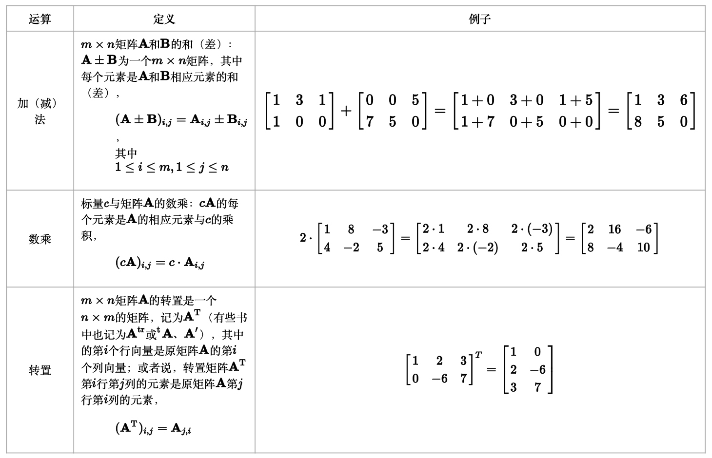
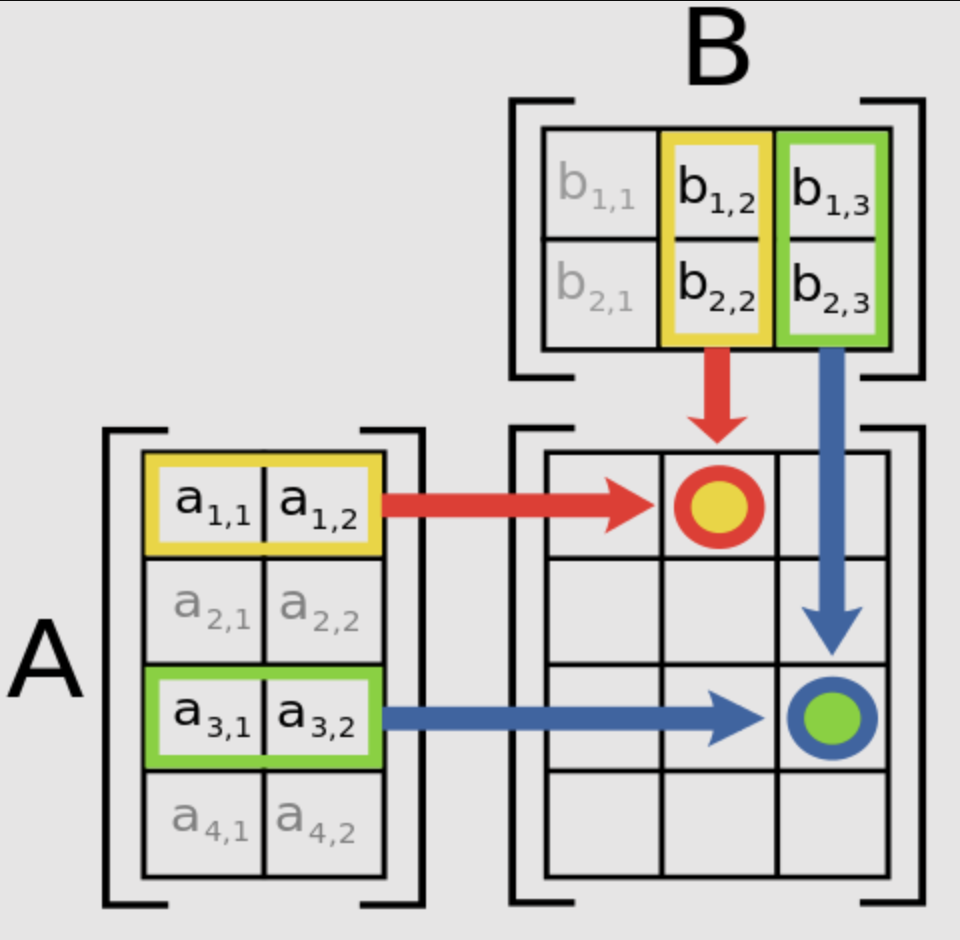
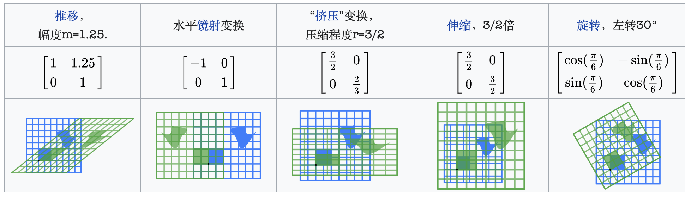
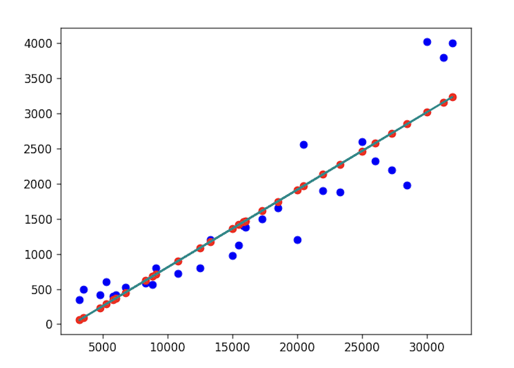

## NumPy Uygulamaları-4

> **Translated to Turkish by** himmetcanumutlu

### Vektör

**Vektör** (vector), aynı anda büyüklüğü ve yönü olan ve paralelkenar kuralını sağlayan geometrik nesnedir. Vektörün zıttı **skaler** veya **niceliktir**; skalerin yalnızca büyüklüğü vardır, çoğu durumda yönü yoktur. Vektörü genellikle oklu doğru parçasıyla gösteririz; düzlem dik koordinat sistemindeki vektör aşağıdaki gibidir. Dikkat edilmesi gereken nokta: vektör büyüklük ve yönü ifade eder; başlangıç ve bitiş noktası belirtmez; bu yüzden aynı vektör istenilen yerde çizilebilir; örneğin aşağıdaki şekilde $\small{\boldsymbol{w}}$ ve $\small{\boldsymbol{u}}$ vektörleri arasında fark yoktur.


Vektörün birçok cebirsel gösterimi vardır; iki boyutlu uzaydaki vektör için aşağıdaki yazımlar geçerlidir.

$$
\boldsymbol{a} = \langle a_1, a_2 \rangle = (a_1, a_2) = \begin{pmatrix} a_1 \\\\ a_2 \end{pmatrix} = \begin{bmatrix} a_1 \\\\ a_2 \end{bmatrix}
$$

Vektörün büyüklüğüne vektörün normu (modülü) denir; bir skalerdir; iki boyutlu uzaydaki vektör için norm aşağıdaki formülle hesaplanır.

$$
\lvert \boldsymbol{a} \rvert = \sqrt{a_{1}^{2} + a_{2}^{2}}
$$

Dikkat, buradaki $\small{\lvert \boldsymbol{a} \rvert}$ mutlak değer değildir; ona $\small{\boldsymbol{a}}$ vektörünün ikinci normu diyebilirsiniz; bu, matematikteki sembol yeniden kullanımı olgusudur. Yukarıdaki yazım ve kavram $\small{n}$ boyutlu uzaya da genellenebilir; $\small{n}$ boyutlu uzayı genellikle $\small{\boldsymbol{R^{n}}}$ ile gösteririz; az önce sözünü ettiğimiz iki boyutlu uzay $\small{\boldsymbol{R^{2}}}$, üç boyutlu uzay $\small{\boldsymbol{R^{3}}}$ olarak yazılabilir. Üç boyutlu uzayda yaşayan bizlerin dört, beş boyutlu uzayı hayal etmesi zor olsa da, bu yüksek boyutlu uzayı tartışmamıza engel değildir; makine öğrenmesinde $\small{n}$ özellikli bir eğitim örneğini genellikle $\small{n}$ boyutlu vektör olarak adlandırırız.

#### Vektörlerin Toplamı

Aynı boyuttaki vektörler toplanıp yeni bir vektör elde edilebilir; yöntem, vektörün her bileşenini toplamaktır; aşağıdaki gibidir.

$$
\boldsymbol{u} = \begin{bmatrix} u_1 \\\\ u_2 \\\\ \vdots \\\\ u_n \end{bmatrix}, \quad
\boldsymbol{v} = \begin{bmatrix} v_1 \\\\ v_2 \\\\ \vdots \\\\ v_n \end{bmatrix}, \quad
\boldsymbol{u} + \boldsymbol{v} = \begin{bmatrix} u_1 + v_1 \\\\ u_2 + v_2 \\\\ \vdots \\\\ u_n + v_n \end{bmatrix}
$$

Vektörlerin toplamı "paralelkenar kuralını" sağlar; yani $\small{\boldsymbol{u}}$ ve $\small{\boldsymbol{v}}$ vektörleri paralelkenarın iki komşu kenarını oluşturur; toplamın sonucu paralelkenarın köşegenidir; aşağıdaki gibidir.


#### Vektörün Skalerle Çarpımı

Bir $\small{\boldsymbol{v}}$ vektörü bir $\small{k}$ skaleriyle çarpılabilir; yöntem, vektördeki her bileşeni o skalerle çarpmaktır; aşağıdaki gibidir.

$$
\boldsymbol{v} = \begin{bmatrix} v_1 \\\\ v_2 \\\\ \vdots \\\\ v_n \end{bmatrix}, \quad
k \cdot \boldsymbol{v} = \begin{bmatrix} k \cdot v_1 \\\\ k \cdot v_2 \\\\ \vdots \\\\ k \cdot v_n \end{bmatrix}
$$

Vektörü NumPy dizisiyle temsil edebiliriz; vektörlerin toplamı iki dizinin toplamıyla, vektörün skalerle çarpımı dizi ile skalerin çarpımıyla gerçekleştirilir; burada tekrar anlatmayacağız.

#### Vektörlerin Nokta Çarpımı

Nokta çarpım (dot product), iki vektör arasındaki en önemli işlemlerden biridir; yöntem, iki vektörün karşılık gelen bileşenlerinin çarpımını toplamaktır; bu yüzden nokta çarpımın sonucu bir skalerdir; geometrik anlamı iki vektörün normunun, aralarındaki açının kosinüsüyle çarpımıdır; aşağıdaki gibidir.

$$
\boldsymbol{u} = \begin{bmatrix} u_1 \\\\ u_2 \\\\ \vdots \\\\ u_n \end{bmatrix}, \quad
\boldsymbol{v} = \begin{bmatrix} v_1 \\\\ v_2 \\\\ \vdots \\\\ v_n \end{bmatrix} \quad
$$

$$
\boldsymbol{u} \cdot \boldsymbol{v} = \sum_{i=1}^{n}{u_iv_i} = \lvert \boldsymbol{u} \rvert \lvert \boldsymbol{v} \rvert cos\theta
$$

Diyelim ki üç boyutlu vektörle kullanıcının komedi, romantik ve aksiyon filmlerine olan tercihini temsil ediyoruz; beğeni derecesini 1'den 5'e sayılarla ifade ediyoruz; 5 çok sever, 4 oldukça sever, 3 nötr, 2 oldukça sevmez, 1 hiç sevmez. O zaman aşağıdaki vektör kullanıcının komediyi çok sevdiğini, romantiği hiç sevmediğini, aksiyona ne sevgi ne nefret beslediğini gösterir.

$$
\boldsymbol{u} = \begin{pmatrix} 5 \\\\ 1 \\\\ 3 \end{pmatrix}
$$

Şimdi iki film vizyona girdi: biri romantik komedi, biri komedi aksiyon; iki filmi de üç boyutlu vektörle temsil ediyoruz; aşağıdaki gibidir.

$$
\boldsymbol{m_1} = \begin{pmatrix} 4 \\\\ 5 \\\\ 1 \end{pmatrix}, \quad \boldsymbol{m_2} = \begin{pmatrix} 5 \\\\ 1 \\\\ 5 \end{pmatrix}
$$

Kullanıcıya bir film önermemiz gerekiyorsa hangisini önerelim? Kullanıcıyı temsil eden $\small{\boldsymbol{u}}$ vektörüyle filmleri temsil eden $\small{\boldsymbol{m_{1}}}$ ve $\small{\boldsymbol{m_{2}}}$ vektörlerini ayrı ayrı nokta çarpıp, sonucu norm uzunluğuna bölerek vektörler arası açının kosinüsünü elde ederiz; kosinüs 1'e ne kadar yakınsa vektörlerin açısı 0 dereceye o kadar yakındır; yani iki vektörün benzerliği o kadar yüksektir. Açıkça kullanıcıya izleme tercihine daha benzer filmi önermeliyiz.

$$
cos\theta_1 = \frac{\boldsymbol{u} \cdot \boldsymbol{m1}}{|\boldsymbol{u}||\boldsymbol{m1}|} \approx \frac{4 \times 5 + 5 \times 1 + 3 \times 1}{5.92 \times 6.48} \approx 0.73
$$

$$
cos\theta_2 = \frac{\boldsymbol{u} \cdot \boldsymbol{m2}}{|\boldsymbol{u}||\boldsymbol{m2}|} \approx \frac{5 \times 5 + 1 \times 1 + 3 \times 5}{5.92 \times 7.14} \approx 0.97
$$

$\small{\boldsymbol{m_{2}}}$ vektörünün temsil ettiği filmin kullanıcıya çıplak gözle daha uygun olduğu söylenebilir. Gerçekten üç boyutlu vektörde sezgiyle doğru cevabı verebiliriz; ama $\small{n}$ boyutlu vektörde $\small{n}$ çok büyükse, çıplak gözle ve sezgiyle doğru cevabı verme güveniniz olur mu? Vektörün nokta çarpımı `dot` fonksiyonuyla, normu NumPy'nin `linalg` modülündeki `norm` fonksiyonuyla hesaplanır; kod aşağıdaki gibidir.

```python
u = np.array([5, 1, 3])
m1 = np.array([4, 5, 1])
m2 = np.array([5, 1, 5])
print(np.dot(u, m1) / (np.linalg.norm(u) * np.linalg.norm(m1)))  # 0.7302967433402214
print(np.dot(u, m2) / (np.linalg.norm(u) * np.linalg.norm(m2)))  # 0.9704311900788593
```

#### Vektörlerin Çapraz Çarpımı

İki boyutlu uzayda iki vektörün çapraz çarpımı şöyle tanımlanır:

$$
\boldsymbol{A} = \begin{pmatrix} a_{1} \\\\ a_{2} \end{pmatrix}, \quad \boldsymbol{B} = \begin{pmatrix} b_{1} \\\\ b_{2} \end{pmatrix}
$$

$$
\boldsymbol{A} \times \boldsymbol{B} = \begin{vmatrix} a_{1} \quad a_{2} \\\\ b_{1} \quad b_{2} \end{vmatrix} = a_{1}b_{2} - a_{2}b_{1}
$$

Üç boyutlu uzayda iki vektörün çapraz çarpımının sonucu bir vektördür; aşağıdaki gibidir:

$$
\boldsymbol{A} = \begin{pmatrix} a_{1} \\\\ a_{2} \\\\ a_{3} \end{pmatrix}, \quad \boldsymbol{B} = \begin{pmatrix} b_{1} \\\\ b_{2} \\\\ b_{3} \end{pmatrix}
$$

$$
\boldsymbol{A} \times \boldsymbol{B} = \begin{vmatrix} \boldsymbol{\hat{i}} \quad \boldsymbol{\hat{j}} \quad \boldsymbol{\hat{k}} \\\\ a_{1} \quad a_{2} \quad a_{3} \\\\ b_{1} \quad b_{2} \quad b_{3} \end{vmatrix} = \langle \boldsymbol{\hat{i}}\begin{vmatrix} a_{2} \quad a_{3} \\\\ b_{2} \quad b_{3} \end{vmatrix}, -\boldsymbol{\hat{j}}\begin{vmatrix} a_{1} \quad a_{3} \\\\ b_{1} \quad b_{3} \end{vmatrix}, \boldsymbol{\hat{k}}\begin{vmatrix} a_{1} \quad a_{2} \\\\ b_{1} \quad b_{2} \end{vmatrix} \rangle
$$

Çapraz çarpımın sonucu vektör olduğundan $\small{\boldsymbol{A} \times \boldsymbol{B}}$ ile $\small{\boldsymbol{B} \times \boldsymbol{A}}$ aynı değildir; aslında:

$$
\boldsymbol{A} \times \boldsymbol{B} = -(\boldsymbol{B} \times \boldsymbol{A})
$$

NumPy'de `cross` fonksiyonuyla vektörlerin çapraz çarpımı hesaplanır; kod aşağıdaki gibidir.

```python
print(np.cross(u, m1))  # [-14   7  21]
print(np.cross(m1, u))  # [ 14  -7 -21]
```

### Determinant

**Determinant** genellikle $\small{det(\boldsymbol{A})}$ veya $\small{ \lvert \boldsymbol{A} \rvert}$ ile gösterilir; $\small{\boldsymbol{A}}$ bir $\small{n}$ dereceli kare matristir. Determinant, yönlü alan veya hacim kavramının genel Öklid uzayına genellenmesi olarak görülebilir; ya da determinant, bir doğrusal dönüşümün "hacim" üzerindeki etkisini tanımlar. Determinant kavramı ilk kez doğrusal denklem sistemlerinin çözümünde ortaya çıktı; 17. yüzyıl sonlarında Seki Takakazu (Japonya Edo dönemi matematikçisi) ve Leibniz'in eserlerinde doğrusal denklem sisteminin çözüm sayısını ve biçimini belirlemek için determinant kullanıldı; 18. yüzyıldan itibaren determinant bağımsız matematik kavramı olarak incelenmeye başlandı; 19. yüzyıldan sonra determinant kuramı gelişip olgunlaştı.

#### Determinantın Özellikleri

Determinant vektörden türetildiğinden, determinant aslında vektörün özelliklerini açıklar.

**Özellik 1**: $\small{det(\boldsymbol{A})}$'de bir satırın (veya sütunun) elemanlarının tümü 0 ise $\small{det(\boldsymbol{A}) = 0}$'dır.

**Özellik 2**: $\small{det(\boldsymbol{A})}$'de bir satırın (veya sütunun) ortak çarpanı $\small{k}$ varsa $\small{k}$ dışarı alınabilir; $\small{det(\boldsymbol{A^{'}})}$ elde edilir ve $\small{det(\boldsymbol{A}) = k \cdot det(\boldsymbol{A^{'}})}$ olur.

$$
det(\boldsymbol{A})={\begin{vmatrix}a_{11}&a_{12}&\dots &a_{1n}\\\\\vdots &\vdots &\ddots &\vdots \\\\{\color {blue}k}a_{i1}&{\color {blue}k}a_{i2}&\dots &{\color {blue}k}a_{in}\\\\\vdots &\vdots &\ddots &\vdots \\\\a_{n1}&a_{n2}&\dots &a_{nn}\end{vmatrix}}={\color {blue}k}{\begin{vmatrix}a_{11}&a_{12}&\dots &a_{1n}\\\\\vdots &\vdots &\ddots &\vdots \\\\a_{i1}&a_{i2}&\dots &a_{in}\\\\\vdots &\vdots &\ddots &\vdots \\\\a_{n1}&a_{n2}&\dots &a_{nn}\end{vmatrix}}={\color {blue}k} \cdot det(\boldsymbol{A^{'}})
$$

**Özellik 3**: $\small{det(\boldsymbol{A})}$'de bir satırın (veya sütunun) her elemanı iki sayının toplamıysa, bu determinant iki determinantın toplamına ayrılabilir; aşağıdaki gibidir.

$$
{\begin{vmatrix}a_{11}&a_{12}&\dots &a_{1n}\\\\\vdots &\vdots &\ddots &\vdots \\\\{\color {blue}a_{i1}}+{\color {OliveGreen}b_{i1}}&{\color {blue}a_{i2}}+{\color {OliveGreen}b_{i2}}&\dots &{\color {blue}a_{in}}+{\color {OliveGreen}b_{in}}\\\\\vdots &\vdots &\ddots &\vdots \\\\a_{n1}&a_{n2}&\dots &a_{nn}\end{vmatrix}}={\begin{vmatrix}a_{11}&a_{12}&\dots &a_{1n}\\\\\vdots &\vdots &\ddots &\vdots \\\\{\color {blue}a_{i1}}&{\color {blue}a_{i2}}&\dots &{\color {blue}a_{in}}\\\\\vdots &\vdots &\ddots &\vdots \\\\a_{n1}&a_{n2}&\dots &a_{nn}\end{vmatrix}}+{\begin{vmatrix}a_{11}&a_{12}&\dots &a_{1n}\\\\\vdots &\vdots &\ddots &\vdots \\\\{\color {OliveGreen}b_{i1}}&{\color {OliveGreen}b_{i2}}&\dots &{\color {OliveGreen}b_{in}}\\\\\vdots &\vdots &\ddots &\vdots \\\\a_{n1}&a_{n2}&\dots &a_{nn}\end{vmatrix}}
$$

**Özellik 4**: $\small{det(\boldsymbol{A})}$'de iki satır (veya sütun) elemanı orantılıysa $\small{det(\boldsymbol{A}) = 0}$'dır.

**Özellik 5**: $\small{det(\boldsymbol{A})}$'de iki satır (veya sütun) yer değiştirirse $\small{det(\boldsymbol{A^{'}})}$ elde edilir ve $\small{det(\boldsymbol{A}) = -det(\boldsymbol{A^{'}})}$ olur.

**Özellik 6**: $\small{det(\boldsymbol{A})}$'de bir satırın (veya sütunun) $\small{k}$ katı başka bir satıra (veya sütuna) eklenirse determinantın değeri değişmez; aşağıdaki gibidir.

$$
{\begin{vmatrix}\vdots &\vdots &\vdots &\vdots \\\\ a_{i1}&a_{i2}&\dots &a_{in} \\\\ a_{j1}&a_{j2}&\dots &a_{jn}\\\\\vdots &\vdots &\vdots &\vdots \\\\ \end{vmatrix}}={\begin{vmatrix}\vdots &\vdots &\vdots &\vdots \\\\ a_{i1}&a_{i2}&\dots &a_{in} \\\\ a_{j1}{\color {blue}+ka_{i1}}&a_{j2}{\color {blue}+ka_{i2}}&\dots &a_{jn}{\color {blue}+ka_{in}} \\\\ \vdots &\vdots &\vdots &\vdots \\\\ \end{vmatrix}}
$$

**Özellik 7**: Determinantın satır ve sütunları yer değiştirirse determinantın değeri değişmez; aşağıdaki gibidir.

$$
{\begin{vmatrix}a_{11}&a_{12}&\dots &a_{1n} \\\\ a_{21}&a_{22}&\dots &a_{2n} \\\\ \vdots &\vdots &\ddots &\vdots  \\\\ a_{n1}&a_{n2}&\dots &a_{nn}\end{vmatrix}}={\begin{vmatrix}a_{11}&a_{21}&\dots &a_{n1} \\\\ a_{12}&a_{22}&\dots &a_{n2} \\\\ \vdots &\vdots &\ddots &\vdots  \\\\ a_{1n}&a_{2n}&\dots &a_{nn}\end{vmatrix}}
$$

**Özellik 8**: Kare matris $\small{\boldsymbol{A}}$ ile $\small{\boldsymbol{B}}$'nin çarpımının determinantı, determinantlarının çarpımına eşittir; yani $\small{det(\boldsymbol{A}\boldsymbol{B}) = det(\boldsymbol{A})det(\boldsymbol{B})}$'dir. Özellikle matristeki her satır $\small{r}$ sabitiyle çarpılırsa determinant $\small{r^{n}}$ katına çıkar; yani $\small{det(r\boldsymbol{A}) = det(r\boldsymbol{I_{n}} \cdot \boldsymbol{A}) = r^{n}det(\boldsymbol{A})}$; burada $\small{\boldsymbol{I_{n}}}$ $\small{n}$ dereceli birim matristir.

**Özellik 9**: $\small{\boldsymbol{A}}$ tersinir bir matrisse $\small{det(\boldsymbol{A}^{-1}) = (det(\boldsymbol{A}))^{-1}}$'dir.

#### Determinantın Hesaplanması

$\small{n}$ dereceli determinantın hesaplama formülü aşağıdaki gibidir:

$$
det(\boldsymbol{A})=\sum_{n!} \pm {a_{1\alpha}a_{2\beta} \cdots a_{n\omega}}
$$

İkinci derece determinant için yukarıdaki formül şuna denktir:

$$
\begin{vmatrix} a_{11} \quad a_{12} \\\\ a_{21} \quad a_{22} \end{vmatrix} = a_{11}a_{22} - a_{12}a_{21}
$$

Üçüncü derece determinant için yukarıdaki hesaplama formülü şuna denktir:

$$
\begin{vmatrix} a_{11} \quad a_{12} \quad a_{13} \\\\ a_{21} \quad a_{22} \quad a_{23} \\\\ a_{31} \quad a_{32} \quad a_{33} \end{vmatrix} = a_{11}a_{22}a_{33} + a_{12}a_{23}a_{31} + a_{13}a_{21}a_{32} - a_{11}a_{23}a_{32} - a_{12}a_{21}a_{33} - a_{13}a_{22}a_{31}
$$

Yüksek dereceli determinant **cebirsel kofaktör** (cofactor) ile birden çok düşük dereceli determinanta açılabilir; aşağıdaki gibidir:

$$
det(\boldsymbol{A})=a_{11}C_{11}+a_{12}C_{12}+ \cdots +a_{1n}C_{1n} = \sum_{i=1}^{n}{a_{1i}C_{1i}}
$$

Burada $\small{C_{11}}$, asıl determinanttan $\small{a_{11}}$'in bulunduğu satır ve sütun çıkarıldıktan sonra kalan kısmın oluşturduğu determinanttır; böyle devam eder.

### Matris

**Matris** (matrix), bir dizi elemanın dikdörtgen düzenidir; matristeki elemanlar sayı, sembol veya matematiksel formül olabilir. Matris; **toplama**, **çıkarma**, **skaler çarpım**, **devrik**, **matris çarpımı** gibi işlemler yapabilir; aşağıdaki gibidir.



Dikkate değer olan matris çarpımıdır; bu işlem yalnızca ilk matris $\small{\boldsymbol{A}}$'nın sütun sayısı ile diğer matris $\small{\boldsymbol{B}}$'nin satır sayısı eşit olduğunda tanımlıdır. $\small{\boldsymbol{A}}$ bir $\small{m \times n}$, $\small{\boldsymbol{B}}$ bir $\small{n \times k}$ matrisiyse çarpımları bir $\small{m \times k}$ matristir; aşağıdaki gibidir.



Örneğin:

$$
\begin{bmatrix} 1 & 0 & 2 \\\\ -1 & 3 & 1 \end{bmatrix} \times \begin{bmatrix} 3 & 1 \\\\ 2 & 1 \\\\ 1 & 0 \end{bmatrix} = \begin{bmatrix} (1 \times 3  +  0 \times 2  +  2 \times 1) & (1 \times 1   +   0 \times 1   +   2 \times 0) \\\\ (-1 \times 3  +  3 \times 2  +  1 \times 1) & (-1 \times 1   +   3 \times 1   +   1 \times 0) \end{bmatrix} = \begin{bmatrix} 5 & 1 \\\\ 4 & 2 \end{bmatrix}
$$

Matris çarpımı birleşme yasasını ve matris toplamına göre dağılma yasasını sağlar:

Birleşme: $\small{(\boldsymbol{AB})\boldsymbol{C} = \boldsymbol{A}(\boldsymbol{BC})}$.

Sol dağılma: $\small{(\boldsymbol{A} + \boldsymbol{B})\boldsymbol{C} = \boldsymbol{AC} + \boldsymbol{BC}}$.

Sağ dağılma: $\small{\boldsymbol{C}(\boldsymbol{A} + \boldsymbol{B}) = \boldsymbol{CA} + \boldsymbol{CB}}$.

**Matris çarpımı değişme yasasını sağlamaz**. Genellikle $\small{\boldsymbol{A}}$ ve $\small{\boldsymbol{B}}$'nin çarpımı $\small{\boldsymbol{AB}}$ vardır ama $\small{\boldsymbol{BA}}$ var olmayabilir; $\small{\boldsymbol{BA}}$ var olsa bile çoğu zaman $\small{\boldsymbol{AB} \neq \boldsymbol{BA}}$'dır.

Matris çarpımının temel uygulamalarından biri doğrusal denklem sistemleridir. Doğrusal denklem sistemi, aşağıdaki biçime uyan denklem sistemidir:

$$
\begin{cases}
     a_{1,1}x_{1} + a_{1,2}x_{2} + \cdots + a_{1,n}x_{n}=  b_{1} \\\\
     a_{2,1}x_{1} + a_{2,2}x_{2} + \cdots + a_{2,n}x_{n}=  b_{2} \\\\
     \vdots \quad \quad \quad \vdots \\\\
     a_{m,1}x_{1} + a_{m,2}x_{2} + \cdots + a_{m,n}x_{n}=  b_{m}
 \end{cases}
$$

Matris biçimiyle doğrusal denklem sistemi bir vektör denklemine yazılabilir:

$$
\boldsymbol{Ax} = \boldsymbol{b}
$$

Burada $\small{\boldsymbol{A}}$, denklem sistemindeki bilinmeyenlerin katsayılarından oluşan $\small{m \times n}$ matristir; $\small{\boldsymbol{x}}$ $\small{n}$ elemanlı satır vektörüdür; $\small{\boldsymbol{b}}$ $\small{m}$ elemanlı satır vektörüdür.

Matris, doğrusal dönüşümün (vektör toplamını ve skaler çarpmayı koruyan fonksiyon) pratik gösterimidir. Matris çarpımının özü, doğrusal dönüşümle ilişkilendirildiğinde en iyi anlaşılır; çünkü matris çarpımı ile doğrusal dönüşümün bileşimi arasında şu ilişki vardır: her $\small{m \times n}$ matris $\small{\boldsymbol{A}}$, $\small{\boldsymbol{R}^{n}}$'den $\small{\boldsymbol{R}^{m}}$'ye bir doğrusal dönüşümü temsil eder. Yukarıdaki içeriği anlayamıyorsanız Bilibili'deki [《Doğrusal Cebirin Özü》](https://www.bilibili.com/video/BV1ib411t7YR/) videosunu izlemenizi öneririz; bu videonun doğrusal cebire daha iyi bir kavrayış kazandıracağına inanıyoruz.

Aşağıdaki görsel Vikipedi'den bir örnektir; görselde bazı tipik iki boyutlu gerçek düzlemdeki doğrusal dönüşümlerin düzlem vektörüne (şekil) etkisi ve bunlara karşılık gelen iki boyutlu matrisler gösterilir; her doğrusal dönüşüm mavi şekli yeşil şekle eşler; düzlemin orijini $\small{(0, 0)}$ siyah noktayla gösterilir.



#### Matris Nesnesi

NumPy, doğrusal cebir (linear algebra) için özel modül ve matrisi temsil eden `matrix` tipini sunar; elbette iki boyutlu diziyle de matris temsil edilebilir; resmî olarak `matrix` sınıfı önerilmez, iki boyutlu dizi kullanılması önerilir; gelecekteki sürümlerde `matrix` sınıfı kaldırılabilir. Her durumda, bu kapsüllenmiş sınıf ve fonksiyonlarla matrise birçok işlemi kolayca yapabiliriz.

Aşağıdaki kodla matris (`matrix`) nesnesi oluşturabiliriz.

Kod:

```Python
m1 = np.matrix('1 2 3; 4 5 6')
m1
```

> **Not**: `matrix` kurucusuna dizi benzeri nesne veya string geçilerek matris nesnesi oluşturulabilir.

Çıktı:

```
matrix([[1, 2, 3],
        [4, 5, 6]])
```

Kod:

```Python
m2 = np.asmatrix(np.array([[1, 1], [2, 2], [3, 3]]))
m2
```

> **Not**: `asmatrix` fonksiyonu `mat` fonksiyonuyla değiştirilebilir; bu iki fonksiyon aslında aynıdır.

Çıktı:

```
matrix([[1, 1],
        [2, 2],
        [3, 3]])
```

Kod:

```Python
m1 * m2
```

Çıktı:

```
matrix([[14, 14],
        [32, 32]])
```

> **Not**: `matrix` nesnesi ile `ndarray` nesnesinin çarpma işleminin farkına dikkat edin; `matrix` nesnesinin `*` işlemi matris çarpımıdır. İki iki boyutlu dizi matris çarpımı yapacaksa `*` operatörü değil, `@` operatörü veya `matmul` fonksiyonu kullanılmalıdır.

Matris nesnesinin özellikleri aşağıdaki tablodadır.

| Özellik    | Açıklama                                      |
| ------- | ----------------------------------------- |
| `A`     | Matris nesnesine karşılık gelen `ndarray` nesnesini alır           |
| `A1`    | Matris nesnesine karşılık gelen düzleştirilmiş `ndarray` nesnesini alır |
| `I`     | Tersinir matrisin ters matrisi                          |
| `T`     | Matrisin devriği                                |
| `H`     | Matrisin eşlenik devriği                            |
| `shape` | Matrisin şekli                                |
| `size`  | Matris elemanlarının sayısı                            |

Matris nesnesinin metotları daha önce anlattığımız `ndarray` dizi nesnesinin metotlarıyla temelde aynıdır; burada tekrar anlatmayacağız.

#### Doğrusal Cebir Modülü

NumPy'nin `linalg` modülünde bir grup standart matris ayrıştırma işlemi ve ters matris, determinant gibi fonksiyonlar vardır; bunlar MATLAB ve R gibi dillerle aynı endüstri standardı doğrusal cebir kütüphanesini kullanır; aşağıdaki tablo `numpy` ve `linalg` modülündeki bazı yaygın doğrusal cebir fonksiyonlarını listeler.

| Fonksiyon          | Açıklama                                                         |
| ------------- | ------------------------------------------------------------ |
| `diag`        | Kare matrisin köşegen elemanlarını tek boyutlu dizi olarak döndürür veya tek boyutlu diziyi kare matrise dönüştürür (köşegen olmayan elemanlar 0) |
| `matmul`      | Matris çarpımı                                                 |
| `trace`       | Köşegen elemanlarının toplamını hesaplar                                           |
| `norm`        | Matris veya vektörün normunu bulur                                           |
| `det`         | Determinantın değerini hesaplar                                               |
| `matrix_rank` | Matrisin rankını hesaplar                                                 |
| `eig`         | Matrisin özdeğerini (eigenvalue) ve özvektörünü (eigenvector) hesaplar  |
| `inv`         | Tekil olmayan matrisin ($\small{n}$ dereceli kare matris) ters matrisini hesaplar                |
| `pinv`        | Matrisin Moore-Penrose genelleştirilmiş tersini hesaplar               |
| `qr`          | QR ayrıştırması (matrisi bir ortogonal matris ile bir üst üçgen matrisin çarpımına ayrıştırır)       |
| `svd`         | Tekil değer ayrıştırması (singular value decomposition) hesaplar             |
| `solve`       | $\small{\boldsymbol{Ax}=\boldsymbol{b}}$ doğrusal denklem sistemini çözer; $\small{\boldsymbol{A}}$ kare matristir |
| `lstsq`       | $\small{\boldsymbol{Ax}=\boldsymbol{b}}$'nin en küçük kareler çözümünü hesaplar   |

Aşağıda yukarıdaki fonksiyonları basitçe deneyelim; önce ters matrisi deneyelim.

Kod:

```Python
m3 = np.array([[1., 2.], [3., 4.]])
m4 = np.linalg.inv(m3)
m4
```

Çıktı:

```
array([[-2. ,  1. ],
       [ 1.5, -0.5]])
```

Kod:

```Python
np.around(m3 @ m4)
```

> **Not**: `around` fonksiyonu dizi elemanlarını yuvarlar; varsayılan ondalık basamak 0'dır.

Çıktı:

```
array([[1., 0.],
       [0., 1.]])
```

> **Not**: Matris ile ters matrisinin matris çarpımı birim matrisi verir.

Determinantın değerini hesaplama.

Kod:

```Python
m5 = np.array([[1, 3, 5], [2, 4, 6], [4, 7, 9]])
np.linalg.det(m5)
```

Çıktı:

```
2
```

Matrisin rankını hesaplama.

Kod:

```Python
np.linalg.matrix_rank(m5)
```

Çıktı:

```
3
```

Doğrusal denklem sistemi çözme.

$$
\begin{cases}
x_1 + 2x_2 + x_3 = 8 \\\\
3x_1 + 7x_2 + 2x_3 = 23 \\\\
2x_1 + 2x_2 + x_3 = 9
\end{cases}
$$

Yukarıdaki doğrusal denklem sistemini matris biçiminde gösterebiliriz; aşağıdaki gibidir.

$$
\boldsymbol{A} = \begin{bmatrix}
1 & 2 & 1 \\\\
3 & 7 & 2 \\\\
2 & 2 & 1
\end{bmatrix}, \quad
\boldsymbol{x} = \begin{bmatrix}
x_1 \\\\
x_2 \\\\
x_3
\end{bmatrix}, \quad
\boldsymbol{b} = \begin{bmatrix}
8 \\\\
23 \\\\
9
\end{bmatrix}
$$

$$
\boldsymbol{Ax} = \boldsymbol{b}
$$

Doğrusal denklem sisteminin tek çözümü olmasının koşulu: katsayı matrisi $\small{\boldsymbol{A}}$'nın rankı, genişletilmiş matris $\small{\boldsymbol{Ab}}$'nin rankına eşittir ve bilinmeyen sayısıyla aynıdır.

Kod:

```Python
A = np.array([[1, 2, 1], [3, 7, 2], [2, 2, 1]])
b = np.array([8, 23, 9]).reshape(-1, 1)
print(np.linalg.matrix_rank(A))
print(np.linalg.matrix_rank(np.hstack((A, b))))
```

> **Not**: Dizi nesnesinin `reshape` metoduyla şekil değiştirirken bir parametre -1 ise, o boyuttaki eleman sayısı dizi eleman sayısı (`size` özelliği) ve diğer boyutların eleman sayısından otomatik hesaplanır.

Çıktı:

```
3
3
```

Kod:

```Python
np.linalg.solve(A, b)
```

Çıktı:

```
array([[1.],
       [2.],
       [3.]])
```

> **Not**: Yukarıdaki sonuç, doğrusal denklem sisteminin çözümünün $\small{x_1 = 1, x_2 = 2, x_3 = 3}$ olduğunu gösterir.

Aşağıda doğrusal denklem sistemini çözmenin bir başka yolu var; nedenini düşünmek için durabilirsiniz.

$$
\boldsymbol{x} = \boldsymbol{A}^{-1} \cdot \boldsymbol{b}
$$

Kod:

```Python
np.linalg.inv(A) @ b
```

Çıktı:

```
array([[1.],
       [2.],
       [3.]])
```

### Polinom

Dizi dışında NumPy, **polinom** (polynomial) işlemleri için de veri tipi kapsüller. Polinom, değişkenin tam sayı kuvveti ile katsayının çarpımının toplamıdır; şu biçimdedir:

$$
f(x)=a_nx^n + a_{n-1}x^{n-1} + \cdots + a_1x^{1} + a_0x^{0}
$$

NumPy 1.4 öncesinde polinomu `poly1d` tipiyle temsil edebiliyorduk; şu anda hâlâ kullanılabilir; ama resmî olarak yeni `numpy.polynomial` modülü sunuldu; temel kuvvet serisi polinomunun yanı sıra Çebışov polinomu, Laguerre polinomu gibi polinomları da destekler.

#### Polinom Nesnesi Oluşturma

`poly1d` nesnesi oluşturma; örneğin: $\small{f(x)=3x^{2}+2x+1}$.

Kod:

```python
p1 = np.poly1d([3, 2, 1])
p2 = np.poly1d([1, 2, 3])
print(p1)
print(p2)
```

Çıktı:

```
   2
3 x + 2 x + 1
   2
1 x + 2 x + 3
```

#### Polinom İşlemleri

**Polinomun katsayılarını alma**

Kod:

```python
print(p1.coefficients)
print(p2.coeffs)
```

Çıktı:

```
[3 2 1]
[1 2 3]
```

**İki polinomun dört işlemi**

Kod:

```python
print(p1 + p2)
print(p1 * p2)
```

Çıktı:

```
   2
4 x + 4 x + 4
   4     3      2
3 x + 8 x + 14 x + 8 x + 3
```

**$\small{x}$ koyup polinomun değerini hesaplama**

Kod:

```python
print(p1(3))
print(p2(3))
```

Çıktı:

```
34
18
```

**Polinomun türevi ve belirsiz integrali**

Kod:

```python
print(p1.deriv())
print(p1.integ())
```

Çıktı:

```

6 x + 2
   3     2
1 x + 1 x + 1 x
```

**Polinomun köklerini bulma**

Örneğin $\small{f(x)=x^2+3x+2}$ polinomunun kökleri, $\small{x^2+3x+2=0}$ ikinci derece denkleminin çözümüdür.

Kod:

```python
p3 = np.poly1d([1, 3, 2])
print(p3.roots)
```

Çıktı:

```
[-2. -1.]
```

`numpy.polynomial` modülünün `Polynomial` sınıfıyla polinom nesnesi temsil edilirse, ilgili işlemler aşağıdaki gibidir.

Kod:

```python
from numpy.polynomial import Polynomial

p3 = Polynomial((2, 3, 1))
print(p3)           # Polinomu yazdırır
print(p3(3))        # x=3 için polinomun değerini hesaplar
print(p3.roots())   # Polinomun köklerini hesaplar
print(p3.degree())  # Polinomun derecesini alır
print(p3.deriv())   # Türev alır
print(p3.integ())   # Belirsiz integral alır
```

Çıktı:

```
2.0 + 3.0·x + 1.0·x²
20.0
[-2. -1.]
2
3.0 + 2.0·x
0.0 + 2.0·x + 1.5·x² + 0.33333333·x³
```

#### En Küçük Kareler Çözümü

`Polynomial` sınıfının `fit` adlı bir sınıf metodu vardır; polinoma en küçük kareler çözümünü bulur. En küçük kareler çözümü (least-squares solution), hata karelerinin toplamını minimize ederek veriye en iyi uyan fonksiyonun katsayılarını bulmaktır. Polinomun $\small{f(x)=ax+b}$ olduğunu varsayalım; en küçük kareler çözümü, aşağıdaki artık kareler toplamını $\small{RSS}$ minimum yapan $\small{a}$ ve $\small{b}$'dir.

$$
RSS = \sum_{i=0}^{k}{(f(x_i) - y_i)^{2}}
$$

Örneğin toplanan aylık gelir ve online alışveriş harcaması geçmiş verisiyle, kişinin aylık gelirinden online alışveriş harcamasını tahmin eden bir model kurmak istiyoruz; aşağıda topladığımız gelir ve online harcama verisi iki dizide saklanır.

```python
x = np.array([
    25000, 15850, 15500, 20500, 22000, 20010, 26050, 12500, 18500, 27300,
    15000,  8300, 23320,  5250,  5800,  9100,  4800, 16000, 28500, 32000,
    31300, 10800,  6750,  6020, 13300, 30020,  3200, 17300,  8835,  3500
])
y = np.array([
    2599, 1400, 1120, 2560, 1900, 1200, 2320,  800, 1650, 2200,
     980,  580, 1885,  600,  400,  800,  420, 1380, 1980, 3999,
    3800,  725,  520,  420, 1200, 4020,  350, 1500,  560,  500
])
```

Önce dağılım grafiği çizip iki veri grubunun pozitif veya negatif korelasyonu olup olmadığını görebiliriz. Pozitif korelasyon, `x` dizisindeki büyük değerin `y` dizisindeki büyük değere; negatif korelasyon ise `x`'teki büyük değerin `y`'deki küçük değere karşılık gelmesidir.

```python
import matplotlib.pyplot as plt

plt.figure(dpi=120)
plt.scatter(x, y, color='blue')
plt.show()
```

Çıktı:


İki veri grubunun korelasyonunu nicel incelemek gerekirse kovaryans veya korelasyon katsayısı hesaplanabilir; karşılık gelen NumPy fonksiyonları `cov` ve `corrcoef`'tir.

Kod:

```python
np.corrcoef(x, y)
```

Çıktı:

```
array([[1.        , 0.92275889],
       [0.92275889, 1.        ]])
```

> **Not**: Korelasyon katsayısı `-1` ile `1` arasında bir değerdir; `1`'e ne kadar yakınsa pozitif korelasyon o kadar güçlüdür; `-1`'e ne kadar yakınsa negatif korelasyon o kadar güçlüdür; `0`'a yakınsa iki veri grubu arasında belirgin korelasyon yoktur. Yukarıda aylık gelir ile online harcama arasındaki korelasyon katsayısı `0.92275889`'dur; ikisinin güçlü pozitif korelasyonu olduğunu gösterir.

Yukarıdaki işlemle gelir ile online harcama arasında güçlü pozitif korelasyon olduğunu belirledik; o zaman bu veriyle bir regresyon modeli kurup veri noktalarına iyi uyan bir doğru bulalım. Burada yukarıda sözünü ettiğimiz `fit` metodunu kullanabiliriz; somut kod aşağıdaki gibidir.

Kod:

```python
from numpy.polynomial import Polynomial

Polynomial.fit(x, y, deg=1).convert().coef
```

> **Not**: `deg=1` regresyon modelinin en yüksek dereceli teriminin 1. derece olduğunu belirtir; model $\small{y=ax+b}$ biçimindedir; $\small{y=ax^2+bx+c}$ gibi bir model üretmek için `deg=2` yapılmalıdır; böyle devam eder.

Çıktı:

```
array([-2.94883437e+02,  1.10333716e-01])
```

Yukarıdaki sonuca göre regresyon denklemimiz $\small{y=0.110333716x-294.883437}$ olmalıdır. Bu regresyon denklemini az önceki dağılım grafiğine çizelim; kırmızı noktalar tahmin değerimiz, mavi noktalar geçmiş veri yani gerçek değerdir.

Kod:

```python
import matplotlib.pyplot as plt

plt.scatter(x, y, color='blue')
plt.scatter(x, 0.110333716 * x - 294.883437, color='red')
plt.plot(x, 0.110333716 * x - 294.883437, color='darkcyan')
plt.show()
```

Çıktı:



`Polynomial` tipinin `fit` metodunu kullanmak istemezsek, NumPy'nin sunduğu `polyfit` fonksiyonuyla da aynı işlemi yapabiliriz; merak edenler kendileri inceleyebilir.

> **Not**: Bu bölümdeki bazı görseller Vikipedi'den alınmıştır.
