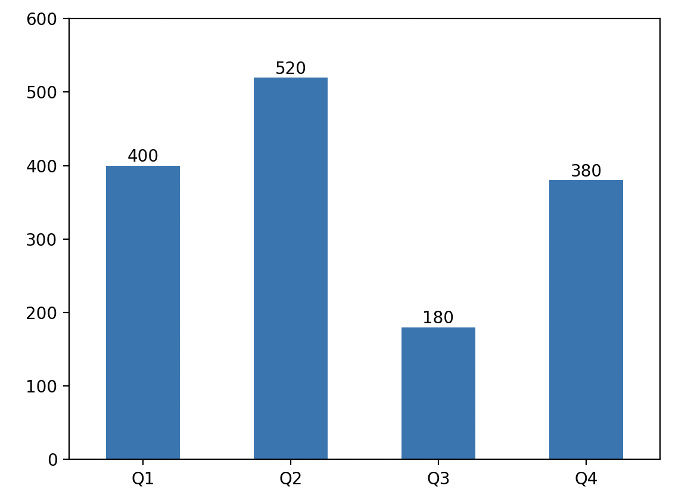

## pandas'ı Derinlemesine İncelemek-1

> **Translated to Turkish by** himmetcanumutlu

Pandas, Wes McKinney'nin 2008'de geliştirdiği güçlü bir **yapılandırılmış veri analizi** araç setidir. Pandas, NumPy'ye dayanır (veri depolama ve işleme) ve veri analizi için özel tipler, metotlar ve fonksiyonlar sunar; veri analizi ve veri madenciliğine iyi destek sağlar; ayrıca pandas veri görselleştirme aracı matplotlib ile iyi bütünleşir; veri görselleştirmeyi çok kolay ve keyifli yapar.

Pandas'ın çekirdek veri tipleri `Series` (veri serisi) ve `DataFrame`'dir (veri penceresi/çerçevesi); sırasıyla tek ve iki boyutlu veriyi işler; ayrıca `Index` adlı tip ve alt tipleri vardır; bunlar `Series` ve `DataFrame`'e indeksleme işlevi sağlar. Günlük işte `DataFrame` en yaygın kullanılır; çünkü iki boyutlu veri yapısı satırı sütunu olan tabloya karşılık gelir. `Series` ve `DataFrame` çok sayıda veri işleme metodu sunar; veri analisti bunlara dayanarak veriyi filtreleme, birleştirme, yapıştırma, temizleme, ön işleme, toplama, özetleme ve görselleştirme gibi çeşitli işlemler yapabilir.

### Series Nesnesi Oluşturma

Pandas kütüphanesindeki `Series` nesnesi tek boyutlu veri yapısını temsil eder; ama indeks ve bazı ek işlevler eklenmiştir. `Series` tipinin iç yapısı iki dizi içerir; biri veriyi, diğeri verinin indeksini saklar. Liste veya diziyle `Series` nesnesi oluşturabiliriz; kod aşağıdaki gibidir.

Kod:

```Python
import numpy as np
import pandas as pd

ser1 = pd.Series(data=[120, 380, 250, 360], index=['Q1', 'Q2', 'Q3', 'Q4'])
ser1
```

> **Not**: `Series` kurucusundaki `data` parametresi veriyi, `index` parametresi verinin indeksini (veriye karşılık gelen etiket) temsil eder.

Çıktı:

```
Q1    120
Q2    380
Q3    250
Q4    360
dtype: int64
```

Sözlükle Series nesnesi oluşturma.

Kod:

```Python
ser2 = pd.Series({'Q1': 320, 'Q2': 180, 'Q3': 300, 'Q4': 405})
ser2
```

> **Not**: Sözlükle `Series` nesnesi oluştururken sözlüğün anahtarı verinin etiketidir (indeks), anahtara karşılık gelen değer veridir.

Çıktı:

```
Q1    320
Q2    180
Q3    300
Q4    405
dtype: int64
```

### Series Nesnesinin İşlemleri

#### Skaler İşlem

Az önceki `ser1`'in her çeyreğine `10` ekleyelim; kod aşağıdaki gibidir.

Kod:

```python
ser1 += 10
ser1
```

Çıktı:

```
Q1    130
Q2    390
Q3    260
Q4    370
dtype: int64
```

#### Vektör İşlemi

`ser1` ve `ser2`'nin karşılık gelen çeyrek verisini toplayalım; kod aşağıdaki gibidir.

Kod:

```python
ser1 + ser2
```

Çıktı:

```
Q1    450
Q2    570
Q3    560
Q4    775
dtype: int64
```

#### İndeks İşlemi

##### Normal İndeks

Dizi gibi `Series` nesnesi de indeks ve dilim işlemi yapabilir; farkı, `Series` nesnesinin içinde indeksi saklayan bir dizi olduğundan, tam sayı indeksle veri almanın yanı sıra kendi belirlediğimiz indeks (etiket) ile de ilgili veriyi alabiliriz.

Tam sayı indeks kullanma.

Kod:

```Python
ser1[2]
```

Çıktı:

```
260
```

Özel indeks kullanma.

Kod:

```Python
ser1['Q3']
```

Çıktı:

```
260
```

Kod:

```Python
ser1['Q1'] = 380
ser1
```

Çıktı:

```
Q1    380
Q2    390
Q3    260
Q4    370
dtype: int64
```

##### Dilim İndeksleme

`Series` nesnesinin dilim işlemi liste ve diziye benzer; başlangıç ve bitiş indeksini vererek asıl `Series` nesnesinden bir kısım veriyi alır veya değiştirir; burada tam sayı indeks ve özel indeks kullanılabilir; kod aşağıdaki gibidir.

Kod:

```Python
ser2[1:3]
```

Çıktı:

```
Q2    180
Q3    300
dtype: int64
```

Kod:

```Python
ser2['Q2':'Q4']
```

Çıktı:

```
Q2    180
Q3    300
Q4    405
dtype: int64
```

>**İpucu**: Özel indeksle dilimlerken bitiş indeksine karşılık gelen eleman da alınabilir.

Kod:

```Python
ser2[1:3] = 400, 500
ser2
```

Çıktı:

```
Q1    320
Q2    400
Q3    500
Q4    405
dtype: int64
```

##### Fancy İndeksleme

Kod:

```Python
ser2[['Q2', 'Q4']]
```

Çıktı:

```
Q2    400
Q4    405
dtype: int64
```

Kod:

```Python
ser2[['Q2', 'Q4']] = 600, 520
ser2
```

Çıktı:

```
Q1    320
Q2    600
Q3    500
Q4    520
dtype: int64
```

##### Boolean İndeksleme

Kod:

```Python
ser2[ser2 >= 500]
```

Çıktı:

```
Q2    600
Q3    500
Q4    520
dtype: int64
```

### Series Nesnesinin Özellikleri ve Metotları

`Series` nesnesinin özellik ve metotları çok fazladır; önemli olanları anlatalım. Önce aşağıdaki tabloya bakalım; `Series` nesnesinin yaygın özelliklerini gösterir.

| Özellik                      | Açıklama                                    |
| ------------------------- | --------------------------------------- |
| `dtype` / `dtypes`        | `Series` nesnesinin veri tipini döndürür              |
| `hasnans`                 | `Series` nesnesinde boş değer olup olmadığını belirler            |
| `at` / `iat`              | İndeksle `Series` nesnesindeki tek değere erişir      |
| `loc` / `iloc`            | İndeksle `Series` nesnesindeki tek veya bir grup değere erişir |
| `index`                   | `Series` nesnesinin indeksini (`Index` nesnesi) döndürür     |
| `is_monotonic`            | `Series` nesnesindeki verinin monoton olup olmadığını belirler        |
| `is_monotonic_increasing` | `Series` nesnesindeki verinin monoton artan olup olmadığını belirler    |
| `is_monotonic_decreasing` | `Series` nesnesindeki verinin monoton azalan olup olmadığını belirler    |
| `is_unique`               | `Series` nesnesindeki verinin benzersiz olup olmadığını belirler    |
| `size`                    | `Series` nesnesindeki eleman sayısını döndürür            |
| `values`                  | `Series` nesnesindeki değeri `ndarray` olarak döndürür |

Aşağıdaki kodla `Series` nesnesinin özelliklerini öğrenebiliriz.

Kod:

```python
print(ser2.dtype)                    # Veri tipi
print(ser2.hasnans)                  # Boş değer var mı
print(ser2.index)                    # İndeks
print(ser2.values)                   # Değer
print(ser2.is_monotonic_increasing)  # Monoton artan mı
print(ser2.is_unique)                # Her değer benzersiz mi
```

Çıktı:

```
int64
False
Index(['Q1', 'Q2', 'Q3', 'Q4'], dtype='object')
[320 600 500 520]
False
True
```

`Series` nesnesinin metotları çoktur; aşağıda bazı kod parçalarıyla yaygın metotları tanıtıyoruz.

#### İstatistikle İlgili

`Series` nesnesi çeşitli tanımlayıcı istatistik bilgisi alan metotları destekler.

Kod:

```Python
print(ser2.count())   # Sayım
print(ser2.sum())     # Toplam
print(ser2.mean())    # Ortalama
print(ser2.median())  # Medyan
print(ser2.max())     # Maksimum
print(ser2.min())     # Minimum
print(ser2.std())     # Standart sapma
print(ser2.var())     # Varyans
```

Çıktı:

```
4
1940
485.0
510.0
600
320
118.18065267490557
13966.666666666666
```

`Series` nesnesinin `describe()` adlı bir metodu vardır; yukarıdaki tüm tanımlayıcı istatistikleri alır; aşağıdaki gibidir.

Kod:

```Python
ser2.describe()
```

Çıktı:

```
count      4.000000
mean     485.000000
std      118.180653
min      320.000000
25%      455.000000
50%      510.000000
75%      540.000000
max      600.000000
dtype: float64
```

> **İpucu**: `describe()` de bir `Series` nesnesi döndürdüğünden, `ser2.describe()['mean']` ile ortalama, `ser2.describe()[['max', 'min']]` ile maksimum ve minimum alınabilir.

`Series` nesnesinde yinelenen değer varsa, `unique()` metoduyla benzersiz değerlerden oluşan dizi alınır; `nunique()` metoduyla benzersiz değer sayısı sayılır; her değerin kaç kez tekrar ettiğini saymak istiyorsanız `value_counts()` metodu kullanılır; bu metot bir `Series` nesnesi döndürür; indeksi asıl `Series` nesnesindeki değerlerdir; her değerin geçiş sayısı döndürülen `Series` nesnesindeki veridir; varsayılan olarak geçiş sayısına göre azalan sıralanır; aşağıdaki gibidir.

Kod:

```Python
ser3 = pd.Series(data=['apple', 'banana', 'apple', 'pitaya', 'apple', 'pitaya', 'durian'])
ser3.value_counts()
```

Çıktı:

```
apple     3
pitaya    2
durian    1
banana    1
dtype: int64
```

Kod:

```Python
ser3.nunique()
```

Çıktı:

```
4
```

`ser3` için `mode()` metoduyla verinin modu bulunabilir; mod benzersiz olmayabileceğinden `mode()` metodunun dönüş değeri yine bir `Series` nesnesidir.

Kod:

```python
ser3.mode()
```

Çıktı:

```
0    apple
dtype: object
```

#### Veri İşleme

`Series` nesnesinin `isna()` ve `isnull()` metotları boş değer belirlemede, `notna()` ve `notnull()` metotları boş olmayan değer belirlemede kullanılır; kod aşağıdaki gibidir.

Kod:

```Python
ser4 = pd.Series(data=[10, 20, np.nan, 30, np.nan])
ser4.isna()
```

> **Not**: `np.nan`, IEEE 754 standardı bir kayan noktalı sayıdır; "bir sayı değil"i temsil eder; yukarıdaki kodda boş değeri temsil etmek için kullandık; elbette Python'daki `None` da boş değeri temsil eder; pandas'ta `None` de `np.nan` olarak işlenir.

Çıktı:

```
0    False
1    False
2     True
3    False
4     True
dtype: bool
```

Kod:

```Python
ser4.notna()
```

Çıktı:

```
0     True
1     True
2    False
3     True
4    False
dtype: bool
```

`Series` nesnesinin `dropna()` ve `fillna()` metotları sırasıyla boş değeri siler ve doldurur; somut kullanım aşağıdaki gibidir.

Kod:

```Python
ser4.dropna()
```

Çıktı:

```
0    10.0
1    20.0
3    30.0
dtype: float64
```

Kod:

```Python
ser4.fillna(value=40)  # Boş değeri 40 ile doldurur
```

Çıktı:

```
0    10.0
1    20.0
2    40.0
3    30.0
4    40.0
dtype: float64
```

Kod:

```Python
ser4.fillna(method='ffill')  # Boş değeri, önündeki boş olmayan değerle doldurur
```

Çıktı:

```
0    10.0
1    20.0
2    20.0
3    30.0
4    30.0
dtype: float64
```

Hatırlatmak isteriz ki `dropna()` ve `fillna()` metotlarının `inplace` adlı bir parametresi vardır; varsayılan değeri `False`'tur; boş değer silme veya doldurmanın asıl `Series` nesnesini değiştirmeyip yeni bir `Series` nesnesi döndürdüğünü belirtir. `inplace` parametresini `True` yaparsanız, boş değer silme veya doldurma yerinde yapılır; doğrudan asıl `Series` nesnesi değiştirilir; bu durumda metot `None` döndürür. Sonra karşılaşacağımız `DataFrame` nesnesinin birçok metodu dahil birçok metotta bu parametre vardır; anlamı buradakiyle aynıdır.

`Series` nesnesinin `mask()` ve `where()` metotları, koşulu sağlayan veya sağlamayan değeri değiştirir; aşağıdaki gibidir.

Kod:

```Python
ser5 = pd.Series(range(5))
ser5.where(ser5 > 0)
```

Çıktı:

```
0    NaN
1    1.0
2    2.0
3    3.0
4    4.0
dtype: float64
```

Kod:

```Python
ser5.where(ser5 > 1, 10)
```

Çıktı:

```
0    10
1    10
2     2
3     3
4     4
dtype: int64
```

Kod:

```Python
ser5.mask(ser5 > 1, 10)
```

Çıktı:

```
0     0
1     1
2    10
3    10
4    10
dtype: int64
```

`Series` nesnesinin `duplicated()` metodu yinelenen veriyi bulmamıza, `drop_duplicates()` metodu yinelenen veriyi silmemize yardımcı olur.

Kod:

```Python
ser3.duplicated()
```

Çıktı:

```
0    False
1    False
2     True
3    False
4     True
5     True
6    False
dtype: bool
```

Kod:

```Python
ser3.drop_duplicates()
```

Çıktı:

```
0     apple
1    banana
3    pitaya
6    durian
dtype: object
```

`Series` nesnesinin `apply()` ve `map()` metotları çok önemlidir; sözlük veya belirtilen fonksiyonla veriyi işleyip, veriyi istediğimiz biçime eşler veya dönüştürür. Bu iki metot veri hazırlama aşamasında çok önemlidir; önce `map` metodunu deneyelim.

Kod:

```Python
ser6 = pd.Series(['cat', 'dog', np.nan, 'rabbit'])
ser6
```

Çıktı:

```
0       cat
1       dog
2       NaN
3    rabbit
dtype: object
```

Kod:

```Python
ser6.map({'cat': 'kitten', 'dog': 'puppy'})
```

> **Not**: Sözlüğün verdiği eşleme kuralıyla veriyi işler.

Çıktı:

```
0    kitten
1     puppy
2       NaN
3       NaN
dtype: object
```

Kod:

```Python
ser6.map('I am a {}'.format, na_action='ignore')
```

> **Not**: Belirtilen string'in `format` metodunu veri serisindeki veriye uygular, tüm boş değerleri yok sayar.

Çıktı:

```
0       I am a cat
1       I am a dog
2              NaN
3    I am a rabbit
dtype: object
```

Yeni bir `Series` nesnesi oluşturalım.

```Python
ser7 = pd.Series([20, 21, 12],  index=['London', 'New York', 'Helsinki'])
ser7
```

Çıktı:

```
London      20
New York    21
Helsinki    12
dtype: int64
```

Kod:

```Python
ser7.apply(np.square)
```

> **Not**: Kare alma fonksiyonunu veri serisindeki veriye uygular; `np.square` yerine `lambda x: x ** 2` de kullanılabilir.

Çıktı:

```
London      400
New York    441
Helsinki    144
dtype: int64
```

Kod:

```Python
ser7.apply(lambda x, value: x - value, args=(5, ))
```

> Dikkat: Yukarıdaki `apply` metodundaki `lambda` fonksiyonunun iki parametresi vardır; ilki veri serisindeki veri, ikincisi bizim geçmemiz gerekendir; bu yüzden `apply` metoduna, `lambda` fonksiyonunun ikinci parametresine değer vermek için `args` parametresini ekledik.

Çıktı:

```
London      15
New York    16
Helsinki     7
dtype: int64
```

#### İlk Değerleri Alma ve Sıralama

`Series` nesnesinin `sort_index()` ve `sort_values()` metotları indekse ve veriye göre sıralama yapar; sıralama metodunun `ascending` adlı mantıksal parametresi sıralamanın artan mı azalan mı olduğunu kontrol eder; `kind` parametresi kullanılan sıralama algoritmasını kontrol eder; varsayılan `quicksort`'tur; `mergesort` veya `heapsort` seçilebilir; boş değer varsa `na_position` parametresiyle boş değerin en öne mi en sona mı konacağı belirlenir; varsayılan `last`'tir; kod aşağıdaki gibidir.

Kod:

```Python
ser8 = pd.Series(
    data=[35, 96, 12, 57, 25, 89], 
    index=['grape', 'banana', 'pitaya', 'apple', 'peach', 'orange']
)
ser8.sort_values()  # Değere göre küçükten büyüğe sıralar
```

Çıktı:

```
pitaya    12
peach     25
grape     35
apple     57
orange    89
banana    96
dtype: int64
```

Kod:

```Python
ser8.sort_index(ascending=False)  # İndekse göre büyükten küçüğe sıralar
```

Çıktı:

```
pitaya    12
peach     25
orange    89
grape     35
banana    96
apple     57
dtype: int64
```

`Series` nesnesinden en büyük veya en küçük "Top-N" elemanı bulmak istiyorsak tüm değerleri sıralamaya gerek yoktur; `nlargest()` ve `nsmallest()` metotlarıyla yapılabilir; aşağıdaki gibidir.

Kod:

```Python
ser8.nlargest(3)  # Değeri en büyük 3
```

Çıktı:

```
banana    96
orange    89
apple     57
dtype: int64
```

Kod:

```Python
ser8.nsmallest(2)  # Değeri en küçük 2
```

Çıktı:

```
pitaya    12
peach     25
dtype: int64
```

#### Grafik Çizme

`Series` nesnesinin `plot` adlı bir metodu vardır; grafik üretmek için kullanılır; çizgi, pasta, sütun grafiği gibi grafik seçilirse varsayılan olarak `Series` nesnesinin indeksi yatay eksen, verisi dikey eksen olur. Aşağıda bir `Series` nesnesi oluşturup buna dayanarak sütun grafiği çizelim; kod aşağıdaki gibidir.

Kod:

```Python
import matplotlib.pyplot as plt

ser9 = pd.Series({'Q1': 400, 'Q2': 520, 'Q3': 180, 'Q4': 380})
# plot metodunun kind parametresiyle grafik tipini sütun grafiği yapar
ser9.plot(kind='bar')
# Dikey eksenin değer aralığını özelleştirir
plt.ylim(0, 600)
# Yatay eksen işaretini özelleştirir (0 dereceye döndürür)
plt.xticks(rotation=0)
# Sütunlara veri etiketi ekler
for i in range(ser9.size):
    plt.text(i, ser9[i] + 5, ser9[i], ha='center')
plt.show()
```

Çıktı:



Pasta grafiği olarak da çizebiliriz; kod aşağıdaki gibidir.

Kod:

```Python
# plot metodunun kind parametresi grafik tipini pasta grafiği yapar
# autopct yüzdeyi otomatik hesaplayıp gösterir
# pctdistance yüzdenin merkeze uzaklığını kontrol eder
ser9.plot(kind='pie', autopct='%.1f%%', pctdistance=0.65)
plt.show()
```

Çıktı:


