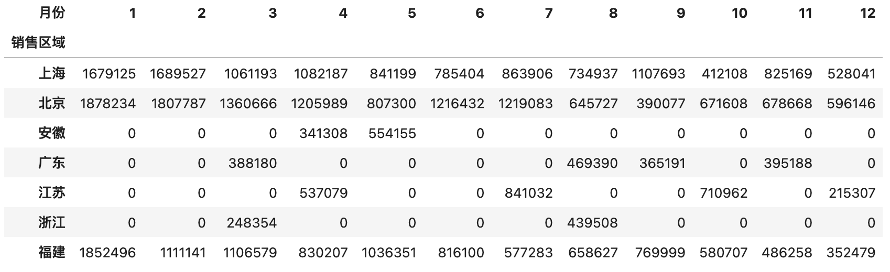
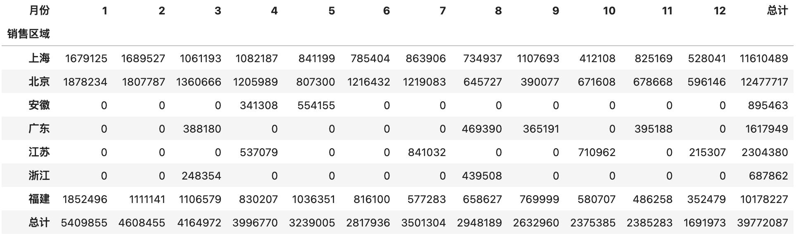
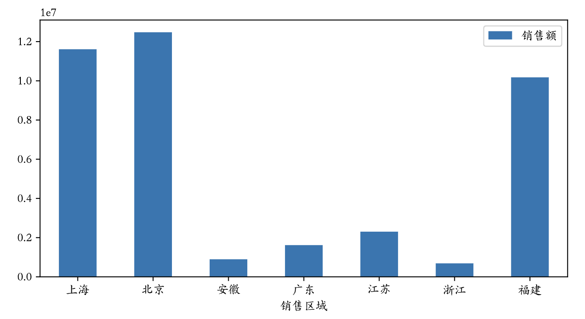

## pandas'ı Derinlemesine İncelemek-4

> **Translated to Turkish by** himmetcanumutlu

### Veri Özeti

Önceki öğrenimle veriyi hazırlayıp istediğimiz biçime getirdik; sırada en önemli veri özeti aşaması var. Çok sayıda veriyle karşılaştığımızda, veriden değerli bilgiyi hızla çıkarıp karmaşık veriyi kolay yorumlanan istatistik grafiğine dönüştürüp iş içgörüsü üretmek, veri analizinin çözdüğü çekirdek sorundur.

#### Tanımlayıcı İstatistik Bilgisi Alma

Önce verinin tanımlayıcı istatistik bilgisini alabiliriz; bununla verinin merkezi eğilimini ve yayılımını anlarız.

Örneğin aşağıdaki öğrenci not tablosu var.

```Python
scores = np.random.randint(50, 101, (5, 3))
names = ('Ali', 'Veli', 'Ayşe', 'Fatma', 'Mehmet')
courses = ('Türkçe', 'Matematik', 'İngilizce')
df = pd.DataFrame(data=scores, columns=courses, index=names)
df
```

Çıktı:

```
      Türkçe   Matematik   İngilizce
Ali  96    72    73
Veli 72    70  97
Ayşe 74    51  79
Fatma 100   54  54
Mehmet 89    100  88
```

`DataFrame` nesnesinin `mean`, `max`, `min`, `std`, `var` gibi metotlarıyla her öğrencinin veya her dersin ortalama, en yüksek, en düşük, standart sapma, varyans gibi bilgisini alabilir; doğrudan `describe` metoduyla da tanımlayıcı istatistik alınabilir; kod aşağıdaki gibidir.

Her dersin not ortalamasını hesaplama.

```Python
df.mean()
```

Çıktı:

```
Türkçe    86.2
Matematik    69.4
İngilizce    78.2
dtype: float64
```

Her öğrencinin not ortalamasını hesaplama.

```Python
df.mean(axis=1)
```

Çıktı:

```
Ali    80.333333
Veli   79.666667
Ayşe   68.000000
Fatma  69.333333
Mehmet 92.333333
dtype: float64
```

Her dersin not varyansını hesaplama.

```Python
df.var()
```

Çıktı:

```
Türkçe    161.2
Matematik    379.8
İngilizce    265.7
dtype: float64
```

> **Not**: Varyanstan görüldüğü gibi matematik notu en çok dalgalanıyor; kutuplaşma daha ciddi olabilir.

Her dersin tanımlayıcı istatistiğini alma.

```Python
df.describe()
```

Çıktı:

```
         Türkçe         Matematik          İngilizce
count   5.000000  5.000000  5.000000
mean    86.200000  69.400000  78.200000
std     12.696456  19.488458  16.300307
min     72.000000  51.000000  54.000000
25%     74.000000  54.000000  73.000000
50%     89.000000  70.000000  79.000000
75%     96.000000  72.000000  88.000000
max     100.000000  100.000000  97.000000
```

#### Sıralama ve İlk Değerleri Alma

Veriyi sıralamak gerekirse `DataFrame` nesnesinin `sort_values` metodunu kullanabilirsiniz; `by` parametresi hangi sütuna veya sütunlara göre sıralanacağını, `ascending` parametresi artan mı azalan mı olduğunu belirtir. Örneğin aşağıdaki kod öğrenci tablosunu Türkçe notuna göre azalan sıralar.

```Python
df.sort_values(by='Türkçe', ascending=False)
```

Çıktı:

```
      Türkçe   Matematik   İngilizce
Fatma  100    54    54
Ali  96     72     73
Mehmet  89     100    88
Ayşe  74     51     79
Veli  72     70     97
```

`DataFrame` çok büyükse sıralama çok zaman alan bir işlemdir. Bazen yalnızca ilk N veya son N kaydı almamız gerekir; bu durumda tüm veriyi sıralamaya gerek yoktur; yığın yapısıyla doğrudan Top-N verisi bulunur. `DataFrame`'in `nlargest` ve `nsmallest` metotları Top-N işlemini destekler; kod aşağıdaki gibidir.

Türkçe notu ilk 3 olan öğrenciyi bulma.

```Python
df.nlargest(3, 'Türkçe')
```

Çıktı:

```
      Türkçe   Matematik   İngilizce
Fatma  100    54    54
Ali  96     72     73
Mehmet  89     100    88
```

Matematik notu en düşük 3 öğrenciyi bulma.

```Python
df.nsmallest(3, 'Matematik')
```

Çıktı:

```
      Türkçe  Matematik  İngilizce
Ayşe  74    51  79
Fatma  100   54  54
Veli  72    70  97
```

#### Gruplama ve Toplama

Önce daha önce kullandığımız Excel dosyasından 2020 satış verisini okuyup gruplama ve toplama işlemini gösterelim.

```Python
df = pd.read_excel('data/2020-satis-verileri.xlsx')
df.head()
```

Çıktı:

```
     Satış tarihi   Satış bölgesi   Satış kanalı  Satış siparişi     Marka    Fiyat  Satış adedi
0   2020-01-01  Şanghay       Pinduoduo    182894-455  Bamati  99    83
1   2020-01-01  Şanghay       Douyin      205635-402  Bamati  219   29
...
```

Her satış bölgesinin toplam satış tutarını saymak istiyorsak, önce "Fiyat" ve "Satış adedi" ile satış tutarını hesaplayıp `DataFrame`'e bir sütun ekleriz; kod aşağıdaki gibidir.

```Python
df['Satış tutarı'] = df['Fiyat'] * df['Satış adedi']
df.head()
```

Çıktı:

```
     Satış tarihi   Satış bölgesi   Satış kanalı  Satış siparişi     Marka    Fiyat  Satış adedi  Satış tutarı
0   2020-01-01  Şanghay       Pinduoduo    182894-455  Bamati  99    83        8217
...
```

Sonra "Satış bölgesi" sütununa göre veriyi gruplarız; burada `DataFrame` nesnesinin `groupby` metodunu kullanırız. Grupladıktan sonra "Satış tutarı" sütununu grup içinde toplarız; kod ve sonuç aşağıdaki gibidir.

```Python
df.groupby('Satış bölgesi').Satış tutarı.sum()
```

Çıktı:

```
Satış bölgesi
Şanghay    11610489
Pekin    12477717
Anhui      895463
Guangdong     1617949
Jiangsu     2304380
Zhejiang      687862
Fujian    10178227
Name: Satış tutarı, dtype: int64
```

Her ayın toplam satış tutarını saymak istiyorsak, "Satış tarihi"ni `groupby` metodunun parametresi yapabiliriz; elbette önce "Satış tarihi"ni aya dönüştürmek gerekir; kod ve sonuç aşağıdaki gibidir.

```Python
df.groupby(df['Satış tarihi'].dt.month).Satış tutarı.sum()
```

Çıktı:

```
Satış tarihi
1     5409855
2     4608455
3     4164972
4     3996770
5     3239005
6     2817936
7     3501304
8     2948189
9     2632960
10    2375385
11    2385283
12    1691973
Name: Satış tutarı, dtype: int64
```

Şimdi zorluğu artırıp her satış bölgesinin her ayının toplam satış tutarını sayalım; bu nasıl yapılır? Aslında `groupby` metodunun ilk parametresi bir liste olabilir; listede birden çok gruplama ölçütü belirtilebilir; aşağıdaki koda ve çıktıya bakınca anlaşılır.

```Python
df.groupby(['Satış bölgesi', df['Satış tarihi'].dt.month]).Satış tutarı.sum()
```

Çıktı:

```
Satış bölgesi  Satış tarihi
Şanghay   1       1679125
        2       1689527
        ...
Pekin   1       1878234
        ...
Fujian   12       352479
Name: Satış tutarı, dtype: int64
```

Her bölgenin toplam satış tutarı ile her bölgedeki tek işlem tutarının en yükseği ve en düşüğünü saymak istiyorsak, `DataFrame` veya `Series` nesnesinde `agg` metoduyla birden çok toplama fonksiyonu belirtilebilir; kod ve sonuç aşağıdaki gibidir.

```Python
df.groupby('Satış bölgesi').Satış tutarı.agg(['sum', 'max', 'min'])
```

Çıktı:

```
           sum     max   min
Satış bölgesi                        
Şanghay    11610489  116303   948
Pekin    12477717  133411   690
Anhui      895463   68502  1683
...
```

Toplama sonrası sütun adını özelleştirmek istiyorsanız aşağıdaki yöntemi kullanabilirsiniz.

```Python
df.groupby('Satış bölgesi').Satış tutarı.agg(toplam='sum', tek_en_yuksek='max', tek_en_dusuk='min')
```

Çıktı:

```
          toplam    tek_en_yuksek  tek_en_dusuk
Satış bölgesi                        
Şanghay      11610489     116303     948
Pekin      12477717     133411     690
...
```

Birden çok sütuna farklı toplama fonksiyonu uygulamak gerekirse, örneğin "her satış bölgesinin satış tutarı toplamı ile satış adedinin en düşük ve en yüksek değeri", aşağıdaki biçimde işlem yapılabilir.

```Python
df.groupby('Satış bölgesi')[['Satış tutarı', 'Satış adedi']].agg({
    'Satış tutarı': 'sum', 'Satış adedi': ['max', 'min']
})
```

Çıktı:

```
           Satış tutarı  Satış adedi    
           sum    max min
Satış bölgesi                   
Şanghay    11610489  100  10
Pekin    12477717  100  10
...
```

#### Özet Tablo ve Çapraz Tablo

Yukarıdaki örnekte "her satış bölgesinin her ayının toplam satış tutarını saymak" çok uzun bir sonuç üretir; gerçek işte satırı çok sütunu az tablolara "dar tablo" deriz; böyle bir "dar tablo" istemiyorsak `DataFrame`'in `pivot_table` metodu veya `pivot_table` fonksiyonuyla özet tablo üretebiliriz. Özet tablonun özü veriyi gruplama ve toplamadır; **A sütununa göre B sütununu istatistiklemek**; Excel kullanmışsanız özet tablo kavramına aşinasınızdır. Örneğin "her satış bölgesinin satış tutarını saymak" istiyorsak "Satış bölgesi" A sütunumuz, "Satış tutarı" B sütunumuzdur; `pivot_table` fonksiyonunda sırasıyla `index` ve `values` parametrelerine karşılık gelir; bu iki parametre de tek sütun veya birden çok sütun olabilir.

```Python
pd.pivot_table(df, index='Satış bölgesi', values='Satış tutarı', aggfunc='sum')
```

Çıktı:

```
           Satış tutarı
Satış bölgesi          
Şanghay    11610489
Pekin    12477717
Anhui      895463
...
```

> **Dikkat**: Yukarıdaki sonuç, `groupby` ile elde edilen sonuçtan biraz farklıdır; `groupby` işleminden sonra tek sütuna toplama yapılırsa `Series` nesnesi elde edilir; yukarıdaki sonuç ise `DataFrame` nesnesidir.

Her satış bölgesinin her ayının toplam satış tutarını saymak istiyorsak `pivot_table` fonksiyonu da kullanılabilir; kod aşağıdaki gibidir.

```Python
df['Ay'] = df['Satış tarihi'].dt.month
pd.pivot_table(df, index=['Satış bölgesi', 'Ay'], values='Satış tutarı', aggfunc='sum')
```

Yukarıdaki sonuç bir `DataFrame`'dir; ama yine uzun bir "dar tablo"dur; satırı az sütunu çok bir "geniş tablo" yapmak istiyorsanız `index` parametresindeki sütunu `columns` parametresine koyabilirsiniz; kod aşağıdaki gibidir.

```Python
pd.pivot_table(df, index='Satış bölgesi', columns='Ay', values='Satış tutarı', aggfunc='sum', fill_value=0)
```

> **Not**: `pivot_table` fonksiyonunun `fill_value=0` parametresi boş değeri `0` yapar.

Çıktı:



`pivot_table` fonksiyonunu kullanırken `margins` ve `margins_name` parametreleriyle gruplama toplamına bir özet eklenebilir; somut işlem ve etki aşağıdaki gibidir.

```Python
pd.pivot_table(df, index='Satış bölgesi', columns='Ay', values='Satış tutarı', aggfunc='sum', fill_value=0, margins=True, margins_name='Toplam')
```

Çıktı:



Çapraz tablo özel bir özet tablodur; önce bir `DataFrame` nesnesi kurmaya gerek yoktur; doğrudan dizi veya `Series` nesnesiyle iki veya daha fazla faktörü belirtip istatistik sonucu alınır. Örneğin her satış bölgesinin toplam satış tutarını saymak istiyorsak aşağıdaki gibi de yapılabilir; önce üç veri grubu hazırlarız.

```Python
sales_area, sales_month, sales_amount = df['Satış bölgesi'], df['Ay'], df['Satış tutarı']
```

`crosstab` fonksiyonuyla çapraz tablo üretme.

```Python
pd.crosstab(index=sales_area, columns=sales_month, values=sales_amount, aggfunc='sum').fillna(0).astype('i8')
```

> **Not**: Yukarıdaki kod `DataFrame` nesnesinin `fillna` metoduyla boş değeri 0 yapar, sonra `astype` metoduyla veri tipini tam sayıya dönüştürür.

### Veri Sunumu

Bir resim bin kelimeye bedeldir; veriyi özetlediğimiz sonucu nihayetinde grafikle sunarız; çünkü grafik çok güçlü ifade gücüne sahiptir; veride gizlenen değeri hızla okumamızı sağlar. `Series` gibi `DataFrame` nesnesi de grafik çizmek için `plot` metodu sunar; altta yine `matplotlib` kütüphanesiyle grafik render edilir. `matplotlib` konusunu bir sonraki bölümde ayrıntılı tartışacağız; burada yalnızca `plot` metodunun kullanımını kısaca anlatıyoruz.

Örneğin "her satış bölgesinin satış tutarını" karşılaştıran bir sütun grafiği çizmek istiyorsak, doğrudan özet tabloda `plot` metoduyla sütun grafiği üretebiliriz. Önce `matplotlib.pyplot` modülünü içe aktarıp çizim parametresini değiştirip Çince görüntülemeyi destekleyelim.

```Python
import matplotlib.pyplot as plt

plt.rcParams['font.sans-serif'] = 'FZJKai-Z03S'
```

> **Not**: Yukarıdaki `FZJKai-Z03S` bilgisayarımda kurulu, Çince destekleyen bir yazı tipinin adıdır; yazı tipi adı, kullanıcı ana dizinindeki `.matplotlib` klasöründeki `fontlist-v330.json` dosyasından öğrenilebilir; bu dosya yukarıdaki komut çalıştırıldıktan sonra üretilir.

Vektör grafik üretmeyi sihirli komutla yapılandırma.

```Python
%config InlineBackend.figure_format = 'svg'
```

"Her satış bölgesinin satış tutarı" sütun grafiğini çizme.

```Python
temp = pd.pivot_table(df, index='Satış bölgesi', values='Satış tutarı', aggfunc='sum')
temp.plot(figsize=(8, 4), kind='bar')
plt.xticks(rotation=0)
plt.show()
```

> **Not**: Yukarıdaki 3. satır yatay eksen işaretindeki yazıyı 0 dereceye döndürür; 4. satır görüntüyü gösterir.

Çıktı:



Pasta grafiği çizmek istiyorsanız `plot` metodunun `kind` parametresini `pie` yapıp pasta grafiği özelleştirme parametreleriyle grafiği özelleştirebilirsiniz; kod aşağıdaki gibidir.

```Python
temp.sort_values(by='Satış tutarı', ascending=False).plot(
    figsize=(6, 6),
    kind='pie',
    y='Satış tutarı',
    ylabel='',
    autopct='%.2f%%',
    pctdistance=0.8,
    wedgeprops=dict(linewidth=1, width=0.35),
    legend=False
)
plt.show()
```

Çıktı:


