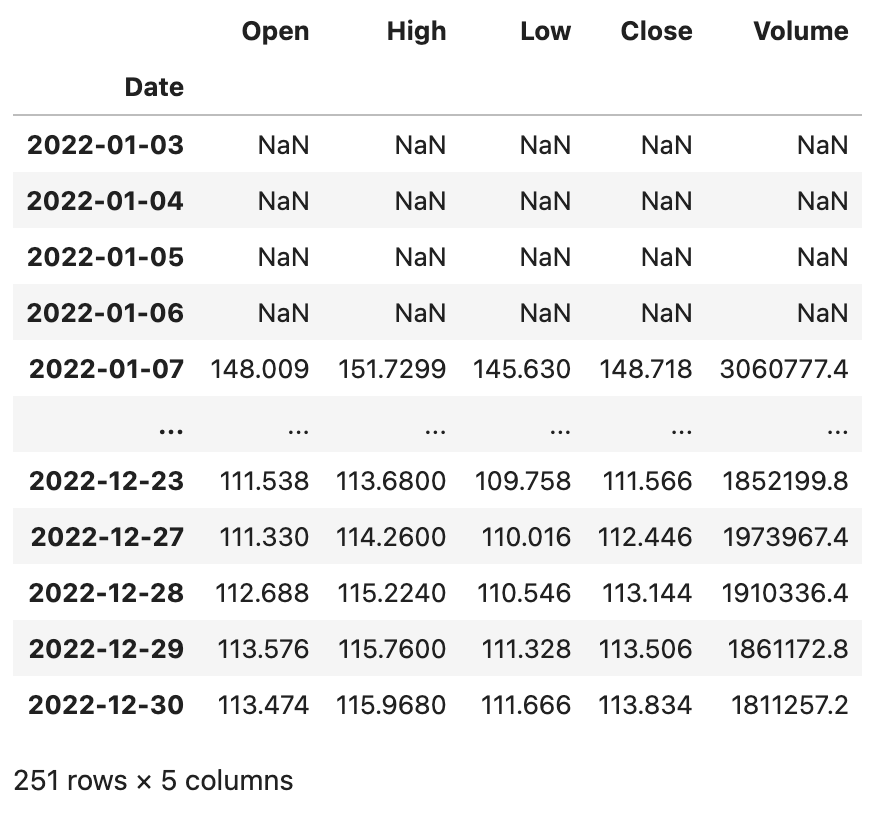
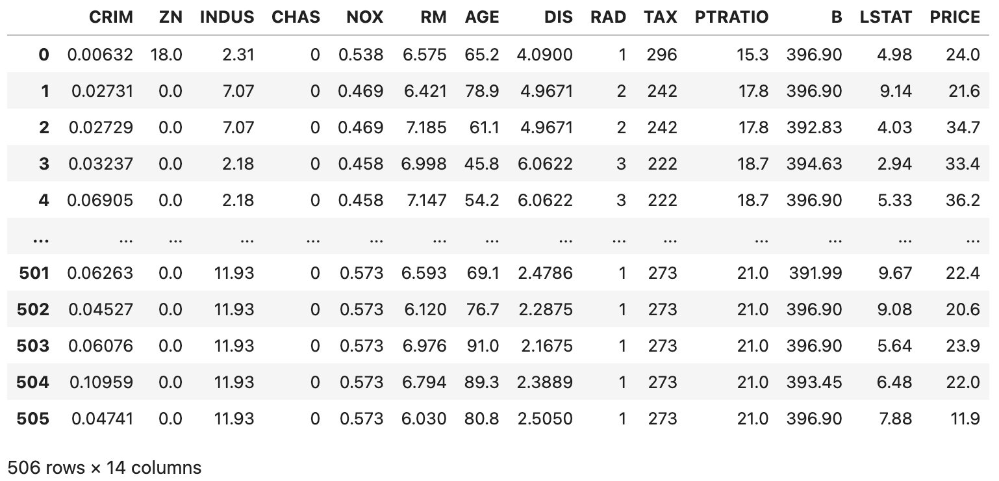
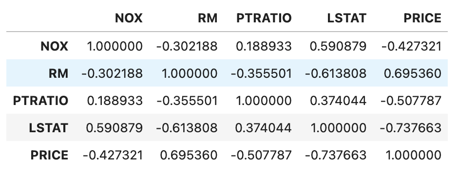

## pandas'ı Derinlemesine İncelemek-5

> **Translated to Turkish by** himmetcanumutlu

`DataFrame` ile veri analizi yaparken kullanılacak bazı işlemleri ekleyelim; bu işlemler hem yaygın hem çok önemlidir.

### Yıllık ve Aylık Değişim Hesaplama

Daha önce aylık satış tutarını sayan bir örnek anlatmıştık; `groupby` metoduyla gruplama yapılabileceği gibi `pivot_table` ile özet tablo da üretilebilir; aşağıdaki gibidir.

```python
sales_df = pd.read_excel('data/2020-satis-verileri.xlsx')
sales_df['Ay'] = sales_df.Satış tarihi.dt.month
sales_df['Satış tutarı'] = sales_df.Fiyat * sales_df.Satış adedi
result_df = sales_df.pivot_table(index='Ay', values='Satış tutarı', aggfunc='sum')
result_df.rename(columns={'Satış tutarı': 'Bu ay satış tutarı'}, inplace=True)
result_df
```

Çıktı:

```
      Bu ay satış tutarı
Ay         
1       5409855
2       4608455
3       4164972
4       3996770
5       3239005
6       2817936
7       3501304
8       2948189
9       2632960
10      2375385
11      2385283
12      1691973
```

Aylık satış tutarını elde ettikten sonra aylık değişimi hesaplamamız gerekirse iki çözüm vardır. İlki `shift` metoduyla veriyi kaydırıp bir önceki ayın verisini bu ayın verisiyle hizalayıp `(bu ay - geçen ay) / geçen ay` ile aylık değişimi hesaplamaktır; kod aşağıdaki gibidir.

```python
result_df['Geçen ay satış tutarı'] = result_df.Bu ay satış tutarı.shift(1)
result_df
```

Çıktı:

```
      Bu ay satış tutarı      Geçen ay satış tutarı
Ay                    
1       5409855            NaN
2       4608455      5409855.0
3       4164972      4608455.0
4       3996770      4164972.0
...
12      1691973      2385283.0
```

Yukarıdaki örnekte `shift` metodunun parametresi `1` veriyi bir birim aşağı kaydırır; elbette `-1` parametresiyle veriyi bir birim yukarı kaydırabiliriz. Düşünmüşsünüzdür: daha fazla yıl verimiz varsa parametreyi `12` yapıp bu yılın her ayı ile geçen yılın her ayı arasındaki yıllık değişimi hesaplayabiliriz.

```python
result_df['Değişim'] = (result_df.Bu ay satış tutarı - result_df.Geçen ay satış tutarı) / result_df.Geçen ay satış tutarı
result_df.style.format(
    formatter={'Geçen ay satış tutarı': '{:.0f}', 'Değişim': '{:.2%}'},
    na_rep='--------'
)
```

Çıktı:

```
      Bu ay satış tutarı      Geçen ay satış tutarı         Değişim
Ay                    
1       5409855       --------     -------- 
2       4608455        5409855      -14.81%     
3       4164972        4608455       -9.62%
4       3996770        4164972       -4.04%
...
12      1691973        2385283      -29.07%
```

> **Not**: JupyterLab kullanırken `DataFrame` nesnesinin `style` özelliğiyle web sayfasında render edilebilir; yukarıdaki kod `Styler` nesnesinin `format` metoduyla değişimi yüzde olarak gösterir; ayrıca boş değeri `--------` ile değiştirmeyi belirtir.

Daha basit olan ikinci çözüm doğrudan `pct_change` metoduyla değişim yüzdesini hesaplamaktır; önce geçen ay satış tutarı ve değişim sütunlarını silelim.

```python
result_df.drop(columns=['Geçen ay satış tutarı', 'Değişim'], inplace=True)
```

Sonra `DataFrame` nesnesinin `pct_change` metoduyla aylık değişimi hesaplayalım. Dikkate değer olan, `pct_change` metodunun `periods` adlı parametresidir; varsayılan değeri `1`'dir; bitişik iki verinin değişim yüzdesini hesaplar; bu tam da istediğimiz aylık değişimdir. Çok yıllık verimiz varsa bu parametreyi `12` yapıp bitişik iki yılın aylık yıllık değişimini elde edebiliriz.

```python
result_df['Değişim'] = result_df.pct_change()
result_df
```

### Pencere Hesaplaması

`DataFrame` nesnesinin `rolling` metodu, veriyi pencereye koyup fonksiyonla penceredeki veriyi işlememizi sağlar. Örneğin bir hissenin son dönem verisini alıp 5 günlük ve 10 günlük hareketli ortalama yapmak istiyorsak, önce pencereyi ayarlayıp işlem yaparız. Aşağıdaki kodla 2022 Baidu hisse verisini okuyalım; veri dosyasını aşağıdaki bağlantıdan alabilirsiniz.

```Python
baidu_df = pd.read_excel('data/2022-hisse-verileri.xlsx', sheet_name='BIDU', index_col='Date')
baidu_df.sort_index(inplace=True)
baidu_df
```

> **Çevirmen notu**: Bu örnekte kullanılan `data/2022-hisse-verileri.xlsx` veri dosyası orijinal depoda yer almamaktadır; dosya adı ve referans yine de Türkçeye çevrilmiştir. Dosyayı orijinal kaynaktan edinip bu adla kaydetmeniz gerekir.

Çıktı:


Yukarıdaki `DataFrame`'de `Open`, `High`, `Low`, `Close`, `Volume` olmak üzere beş sütun vardır; sırasıyla hissenin açılış, en yüksek, en düşük, kapanış fiyatı ve işlem hacmidir; şimdi Baidu hisse verisine pencere hesaplaması yapalım.

```Python
baidu_df.rolling(5).mean()
```

Çıktı:



`Series` üzerinde de `rolling` ile pencere ayarlayıp pencere içinde işlem yapılabilir; örneğin yukarıdaki Baidu hisse kapanış fiyatı (`Close` sütunu) için 5 ve 10 günlük hareketli ortalama hesaplayıp `merge` fonksiyonuyla bir `DataFrame`'e birleştirip çift ortalamalı grafik çizebiliriz; kod aşağıdaki gibidir.

```Python
close_ma5 = baidu_df.Close.rolling(5).mean()
close_ma10 = baidu_df.Close.rolling(10).mean()
result_df = pd.merge(close_ma5, close_ma10, left_index=True, right_index=True)
result_df.rename(columns={'Close_x': 'MA5', 'Close_y': 'MA10'}, inplace=True)
result_df.plot(kind='line', figsize=(10, 6))
plt.show()
```

Çıktı:


### Korelasyon Belirleme

İstatistikte genellikle kovaryans (covariance) ile iki rastgele değişkenin ortak değişim derecesini ölçeriz. $\small{X}$ değişkeninin büyük değerleri ağırlıklı olarak $\small{Y}$ değişkeninin büyük değerlerine karşılık geliyorsa ve küçük değerleri de karşılık geliyorsa, iki değişken benzer davranış sergileme eğilimindedir; kovaryans pozitiftir. Bir değişkenin büyük değerleri ağırlıklı olarak diğer değişkenin küçük değerlerine karşılık geliyorsa, iki değişken zıt davranış sergileme eğilimindedir; kovaryans negatiftir. Basitçe kovaryansın işareti iki değişkenin korelasyonunu gösterir. Varyans, kovaryansın özel durumudur; değişkenin kendisiyle kovaryansıdır.

$$
cov(X,Y) = E((X - \mu)(Y - \upsilon)) = E(X \cdot Y) - \mu\upsilon
$$

$\small{X}$ ve $\small{Y}$ istatistiksel olarak bağımsızsa ikisinin kovaryansı 0'dır; çünkü $\small{X}$ ve $\small{Y}$ bağımsızken:

$$
E(X \cdot Y) = E(X) \cdot E(Y) = \mu\upsilon
$$

Kovaryansın sayısal değeri değişkenin büyüklüğüne bağlıdır; yorumlanması genellikle zordur; ama normalleştirilmiş kovaryans iki değişkenin doğrusal ilişki gücünü gösterebilir. İstatistikte Pearson çarpım-moment korelasyon katsayısı normalleştirilmiş kovaryanstır; iki değişken $\small{X}$ ve $\small{Y}$ arasındaki ilişki derecesini (doğrusal ilişki) ölçer; değeri -1 ile 1 arasındadır.

$$
\frac {cov(X, Y)} {\sigma_{X}\sigma_{Y}}
$$

Örneğin kovaryansını ve standart sapmasını tahmin ederek örnek Pearson katsayısı elde edilir; genellikle Yunan harfi $\small{\rho}$ ile gösterilir.

$$
\rho = \frac {\sum_{i=1}^{n}(X_i - \bar{X})(Y_i - \bar{Y})} {\sqrt{\sum_{i=1}^{n}(X_i - \bar{X})^2} \sqrt{\sum_{i=1}^{n}(Y_i - \bar{Y})^2}}
$$

$\small{\rho}$ değeriyle göstergenin korelasyonunu belirlerken şu iki adım izlenir.

1. Göstergelerin pozitif, negatif mi yoksa ilişkisiz mi olduğunu belirle.
    - $\small{\rho \gt 0}$ ise değişkenler pozitif korelasyonludur; yani eğilimleri aynıdır.
    - $\small{\rho \lt 0}$ ise değişkenler negatif korelasyonludur; yani eğilimleri zıttır.
    - $\small{\rho \approx 0}$ ise değişkenler ilişkisizdir; ama iki gösterge istatistiksel olarak bağımsızdır anlamına gelmez.
2. Göstergeler arasındaki ilişki derecesini belirle.
    - $\small{\rho}$'nun mutlak değeri $\small{[0.6,1]}$ arasındaysa değişkenler güçlü korelasyonludur.
    - $\small{\rho}$'nun mutlak değeri $\small{[0.1,0.6)}$ arasındaysa değişkenler zayıf korelasyonludur.
    - $\small{\rho}$'nun mutlak değeri $\small{[0,0.1)}$ arasındaysa değişkenler arasında korelasyon yoktur.

Pearson korelasyon katsayısı şu durumlara uygundur:

1. İki değişken arasında doğrusal ilişki vardır; ikisi de sürekli veridir.
2. İki değişkenin evreni normal dağılımlıdır veya normale yakın tek tepeli dağılımdır.
3. İki değişkenin gözlem değerleri eşleşiktir; her eşleşik gözlem çifti birbirinden bağımsızdır.

Burada şunu da söyleyelim: iki değişken grubu normal evrenden gelen sürekli değer değilse korelasyonu nasıl belirleriz? Sıralı ölçek (derece) için Spearman sıra korelasyon katsayısı kullanılabilir; formülü aşağıdaki gibidir:

$$
r_{s}=1-{\frac {6\sum d_{i}^{2}}{n(n^{2}-1)}}
$$

Burada $\small{d_{i}=\operatorname {R} (X_{i})-\operatorname {R} (Y_{i})}$; yani her gözlem grubundaki iki değişkenin derece farkıdır; $\small{n}$ gözlem örnek sayısıdır.

Kategorik ölçek (kategori) için ki-kare sınamasıyla ilişki olup olmadığı belirlenebilir. Aslında çoğu zaman sürekli değer de bölmelemeyle ayrık derece veya kategoriye dönüştürülüp Spearman sıra korelasyon katsayısı veya ki-kare sınamasıyla korelasyon belirlenir.

`DataFrame` nesnesinin `cov` ve `corr` metotları sırasıyla kovaryans ve korelasyon katsayısını hesaplar; `corr` metodunun `method` adlı parametresi vardır; varsayılanı `pearson`'dur; Pearson korelasyon katsayısını hesaplar; ayrıca `kendall` veya `spearman` belirtilip Kendall katsayısı veya Spearman sıra korelasyon katsayısı hesaplanabilir.

`boston_house_price.csv` dosyasından ünlü Boston konut fiyatı veri kümesini alıp bir `DataFrame` oluşturalım.

```python
boston_df = pd.read_csv('data/boston_house_price.csv')
boston_df
```

Çıktı:



> **Not**: Yukarıdaki kod CSV dosyasına göreli yolla erişir; CSV dosyası mevcut çalışma yolundaki `data` klasöründedir. Örnekteki CSV dosyasına ihtiyacınız varsa aşağıdaki Baidu ağ disk adresinden alabilirsiniz. Bağlantı: <https://pan.baidu.com/s/1rQujl5RQn9R7PadB2Z5g_g?pwd=e7b4>, çıkarma kodu: e7b4.

Görüldüğü gibi veri kümesinde suç oranı, azot oksit konsantrasyonu, ortalama oda sayısı, düşük gelirli nüfus oranı gibi konut fiyatını etkileyen birçok özellik vardır; `PRICE` konut fiyatıdır; somut durum aşağıdaki gibidir.


Şimdi normal evrenden gelen sürekli değer sayılabilecekleri `corr` metoduyla Pearson korelasyon katsayısını hesaplayıp, hangilerinin konut fiyatıyla pozitif veya negatif korelasyonlu olduğuna bakalım; kod aşağıdaki gibidir.

```Python
boston_df[['NOX', 'RM', 'PTRATIO', 'LSTAT', 'PRICE']].corr()
```

Çıktı:



Görüldüğü gibi ortalama oda sayısı (`RM`) konut fiyatıyla güçlü pozitif korelasyonlu; düşük gelirli nüfus oranı (`LSTAT`) konut fiyatıyla belirgin negatif korelasyonludur.

Spearman sıra korelasyon katsayısının veri koşulları Pearson kadar katı değildir; iki değişkenin gözlem değerleri eşleşik derece verisi olduğu veya sürekli değişkenden dereceye dönüştürüldüğü sürece, evren dağılımı ve örnek boyutu ne olursa olsun Spearman sıra korelasyon katsayısı kullanılabilir. Aşağıdaki biçimde bazı özellikleri ön işleyip Spearman sıra korelasyon katsayısını hesaplayabiliriz.

```Python
boston_df['CRIM'] = boston_df.CRIM.apply(lambda x: x // 5 if x < 25 else 5).map(int)
boston_df['ZN'] = pd.qcut(boston_df.ZN, q=[0, 0.75, 0.8, 0.85, 0.9, 0.95, 1], labels=np.arange(6))
boston_df['AGE'] = (boston_df.AGE // 20).map(int)
boston_df['DIS'] = (boston_df.DIS // 2.05).map(int)
boston_df['B'] = (boston_df.B // 66).map(int)
boston_df['PRICE'] = pd.qcut(boston_df.PRICE, q=[0, 0.15, 0.3, 0.5, 0.7, 0.85, 1], labels=np.arange(6))
boston_df[['CRIM', 'ZN', 'AGE', 'DIS', 'B', 'PRICE']].corr(method='spearman')
```

Çıktı:


Görüldüğü gibi konut fiyatı suç oranı (`CRIM`) ve bina yaşı (`AGE`) ile belirgin negatif korelasyonlu; konut arsası boyutu (`ZN`) ile zayıf pozitif korelasyonludur. Korelasyon, gerçek işte iş kaldıracını bulmamıza, yani iş sonucunu etkileyebilecek veya değiştirebilecek ilgili faktörleri bulmamıza yardımcı olur.
