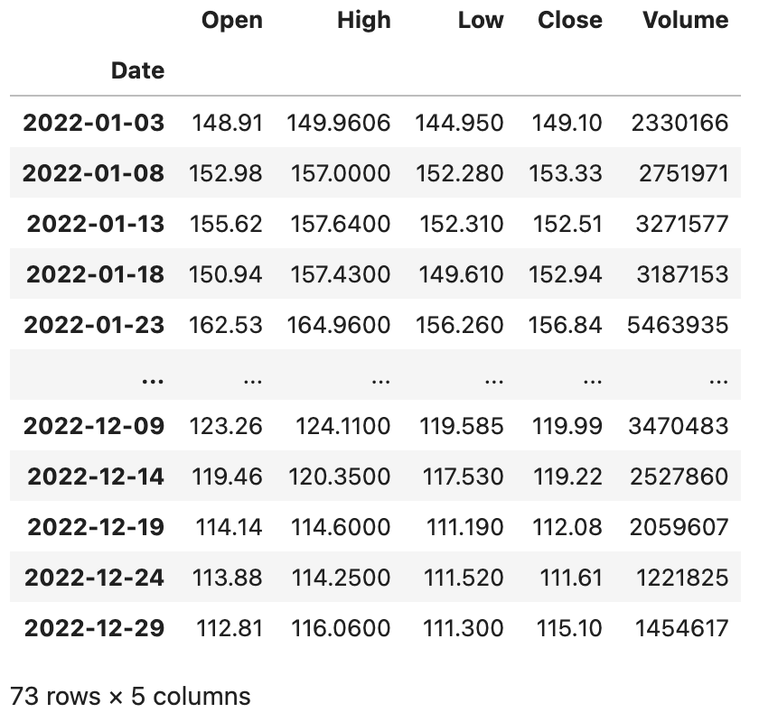

## pandas'ı Derinlemesine İncelemek-6

> **Translated to Turkish by** himmetcanumutlu

`Index` tipine bakalım; `Series` ve `DataFrame` nesnesine indeks hizmeti sunar; indeksle veriyi sıralayabilir (`sort_index` metodu), veriyi hizalayabilir (işlem ve birleştirmede çok önemli) ve veriye hızlı erişim sağlayabiliriz (indeks işlemi). `DataFrame` tipi iki boyutlu veriyi temsil ettiğinden satır ve sütunlarının indeksi vardır; sırasıyla `index` ve `columns`'tur. `Index` tipinin oluşturulması nispeten basittir; genellikle `data`, `dtype` ve `name` olmak üzere üç parametre verilir; sırasıyla indeks olarak kullanılacak veriyi, indeksin veri tipini ve indeksin adını belirtir. `Index` de tek boyutlu veri olduğundan metot ve özellikleri `Series`'e çok benzer; bir `Index` nesnesi oluşturup daha önce öğrendiğiniz özellik ve metotların `Index` tipinde geçerli olup olmadığını deneyebilirsiniz. Şimdi `Index`'in birkaç alt tipine bakalım.

### Aralık İndeksi

Aralık indeksi, monotonluk özelliği olan tam sayılardan oluşan indekstir; `RangeIndex` kurucusuyla veya `RangeIndex` sınıfının `from_range` sınıf metoduyla oluşturulabilir; kod aşağıdaki gibidir.

Kod:

```Python
sales_data = np.random.randint(400, 1000, 12)
index = pd.RangeIndex(1, 13, name='Ay')
ser = pd.Series(data=sales_data, index=index)
ser
```

Çıktı:

```
Ay
1     703
2     705
3     557
4     943
5     961
6     615
7     788
8     985
9     921
10    951
11    874
12    609
dtype: int64
```

### Kategorik İndeks

Kategorik indeks, kategorik ölçekten oluşan indekstir. İndeksle veriyi gruplayıp sonra toplama yapmamız gerekirse kategorik indeks işe yarar. Kategorik indeksin `reorder_categories` adlı bir metodu vardır; indekse bir sıra verilir; gruplama toplamının sonucu bu sıraya göre sunulur; kod aşağıdaki gibidir.

Kod:

```Python
sales_data = [6, 6, 7, 6, 8, 6]
index = pd.CategoricalIndex(
    data=['elma', 'muz', 'elma', 'elma', 'şeftali', 'muz'],
    categories=['elma', 'muz', 'şeftali'],
    ordered=True
)
ser = pd.Series(data=sales_data, index=index)
ser
```

Çıktı:

```
elma    6
muz    6
elma    7
elma    6
şeftali    8
muz    6
dtype: int64
```

İndekse göre veriyi gruplayıp `sum` ile toplama.

```Python
ser.groupby(level=0).sum()
```

Çıktı:

```
elma    19
muz    12
şeftali     8
dtype: int64
```

İndeksin sırasını belirtme.

```python
ser.index = index.reorder_categories(['muz', 'şeftali', 'elma'])
ser.groupby(level=0).sum()
```

Çıktı:

```
muz    12
şeftali     8
elma    19
dtype: int64
```

### Çok Seviyeli İndeks

Pandas'taki `MultiIndex` tipi hiyerarşik veya çok seviyeli indeksi temsil eder. `MultiIndex` sınıfının `from_arrays`, `from_product`, `from_tuples` gibi sınıf metotlarıyla çok seviyeli indeks oluşturulabilir; birkaç örnek verelim.

Kod:

```python
tuples = [(1, 'red'), (1, 'blue'), (2, 'red'), (2, 'blue')]
index = pd.MultiIndex.from_tuples(tuples, names=['no', 'color'])
index
```

Çıktı:

```
MultiIndex([(1,  'red'),
            (1, 'blue'),
            (2,  'red'),
            (2, 'blue')],
           names=['no', 'color'])
```

Kod:

```python
arrays = [[1, 1, 2, 2], ['red', 'blue', 'red', 'blue']]
index = pd.MultiIndex.from_arrays(arrays, names=['no', 'color'])
index
```

Çıktı:

```
MultiIndex([(1,  'red'),
            (1, 'blue'),
            (2,  'red'),
            (2, 'blue')],
           names=['no', 'color'])
```

Kod:

```python
sales_data = np.random.randint(1, 100, 4)
ser = pd.Series(data=sales_data, index=index)
ser
```

Çıktı:

```
no  color
1   red      43
    blue     31
2   red      55
    blue     75
dtype: int64
```

Kod:

```python
ser.groupby('no').sum()
```

Çıktı:

```
no
1     74
2    130
dtype: int64
```

Kod:

```python
ser.groupby(level=1).sum()
```

Çıktı:

```
color
blue    106
red      98
dtype: int64
```

Kod:

```Python
stu_ids = np.arange(1001, 1006)
semisters = ['Ara sınav', 'Final']
index = pd.MultiIndex.from_product((stu_ids, semisters), names=['Öğrenci no', 'Dönem'])
courses = ['Türkçe', 'Matematik', 'İngilizce']
scores = np.random.randint(60, 101, (10, 3))
df = pd.DataFrame(data=scores, columns=courses, index=index)
df
```

Çıktı:

```
              Türkçe Matematik İngilizce
Öğrenci no  Dönem      
1001  Ara sınav  93  77  60
      Final  93  98  84
1002  Ara sınav  64  78  71
      Final  70  71  97
...
1005  Final  84  78  86
```

Birinci seviye indekse göre veriyi gruplayıp, ara sınav %25, final %75 ağırlığıyla her öğrencinin her dersinin notunu hesaplama.

Kod:

```Python
df.groupby(level=0).agg(lambda x: x.values[0] * 0.25 + x.values[1] * 0.75)
```

Çıktı:

```
        Türkçe    Matematik    İngilizce
Öğrenci no      
1001  93.00  92.75  78.00
1002  68.50  72.75  90.50
1003  92.25  97.00  71.50
1004  88.25  64.25  69.25
1005  83.50  82.25  81.25
```

### Aralıklı İndeks

Aralıklı indeks, adından da anlaşılacağı gibi sabit aralık kullanarak indeks yapar; genellikle `interval_range` fonksiyonuyla oluşturulur; kod aşağıdaki gibidir.

Kod:

```python
index = pd.interval_range(start=0, end=5)
index
```

Çıktı:

```
IntervalIndex([(0, 1], (1, 2], (2, 3], (3, 4], (4, 5]], dtype='interval[int64, right]')
```

`IntervalIndex`'in `contains` adlı metodu aralığın belirli bir elemanı içerip içermediğini kontrol eder; aşağıdaki gibidir.

Kod:

```python
index.contains(1.5)
```

Çıktı:

```
array([False,  True, False, False, False])
```

`IntervalIndex`'in `overlaps` adlı metodu bir aralığın diğer aralıklarla örtüşüp örtüşmediğini kontrol eder; aşağıdaki gibidir.

Kod:

```python
index.overlaps(pd.Interval(1.5, 3.5))
```

Çıktı:

```
array([False,  True,  True,  True, False])
```

Aralığın sol kapalı sağ açık olmasını istiyorsanız aralık indeksi oluştururken `closed='left'` yapılır; iki tarafın da kapalı olmasını istiyorsanız `closed` parametresini `both` yapın; kod aşağıdaki gibidir.

Kod:

```python
index = pd.interval_range(start=0, end=5, closed='left')
index
```

Çıktı:

```
IntervalIndex([[0, 1), [1, 2), [2, 3), [3, 4), [4, 5)], dtype='interval[int64, left]')
```

Kod:

```python
index = pd.interval_range(start=pd.Timestamp('2022-01-01'), end=pd.Timestamp('2022-01-04'), closed='both')
index
```

Çıktı:

```
IntervalIndex([[2022-01-01, 2022-01-02], [2022-01-02, 2022-01-03], [2022-01-03, 2022-01-04]], dtype='interval[datetime64[ns], both]')
```


### Tarih-Saat İndeksi

`DatetimeIndex`, birçok indeks içinde en karmaşık ve önemli olanıdır; genellikle `date_range()` fonksiyonuyla oluşturulur; fonksiyonun `start`, `end`, `periods`, `freq`, `tz` olmak üzere birkaç önemli parametresi vardır; sırasıyla başlangıç tarih-saati, bitiş tarih-saati, üretim periyodu, örnekleme sıklığı ve saat dilimidir. Önce `DatetimeIndex` nesnesinin nasıl oluşturulacağına bakalım, sonra ilgili işlemleri tartışalım; kod aşağıdaki gibidir.

Kod:

```Python
pd.date_range('2021-1-1', '2021-6-30', periods=10)
```

Çıktı:

```
DatetimeIndex(['2021-01-01', '2021-01-21', '2021-02-10', '2021-03-02',
               '2021-03-22', '2021-04-11', '2021-05-01', '2021-05-21',
               '2021-06-10', '2021-06-30'],
              dtype='datetime64[ns]', freq=None)
```

Kod:

```Python
pd.date_range('2021-1-1', '2021-6-30', freq='W')
```

> **Not**: `freq=W` örnekleme periyodunun bir hafta olduğunu belirtir; varsayılan olarak Pazar haftanın başıdır; Pazartesi'nin haftanın başı olmasını istiyorsanız `freq=W-MON` yapabilirsiniz; parametreyi `12H`, `M`, `Q` gibi değerlerle de deneyip ne olduğuna bakabilirsiniz; anlamlarını tahmin etmek zor değildir.

Çıktı:

```
DatetimeIndex(['2021-01-03', '2021-01-10', '2021-01-17', '2021-01-24',
               '2021-01-31', '2021-02-07', '2021-02-14', '2021-02-21',
               '2021-02-28', '2021-03-07', '2021-03-14', '2021-03-21',
               '2021-03-28', '2021-04-04', '2021-04-11', '2021-04-18',
               '2021-04-25', '2021-05-02', '2021-05-09', '2021-05-16',
               '2021-05-23', '2021-05-30', '2021-06-06', '2021-06-13',
               '2021-06-20', '2021-06-27'],
              dtype='datetime64[ns]', freq='W-SUN')
```

`DatetimeIndex`, `DateOffset` tipiyle işlem yapabilir; bu kolay anlaşılır; bir zaman farkı ayarlayıp zamanı ileri veya geri kaydırabiliriz; somut işlem aşağıdaki gibidir.

Kod:

```Python
index = pd.date_range('2021-1-1', '2021-6-30', freq='W')
index - pd.DateOffset(days=2)
```

Çıktı:

```
DatetimeIndex(['2021-01-01', '2021-01-08', '2021-01-15', '2021-01-22',
               '2021-01-29', '2021-02-05', '2021-02-12', '2021-02-19',
               ...
               '2021-06-18', '2021-06-25'],
              dtype='datetime64[ns]', freq=None)
```

Kod:

```Python
index + pd.DateOffset(hours=2, minutes=10)
```

Çıktı:

```
DatetimeIndex(['2021-01-03 02:10:00', '2021-01-10 02:10:00',
               ...
               '2021-06-27 02:10:00'],
              dtype='datetime64[ns]', freq=None)
```

`Series` veya `DataFrame` nesnesi `DatetimeIndex` tipi indeks kullanıyorsa, `asfreq()` metoduyla bir zaman sıklığı belirtip veriyi örnekleyebiliriz; yine daha önce anlattığımız Baidu hisse verisiyle gösterelim.

Kod:

```Python
baidu_df = pd.read_excel('data/2022-hisse-verileri.xlsx', sheet_name='BIDU', index_col='Date')
baidu_df.sort_index(inplace=True)
baidu_df.asfreq('5D')
```

> **Çevirmen notu**: Bu örnekte kullanılan `data/2022-hisse-verileri.xlsx` veri dosyası orijinal depoda yer almamaktadır; dosya adı ve referans yine de Türkçeye çevrilmiştir. Dosyayı orijinal kaynaktan edinip bu adla kaydetmeniz gerekir.

Çıktı:


Fark etmişsinizdir: her 5 günde 1 gün seçildiğinde işlem günü olmayan gün seçilebilir; o zaman ilgili sütunlar boş kalır; bu sorunu çözmek için `asfreq` metodunda `method` parametresiyle boş değeri doldurma yöntemi belirtilebilir; bitişik işlem gününün verisi doldurulur.

Kod:

```Python
baidu_df.asfreq('5D', method='ffill')
```

Çıktı:



`DatetimeIndex` indeksi kullanırken `resample()` metoduyla zamana göre veriyi yeniden örnekleyebiliriz; bu, zaman periyoduna göre veriyi gruplamak gibidir; grupladıktan sonra toplama istatistiği de yapılabilir; kod aşağıdaki gibidir.

Kod:

```Python
baidu_df.resample('1M').mean()
```

Çıktı:


Kod:

```python
baidu_df.resample('1M').agg(['mean', 'std'])
```

Çıktı:


> **İpucu**: Fark ettiniz mi bilmem, yukarıdaki çıktıdaki `DataFrame`'in sütun indeksi bir `MultiIndex` nesnesidir. Yukarıdaki `DataFrame` nesnesinin `columns` özelliğine bakabilirsiniz.

Tarih-saatin saat dilimi dönüşümünü yapmak istiyorsak önce `tz_localize()` metoduyla tarih-saati yerelleştiririz; kod aşağıdaki gibidir.

Kod:

```Python
baidu_df = baidu_df.tz_localize('Asia/Chongqing')
baidu_df
```

Çıktı:


Zamanı yerelleştirdikten sonra `tz_convert()` metoduyla saat dilimi dönüştürülür; kod aşağıdaki gibidir.

Kod:

```Python
baidu_df.tz_convert('America/New_York')
```

Çıktı:


Veriniz `DatetimeIndex` tipi indeks kullanıyorsa, büyük olasılıkla zaman serisi analizi yapmanız gerekir; zaman serisi analizinin yöntem ve modelleri bu bölümün konusu değildir; başka köşe yazılarında paylaşırız.
