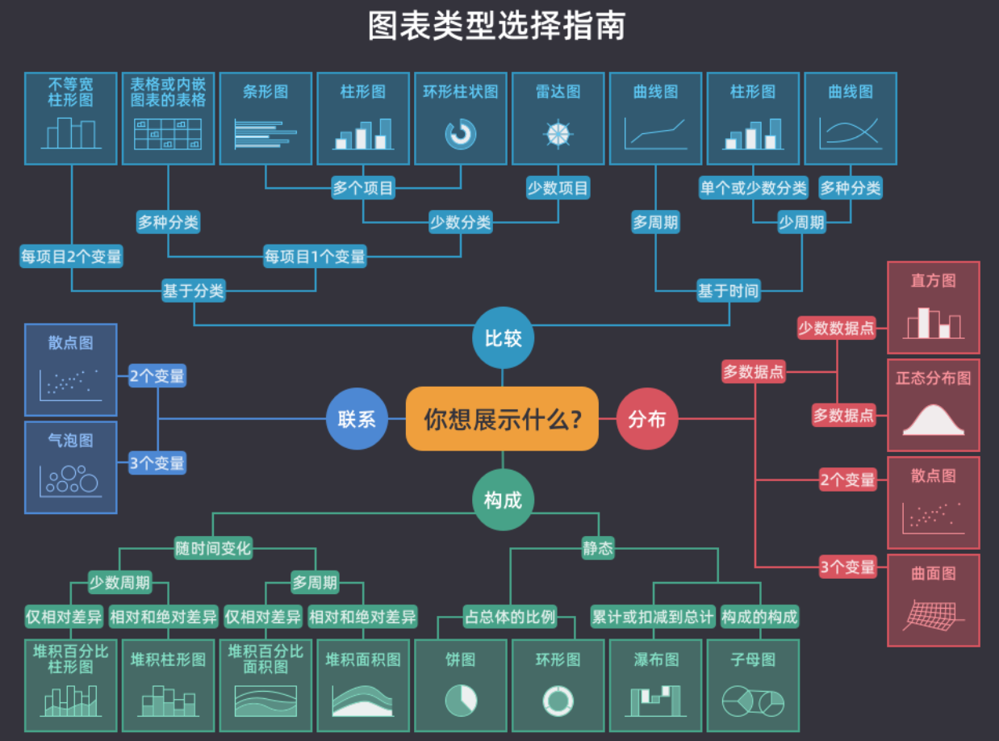
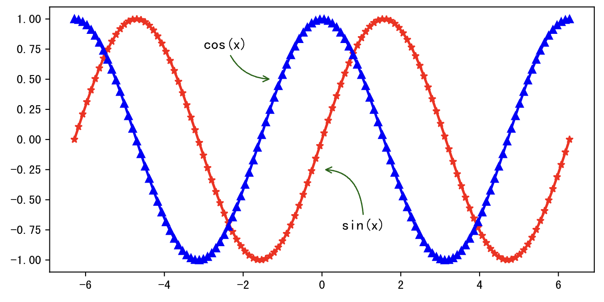
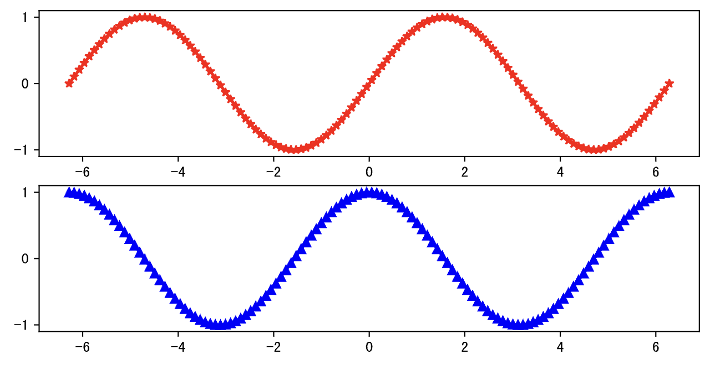
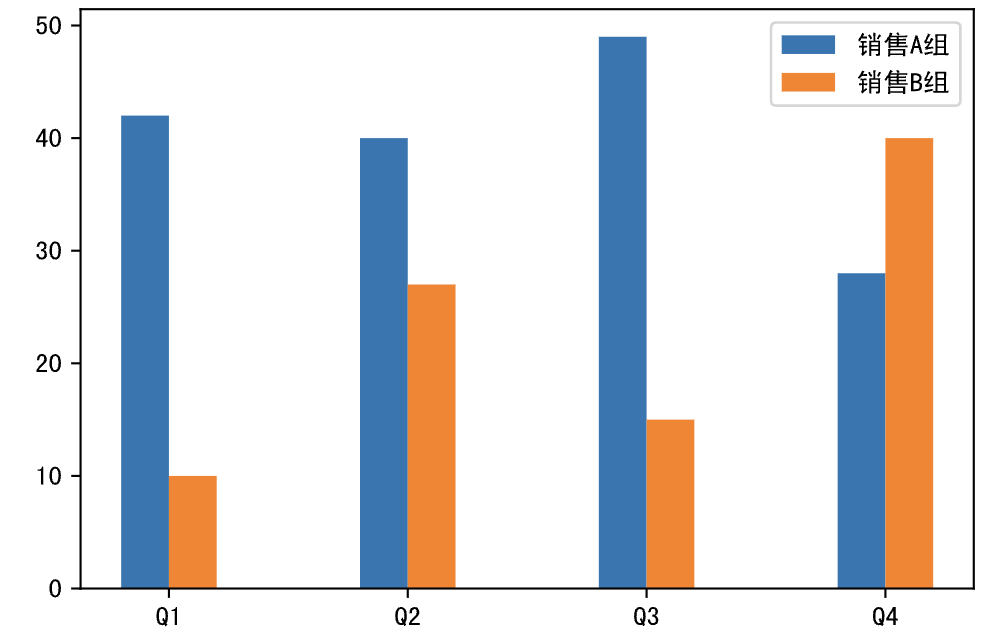
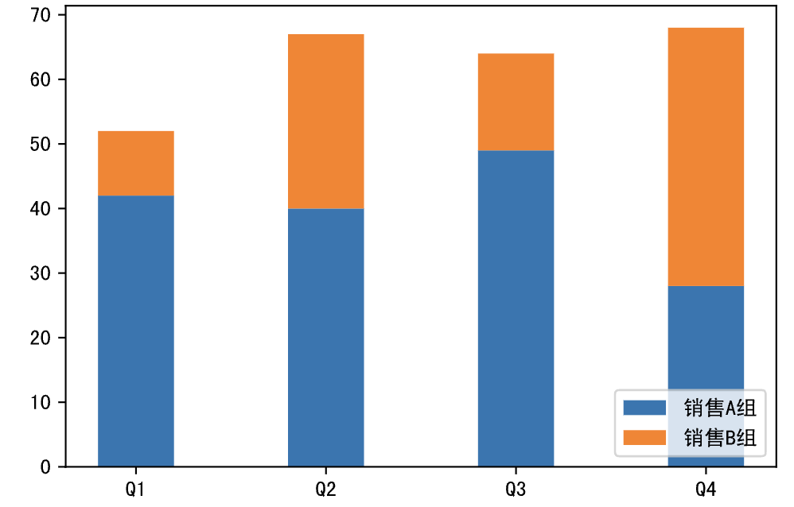
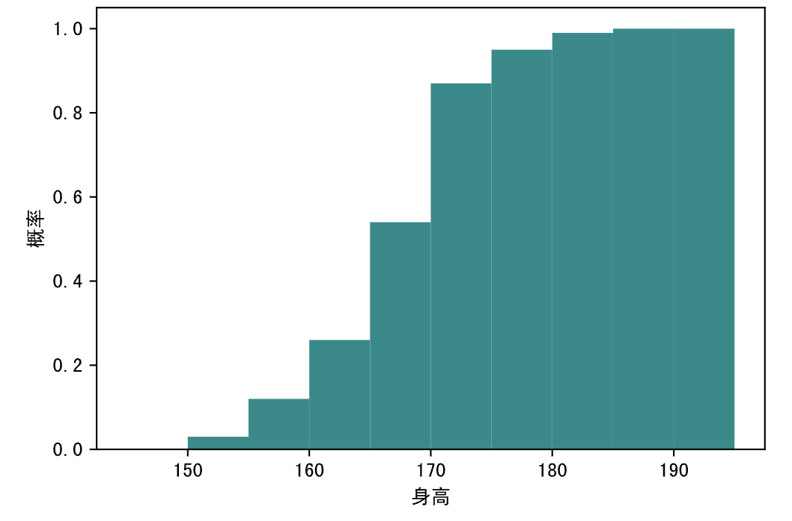
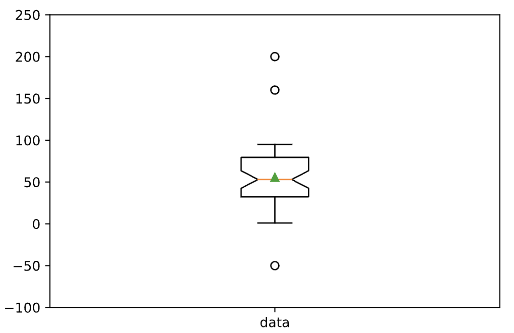

## Veri Görselleştirme-1

> **Translated to Turkish by** himmetcanumutlu

Veriyi özetledikten sonra, özetleme sonucunu görselleştirip sunabiliriz; basitçe veriyi güzel istatistik grafiklerine dönüştürmektir; çünkü insan renklere ve şekillere daha duyarlıdır; sonra verinin arkasındaki ticari değeri yorumlarız. Önceki derslerde `Series` veya `DataFrame` nesnesinin `plot` metoduyla görsel grafik üretmeyi gösterdik; bu bölümde bu çizim metodunun temelini, yani ünlü matplotlib kütüphanesini anlatıyoruz.

matplotlib'i anlatmadan önce aşağıdaki şekle bakın; yaygın grafik tiplerini ve uygulama senaryolarını verir. İstatistik grafiği seçerken hangisinin en uygun olduğunu bilmiyorsanız bu şekil size yardımcı olur. Basitçe: eğilime çizgi grafiği, veri karşılaştırmaya sütun grafiği, ilişkiye dağılım grafiği, paya pasta grafiği, dağılıma histogram, aykırı değere kutu grafiği.



### İçe Aktarma ve Yapılandırma

Önceki derslerde matplotlib'in nasıl kurulup içe aktarılacağını anlattık; matplotlib kurulu mu emin değilseniz aşağıdaki sihirli komutla kurmayı veya güncellemeyi deneyebilirsiniz.

```
%pip install -U matplotlib
```

matplotlib grafiğinde Çince gösterim sorununu çözmek için `pyplot` modülünün `rcParams` yapılandırma parametresini değiştirmemiz gerekir; somut işlem aşağıdaki gibidir.

```Python
import matplotlib.pyplot as plt

plt.rcParams['font.sans-serif'].insert(0, 'SimHei')
plt.rcParams['axes.unicode_minus'] = False
```

> **Not**: Yukarıdaki koddaki `SimHei` yazı tipi adıdır; Baidu ağ diskinden indirip kurabilirsiniz; bağlantı: https://pan.baidu.com/s/1rQujl5RQn9R7PadB2Z5g_g?pwd=e7b4. Başka Çince yazı tipi kurmayı deneyebilirsiniz; kurduktan sonra adını bilmiyorsanız kullanıcı ana dizinindeki `.matplotlib` klasöründeki `fontlist-v330.json` dosyasını açıp yazı tipi dosyasının yolunu ve adını görebilirsiniz. Dikkat: Çince yazı tipi kullandıktan sonra eksendeki eksi işareti gösterilemez; `axes.unicode_minus` parametresini `False` yapmak gerekir; böylece eksendeki eksi işareti normal gösterilir.

Aşağıdaki sihirli komutla çizimde [vektör grafik](https://zh.wikipedia.org/wiki/%E7%9F%A2%E9%87%8F%E5%9B%BE%E5%BD%A2) (SVG - Scalable Vector Graphics) üretilebilir; vektör grafik büyütme, küçültme veya döndürme ile bozulmaz; çok daha rahat görünür.

```Python
%config InlineBackend.figure_format='svg'
```

### Kanvas Oluşturma

`pyplot` modülünün `figure` fonksiyonu kanvas oluşturur; kanvas oluştururken `figsize` parametresiyle kanvas boyutu (varsayılan `[6.4, 4.8]`); `dpi` parametresiyle çizim çözünürlüğü ayarlanır; `dpi` inç başına piksel sayısını temsil eder. Ayrıca `facecolor` parametresiyle kanvasın arka plan rengi ayarlanır. `figure` fonksiyonunun dönüş değeri bir `Figure` nesnesidir; çizimde kullanılan kanvası temsil eder; kanvasa dayanarak çizimde kullanılacak koordinat sistemi oluşturulur.

```Python
plt.figure(figsize=(8, 4), dpi=120, facecolor='darkgray')
```

### Koordinat Sistemi Oluşturma

`pyplot` modülünün `subplot` fonksiyonu koordinat sistemi oluşturur; `Axes` nesnesi döndürür. `subplot`'un ilk üç parametresi sırasıyla kanvasın kaç satır kaç sütuna bölüneceğini ve mevcut koordinat sisteminin indeksini belirtir; bu üç parametrenin varsayılanı `1`'dir. Koordinat sistemi oluşturulmazsa çizimde kanvastaki varsayılan ve tek koordinat sistemi kullanılır; kanvasta birden çok koordinat sistemi oluşturmak gerekirse bu fonksiyon kullanılır. Elbette yukarıda oluşturduğumuz `Figure` nesnesinin `add_subplot` veya `add_axes` metoduyla da koordinat sistemi oluşturulabilir; ilki `subplot` fonksiyonuyla aynı işlevdedir; ikincisi iç içe koordinat sistemi üretir.

```Python
plt.subplot(2, 2, 1)
```

### Grafik Çizme

#### Çizgi Grafiği

Çizim yaparken önce `figure` ve `subplot` fonksiyonu çağrılmazsa varsayılan kanvas ve koordinat sistemi kullanılır; çizgi grafiği çizmek için `pyplot` modülünün `plot` fonksiyonu kullanılır ve yatay-dikey eksen verisi belirtilir. Çizgi grafiği verinin eğilimini gözlemlemek için en uygundur; özellikle yatay eksen zamanı temsil ediyorsa. `plot` fonksiyonunun `color` parametresiyle çizginin rengi, `marker` parametresiyle veri noktasının işareti (ör. `*` beş köşeli yıldız, `^` üçgen, `o` küçük daire), `linestyle` parametresiyle çizginin stili (ör. `-` düz çizgi, `--` kesikli, `:` noktalı), `linewidth` parametresiyle çizginin kalınlığı özelleştirilir. Aşağıdaki kod bir sinüs eğrisi çizer; `marker='*'` veri noktasını beş köşeli yıldız yapar; `color='red'` çizgiyi kırmızı yapar.

Kod:

```Python
import numpy as np

x = np.linspace(-2 * np.pi, 2 * np.pi, 120)
y = np.sin(x)

# Kanvas oluştur
plt.figure(figsize=(8, 4), dpi=120)
# Çizgi grafiği çiz
plt.plot(x, y, linewidth=2, marker='*', color='red')
# Çizimi göster
plt.show()
```

Çıktı:


Bir koordinat sisteminde sinüs ve kosinüs eğrisini aynı anda çizmek istiyorsanız yukarıdaki kodu biraz değiştirebilirsiniz.

Kod:

```Python
x = np.linspace(-2 * np.pi, 2 * np.pi, 120)
y1, y2 = np.sin(x), np.cos(x)

plt.figure(figsize=(8, 4), dpi=120)
plt.plot(x, y1, linewidth=2, marker='*', color='red')
plt.plot(x, y2, linewidth=2, marker='^', color='blue')
# Grafiğe açıklama ekle (annotate fonksiyonunun parametrelerini anlamıyorsanız şimdilik önemsemeyin)
plt.annotate('sin(x)', xytext=(0.5, -0.75), xy=(0, -0.25), fontsize=12, arrowprops={
    'arrowstyle': '->', 'color': 'darkgreen', 'connectionstyle': 'angle3, angleA=90, angleB=0'
})
plt.annotate('cos(x)', xytext=(-3, 0.75), xy=(-1.25, 0.5), fontsize=12, arrowprops={
    'arrowstyle': '->', 'color': 'darkgreen', 'connectionstyle': 'arc3, rad=0.35'
})
plt.show()
```

Çıktı:



İki koordinat sistemiyle sinüs ve kosinüsü ayrı ayrı çizmek istiyorsanız yukarıda sözünü ettiğimiz `subplot` fonksiyonuyla koordinat sistemi oluşturup sonra çizebilirsiniz.

Kod:

```Python
plt.figure(figsize=(8, 4), dpi=120)
# Koordinat sistemi oluştur (1. grafik)
plt.subplot(2, 1, 1)
plt.plot(x, y1, linewidth=2, marker='*', color='red')
# Koordinat sistemi oluştur (2. grafik)
plt.subplot(2, 1, 2)
plt.plot(x, y2, linewidth=2, marker='^', color='blue')
plt.show()
```

Çıktı:



Elbette aşağıdaki gibi de yapılabilir; kodu çalıştırıp yukarıdaki grafikten farkına bakabilirsiniz.

```Python
plt.figure(figsize=(8, 4), dpi=120)
plt.subplot(1, 2, 1)
plt.plot(x, y1, linewidth=2, marker='*', color='red')
plt.subplot(1, 2, 2)
plt.plot(x, y2, linewidth=2, marker='^', color='blue')
plt.show()
```

Sonra şu kodu deneyip çalışma etkisine bakın.

```Python
fig = plt.figure(figsize=(10, 4), dpi=120)
plt.plot(x, y1, linewidth=2, marker='*', color='red')
# Figure nesnesinin add_axes metoduyla mevcut koordinat sisteminde yeni koordinat sistemi yerleştir; parametresi dörtlü bir demettir;
# yeni koordinat sisteminin eski koordinat sistemindeki konumunu temsil eder; ilk iki değer sol alt köşenin konumu, son iki değer koordinat sisteminin genişliği ve yüksekliğidir
ax = fig.add_axes((0.595, 0.6, 0.3,0.25))
ax.plot(x, y2, marker='^', color='blue')
ax = fig.add_axes((0.155, 0.2, 0.3,0.25))
ax.plot(x, y2, marker='^', color='green')
plt.show()
```

#### Dağılım Grafiği

Dağılım grafiği iki değişkenin ilişkisini anlamamıza yardımcı olur; üç değişkenin ilişkisini anlamak gerekirse dağılım grafiği baloncuk grafiğine yükseltilebilir. Aşağıdaki koddaki `x` ve `y` dizileri sırasıyla her ayın gelirini ve her ayın online harcamasını temsil eder; `x` ve `y` arasında korelasyon olup olmadığını anlamak istiyorsak aşağıdaki dağılım grafiğini çizebiliriz.

Kod:

```Python
x = np.array([5550, 7500, 10500, 15000, 20000, 25000, 30000, 40000])
y = np.array([800, 1800, 1250, 2000, 1800, 2100, 2500, 3500])

plt.figure(figsize=(6, 4), dpi=120)
plt.scatter(x, y)
plt.show()
```

Çıktı:


#### Sütun Grafiği

Veri farkını karşılaştırırken sütun grafiği çok iyi bir seçimdir; `pyplot` modülünün `bar` fonksiyonuyla sütun grafiği, `barh` fonksiyonuyla yatay sütun grafiği ("çubuk grafiği" de denir) üretilir. Önce sütun grafiğine veri hazırlayalım; kod aşağıdaki gibidir.

```Python
x = np.arange(4)
y1 = np.random.randint(20, 50, 4)
y2 = np.random.randint(10, 60, 4)
```

Sütun grafiği çizme kodu.

Kod:

```Python
plt.figure(figsize=(6, 4), dpi=120)
# Yatay eksen kaydırmayla iki veri grubunun sütunlarını ayır; width sütun kalınlığını kontrol eder, label sütuna etiket ekler
plt.bar(x - 0.1, y1, width=0.2, label='Satış A Grubu')
plt.bar(x + 0.1, y2, width=0.2, label='Satış B Grubu')
# Yatay eksen işaretini özelleştir
plt.xticks(x, labels=['Q1', 'Q2', 'Q3', 'Q4'])
# Göstergeyi göster
plt.legend()
plt.show()
```

Çıktı:



Yığılmış sütun grafiği çizmek istiyorsanız yukarıdaki kodu biraz değiştirebilirsiniz; aşağıdaki gibidir.

Kod:

```Python
labels = ['Q1', 'Q2', 'Q3', 'Q4']
plt.figure(figsize=(6, 4), dpi=120)
plt.bar(labels, y1, width=0.4, label='Satış A Grubu')
# Dikkat: yığılmış sütun grafiğinin anahtarı, önceki sütunu yeni sütunun tabanı yapmaktır; bottom parametresiyle taban verisi belirtilir, yeni sütun taban verisinin üzerine çizilir
plt.bar(labels, y2, width=0.4, bottom=y1, label='Satış B Grubu')
plt.legend(loc='lower right')
plt.show()
```

Çıktı:



#### Pasta Grafiği

Pasta grafiği kısaca pasta grafiği denir; veriyi birkaç dilim bölgeye ayıran istatistik grafiğidir; esas olarak miktar, sıklık gibi göreli ilişkileri tanımlar. Pasta grafiğinde her dilim bölgenin boyutu temsil ettiği miktarın oranıdır; bu dilim bölgeler bir araya gelince tam bir pasta oluşur. Veri bileşimini göstermek gereken senaryolarda pasta grafiği, ağaç haritası ve şelale grafiği iyi seçimlerdir; `pyplot` modülünün `pie` fonksiyonuyla pasta grafiği çizilebilir; kod aşağıdaki gibidir.

Kod:

```Python
data = np.random.randint(100, 500, 7)
labels = ['elma', 'muz', 'şeftali', 'liçi', 'nar', 'mangostan', 'durian']

plt.figure(figsize=(5, 5), dpi=120)
plt.pie(
    data,
    # Yüzdeyi otomatik göster
    autopct='%.1f%%',
    # Pasta grafiğinin yarıçapı
    radius=1,
    # Yüzdenin merkeze uzaklığı
    pctdistance=0.8,
    # Renk (rastgele üretilir)
    colors=np.random.rand(7, 3),
    # Ayrılma mesafesi
    # explode=[0.05, 0, 0.1, 0, 0, 0, 0],
    # Gölge efekti
    # shadow=True,
    # Yazı tipi özellikleri
    textprops=dict(fontsize=8, color='black'),
    # Dilim özellikleri (halka pasta grafiği üretmenin anahtarı)
    wedgeprops=dict(linewidth=1, width=0.35),
    # Etiket
    labels=labels
)
# Grafiğin başlığını özelleştir
plt.title('Meyve satış tutarı payı')
plt.show()
```

Çıktı:


>**Not**: Yukarıdaki kodda yorumlanmış kısımları geri getirip ne etki olduğuna bakabilirsiniz.

#### Histogram

İstatistikte histogram, veri dağılımını gösteren grafik; iki boyutlu istatistik grafiğidir; iki koordinatı sırasıyla istatistik örneği ve o örneğin belirli bir özelliğinin ölçüsüdür. Aşağıdaki veri bir okuldaki 100 erkek öğrencinin boyudur; verinin dağılımını görmek istiyorsak histogram kullanabiliriz.

```Python
heights = np.array([
    170, 163, 174, 164, 159, 168, 165, 171, 171, 167, 
    165, 161, 175, 170, 174, 170, 174, 170, 173, 173, 
    167, 169, 173, 153, 165, 169, 158, 166, 164, 173, 
    162, 171, 173, 171, 165, 152, 163, 170, 171, 163, 
    165, 166, 155, 155, 171, 161, 167, 172, 164, 155, 
    168, 171, 173, 169, 165, 162, 168, 177, 174, 178, 
    161, 180, 155, 155, 166, 175, 159, 169, 165, 174, 
    175, 160, 152, 168, 164, 175, 168, 183, 166, 166, 
    182, 174, 167, 168, 176, 170, 169, 173, 177, 168, 
    172, 159, 173, 185, 161, 170, 170, 184, 171, 172
])
```

`pyplot` modülünün `hist` fonksiyonuyla histogram çizilir; `bins` parametresi kullanılan bölmeleme biçimini temsil eder (boy 150 cm'den 190 cm'ye, her 5 cm bir bölme); kod aşağıdaki gibidir.

Kod:

```Python
plt.figure(figsize=(6, 4), dpi=120)
# Histogram çiz
plt.hist(heights, bins=np.arange(145, 196, 5), color='darkcyan')
# Yatay eksen etiketini özelleştir
plt.xlabel('Boy')
# Dikey eksen etiketini özelleştir
plt.ylabel('Olasılık yoğunluğu')
plt.show()
```

Çıktı:


Histogram çizerken `hist` fonksiyonunun `density` parametresini `True`, `cumulative` parametresini de `True` yaparsak, dikey eksen olasılık yoğunluğu gösterir ve grafik olasılığın kümülatif dağılımını çizer; aşağıdaki gibidir.

Kod:

```python
plt.figure(figsize=(6, 4), dpi=120)
# Histogram çiz
plt.hist(heights, bins=np.arange(145, 196, 5), color='darkcyan', density=True, cumulative=True)
# Yatay eksen etiketini özelleştir
plt.xlabel('Boy')
# Dikey eksen etiketini özelleştir
plt.ylabel('Olasılık')
plt.show()
```

Çıktı:



#### Kutu Grafiği

Kutu grafiği, kutu-bıyık grafiği olarak da adlandırılır; bir grup verinin yayılımını gösteren istatistik grafiğidir; aşağıdaki gibidir. Kutu şeklinde olduğu ve üst-alt çeyreğin dışında bıyık gibi uzanan çizgiler olduğu için bu adı alır. Kutu grafiğinde kutunun üst sınırı üst çeyreğin ($\small{Q_{3}}$), alt sınırı alt çeyreğin ($\small{Q_{1}}$) konumudur; kutunun ortasındaki çizgi medyan ($\small{Q_{2}}$); kutunun uzunluğu çeyrekler arası aralıktır (IQR). Ayrıca kutunun üstündeki çizginin sınırı maksimum, altındakinin sınırı minimumdur; bu iki çizginin dışındaki noktalar aykırı değerdir (outlier). Aykırı değer, $\small{Q_{1} - 1.5 \times IQR}$'dan küçük veya $\small{Q_{3} + 1.5 \times IQR}$'dan büyük değerdir; formüldeki `1.5`, aşırı aykırı değeri (extreme outlier) bulmak için `3` ile değiştirilebilir; `1.5` ile `3` arasındaki aykırı değere genellikle ılımlı aykırı değer (mild outlier) denir.

`pyplot` modülünün `boxplot` fonksiyonuyla kutu grafiği çizilir; kod aşağıdaki gibidir.

Kod:

```Python
# Dizide 47 adet [0, 100) aralığında rastgele sayı var
data = np.random.randint(0, 100, 47)
# Diziye aykırı nokta olabilecek üç veri ekle
data = np.append(data, 160)
data = np.append(data, 200)
data = np.append(data, -50)

plt.figure(figsize=(6, 4), dpi=120)
# whis parametresinin varsayılanı 1.5'tir; 3 yapılırsa aşırı aykırı değer tespit edilir; showmeans=True grafikte ortalama konumunu işaretler
plt.boxplot(data, whis=1.5, showmeans=True, notch=True)
# Dikey eksenin değer aralığını özelleştir
plt.ylim([-100, 250])
# Yatay eksen işaretini özelleştir
plt.xticks([1], labels=['data'])
plt.show()
```

Çıktı:



> **Not**: Veri rastgele üretildiğinden, yukarıdaki kodu çalıştırınca üretilen grafik benimkiyle aynı olmayabilir; gerçek çalışma sonucu geçerlidir.

### Grafiği Gösterme ve Kaydetme

`pyplot` modülünün `show` fonksiyonu çizilen grafiği gösterir; yukarıdaki kodda kullandık. Grafiği kaydetmek istiyorsanız `savefig` fonksiyonu kullanılır. Dikkat: hem gösterip hem kaydetmek istiyorsanız önce `savefig`, sonra `show` çalıştırılmalıdır; çünkü `show` çağrıldığında grafik serbest bırakılır; `show`'dan sonraki `savefig` yalnızca boş bir alan kaydeder.

```Python
plt.savefig('chart.png')
plt.show()
```

### Diğer Grafikler

matplotlib ile başka istatistik grafikleri de (radar grafiği, gül grafiği, ısı haritası gibi) çizilebilir; ama gerçek işte en sık kullanılan grafik tiplerini yukarıda eksiksiz gösterdik. Ayrıca matplotlib, istatistik grafiğini özelleştirmek için birçok ayrıntı sunar; koordinat eksenini, grafikteki yazı ve etiketleri özelleştirme gibi. matplotlib ile daha fazla istatistik grafiği çizmek ve özelleştirmek istiyorsanız matplotlib resmî sitesindeki [dokümana](https://matplotlib.org/stable/tutorials/index.html) ve [örneklere](https://matplotlib.org/stable/gallery/index.html) bakabilirsiniz; bir sonraki bölümde kısaca tanıtacağız.
