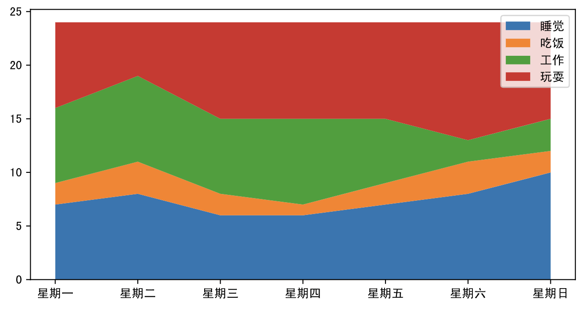
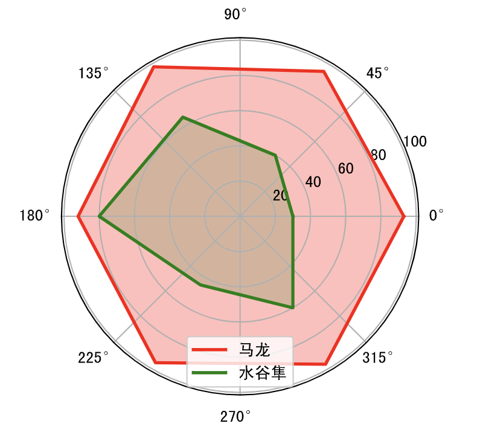

## Veri Görselleştirme-2

> **Translated to Turkish by** himmetcanumutlu

Bu bölümde matplotlib ile bazı üst düzey istatistik grafikleri çizmeyi deniyoruz. Daha önce de söylediğimiz gibi, matplotlib resmî sitesindeki [doküman](https://matplotlib.org/stable/tutorials/index.html) ve [örneklerden](https://matplotlib.org/stable/gallery/index.html) matplotlib kullanmayı ve daha üst düzey istatistik grafikleri çizmeyi öğrenebilirsiniz; özellikle karmaşık grafikleri özelleştirirken, doğrudan resmî sitedeki örneği bulup ilgili değişikliği yaparak istediğiniz grafiği çizebilirsiniz. Bu "kopyala + değiştir" yaklaşımı iş verimliliğinizi büyük ölçüde artırır; çünkü çoğu zaman kodunuz resmî sitedeki koddan yalnızca veri bakımından farklıdır; tekrarlayan sıkıcı iş yapmaya gerek yoktur.

### Baloncuk Grafiği

Baloncuk grafiği üç değişkenin ilişkisini anlamak için kullanılır; baloncuk konumu ve boyutu karşılaştırılarak veri boyutları arasındaki korelasyon analiz edilir. Örneğin daha önce çizdiğimiz aylık gelir ve online harcama dağılım grafiğinde ikisinin pozitif korelasyonunu bulmuştuk; üçüncü değişken olarak online alışveriş sayısını eklersek baloncuk grafiği kullanmamız gerekir.

Kod:

```python
income = np.array([5550, 7500, 10500, 15000, 20000, 25000, 30000, 40000])
outcome = np.array([800, 1800, 1250, 2000, 1800, 2100, 2500, 3500])
nums = np.array([5, 3, 10, 5, 12, 20, 8, 10])

# scatter fonksiyonunun s ve c parametreleriyle sırasıyla alan ve renk kontrol edilir
plt.scatter(income, outcome, s=nums * 30, c=nums, cmap='Reds')
# Renk çubuğunu göster
plt.colorbar()
# Grafiği göster
plt.show()
```

Çıktı:


### Alan Grafiği

Alan grafiği, yığılmış çizgi grafiği olarak da adlandırılır; çizgi grafiğinin altındaki alanı renkle doldurur (alanı gösterir); sürekli aralıkta veya zaman aralığında değerleri gösterir; genellikle eğilim göstermek ve değer karşılaştırmak için kullanılır; farklı renk dolgusu birden çok alan arasındaki karşılaştırma ve eğilimi daha iyi öne çıkarır. Aşağıdaki örnekte alan grafiğiyle pazartesiden pazara uyku, yemek, iş ve oyuna harcanan zamanı gösteriyoruz.

Kod:

```python
plt.figure(figsize=(8, 4))
days = np.arange(7)
sleeping = [7, 8, 6, 6, 7, 8, 10]
eating = [2, 3, 2, 1, 2, 3, 2]
working = [7, 8, 7, 8, 6, 2, 3]
playing = [8, 5, 9, 9, 9, 11, 9]
# Yığılmış çizgi grafiği çiz
plt.stackplot(days, sleeping, eating, working, playing)
# Yatay eksen işaretini özelleştir
plt.xticks(days, labels=['Pzt', 'Sal', 'Çar', 'Per', 'Cum', 'Cmt', 'Paz'])
# Göstergeyi özelleştir
plt.legend(['Uyku', 'Yemek', 'İş', 'Oyun'], fontsize=10)
# Grafiği göster
plt.show()
```

Çıktı:



### Radar Grafiği

Radar grafiği genellikle birden çok nicel veriyi karşılaştırmak için kullanılır; hangi değişkenlerin benzer değere sahip olduğunu görmek içindir. Radar grafiği veri kümesindeki hangi değişkenin değerinin düşük, hangisinin yüksek olduğunu da gösterir; performans veya gösterim için ideal seçimdir. Basketbol ve futbol maçı izleyen okuyucular radar grafiğine aşinadır; örneğin NBA yayınlarında oyuncunun çeşitli verilerini göstermek için sık sık radar grafiği kullanılır. Radar grafiğinin özü çizgi grafiğidir; yalnızca çizgi grafiği kutupsal koordinat sistemine eşlenir. Radar grafiği çizerken çizginin kapanması, yani uçların birleşmesi gerekir; aşağıda radar grafiği çizme kodu vardır.

Kod:

```python
labels = np.array(['Hız', 'Güç', 'Deneyim', 'Savunma', 'Servis', 'Teknik'])
# Ma Long ve Mizutani Jun verisi
malong_values = np.array([93, 95, 98, 92, 96, 97])
shuigu_values = np.array([30, 40, 65, 80, 45, 60])
angles = np.linspace(0, 2 * np.pi, labels.size, endpoint=False)
# Grafiği kapatmak için bir veri daha ekle
malong_values = np.append(malong_values, malong_values[0])
shuigu_values = np.append(shuigu_values, shuigu_values[0])
angles = np.append(angles, angles[0])
# Kanvas oluştur
plt.figure(figsize=(4, 4), dpi=120)
# Koordinat sistemi oluştur
ax = plt.subplot(projection='polar')
# Grafiği çiz ve doldur
plt.plot(angles, malong_values, color='r', linewidth=2, label='Ma Long')
plt.fill(angles, malong_values, color='r', alpha=0.3)
plt.plot(angles, shuigu_values, color='g', linewidth=2, label='Mizutani Jun')
plt.fill(angles, shuigu_values, color='g', alpha=0.2)
# Göstergeyi göster
ax.legend()
# Grafiği göster
plt.show()
```

Çıktı:



### Gül Grafiği

Gül grafiği, kutupsal koordinatlara eşlenen sütun grafiğidir; Florence Nightingale tarafından icat edilmiştir; o yıl Nightingale, sahra hastanesindeki mevsimsel ölüm oranını sunmak için kullanmıştır. Yarıçap ile alan arasındaki ilişki kare olduğundan Nightingale gül grafiği verinin oranını abartır; özellikle birbirine yakın değerleri karşılaştırmaya uygundur; ayrıca daire periyodik özelliğe sahip olduğundan, gül grafiği hafta, ay gibi bir periyot içindeki zaman kavramını temsil etmeye de uygundur.

Kod:

```python
group1 = np.random.randint(20, 50, 4)
group2 = np.random.randint(10, 60, 4)
x = np.array([f'A Grubu-Q{i}' for i in range(1, 5)] + [f'B Grubu-Q{i}' for i in range(1, 5)])
y = np.array(group1.tolist() + group2.tolist())
# Gül yaprağının açısı ve genişliği
theta = np.linspace(0, 2 * np.pi, x.size, endpoint=False)
width = 2 * np.pi / x.size
# 8 rastgele renk üret
colors = np.random.rand(8, 3)
# Sütun grafiğini kutupsal koordinatlara yansıt
ax = plt.subplot(projection='polar')
# Sütun grafiği çiz
plt.bar(theta, y, width=width, color=colors, bottom=0)
# Izgara ayarla
ax.set_thetagrids(theta * 180 / np.pi, x, fontsize=10)
# Grafiği göster
plt.show()
```

Çıktı:


### 3B Grafik

matplotlib 3B grafik çizmek için de kullanılabilir; somut içerik için resmî dokümana bakabilirsiniz; aşağıda basit bir kodla 3B grafiğin nasıl çizileceğini gösteriyoruz.

Kod:

```python
from mpl_toolkits.mplot3d import Axes3D

fig = plt.figure(figsize=(8, 4), dpi=120)
# 3B koordinat sistemi oluşturup kanvasa ekle
ax = Axes3D(fig, auto_add_to_figure=False)
fig.add_axes(ax)
x = np.arange(-2, 2, 0.1)
y = np.arange(-2, 2, 0.1)
x, y = np.meshgrid(x, y)
z = (1 - y ** 5 + x ** 5) * np.exp(-x ** 2 - y ** 2)
# 3B yüzey çiz
ax.plot_surface(x, y, z)
# Grafiği göster
plt.show()
```

Çıktı:


Belirtmek gerekir ki JupyterLab'de render edilen 3B grafik gerçek 3B değildir; çünkü gözlemcinin açısını ayarlayamaz, döndüremez veya ölçekleyemezsiniz. Gerçek 3B etkisini görmek için grafiği Qt penceresine render etmek gerekir; bunun için önce PyQt6 üçüncü taraf kütüphanesini kurun; aşağıdaki gibidir.

```
%pip install PyQt6
```

Sonra sihirli komutla JupyterLab'in grafiği Qt penceresine render etmesini sağlayın.

```
%matplotlib qt
```

Yukarıdaki işlemi tamamladıktan sonra az önceki 3B grafik kodunu yeniden çalıştırıp aşağıdaki pencereyi görebilirsiniz. Bu pencerede fareyle 3B'yi döndürebilir, ölçekleyebilir ve grafiğin bir kısmını seçip gözlemleyebilirsiniz; çok havalı değil mi?


