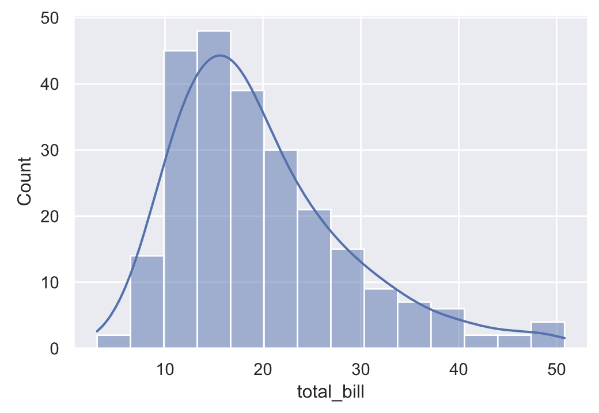
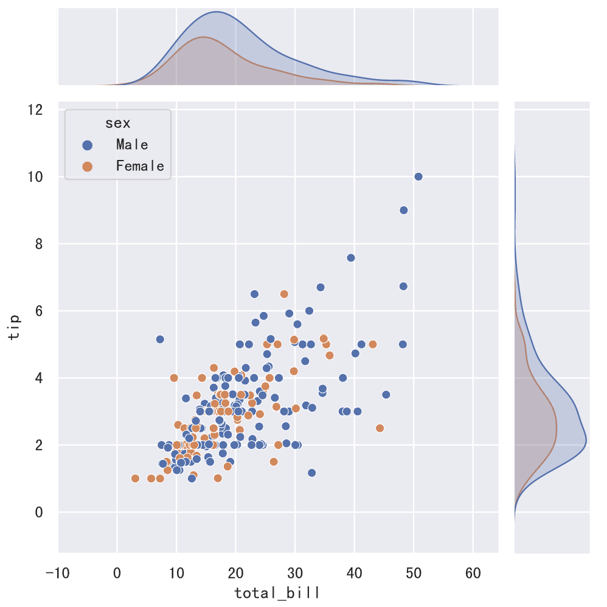
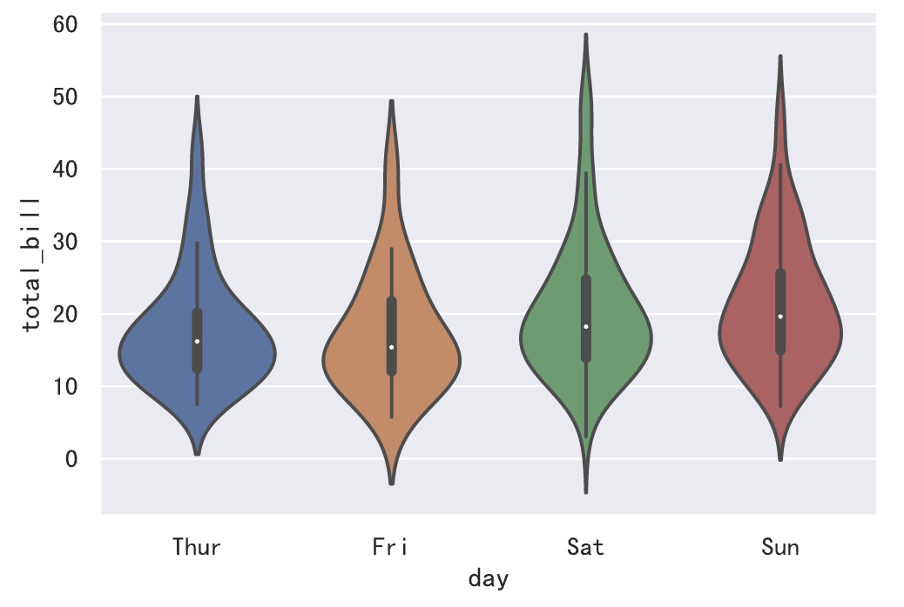
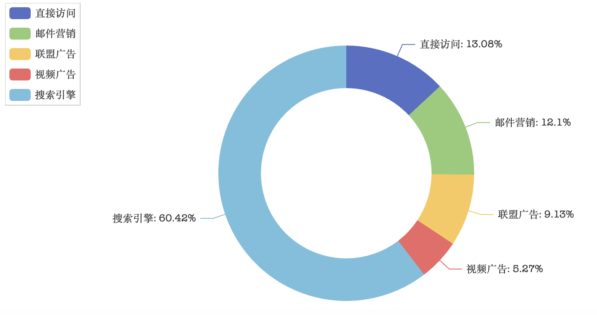

## Veri Görselleştirme-3

> **Translated to Turkish by** himmetcanumutlu

Önceki öğrenimle veri görselleştirme aracı matplotlib hakkında ön bir kavrayış edindik. Fark etmişsinizdir ki matplotlib'in sunduğu fonksiyonlar güçlü olsa da parametreleri çok fazladır; grafiği derinlemesine özelleştirmek için bir dizi parametreyi değiştirmek gerekir; bu, yeni başlayanlara pek dostane değildir. Öte yandan matplotlib ile özelleştirilen istatistik grafikleri statiktir; etkileşim gerektiren bazı senaryolarda uygun olmayabilir. Bu iki sorunu çözmek için iki yeni görselleştirme aracı tanıtıyoruz: biri seaborn, diğeri pyecharts.

### Seaborn

Seaborn, matplotlib üzerine kurulu veri görselleştirme aracıdır; matplotlib'in daha üst düzey kapsüllenmiş halidir; seaborn pandas ile de sorunsuz bütünleşir; daha az kodla daha iyi istatistik grafikleri kurmamızı sağlar; veriyi keşfetmemize ve anlamamıza yardımcı olur. Seaborn şu işlevleri içerir ama bunlarla sınırlı değildir:

1. Birden çok değişken arasındaki ilişkiyi inceleyen veri kümesi odaklı API.
2. Kategorik değişkenle gözlem sonucunu veya özet istatistiği gösterme desteği.
3. Tek veya çift değişkenli dağılımı görselleştirme ve veri alt kümeleri arasında karşılaştırma seçeneği.
4. Çeşitli bağımlı değişken doğrusal regresyon modelinin otomatik tahmini ve çizimi.
5. Entegre renk paleti ve tema; istatistik grafiğinin görsel efektini kolayca özelleştirir.

Python paket yönetim aracı pip ile seaborn kurulabilir.

```Bash
pip install seaborn
```

Jupyter'de doğrudan sihirli komutla kurulabilir; aşağıdaki gibidir.

```Bash
%pip install seaborn
```

Aşağıda seaborn'un kendi veri kümesi örneğiyle seaborn'un kullanımını ve gücünü kısaca gösteriyoruz; seaborn'u derinlemesine incelemek isteyenler resmî [dokümanı](https://seaborn.pydata.org/tutorial.html) okuyup resmî eserlerindeki [örneklere](https://seaborn.pydata.org/examples/index.html) bakabilir. Resmî örneklere göre kendi kodunuzu yazmak iyi bir seçimdir; basitçe resmî kodu koruyup veriyi kendi verinizle değiştirin. Aşağıdaki görsel seaborn'un grafik çizme fonksiyonlarını gösterir; seaborn'un bu fonksiyonlarının esas olarak grafik çizerek verinin ilişkisini, dağılımını ve sınıflandırmasını keşfetmemizi desteklediği görülür.


seaborn kullanmak için önce kütüphaneyi içe aktarıp tema ayarlayın; kod aşağıdaki gibidir.

```Python
import seaborn as sns

sns.set_theme()
```

Grafikte Çince göstermek gerekirse, daha önce anlattığımız yöntemle matplotlib'in yapılandırma parametresini değiştirmek gerekir; kod aşağıdaki gibidir.

```Python
import matplotlib.pyplot as plt

plt.rcParams['font.sans-serif'].insert(0, 'SimHei')
plt.rcParams['axes.unicode_minus'] = False
```

> **Dikkat**: Yukarıdaki kod `set_theme` fonksiyonu çağrıldıktan sonra konmalıdır; aksi halde `set_theme` fonksiyonu çağrıldığında matplotlib yapılandırma parametresindeki yazı tipi ayarı yeniden değiştirilir.

Resmî Tips veri kümesini (yemek bahşiş verisi) yükleme.

```Python
tips_df = sns.load_dataset('tips')
tips_df.info()
```

Çalışma sonucu aşağıdaki gibidir; total_bill toplam hesap tutarı, tip bahşiş tutarı, sex müşterinin cinsiyeti, smoker müşterinin sigara içip içmediği, day haftanın günü, time öğle mi akşam yemeği mi, size yemek yiyen kişi sayısıdır.

```
<class 'pandas.core.frame.DataFrame'>
RangeIndex: 244 entries, 0 to 243
Data columns (total 7 columns):
 #   Column      Non-Null Count  Dtype   
---  ------      --------------  -----   
 0   total_bill  244 non-null    float64 
 1   tip         244 non-null    float64 
 2   sex         244 non-null    category
 3   smoker      244 non-null    category
 4   day         244 non-null    category
 5   time        244 non-null    category
 6   size        244 non-null    int64   
dtypes: category(4), float64(2), int64(1)
memory usage: 7.4 KB
```

Veri kümesi çevrimiçi yüklendiğinden, yukarıdaki kod SSL nedeniyle veriyi alamayabilir; önce aşağıdaki kodu çalıştırıp sonra veri kümesini yüklemeyi deneyebilirsiniz.

```Python
import ssl

ssl._create_default_https_context = ssl._create_unverified_context
```

Hesap tutarının dağılımını görmek istiyorsak aşağıdaki kodla dağılım grafiği çizilebilir.

```Python
sns.histplot(data=tips_df, x='total_bill', kde=True)
```



Değişkenler arasındaki ikili ilişkiyi görmek istiyorsak ikili grafik (pairplot) çizilebilir; kod ve etki aşağıdaki gibidir.

```Python
sns.pairplot(data=tips_df, hue='sex')
```


Yukarıdaki grafiğin renginden memnun değilseniz, `palette` parametresiyle seaborn'un kendi "renk paleti" seçilip renk değiştirilebilir; bu yöntem rengi kendiniz belirlemekten veya rastgele renk kullanmaktan çok daha pratik ve güvenilirdir; aşağıdaki görsel seaborn'un kendi "renk paletlerinin" bir kısmını gösterir.


Yukarıdaki kodu biraz değiştirip çalışma sonucunun farkına bakabilirsiniz.

```Python
sns.pairplot(data=tips_df, hue='sex', palette='Dark2')
```

Sonra total_bill ve tip verisi için ortak dağılım grafiği çizelim; kod aşağıdaki gibidir.

```Python
sns.jointplot(data=tips_df, x='total_bill', y='tip', hue='sex')
```



Yukarıda, total_bill ile tip arasında pozitif korelasyon olduğu net görülür; bunu `DataFrame` nesnesinin `corr` metoduyla da doğrulayabiliriz. Sonra bu veri noktalarına uyan bir regresyon modeli kurabiliriz; seaborn'un doğrusal regresyon model grafiği bu işlevi zaten gerçekleştirir; kod aşağıdaki gibidir.

```Python
sns.lmplot(data=tips_df, x='total_bill', y='tip', hue='sex')
```


Hesap tutarının merkezi ve yayılım eğilimini görmek istiyorsak kutu grafiği veya keman grafiği çizilebilir; kod aşağıdaki gibidir; veriyi perşembe, cuma, cumartesi ve pazara göre ayrı ayrı gösteriyoruz.

```Python
sns.boxplot(data=tips_df, x='day', y='total_bill')
```


```Python
sns.violinplot(data=tips_df, x='day', y='total_bill')
```



> **Not**: Kutu grafiğine kıyasla keman grafiği aykırı noktayı işaretlemez, verinin tüm aralığını gösterir; öte yandan keman grafiği verinin dağılımını (yoğunluk izi) iyi gösterir.

### Pyecharts

ECharts aslında Baidu'nun geliştirdiği bir ön yüz grafik kütüphanesiydi; 16 Ocak 2018'de ECharts Apache Incubator'a girip kuluçkaya alındı; şu anda Apache Yazılım Vakfı'nın üst düzey projesidir. İyi etkileşimi ve zarif grafik tasarımı sayesinde ECharts birçok geliştiricinin beğenisini kazandı; pyecharts ise Python diliyle ECharts'ı sarmalar; Python geliştiricilerinin de ECharts ile görünümü güzel ve etkileşimi güçlü istatistik grafikleri çizmesini sağlar.

Python paket yönetim aracı pip ile pyecharts kurulabilir.

```Bash
pip install pyecharts
```

JupyterLab'de doğrudan sihirli komutla kurulabilir; aşağıdaki gibidir.

```Bash
%pip install pyecharts
```

JupyterLab'de pyecharts ile grafik çizmek istiyorsak bazı hazırlıklar gerekir; esas olarak pyecharts yapılandırmasını değiştirmek; kod aşağıdaki gibidir.

```python
from pyecharts.globals import CurrentConfig, NotebookType

CurrentConfig.NOTEBOOK_TYPE = NotebookType.JUPYTER_LAB
```

Sonra pyecharts resmî sitesindeki yeni başlayan eğitiminden bir örnekle pyecharts'ı tanıyalım. Elbette resmî örneği biraz ayarlıyoruz; kod aşağıdaki gibidir.

```Python
from pyecharts.charts import Bar
from pyecharts import options as opts

# Sütun grafiği nesnesi oluşturup başlangıç parametrelerini ayarla (genişlik, yükseklik)
bar_chart = Bar(init_opts=opts.InitOpts(width='600px', height='450px'))
# Yatay eksen verisini ayarla
bar_chart.add_xaxis(["Gömlek", "Kazak", "Şifon bluz", "Pantolon", "Topuklu", "Çorap"])
# Dikey eksen verisini ayarla (birinci grup)
bar_chart.add_yaxis("Satıcı A", [25, 20, 36, 10, 75, 90])
# Dikey eksen verisini ayarla (ikinci grup)
bar_chart.add_yaxis("Satıcı B", [15, 12, 30, 20, 45, 60])
# Dikey eksen verisini ayarla (üçüncü grup)
bar_chart.add_yaxis("Satıcı C", [12, 32, 40, 52, 35, 26])
# Global yapılandırma parametrelerini ekle
bar_chart.set_global_opts(
    # Yatay eksenle ilgili parametreler
    xaxis_opts=opts.AxisOpts(
        axislabel_opts=opts.LabelOpts(color='navy')
    ),
    # Dikey eksenle ilgili parametreler (etiket, minimum, maksimum, aralık)
    yaxis_opts=opts.AxisOpts(
        axislabel_opts=opts.LabelOpts(color='navy'),
        min_=0,
        max_=100,
        interval=10
    ),
    # Başlıkla ilgili parametreler (içerik, bağlantı, konum, metin stili)
    title_opts=opts.TitleOpts(
        title='2022 satış verileri gösterimi',
        pos_left='2%',
        title_textstyle_opts=opts.TextStyleOpts(
            color='navy',
            font_size=16,
            font_family='PingFang SC',
            font_weight='bold'
        )
    ),
    # Araç kutusuyla ilgili parametreler
    toolbox_opts=opts.ToolboxOpts(
        orient='vertical',
        pos_left='right'
    )
)
# Grafik çizmek için gereken JavaScript dosyasını yükle
bar_chart.load_javascript()
```

Yukarıdaki kodu çalıştırdıktan sonra `bar` nesnesinin metodunu çağırıp grafiği render edebiliriz. Doğrudan `render` metodu kullanılırsa çizilen istatistik grafiği bir HTML dosyasına kaydedilir; dosyayı açınca grafiği görebilirsiniz; `render_notebook` metodu ise grafiği tarayıcı penceresine render eder.

```python
bar_chart.render_notebook()
```

Yukarıdaki kodun çalışma etkisi aşağıdaki gibidir. Dikkate değer olan, aşağıdaki görseldeki başlık, gösterge ve sağdaki araç kutusu tıklanabilir; tıklayıp ne etki olduğuna bakabilirsiniz; ECharts'ın cazibesi etkileşim efektindedir; mutlaka deneyin.


Sonra yine resmî bir örnekle pasta grafiğinin nasıl çizileceğine bakalım.

```Python
import pyecharts.options as opts
from pyecharts.charts import Pie

# Pasta grafiğine gereken veriyi hazırla
x_data = ["Doğrudan erişim", "E-posta pazarlama", "Bağlı kuruluş reklamı", "Video reklamı", "Arama motoru"]
y_data = [335, 310, 234, 135, 1548]
data = [(x, y) for x, y in zip(x_data, y_data)]

# Pasta grafiği nesnesi oluşturup başlangıç parametrelerini ayarla
pie_chart = Pie(init_opts=opts.InitOpts(width="800px", height="400px"))
# Pasta grafiğine veri ekle
pie_chart.add(
    '', 
    data_pair=data,
    radius=["50%", "75%"],
    label_opts=opts.LabelOpts(is_show=False),
)
# Global yapılandırma öğelerini ayarla
pie_chart.set_global_opts(
    # Göstergeyle ilgili parametreleri yapılandır
    legend_opts=opts.LegendOpts(
        pos_left="left",
        orient="vertical"
    )
)
# Veri serisi yapılandırma parametrelerini ayarla
pie_chart.set_series_opts(
    # Araç ipucunu gösterme
    tooltip_opts=opts.TooltipOpts(is_show=False),
    # Pasta grafiği etiketinin stilini ayarla
    label_opts=opts.LabelOpts(formatter="{b}({c}): {d}%")
)
pie_chart.load_javascript()
```

```python
pie_chart.render_notebook()
```

Yukarıdaki kodu çalıştırınca etki aşağıdaki gibidir.



Hatırlatmak isteriz ki pyecharts, NumPy'nin ndarray'ini ve Pandas'ın Series, DataFrame'ini doğrudan veri olarak kullanamaz; Python'un yerel veri tiplerini gerektirir. Fark etmişsinizdir ki yukarıdaki kodda liste, demet gibi veri tipleri kullandık.

Son olarak harita çizmeye bakalım; harita çizmek için önce harita bilgisini almak üzere ek bağımlılık kütüphaneleri kurmak gerekir; komut aşağıdaki gibidir.

```Bash
pip install echarts-countries-pypkg echarts-china-provinces-pypkg echarts-china-cities-pypkg echarts-china-counties-pypkg
```

Jupyter'de doğrudan sihirli komutla kurulabilir; aşağıdaki gibidir.

```Bash
%pip install echarts-countries-pypkg
%pip install echarts-china-provinces-pypkg
%pip install echarts-china-cities-pypkg
%pip install echarts-china-counties-pypkg
```

> **Not**: Yukarıdaki dört kütüphane sırasıyla dünya ülkeleri, Çin il düzeyi idari bölgeleri, Çin şehir düzeyi idari bölgeleri, Çin ilçe düzeyi idari bölgelerinin verisini içerir.

Sonra ülke geneli il verilerini bir listeye koyarız; kod aşağıdaki gibidir.

```Python
data = [
    ('Guangdong', 594), ('Zhejiang', 438), ('Sichuan', 316), ('Pekin', 269), ('Shandong', 248),
    ('Jiangsu', 234), ('Hunan', 196), ('Fujian', 166), ('Henan', 153), ('Liaoning', 152),
    ('Şanghay', 138), ('Hebei', 86), ('Anhui', 79), ('Hubei', 75), ('Heilongjiang', 70), 
    ('Shaanxi', 63), ('Jilin', 59), ('Jiangxi', 56), ('Chongqing', 46), ('Guizhou', 39),
    ('Shanxi', 37), ('Yunnan', 33), ('Guangxi', 24), ('Tianjin', 22), ('Xinjiang', 21),
    ('Hainan', 18), ('İç Moğolistan', 14), ('Tayvan', 11), ('Gansu', 7), ('Guangxi Zhuang Özerk Bölgesi', 4),
    ('Hong Kong', 4), ('Qinghai', 3), ('Xinjiang Uygur Özerk Bölgesi', 3), ('İç Moğolistan Özerk Bölgesi', 3), ('Ningxia', 1)
]
```

Sonra pyecharts ile haritada il düzeyi Douyin ünlü sayısını işaretliyoruz.

```Python
import pyecharts.options as opts
from pyecharts.charts import Map

map_chart = Map(init_opts=opts.InitOpts(width='1000px', height='1000px'))
map_chart.add('', data, 'china', is_roam=False)
map_chart.load_javascript()
```

```python
map_chart.render_notebook()
```

Kodun çalışma etkisi aşağıdaki gibidir; fareyi haritaya getirdiğinizde ilgili il vurgulanır ve bilgi görünür.


seaborn gibi, pyecharts kullanmak için de resmî örnekleri referans almanızı öneririz; pyecharts [resmî sitesinin](https://pyecharts.org/#/zh-cn/) sol gezinme çubuğunda "Grafik türleri" seçeneğini bulabilirsiniz; her grafik türünün altında ilgili resmî örnek vardır; birçok kod doğrudan kullanılabilir; yapmamız gereken veriyi kendi verimizle değiştirmektir.
