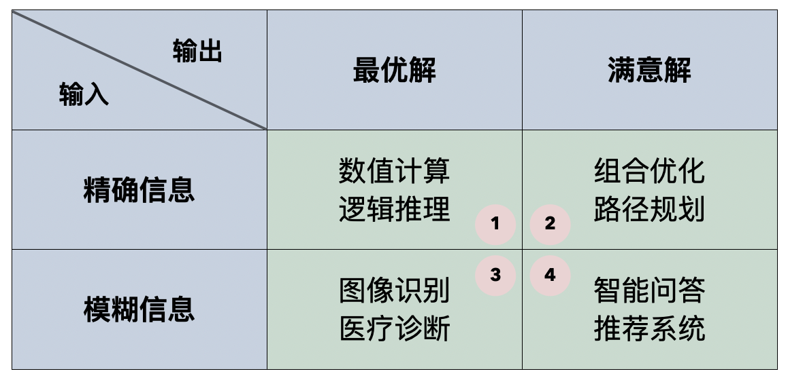
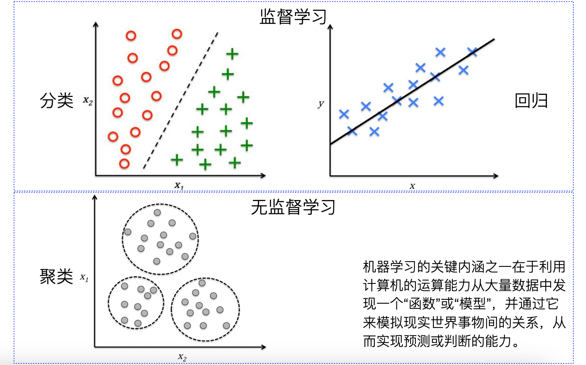
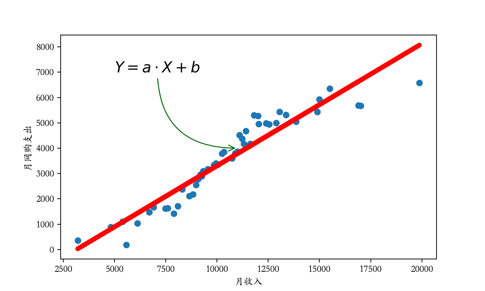

## Makine Öğrenmesine Giriş

> **Translated to Turkish by** himmetcanumutlu

Yapay zekâ kuşkusuz son yılların en sıcak kelimelerinden biridir; 2016'da Google DeepMind ekibinin geliştirdiği AlphaGo go programının insan üst düzey oyuncularını yenmesinden, 2017'de Transformer mimarisine dayalı NLP modelinin yayımlanmasına, 2023'te OpenAI'nin GPT-4 tabanlı ChatGPT'yi sunmasına ve yapay zekânın tıp, otonom sürüş gibi alanlardaki derin uygulamalarına kadar, yapay zekâ dalgası 1956 Dartmouth Konferansı'ndan bu yana görülmemiş bir yüksekliğe ulaştı; neredeyse herkesin hayatı az ya da çok yapay zekâdan etkilendi. Yapay zekâ, bilgisayar biliminin önemli bir dalıdır; bilgisayarın akıllı davranışı taklit etme yeteneğini ve makinenin insan zekâsı davranışını taklit etme yeteneğini kapsar. Yapay zekâ araştırmasının ana hedefi, bağımsız karar verebilen sistemler geliştirmektir; böylece tıp, mühendislik, finans, eğitim, bilimsel araştırma, kamu hizmetleri gibi birçok alanda insanın daha verimli çalışmasına yardımcı olur. Yapay zekânın İngilizcesi "*artificial intelligence*" olduğundan genellikle *AI* olarak kısaltılır; yapay zekâ birçok içeriği kapsar; sıkça duyduğumuz makine öğrenmesi, derin öğrenme, doğal dil işleme, bilgisayarlı görü, pekiştirmeli öğrenme, veri madenciliği, uzman sistemler, endüstriyel robotlar, otonom sürüş gibi konular yapay zekânın kapsamındadır. Dar anlamda yapay zekâ genellikle yalnızca belirli görevleri yapabilir; sohbet edebilen yapay zekâ genellikle araba kullanamaz, araba kullanan genellikle satranç oynayamaz; geniş anlamda yapay zekâ genel zekâya sahip olup insan zekâsının yapabildiği her görevi yapabilmelidir; bir adım ötesi, insan zekâsını aşan yapay zekâya süper yapay zekâ deriz.

Bu derste esas olarak yapay zekâdaki makine öğrenmesini (Machine Learning) ele alıyoruz. Makine öğrenmesi yapay zekânın bir alt alanıdır; veri ve algoritmalarla bilgisayar sisteminin deneyimden öğrenip tahmin veya karar vermesini konu alır. Basitçe makine öğrenmesi yapay zekâyı gerçekleştirmenin bir yöntemidir; birçok AI sistemi makine öğrenmesi tekniğiyle geliştirilir. Bazı senaryolarda insanlar makine öğrenmesi yerine veri madenciliği (Data Mining) kelimesini kullanır; veri madenciliği, veriden faydalı bilgi ve bilgiyi çıkarmak, verideki desen ve eğilimi analiz edip yorumlamak ve nihayet gelecekteki eğilim ve davranışı tahmin etmektir. Elbette bu iki kelimeyi kullanırken vurgu farklıdır; veri madenciliği esas olarak bilgi keşfine, makine öğrenmesi ise tahmin modeli kurup optimize etmeye odaklanır. Şu an çok popüler bir kavram ve araştırma alanı olan derin öğrenme (Deep Learning), makine öğrenmesinin bir alt alanıdır; özellikle çok katmanlı sinir ağı (derin sinir ağı) ile veri işleme ve öğrenmeye odaklanır. Derin öğrenme görüntü, ses ve doğal dil gibi karmaşık veriyi işlerken üstün performans gösterir; verinin hiyerarşik özelliğini otomatik öğrenip insan müdahalesi ihtiyacını azaltır. Elbette derin öğrenme modelleri genellikle geleneksel makine öğrenmesi modellerinden daha karmaşıktır; daha fazla veri ve hesaplama kaynağı gerektirir.

### Yapay Zekânın Gelişim Tarihi

Öğrenmeden önce tarihi öğrenelim; yapay zekânın gelişim tarihindeki dönüm noktalarını kısaca gözden geçirelim; çok eski tarih için yalnızca önemli zaman noktalarına değineceğiz; odağımız son yılların büyük olaylarındadır.


> **Not**: Yukarıdaki görsel [AMiner sitesinden](https://www.aminer.cn/ai-history) alınmıştır; sitenin gereksinimine göre görseli alıntılarken aşağıdaki makaleyi atıfta bulunmak gerekir. Yüksek çözünürlüklü orijinali o siteden de alınabilir.
>
> Jie Tang, Jing Zhang, Limin Yao, Juanzi Li, Li Zhang, and Zhong Su. [ArnetMiner: Extraction and Mining of Academic Social Networks.](https://www.aminer.cn/pub/53e9a5afb7602d9702edacce/arnetminer-extraction-and-mining-of-academic-social-networks) In Proceedings of the Fourteenth ACM SIGKDD International Conference on Knowledge Discovery and Data Mining (SIGKDD'2008). pp.990-998.

1. 1950'de Alan Turing çığır açan bir makale yayımladı; makalede zekâya sahip makine yaratmanın mümkün olduğunu öngördü ve ünlü Turing testini önerdi. Turing testi, bilgisayarın insanla konuşmasını sağlar; bilgisayar, sorulara cevap verenin makine mi insan mı olduğunu ayırt ettirmezse bilgisayarın zekâya sahip olduğu kabul edilir.
2. 1956'da Dartmouth Konferansı düzenlendi; bu konferans yapay zekânın doğuşu olarak kabul edilir. Konferansta John McCarthy, Marvin Minsky, Claude Shannon gibi isimler yapay zekânın araştırma gündemini önerdi. Dartmouth Konferansı'nın başlıca katılımcıları sonradan "Yapay Zekânın Yedi Kahramanı" olarak anıldı: John McCarthy, Marvin Minsky, Allen Newell, Herbert Simon, Claude Shannon, Oliver Selfridge ve Nathan Rochester; yapay zekânın gelişiminin temelini attılar; bunlardan beşi Turing Ödülü aldı.
3. 1957'de Frank Rosenblatt algılayıcı (perceptron) modelini önerdi; en eski sinir ağı modellerinden biridir; ikili sınıflandırma için kullanılır.
4. 1958'de John McCarthy LISP programlama dilini geliştirdi; bu dil sembol işlemeye özellikle uygundur; erken AI araştırmalarının ana programlama dili oldu.
5. 1980'de Carnegie Mellon Üniversitesi DEC şirketi için XCON adlı uzman sistem tasarladı; şirkete yılda yaklaşık kırk milyon dolar tasarruf sağladı. Uzman sistem DEC'te büyük başarı kazandığı için dünyada birçok şirket uzman sistem geliştirip uygulamaya başladı.
6. 1982'de fizikçi John Hopfield, yeni bir sinir ağı türünün (sonradan "Hopfield ağı" denir) bilgiyi yepyeni bir biçimde öğrenip işleyebildiğini kanıtladı.
7. 1986'da Geoffrey Hinton ve ekibi geri yayılım algoritmasını önerdi; derin sinir ağı eğitme zorluğunu çözdü; sinir ağıyla ilgili yöntemler yeniden ilgi gördü. Bu atılım sinir ağının çeşitli görevlerde üstün performans göstermesini sağladı; makine öğrenmesinin önemli aracı oldu.
8. 1997'de IBM'in geliştirdiği satranç programı Deep Blue, dünya satranç şampiyonu efsane oyuncu Kasparov'u yendi.
9. 2011'de IBM'in geliştirdiği, doğal dil kullanarak soru cevaplayabilen yapay zekâ sistemi, yarışma programı《Jeopardy!》'de en yüksek para ödülü sahibi Brad Rutter'ı ve seri galibiyet rekoru sahibi Ken Jennings'i yenip 1 milyon dolar ödül kazandı.
10. 2012'de Geoffrey Hinton ve öğrencileri ImageNet yarışmasında derin evrişimli sinir ağı (CNN) ile büyük başarı elde etti; derin öğrenmenin yükselişini işaretledi. Ardından derin öğrenme görüntü tanıma, ses tanıma, doğal dil işleme gibi alanlarda belirgin ilerleme kaydetti.
11. 2016'da Google DeepMind'ın geliştirdiği AlphaGo, dünya go şampiyonu Lee Sedol'u yendi; derin öğrenme ve Monte Carlo ağaç aramasının gücünü gösterdi.
12. 2017'de Google araştırmacıları Transformer modelini önerdi; doğal dil işleme alanını kökten değiştirdi. Transformer modeli öz-dikkat mekanizmasına dayanır; dizi modellemenin verimini ve etkisini büyük ölçüde artırdı. Sonraki BERT, GPT gibi modeller Transformer mimarisine dayanır.
13. 2018'de OpenAI'nin geliştirdiği AI sistemi OpenAI Five, çok oyunculu çevrimiçi taktik oyunu《Dota 2》de yarı profesyonel ve profesyonel oyuncu takımlarını yendi.
14. 2019'da OpenAI, 1,5 milyar parametreli dil modeli GPT-2'yi yayımladı; yüksek kaliteli doğal dil metni üretme yeteneğini gösterdi. Aynı yıl DeepMind'ın AlphaStar'ı gerçek zamanlı strateji oyunu《StarCraft II》de insan üst düzey oyuncularını yendi.
15. 2020'de OpenAI, 175 milyar parametreli dil modeli GPT-3'ü yayımladı; o dönemin en büyük dil modeliydi; GPT-3 doğal dil metni üretme, çeviri, kod yazma gibi görevlerde üstün performans gösterdi; doğal dil işleme ve üretim modellerinin gelişimini ilerletti. Aynı yıl DeepMind'ın AlphaFold 2'si protein yapısı tahmininde CASP yarışmasında çığır açan sonuç aldı; tahmin hassasiyeti deney düzeyine ulaştı; bu başarı biyoloji alanında büyük atılım sayıldı; ilaç geliştirme ve biyoloji araştırmalarını ilerletebilir.
16. 2021'de OpenAI, metin açıklamasına göre görüntü üretebilen DALL-E'yi yayımladı; üretim modellerinin çok modlu öğrenme ve görüntü üretimindeki potansiyelini gösterdi. Aynı yıl OpenAI, kodu anlayıp üretebilen dil modeli Codex'i yayımladı; Copilot'un çekirdek teknolojisidir.
17. 2023'te OpenAI, GPT-4 tabanlı ChatGPT'yi sundu; daha doğal ve akıcı konuşma yapabilir. Ardından yurt içi ve dışındaki sektör devleri büyük modellere girdi; çeşitli büyük model uygulamaları mantar gibi çoğaldı.
18. 2024'te OpenAI, DALL-E temelinde metin açıklamasıyla video üretebilen yapay zekâ modeli Sora'yı sundu. Birkaç gün sonra Cognition AI adlı girişim, ilk AI yazılım mühendisi Devin'i tanıttı.

Yapay zekâ, Turing testi ve Dartmouth Konferansı'ndan bu yana birçok yükseliş ve düşüş yaşadı. Şu an bilgisayar hesaplama ve depolama yeteneğinin hızla artması sayesinde, eskiden zor gerçekleştirilen birçok teknoloji gerçeğe dönüştü; yapay zekâ yine gündemin zirvesine taşındı. Erken uzman sistemlerden bugünün büyük modellerine, AI teknolojisi sürekli evrilip atılım yapıyor. AlphaGo'nun insan zekâsının son kalesini fethetmesi, otonom sürüşün giderek yaygınlaşması ya da yapay zekâ içerik üretiminin (AIGC) yaygın uygulaması; yapay zekânın hayatımızı değiştirdiğini net hissedebilirsiniz.

### Makine Öğrenmesi Nedir

İnsan, ezberleme ve tümevarım olmak üzere iki yolla öğrenir; ezberle tek tek olguları biriktirir, tümevarımla eski olgulardan yeni olgular türetir. Makine öğrenmesi, makineye veriden bilgi öğrenme yeteneği kazandırır; bu süreç insanın yardımını (açık kurallar vermeyi) gerektirmez; yani makine öğrenmesi veriden bir desen (pattern) öğrenmeye odaklanır; veri gürültülü (noise) olsa bile; bu, makine öğrenmesi algoritmasının geleneksel algoritmadan en temel farkıdır. Geleneksel algoritmada bilgisayara karmaşık sistemde cevabı nasıl bulacağı söylenir; algoritma bilgisayarın hesaplama gücüyle en iyi sonucu arar. Geleneksel algoritmanın en büyük eksikliği, insanın önce en iyi çözümün ne olduğunu bilmek zorunda olmasıdır; makine öğrenmesi algoritması ise insanın modele en iyi çözümü söylemesini gerektirmez; bunun yerine sorunla ilgili örnek veri sağlarız.

Bilgisayarın çözeceği sorunları dört sınıfa ayırabiliriz; sınıflandırmanın ölçütü bir yandan girdinin kesin mi bulanık mı olduğu, diğer yandan çıktının en iyi mi tatmin edici mi olduğudur; aşağıdaki tabloyu oluşturabiliriz. Görüldüğü gibi geleneksel algoritma yalnızca birinci sınıf sorunu çözmede iyidir; makine öğrenmesi üçüncü ve dördüncü sınıf sorunları çözmede iyidir; ikinci sınıf sorun temelde NP sorunudur (belirsiz polinom zamanlı sorun); gezgin satıcı, graf renklendirme, küme kapsama gibi sorunları içerir; genellikle sezgisel algoritma (benzetimli tavlama, genetik algoritma gibi) veya yaklaşık algoritmayla çözeriz; elbette makine öğrenmesi de bu sorunlara tatmin edici çözüm sunabilir.



Elbette makine öğrenmesi algoritması kusursuz değildir. Veriyle model eğitirken ön işlenmiş ve temizlenmiş veri kullanmamız gerekir; verinin kalitesi çok kötüyse iyi bir model eğitmek zordur; bu, sıkça duyduğumuz GIGO'dur (Garbage In Garbage Out; Çöp Girerse Çöp Çıkar). Makine öğrenmesi kullanmak istiyorsak değişkenler arasında bir ilişki olup olmadığını belirlemeliyiz; makine öğrenmesi hiçbir ilişkisi olmayan veriyi işleyemez. Çoğu zaman makine öğrenmesi modeli bir dizi sayı ve gösterge çıkarır; insanın bu sayı ve göstergeleri yorumlayıp karar vermesi, modelin iyi mi kötü mü olduğunu ve gerçek iş senaryosuna nasıl geçirileceğini belirlemesi gerekir. Genellikle modeli eğitmek için kullandığımız veride gürültülü veri (noisy data) vardır; birçok makine öğrenmesi modeli gürültüye çok duyarlıdır; bu gürültülü veriyi iyi işleyemezsek iyi model elde etmek zor olur.

### Makine Öğrenmesinin Uygulama Alanları

Makine öğrenmesi kavramına aşina olmasanız bile, makine öğrenmesinin sonuçları üretim ve yaşamın her alanına yayılmıştır; aşağıdaki senaryolar size yabancı değildir.

**Senaryo 1**: Arama motoru, arama ve kullanım alışkanlığına göre bir sonraki aramanın sonucunu optimize eder.

**Senaryo 2**: E-ticaret sitesi, erişim geçmişinize göre ilginizi çekebilecek ürünleri otomatik önerir.

**Senaryo 3**: Finans ürünleri, son finansal etkinliklerinize göre kredi başvurunuzu değerlendirir.

**Senaryo 4**: Video ve canlı yayın platformları, görsel ve videolarda uygunsuz içerik olup olmadığını otomatik tanır.

**Senaryo 5**: Akıllı ev aletleri ve akıllı araçlar, sesli komutlarınıza göre ilgili eylemi yapar.

Kısaca özetlersek makine öğrenmesi şu alanlarda uygulanabilir ama bunlarla sınırlı değildir:

#### 1. **Görüntü Tanıma ve Bilgisayarlı Görü**

Bilgisayarlı görü (Computer Vision), makine öğrenmesinin önemli bir uygulama alanıdır; makinenin görüntü ve video verisini anlayıp işlemesini sağlar.

- **Yüz tanıma**: Derin öğrenme modeliyle görseldeki yüzü tanır; güvenlik izleme, telefon kilidi açma gibi.
- **Otonom sürüş**: Otonom araçlar yol işareti, yaya, diğer araç, trafik ışığını tanımak için bilgisayarlı görü kullanır; otonom navigasyon yapar.
- **Tıbbi görüntü analizi**: Makine öğrenmesi X-ray, MRI ve CT görüntüsü analizinde kullanılır; doktorun hastalığı (kanser, inme gibi) bulmasına yardımcı olur.
- **Görüntü sınıflandırma ve etiketleme**: Görsele otomatik etiket verir; örneğin sosyal medyada görseldeki nesne ve sahneyi otomatik tanır.

#### 2. **Doğal Dil İşleme (NLP)**

Doğal dil işleme, makine öğrenmesinin metin ve ses verisine uygulanmasıdır; amaç bilgisayarın doğal dili anlayıp üretmesini sağlamaktır.

- **Ses tanıma**: Akıllı asistan (Siri, Google Assistant) ses tanıma ile sesi metne çevirir.
- **Makine çevirisi**: Google Çeviri, Baidu Çeviri gibi uygulamalar makine öğrenmesiyle diller arası otomatik çeviri yapar.
- **Duygu analizi**: Sosyal medya paylaşımı, yorum gibi metin verisinin duygu eğilimini (pozitif, negatif, nötr) analiz eder.
- **Metin üretimi**: Makale veya haberi otomatik üretir (GPT serisi gibi); otomatik yazı, akıllı müşteri hizmeti gibi işlevler sunar.
- **Sohbet robotu**: Örneğin müşteri hizmeti robotu, doğal dil işlemeyle kullanıcıyla konuşur.

#### 3. **Öneri Sistemi**

Öneri sistemi, kullanıcı davranış verisiyle kullanıcının ilgilenebileceği ürün veya hizmeti tahmin eder.

- **E-ticaret**: Amazon, Taobao gibi platformlar kullanıcının gezinme ve satın alma geçmişine göre ürün önerir.
- **Film önerisi**: Netflix, YouTube gibi platformlar izleme geçmişine göre film, video ve program önerir.
- **Sosyal ağ önerisi**: Facebook ve Twitter kullanıcının ilgisine göre arkadaş, paylaşım veya reklam önerir.

#### 4. **Finans Alanı**

Makine öğrenmesinin finans alanındaki uygulaması esas olarak risk yönetimi, tahmin ve otomatik işlemde görülür.

- **Kredi puanı**: Banka ve finans kurumları makine öğrenmesi modeliyle borçlunun kredi riskini değerlendirir.
- **Dolandırıcılık tespiti**: İşlem desenini analiz ederek makine öğrenmesi modeli potansiyel dolandırıcılığı (kredi kartı dolandırıcılığı, kara para aklama) tespit eder.
- **Algoritmik işlem**: Makine öğrenmesi algoritmasıyla hisse ve diğer finansal varlıkların otomatik işlemi; gerçek zamanlı piyasa verisine göre karar verir.
- **Portföy yönetimi**: Makine öğrenmesi modeliyle varlık dağılımı ve portföy optimizasyonu.

#### 5. **Tıp ve Sağlık**

Makine öğrenmesi tıpta, özellikle hastalık tahmini, kişiselleştirilmiş tedavi ve tıbbi görüntü analizinde yaygın kullanılır.

- **Hastalık tahmini**: Makine öğrenmesi algoritmasıyla diyabet, kalp hastalığı gibi hastalığın görülme olasılığını tahmin eder.
- **Kişiselleştirilmiş tıp**: Hastanın geçmiş sağlık verisi, gen verisine dayanarak makine öğrenmesi kişiselleştirilmiş tedavi planı sunar.
- **İlaç keşfi**: Büyük veri analiziyle makine öğrenmesi yeni ilaç keşfini hızlandırır; bileşiğin etkisini tahmin edip potansiyel ilacı eler.
- **Sağlık izleme**: Giyilebilir cihazdan (akıllı saat, sağlık takipçisi) toplanan veriyle makine öğrenmesi sağlığı izler, hastalık riskini tahmin eder.

#### 6. **Akıllı Ulaşım ve Otonom Sürüş**

Otonom sürüş ve akıllı ulaşım sistemi makine öğrenmesine dayanır.

- **Otonom araç**: Otonom sürüş çevreyi (yaya, trafik ışığı, diğer araç) tanımak ve karar vermek için makine öğrenmesine dayanır.
- **Trafik tahmini**: Trafik akışı, hava, tatil gibi faktörlere göre makine öğrenmesi yol durumunu ve trafik sıkışıklığını tahmin eder; rota planını optimize eder.
- **Araç ağı (V2X)**: Araç-araç, araç-altyapı iletişim sistemi; makine öğrenmesiyle veri analizi ve karar verir.

#### 7. **Akıllı Ev ve Nesnelerin İnterneti**

Nesnelerin İnterneti (IoT) cihazları makine öğrenmesiyle otomasyon ve akıllı işlem yapabilir.

- **Akıllı ev**: Akıllı hoparlör (Amazon Echo, Google Home) ve akıllı ev aletleri (akıllı klima, akıllı buzdolabı); ses ve sensör verisiyle cihaz ayarını otomatik ayarlar.
- **Çevre izleme**: Makine öğrenmesine dayalı sensör verisi analiziyle iç mekân hava kalitesi, sıcaklık izlenir ve ortam otomatik ayarlanır.
- **Akıllı güvenlik**: İzleme kamerası yüz ve davranış tanımayla potansiyel güvenlik tehdidini tanır.

#### 8. **Spor Analizi**

Makine öğrenmesi sporda, özellikle veri analizi ve maç stratejisi optimizasyonunda uygulanır.

- **Sporcu performans analizi**: Sporcunun antrenman ve maç verisini analiz ederek makine öğrenmesi antrenörün kişiselleştirilmiş plan yapmasına yardımcı olur.
- **Maç sonucu tahmini**: Geçmiş ve gerçek zamanlı veriyle makine öğrenmesi maç sonucunu, takım performansını tahmin eder.
- **Sanal spor antrenörü**: Makine öğrenmesiyle sporcuya veri odaklı antrenman önerisi ve geri bildirim verir.

#### 9. **Üretim ve Endüstriyel Otomasyon**

Makine öğrenmesi sanayi ve üretimde esas olarak üretim sürecini optimize eder, verimi artırır, arızayı azaltır.

- **Öngörücü bakım**: Makine öğrenmesi modeli cihazın geçmiş verisini analiz edip arıza zamanını tahmin eder; önceden bakım yapılır.
- **Kalite kontrol**: Üretim verisini analiz ederek makine öğrenmesi üretimdeki kalite sorununu otomatik tanır.
- **Otomatik üretim**: Makine öğrenmesi robotun ortam ve göreve göre üretim sürecini otomatik ayarlamasına yardımcı olur; verim ve kalite artar.

### Makine Öğrenmesinin Sınıflandırılması

Makine öğrenmesi modelleri farklı ölçütlere göre sınıflandırılabilir; başlıcaları şunlardır:

#### Öğrenme Biçimine Göre



1. Denetimli öğrenme (Supervised Learning)
   - Regresyon (Regression): Sürekli değer tahmin eden model; doğrusal regresyon, Ridge regresyonu, Lasso regresyonu gibi.
   - Sınıflandırma (Classification): Ayrık kategori tahmin eden model; lojistik regresyon, destek vektör makinesi, karar ağacı, rastgele orman, k-en yakın komşu, Naive Bayes gibi.

2. Denetimsiz öğrenme (Unsupervised Learning)
   - Kümeleme (Clustering): Veriyi gruplayan model; K-ortalamalar, hiyerarşik kümeleme, DBSCAN gibi.
   - Boyut azaltma (Dimensionality Reduction): Özellik sayısını azaltan model; temel bileşen analizi (PCA), doğrusal ayırtaç analizi (LDA), t-dağılımlı stokastik komşu gömme (t-SNE) gibi.
   - İlişki kuralı öğrenme (Association Rule Learning): Veri kümesindeki öğeler arasındaki ilişkiyi bulan model; Apriori algoritması, Eclat algoritması gibi.

3. Yarı denetimli öğrenme (Semi-Supervised Learning)
   - Denetimli ve denetimsiz öğrenmeyi birleştirir; çok sayıda etiketsiz ve az sayıda etiketli veriyle model kurar.

4. Pekiştirmeli öğrenme (Reinforcement Learning)
   - Ödül mekanizmasına dayalı öğrenme; Q-Learning, derin Q ağı (DQN), politika gradyanı gibi.

#### Model Karmaşıklığına Göre

1. Doğrusal modeller (Linear Models): Doğrusal regresyon, lojistik regresyon gibi.
2. Doğrusal olmayan modeller (Non-linear Models): Çekirdekli destek vektör makinesi (SVM with Kernel), sinir ağı gibi.

#### Model Yapısına Göre

1. Üretken modeller (Generative Models): Yeni veri noktası üretebilir; Naive Bayes, gizli Markov modeli (HMM) gibi.
2. Ayırt edici modeller (Discriminative Models): Yalnızca sınıflandırma veya regresyon içindir; lojistik regresyon, destek vektör makinesi gibi.

Yukarıdaki sınıflandırmayı anlamadıysanız sorun değil; sonraki derslerde yukarıdaki birçok algoritmayı ele alacağız; algoritmanın ilkesini, uygun senaryoyu, avantaj-dezavantajını ve kod uygulamasını anlatıp bu algoritmaları kavramanıza ve gerçek sorunlara uygulamanıza yardımcı olacağız.

### Makine Öğrenmesinin Adımları

Makine öğrenmesinin uygulama adımları genellikle birkaç aşamaya ayrılır; sorun tanımından veri hazırlamaya, model dağıtımı ve bakımına kadar her adım çok önemlidir; somut olarak aşağıdaki gibidir.

1. **Sorunu tanımla**. Önce işi anlamalı, sorunun niteliğini ve tipini netleştirmeliyiz; bu, sonraki veri toplama, özellik mühendisliği, algoritma seçimi ve değerlendirme göstergesini doğrudan etkiler.

2. **Veri toplama**. Makine öğrenmesi modelinin eğitimi çok veri gerektirir; bu veri yapılandırılmış veri (veritabanı, Excel gibi), yapılandırılmamış veri (metin, görüntü, ses, video) ve diğer veri kümelerini içerebilir.

3. **Veri temizleme**. Veri temizliği verinin kaliteli ve modele uygun olmasını sağlar; somut olarak: eksik ve aykırı değer işleme, veri standardizasyonu ve normalizasyonu, özel kodlama, özellik mühendisliği gibi.

4. **Veri bölme**. Makine öğrenmesi modelinin genelleme yeteneğini değerlendirmek için veri eğitim ve test kümesine ayrılır. Ayrıca çapraz doğrulama ile veri birden çok alt kümeye bölünüp her alt küme sırayla doğrulama kümesi yapılır; böylece modelin hiper parametresi ayarlanır.

5. **Model seçimi**. Sınıflandırma, regresyon, kümeleme, derin öğrenme sorununa göre seçeceğimiz makine öğrenmesi algoritması veya modeli farklıdır.

6. **Model eğitimi**. Eğitim kümesiyle model eğitilir; modelin girdi özelliği ile hedef arasındaki ilişkiyi öğrenmesi sağlanır. Ayrıca her makine öğrenmesi algoritmasının hiper parametresi vardır; bu parametreler veri ve göreve göre ayarlanır.

7. **Model değerlendirme**. Model değerlendirmenin ana hedefi modelin yeni verideki (test kümesi) performansını belirlemektir; modelin aşırı uyum (overfitting) veya yetersiz uyum (underfitting) olmadığından emin olunur; aşağıdaki gibidir. Yetersiz uyum modelin tahminini kötüleştirir; aşırı uyum ise modelin genelleme yeteneğini kaybetmesine, test kümesi ve yeni veride kötü performansa yol açar. Elbette modelin performansını veya uyumluluğunu artırmak için düzenlileştirme, topluluk öğrenmesi, algoritma ayarı gibi yöntemlerle iyileştirme yapılabilir.

    

8. **Model dağıtımı**. Modelin performansından memnun kaldığınızda modeli üretim ortamına dağıtıp gerçek zamanlı veya toplu tahmin yapabilirsiniz. Modelin gerçek uygulamadaki performansını izleyip sürekli iyi tahmin etmesini sağlarız. Model performansı düşerse yeniden eğitmek veya ayarlamak gerekebilir.

9. **Model bakımı**. Makine öğrenmesi modeli sabit değildir; zamanla modelin yeniden eğitme, artımlı öğrenme gibi yollarla performansını koruması gerekebilir.

> **Not**: Yukarıdaki kavramları anlamıyorsanız şimdilik geçebilirsiniz; bu sorunlarla karşılaştığımızda açıklayacağız.

### İlk Makine Öğrenmesi

Aşağıda son derece basit bir örnekle ilk makine öğrenmesi yolculuğunuza başlıyoruz. Elbette bu dersteki ilk örnek olarak yukarıdaki makine öğrenmesi adımlarını katı biçimde uygulamıyoruz; yalnızca bu örnekle makine öğrenmesine sezgisel bir kavrayış kazandırmak ve birçok kişinin zihnindeki "gizemini" kaldırmak istiyoruz. Bir şehirdeki belirli bir tüketici grubunun aylık geliri ile aylık online alışveriş harcaması arasındaki ilişkiyi incelemek için 50 örnek veri topladık (sonradan topluca geçmiş veri diyeceğiz); iki listede saklanır; aşağıdaki gibidir.

```python
# Aylık gelir
x = [9558, 8835, 9313, 14990, 5564, 11227, 11806, 10242, 11999, 11630,
     6906, 13850, 7483, 8090, 9465, 9938, 11414, 3200, 10731, 19880,
     15500, 10343, 11100, 10020, 7587, 6120, 5386, 12038, 13360, 10885,
     17010, 9247, 13050, 6691, 7890, 9070, 16899, 8975, 8650, 9100,
     10990, 9184, 4811, 14890, 11313, 12547, 8300, 12400, 9853, 12890]
# Aylık online harcama
y = [3171, 2183, 3091, 5928, 182, 4373, 5297, 3788, 5282, 4166,
     1674, 5045, 1617, 1707, 3096, 3407, 4674, 361, 3599, 6584,
     6356, 3859, 4519, 3352, 1634, 1032, 1106, 4951, 5309, 3800,
     5672, 2901, 5439, 1478, 1424, 2777, 5682, 2554, 2117, 2845,
     3867, 2962,  882, 5435, 4174, 4948, 2376, 4987, 3329, 5002]
```

Aylık gelir ve aylık online harcamanın normal evrenden geldiğini varsayalım; sonra Pearson korelasyon katsayısını hesaplayıp iki veri grubunun korelasyonu olup olmadığını belirleyelim; kod aşağıdaki gibidir. Korelasyon ve korelasyon katsayısını anlamıyorsanız [《Veri Düşüncesi ve İstatistik Düşüncesi》](https://www.zhihu.com/column/c_1620074540456964096) köşe yazıma bakabilirsiniz.

```python
import numpy as np

np.corrcoef(x, y)
```

Çıktı:

```
array([[1.        , 0.94862936],
       [0.94862936, 1.        ]])
```

Görüldüğü gibi bu şehirdeki bu grubun aylık geliri ile aylık online harcaması arasında güçlü pozitif korelasyon vardır (korelasyon katsayısı `0.94862936`). Elbette Pearson korelasyon katsayısı scipy'deki `stats.pearsonr` fonksiyonuyla da hesaplanabilir; bu fonksiyon korelasyon katsayısını hesaplarken istatistiksel sınamanın P değerini de verir; P değerine göre korelasyonun anlamlı olup olmadığını belirleyebiliriz; kod aşağıdaki gibidir.

```python 
from scipy import stats

stats.pearsonr(x, y)
```

Çıktı:

```
PearsonRResult(statistic=0.9486293572644154, pvalue=1.2349851929268588e-25)
```

Yukarıda aylık gelir ile aylık online harcama arasında güçlü korelasyon olduğunu doğruladık; o zaman doğal bir fikir, kişinin aylık gelirinden aylık online harcamasını tahmin etmektir; tersi de mümkündür. Bunu yapmak için topladığımız geçmiş veriyi tam kullanıp, bilgisayarın veriyi "öğrenerek" ilgili bilgiyi edinmesini sağlayıp bilinmeyen durumu tahmin ettiririz. Yukarıdaki verideki $\small{X}$'e bağımsız değişken veya özellik (feature), $\small{y}$'ye bağımlı değişken veya hedef değer (target) deriz; **makine öğrenmesinin anahtarı, geçmiş veriyle özellikten hedef değere eşlemeyi öğrenmektir**.

#### kNN Algoritması

Aylık gelirden aylık online harcamayı tahmin etmenin en sade fikri, geçmiş veriyi bir sözlüğe koymaktır; aylık gelir sözlüğün anahtarı, aylık online harcama karşılık gelen değerdir; böylece sözlüğe bakarak gelirden harcamayı bulabiliriz; aşağıdaki gibidir.

```python
sample_data = {key: value for key, value in zip(x, y)}
```

Ama girilen aylık gelir sözlükteki anahtar olmayabilir; anahtar yoksa karşılık gelen değer de alınamaz; bu durumda girilen gelire en yakın k anahtarı bulup, bu k anahtarın karşılık gelen değerinin ortalamasını alıp aylık online harcamanın tahmini olarak kullanırız. Buradaki yöntem makine öğrenmesindeki en basit k en yakın komşu algoritmasıdır (kNN); sınıflandırma ve regresyon için kullanılan parametrik olmayan istatistiksel yöntemdir; aşağıda yerel Python koduyla kNN algoritmasını gerçekliyoruz; şimdilik NumPy, SciPy, Scikit-Learn gibi üçüncü taraf kütüphane kullanmıyoruz; esas olarak algoritmanın ilkesini anlamanıza yardımcı oluyoruz.

```python
import heapq
import statistics


def predict_by_knn(history_data, param_in, k=5):
    """kNN algoritmasıyla tahmin yapar
    :param history_data: geçmiş veri
    :param param_in: modelin girdisi
    :param k: komşu sayısı (varsayılan 5)
    :return: modelin çıktısı (tahmin değeri)
    """
    neighbors = heapq.nsmallest(k, history_data, key=lambda x: (x - param_in) ** 2)
    return statistics.mean([history_data[neighbor] for neighbor in neighbors])
```

Yukarıdaki kodda Python'daki `heapq` modülünün `nsmallest` fonksiyonuyla geçmiş verideki en küçük k elemanı buluyoruz; fonksiyonun `key` parametresiyle "en küçük"ün, girdi parametresi `param_in` ile hatası en küçük olduğunu tanımlıyoruz; hata pozitif veya negatif olabildiğinden genellikle karesi alınır veya mutlak değeri alınır. Aritmetik ortalama için Python'daki `statistics` modülünün `mean` fonksiyonunu kullandık; `heapq` ve `statistics` modülüne aşina değilseniz Python resmî dokümanına bakabilirsiniz; burada tekrar anlatmayacağız. Şimdi yukarıdaki fonksiyonla aylık online harcamayı tahmin edelim; kod aşağıdaki gibidir.

```python
incomes = [1800, 3500, 5200, 6600, 13400, 17800, 20000, 30000]
for income in incomes:
    print(f'Aylık gelir: {income:>5d} TL, Aylık online harcama: {predict_by_knn(sample_data, income):>6.1f} TL')
```

Çıktı:

```
Aylık gelir:  1800 TL, Aylık online harcama:  712.6 TL
Aylık gelir:  3500 TL, Aylık online harcama:  712.6 TL
Aylık gelir:  5200 TL, Aylık online harcama:  936.0 TL
Aylık gelir:  6600 TL, Aylık online harcama: 1487.0 TL
Aylık gelir: 13400 TL, Aylık online harcama: 5148.6 TL
Aylık gelir: 17800 TL, Aylık online harcama: 6044.4 TL
Aylık gelir: 20000 TL, Aylık online harcama: 6044.4 TL
Aylık gelir: 30000 TL, Aylık online harcama: 6044.4 TL
```

Yukarıdaki çıktıdan kNN algoritmasının bir eksikliğini görürüz: örnek verinin eksikliği veya dengesizliği tahmin sonucunu çok kötüleştirir. Yukarıda aylık geliri `17800`, `20000`, `30000` TL olanların online harcama tahmini de `6044.4` TL'dir; çünkü geçmiş veride aylık gelirin maksimumu `19880`'dir; onlara en yakın k komşu tamamen aynıdır; bu yüzden geçmiş veriden tahmin edilen harcama da aynıdır; aynı şekilde `1800` TL ile `3500` TL'nin harcama tahmini de aynıdır; çünkü `1800`'e en yakın k komşu ile `3500`'e en yakın k komşu da tamamen aynıdır. Elbette yukarıdaki kNN gerçeklemesinin başka sorunları da vardır; `predict_by_knn` fonksiyonunda her en yakın k komşuyu ararken tüm geçmiş veriyi geziyoruz; veri kümesi çok büyükse burada büyük maliyet oluşur.

#### Regresyon Modeli

Online harcamayı tahmin etmek için başka bir düşünce kullanalım; aylık geliri yatay, online harcamayı dikey eksene koyup dağılım grafiği çizelim. Online harcama ile gelir arasında güçlü pozitif korelasyon olduğundan, bu geçmiş veri noktalarına uyan bir doğru bulunabilir; bu doğrunun denklemi $\small{y = aX + b}$'ye regresyon denklemi veya regresyon modeli denir; aşağıdaki gibidir.



Şimdi sorunumuz, toplanan geçmiş veriyle regresyon modelinin eğimini $\small{a}$ ve kesişimini $\small{b}$ hesaplamaya dönüştü. Regresyon modelinin iyi mi kötü mü olduğunu, yani hesapladığımız eğim ve kesişimin ideal olup olmadığını değerlendirmek için önce bir değerlendirme ölçütü tanımlayalım; basit ve sezgisel ölçüt, aylık geliri $\small{X}$'i regresyon modeline koyup online harcamanın tahmin değerini $\small{\hat{y}}$ hesaplamaktır; tahmin değeri $\small{\hat{y}}$ ile gerçek değer $\small{y}$ arasındaki hata ne kadar küçükse regresyon modelimiz o kadar idealdir. Daha önce hatayı hesaplarken mutlak değer veya kare almak gerektiğini söylemiştik; hata karesinin ortalamasını değerlendirme ölçütü yapabiliriz; genellikle ortalama kare hata (MSE) denir; aşağıdaki gibidir.

$$
MSE = \frac{1}{n}{\sum_{i=1}^{n}(y_{i} - \hat{y_{i}})^{2}}
$$

Yukarıdaki formüle göre ortalama kare hatayı hesaplayan fonksiyonu yazabiliriz; genellikle kayıp fonksiyonu denir.

```python
import statistics


def get_loss(X_, y_, a_, b_):
    """Kayıp fonksiyonu
    :param X_: regresyon modelinin bağımsız değişkeni
    :param y_: regresyon modelinin bağımlı değişkeni
    :param a_: regresyon modelinin eğimi
    :param b_: regresyon modelinin kesişimi
    :return: MSE (ortalama kare hata)
    """
    y_hat = [a_ * x + b_ for x in X_]
    return statistics.mean([(v1 - v2) ** 2 for v1, v2 in zip(y_, y_hat)])
```

MSE'yi minimum yapan $\small{a}$ ve $\small{b}$'ye regresyon denkleminin en küçük kareler çözümü deriz; sonraki iş bu en küçük kareler çözümünü bulmaktır. Basitçe olası $\small{a}$ ve $\small{b}$'yi kayıp fonksiyonuna koyup, hangi $\small{a}$ ve $\small{b}$'nin kayıp fonksiyonunu minimum yaptığına bakarız. $\small{a}$ ve $\small{b}$'nin değerinden hiç haberimiz yoksa rastgele sayı üreterek $\small{a}$ ve $\small{b}$ arayabiliriz; bu yönteme Monte Carlo simülasyonu denir; halk diliyle rastgele tahmin; kod aşağıdaki gibidir.

```python
import random

# Önce minimum kaybı çok büyük bir değer yap
min_loss, a, b = 1e12, 0, 0

for _ in range(100000):
    # Rastgele sayı üreterek eğim ve kesişim elde et
    _a, _b = random.random(), random.uniform(-2000, 2000)
    # Kayıp fonksiyonuna koyup regresyon modelinin MSE'sini hesapla
    curr_loss = get_loss(x, y, _a, _b)
    if curr_loss < min_loss:
        # Daha küçük MSE bulunursa minimum kayıp say
        min_loss = curr_loss
        # Mevcut minimum kayba karşılık gelen a ve b'yi kaydet
        a, b = _a, _b

print(f'MSE = {min_loss}')
print(f'{a = }, {b = }')
```

Yukarıdaki kod `100000` kez simülasyon yaptı; $\small{a}$ $\small{[0, 1)}$ aralığında, $\small{b}$ $\small{[-2000, 2000)}$ aralığında rastgele seçildi; aşağıda benim bilgisayarımda çıkan sonuç var. Monte Carlo simülasyon sonucunuzu yorumlara yazabilirsiniz; bakalım kimin şansı daha iyi, hatayı daha küçük yapan $\small{a}$ ve $\small{b}$'yi bulmuş.

```
MSE = 270690.1419424315
a = 0.4824040159203802, b = -1515.0162977046068
```

Matematik bilgisi iyi olanlar için regresyon modelini kayıp fonksiyonuna koyabiliriz; $\small{X}$ ve $\small{y}$ bilinen geçmiş veri olduğundan, kayıp fonksiyonu aslında $\small{a}$ ve $\small{b}$'ye bağlı iki değişkenli fonksiyondur; aşağıdaki gibidir.

$$
MSE = f(a, b) = \frac{1}{n}{\sum_{i=1}^{n}(y_{i} - (ax_{i} + b))^{2}}
$$

Kalkülüsün ekstremum teoremine göre $\small{f(a, b)}$'nin kısmi türevini alıp sıfıra eşitlersek, $\small{f(a, b)}$'yi minimum yapan $\small{a}$ ve $\small{b}$'yi hesaplayabiliriz; yani:

$$
\frac{\partial{f(a, b)}}{\partial{a}} = -\frac{2}{n}\sum_{i=1}^{n}x_{i}(y_{i} - x_{i}a - b) = 0
$$

$$
\frac{\partial{f(a, b)}}{\partial{b}} = -\frac{2}{n}\sum_{i=1}^{n}(y_i - x_{i}a - b) = 0
$$

Yukarıdaki denklem sistemini çözünce:

$$
a = \frac{\sum(x_{i} - \bar{x})(y_{i} - \bar{y})}{\sum(x_{i} - \bar{x})^{2}}
$$

$$
b = \bar{y} - a\bar{x}
$$

Belirtmek gerekir ki regresyon modeli, $\small{y = aX + b}$ doğrusal modeli kadar basit değilse, yukarıdaki gibi denklemi doğrudan çözemeyebiliriz; ekstremum noktasını başka yollarla bulmak gerekir; bunu sonraki içerikte anlatacağız. Az önceki soruna dönelim; yukarıdaki formülle $\small{a}$ ve $\small{b}$ değerini hesaplayabiliriz; işlem kolaylığı için aşağıda doğrudan NumPy fonksiyonu kullanıyoruz; çünkü NumPy'deki işlemler vektörleştirilmiştir; genellikle kendimiz döngü yazmamıza gerek yoktur; NumPy'ye aşina değilseniz [《Python ile Veri Analizi》](https://www.zhihu.com/column/c_1217746527315496960) köşe yazıma bakabilirsiniz.

```python
import numpy as np

x_bar, y_bar = np.mean(x), np.mean(y)
a = np.dot((x - x_bar), (y - y_bar)) / np.sum((x - x_bar) ** 2)
b = y_bar - a * x_bar
print(f'{a = }, {b = }')
```

Çıktı:

```
a = 0.482084452824066, b = -1515.2028590756745
```

Aslında NumPy kütüphanesinde parametre uydurmamıza yardımcı olan kapsüllenmiş fonksiyonlar da vardır; `linalg` modülünün `lstsq` fonksiyonuyla en küçük kareler çözümünü, `polyfit` fonksiyonu veya `Polynomial` tipinin `fit` metoduyla da en küçük kareler çözümünü alabilirsiniz; kod aşağıdaki gibidir. Kısmi türev alıp ekstremum noktası bulmakla aynı sonucu verip vermediğine bakabilirsiniz.

```python
a, b = np.polyfit(x, y, deg=1)
print(f'{a = }, {b = }')
```

veya

```python
from numpy.polynomial import Polynomial

b, a = Polynomial.fit(x, y, deg=1).convert().coef
print(f'{a = }, {b = }')
```

> **Not**: Yukarıdaki koddaki `deg` parametresi polinomun en yüksek dereceli teriminin kaçıncı derece olduğunu belirtir; `deg=1` doğrusal regresyon modeli kullandığımızı gösterir.

### Özet

Önce bu içeriğin makine öğrenmesini anlamanıza az da olsa yardımcı olmasını umuyoruz; ayrıca bu bölümle şu fikri iletmek istiyoruz: makine öğrenmesinin kodunu kendi elinizle yazmak, doğrudan üçüncü taraf kütüphane çağırıp sonuç çıkarmaktan daha ilginçtir; algoritmanın ilkesine, uygulama senaryosuna, avantaj-dezavantajına daha iyi bir kavrayış kazandırır.
