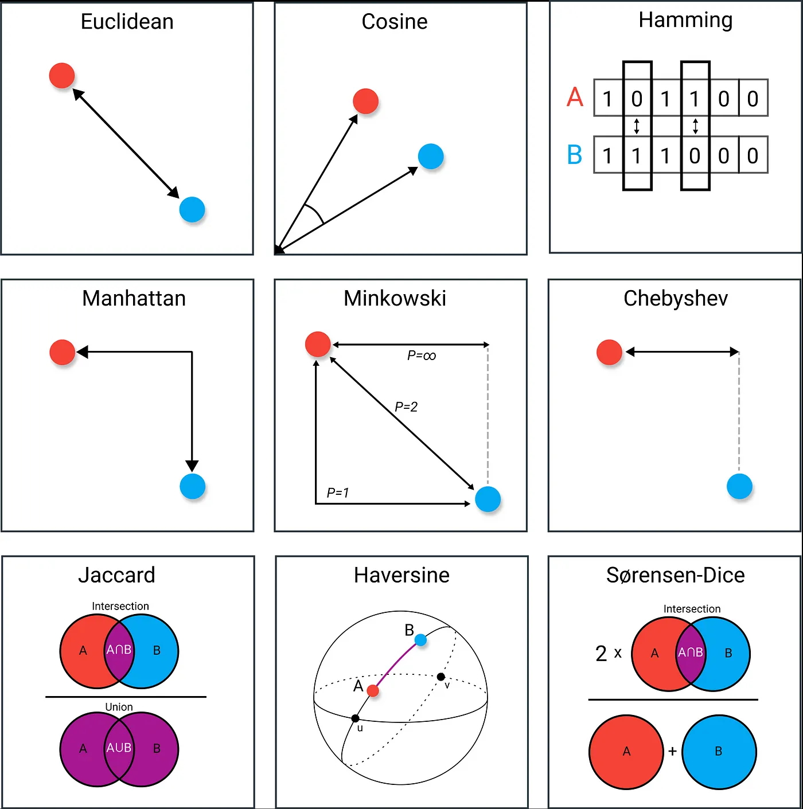
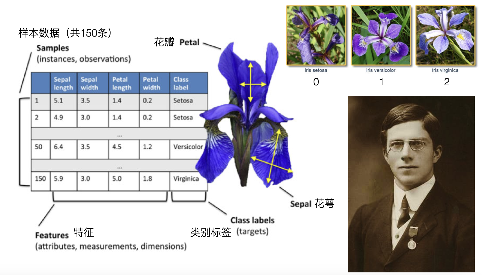
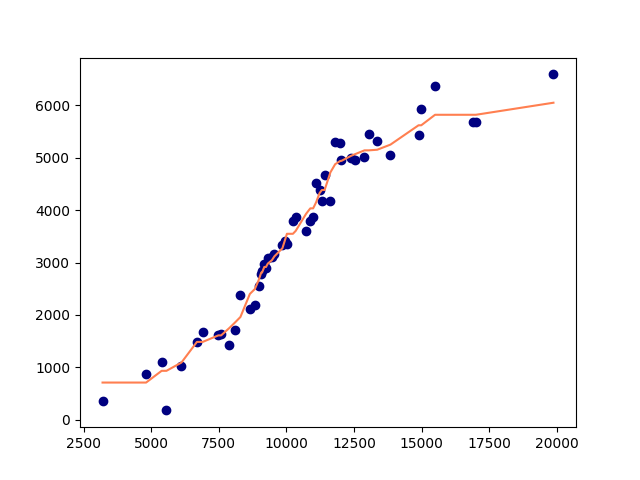

## k En Yakın Komşu Algoritması

> **Translated to Turkish by** himmetcanumutlu

k en yakın komşu algoritması (kNN), sınıflandırma ve regresyon için kullanılan parametrik olmayan istatistiksel yöntemdir; Amerikalı istatistikçiler Evelyn Fix ve Joseph Hodges Jr. tarafından 1951'de önerildi. kNN algoritmasının ilkesi, geçmiş veride yeni girilen örneğe en yakın $\small{k}$ örneği bulup, bunların çoğunluğunun ait olduğu sınıfa göre yeni örneği sınıflandırmak veya yeni örneğin hedef değerini çıkarmaktır; bu algoritmayı daha önce basitçe göstermiştik. Ana akım makine öğrenmesi algoritmalarından farklı olarak k en yakın komşu algoritmasının açık bir öğrenme-eğitim süreci yoktur; "üzüm üzüme baka baka kararır" gibi sade ve basit bir düşünceyle sınıflandırma veya regresyon yapar. k en yakın komşu algoritmasının iki kilit sorunu vardır: ilki $\small{k}$ değerinin nasıl seçileceği, yani yeni örneğin sınıfını veya hedef değerini belirlemek için kaç en yakın komşu kullanılacağı; ikincisi iki örneğin yakın mı uzak mı olduğunun nasıl belirleneceği; burada mesafe ölçümü sorunu devreye girer.

### Mesafenin Ölçümü

Özellik uzayındaki iki örneğin benzerliğini mesafe (distance) ile ölçebiliriz; yaygın mesafe ölçümleri Minkowski mesafesi, Mahalanobis mesafesi, kosinüs mesafesi, düzenleme mesafesi gibi yöntemleri içerir. Minkowski mesafesi (Minkowski Distance), iki $\small{n}$ boyutlu vektör $\small{\mathbf{x}=(x_{1}, x_{2}, \cdots, x_{n})}$ ve $\small{\mathbf{y}=(y_{1}, y_{2}, \cdots, y_{n})}$ için aralarındaki mesafe şöyle tanımlanır:

$$
d(\mathbf{x}, \mathbf{y}) = (\sum_{i=1}^{n}{\vert x_{i} - y_{i} \rvert}^{p})^{\frac{1}{p}}
$$

Burada $\small{p \ge 1}$; $\small{p \lt 1}$ hesaplanabilir olsa da mesafe tanımını katı biçimde sağlamaz; genellikle gerçek mesafe sayılmaz.

$\small{p = 1}$ olduğunda Minkowski mesafesi **Manhattan mesafesidir**:

$$
d(\mathbf{x}, \mathbf{y}) = \sum_{i=1}^{n} \lvert x_{i} - y_{i} \rvert
$$

$\small{p = 2}$ olduğunda Minkowski mesafesi **Öklid mesafesidir**:

$$
d(\mathbf{x}, \mathbf{y}) = \sqrt{\sum_{i=1}^{n}(x_{i} - y_{i})^{2}}
$$

$\small{p \to \infty}$ olduğunda Minkowski mesafesi **Çebışov mesafesidir**:

$$
d(\mathbf{x}, \mathbf{y}) = \underset{i}{max}(\lvert x_{i} - y_{i} \rvert)
$$

Diğer mesafe ölçümlerini kullandığımız yerde tanıtacağız. k en yakın komşu algoritmasıyla sınıflandırma yaparken veri kümemiz genellikle sayısal veridir; bu durumda doğrudan Öklid mesafesi kullanmak iyi bir seçimdir.



### Veri Kümesine Giriş

Şimdi sonraki derslerde kullanacağımız önemli bir veri kümesini tanıtalım: iris veri kümesi (iris dataset). Iris veri kümesi, makine öğrenmesi alanının en ünlü ve klasik veri kümelerinden biridir; botanikçi *Edgar S. Anderson* tarafından Kanada Quebec Gaspé Yarımadası'nda toplandı; İngiliz istatistikçi *Ronald A. Fisher* tarafından 1936'daki *《The Use of Multiple Measurements in Taxonomic Problems》* makalesinde ilk kez tanıtıldı; makine öğrenmesi algoritmasına giriş ve deneylerinde yaygın kullanılır.



Iris veri kümesinde toplam 150 örnek vardır; 3 tür iris içerir: dağ irisi (Iris setosa), renkli iris (Iris versicolor) ve Virginia irisi (Iris virginica); yukarıdaki gibidir; her türden 50 örnek vardır. Örnek veride 4 özellik (features) ve 1 sınıf etiketi (class label) vardır; 4 özellik çanak yaprak uzunluğu (Sepal length), çanak yaprak genişliği (Sepal width), taç yaprak uzunluğu (Petal length), taç yaprak genişliğidir (Petal width); hepsi santimetre cinsinden pozitif sayıdır; veri kümesindeki sınıf etiketi 0, 1, 2 olmak üzere üç değer alır; yukarıdaki üç iris türüne karşılık gelir.

#### Veri Kümesinin Yüklenmesi

Ünlü Python makine öğrenmesi kütüphanesi scikit-learn ile bu veri kümesini yükleyebiliriz; scikit-learn çeşitli sınıflandırma, regresyon, kümeleme algoritması içerir; ayrıca çok katmanlı algılayıcı, destek vektör makinesi, rastgele orman gibi modeller sunar; veri ön işlemeden özellik mühendisliğine, model eğitiminden model değerlendirme ve parametre ayarına kadar çeşitli işlevleri kapsar; aşağıdaki gibidir. Makine öğrenmesindeki çeşitli işlemleri yapmak için bu kütüphaneyi kullanmanızı öneririz; scikit-learn'ün [resmî sitesinde](https://scikit-learn.org/stable/) kullanıcı kılavuzu, API dokümanı ve örnekler vardır; merak edenler ziyaret edebilir.


Sonraki derslerimizde bu kütüphaneyi temelde hep kullanacağımız için önce aşağıdaki komutla kurun.

```
pip install scikit-learn
```

IPython veya Jupyter açtıysanız ama scikit-learn kurulmadıysa aşağıdaki sihirli komutla kurabilirsiniz.

```
%pip install scikit-learn
```

Kurulum bittikten sonra aşağıdaki kodla iris veri kümesini yükleyip veri kümesinin tanıtımını görüntüleyebiliriz.

```Python
from sklearn.datasets import load_iris

# Iris veri kümesini yükle
iris = load_iris()
# Veri kümesinin tanıtımını görüntüle
print(iris.DESCR)
```

Sonra veri kümesindeki özellik ve etiketi alırız; kod aşağıdaki gibidir.

```python
# Özellik (150 satır 4 sütun iki boyutlu dizi; çanak uzunluğu, çanak genişliği, taç uzunluğu, taç genişliği)
X = iris.data
# Etiket (150 elemanlı tek boyutlu dizi; 0, 1, 2 üç değer sırasıyla üç iris türünü temsil eder)
y = iris.target
```

Iris veri kümesini daha sezgisel görmek istiyorsanız yukarıdaki özellik ve etiketle bir DataFrame nesnesi oluşturabilirsiniz; merak edenler kendileri deneyebilir.

#### Veri Kümesinin Bölünmesi

Genellikle ham veriyi eğitim ve test kümesine ayırmamız gerekir; eğitim kümesi modeli eğitmek için seçilen veri, test kümesi modelin eğitim etkisini test etmek için ayrılan veridir. Yukarıdaki iris veri kümesi için verinin %80'ini (120 kayıt) eğitim, %20'sini (30 kayıt) test kümesi yapabiliriz; aşağıdaki kod NumPy ile veri kümesini böler.

```python
# Özellik ve etiketi aynı diziye yığ
data = np.hstack((X, y.reshape(-1, 1)))
# Rastgele karıştırma fonksiyonuyla ham veriyi karıştır
np.random.shuffle(data)
# Verinin %80'ini eğitim kümesi yap
train_size = int(y.size * 0.8)
train, test = data[:train_size], data[train_size:]
X_train, y_train = train[:, :-1], train[:, -1]
X_test, y_test = test[:, :-1], test[:, -1]
```

Elbette veri kümesini bölmenin daha pratik yolu scikit-learn'ün kapsüllediği `train_test_split` fonksiyonudur; özellik ve etiketi verip `train_size` veya `test_size` belirtmemiz yeterlidir. `train_test_split` fonksiyonu dörtlü bir demet döndürür; dört eleman sırasıyla eğitim için özellik, eğitim için etiket, test için özellik ve test için etikettir.

```python
from sklearn.model_selection import train_test_split

X_train, X_test, y_train, y_test = train_test_split(X, y, train_size=0.8, random_state=3)
```

> **Not**: Yukarıdaki koddaki `train_test_split` fonksiyonunun `random_state` parametresi rastgele sayı tohumu olarak düşünülebilir; benimle aynı rastgele sayı tohumunu kullanırsanız bölünen eğitim ve test kümesi de tamamen aynı olur.

### kNN Sınıflandırmasının Gerçeklenmesi

Önce scikit-learn kullanmak yerine temel veri bilimi kütüphaneleri NumPy ve SciPy ile kNN algoritmasını gerçekliyoruz; amaç algoritma ilkesini daha iyi anlamanız; bu temelde scikit-learn'ün gücünü hissedip sınıf, fonksiyon ve parametrelerin neden böyle tasarlandığını kavramanızdır.

#### NumPy Tabanlı Gerçekleme

k en yakın komşu algoritması mesafe hesaplar; önce iki veri noktasının Öklid mesafesini hesaplayan fonksiyonu tasarlayalım; kod aşağıdaki gibidir.

```python
import numpy as np


def euclidean_distance(u, v):
    """İki n boyutlu vektörün Öklid mesafesini hesaplar"""
    return np.sqrt(np.sum(np.abs(u - v) ** 2))
```

Sonra komşuların etiketine göre yeni veriye etiket üreten fonksiyonu tasarlayalım.

```python
from scipy import stats


def make_label(X_train, y_train, X_one, k):
    """
    Geçmiş verideki k en yakın komşuya göre yeni veriye etiket üretir
    :param X_train: eğitim kümesindeki özellik
    :param y_train: eğitim kümesindeki etiket
    :param X_one: tahmin edilecek örneğin (yeni veri) özelliği
    :param k: komşu sayısı
    :return: tahmin edilecek örneğe üretilen etiket (komşu etiketlerinin modu)
    """
    # x ile her eğitim örneğinin mesafesini hesapla
    distes = [euclidean_distance(X_one, X_i) for X_i in X_train]
    # Bir kez bölümleme yaparak k en küçük mesafenin indeksini bul ve ilgili etiketi al
    labels = y_train[np.argpartition(distes, k - 1)[:k]]
    # Etiketin modunu al
    return stats.mode(labels).mode
```

> **Not**: `np.partition` fonksiyonu diziyi bir kez bölümler; k küçük elemanı dizinin soluna, n-k büyük elemanı sağına koyar; hızlı sıralama algoritmasında bir kez bölümleme yapmakla aynı etkidir. Yukarıdaki koddaki `np.argpartition` fonksiyonu k küçük elemanın indeksini dizinin soluna koyar; `[:k]` dilimleme ve `y_train`'e fancy indekslemeyle, yeni veriye mesafesi daha küçük k örneğin etiketi elde edilir. Son olarak scipy'nin stats modülünün `mode` fonksiyonuyla etiketin modu alınır; yeni veriye tahmin ettiğimiz sınıf etiketi olarak kullanılır.

Yukarıdaki hazırlık bittikten sonra k en yakın komşuyla tahmin yapan fonksiyon hazırdır; kod aşağıdaki gibidir.

```python
def predict_by_knn(X_train, y_train, X_new, k=5):
    """
    KNN algoritması
    :param X_train: eğitim kümesindeki özellik
    :param y_train: eğitim kümesindeki etiket
    :param X_new: tahmin edilecek örneklerden oluşan dizi
    :param k: komşu sayısı (varsayılan 5)
    :return: tahmin sonucunu (etiketi) saklayan dizi
    """
    return np.array([make_label(X_train, y_train, X, k) for X in X_new])
```

Yukarıda hazırladığımız iris verisinin eğitim ve test kümesiyle deney yapalım; `predict_by_knn` fonksiyonumuzun iyi çalışıp çalışmadığına bakalım. Aşağıdaki koddaki `y_pred` fonksiyonla tahmin ettiğimiz 30 irisin türüdür; `y_test` ile karşılaştırınca tahmin etkimizi görürüz.

```python
y_pred = predict_by_knn(X_train, y_train, X_test)
y_pred == y_test
```

Benim çıktım:

```
array([ True,  True,  True,  True,  True,  True,  True,  True,  True,
        True,  True,  True,  True,  True,  True,  True, False,  True,
        True,  True,  True,  True,  True,  True,  True,  True,  True,
        True,  True,  True])
```

Çıktıda bir `False` var; tahmin edilen etiketin gerçek etiketle aynı olmadığını, yanlış tahmin olduğunu gösterir; yani tahmin doğruluğumuz $\small{\frac{29}{30}}$, yani `%96.67`. Elbette eğitim ve test kümesini bölerken `random_state` parametresini benimle aynı belirlemediyseniz sonuç farklı olabilir.

#### scikit-learn Tabanlı Gerçekleme

scikit-learn ile kNN algoritmasını gerçeklemek çok daha basittir; temelde üç işlemle istediğimiz sonucu alırız; kod aşağıdaki gibidir.

```python
from sklearn.neighbors import KNeighborsClassifier

# Model oluştur
model = KNeighborsClassifier()
# Modeli eğit
model.fit(X_train, y_train)
# Sonucu tahmin et
y_pred = model.predict(X_test)
```

Çıktıya bakalım; kendi yazdığımız kodla tamamen aynı mı?

```python
y_pred == y_test
```

Çıktı:

```
array([ True,  True,  True,  True,  True,  True,  True,  True,  True,
        True,  True,  True,  True,  True,  True,  True, False,  True,
        True,  True,  True,  True,  True,  True,  True,  True,  True,
        True,  True,  True])
```

Elbette scikit-learn kütüphanesi kendi yazdığımız koddan çok daha zengin; örneğin modelin tahmin doğruluğunu (accuracy) öğrenmek istiyorsak aşağıdaki fonksiyonu kullanabiliriz.

```python
model.score(X_test, y_test)
```

Çıktı:

```
0.9666666666666667
```

### Model Değerlendirme

Elbette bir sınıflandırıcının tahmin etkisinin iyi olup olmadığını yalnızca doğruluğa bakarak değerlendiremeyiz; çünkü sınıf dengesizliğinde doğruluk sizi yanıltabilir. Örneğin test verimizde Virginia irisi örnek sayısı çok küçükse, model Virginia irisini hiç ayırt edemese bile model yüksek doğruluk gösterir. Bu yüzden kesinlik (precision), duyarlılık (recall), F1 puanı gibi göstergelere de bakmalıyız; **karışıklık matrisi** ise sınıflandırma modeli performansını ayrıntılı göstermek için kullanılan araçtır; ikili ve çoklu sınıflandırmaya uygundur; ikili sınıflandırmanın karışıklık matrisi aşağıdaki gibidir.

|      | **Pozitif (Positive) tahmin edildi** | **Negatif (Negative) tahmin edildi** |
| ---- | ------------------------- | ------------------------- |
| **Gerçek pozitif (Positive)** | True Positive (TP) | False Negative (FN) |
| **Gerçek negatif (Negative)** | False Positive (FP) | True Negative (TN) |

Karışıklık matrisini kullanmayı ve sınıflandırma modelinin değerlendirme göstergesini hesaplamayı bir örnekle açıklayalım. Belirli bir tıbbi test sisteminin bir hastalığa yakalanıp yakalanmadığını tahmin ettiğini varsayalım; "pozitif" sınıf "hasta", "negatif" sınıf "hasta değil"; 1000 örneğin test sonucu aşağıdaki gibidir.

|      | **Hasta tahmin edildi** | **Hasta değil tahmin edildi** |
| ---- | -------------- | ---------------- |
| **Gerçek hasta** | 80（TP） | 20（FN） |
| **Gerçek hasta değil** | 30（FP） | 870（TN） |

1. **Doğruluk** (Accuracy).

$$
\text{Accuracy} = \frac{\text{TP} + \text{TN}}{\text{TP} + \text{FP} + \text{FN} + \text{TN}}
$$

Yukarıdaki örnekte modelin tahmin doğruluğu: $\frac{80 + 870}{80 + 30 + 20 + 870} = \frac{950}{1000} = 0.95$.

2. **Kesinlik** (Precision). Kesinlik, pozitif tahmin edilen tüm örnekler içinde gerçekte pozitif olanların oranını ölçer; genellikle doğruluk oranı denir.

$$
\text{Precision} = \frac{\text{TP}}{\text{TP} + \text{FP}}
$$

Yukarıdaki örnekte modelin tahmin kesinliği: $\frac{80}{80 + 30} = \frac{80}{110} = 0.73$.

3. **Duyarlılık** (Recall). Duyarlılık, gerçekte pozitif olan tüm örnekler içinde modelin doğru pozitif tahmin ettiği oranı ölçer; genellikle hatırlama oranı veya gerçek pozitif oranı (True Positive Rate) denir.
$$
\text{Recall} = \frac{\text{TP}}{\text{TP} + \text{FN}}
$$

Yukarıdaki örnekte modelin tahmin duyarlılığı: $\frac{80}{80 + 20} = \frac{80}{100} = 0.8$.

4. **F1 puanı** (F1 Score). F1 puanı, kesinlik ve duyarlılığın harmonik ortalamasıdır; kesinlik ve duyarlılık arasında denge kurar; özellikle ikisi arasında ödünleşim olduğu durumlarda uygundur.
  
$$
\text{F1 Score} = \frac{2}{\frac{1}{\text{Precision}} + \frac{1}{\text{Recall}}} = 2 \times \frac{\text{Precision} \times \text{Recall}}{\text{Precision} + \text{Recall}}
$$

Yukarıdaki örnekte modelin F1 puanı: $2 \times \frac{0.7273 * 0.8}{0.7273 + 0.8} = 0.76$.

5. **Özgüllük** (Specificity) ve **yanlış pozitif oranı** (False Positive Rate, FPR). Özgüllük, gerçekte negatif olan tüm örnekler içinde modelin doğru negatif tahmin ettiği oranı ölçer; duyarlılığa benzer; yalnızca negatif örnekler içindir.

$$
\text{Specificity} = \frac{\text{TN}}{\text{TN} + \text{FP}} \\\\
\text{FPR} = 1 - \text{Specificity}
$$

Yukarıdaki örnekte modelin özgüllüğü: $\frac{870}{870 + 30} = \frac{870}{900} = 0.97$.

6. **ROC** ve **AUC**.

    - **ROC** (Receiver Operating Characteristic Curve), duyarlılık ile yanlış pozitif oranı arasındaki ilişkiyi çizer; aşağıdaki gibidir.

        

    - **AUC** (Area Under the Curve), ROC eğrisinin altındaki alandır; modelin pozitif ve negatif sınıfı ayırt etme yeteneğini ölçer. AUC $\small{[0, 1]}$ aralığındadır; 1'e ne kadar yakınsa modelin pozitif-negatif ayırt etme yeteneği o kadar güçlüdür. 0.5 < AUC < 1 ise modelimiz rastgele tahminden iyidir; sınıflandırıcı (model) eşiği uygun ayarlanırsa tahmin değeri vardır. AUC = 0.5 ise model rastgele tahminle aynıdır; tahmin değeri yoktur. AUC < 0.5 ise model rastgele tahminden kötüdür; ama ters tahmin edebildiği sürece gerçek etkisi rastgele tahminden iyidir.

Çoklu sınıflandırmada karışıklık matrisinin satır ve sütun sayısı sınıf sayısına eşittir; karışıklık matrisi bir kare matristir; yani $\small{n}$ sınıf varsa karışıklık matrisi $\small{n \times n}$ kare matristir. Yukarıda elde ettiğimiz iris veri kümesi tahmin sonucuna göre önce gerçek değer ve tahmin değerini yazdırıp ilgili karışıklık matrisini oluşturalım; aşağıdaki gibidir.

```python
print(y_test)
print(y_pred)
```

Çıktı:

```
[0 0 0 0 0 2 1 0 2 1 1 0 1 1 2 0 1 2 2 0 2 2 2 1 0 2 2 1 1 1]
[0 0 0 0 0 2 1 0 2 1 1 0 1 1 2 0 2 2 2 0 2 2 2 1 0 2 2 1 1 1]
```

|      | **Sınıf 0 (dağ irisi) tahmin edildi** | **Sınıf 1 (renkli iris) tahmin edildi** | **Sınıf 2 (Virginia irisi) tahmin edildi** |
| :---- | :---------------: | :---------------: | :---------------: |
| **Gerçek sınıf 0 (dağ irisi)** | 10 | 0 | 0 |
| **Gerçek sınıf 1 (renkli iris)** | 0 | 9 | 1 |
| **Gerçek sınıf 2 (Virginia irisi)** | 0 | 0 | 10 |


scikit-learn'deki `confusion_matrix` ve `classification_report` fonksiyonuyla karışıklık matrisi ve değerlendirme raporu çıktılanır; kod aşağıdaki gibidir.

```python
from sklearn.metrics import classification_report, confusion_matrix

# Sınıflandırma modelinin karışıklık matrisini çıktıla
print('Karışıklık matrisi: ')
print(confusion_matrix(y_test, y_pred))
# Sınıflandırma modelinin değerlendirme raporunu çıktıla
print('Değerlendirme raporu: ')
print(classification_report(y_test, y_pred))
```

Çıktı:

```
Karışıklık matrisi: 
[[10  0  0]
 [ 0  9  1]
 [ 0  0 10]]
Değerlendirme raporu: 
              precision    recall  f1-score   support

           0       1.00      1.00      1.00        10
           1       1.00      0.90      0.95        10
           2       0.91      1.00      0.95        10

    accuracy                           0.97        30
   macro avg       0.97      0.97      0.97        30
weighted avg       0.97      0.97      0.97        30
```

Karışıklık matrisini görselleştirmek istiyorsanız aşağıdaki kodu kullanabilirsiniz.

```python
import matplotlib.pyplot as plt
from sklearn.metrics import ConfusionMatrixDisplay

# Karışıklık matrisi gösterim nesnesi oluştur
cm_display_obj = ConfusionMatrixDisplay(confusion_matrix(y_test, y_pred), display_labels=iris.target_names)
# Karışıklık matrisini çiz ve göster
cm_display_obj.plot(cmap=plt.cm.Reds)
plt.show()
```

> **Not**: `iris.target_names`, 0, 1, 2 sınıf etiketine karşılık gelen üç irisin İngilizce adıdır.


İkili sınıflandırmada ROC eğrisi çizip AUC değerini göstermek istiyorsanız aşağıdaki kodu kullanabilirsiniz.

```python
from sklearn.metrics import roc_curve, auc
from sklearn.metrics import RocCurveDisplay

# Elle bir grup gerçek değer ve karşılık gelen tahmin değeri oluştur
y_test_ex = np.array([0, 0, 0, 1, 1, 0, 1, 1, 1, 0])
y_pred_ex = np.array([1, 0, 0, 1, 1, 0, 1, 1, 0, 1])
# roc_curve fonksiyonuyla FPR (yanlış pozitif oranı) ve TPR (gerçek pozitif oranı) hesapla
fpr, tpr, _ = roc_curve(y_test_ex, y_pred_ex)
# auc fonksiyonuyla AUC değerini hesapla ve RocCurveDisplay ile grafiği çiz
RocCurveDisplay(fpr=fpr, tpr=tpr, roc_auc=auc(fpr, tpr)).plot()
plt.show()
```


### Parametre Ayarı

Daha önce kNN algoritmasının iki kilit sorunu olduğunu söyledik: biri mesafe ölçümü, diğeri k değerinin seçimi. scikit-learn'ün `KNeighborsClassifier` ile sınıflandırıcı modeli oluştururken modelin hiper parametrelerini ayarlayabiliriz; birkaç önemli parametre vardır:

1. `n_neighbors`: Komşu sayısı; kNN algoritmasındaki k değeridir.
2. `weights`: `uniform` veya `distance` seçilebilir; ilki tüm örneklerin ağırlığının aynı olduğunu, ikincisi mesafe yaklaştıkça ağırlığın arttığını belirtir; varsayılan `uniform`'dur. Elbette özel fonksiyon geçerek her örneğin ağırlığı da belirlenebilir.
3. `algorithm`: `auto`, `ball_tree`, `kd_tree`, `brute` olmak üzere dört seçeneği vardır; varsayılan `auto`'dur. `ball_tree` bir ağaç yapısıdır; küre bölümlemeye dayanarak veri noktalarını hiyerarşik ağaç yapısına dağıtır; yüksek boyutlu ve seyrek veride iyi performans gösterir; `kd_tree` de ağaç yapısıdır; bir boyut seçip uzayı alt bölgelere ayırıp arar; böylece tüm komşularla karşılaştırmaktan kaçınır; düşük boyutlu ve düzgün dağılımlı veride iyi etki eder; yüksek boyutta boyut laneti sorunu yaşar; `auto` girdi verisinin boyutuna göre `ball_tree` veya `kd_tree` otomatik seçer; `brute` kaba kuvvet arama (kapsamlı arama) kullanır; küçük veri kümesinde basit ve etkili seçimdir.
4. `leaf_size`: `ball_tree` veya `kd_tree` algoritması kullanırken, bu parametre ağaç yapısının yaprak düğümünün maksimum örnek sayısını sınırlar; varsayılan `30`; ağacın kurulumu ve düğüm arama performansını etkiler.
5. `p`: Minkowski mesafe formülündeki `p`; varsayılan 2; Öklid mesafesi hesaplar.

**Izgara arama** (Grid Search) ve **çapraz doğrulama** (Cross Validation) ile modelin hiper parametresini ayarlayıp modelin genelleme yeteneğini değerlendirip tahmin etkisini artırabiliriz. Izgara arama, kapsamlı aramayla verilen hiper parametre uzayını gezip en iyi hiper parametre kombinasyonunu bulur; çapraz doğrulama ise eğitim kümesini birden çok alt kümeye bölüp, farklı eğitim ve doğrulama kümelerinde çok kez eğitip değerlendirerek modelin tahmin etkisini kapsamlı değerlendirir. K-Kat çapraz doğrulama en yaygın çapraz doğrulama yöntemidir; veri kümesi K alt kümeye bölünür; her seferinde bir alt küme doğrulama, kalan K-1 alt küme eğitim yapılır; her alt küme için bu süreç tekrarlanıp K kez eğitim ve değerlendirme yapılır; ortalama modelin nihai performans değerlendirmesidir; aşağıdaki gibidir.


Aşağıdaki kod scikit-learn'deki `GridSearchCV` ile ızgara arama ve çapraz doğrulama yapar; bu yolla iris veri kümesinde kNN algoritmasının en iyi parametresini bulur.

```python
from sklearn.model_selection import GridSearchCV

# Izgara arama çapraz doğrulama
gs = GridSearchCV(
    estimator=KNeighborsClassifier(),
    param_grid={
        'n_neighbors': [1, 3, 5, 7, 9, 11, 13, 15],
        'weights': ['uniform', 'distance'],
        'p': [1, 2]
    },
    cv=5
)
gs.fit(X_train, y_train)
```

Aşağıdaki kodla en iyi parametreyi ve puanını alabiliriz.

```python
print('En iyi parametre:', gs.best_params_)
print('Puan:', gs.best_score_)
```

Çıktı:

```
En iyi parametre: {'n_neighbors': 5, 'p': 2, 'weights': 'uniform'}
Puan: 0.9666666666666666
```

Eğitilen en iyi modelle tahmin yapmak istiyorsanız aşağıdaki kodu kullanabilirsiniz.

```python
gs.predict(X_test)
```

### kNN Regresyonu

kNN algoritması genellikle sınıflandırmada kullanılır; elbette regresyonda da kullanılabilir; temel düşüncesi de yeni örneğe en yakın k komşuyu bulup bu k komşunun etiketine (regresyonda genellikle hedef değer deriz) göre yeni örneğin hedef değerini tahmin etmektir. Tahmin ettiğimiz sınıf etiketi değil sayısal bir değer olduğundan, genellikle k komşunun hedef değerine ortalama veya ağırlıklı ortalama uygulayıp yeni örneğin hedef değerinin tahminini elde ederiz. Bir önceki dersteki aylık gelirden online harcamayı tahmin eden örneğe dönelim; sonra scikit-learn'deki `KNeighborsRegressor` ile regresyon modeli kuralım; önce bazı hazırlıklar yapalım; kod aşağıdaki gibidir.

```python
# Aylık gelir
incomes = np.array([
    9558, 8835, 9313, 14990, 5564, 11227, 11806, 10242, 11999, 11630,
    6906, 13850, 7483, 8090, 9465, 9938, 11414, 3200, 10731, 19880,
    15500, 10343, 11100, 10020, 7587, 6120, 5386, 12038, 13360, 10885,
    17010, 9247, 13050, 6691, 7890, 9070, 16899, 8975, 8650, 9100,
    10990, 9184, 4811, 14890, 11313, 12547, 8300, 12400, 9853, 12890
])
# Aylık online harcama
outcomes = np.array([
    3171, 2183, 3091, 5928, 182, 4373, 5297, 3788, 5282, 4166,
    1674, 5045, 1617, 1707, 3096, 3407, 4674, 361, 3599, 6584,
    6356, 3859, 4519, 3352, 1634, 1032, 1106, 4951, 5309, 3800,
    5672, 2901, 5439, 1478, 1424, 2777, 5682, 2554, 2117, 2845,
    3867, 2962,  882, 5435, 4174, 4948, 2376, 4987, 3329, 5002
])
X = np.sort(incomes).reshape(-1, 1)  # Geliri sıralayıp iki boyutlu diziye dönüştür
y = outcomes[np.argsort(incomes)]    # Online harcamayı gelire göre sırala
```

> **Not**: Tek özellik olsa da bağımsız değişkeni iki boyutlu dizi biçiminde işlemek gerekir; çünkü modeli eğitirken kullandığımız `fit` metodu ilk parametresi olarak tek boyutlu dizi kabul etmez. Burada X ve y'yi önceden sıralamamızın nedeni, birazdan dağılım ve çizgi grafiği çizerken X değerine göre küçükten büyüğe çizmektir.

Sonra kNN regresyon modelini kuralım.

```python
from sklearn.neighbors import KNeighborsRegressor

# Model oluştur
model = KNeighborsRegressor()
# Modeli eğit
model.fit(X, y)
# Sonucu tahmin et
y_pred = model.predict(X)
```

Yukarıda doğrudan tüm geçmiş veriyle model eğittik; sonra aşağıdaki grafiği çizip tahmin etkisinin nasıl olduğuna bakalım.

```python
# Ham veri dağılım grafiği
plt.scatter(X, y, color='navy')
# Tahmin sonucu çizgi grafiği
plt.plot(X, y_pred, color='coral')
plt.show()
```



kNN regresyon modelinin hesaplama karmaşıklığı yüksektir ve gürültülü veriye çok duyarlıdır; çoğu zaman iyi bir seçim olmayabilir. Elbette bir regresyon modelinin etkisinin nasıl değerlendirileceğini sonraki bölümlerde anlatacağız.

### Özet

kNN algoritması basit ama güçlü bir makine öğrenmesi algoritmasıdır; küçük veri kümesinde sınıflandırma ve regresyona uygundur; avantajı basit ve anlaşılır olması, açık eğitim süreci olmaması, veri dağılımı varsayımına bağlı olmaması, karmaşık veri desenine uyum sağlayabilmesidir. Elbette kNN algoritmasının eksikliği de çok belirgindir; en büyük sorun hesaplama verimliliğidir; bu yüzden büyük veri kümesinde en iyi seçim olmayabilir. Ayrıca kNN gürültüye çok duyarlıdır; tahmin sonucu k değerine ve örneklerin dengeli olup olmamasına (her sınıfın örnek sayısının yaklaşık eşit olması) bağlıdır; k çok küçükse aşırı uyum, çok büyükse yetersiz uyum olabilir; dengesiz örnek sınıf yanlılığına (Class Imbalance Bias) yol açabilir; yani eğitim örneklerinin çoğu A sınıfına, azı B sınıfına aitse, sınıflandırırken KNN test örneğini A sınıfına tahmin etmeye eğilimlidir.
