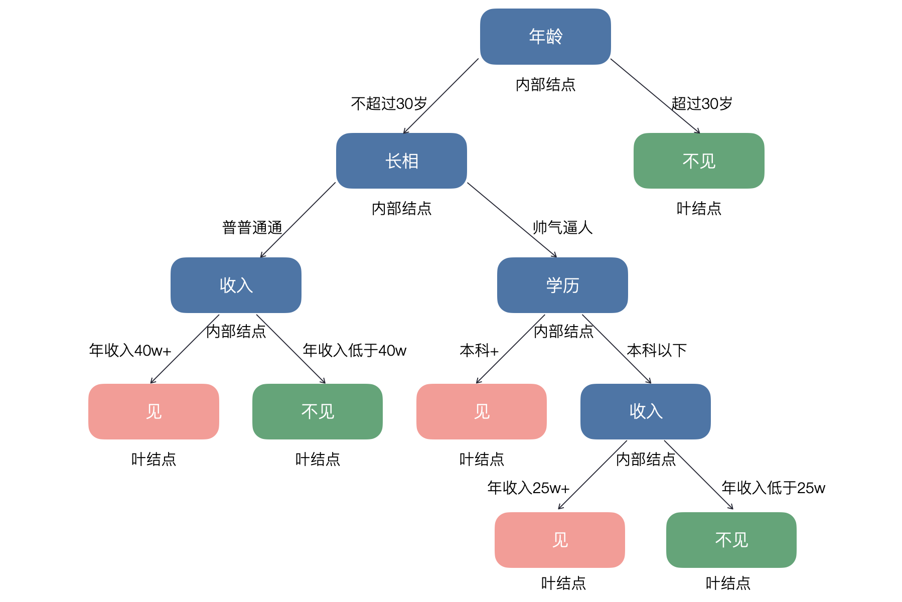
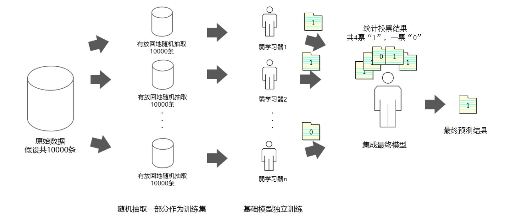

## Karar Ağaçları ve Rastgele Orman

> **Translated to Turkish by** himmetcanumutlu

**Karar ağacı** (Decision Tree), ağaç yapısına dayalı denetimli öğrenme algoritmasıdır; **sınıflandırma** ve **regresyon** görevlerinde kullanılabilir. Veri kümesini belirli durma koşulları sağlanana dek adım adım farklı alt kümelere bölerek tahmin hedefini gerçekleştirir. Hayatta karar verirken de benzer yöntem kullanırız; örneğin bir kızın kör randevu adayını değerlendirme yöntemi aşağıdaki karar ağacına çizilebilir.



> **Not**: Yukarıdaki görsel yalnızca karar ağacının ne olduğunu anlamanıza yardımcı olmak içindir; kötü yönlendirme yoktur ve benim aşk ve evlilik görüşümü temsil etmez.

Biraz programlama bilginiz varsa, karar ağacıyla tahmin yapmanın bir dizi `if...else...` yapısı yürütmek olduğunu görürsünüz; olasılık bilgisine daha aşinaysanız, karar ağacı kurmak özellik uzayını ön koşul alan koşullu olasılığı hesaplamak gibidir. Karar ağacındaki düğümler ikiye ayrılır: iç düğüm (yukarıdaki mavi düğümler) ve yaprak düğüm (yukarıdaki kırmızı ve yeşil düğümler); iç düğüm örnek özellik testine (özellik bölme koşulu), yaprak düğüm karar sonucuna (sınıflandırma etiketi veya regresyon hedef değeri) karşılık gelir. Karar ağacı sınıflandırma ve regresyon sorununu çözer; bu bölümde yine sınıflandırma sorununa odaklanıyoruz.

### Karar Ağacının Oluşturulması

#### Özellik Seçimi

Karar ağacı modelini eğitmenin üç çekirdek adımı vardır: özellik seçimi, karar ağacı oluşturma ve karar ağacı budama. Özellik seçimi hangi özelliklerin karar vermek için kullanılacağını belirler; eğitim veri kümesinde her örneğin birçok özelliği olabilir; farklı özelliklerin etkisi büyük veya küçüktür. Özellik seçiminin amacı, sınıflandırma sonucuyla korelasyonu yüksek, yani sınıflandırma yeteneği güçlü özellikleri elemektir; bu özellikler karar ağacının üst kısmında yer almalıdır. Bir özellik, bölünme sonrası dalların mümkün olduğunca aynı sınıfa ait olmasını, yani düğümün **saflığının** (purity) yüksek olmasını sağlıyorsa, o özellik veri kümesi için güçlü sınıflandırma yeteneğine sahiptir. Burada ilk soru ortaya çıkar: sınıflandırma yeteneği güçlü özelliği hangi ölçüte göre seçmeliyiz? Karar ağacı modelinde sınıflandırma yeteneği güçlü özelliği seçmenin üç yolu vardır: **bilgi kazancı** (information gain), **bilgi kazanç oranı** (gain ratio) ve **Gini indeksi** (Gini index).

Bilgi kazancını net anlatmak için önce **bilgi entropisi** (information entropy) kavramını tanıtmalıyız. 1948'de Claude Shannon (*Claude Shannon*) ünlü makalesi《İletişimin Matematiksel Kuramı》nda "bilgi entropisi" kavramını önerdi; bilgi ölçümü sorununu çözdü, bilginin değerini nicelleştirdi. "Entropi" aslen termodinamik kavramıdır; sistemin düzensizlik derecesini yansıtır; entropi büyüdükçe sistemin düzensizliği artar. Bilgi kuramında entropi, rastgele değişkenin (veri kümesinin) belirsizliğinin ölçüsüdür; entropi büyüdükçe değişkenin (verinin) belirsizliği artar; onu belirlemek için gereken bilgi miktarı da artar; entropi düştükçe verinin saflığı artar, belirsizlik azalır.

Örneğin iki kişi bir atış yarışmasına katılsın; geçmiş sonuçlara göre A'nın kazanma oranı %100 ise A'nın kazanacağını kolayca kabul ederiz; A'nın kazanma oranı %50 ise kimin kazanacağını belirlemek zorlaşır. Claude Shannon bu belirsizliği şu formülle tanımlamayı önerdi:

$$
H(D) = -\sum_{i = 1}^{k} P(x_i)log_2P(x_i)
$$

Burada $\small{D}$ veri kümesi, $\small{k}$ sınıf sayısı, $\small{P(x_i)}$ veri kümesindeki $\small{i}$'inci sınıf örneğinin oranıdır (olasılık). $\small{x_1}$ ve $\small{x_2}$ ile sırasıyla A'nın ve B'nin kazanmasını gösterelim; açıkça $\small{P(x_1)=0.5}$, $\small{P(x_2)=0.5}$ iken $\small{H=1}$, belirsizlik en büyüktür; $\small{P(x_1)=1}$, $\small{P(x_2)=0}$ iken $\small{H=0}$, belirsizlik en küçüktür; $\small{P(x_1)=0.8}$, $\small{P(x_2)=0.2}$ iken $\small{H \approx 0.72}$.

Açıkça bilgi ne kadar çoksa rastgele değişkenin (veri kümesinin) belirsizliği o kadar azdır. Bu bilgi, doğrudan anlamak istediğimiz rastgele olayla ilgili olabileceği gibi, ilgilendiğimiz rastgele olayla ilişkili diğer olayların bilgisi de olabilir. Matematikte bu ilişkili bilginin de belirsizliği azaltıp ortadan kaldırabildiği kesin kanıtlanabilir; bunun için **koşullu entropi** tanımlarız; belirli özellik $\small{A}$ koşulunda veri kümesi $\small{D}$'nin belirsizliğini gösterir. Koşullu entropinin formülü aşağıdaki gibidir:

$$
H(D \vert A) = \sum_{v \in A}\frac{\lvert D_{v} \rvert}{\lvert D \rvert}H(D_{v})
$$

Yukarıdaki formülde $\small{v}$'nin özellik $\small{A}$'nın tüm olası değerlerini almasını sağlıyoruz; $\small{D_{v}}$ özellik $\small{A}$'nın $\small{v}$ olduğu örnek alt kümesi; $\small{\frac{\lvert D_{v} \rvert}{\lvert D \rvert}}$ ağırlık, yani özelliği $\small{v}$ olan örnek oranıdır. $\small{H(D) \ge H(D \vert A)}$ olduğu kanıtlanabilir; yani özellik $\small{A}$ bilgisi eklendikten sonra veri kümesi $\small{D}$'nin belirsizliği düşer. Elbette eşitlik durumuna da dikkat; özellik $\small{A}$ bilgisi eklendi ama $\small{D}$'nin belirsizliği düşmedi; yani aldığımız bilgi araştırdığımız içerikle ilişkisizdir.

Bu hazırlıkla **bilgi kazancını** tanımlayabiliriz; özellik $\small{A}$ bilgisini aldıktan sonra veri kümesi $\small{D}$'nin belirsizliğinin azalma derecesidir. Başka deyişle bilgi kazancı, veri kümesinin kesinliğinin artışını tanımlayan niceliktir; özelliğin bilgi kazancı ne kadar büyükse sınıflandırma yeteneği o kadar güçlüdür; özellik verildikten sonra veri kümesinin kesinliği o kadar artar. Bilgi kazancı şu matematiksel formülle sezgisel ifade edilir:

$$
g(D, A) = E(D) - E(D \vert A)
$$

Bilgi entropisi ve bilgi kazancını hesaplayan fonksiyonlar aşağıdaki gibidir:

```python
import numpy as np


def entropy(y):
    """
    Bilgi entropisini hesaplar
    :param y: veri kümesinin hedef değeri
    :return: bilgi entropisi
    """
    _, counts = np.unique(y, return_counts=True)
    prob = counts / y.size
    return -np.sum(prob * np.log2(prob))


def info_gain(x, y):
    """
    Bilgi kazancını hesaplar
    :param x: verilen özellik
    :param y: veri kümesinin hedef değeri
    :return: bilgi kazancı
    """
    values, counts = np.unique(x, return_counts=True)
    new_entropy = 0
    for i, value in enumerate(values):
        prob = counts[i] / x.size
        new_entropy += prob * entropy(y[x == value])
    return entropy(y) - new_entropy
```

Klasik karar ağacı algoritmalarından ID3, bilgi kazancına dayalı özellik seçer; yine iris veri kümesi örneğiyle veri kümesini eğitim ve test kümesine bölüp, eğitim kümesinde ham bilgi entropisini ve dört özelliğin (çanak uzunluğu, çanak genişliği, taç uzunluğu, taç genişliği) bilgi kazancını hesaplayalım; kod aşağıdaki gibidir.

```python
from sklearn.datasets import load_iris
from sklearn.model_selection import train_test_split

iris = load_iris()
X, y = iris.data, iris.target
X_train, X_test, y_train, y_test = train_test_split(X, y, train_size=0.8, random_state=3)
print(f'H(D)    = {entropy(y_train)}')
print(f'g(D,A0) = {info_gain(X_train[:, 0], y_train)}')
print(f'g(D,A1) = {info_gain(X_train[:, 1], y_train)}')
print(f'g(D,A2) = {info_gain(X_train[:, 2], y_train)}')
print(f'g(D,A3) = {info_gain(X_train[:, 3], y_train)}')
```

Çıktı:

```
H(D)    = 1.584962500721156
g(D,A0) = 0.9430813063736728
g(D,A1) = 0.5692093930591595
g(D,A2) = 1.4475439590905472
g(D,A3) = 1.4420095891994646
```

> **Dikkat**: Eğitim ve test kümesini bölerken `train_test_split` fonksiyonunun `random_state` parametresi yukarıdaki kodumdan farklıysa sonuç farklı olabilir.

Yukarıdaki çıktıya göre taç yaprak uzunluğu (yukarıdaki `A2`) özelliğinin bilgi kazancı en yüksektir; yani taç yaprak uzunluğu özelliğiyle sınıflandırma yeteneği en güçlüdür; sınıflandırma sonrası veri kümesinin saflığı en yüksektir. Dikkat: bir özelliğin değeri çok olduğunda o özelliğin bilgi kazancı büyük çıkar; bu yüzden bilgi kazancıyla özellik seçmek değeri çok olan özelliğe eğilimlidir. Bu sorunu çözmek için **bilgi kazanç oranını** hesaplarız; tanımı aşağıdaki gibidir:

$$
R(D, A) = \frac{g(D, A)}{E_{A}(D)}
$$

Burada $\small{E_{A}(D) = -\sum_{i=1}^{n}{\frac{\lvert D_{i} \rvert}{\lvert D \rvert}log_{2}\frac{\lvert D_{i} \rvert}{\lvert D \rvert}}}$; $\small{n}$ özellik $\small{A}$'nın değer sayısıdır; basitçe $\small{E_{A}(D)}$ özellik $\small{A}$'nın bilgi entropisidir; bilgi kazanç oranı, özellik $\small{A}$'nın bilgi kazancının özellik $\small{A}$'nın bilgi entropisine oranıdır. Aşağıdaki fonksiyonla bilgi kazanç oranını hesaplayıp dört özelliğin bilgi kazanç oranını çıktılayabiliriz.

```python
def info_gain_ratio(x, y):
    """
    Bilgi kazanç oranını hesaplar
    :param x: verilen özellik
    :param y: veri kümesinin hedef değeri
    :return: bilgi kazanç oranı
    """
    return info_gain(x, y) / entropy(x)


print(f'R(D,A0) = {info_gain_ratio(X_train[:, 0], y_train)}')
print(f'R(D,A1) = {info_gain_ratio(X_train[:, 1], y_train)}')
print(f'R(D,A2) = {info_gain_ratio(X_train[:, 2], y_train)}')
print(f'R(D,A3) = {info_gain_ratio(X_train[:, 3], y_train)}')
```

Çıktı:

```
R(D,A0) = 0.19687406476459068
R(D,A1) = 0.14319788821311977
R(D,A2) = 0.28837763858461984
R(D,A3) = 0.35550822529855447
```

> **Dikkat**: Eğitim ve test kümesini bölerken `train_test_split` fonksiyonunun `random_state` parametresi yukarıdaki kodumdan farklıysa sonuç farklı olabilir.

Yukarıdaki çıktıya göre taç yaprak genişliği (yukarıdaki `A3`) özelliğinin bilgi kazanç oranı en yüksektir; yani bu özellik iyi bir veri bölmesi yapabilir; karar ağacımızın kök düğümü olabilir. Elbette karar ağacı kurmak tek bölmeyle bitmez; bölünen veri kümesinde bilgi kazanç oranını hesaplamaya devam edip yeni bölme özelliği seçebiliriz; belirli koşullar sağlanana dek bu süreci tekrarlayıp eksiksiz bir karar ağacı modeli kurulur. Klasik karar ağacı algoritmalarından C4.5, bilgi kazanç oranına dayalı özellik seçer.

Yukarıdaki bilgi kazancı ve bilgi kazanç oranı dışında, **Gini indeksi** de çok iyi bir özellik seçim yöntemidir; veri kümesinin saflığını değerlendirir. Gini indeksi, **Gini safsızlığı** (Gini impurity) da denir; değeri 0 ile 1 arasındadır; veri kümesinin saflığı ne kadar yüksekse Gini indeksi 0'a o kadar yakın; saflık ne kadar düşükse 1'e o kadar yakındır. Veri kümesinin $\small{n}$ sınıfı varsa ve örneğin $\small{k}$'inci sınıfa ait olma olasılığı $\small{p_{k}}$ ise, veri kümesinin Gini indeksi şu formülle hesaplanır:

$$
G(D) = 1 - \sum_{k=1}^{n}{p_{k}}^{2}
$$

Örneğin iris veri kümesinde üç irisin örnek sayısı da 50 ise tüm veri kümesinin Gini indeksi:

$$
G(D) = 1 - [(\frac{1}{3})^{2} + (\frac{1}{3})^{2} + (\frac{1}{3})^{2}] = \frac{2}{3}
$$

Üç irisin örnek sayısı sırasıyla 100, 25, 25 ise tüm veri kümesinin Gini indeksi:

$$
G(D) = 1 - [(\frac{2}{3})^{2} + (\frac{1}{6})^{2} + (\frac{1}{6})^{2}] = \frac{1}{2}
$$

Üç irisin örnek sayısı sırasıyla 140, 5, 5 ise tüm veri kümesinin Gini indeksi:

$$
G(D) = 1 - [(\frac{14}{15})^{2} + (\frac{1}{30})^{2} + (\frac{1}{30})^{2}] = \frac{19}{150}
$$

Görüldüğü gibi veri kümesinin saflığı arttıkça Gini indeksi küçülür. Veri kümesi $\small{D}$, özellik $\small{A}$'ya göre $\small{k}$ parçaya bölünürse, özellik $\small{A}$ ön koşulunda veri kümesinin Gini indeksi şöyle tanımlanır:

$$
G(D, A) = \sum_{i=1}^{k}\frac{\lvert D_{i} \rvert}{\lvert D \rvert}G(D_{i})
$$

Yukarıdaki formüle göre aşağıdaki Gini indeksini hesaplayan fonksiyonu tasarlayabiliriz; formülle karşılaştırıp aşağıdaki kodu anlayıp anlamadığınıza bakabilir veya fonksiyonu çağırıp iris veri kümesinin hangi özelliğinin ham veri kümesini veya eğitim kümesini en iyi böldüğünü görebilirsiniz. Klasik karar ağacı algoritmalarından CART, Gini indeksine dayalı özellik seçer.

```python
def gini_index(y):
    """
    Gini indeksini hesaplar
    :param y: veri kümesinin hedef değeri
    :return: Gini indeksi
    """
    _, counts = np.unique(y, return_counts=True)
    return 1 - np.sum((counts / y.size) ** 2)


def gini_with_feature(x, y):
    """
    Verilen özellikten sonraki Gini indeksini hesaplar
    :param x: verilen özellik
    :param y: veri kümesinin hedef değeri
    :return: verilen özellikten sonraki Gini indeksi
    """
    values, counts = np.unique(x, return_counts=True)
    gini = 0
    for value in values:
        prob = x[x == value].size / x.size
        gini += prob * gini_index(y[x == value]) 
    return gini


print(f'G(D)    = {gini_index(y_train)}')
print(f'G(D,A0) = {gini_with_feature(X_train[:, 0], y_train)}')
print(f'G(D,A1) = {gini_with_feature(X_train[:, 1], y_train)}')
print(f'G(D,A2) = {gini_with_feature(X_train[:, 2], y_train)}')
print(f'G(D,A3) = {gini_with_feature(X_train[:, 3], y_train)}')
```

Çıktı:

```
G(D,A0) = 0.29187830687830685
G(D,A1) = 0.44222582972582963
G(D,A2) = 0.06081349206349207
G(D,A3) = 0.06249999999999998
```

#### Veri Bölme

Karar ağacı kurma süreci özyinelemeli bir süreçtir; yukarıdaki yöntemle özellik seçtikten sonra veri bölme yapılır; basitçe o özelliğe göre veri kümesi iki veya daha fazla alt kümeye bölünür (iki alt küme ikili ağaca, çok alt küme çok dallı ağaca karşılık gelir); her alt küme özelliğin farklı değerine karşılık gelir. Sonra her alt küme için özellik seçimi ve veri bölmeyi tekrarlarız; durma koşulu sağlanana dek. Durma koşulu özyinelemeli süreç için çok önemlidir; ayrıca aşırı karmaşık ağaç yapısı oluşmasını önler. Yaygın durma koşulları:

1. Ağaç önceden belirlenen derinliğe ulaşır.
2. Mevcut düğümün örnek sayısı önceden belirlenen eşiğin altına düşer.
3. Düğümdeki tüm örnekler aynı sınıfa aittir.
4. Bilgi kazancı veya Gini indeksinin değişimi belirli eşiğin altına düşer.

> **Not**: Ağaç yapısı yazma deneyiminiz varsa yukarıdaki süreç kolayca anlaşılır. Elbette özyineleme (recursion), ikili ağaç (binary tree), çok dallı ağaç (multi-way tree) konusuna aşina değilseniz veri yapısı anlatan bir kitaba bakabilirsiniz; ilgili bilgi karmaşık değildir; burada tekrar anlatmayacağız.

Veri bölme sürecinde dikkat edilmesi gereken bir sorun da sürekli değer ve eksik değerin işlenmesidir. Sürekli değer için özelliğin tüm olası değerlerini gezip, bölme sonrası alt kümelerin bilgi kazanç oranı veya Gini indeksinde en iyi olmasını sağlayan kesme noktası $\small{x}$ bulunur; veri bölerken $\small{x}$ ile veri $\small{D_{1}}$ ve $\small{D_{2}}$ iki alt kümeye ayrılır; $\small{D_{1}}$ özellik değeri $\small{x}$'e eşit veya küçük, $\small{D_{2}}$ özellik değeri $\small{x}$'ten büyük örnekleri içerir. Eksik değer için C4.5 algoritması ağırlıklı dağıtım yapar; bölmek için bir özellik seçildiğinde, o özelliğinde eksik değer olan örnek her alt kümeye dağıtılır; ama farklı alt kümede o örneğe verilen ağırlık farklıdır; bu ağırlık özelliğin her sınıftaki oranına göre hesaplanır. CART algoritması eksik değer işlerken genellikle her özellik için varsayılan bir dal oluşturur. Eksik değerli örnek için CART onları varsayılan dala yönlendirir; Gini indeksi hesaplarken CART eksik değerli örneği hesaba katıp katmamayı seçebilir.

#### Ağacın Budanması

Nispeten karmaşık bir karar ağacını budamak gereklidir; budama ağaç yapısının karmaşıklığını azaltır, aşırı uyum riskini önler. Yaygın budama stratejileri:

1. **Son budama** (post-pruning). Son budama, adından da anlaşılacağı gibi karar ağacı kurulduktan sonra gereksiz bazı dalları değerlendirip kaldırarak ağaç yapısını sadeleştirir. Son budama genellikle yaprak düğümden başlar; aşağıdan yukarıya her düğümü değerlendirip onu yaprak düğüme dönüştürmenin (o düğüm ve alt ağacını budamanın) modelin performansını (doğrulama kümesindeki tahmin etkisini) artırıp artırmadığına bakar. Bu yöntem aşırı uyum riskini azaltırken veriye uyum yeteneğini iyi korur; ama hesaplama maliyeti yüksektir; uygun doğrulama kümesi yoksa budama etkisi etkilenir.
2. **Ön budama** (pre-pruning). Ön budama, karar ağacı kurarken bir düğümü bölmeye devam edip etmemeye dinamik karar verir. Bölmeden önce mevcut düğümün bölünmeye devam edip etmeyeceğini değerlendirip aşırı karmaşık ağaç oluşması önlenir; yukarıda birkaç yaygın durma koşulundan söz ettik. Ön budama stratejisi karar ağacı kurma aşamasında gereksiz bölmeyi azaltır; modelin karmaşıklığını düşürür; ama yetersiz uyum riski olabilir; çünkü erken durmak olası önemli karar kuralını gözden kaçırabilir.

### Karar Ağacı Modelinin Gerçeklenmesi

scikit-learn'deki `tree` modülünün `DecisionTreeClassifier` ve `DecisionTreeRegressor` sınıfıyla sınıflandırma ve regresyon karar ağacı gerçeklenir; burada sınıflandırma sorununu çözen karar ağacı modeline odaklanıyoruz; regresyon karar ağacını merak edenler kendileri inceleyebilir.

```python
from sklearn.tree import DecisionTreeClassifier

# Model oluştur
model = DecisionTreeClassifier()
# Modeli eğit
model.fit(X_train, y_train)
# Sonucu tahmin et
y_pred = model.predict(X_test)
```

Aşağıda tahmin ve gerçek değeri karşılaştırıp modelin değerlendirme raporuna bakalım.

```python
from sklearn.metrics import classification_report

print(y_test)
print(y_pred)
print(classification_report(y_test, y_pred))
```

Çıktı:

```
[0 0 0 0 0 2 1 0 2 1 1 0 1 1 2 0 1 2 2 0 2 2 2 1 0 2 2 1 1 1]
[0 0 0 0 0 2 1 0 2 1 1 0 1 1 2 0 1 2 2 0 2 2 2 1 0 2 2 1 2 1]
              precision    recall  f1-score   support

           0       1.00      1.00      1.00        10
           1       1.00      0.90      0.95        10
           2       0.91      1.00      0.95        10

    accuracy                           0.97        30
   macro avg       0.97      0.97      0.97        30
weighted avg       0.97      0.97      0.97        30
```

> **Not**: Yukarıdaki kodu çalıştırınca gördüğünüz çıktı benimkiyle aynı olmayabilir; çünkü `DecisionTreeClassifier` oluştururken rastgeleliği kontrol eden `random_state` parametresi vardır; bu parametreye belirli bir tam sayı verirseniz sonucunuz tekrarlanabilir olur.

Aşağıdaki kodla karar ağacını görselleştirebiliriz; görselleştirmenin karar ağacı modelini daha iyi anlamanıza yardımcı olacağına inanıyoruz.

```python
import matplotlib.pyplot as plt
from sklearn.tree import plot_tree

plt.figure(figsize=(12, 10))
plot_tree(
    decision_tree=model,               # Karar ağacı modeli
    feature_names=iris.feature_names,  # Özellik adı
    class_names=iris.target_names,     # Etiket adı
    filled=True                        # Renkle doldur
)
plt.show()
```

Çıktı:


> **Dikkat**: Yukarıdaki şekilde ağacın kök düğümünün Gini indeksi, daha önce hesapladığımız veri kümesinin Gini indeksiyle tamamen aynıdır.

`DecisionTreeClassifier` parametresini ayarlayıp karar ağacını yeniden oluşturup modeli görselleştirelim.

```python
# Model oluştur
model = DecisionTreeClassifier(
    criterion='entropy',
    ccp_alpha=0.01,
    
)
# Modeli eğit
model.fit(X_train, y_train)
# Görselleştir
plt.figure(figsize=(12, 10))
plot_tree(
    decision_tree=model,               # Karar ağacı modeli
    feature_names=iris.feature_names,  # Özellik adı
    class_names=iris.target_names,     # Etiket adı
    filled=True                        # Renkle doldur
)
plt.show()
```

Çıktı:


> **Dikkat**: Yukarıdaki şekilde ağacın kök düğümünün bilgi entropisi, daha önce hesapladığımız veri kümesinin bilgi entropisiyle tamamen aynıdır.

Görüldüğü gibi `DecisionTreeClassifier` nesnesi oluştururken parametre farklı olduğunda üretilen karar ağacı da farklıdır. `DecisionTreeClassifier` kurucusunun parametreleri karar ağacı modelinin hiper parametreleridir; birkaç çok önemli hiper parametre vardır:

1. `criterion`: Özellik seçimi (veri bölme kalitesi değerlendirme) ölçütü; `'gini'` veya `'entropy'` seçilebilir; ilki Gini indeksi (varsayılan), ikincisi bilgi kazancıdır.
2. `max_depth`: Ağacın maksimum derinliği; varsayılan `None`; bu parametre ayarlanmazsa aşırı uyum riski vardır.
3. `min_samples_split`: Bir iç düğümün yeniden bölünmesi için gereken minimum örnek sayısı; varsayılan `2`. Tam sayı minimum örnek sayısını, kayan noktalı sayı toplam örnek sayısına oranını belirtir.
4. `min_samples_leaf`: Yaprak düğümün gerektirdiği minimum örnek sayısı; varsayılan `1`. Daha büyük değer modeli yumuşatır, aşırı uyum riskini düşürür. Tam sayı veya kayan noktalı olabilir.
5. `max_features`: En iyi bölme için kullanılan özellik sayısı; varsayılan `None`. Tam sayı sabit özellik sayısını, kayan noktalı özellik oranını belirtir; string olarak `'auto'` ve `'sqrt'` toplam özellik sayısının karekökünü, `'log2'` logaritmasını seçilecek özellik sayısı yapar.
6. `class_weight`: Sınıf ağırlığını belirtir; sınıf dengesizliğini işler; varsayılan `None`. Sözlükle her sınıfın ağırlığı elle ayarlanabilir veya `'balanced'` ile modelin otomatik ayarlaması sağlanır.
7. `splitter`: Bölme düğümü seçme stratejisi; varsayılan `'best'` en iyi bölme; diğer değer `'random'` rastgele bölmedir.
8. `max_leaf_nodes`: Yaprak düğümün maksimum sayısını sınırlar; ağaç yapısının aşırı karmaşık olmasını önler.
9. `min_impurity_decrease`: Düğüm bölünmesi için gereken minimum safsızlık azalması; her düğüm yalnızca safsızlık azalması bu değeri aşarsa bölünür.
10. `ccp_alpha`: Maliyet karmaşıklığı budamasındaki $\small{\alpha}$ parametresi. Son budamadaki maliyet karmaşıklığı formülündeki $\small{\alpha}$ değerini kontrol eder. Küçük $\small{\alpha}$ daha karmaşık ağaca izin verir; büyük $\small{\alpha}$ daha basit ağacı seçer. $\small{\alpha}$ ayarlanarak karmaşıklık ve hata arasında en iyi denge bulunur.

Daha önce anlattığımız ızgara arama ve çapraz doğrulamayla hiper parametreyi ayarlayabiliriz; merak edenler aşağıdaki koda bakabilir.

```python
from sklearn.model_selection import GridSearchCV

gs = GridSearchCV(
    estimator=DecisionTreeClassifier(),
    param_grid={
        'criterion': ['gini', 'entropy'],
        'max_depth': np.arange(5, 10),
        'max_features': [None, 'sqrt', 'log2'],
        'min_samples_leaf': np.arange(1, 11),
        'max_leaf_nodes': np.arange(5, 15)
    },
    cv=5
)
gs.fit(X_train, y_train)
```

### Rastgele Ormana Genel Bakış

Rastgele orman, karar ağacına dayalı topluluk öğrenmesi algoritmasıdır; topluluk öğrenmesi, birden çok modelin tahmin sonucunu birleştirip genel model performansını artırmaktır; çekirdek düşüncesi, birden çok modelin kombinasyonunun tek modelden daha etkili olmasıdır; farklı modeller verinin farklı özelliğini yakalayıp modelin aşırı uyum riskini düşürür (genelleme yeteneğini artırır). Rastgele orman, birden çok karar ağacı kurup tahmin sonuçlarına oylama (sınıflandırma) veya ortalama (regresyon) uygulayarak modelin doğruluğunu ve gürbüzlüğünü artırır; aşağıdaki gibidir.



Rastgele ormanın temel çalışma akışı:

1. Bootstrap örnekleme: Ham eğitim veri kümesinden rastgele birkaç örnek çekilir (geri koymalı örnekleme); birden çok farklı alt küme oluşturulur; her alt küme bir karar ağacı eğitir.
2. Karar ağacı kurma: Her ağaç düğüm bölerken tüm özellikleri düşünmek yerine rastgele bir kısım özellik seçip veri böler. Bu yolla rastgele orman model çeşitliliğini artırır, ağaçlar arası korelasyonu azaltır.
3. Topluluk öğrenmesi: Sınıflandırmada rastgele orman oylamayla (çoğunluk oyu) nihai sınıflandırmayı belirler; regresyonda her ağacın tahmin sonucunun ortalaması nihai tahmindir.

Rastgele ormanın başlıca avantajları:

1. Birden çok karar ağacını birleştirerek modelin doğruluğunu etkili biçimde artırır.
2. Rastgelelik nedeniyle rastgele orman tek karar ağacından daha az aşırı uyum yapar.
3. Rastgele orman özellik önem puanı sunar; modeli anlamaya yardımcı olur.
4. Büyük ölçekli ve yüksek boyutlu veriyi işleyebilir.

Elbette birden çok karar ağacı kurduğu için rastgele orman modeli genellikle karmaşıktır; eğitimde hesaplama kaynağı, bellek ve zaman maliyeti daha büyüktür. scikit-learn kütüphanesinin `ensemble` modülündeki `RandomForestClassifier` sınıfıyla rastgele orman modeli kurulabilir; yine ızgara arama çapraz doğrulamayla hiper parametreyi ayarlayalım; kod aşağıdaki gibidir.

```python
from sklearn.ensemble import RandomForestClassifier

gs = GridSearchCV(
    estimator=RandomForestClassifier(n_jobs=-1),
    param_grid={
        'n_estimators': [50, 100, 150],
        'criterion': ['gini', 'entropy'],
        'max_depth': np.arange(5, 10),
        'max_features': ['sqrt', 'log2'],
        'min_samples_leaf': np.arange(1, 11),
        'max_leaf_nodes': np.arange(5, 15)
    },
    cv=5
)
gs.fit(X_train, y_train)
```

> **İpucu**: Yukarıdaki kod çok uzun süre çalışabilir.

Rastgele orman modelinin hiper parametrelerinin çoğu karar ağacıyla benzerdir; açıklanması gereken şu hiper parametreler vardır:

1. `estimator`: Ormandaki ağaç sayısı; yani ormanı kurmak için kaç karar ağacı kullanılacağı. Daha çok ağaç genellikle daha iyi tahmin getirir; ama hesaplama maliyetini de artırır.
2. `bootstrap`: Bootstrap örnekleme kullanılıp kullanılmayacağı; varsayılan `True`; her ağacı kurarken geri koymalı örnekleme kullanılır.
3. `n_jobs`: Paralel çalışacak görev sayısı; varsayılan `None` tek işlemci çekirdeği kullanır; `-1` tüm kullanılabilir çekirdeği kullanır.

### Özet

Karar ağacı, basit, etkili ve anlaşılması kolay bir tahmin modelidir; sınıflandırma ve regresyona uygundur; ama aşırı uyuma yatkındır ve gürültülü veriye duyarlıdır; rastgele orman birden çok karar ağacını birleştirerek genelleme yeteneğini artırır, gürültülü veriye duyarlı değildir, karmaşık sorunlara uygundur. Gerçek sorunu çözerken somut senaryoya göre uygun modeli seçip ilgili hiper parametreyi ayarlayarak en iyi etki elde edilir; ikisinin karşılaştırması aşağıdaki tablodadır:

| **Özellik**         | **Karar ağacı**           | **Rastgele orman**       |
| ---------------- | -------------------- | ------------------ |
| **Model karmaşıklığı**   | Basit                 | Oldukça karmaşık             |
| **Aşırı uyuma direnç** | Zayıf                   | Güçlü                 |
| **Hesaplama verimliliği**     | Yüksek                   | Düşük               |
| **Sonuç kararlılığı**   | Tek veri değişiminden etkilenir | Kararlı               |
| **Uygun senaryo**     | Az veri, basit sorun   | Çok veri, karmaşık sorun |
