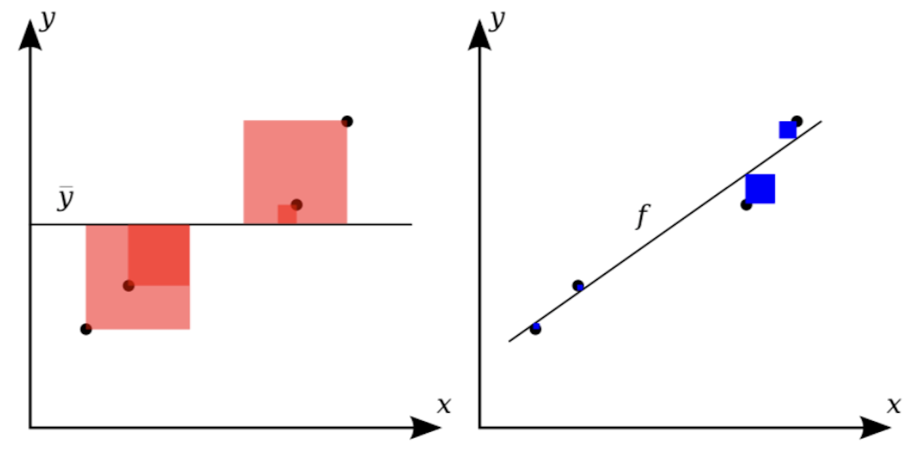
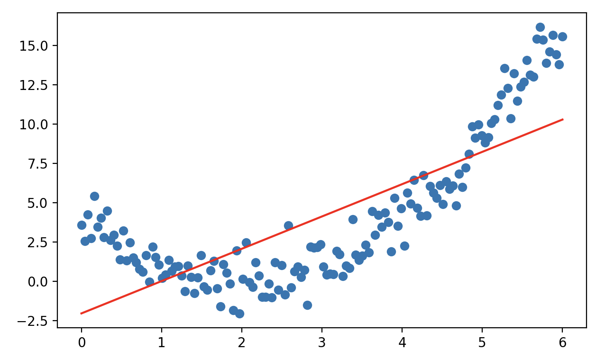
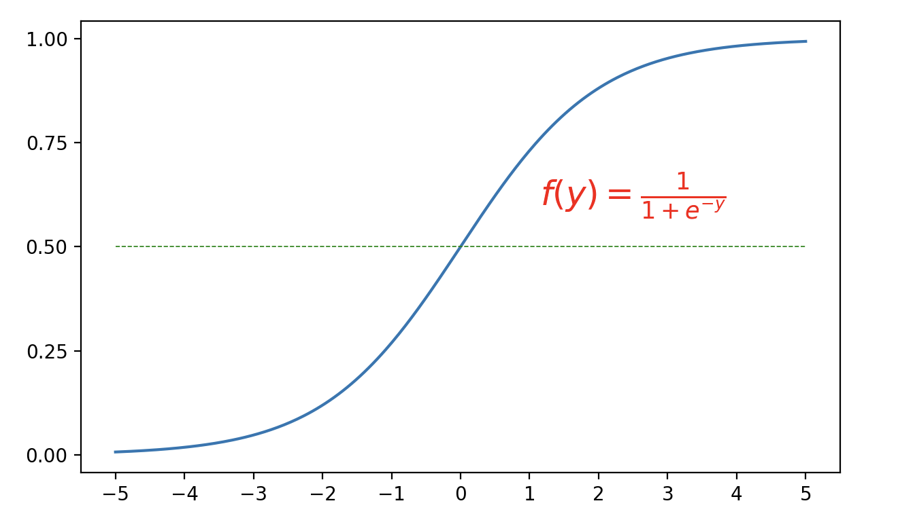

## Regresyon Modelleri

> **Translated to Turkish by** himmetcanumutlu

Regresyon modeli, makine öğrenmesi ve istatistikteki temel modellerdendir; sürekli çıktı değişkenini tahmin etmek için kullanılır. Basitçe, bir grup girdi değişkeni (bağımsız değişken) ve karşılık gelen çıktı değişkeni (bağımlı değişken) verilir; regresyon modeli girdi ile çıktı arasındaki eşlemeyi bulmayı amaçlar. Regresyon modelinin biçimi basit olabilir ama makine öğrenmesindeki en temel modelleme düşüncesini içerir. Genellikle regresyon modeli kurmanın iki ana hedefi vardır:

1. **Veri arasındaki ilişkiyi tanımlamak**. Daha önce **makine öğrenmesinin anahtarının, geçmiş veriyle özellikten hedef değere eşlemeyi öğrenmek olduğunu** söylemiştik; bu süreç önceden kural koymamızı gerektirmez; makinenin geçmiş veriyi öğrenerek edinmesini sağlar. Regresyon modeli, girdi ve çıktı arasındaki ilişkiyi modelle ifade etmemize yardımcı olur.
2. **Bilinmeyen veriyi tahmin etmek**. Öğrenilen eşlemeyle model yeni girdi verisini tahmin eder.

Regresyon modelinin uygulaması çok geniştir; birkaç somut örnek verelim:

1. **Perakende**. Dünyanın en büyük e-ticaret platformu Amazon, geçmiş satış, ürün özelliği (fiyat, indirim, marka, kategori), zaman özelliği (mevsim, iş günü, tatil), dış faktör (hava, sosyal medya) gibi özelliklerle regresyon modeli kurup gelecekte farklı ürünün talebini tahmin eder. Promosyon döneminde, promosyonun satışa etkisini analiz etmek için etkileşim terimli çoklu regresyon kullanılır.
2. **Otomotiv**. Tesla, pil şarj stratejisini optimize edip pil ömrünü uzatmak ve elektrikli araç kullanıcısına daha doğru şarj uyarısı vermek için, şarj-deşarj sayısı, ortam sıcaklığı, deşarj derinliği, pil fiziksel parametresi gibi özelliklerle regresyon modeli kurup pilin kalan ömrünü tahmin eder.
3. **Emlak**. ABD'nin en büyük çevrimiçi emlak platformu Zillow, kullanıcının ev değerini değerlendirmesine yardımcı olmak için regresyon modeli kullanmıştır; ev alanı, bina yaşı, coğrafi konum, ev tipi, mahalle güvenlik düzeyi, okul puanı gibi özelliklerle evin piyasa fiyatını tahmin eder.

### Regresyon Modellerinin Sınıflandırılması

Modelin karmaşıklığına ve varsayımına göre regresyon modelleri şu sınıflara ayrılır:

1. **Doğrusal regresyon** (Linear Regression): Girdi ve çıktı arasında doğrusal ilişki varsayar.

Tek değişkenli doğrusal regresyon: Bir bağımlı değişken ile tek bağımsız değişken arasındaki doğrusal ilişki modeli.

$$
y = \beta_0 + \beta_1 x + \varepsilon
$$

Burada $\small{y}$ hedef değişken (bağımlı), $\small{x}$ girdi değişkeni (bağımsız), $\small{\beta_{0}}$ kesişim ($\small{x=0}$ iken tahmin), $\small{\beta_{1}}$ regresyon katsayısı (eğim; girdinin çıktıya etkisi), $\small{\varepsilon}$ hata terimi (verideki rastgele gürültü veya açıklanamayan kısım).

Çoklu doğrusal regresyon: Bir bağımlı değişken ile birden çok bağımsız değişken arasındaki doğrusal ilişki modeli.

$$
y = \beta_{0} + \beta_{1} x_{1} + \beta_{2} x_{2} + \cdots + \beta_{n} x_{n} + \varepsilon
$$

Yukarıdaki formül vektör biçiminde sadeleştirilir:

$$
y = \mathbf{x}^{T} \mathbf{\beta} + \varepsilon
$$

Burada $\small{\mathbf{x} = [1, x_{1}, x_{2}, \dots, x_{n}]^{T}}$ kesişimi içeren girdi vektörü; $\small{\mathbf{\beta} = [\beta_{0}, \beta_{1}, \beta_{2}, \dots, \beta_{n}]^{T}}$ model parametresi (kesişim $\small{\beta_{0}}$ ve regresyon katsayıları $\small{\beta_{1}, \beta_{2}, \cdots, \beta_{n}}$); $\small{\varepsilon}$ hata terimi.

2. **Polinom regresyon** (Polynomial Regression): Yüksek dereceli özellik ekleyip daha karmaşık doğrusal olmayan ilişkiye uydurur; doğrusal modelin uzantısıdır; çünkü $\small{\beta}$ parametresinin çözümü hâlâ doğrusaldır; aşağıdaki ikinci derece ilişki gibi:

$$
y = \beta_{0} + \beta_{1} x + \beta_{2} x^{2} + \varepsilon
$$

3. **Doğrusal olmayan regresyon** (Nonlinear Regression): Doğrusal varsayımı tamamen bırakır; model biçimi herhangi doğrusal olmayan fonksiyon olabilir.

4. **Ridge regresyonu** (Ridge Regression), **Lasso regresyonu** (Lasso Regression), **Elastik ağ regresyonu** (Elastic Net Regression): Doğrusal regresyona düzenlileştirme terimi ekler; aşırı uyum, çoklu doğrusallık ve özellik eleme sorununu işler.

5. **Lojistik regresyon** (Logistic Regression): Adında "regresyon" olsa da aslında sınıflandırma modelidir. Sigmoid fonksiyonuyla doğrusal kombinasyonun girdi değerini $\small{(0, 1)}$ aralığına eşleyip sınıflandırma olasılığını gösterir; ikili sınıflandırmaya uygundur; Softmax regresyonuna genişletilip çoklu sınıflandırma çözülür.

$$
P(y=1 \vert x) = \frac{1}{1 + e^{-(\beta_{0} + \beta_{1} x_{1} + \cdots + \beta_{n} x_{n})}}
$$

### Regresyon Katsayılarının Hesaplanması

Regresyon modeli kurmanın anahtarı en iyi regresyon katsayısı $\small{\mathbf{\beta}}$'yı bulmaktır; en iyi regresyon katsayısı, modelin veriye uyumunu en iyi yapan, yani modelin tahmin değeri $\small{\hat{y_{i}}}$ ile gerçek gözlem değeri $\small{y_{i}}$ arasındaki farkı minimum yapan model parametresidir. Bunun için önce aşağıdaki kayıp fonksiyonunu tanımlarız.

$$
L(\mathbf{\beta}) = \sum_{i=1}^{m}(y_{i} - \hat{y_{i}})^{2}
$$

Burada $\small{m}$ örnek kapasitesidir; regresyon modelini yerine koyunca:

$$
L(\mathbf{\beta}) = \sum_{i=1}^{m}(y_{i} - \mathbf{x}_{i}^{T}\mathbf{\beta})^{2}
$$

Matris biçiminde:

$$
L(\mathbf{\beta}) = (\mathbf{y} - \mathbf{X\beta})^{T}(\mathbf{y} - \mathbf{X\beta})
$$

Burada $\mathbf{y}$ hedef değer vektörü ($\small{m \times 1}$), $\mathbf{X}$ özellik matrisi ($\small{m \times n}$), $\small{\mathbf{\beta}}$ regresyon katsayısı vektörüdür ($\small{n \times 1}$).

Kayıp fonksiyonu $\small{L(\mathbf{\beta})}$'yı minimize ederek doğrusal regresyon modelinin analitik çözümünü elde ederiz. $\small{L(\mathbf{\beta})}$'nın türevini alıp sıfıra eşitleyince:

$$
\frac{\partial{L(\mathbf{\beta})}}{\partial{\mathbf{\beta}}} = -2\mathbf{X}^{T}(\mathbf{y} - \mathbf{X\beta}) = 0
$$

Düzenleyince:

$$
\mathbf{\beta} = (\mathbf{X}^{T}\mathbf{X})^{-1}\mathbf{X}^{T}\mathbf{y}
$$

$\small{\mathbf{X}^{T}\mathbf{X}}$ matrisinin tam rank olmadığı durumda düzenlileştirme terimi ekleyip matrisi tersinir yapabiliriz; aşağıdaki gibidir; bu, doğrusal regresyonun analitik çözümüdür.

$$
\mathbf{\beta} = (\mathbf{X}^{T}\mathbf{X} + \mathbf{\lambda \mit{I}})^{-1}\mathbf{X}^{T}\mathbf{y}
$$

> **Not**: Buradaki düzenlileştirmeyi anlamıyorsanız şimdilik geçin; sonra tartışacağız.

Yukarıdaki yöntem küçük ölçekli veri kümesine uygundur; veri büyük değilken (örnek ve özellik az) hesaplama verimliliği sorunsuzdur. Büyük ölçekli veri veya daha karmaşık optimizasyonda **gradyan inişi** kullanabiliriz; parametreyi yineleyerek güncelleyip adım adım en iyi çözüme yaklaşırız. Gradyan inişinin hedefi de kayıp fonksiyonunu minimize etmektir; gradyan yönünü hesaplayıp parametre güncellenir. Gradyan bir vektördür; hedef fonksiyonun her parametre yönündeki kısmi türevini içerir. Yukarıdaki $\small{L(\mathbf{\beta})}$ kayıp fonksiyonu için gradyan:

$$
\nabla L(\mathbf{\beta}) = \left[ \frac{\partial{L}}{\partial{\beta_{1}}},  \frac{\partial{L}}{\partial{\beta_{2}}}, \cdots,  \frac{\partial{L}}{\partial{\beta_{n}}} \right]
$$

Gradyan inişi şu güncelleme kuralıyla $\small{\mathbf{\beta}}$ parametresini günceller:

$$
\mathbf{\beta}^{\prime} = \mathbf{\beta} - \alpha \nabla L(\mathbf{\beta}) \\\\
\mathbf{\beta} = \mathbf{\beta^{\prime}}
$$

Burada $\small{\alpha}$ öğrenme oranıdır (adım boyutu); genellikle küçük bir pozitif sayıdır; her güncellemenin büyüklüğünü kontrol eder. Öğrenme oranı $\small{\alpha}$ uygun seçilirse gradyan inişi hedef fonksiyonun yerel minimumuna yakınsar. Çok büyükse salınım olup yakınsamaz; çok küçükse yakınsama yavaş olur, daha çok yineleme gerekir.

### Yeni Veri Kümesine Giriş

Daha önce tanıttığımız iris veri kümesi regresyon modelini anlatmaya uygun değildir; bunun için başka bir klasik araç MPG veri kümesini tanıtıyoruz. Araç MPG veri kümesi aslen Amerikan Otomobil Birliği tarafından sağlandı; bu veri kümesiyle aracın yakıt verimliliğini, yani galon başına gidilen mili (Miles Per Gallon, MPG) tahmin ederiz. scikit-learn kütüphanesi bu veri kümesini yerleşik içermez; [UCI makine öğrenmesi deposundan](https://archive.ics.uci.edu/dataset/9/auto+mpg) indirilebilir veya aşağıdaki kodla çevrimiçi yüklenebilir.

```python
import ssl
import pandas as pd

ssl._create_default_https_context = ssl._create_unverified_context
df = pd.read_csv('https://archive.ics.uci.edu/static/public/9/data.csv')
df.info()
```

Çıktı:

```
<class 'pandas.core.frame.DataFrame'>
RangeIndex: 398 entries, 0 to 397
Data columns (total 9 columns):
 #   Column        Non-Null Count  Dtype  
---  ------        --------------  -----  
 0   car_name      398 non-null    object 
 1   cylinders     398 non-null    int64  
 2   displacement  398 non-null    float64
 3   horsepower    392 non-null    float64
 4   weight        398 non-null    int64  
 5   acceleration  398 non-null    float64
 6   model_year    398 non-null    int64  
 7   origin        398 non-null    int64  
 8   mpg           398 non-null    float64
dtypes: float64(4), int64(4), object(1)
memory usage: 28.1+ KB
```

Yukarıdaki çıktıya göre veri kümesinin dokuz özelliğini kısaca tanıtalım; ilk sekizi girdi değişkeni (ilki şimdilik kullanılmaz), sonuncusu çıktı değişkenidir; aşağıdaki tablodadır.

| Özellik adı       | Açıklama                                                         |
| -------------- | ------------------------------------------------------------ |
| *car_name*     | Arabanın adı, string; bu özellik modellemeye şimdilik yardımcı değil               |
| *cylinders*    | Silindir sayısı, tam sayı                                               |
| *displacement* | Motor hacmi (inç küp), kayan noktalı                               |
| *horsepower*   | Beygir gücü, kayan noktalı; boş değer var, önceden işlenmeli                             |
| *weight*       | Araba ağırlığı (libre), tam sayı                                         |
| *acceleration* | Hızlanma (0-60 mph süresi), kayan noktalı                           |
| *model_year*   | Model yılı (1970-1982); iki haneli yıl kullanılır            |
| *origin*       | Araba kaynağı (1 = ABD, 2 = Avrupa, 3 = Japonya); `1`, `2`, `3` tam sayı değil üç kategori sayılmalıdır |
| *mpg*          | Aracın yakıt verimliliği, galon başına gidilen mil (hedef değişken)                 |

Önce `car_name` sütununu silelim; sonra `DataFrame` nesnesinin `corr` metoduyla girdi (özellik) ve çıktı (hedef) arasında korelasyon olup olmadığını kontrol edelim. Korelasyon analiziyle korelasyonu güçlü özelliği seçip hedefle zayıf korelasyonlu özelliği eleriz; bu, model karmaşıklığını ve aşırı uyum riskini azaltmaya yardımcı olur. Çoklu regresyonda çoklu doğrusallık (girdi değişkenleri arasında yüksek korelasyon) regresyon katsayısı tahminini etkileyip modeli kararsızlaştırabilir. Özellikler arası korelasyon ve varyans şişirme faktörü (VIF) ile doğrusallık tespit edilebilir.

```python
# Belirtilen sütunu sil
df.drop(columns=['car_name'], inplace=True)
# Korelasyon katsayısı matrisini hesapla
df.corr()
```

> **Not**: `DataFrame` nesnesinin `corr` metodu varsayılan olarak Pearson korelasyon katsayısını hesaplar; Pearson normal evrenden gelen sürekli değere uygundur; derece verisi için `method` parametresini `spearman` veya `kendall` yapıp Spearman sıra korelasyonu veya Kendall katsayısı hesaplanır. Elbette sürekli değer de bölmelemeyle derece verisine dönüştürülüp korelasyon belirlenebilir.

Bu veri kümesiyle modellemeden önce hazırlık gerekir; önce `horsepower` alanının boş değerini işleyip sonra `origin` alanını **tek-sıcak kodlamaya** (One-Hot Encoding) dönüştürürüz. Tek-sıcak kodlama, kategorik değişkeni işlemek için yaygın bir kodlamadır; kategorik veri (cinsiyet, renk, mevsim gibi) çoğu algoritma yalnızca sayısal veri işleyebildiğinden doğrudan makine öğrenmesi modeline girilemez. Tek-sıcak kodlama her kategorik değişkeni birkaç yeni ikili özelliğe (`0` veya `1`) dönüştürüp bu değişkenleri modele girilebilir yapar. "Renk" adlı özellik sütunu olduğunu ve değerlerinin `kırmızı`, `yeşil`, `mavi` olduğunu varsayalım; tek-sıcak kodlamayla üç ikili özelliğe dönüştürülür; aşağıdaki tablodadır:

| Kırmızı  | Yeşil | Mavi |
| :--: | :--: | :--: |
| 1    | 0    | 0    |
| 0    | 1    | 0    |
| 0    | 0    | 1    |
| 0    | 1    | 0    |
| 1    | 0    | 0    |

> **Not**: Yalnızca yeşil ve mavi sütununu da koruyabiliriz; iki sütunun değeri de `0` ise rengimiz kırmızıdır.

Tek-sıcak kodlama basit ve sezgiseldir; anlaşılması ve uygulanması kolaydır. Sırasız kategoride çok etkilidir; çünkü sahte sıra ilişkisi getirmez; işlenen veri sayısaldır; birçok makine öğrenmesi algoritması iyi işler. Elbette kategorinin çok farklı değeri varsa tek-sıcak kodlama çok yeni özellik üretir; verinin boyutu büyük ölçüde artıp hesaplama ve depolama verimini etkileyebilir; özellikle çok seyrek kategori olduğunda.

Aşağıdaki kod veriyi ön işler.

```python
# Eksik değerli örneği sil
df.dropna(inplace=True)
# origin alanını kategori tipine çevir
df['origin'] = df['origin'].astype('category') 
# origin alanını tek-sıcak kodlamaya çevir
df = pd.get_dummies(df, columns=['origin'], drop_first=True)
df
```

Çıktı:

```
     cylinders  displacement  horsepower  weight  ...  model_year   mpg  origin_2  origin_3
0            8         307.0       130.0    3504  ...          70  18.0     False     False
1            8         350.0       165.0    3693  ...          70  15.0     False     False
...
[392 rows x 9 columns]
```

> **Not**: Yukarıda pandas'ın `get_dummies` fonksiyonu `origin` sütununu tek-sıcak kodlamaya çevirdi; `drop_first` parametresi `True` olduğundan asıl `1`, `2`, `3` değerinden yalnızca iki sütun kaldı: `origin_2` ve `origin_3`. scikit-learn'ün `preprocessing` modülündeki `OneHotEncoder` da kategorik özelliği tek-sıcak kodlamaya çevirir.

Sonra veri kümesini eğitim ve test kümesine böleriz; kod aşağıdaki gibidir.

```python
from sklearn.model_selection import train_test_split

X, y = df.drop(columns='mpg').values, df['mpg'].values
X_train, X_test, y_train, y_test = train_test_split(X, y, train_size=0.8, random_state=3)
```

### Doğrusal Regresyon Kod Uygulaması

Önce scikit-learn kütüphanesinin `linear_model` modülündeki `LinearRegression` ile doğrusal regresyon modeli kurarız; `LinearRegression` en küçük kareler yöntemiyle regresyon modelinin parametresini hesaplar; kod aşağıdaki gibidir.

```python
from sklearn.linear_model import LinearRegression

model = LinearRegression()
model.fit(X_train, y_train)
y_pred = model.predict(X_test)
```

Doğrusal regresyon modelinin parametresini (regresyon katsayısı ve kesişim) görmek istiyorsanız aşağıdaki kodu kullanabilirsiniz.

```python
print('Regresyon katsayısı:', model.coef_)
print('Kesişim:', model.intercept_)
```

Çıktı:

```
Regresyon katsayısı: [-0.70865621  0.03138774 -0.03034065 -0.0064137   0.06224274  0.82866534
  3.20888265  3.68252848]
Kesişim: -21.685482718950933
```

### Regresyon Modelinin Değerlendirilmesi

Regresyon modelinin tahmin etkisini şu göstergelerle değerlendirebiliriz.

1. Ortalama kare hata (Mean Squared Error, MSE). MSE regresyon modelinin en yaygın değerlendirme göstergesidir; tahmin ve gerçek değer hatasının kare ortalamasıdır.

$$
\text{MSE} = \frac{1}{m} \sum_{i=1}^{m}(y_{i} - \hat{y_{i}})^{2}
$$

2. Karekök ortalama kare hata (Root Mean Squared Error, RMSE). RMSE, MSE'nin karekök biçimidir; hatanın gerçek ölçeğini (birim hedef değişkenle aynı) daha sezgisel ölçer.

$$
\text{RMSE} = \sqrt{\text{MSE}} = \sqrt{\frac{1}{m} \sum_{i=1}^{m}(y_{i} - \hat{y_{i}})^{2}}
$$

3. Ortalama mutlak hata (Mean Absolute Error, MAE). MAE bir diğer yaygın hata ölçüsüdür; tahmin ve gerçek değer hatasının mutlak değer ortalamasıdır.

$$
\text{MAE} = \frac{1}{m} \sum_{i=1}^{m} \lvert y_{i} - \hat{y_{i}} \rvert
$$

4. Belirleme katsayısı (R-Squared, $\small{R^{2}}$). $\small{R^{2}}$ göreli bir göstergedir; modelin veriye uyum derecesini ölçer; değeri 1'e ne kadar yakınsa o kadar iyidir. Formülü:

$$
R^{2} = 1 - \frac{SS_{res}}{{SS}_{tot}}
$$

Burada $\small{SS_{res} = \sum_{i=1}^{m}(y_{i} - \hat{y_{i}})^{2}}$ artık kareler toplamı; $\small{SS_{tot} = \sum_{i=1}^{m} (y_{i} - \bar{y})^{2}}$ toplam kareler toplamıdır; aşağıdaki gibidir.



Yukarıdaki şekilde soldaki kırmızı karelerin alan toplamı toplam kareler toplamı, sağdaki mavi karelerin alan toplamı artık kareler toplamıdır; açıkça modelin uyumu ne kadar iyiyse artık kareler toplamının toplam kareler toplamına oranı 0'a o kadar yakın, $\small{R^{2}}$ 1'e o kadar yakındır. Genellikle $\small{R^{2} \ge 0.8}$ iken modelin uyumunun oldukça iyi olduğunu düşünürüz.

scikit-learn'deki fonksiyonlarla ortalama kare hata, ortalama mutlak hata ve $\small{R^{2}}$ hesaplanır; kod aşağıdaki gibidir.

```python
from sklearn.metrics import mean_absolute_error, mean_squared_error, r2_score

mse = mean_squared_error(y_test, y_pred)
mae = mean_absolute_error(y_test, y_pred)
r2 = r2_score(y_test, y_pred)

print(f'Ortalama kare hata: {mse:.4f}')
print(f'Ortalama mutlak hata: {mae:.4f}')
print(f'Belirleme katsayısı: {r2:.4f}')
```

Çıktı:

```
Ortalama kare hata: 13.1215
Ortalama mutlak hata: 2.8571
Belirleme katsayısı: 0.7848
```

### Düzenlileştirme Terimi Ekleme

Ridge regresyonu, doğrusal regresyona $\small{L2}$ düzenlileştirme terimi ekler; amaç aşırı uyumu önlemektir; özellikle özellik çok veya özellikler arasında doğrusallık olduğunda. Ridge regresyonunun kayıp fonksiyonu:

$$
L(\beta) = \sum_{i=1}^{m}{(y_{i} - \hat{y_{i}})^{2}} + \lambda \cdot \sum_{j=1}^{n}{\beta_{j}^{2}}
$$

Burada $\small{L2}$ düzenlileştirme terimi $\small{\lambda \sum_{j=1}^{n} \beta_{j}^{2}}$ büyük regresyon katsayısını cezalandırır; katsayıyı küçültür ama sıfır yapmaz (özellik seçimi yapmaz). scikit-learn'ün `linear_model` modülündeki `Ridge` sınıfıyla gerçeklenir; kod aşağıdaki gibidir.

```python
from sklearn.linear_model import Ridge

model = Ridge()
model.fit(X_train, y_train)
y_pred = model.predict(X_test)
print('Regresyon katsayısı:', model.coef_)
print('Kesişim:', model.intercept_)
mse = mean_squared_error(y_test, y_pred)
r2 = r2_score(y_test, y_pred)
print(f'Ortalama kare hata: {mse:.4f}')
print(f'Belirleme katsayısı: {r2:.4f}')
```

Çıktı:

```
Regresyon katsayısı: [-0.68868217  0.03023126 -0.0291811  -0.00642523  0.06312298  0.82583962
  3.04105754  3.49988826]
Kesişim: -21.390402697674855
Ortalama kare hata: 12.9604
Belirleme katsayısı: 0.7874
```

Lasso regresyonu $\small{L1}$ düzenlileştirme terimi ekler; hem aşırı uyumu önler hem özellik seçimi yapar; özellikle yüksek boyutlu veriye uygundur. Lasso regresyonunun kayıp fonksiyonu:

$$
L(\mathbf{\beta}) = \sum_{i=1}^{m}{(y_{i} - \hat{y_i})^{2}} + \lambda \cdot \sum_{j=1}^{n}{\lvert \beta_{j} \rvert}
$$

Burada $\small{L1}$ düzenlileştirme terimi $\small{\lambda \sum_{j=1}^{n} \lvert \beta_{j} \rvert}$ bazı önemsiz katsayıyı 0'a indirip özellik seçimi yapar. scikit-learn'ün `linear_model` modülündeki `Lasso` sınıfıyla gerçeklenir; kod aşağıdaki gibidir.

```python
from sklearn.linear_model import Lasso

model = Lasso()
model.fit(X_train, y_train)
y_pred = model.predict(X_test)
print('Regresyon katsayısı:', model.coef_)
print('Kesişim:', model.intercept_)
mse = mean_squared_error(y_test, y_pred)
r2 = r2_score(y_test, y_pred)
print(f'Ortalama kare hata: {mse:.4f}')
print(f'Belirleme katsayısı: {r2:.4f}')
```

Çıktı:

```
Regresyon katsayısı: [-0.00000000e+00  4.46821248e-04 -1.22830326e-02 -6.29725191e-03
  0.00000000e+00  6.91590631e-01  0.00000000e+00  0.00000000e+00]
Kesişim: -9.109888229245005
Ortalama kare hata: 11.1035
Belirleme katsayısı: 0.8179
```

> **Dikkat**: Yukarıdaki sonuçtaki regresyon katsayısında dört özelliğin katsayısı 0 yapıldı; 8 özellikten 4 önemli özellik seçildi. Modelin uyumu önceki regresyon modelinden daha iyidir; ortalama kare hata ve belirleme katsayısından görülür.

Elastik ağ regresyonu, Ridge ve Lasso'nun avantajını birleştirir; $\small{L1}$ ve $\small{L2}$ düzenlileştirmeyi birlikte ekler; yüksek boyutlu ve özellikler arası korelasyon olan veriye uygundur; kayıp fonksiyonu:

$$
L(\mathbf{\beta}) = \sum_{i=1}^{m}{(y_{i} - \hat{y_i})^{2}} + \alpha \cdot \lambda \sum_{j=1}^{n}{\lvert \beta_{j} \rvert} + (1 - \alpha) \cdot \lambda \cdot \sum_{j=1}^{n}{\beta_{j}^{2}}
$$

Burada $\small{\alpha}$, $\small{L1}$ ve $\small{L2}$ düzenlileştirmenin ağırlık oranını kontrol eder.

### Doğrusal Regresyonun Alternatif Uygulaması

Yukarıda en küçük kareler dışında gradyan inişiyle de regresyon modelinin parametresini çözebileceğimizi söyledik; scikit-learn'ün `linear_model` modülündeki `SGDRegressor` bu yöntemi kullanır; SGD, Stochastic Gradient Descent'in kısaltmasıdır. Stokastik gradyan inişi her yinelemede yalnızca bir rastgele örnekle gradyanı hesaplar; hızlıdır; büyük veri kümesine uygundur; yerel optimumdan çıkabilir. Öğrenme oranına dikkat; mantıksız ayarlanırsa yakınsama dalgalanabilir; genellikle öğrenme oranı azaltma stratejisi gerekir. Ayrıca stokastik gradyan inişi özellik ölçeğine çok duyarlıdır; eğitimden önce özelliği standardize veya normalize etmek gerekir; tam kod aşağıdaki gibidir.

```python
from sklearn.linear_model import SGDRegressor
from sklearn.preprocessing import StandardScaler

# Özelliği seçip standardize et
scaler = StandardScaler()
scaled_X = scaler.fit_transform(X[:, [1, 2, 3, 5]])
# Eğitim ve test kümesini yeniden böl
X_train, X_test, y_train, y_test = train_test_split(scaled_X, y, train_size=0.8, random_state=3)

# Model oluştur, eğit, tahmin et
model = SGDRegressor()
model.fit(X_train, y_train)
y_pred = model.predict(X_test)
print('Regresyon katsayısı:', model.coef_)
print('Kesişim:', model.intercept_)

# Model değerlendirme
mse = mean_squared_error(y_test, y_pred)
r2 = r2_score(y_test, y_pred)
print(f'Ortalama kare hata: {mse:.4f}')
print(f'Belirleme katsayısı: {r2:.4f}')
```

Çıktı:

```
Regresyon katsayısı: [-0.25027084 -0.41349219 -4.9559786   2.83009217]
Kesişim: [23.48707219]
Ortalama kare hata: 11.3853
Belirleme katsayısı: 0.8133
```

Burada `SGDRegressor` kurucusunun birkaç önemli parametresini vurgulayalım; regresyon modelinin önemli hiper parametreleridir:

1. `loss`: Optimizasyon hedefini (kayıp fonksiyonu) belirtir; varsayılan `'squared_error'` (en küçük kareler); diğerleri `'huber'`, `'epsilon_insensitive'`, `'squared_epsilon_insensitive'`; `'huber'` aykırı değere daha gürbüz regresyona uygundur.

2. `penalty`: Düzenlileştirme yöntemi; aşırı uyumu önler; varsayılan `'l2'`; diğerleri `'l1'`, `'elasticnet'` (L1+L2 kombinasyonu), `None` (düzenlileştirme yok).

3. `alpha`: Düzenlileştirme gücünün katsayısı; varsayılan `0.0001`. Büyük `alpha` düzenlileştirmeyi artırıp model karmaşıklığını sınırlar; küçük değer modelin eğitim verisine uyumuna odaklanmasını sağlar.
4. `l1_ratio`: `penalty='elasticnet'` iken L1 ve L2 arasındaki ağırlığı kontrol eder; varsayılan `0.15`; aralık `[0, 1]` (`0` tamamen L2, `1` tamamen L1).
5. `tol`: Optimizasyon algoritmasının toleransı, yani yakınsama eşiği; varsayılan `1e-3`. Hedef fonksiyonun değişimi `tol`'dan küçükse eğitim erken biter; daha hassas eğitim için `tol` düşürülür.
6. `learning_rate`: Öğrenme oranı ayar stratejisi; varsayılan `'constant'` sabit öğrenme oranı; değeri `eta0` belirtir; diğerleri:
    - `'optimal'`: `eta = 1.0 / (alpha * (t + t0))` formülüyle otomatik ayarlanır.
    - `'invscaling'`: `eta = eta0 / pow(t, power_t)` ile öğrenme oranı ölçeklenir.
    - `'adaptive'`: Dinamik ayarlanır; hata azalınca mevcut oran korunur, aksi halde düşürülür.

7. `eta0`: Başlangıç öğrenme oranı; varsayılan `0.01`; `learning_rate='constant'` veya diğer stratejilerde başlangıç güncelleme adımını belirler.
8. `power_t`: `learning_rate='invscaling'` iken öğrenme oranı azalma hızını kontrol eder; varsayılan `0.25`. Küçük değer öğrenme oranını daha yavaş düşürüp daha uzun global optimizasyona odaklanır.
9. `early_stopping`: Erken durdurma mekanizması; varsayılan `False`. `True` ise model doğrulama kümesi performansına göre otomatik durur; aşırı uyumu önler.
10. `validation_fraction`: Doğrulama kümesi olarak kullanılacak eğitim verisi oranı; varsayılan `0.1`. `early_stopping=True` iken etkilidir.
11. `max_iter`: Eğitimin maksimum yineleme sayısı; varsayılan `1000`. Veri büyük veya öğrenme oranı küçükken yakınsama için artırmak gerekebilir.
12. `shuffle`: Her yineleme başında eğitim verisini karıştırıp karıştırmama; varsayılan `True` (karıştır). Karıştırma genelleme yeteneğini artırır.
13. `warm_start`: Önceki eğitimin parametresini kullanıp eğitime devam; varsayılan `False`. `True` ise mevcut model üzerinde optimize edilir.
14. `verbose`: Eğitim sürecinin log çıktısını kontrol eder; varsayılan `0`; daha yüksek değerle eğitim ilerlemesi izlenir.

### Polinom Regresyon

Bazen ilgilendiğimiz bağımsız ve bağımlı değişken arasında basit doğrusal ilişki yoktur; örneğin reklam yatırımı ile satış artışı, cihaz kullanım süresi ile arıza oranı gibi. Ayrıca veride belirgin dönüm noktası varsa veya karmaşık olguyu basit formülle yaklaşık ifade etmek gerekirse, doğrusal regresyon modeli ihtiyacı karşılamayabilir; bu durumda polinom regresyon modeli kurarız.

Aşağıda basit bir örnekle polinom regresyonu açıklayalım; önce bir grup veri noktası üretip dağılım grafiğini çizelim; kod aşağıdaki gibidir.

```python
import numpy as np
import matplotlib.pyplot as plt

x = np.linspace(0, 6, 150)
y = x ** 2 - 4 * x + 3 + np.random.normal(1, 1, 150)
plt.scatter(x, y)
plt.show()
```

Çıktı:


Açıkça böyle veri noktalarını doğrusal modelle uydurmak zordur; aşağıdaki kod bunu kanıtlar.

```Python
x_ = x.reshape(-1, 1)

model = LinearRegression()
model.fit(x_, y)
a, b = model.coef_[0], model.intercept_
y_pred = a * x + b
plt.scatter(x, y)
plt.plot(x, y_pred, color='r')
plt.show()
```

Çıktı:



Açıkça bu yetersiz uyum sonucudur. $\small{R^{2}}$ değerine bakalım:

```python
r2 = r2_score(y, y_pred)
print(f'Belirleme katsayısı: {r2:.4f}')
```

Çıktı:

```
Belirleme katsayısı: 0.5933
```

scikit-learn'ün `preprocessing` modülündeki `PolynomialFeatures` sınıfı, ham özelliği polinom özelliğe genişletip doğrusal modeli yüksek dereceli terimli modele dönüştürür. `PolynomialFeatures` nesnesi oluştururken birkaç önemli parametre vardır:

1. `degree`: Polinomun en yüksek derecesi. Örneğin `degree=3` birinci, ikinci ve üçüncü derece terimli özellik üretir.
2. `interaction_only`: Varsayılan `False`; `True` ise yalnızca etkileşim terimi (ör. $\small{x_{1}x_{2}}$) üretilir, ayrı yüksek dereceli terim (ör. $\small{x_{1}^{2}}$, $\small{x_{2}^{2}}$) üretilmez.
3. `include_bias`: Varsayılan `True`; sabit terimi (genellikle 1) içerir; `False` ise içermez.

Aşağıdaki kodla `PolynomialFeatures` sınıfıyla özellik ön işleyip polinom regresyon gerçeklenir.

```python
from sklearn.preprocessing import PolynomialFeatures

poly = PolynomialFeatures(degree=2)
x_ = poly.fit_transform(x_)

model = LinearRegression()
model.fit(x_, y)
y_pred = model.predict(x_)
r2 = r2_score(y, y_pred)
print(f'Belirleme katsayısı: {r2:.4f}')
```

Çıktı:

```
Belirleme katsayısı: 0.9497
```

Özellik ön işlemeyle yüksek dereceli terim ekledikten sonra model uyumu belirgin iyileşti. Yalnızca bir kısım özelliğe yüksek dereceli terim eklemek istiyorsanız scikit-learn'ün `compose` modülündeki `ColumnTransformer` ile işleme kuralı tanımlanabilir; merak edenler inceler. Dikkat: polinom regresyonda yüksek dereceli terim ekledikçe aşırı uyum riski artar; özellikle veri azken; öte yandan yüksek dereceli terimin değeri özellik aralığını büyütebilir; özelliği standardize etmek gerekir.

### Lojistik Regresyon

Lojistik regresyon, adında "regresyon" olsa da aslında sınıflandırma algoritmasıdır; ikili sınıflandırmada kullanılır; örneğin e-posta spam mı değil mi, kullanıcı reklama tıklar mı, kredi kartı müşterisi temerrüt riski var mı gibi. Lojistik regresyonun çekirdek düşüncesi, Sigmoid fonksiyonuyla doğrusal regresyonun çıktısını $\small{(0, 1)}$ aralığına eşleyip sınıflandırma olasılığı olarak kullanmaktır. Sigmoid fonksiyonunun eğrisi aşağıdaki gibidir.



Aşağıda scikit-learn'ün `datasets` modülündeki `make_classification` fonksiyonuyla bir grup benzetim verisi üretip lojistik regresyonla sınıflandırma tahmin modeli kuruyoruz; kod aşağıdaki gibidir.

```python
from sklearn.datasets import make_classification
from sklearn.linear_model import LogisticRegression
from sklearn.metrics import classification_report

# 1000 örnek veri üret; her örnek 6 özellik içerir
X, y = make_classification(n_samples=1000, n_features=6, random_state=3)
# 1000 örnek veriyi eğitim ve test kümesine böl
X_train, X_test, y_train, y_test = train_test_split(X, y, train_size=0.8, random_state=3)

# Lojistik regresyon modelini oluştur ve eğit
model = LogisticRegression()
model.fit(X_train, y_train)

# Test kümesini tahmin edip değerlendir
y_pred = model.predict(X_test)
print(classification_report(y_test, y_pred))
```

Çıktı:

```
              precision    recall  f1-score   support

           0       0.95      0.93      0.94       104
           1       0.93      0.95      0.94        96

    accuracy                           0.94       200
   macro avg       0.94      0.94      0.94       200
weighted avg       0.94      0.94      0.94       200
```

Burada `LogisticRegression` kurucusunun birkaç önemli parametresini vurgulayalım; lojistik regresyon modelinin önemli hiper parametreleridir:

1. `penalty`: Düzenlileştirme tipi; model karmaşıklığını kontrol edip aşırı uyumu önler; varsayılan `l2`.
2. `C`: Düzenlileştirme gücünün tersi; varsayılan `1.0`. Küçük `C` düzenlileştirmeyi artırır (model karmaşıklığını sınırlar); büyük `C` zayıflatır (eğitim verisine uyuma odaklanır).
3. `solver`: Optimizasyon algoritması; varsayılan `lbfgs`; diğerleri:
    - `'newton-cg'`, `'lbfgs'`, `'sag'`, `'saga'`: L2 ve düzenlileştirmesiz destekler.
    - `'liblinear'`: L1 ve L2 destekler; küçük veri kümesine uygundur.
    - `'saga'`: L1, L2 ve ElasticNet destekler; büyük veriye uygundur.
4. `multi_class`: Çoklu sınıflandırmanın işlenme biçimi; varsayılan `'auto'`; veriye göre `'ovr'` veya `'multinomial'` seçilir; ilki bire-karşı-hepsi stratejisi, ikili veya temel çoklu sınıflandırmaya uygun; ikincisi çok terimli strateji, çoklu sınıflandırmaya uygun; `'lbfgs'`, `'sag'`, `'saga'` ile kullanılır.
5. `fit_intercept`: Kesişimi (yanlılık terimi) hesapla; varsayılan `True`.
6. `class_weight`: Sınıf ağırlığı; sınıf dengesizliğini işler; varsayılan `None`; `'balanced'` ile sınıf sıklığına göre otomatik ayarlanır.

> **Not**: Lojistik regresyonun bazı hiper parametreleri daha önce anlattığımız `SGDRegressor` ile benzerdir; burada tekrar anlatmayacağız.

### Özet

Regresyon modeli, bağımsız ve bağımlı değişken arasındaki ilişkiyi kuran istatistiksel analiz yöntemidir. Veriye uydurarak hedef değişkenin değerini tahmin eder; ekonomi, mühendislik, tıp gibi alanlarda yaygın uygulanır; karar vericinin veri odaklı tahmin ve analiz yapmasına yardımcı olur.
