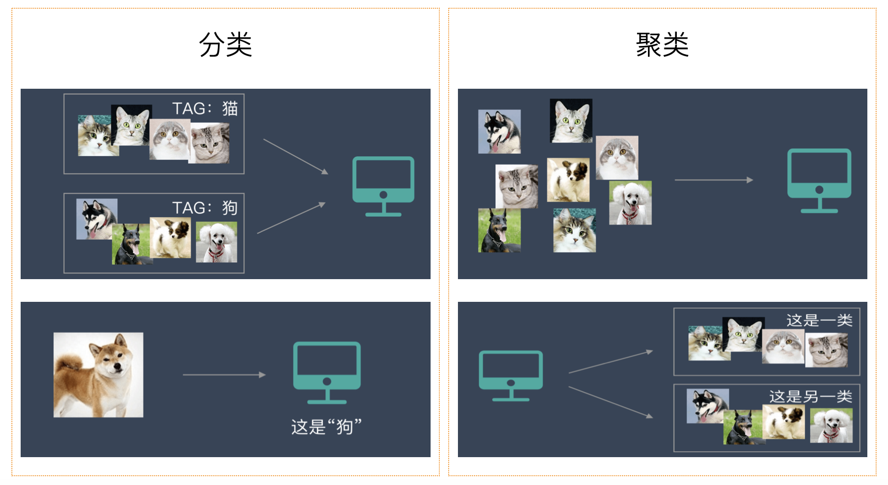
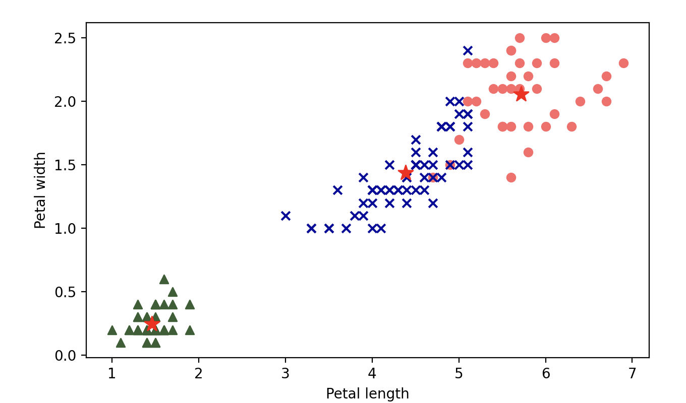
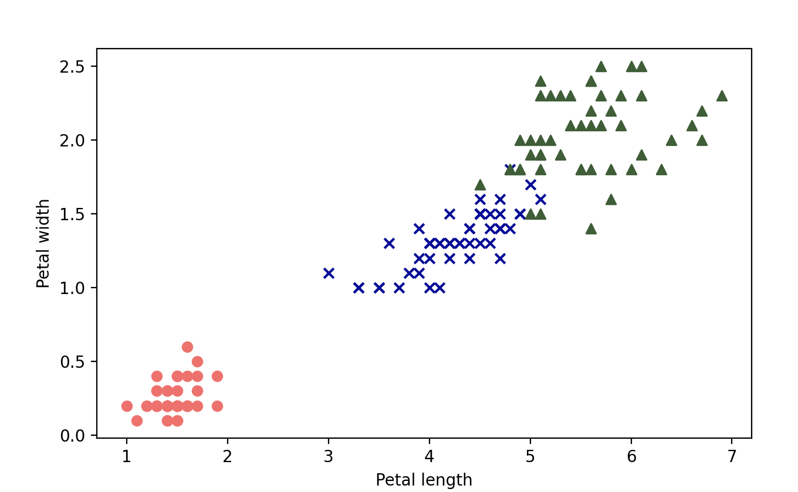
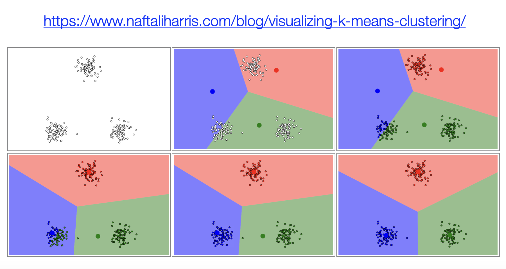

## K-Means Kümeleme Algoritması

> **Translated to Turkish by** himmetcanumutlu

Kümeleme (Clustering), veri madenciliği ve makine öğrenmesinde önemli bir tekniktir; bir veri kümesindeki örnekleri birbirine benzer birden çok gruba veya kategoriye ayırmak için kullanılır. Bu yöntem birçok alanda yaygın olarak kullanılmaktadır, örneğin:

- **E-ticaret sektörü**: Kullanıcı davranış verilerine göre tüketicileri farklı gruplara ayırır (yüksek harcama yapan kullanıcılar, yüksek aktiflik gösteren kullanıcılar, kayıp riski olan kullanıcılar, fiyata duyarlı kullanıcılar vb.) ve hedefli işletme stratejileri geliştirip daha isabetli reklam gösterimi sağlar; temsilci şirketler arasında Alibaba ve Amazon vb. yer alır.
- **Finans sektörü**: Büyük bankalar, kümeleme algoritmasıyla kullanıcıların kredi kayıtları, gelir düzeyleri, tüketim davranışları gibi verilerini analiz ederek kullanıcıları farklı risk gruplarına ayırır; yüksek riskli gruplar için daha sıkı kredi denetimi gerekirken, düşük riskli gruplar daha uygun kredi faizi veya kredi limiti avantajlarından yararlanabilir.
- **Sağlık sektörü**: Hastaların sağlık verilerini (hastalık geçmişi, gen verileri, yaşam alışkanlıkları vb.) analiz ederek hastaları farklı sağlık riski gruplarına ayırır; hastalık tahmininin doğruluğunu artırır ve hassas tıbbın gelişimini destekler; temsilci şirketler arasında Johnson & Johnson ve Pfizer vb. yer alır.
- **Sosyal medya**: Kullanıcıların arkadaşlık ilişkileri, ilgi alanları, sosyal etkileşimleri gibi verilerini analiz ederek kullanıcıları farklı sosyal çevrelere ayırır; arkadaş önerisi, kişiselleştirilmiş içerik ve platformdaki bilgi akışı öneri sisteminin optimizasyonu için kullanılır.

Kümeleme bir **denetimsiz öğrenme** yöntemidir; çünkü önceden tanımlanmış etiketlere ihtiyaç duymaz, yalnızca veri özelliklerine göre öğrenir, özellik benzerliğini veya uzaklığı ölçerek bilinen veri kümesini farklı kategorilere ayırır. Sınıflandırmadan farklı olarak kümeleme görevinin amacı, verinin içsel yapısını keşfetmektir. Kümeleme algoritmaları genel olarak şunlara ayrılabilir: **uzaklığa dayalı kümeleme**, **yoğunluğa dayalı kümeleme**, **hiyerarşik kümeleme**, **spektral kümeleme** vb. Kümeleme ile sınıflandırma arasındaki farkı hâlâ netleştiremediyseniz, aşağıdaki şeklin size yardımcı olacağına inanıyoruz.



### Algoritmanın Prensibi

Aşağıda ağırlıklı olarak K-Means adlı kümeleme algoritmasını tanıtacağız. K-Means, prototipe dayalı bir bölümleme kümeleme yöntemidir; amacı veri kümesini K kümeye ayırmak ve her kümedeki veri noktalarını mümkün olduğunca benzer hale getirmektir. K-Means algoritmasının uygulama adımları şöyledir:

1. **Küme merkezini başlatma**: Rastgele K örnek seçilir ve başlangıç küme merkezi olarak kullanılır; küme merkezine genellikle merkez (centroid) de denir.
2. **Örnekleri en yakın merkeze atama**: Her örneğin tüm merkezlere olan uzaklığı hesaplanır ve örnek en yakın kümeye atanır.
3. **Merkezi güncelleme**: Her kümedeki tüm örneklerin ortalaması hesaplanır ve yeni merkez olarak kullanılır.
4. **2. ve 3. adımları tekrarlama**, merkez yakınsayana veya önceden belirlenen yineleme sayısına ulaşana kadar.

### Matematiksel Açıklama

Yukarıdaki algoritma prensibini matematik diliyle açıklayalım. Verilen bir veri kümesi için K-Means algoritmasının amacı hedef fonksiyonu (toplam hata kareleri toplamı) minimize etmektir. Hedef fonksiyon şöyledir:

$$
J = \sum_{i=1}^{K} \sum_{x \in C_{i}} {\lVert x - \mu_{i} \rVert}^{2}
$$

Burada, $\small{K}$ küme sayısıdır; $\small{C_{i}}$ i. kümedeki örnek kümesini, $\small{\mu_{i}}$ i. kümenin merkezini, $\small{x}$ ise veri noktasını gösterir. Bu problem NP-zor bir kombinatoryal optimizasyon problemi olduğundan, gerçek çözümde tatmin edici bir çözüm bulmak için yinelemeli bir yaklaşım kullanırız.

Önce rastgele $\small{K}$ nokta başlangıç merkezi olarak seçilir: $\small{\mu_{1}, \mu_{2}, \cdots, \mu_{K}}$; her veri noktası $\small{x_{j}}$ için her merkeze olan uzaklık hesaplanır ve en yakın merkez seçilir, yani:

$$
C_{i} = \lbrace {x_{j} \ \vert \ {\lVert x_{j} - \mu_{i} \rVert}^{2} \le {\lVert x_{j} - \mu_{k} \rVert}^{2} \ \text{for all} \ k \ne i} \rbrace
$$

Merkez, kümedeki tüm noktaların ortalaması olacak şekilde güncellenir, yani:

$$
\mu_{i} = \frac{1}{\lvert C_{i} \rvert}\sum_{x \in C_{i}} x
$$

Yukarıdaki iki işlem, merkez artık değişmeyene veya değişim belirli bir eşiğin altına düşene kadar tekrarlanır; bu, algoritmanın yakınsamasını garanti eder.

### Kod Uygulaması

Aşağıda K-Means kümelemesini Python koduyla uygulayacağız; şimdilik scikit-learn kütüphanesini kullanmayıp, esas olarak algoritmanın çalışma prensibini anlamanıza yardımcı olacağız.

```python
import numpy as np


def distance(u, v, p=2):
    """İki vektör arasındaki uzaklığı hesaplar"""
    return np.sum(np.abs(u - v) ** p) ** (1 / p)


def init_centroids(X, k):
    """Rastgele k merkez seçer"""
    index = np.random.choice(np.arange(len(X)), k, replace=False)
    return X[index]


def closest_centroid(sample, centroids):
    """Örneğe en yakın merkezi bulur"""
    distances = [distance(sample, centroid) for i, centroid in enumerate(centroids)]
    return np.argmin(distances)


def build_clusters(X, centroids):
    """Veriyi merkezlere göre kümelere ayırır"""
    clusters = [[] for _ in range(len(centroids))]
    for i, sample in enumerate(X):
        centroid_index = closest_centroid(sample, centroids)
        clusters[centroid_index].append(i)
    return clusters


def update_centroids(X, clusters):
    """Merkezlerin konumunu günceller"""
    return np.array([np.mean(X[cluster], axis=0) for cluster in clusters])


def make_label(X, clusters):
    """Etiket üretir"""
    labels = np.zeros(len(X))
    for i, cluster in enumerate(clusters):
        for j in cluster:
            labels[j] = i
    return labels


def kmeans(X, *, k, max_iter=1000, tol=1e-4):
    """KMeans kümelemesi"""
    # Rastgele k merkez seç
    centroids = init_centroids(X, k)
    # Veriyi sürekli yineleyerek böl
    for _ in range(max_iter):
        # Veriyi merkezlere göre farklı kümelere ayır
        clusters = build_clusters(X, centroids)
        # Yeni merkezlerin konumunu yeniden hesapla
        new_centroids = update_centroids(X, clusters)
        # Merkez neredeyse hiç değişmediyse yinelemeyi erken sonlandır
        if np.allclose(new_centroids, centroids, rtol=tol):
            break
        # Yeni merkezlerin konumunu kaydet
        centroids = new_centroids
    # Veri için etiket üret
    return make_label(X, clusters), centroids
```

Yine Iris veri kümesini örnek alalım; kendi uyguladığımız `kmeans` fonksiyonunun üç iris türünü üç farklı kategoriye ayırıp ayıramadığını görelim. Denetimsiz öğrenme olduğu için burada tüm veri kümesini doğrudan `kmeans` fonksiyonuna veriyoruz; kod şöyledir:

```python
from sklearn.datasets import load_iris

iris = load_iris()
X, y = iris.data, iris.target
labels, centers = kmeans(X, k=3)
```

Burada sakın `y_pred` ile `y`'yi doğrudan karşılaştırmayın; daha önce de söylediğimiz gibi, kümeleme algoritması verinin karşılık geldiği etiketleri bilmez, yalnızca özelliklere göre veriyi farklı kategorilere ayırır. Burada üretilen `0`, `1`, `2` doğrudan dağ irisi, renkli iris ve Virginia irisine karşılık gelmez. Tahmin sonucunu görselleştirmeyle görebiliriz; kod şöyledir:

```python
import matplotlib.pyplot as plt

colors = ['#FF6969', '#050C9C', '#365E32']
markers = ['o', 'x', '^']

plt.figure(dpi=200)
for i in range(len(centers)):
    samples = X[labels == i]
    print(markers[i])
    plt.scatter(samples[:, 2], samples[:, 3], marker=markers[i], color=colors[i])
    plt.scatter(centers[i, 2], centers[i, 3], marker='*', color='r', s=120)

plt.xlabel('Petal length')
plt.ylabel('Petal width')
plt.show()
```

Çıktı:



Orijinal veriyi yeniden çıktı olarak verelim ve yukarıdaki şekille karşılaştıralım; kod şöyledir:

```python
import matplotlib.pyplot as plt

colors = ['#FF6969', '#050C9C', '#365E32']
markers = ['o', 'x', '^']

plt.figure(dpi=200)
for i in range(len(centers)):
    samples = X[y == i]
    plt.scatter(samples[:, 2], samples[:, 3], marker=markers[i], color=colors[i])

plt.xlabel('Petal length')
plt.ylabel('Petal width')
plt.show()
```

Çıktı:



K-Means kümelemesini doğrudan scikit-learn kütüphanesinin `cluster` modülündeki `KMeans` sınıfıyla uygulamak daha iyi bir seçimdir; kod şöyledir:

```python
from sklearn.cluster import KMeans

# KMeans nesnesi oluştur
km_cluster = KMeans(
    n_clusters=3,       # k değeri (küme sayısı)
    max_iter=30,        # Maksimum yineleme sayısı
    n_init=10,          # Başlangıç merkezi seçme deneme sayısı
    init='k-means++',   # Başlangıç merkezi seçme algoritması
    algorithm='elkan',  # Üçgen eşitsizliği optimizasyonunun kullanılıp kullanılmayacağı
    tol=1e-4,           # Merkez değişimi toleransı
    random_state=3      # Rastgele sayı tohumu
)
# Modeli eğit
km_cluster.fit(X)
print(km_cluster.labels_)           # Kümelerin etiketleri
print(km_cluster.cluster_centers_)  # Her merkezin konumu
print(km_cluster.inertia_)          # Örneklerin merkeze olan uzaklıklarının kareleri toplamı
```

Aşağıda `KMeans` sınıfının birkaç hiperparametresini açıklıyoruz:

1. `n_clusters`: Kümeleme için küme sayısını, yani $\small{K}$ değerini belirtir; varsayılan değeri `8`'dir.
2. `max_iter`: Maksimum yineleme sayısıdır; varsayılan değeri `300`'dür; her başlatmada K-Means yinelemesinin maksimum adım sayısını kontrol eder.
3. `init`: Merkez başlatma yöntemidir; varsayılan değeri `'k-means++'`dir; veriden birçok kez rastgele K merkez seçip, her seferinde seçilen merkez noktaları arasındaki uzaklığı hesaplayıp, uzaklığı en büyük olan grubu başlangıç merkez noktası olarak almak anlamına gelir; bu değeri kullanmanızı öneririz. `'random'` olarak ayarlanırsa başlangıç merkezleri rastgele seçilir.
4. `n_init`: Yukarıdaki parametreyle birlikte çalışır; algoritmanın çalıştırılacağı başlatma sayısını belirtir; varsayılan değeri `10`'dur.
5. `algorithm`: K-Means'in hesaplama algoritmasıdır; varsayılan değeri `'lloyd'`dur. Bir diğer seçenek `'elkan'`dır; üçgen eşitsizliğine dayalı bir optimizasyon algoritmasını ifade eder; K değerinin büyük olduğu durumlar için uygundur ve hesaplama verimliliği daha yüksektir.
6. `tol`: Tolerans değeridir; algoritmanın yakınsama hassasiyetini kontrol eder; varsayılan değeri `1e-4`'tür. Veri kümesi büyükse yakınsamayı hızlandırmak için bu değeri uygun şekilde artırabilirsiniz.

### Özet

K-Means klasik bir kümeleme algoritmasıdır; avantajları arasında uygulamasının basit olması ve algoritmanın hızlı yakınsaması yer alır; dezavantajı ise sonucun kararsız olması (başlangıç değeri ayarıyla ilişkili), örnek dengesizliği problemini çözememesi, yerel optimuma kolayca yakınsaması ve gürültü verisinden büyük ölçüde etkilenmesidir. Kümeleme sürecini görselleştirmeyle anlamak istiyorsanız, Naftali adlı birinin blogunu öneririz; bu sitede K-Means ve DBSCAN kümelemesini (yoğunluğa dayalı bir kümeleme algoritması) görsel olarak gösteren bir araç bulunur; aşağıdaki gibidir.




