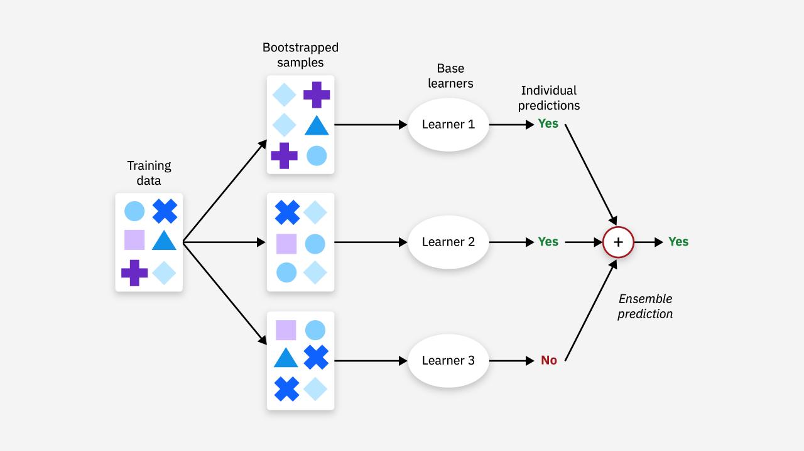
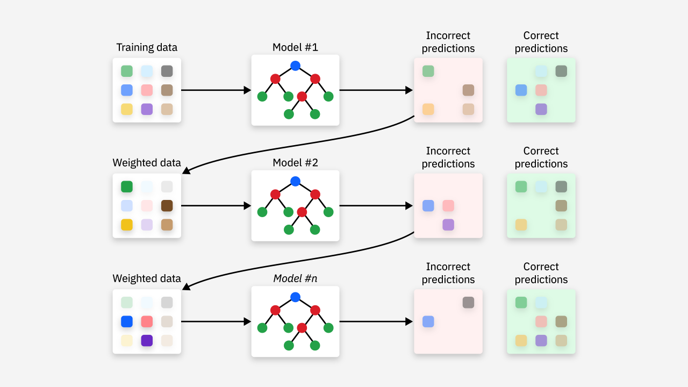
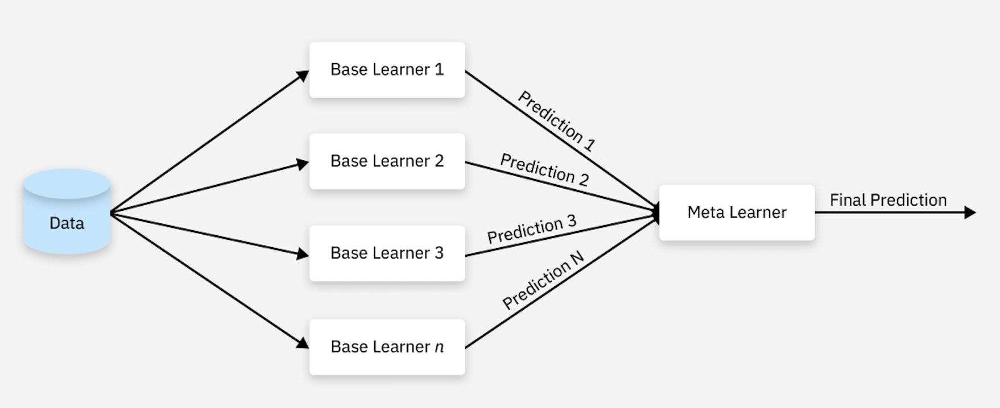
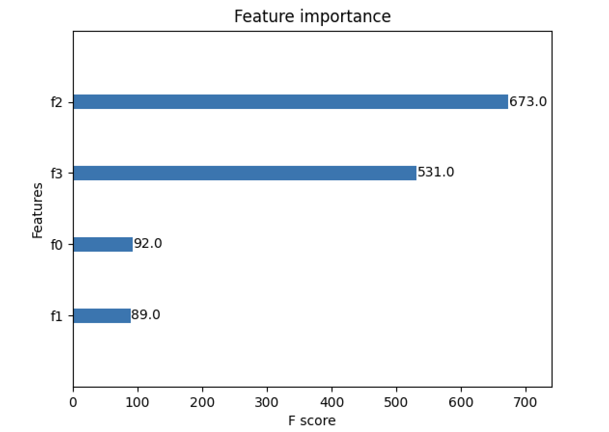

## Topluluk Öğrenmesi Algoritmaları

> **Translated to Turkish by** himmetcanumutlu

Önceki bölümlerde esas olarak makine öğrenmesindeki tek modelleri tanıtmıştık. Aslında, birden çok tek modeli birleştirerek kapsamlı bir model oluşturmak, modern makine öğrenmesi modellerinin benimsediği ana akım yöntem hâline gelmiştir; bu yönteme **topluluk öğrenmesi** (ensemble learning) denir. Topluluk öğrenmesinin amacı, birden çok zayıf öğrenicinin (sınıflandırma etkisi rastgele tahminden biraz daha iyi olan modeller; çok güçlü olursa aşırı uyuma kolayca yol açar) birleşimiyle güçlü bir öğrenici oluşturmaktır; böylece tek modelin olası sınırlamalarını aşar ve tek modele göre **daha iyi genelleştirme yeteneği** elde edilir; genellikle **yüksek hassasiyetli tahmin gerektiren senaryolarda** kullanılır.

### Algoritma Sınıflandırması

Topluluk öğrenmesi algoritmaları başlıca şu kategorilere ayrılır:

1. **Bagging**: Eğitim verisinden rastgele örnekleme yaparak birden çok veri alt kümesi oluşturur, bu alt kümeler üzerinde birden çok model eğitir ve sonuçlarını birleştirir. Bu topluluk öğrenmesinin prensibi aşağıdaki şekilde gösterilmiştir; en tipik örneği daha önce anlattığımız rastgele ormandır.

    

2. **Boosting**: Birden çok modeli yinelemeli olarak eğitir; her turda, bir önceki turda yanlış tahmin edilen örneklere odaklanır. Her yeni modelin eğitim amacı, bir önceki modelin eksikliklerini gidermektir. Bu topluluk öğrenmesinin prensibi aşağıdaki şekilde gösterilmiştir; klasik algoritmalar AdaBoost, Gradient Boosting ve XGBoost'tur.

    

    Boosting'in temel prensibi şudur: başlangıçta tüm örneklere aynı ağırlık verilir; ilk model eğitilirken yanlış sınıflandırılan örneklerin ağırlığı artırılır; bir sonraki model eğitilirken önceki modelin yanlış sınıflandırdığı örneklere odaklanılır; son olarak tüm modellerin sonuçları ağırlıklı olarak birleştirilir (iyi performans gösteren modeller daha yüksek ağırlık alır) ve nihai çıktı elde edilir. Kısaca Boosting, önceki zayıf sınıflandırıcıların yanlış sınıflandırdığı örneklerin sonraki turlarda daha fazla ilgi görmesini sağlayarak, bir dizi zayıf sınıflandırıcıyı seri olarak eğitip, sonunda bu sınıflandırıcıları en iyi güçlü sınıflandırıcıya dönüştürme sürecidir.

3. **Stacking**: Birden çok model eğitilir, tahmin sonuçları yeni özellikler olarak başka bir modele (genellikle "ikincil model" olarak adlandırılır) girdi olarak verilir ve nihai tahmin "ikincil model" ile yapılır; prensibi aşağıdaki gibidir.

    

### AdaBoost

AdaBoost (Adaptive Boosting), 1996 yılında Yoav Freund ve Robert Schapire tarafından önerilmiş klasik bir topluluk öğrenmesi algoritmasıdır; genellikle "uyarlanabilir artırma algoritması" olarak çevrilir. AdaBoost'un yaklaşımı oldukça sadedir: birincisi, **önceki turda zayıf sınıflandırıcının yanlış sınıflandırdığı örneklerin ağırlığını artırmak**; ikincisi, birden çok zayıf sınıflandırıcıyı doğrusal olarak birleştirip **sınıflandırma etkisi iyi olan zayıf sınıflandırıcıların ağırlığını artırmaktır**. Uyarlanabilirliği, örneklerin ağırlığını önceki modelin hatalarına göre ayarlamasında kendini gösterir.

AdaBoost algoritmasının eğitim süreci adım adım yinelemelidir; temel adımlar şöyledir:

1. **Örnek ağırlıklarını başlatma**: Her eğitim örneğine eşit bir başlangıç ağırlığı atanır. $\small{N}$ örnek için başlangıç ağırlığı şöyledir:

$$
w_{i}^{(1)} = \frac{1}{N}, \ i = 1, 2, \cdots, N
$$

Burada, $\small{w_{i}^{(1)}}$ i. örneğin ağırlığını gösterir; başlangıçta ağırlıklar eşittir.

2. **Zayıf öğreniciyi eğitme**: Her yineleme turunda AdaBoost, mevcut örnek ağırlıklarına göre bir zayıf sınıflandırıcı eğitir (örneğin karar ağacı kütüğü, yani derinliği 1 olan bir karar ağacı). Zayıf sınıflandırıcının amacı ağırlıklı hatayı minimize etmektir. t. turda eğitilen sınıflandırıcı modeli (zayıf öğrenici) $\small{h_t}$ için ağırlıklı hatası şöyle hesaplanır:

$$
\varepsilon_{t} = \sum_{i=1}^{N} w_{i}^{(t)} \cdot I(y_{i} \neq h_{t}(x_{i}))
$$

Burada, $\small{y_{i}}$ i. örneğin gerçek etiketidir; $\small{h_{t}(x_{i})}$ t. turdaki $\small{h_{t}}$ modelinin i. örnek $\small{x_{i}}$ için verdiği tahmin sonucudur (1 veya -1 değerini alır); $\small{I(y_{i} \neq h_{t}(x_{i}))}$ gösterge fonksiyonudur, $\small{x_{i}}$ örneği yanlış sınıflandırıldığında 1, aksi halde 0 değerini alır.

3. **Sınıflandırıcı ağırlığını güncelleme**: t. turdaki sınıflandırıcı modelinin ağırlığı $\small{\alpha_{t}}$ hesaplanır ve her örneğin ağırlığını güncellemek için kullanılır. Sınıflandırıcı ağırlığı $\small{\alpha_{t}}$ şu formülle hesaplanır:

$$
\alpha_{t} = \frac{1}{2} ln \left( \frac{1 - \varepsilon_{t}}{\varepsilon_{t}} \right)
$$

Sınıflandırıcının hatası düşük olduğunda $\small{\alpha_{t}}$ değeri büyük olur; bu, sınıflandırıcının ağırlığının büyük olduğunu gösterir.

4. **Örnek ağırlığını güncelleme**: Mevcut sınıflandırıcının performansına göre örnek ağırlıkları güncellenir. Yanlış sınıflandırılan örneklerin ağırlığı artar, doğru sınıflandırılan örneklerin ağırlığı azalır. Örnek ağırlığının güncelleme formülü şöyledir:

$$
w_{i}^{(t + 1)} = w_{i}^{(t)} \cdot e^{-\alpha_{t} y_{i} h_{t}(x_{i})}
$$

5. **Ağırlıkları normalize etme**: Tüm örneklerin ağırlıkları normalize edilir; böylece tüm örneklerin ağırlıkları toplamı 1 olur.

6. **Nihai sınıflandırıcı**: AdaBoost'un nihai sınıflandırıcısı, tüm zayıf öğrenicilerin ağırlıklı birleşimidir; tahmin sırasında ağırlıklı oylamayla nihai sınıf belirlenir:

$$
H(x) = \text{sign} \left( \sum_{t=1}^{T} \alpha_{t} h_{t}(x) \right)
$$

Burada, $\small{\text{sign}}$ işaret fonksiyonudur; tanımı şöyledir:

$$
\text{sign}(z) = \begin{cases} +1 \ (z \ge 0) \\\\ -1 \ (z \lt 0) \end{cases}
$$

Örneğin, 3 zayıf öğrenici $\small{h_{1}(x)}$, $\small{h_{2}(x)}$, $\small{h_{3}(x)}$ olsun; çıktıları sırasıyla `+1`, `-1` ve `+1`, karşılık gelen ağırlıkları ise $\small{\alpha_{1} = 0.5}$, $\small{\alpha_{2} = 0.3}$, $\small{\alpha_{3} = 0.2}$ olsun; o zaman ağırlıklı toplam şöyle olur:

$$
\sum_{t=1}^{3} \alpha_{t} h_{t}(x) = 0.5 \times 1 + 0.3 \times -1 + 0.2 \times 1 = 0.4
$$

Ağırlıklı toplam `0.4` pozitif olduğundan, işaret fonksiyonu `+1` üretir; bu da nihai tahmin edilen sınıfın pozitif sınıf olduğunu gösterir.

Yine Iris veri kümesini örnek alarak AdaBoost topluluk öğrenmesi algoritmasını kullanıp sınıflandırma modeli kuruyoruz; tam kod şöyledir:

```python
from sklearn.datasets import load_iris
from sklearn.model_selection import train_test_split
from sklearn.tree import DecisionTreeClassifier
from sklearn.ensemble import AdaBoostClassifier
from sklearn.metrics import classification_report

# Veri kümesinin yüklenmesi ve bölünmesi
iris = load_iris()
X, y = iris.data, iris.target
X_train, X_test, y_train, y_test = train_test_split(X, y, train_size=0.8, random_state=3)

# Zayıf sınıflandırıcıyı başlat (karar ağacı kütüğü)
base_estimator = DecisionTreeClassifier(max_depth=1)
# AdaBoost sınıflandırıcısını başlat
model = AdaBoostClassifier(base_estimator, n_estimators=50)
# Modeli eğit
model.fit(X_train, y_train)
# Tahmin sonuçları
y_pred = model.predict(X_test)

# Değerlendirme raporunu yazdır
print(classification_report(y_test, y_pred))
```

Çıktı:

```
              precision    recall  f1-score   support

           0       1.00      1.00      1.00        10
           1       0.90      0.90      0.90        10
           2       0.90      0.90      0.90        10

    accuracy                           0.93        30
   macro avg       0.93      0.93      0.93        30
weighted avg       0.93      0.93      0.93        30
```

Burada birkaç hiperparametre ayarına dikkat etmek gerekir:

1. `n_estimators`: Eğitilecek temel öğrenici (zayıf sınıflandırıcı) sayısını belirtir; varsayılan değeri 50'dir.
2. `learning_rate`: Her temel öğrenicinin nihai modeldeki katkısını, yani öğrenme oranını kontrol eder; varsayılan değeri 1.0'dır.
3. `algorithm`: AdaBoost'un eğitim algoritmasını belirler. AdaBoost'un başlıca iki eğitim modu vardır:
    - `'SAMME'`: Çok sınıflı sınıflandırma problemleri için kullanılan algoritmadır; toplamsal model kullanır.
    - `'SAMME.R'`: Real AdaBoost'a dayalı algoritmadır; ağırlıklı ikili ve çok sınıflı sınıflandırma problemleri için kullanılır; ağırlıklı bir yeniden örnekleme stratejisi kullanır.
4. `base_estimator`: Temel öğrenicidir; varsayılan değeri `None`'dur, yani temel öğrenici olarak `max_depth=1` olan `DecisionTreeClassifier` kullanılır. Dolayısıyla yukarıdaki kodda `AdaBoostClassifier` nesnesini oluşturan iki parametre de çıkarılabilir; çünkü ikisi de tam olarak varsayılan değerlerdir.

`n_estimators` değerini artırmak model performansını artırabilir ama aşırı uyuma yol açabilir; `learning_rate` değerini artırmak eğitimi hızlandırabilir ama modelin kararsız olmasına neden olabilir. Genellikle en iyi `n_estimators` ve `learning_rate` kombinasyonunu bulmak için çapraz doğrulama gerekir. Çoğu problem için `DecisionTreeClassifier(max_depth=1)` yaygın bir seçimdir; ancak veri daha karmaşıksa `SVC`, `LogisticRegression` gibi başka temel öğreniciler de düşünülebilir.

### GBDT

GBDT (Gradient Boosting Decision Trees) da güçlü bir topluluk öğrenmesi algoritmasıdır; AdaBoost'a kıyasla GBDT serisi modeller daha yaygın kullanılır. GBDT, **gradyan artırma** (Gradient Boosting) düşüncesine dayanır; karar ağacının avantajlarını birleştirir ve bir dizi zayıf sınıflandırıcıyla (karar ağacı) modeli adım adım iyileştirir; her eğitimde önceki modelin hatasını azaltarak (artığı uydurarak) modelin tahmin performansını artırır.

GBDT, kayıp fonksiyonunu minimize etmek için gradyan inişi yöntemini kullanır. Regresyon görevleri için kayıp fonksiyonu genellikle ortalama kare hatadır (MSE); sınıflandırma görevleri için yaygın kayıp fonksiyonu logaritmik kayıptır (Log Loss). Aşağıda ikili sınıflandırma görevini örnek alarak algoritmanın prensibini açıklıyoruz.

1. Kayıp fonksiyonu. Sınıflandırma görevlerinde genellikle logaritmik olabilirlik kayıp fonksiyonu kullanılır; ikili sınıflandırma problemi için kayıp fonksiyonu şöyledir:

$$
L(y, F(x)) = -y\log(p(x)) - (1 - y)\log(1 - p(x))
$$

Burada, $\small{y}$ gerçek etikettir ($\small{y \in \lbrace 0, 1 \rbrace}$, 0 veya 1 sınıfını gösterir); $\small{p(x)}$ ise modelin $\small{x}$ örneğinin 1 sınıfına ait olduğunu tahmin ettiği olasılıktır. GBDT gradyan artırma algoritmasına dayandığından, her güncelleme turunda bu kayıp fonksiyonunu gradyan inişi yöntemiyle optimize ederiz.

2. Gradyan hesabı. Gradyan artırmayı kullanmak için, kayıp fonksiyonunun mevcut model tahminine göre gradyanını hesaplamamız gerekir. Mevcut modelin çıktısını $\small{F(x)}$, yani tahmin fonksiyonu olarak alalım. Logaritmik kayıp fonksiyonuna göre $\small{p(x)}$, model çıktısı $\small{F(x)}$'ten dönüştürülen olasılıktır; genellikle Sigmoid fonksiyonu kullanılır:

$$
p(x) = \frac{1}{1 + e^{-F(x)}}
$$

Kayıp fonksiyonunun $\small{F(x)}$'e göre gradyanını hesapladığımızda şunu elde ederiz:

$$
\frac{\partial{L(y, F(x))}}{\partial{F(x)}} = p(x) - y
$$

Yani gradyan $\small{p(x) - y}$'dir; bu değer, mevcut model tahmini $\small{F(x)}$ ile gerçek etiket $\small{y}$ arasındaki farkı gösterir.

3. Model güncelleme. Her turun güncellemesi iki adımdan oluşur:

    - Artığı hesaplama: Her yineleme turunda mevcut modelin artığını, yani $\small{\delta_i = p(x_i) - y_i}$ değerini hesaplarız; bu her örneğin hatasını gösterir.
    - Artığı uydurma: Bu artıkları uydurmak için yeni bir temel öğrenici (genellikle karar ağacı) kullanılır. Sınıflandırma görevinde eğittiğimiz karar ağacı gerçek etiketi değil, artığı, yani mevcut modelin tahmin hatasını uydurur.

Güncelleme kuralı şöyledir:

$$
F_{m + 1}(x) = F_{m}(x) + \eta h_{m}(x)
$$

Burada, $\small{F_{m}(x)}$ m. turdaki modelin çıktısıdır; $\small{h_{m}(x)}$ m. turda eğitilen zayıf öğrenicidir (genellikle karar ağacı) ve mevcut modelin artığını tahmin eder; $\small{\eta}$ öğrenme oranıdır, her ağacın katkısını kontrol eder. Artıkları bu şekilde adım adım uydurarak, sonunda oluşan $\small{F(x)}$ modeli birden çok karar ağacından oluşan güçlü bir öğrenici olur.

Çok sınıflı sınıflandırma görevleri için kayıp fonksiyonunu ve gradyan hesabını buna uygun şekilde genişletmemiz gerekir. Yaygın çok sınıflı kayıp fonksiyonu polinom logaritmik kayıptır; her $\small{k}$ sınıfı için kayıp fonksiyonu şöyle ifade edilebilir:

$$
L(y, F(x)) = -\sum_{k=1}^{K} y_{k} \log(p_{k}(x))
$$

Burada, $\small{K}$ toplam sınıf sayısıdır; $\small{y_{k}}$ hedef sınıf $\small{k}$'nin gösterge fonksiyonudur; $\small{p_k(x)}$ ise $\small{x}$ örneğinin $\small{k}$ sınıfına ait olduğu tahmin edilen olasılıktır.

Yine Iris veri kümesini örnek alarak GBDT topluluk öğrenmesi algoritmasını kullanıp sınıflandırma modeli kuruyoruz; tam kod şöyledir:

```python
from sklearn.datasets import load_iris
from sklearn.model_selection import train_test_split
from sklearn.ensemble import GradientBoostingClassifier
from sklearn.metrics import classification_report

# Veri kümesinin yüklenmesi ve bölünmesi
iris = load_iris()
X, y = iris.data, iris.target
X_train, X_test, y_train, y_test = train_test_split(X, y, train_size=0.8, random_state=3)

# GBDT sınıflandırıcısını başlat
model = GradientBoostingClassifier(n_estimators=32)
# Modeli eğit
model.fit(X_train, y_train)
# Tahmin sonuçları
y_pred = model.predict(X_test)

# Değerlendirme raporunu yazdır
print(classification_report(y_test, y_pred))
```

Çıktı:

```
              precision    recall  f1-score   support

           0       1.00      1.00      1.00        10
           1       1.00      1.00      1.00        10
           2       1.00      1.00      1.00        10

    accuracy                           1.00        30
   macro avg       1.00      1.00      1.00        30
weighted avg       1.00      1.00      1.00        30
```

`GradientBoostingClassifier` sınıfının birkaç önemli hiperparametresini yine açıklayalım:

1. `loss`: Sınıflandırma görevi için kullanılacak kayıp fonksiyonunu belirtir; varsayılan değeri `deviance` olup logaritmik kayıp fonksiyonunun kullanıldığını gösterir. `exponential` da seçilebilir; bu, üstel kayıp fonksiyonunun (AdaBoost'un kayıp fonksiyonu) kullanıldığını gösterir.
2. `learning_rate`: Her ağacın nihai tahmin sonucu üzerindeki etki derecesini kontrol eder; varsayılan değeri 0.1'dir. Daha küçük öğrenme oranı genellikle daha iyi genelleştirme yeteneği getirir, ancak eğitim verisini uydurmak için daha fazla zayıf sınıflandırıcıya (yani daha fazla ağaca) ihtiyaç duyulur; öğrenme oranı çok büyük ayarlanırsa model eksik uyuma yol açabilir.
3. `n_estimators`: Eğitilecek temel öğrenici (genellikle karar ağacı) sayısını belirtir; varsayılan değeri 100'dür.
4. `subsample`: Her ağacın eğitiminde kullanılan veri oranını kontrol eder; varsayılan değeri 1.0'dır (yani tüm veri kullanılır). 1'den küçük bir değer ayarlayarak, her ağacı eğitirken rastgele bir kısım örnek seçilir; böylece modelin rastgeleliği artar ve aşırı uyum azalır. Genellikle 0.8 veya 0.9 iyi seçimlerdir.
5. `criterion`: Bölünme sırasında kullanılacak bölünme ölçütünü kontrol eder; varsayılan değeri `'friedman_mse'`dir. Bu parametre, her düğüm için en iyi bölünme biçiminin nasıl seçileceğini belirler; seçilebilir değerler şunlardır:
    - `'friedman_mse'`: Bu ölçüt, ortalama kare hataya (MSE) dayalı iyileştirilmiş bir sürümdür; dengesiz veriye duyarlılığı azaltmayı amaçlar ve bazı gerçek görevlerde geleneksel MSE'den daha iyi sonuçlar üretebilir.
    - `'mse'`: Her bölünme noktasının kalitesini değerlendirmek için geleneksel ortalama kare hatayı (MSE) kullanır; MSE ne kadar küçükse, mevcut düğümün bölünmesi o kadar iyidir. Sınıflandırma görevlerinde `'friedman_mse'` kullanmak genellikle daha iyi sonuç verir.
    - `'mae'`: Bölünme kalitesini değerlendirmek için ortalama mutlak hatayı (MAE) kullanır; MAE aykırı değerlere o kadar duyarlı değildir, ancak pratikte genellikle daha az kullanılır.
6. `validation_fraction`: Eğitim sürecinde erken durdurma (early stopping) uygulamak ve aşırı uyumu önlemek için kullanılan doğrulama kümesi oranını belirtir. Bu parametre `n_iter_no_change` ile birlikte kullanılabilir; doğrulama kümesinde performans değerlendirilir ve art arda birkaç tur iyileşme olmadığında eğitim erken durdurulur.

Yukarıda bahsedilen hiperparametrelerin yanı sıra karar ağacına benzer bazı hiperparametreler de vardır; bunlara burada ayrıca değinmeyeceğiz. Dikkat edilmesi gereken nokta, `n_estimators` (ağaç sayısı) artırıldığında aşırı uyumu önlemek için genellikle `learning_rate` değerinin azaltılması gerektiğidir; karar ağacının `max_depth` ve `min_samples_split` değerlerini ayarlamak da ağaç karmaşıklığını azaltarak aşırı uyumu önleyebilir; `subsample` ve `early_stopping` parametrelerini iyi kullanmak da benzer etki sağlayabilir. En iyi parametre kombinasyonunu bulmak için modelin eğitim hatası ve doğrulama hatasını birlikte ele alarak ızgara aramalı çapraz doğrulama yapmanızı öneririz.

### XGBoost

GBDT'ye algoritma hassasiyeti, hızı ve genelleştirme yeteneği gibi performans ölçütleri açısından bakıldığında hâlâ büyük bir iyileştirme alanı vardır. XGBoost (eXtreme Gradient Boosting), Chen Tianqi tarafından [《*XGBoost: A Scalable Tree Boosting System*》](https://arxiv.org/pdf/1603.02754) başlıklı makalesinde önerilen, GBDT'ye dayalı üst düzey bir gradyan artırma modelidir. GBDT'ye kıyasla, algoritma hassasiyeti açısından XGBoost kayıp fonksiyonunu ikinci türeve kadar açarak gradyan artırma ağacı modelinin gerçek kaybına daha fazla yaklaşmasını sağlar; algoritma hızı açısından ağırlıklı nicelik sketch ve seyrek farkındalıklı algoritma adlı iki teknik kullanır, önbellek optimizasyonu ve model paralelleştirme yoluyla algoritma hızını artırır; algoritma genelleştirme yeteneği açısından kayıp fonksiyonuna düzenlileştirme terimi ekleyerek, toplamsal modelde daralma oranı ve sütun örnekleme gibi yöntemlerle modelin aşırı uyumunu önler. Bu nedenlerden ötürü XGBoost gerek akademide gerek sanayide gerek yarışma çevrelerinde çok popülerdir ve geniş bir uygulama alanına sahiptir. XGBoost'un ayrıntıları için ilgilenen okuyucular Chen Tianqi'nin makalesini okuyabilir; burada ayrıntıya girmiyoruz.

XGBoost'u aşağıdaki şekilde kullanabiliriz; önce bağımlılığı kurun.

```bash
pip install xgboost
```

Aşağıdaki kod, XGBoost'un nasıl kullanılacağını göstermektedir.

```python
import matplotlib.pyplot as plt
import xgboost as xgb
from sklearn.datasets import load_iris
from sklearn.model_selection import train_test_split
from sklearn.metrics import classification_report

# Veri kümesinin yüklenmesi ve bölünmesi
iris = load_iris()
X, y = iris.data, iris.target
X_train, X_test, y_train, y_test = train_test_split(X, y, train_size=0.8, random_state=3)

# Veriyi DMatrix veri kümesi biçimine dönüştür
dm_train = xgb.DMatrix(X_train, y_train)
dm_test = xgb.DMatrix(X_test)

# Model parametrelerini ayarla
params = {
    'booster': 'gbtree',           # Eğitim için kullanılan temel öğrenici türü
    'objective': 'multi:softmax',  # Modelin kayıp fonksiyonunu belirtir
    'num_class': 3,                # Sınıf sayısı
    'gamma': 0.1,                  # Her bölünmedeki minimum kayıp fonksiyonu azalmasını kontrol eder
    'max_depth': 6,                # Karar ağacının maksimum derinliği
    'lambda': 2,                   # L2 düzenlileştirme ağırlığı
    'subsample': 0.8,              # Her ağacın eğitiminde rastgele seçilen örnek oranını kontrol eder
    'colsample_bytree': 0.8,       # Her ağaç veya her düğümün özellik seçme oranını kontrol eder
    'eta': 0.001,                  # Öğrenme oranı
    'seed': 10,                    # Rastgele sayı üretecinin tohumunu ayarlar
    'nthread': 16,                 # Eğitim sırasında paralel kullanılacak iş parçacığı sayısını belirtir
}

# Modeli eğit
model = xgb.train(params, dm_train, num_boost_round=200)
# Tahmin sonuçları
y_pred = model.predict(dm_test)

# Model değerlendirme raporunu yazdır
print(classification_report(y_test, y_pred))

# Özellik önem puanını çiz
xgb.plot_importance(model)
plt.grid(False)
plt.show()
```

Çıktı olarak alınan özellik önemi aşağıdaki şekilde gösterilmiştir.



XGBoost'un model parametrelerinden tekrar bahsedelim; önce yukarıdaki koddaki `param` sözlüğüne bakalım, ayrıntılı açıklanması gereken birkaç parametre vardır.

1. `booster`: Eğitim için kullanılacak temel öğrenici türünü belirtir; varsayılan değeri `'gbtree'` olup geleneksel karar ağacının temel öğrenici olarak kullanıldığını gösterir; diğer seçenekler arasında `'gblinear'` ve `'dart'` bulunur. Birincisi doğrusal regresyon veya lojistik regresyon kullanıldığını; ikincisi de karar ağacına dayalı ama ağaç atma mekanizması olan ve aşırı uyum riskini azaltan bir model kullanıldığını gösterir. Genellikle `'gbtree'` çoğu probleme, özellikle doğrusal olmayan ilişkilere uygundur; `'dart'` karmaşık veri kümeleri, özellikle aşırı uyum görüldüğünde uygundur. Veri kümesi küçükse veya doğrusal ilişki güçlüyse `'gblinear'` denenebilir.
2. `objective`: Modelin kayıp fonksiyonunu (optimizasyon hedefi) belirtir; yaygın seçenekler şunlardır:
    - `'reg:squarederror'`: Regresyon görevlerinde ortalama kare hata (MSE); regresyon görevleri için kullanılır.
    - `'reg:logistic'`: Regresyon görevlerinde lojistik regresyon; genellikle ikili sınıflandırma görevleri için kullanılır.
    - `'binary:logistic'`: İkili sınıflandırma görevlerinde lojistik regresyon; olasılık değeri üretir.
    - `'binary:logitraw'`: İkili sınıflandırma görevlerinde lojistik regresyon; Sigmoid işleminden geçmemiş ham değeri üretir.
    - `'multi:softmax'`: Çok sınıflı sınıflandırma görevi; her sınıf için en yüksek olasılığı üretir.
    - `'multi:softprob'`: Çok sınıflı sınıflandırma görevi; her sınıf için olasılık dağılımını üretir.
3. `eta`/`learning_rate`: XGBoost'taki öğrenme oranıdır; varsayılan değeri 0.3'tür; başlangıç değerinin 0.01 ile 0.1 arasında ayarlanması önerilir.
4. `alpha` ve `lambda`: Birincisi L1 düzenlileştirme teriminin (Lasso) gücünü kontrol eder, varsayılanı `0`; ikincisi L2 düzenlileştirme teriminin (Ridge) gücünü kontrol eder, varsayılanı `1`.
5. `scale_pos_weight`: Sınıf dengesizliği problemini, özellikle ikili sınıflandırma problemini ele almak için kullanılır. Sınıfların ciddi biçimde dengesiz olduğu durumlarda, bu parametreyi ayarlayarak azınlık sınıfının ağırlığını artırırsınız; böylece model azınlık sınıfı örneklerine daha fazla odaklanır; varsayılan değeri 1'dir.
6. `gamma`: Her bölünmedeki minimum kayıp fonksiyonu azalmasını kontrol eder; bu parametre ağacın büyümesini kontrol eder. Daha büyük `gamma`, ağacın daha küçük olmasını sağlar ve aşırı uyum riskini azaltır; varsayılan değeri 0'dır, yani model bölünme kısıtına tabi olmaz ve ağaç, düğümlerde yeterli örnek kalmayana kadar olabildiğince derinleşir.
7. `num_class`: Çok sınıflı sınıflandırma görevleri için kullanılan parametredir; sınıf sayısını gösterir. İkili sınıflandırma görevlerinde bu parametrenin ayarlanmasına gerek yoktur.
8. `colsample_bytree` / `colsample_bylevel` / `colsample_bynode`: Her ağaçta, her katmanda ve her düğümde örneklenen özellik oranını kontrol eder. Bu parametreler modelin karmaşıklığını kontrol etmek için kullanılır. Daha küçük değerler modelin rastgeleliğini artırarak aşırı uyumu önler; daha büyük değerler ise her ağacın daha fazla özellik kullandığı anlamına gelir ve aşırı uyuma yol açabilir.
    - `colsample_bytree`: Her ağacın kullandığı özellik oranı (varsayılan 1.0).
    - `colsample_bylevel`: Her katmanın kullandığı özellik oranı (varsayılan 1.0).
    - `colsample_bynode`: Her düğümün kullandığı özellik oranı (varsayılan 1.0).

`param` sözlüğünün sağladığı model parametrelerinin yanı sıra, `train` fonksiyonunun da dikkate değer birkaç parametresi vardır; bunlar da modelin hiperparametreleridir.

1. `num_boost_round`: Ağacın eğitim turu sayısıdır; daha küçük `learning_rate` ayarlayıp eğitim turu sayısını artırmak modelin kararlılığını artırabilir.
2. `early_stopping_rounds`: Erken durdurma mekanizmasını uygulamak için kullanılır. Belirtilen turdaki eğitimde, doğrulama kümesindeki kayıp fonksiyonu artık azalmadığında eğitim otomatik olarak durur ve aşırı uyum önlenir.
3. `feval`: Kullanıcı tanımlı değerlendirme fonksiyonunu ayarlar; bu yöntem, kullanıcının belirli bir göreve uygun herhangi bir değerlendirme ölçütünü esnek biçimde kullanmasına olanak tanır. Değerlendirme fonksiyonunun iki parametresi olduğuna dikkat edin: biri model tahmin değerini (NumPy'nin `ndarray` nesnesi), diğeri eğitim verisini (XGBoost'un `DMatrix` nesnesi) temsil eder; fonksiyon `(name, value)` ikili grubunu döndürür; burada `name` değerlendirme ölçütünün adı, `value` ise ölçütün değeridir.
4. `obj`: Kullanıcı tanımlı hedef fonksiyonunu ayarlar; hedef fonksiyonu her adımdaki gradyan ve ikinci türevi hesaplayarak modelin optimizasyon sürecine yön verir; ilgilenen okuyucular kendileri inceleyebilir.
5. `evals`: Bir veya daha fazla doğrulama kümesini belirtmek için kullanılır; değeri, her biri bir değerlendirme veri kümesini temsil eden bir veya daha fazla `(data, label)` demetinden oluşan bir listedir; veri kümesinin `DMatrix` nesnesi olması gerekir. Eğitim sürecinde XGBoost, her yineleme turundan sonra doğrulama kümesindeki performansı değerlendirir; genellikle eğitim sürecindeki aşırı uyumu izlemek veya hiperparametreleri ayarlamak için kullanılır.
6. `eval_results`: Eğitim sürecinde hesaplanan tüm değerlendirme sonuçlarını saklar; genellikle bir sözlük geçilir.
7. `verbose_eval`: Eğitim sürecinde değerlendirme sonuçlarının çıktı sıklığını kontrol eder; kaç turda bir değerlendirme sonucunun yazdırılacağını gösteren bir tamsayı olarak ayarlanabilir; `True` veya `False` olarak da ayarlanabilir; her turda yazdırılması veya hiç yazdırılmaması anlamına gelir.
8. `xgb_model`: Daha önce eğitilmiş bir modeli yüklemek için kullanılır; böylece kaldığınız noktadan eğitime devam edebilirsiniz. Bir `xgb_model` dosyası belirtebilir veya bir `Booster` nesnesi geçebilirsiniz.
9. `callbacks`: Eğitim sürecine özel geri çağırma fonksiyonları ekler; geri çağırma fonksiyonları her yineleme turunda otomatik durdurma, öğrenme oranını ayarlama gibi ek kontroller sağlayabilir.

### LightGBM

LightGBM (Light Gradient Boosting Machine), Microsoft'un 2017'de açık kaynak yaptığı üst düzey bir Boosting algoritma çerçevesidir; özünde yine GBDT algoritmasıdır, ancak özellikle yüksek verimlilik ve düşük bellek tüketimi gerektiren senaryolarda büyük ölçekli veri kümelerini işlemek üzere tasarlanmıştır. GBDT serisi algoritmaların performansı açısından XGBoost zaten çok verimlidir, ama kusursuz değildir. LightGBM, XGBoost'un kusurlarına yönelik iyileştirilmiş bir sürümdür; histogram algoritması (sürekli özellikleri kutulara ayırarak), tek taraflı gradyan örnekleme (GOSS; örnekleme yöntemiyle eğitim sürecinde gradyanı büyük olan örnekleri tutarak hesaplama miktarını azaltır), karşılıklı dışlayan özellik demetleme (EFB; bazı karşılıklı dışlayan özellikleri birleştirerek özellik uzayının boyutunu azaltır) ve leaf-wise büyüme stratejisi (ağacın derinliğini genişletmek için öncelikle mevcut yaprak düğümünü bölme) adlı dört yöntemle GBDT algoritma sistemini daha hafif ve daha verimli hale getirir; hem hızlı hem isabetli olabilir. Elbette daha küçük veri kümelerinde LightGBM'in avantajı belirgin değildir; ayrıca gerek XGBoost gerek LightGBM için modelin açıklanabilirliği bir sorundur ve hiperparametre ayarı da oldukça zordur.

Burada LightGBM'in ayrıntılarını açıklamak için daha fazla yer ayırmayacağız; ilgilenenler doğrudan LightGBM'in [resmî dokümantasyonuna](https://lightgbm.readthedocs.io/en/stable/index.html) bakabilir. LightGBM'in nasıl kullanılacağını kısaca hissettirmek için doğrudan koda geçiyoruz; önce yine aşağıdaki komutla kurulumu tamamlamanız gerekir.

```bash
pip install lightgbm
```

Modeli eğitmek için yine Iris veri kümesini kullanıyoruz; kod şöyledir:

```python
import lightgbm as lgb
import numpy as np
from sklearn.datasets import load_iris
from sklearn.model_selection import train_test_split
from sklearn.metrics import classification_report

# Veri kümesini yükle ve böl
iris = load_iris()
X, y = iris.data, iris.target
X_train, X_test, y_train, y_test = train_test_split(X, y, train_size=0.8, random_state=3)

# Veriyi LightGBM veri biçimine dönüştür
train_data = lgb.Dataset(X_train, label=y_train)
test_data = lgb.Dataset(X_test, label=y_test, reference=train_data)

# Model parametrelerini ayarla
params = {
    'objective': 'multiclass',   # Çok sınıflı sınıflandırma problemi
    'num_class': 3,              # Sınıf sayısı
    'metric': 'multi_logloss',   # Çok sınıflı logaritmik kayıp fonksiyonu
    'boosting_type': 'gbdt',     # Gradyan artırma ağacı algoritmasını kullan
    'num_leaves': 31,            # Yaprak düğüm sayısı
    'learning_rate': 0.05,       # Öğrenme oranı
    'feature_fraction': 0.75,    # Her eğitimde rastgele seçilen özellik oranı
    'early_stopping_rounds': 10  # Art arda kaç tur performans iyileşmezse yinelemeyi durdur
}
# Model eğitimi
model = lgb.train(params=params, train_set=train_data, num_boost_round=200, valid_sets=[test_data])
# Model tahmini
y_pred = model.predict(X_test, num_iteration=model.best_iteration)
# Tahmin sonucunu etikete dönüştür
y_pred_max = np.argmax(y_pred, axis=1)

# Model değerlendirme raporuna bak
print(classification_report(y_test, y_pred_max))
```

Burada yine modelin hiperparametrelerini kısaca açıklıyoruz; daha fazla ayrıntı için resmî dokümantasyona başvurabilirsiniz.

1. `objective`: Optimizasyon hedef fonksiyonunu (kayıp fonksiyonu) ayarlar; seçilebilir değerler:
    - `'regression'`: Regresyon görevi.
    - `'binary'`: İkili sınıflandırma görevi.
    - `'multiclass'`: Çok sınıflı sınıflandırma görevi.
    - `'multiclassova'`: Çok sınıflı sınıflandırma görevi; bire karşı hepsi stratejisini kullanır.
    - `'rank_xendcg'`, `'lambdarank'`: Sıralama görevi.
2. `metric`: Model performansını değerlendiren ölçüt; seçilebilir değerler:
    - `'l2'`, `'mean_squared_error'`: Regresyon görevlerinde ortalama kare hata.
    - `'binary_error'`: İkili sınıflandırma hata oranı.
    - `'multi_logloss'`: Çok sınıflı logaritmik kayıp.
    - `'auc'`: İkili sınıflandırma görevlerinde AUC.
    - `'precision'`, `'recall'`, `'f1'`: Kesinlik, duyarlılık, F1 skoru.
3. `boosting_type`: Artırma türünü ayarlar; seçilebilir değerler:
    - `'gbdt'`: Geleneksel gradyan artırma ağacı.
    - `'dart'`: Aşırı uyumu önlemek için rastgele ağaç atma mekanizmasına sahip karar ağacı.
    - `'goss'`: Tek taraflı gradyan örnekleme ile eğitimi hızlandırır.
    - `'rf'`: Rastgele orman.
4. `num_leaves`/`max_depth`: Karar ağacının yaprak düğüm sayısı / karar ağacının maksimum derinliği; ağacın karmaşıklığını kontrol eder.
5. `lambda_l1`/`lambda_l2`: L1 ve L2 düzenlileştirme parametreleri; modelin karmaşıklığını kontrol edip aşırı uyumu önlemek için kullanılır.
6. `max_bin`: Sürekli özellikleri bölmek (veri kutulama) için kullanılan maksimum kutu sayısıdır.
7. `feature_fraction`: Her eğitimde rastgele seçilen özellik oranıdır.
8. `early_stopping_rounds`: Değerlendirme ölçütünün art arda kaç tur yinelemede iyileşmemesi durumunda eğitimin erken durdurulacağını ayarlar.

### Özet

Topluluk öğrenmesi, birden çok modeli birleştirerek modelin sapma ve varyansını azaltır; genellikle tek modele göre daha iyi tahmin sonucu elde eder. Topluluk öğrenmesi genellikle birden çok temel modeli birleştirdiğinden, tek modelde oluşabilecek aşırı uyum problemini etkili biçimde azaltabilir; ayrıca anormal veri ve gürültü verisini de işleyebilir, tek modele göre daha kararlıdır. Elbette topluluk öğrenmesinin hesaplama maliyetinin yüksek olması, modelin açıklanabilirliğinin zayıf olması ve hiperparametre ayarının karmaşık olması gibi sorunları da vardır. XGBoost ve LightGBM'in yanı sıra, kategori özelliklerini işlemesiyle tanınan CatBoost adlı bir Boosting algoritması daha vardır; üçü de GBDT serisi algoritmaların en iyileridir. Şu anda "güç kullanarak mucize yaratma" anlayışındaki derin öğrenme revaçta olsa da, XGBoost, LightGBM ve CatBoost ile temsil edilen Boosting algoritmaları, yapılandırılmamış verinin (metin, konuşma, görüntü, video) modellenmesinde bile geniş bir uygulama alanına sahiptir.
