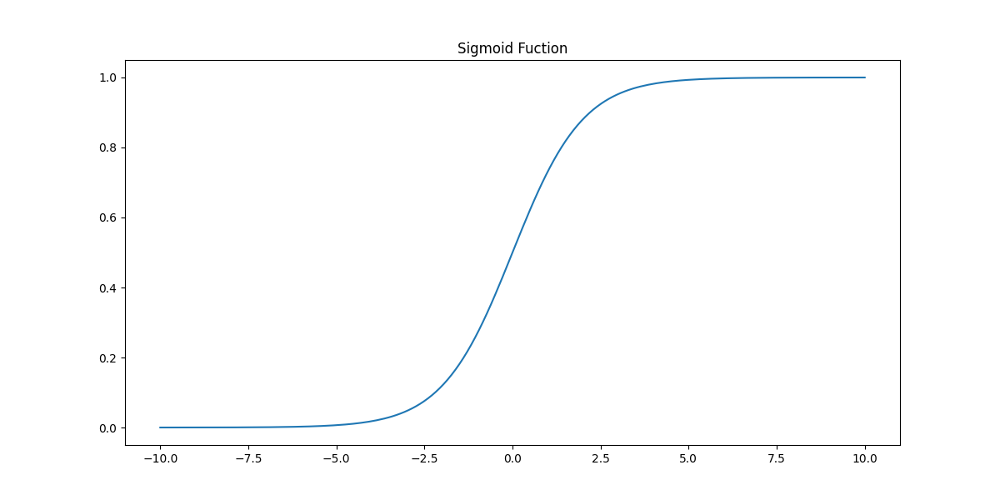

## Sinir Ağı Modelleri

> **Translated to Turkish by** himmetcanumutlu

İnsan beyninde nöron (neuron), bilgi iletimi ve işlenmesinden sorumlu birimdir; nöronlar kimyasal ve elektriksel sinyallerle haberleşir; bu, insanın hafıza, duyu, hareket gibi işlevlerinin temelidir. Nöron; akson (axon) ve dendrit (dendrite) içerir; dendrit sinyal almaktan, akson ise sinyal göndermekten sorumludur; ayrıca hücre gövdesi de nöronun önemli bir parçasıdır, bilgiyi bütünleştirme ve iletme görevi görür. Nöronlar arasındaki bağlantılar, kimyasal veya elektriksel sinyalleri ileten sinapslar (synapse) aracılığıyla kurulur; bir nöron binlerce hatta on binlerce nöronla bağlantı kurabilir ve karmaşık bir sinir ağı oluşturur. İnsan doğduğunda beyninde yaklaşık 86 milyar nöron bulunur; nöronların büyük çoğunluğu yenilenmediği için bu sayı yaşla birlikte hafifçe azalır. Yeni doğan bebeğin beyninde son derece fazla sayıda sinaps bağlantısı vardır; bu da gelecekteki öğrenme ve uyum sağlama için temel oluşturur.

Pek çok popüler bilim yazısı, sinir ağı modellerini insan beynindeki nöronları taklit eden hesaplama modelleri olarak tanıtır; çok katmanlı nöron bağlantılarıyla karmaşık doğrusal olmayan eşleme gerçekleştirildiği söylenir, ancak beynin öğrenme mekanizmasının sinir ağı modeli mekanizmasıyla aynı olduğuna dair bir kanıt yoktur. "Sinir ağı" terimi nörobiyolojiden gelse ve derin öğrenmedeki bazı kavramlar insanın beyne dair anlayışından esinlenerek oluşmuş olsa da, yeni başlayanlar için sinir ağı ile nörobiyoloji arasında bir bağ olduğunu düşünmek yalnızca daha fazla kafa karışıklığına yol açar.

### Temel Bileşenler

Sinir ağı genellikle birden çok katmandan oluşur; tipik olarak giriş katmanı, gizli katman ve çıktı katmanı içerir. Her katmandaki nöronlar bir önceki katmanın nöronlarına bağlanır; ağırlık ayarlaması ve aktivasyon fonksiyonunun etkisiyle veriyi katman katman iletip işler, sonunda karmaşık verinin özellik çıkarımını ve öğrenmesini tamamlar.

1. **Giriş katmanı**: Giriş katmanındaki nöronlar girdi verisini alır; her nöron genellikle bir girdi özelliğine karşılık gelir. Giriş katmanının görevi, girdi verisini bir sonraki katmanın nöronlarına iletmektir.
2. **Gizli katman**: Gizli katman ağın çekirdek kısmıdır; verinin özellik çıkarımından ve işlenmesinden sorumludur. Gizli katman bir veya birden çok katmandan oluşabilir; her katmanın nöronları ağırlık ve aktivasyon fonksiyonu aracılığıyla veriyi işler. Derin sinir ağları genellikle birden çok gizli katman içerir; böylece verideki yüksek dereceli özellikler çıkarılabilir.
3. **Çıktı katmanı**: Çıktı katmanı, gizli katmanın sonucunu nihai çıktıya dönüştürmekten sorumludur. Çıktı katmanının aktivasyon fonksiyonu genellikle problem türüyle ilişkilidir; örneğin ikili sınıflandırma görevinde olasılık elde etmek için Sigmoid fonksiyonu kullanılabilirken, regresyon görevinde doğrudan sayısal değer üretilebilir.
4. **Nöron**: Her nöron, önceki katmandaki nöronlardan girdi alır, ağırlıklı toplam yapar ve ardından aktivasyon fonksiyonuyla çıktıyı hesaplar.


Sinir ağının eğitim süreci genellikle geri yayılım algoritması (Backpropagation) ve gradyan inişi yöntemiyle ağırlıkları optimize ederek tahmin hatasını azaltır. Derin sinir ağı, çok katmanlı doğrusal olmayan dönüşüm sayesinde daha karmaşık özellik temsillerini öğrenebilir; bu nedenle birçok görevde üstün performans gösterir.

### Çalışma Prensibi

Önce en basit sinir ağı modelini tasarlayalım; yalnızca bir giriş katmanı ve bir çıktı katmanı olsun. Bu model, girdiye ($\small{X}$) göre çıktıyı ($\small{y}$) tahmin eder ve çıktı aşağıdaki formülü sağlar:

$$
y = aX_{1} + bX_{2} + cX_{3} + d
$$

Burada, $\small{a, b, c, d}$ modelin parametreleridir (ağırlıklar ve yanlılık); o hâlde sinir ağı modelimiz aşağıdaki şekildeki gibi bir yapıda olmalıdır.


Fark etmiş olabilirsiniz ki bu en basit sinir ağı modelinin doğrusal regresyondan hiçbir farkı yok; peki giriş ve çıktı katmanının arasına bir gizli katman daha eklersek ne olur? Aşağıdaki şekle bakın, artık biraz "ağ" görünümü kazanmadı mı? Eklenen gizli katman doğrusal olmayan ilişkileri işleyebilir; ayrıca gizli katman birden çok olabilir, katmanlar arası bağlantı tam bağlantılı veya kısmi bağlantılı olabilir, hatta halka yapılar da görülebilir. Yukarıda da söylediğimiz gibi, doğrusal olmama özelliğini devreye sokmak modelin daha karmaşık özellik temsillerini öğrenmesini sağlar; sinir ağı modelinin birçok görevde üstün performans göstermesinin nedeni de budur.


Şimdi sinir ağının çalışma prensibine bakalım. Her nöronun hesaplama süreci şöyle ifade edilebilir:

$$
y = f \left( \sum_{i=1}^{n}w_{i}x_{i} + b \right)
$$

Burada, $\small{x_{1}, x_{2}, \dots, x_{n}}$ girdi özellikleridir; $\small{w_1, w_2, \dots, w_n}$ girdiye karşılık gelen ağırlıklardır; $\small{b}$ yanlılık terimidir; $\small{f}$ aktivasyon fonksiyonudur, genellikle Sigmoid, ReLU, Tanh gibi doğrusal olmayan bir fonksiyondur. Aktivasyon fonksiyonu bir yandan doğrusal olmayan dönüşümü devreye sokarak sinir ağının ifade gücünü artırır ve onun istenildiği kadar karmaşık fonksiyon ilişkilerini taklit edebilmesini sağlar; diğer yandan, sinir ağını eğitirken ağırlıkları güncellemek için geri yayılım kullanılır; aktivasyon fonksiyonunun doğrusal olmama özelliği gradyanın daha etkili iletilmesini sağlar, sinir ağının daha hızlı yakınsamasına yardımcı olur ve eğitim verimliliğini artırır. Aşağıda yaygın aktivasyon fonksiyonlarını kısaca tanıtıyoruz.

1. Sigmoid fonksiyonu
  
$$
f(x) = \frac{1}{1 + e^{-x}}
$$


    
- **Özellik**: Sigmoid fonksiyonu, girdi değerini $\small{(0, 1)}$ aralığına eşler ve düzgün bir S biçimli eğri üretir.
- **Avantaj**: Özellikle olasılık tahmini için uygundur; çünkü çıktı $\small{(0, 1)}$ aralığındadır ve olasılık değeri olarak yorumlanabilir.
- **Dezavantaj**: Büyük pozitif veya negatif değerlerde gradyan çok küçülür ve gradyan kaybolması sorununa yol açarak derin ağların eğitimini etkiler. Ayrıca çıktı sıfır merkezli olmadığı için gradyan güncellemesi asimetrik olur ve yakınsama yavaşlayabilir.

2. Tanh fonksiyonu (hiperbolik tanjant fonksiyonu)

$$
f(x) = tanh(x) = \frac{e^{x} - e^{-x}}{e^{x} + e^{-x}}
$$


    
- **Özellik**: Tanh fonksiyonu girdiyi $\small{(-1, 1)}$ aralığına eşler; o da S biçimli bir eğridir, ancak merkeze göre simetriktir.
- **Avantaj**: Sigmoid'e benzer, ancak çıktı $\small{(-1, 1)}$ aralığındadır; bu sıfır merkezli çıktı, gradyan güncellemesini daha simetrik hale getirir ve derin ağlar için daha uygundur.
- **Dezavantaj**: Uç değerlerin yakınında gradyan yine sıfıra yaklaşır ve gradyan kaybolması sorununa yol açar.

3. ReLU fonksiyonu (Rectified Linear Unit)

$$
f(x) = max(0, x)
$$

- **Özellik**: ReLU, girdinin sıfırdan küçük kısmını sıfır yapar, sıfırdan büyük kısmını değiştirmeden bırakır; bu nedenle çıktı aralığı $\small{[0, +\infty]}$ olur.
- **Avantaj**: Hesaplaması basittir, gradyan kaybolması sorununu etkili biçimde önler; bu nedenle derin ağlarda yaygın olarak kullanılır. Seyrekliği koruyabilir; birçok nöronun çıktısı sıfır olur, bu da ağın hesaplamasını basitleştirmeye yardımcı olur.
- **Dezavantaj**: Girdi negatif olduğunda ReLU'nun gradyanı sıfırdır. Girdi uzun süre negatif kalırsa nöron "ölüp" güncellenmeyi durdurabilir.

4. Leaky ReLU fonksiyonu

$$
f(x) = \begin{cases} x & (x \gt 0) \\\\ {\alpha}x & (x \le 0)\end{cases}
$$

- **Özellik**: Leaky ReLU, ReLU'nun iyileştirilmiş halidir; sıfırdan küçük kısım için küçük bir negatif eğim (genellikle $\small{\alpha = 0.01}$) ekler, böylece gradyan sıfır olmaz.
- **Avantaj**: Negatif değerlerin çıktısına izin vererek ölü nöron sorununu önler ve ağı daha sağlam hale getirir.
- **Dezavantaj**: Leaky ReLU ölü nöron sorununu hafifletse de, negatif eğim seçiminin ağ performansı üzerinde bir miktar etkisi olabilir; ayrıca modelin doğrusal olmayan temsil yeteneğini belirgin biçimde artırmaz.

Birden çok katman içeren bir sinir ağında bilgi katman katman iletilir. l. katmanın çıktısının $\small{\mathbf{a}^{[l]}}$ olduğunu varsayalım; yukarıdaki nöron hesaplama formülüne göre:

$$
\mathbf{a}^{[l]} = f \left( \mathbf{W}^{[l]} \mathbf{a}^{[l-1]} + \mathbf{b}^{[l]} \right)
$$

Burada, $\small{\mathbf{W}^{[l]}}$ l. katmanın ağırlık matrisidir; $\small{\mathbf{a}^{[l-1]}}$ l-1. katmanın çıktısıdır; $\small{\mathbf{b}^{[l]}}$ l. katmanın yanlılık terimidir; $\small{f}$ ise aktivasyon fonksiyonudur. Sinir ağının nihai çıktısı son katmanın aktivasyon fonksiyonuyla elde edilir; bu sürece ileri yayılım (forward-propagation) denir.

Sinir ağı modeli için son derece önemli bir diğer işlem de, kayıp fonksiyonunun her ağırlık ve yanlılığa göre gradyanını hesaplayarak sinir ağının parametrelerini (ağırlıklar ve yanlılık) güncellemektir; bu süreç genellikle geri yayılım (back-propagation) olarak adlandırılır. Geri yayılımın iki önemli noktası vardır: biri kayıp fonksiyonu, diğeri gradyan inişi yöntemidir. Birincisi tahmin değeri ile gerçek değer arasındaki farkı ölçer; yaygın kayıp fonksiyonları ortalama kare hata (regresyon görevi) ve çapraz entropi kayıp fonksiyonudur (sınıflandırma görevi). İkincisi ise $\small{\theta}$ (ağırlıklar ve yanlılık) parametresini güncelleyerek kayıp fonksiyonunu minimize eder, yani:

$$
\theta^{\prime} = \theta - \eta \nabla L(\theta) \\\\
\theta = \theta^{\prime}
$$

Burada, $\small{\eta}$ öğrenme oranıdır; $\small{\nabla L(\theta)}$ kayıp fonksiyonunun parametrelere göre gradyanıdır; regresyon modelini anlatırken kullandığımız yöntemle aynıdır.

### Kod Uygulaması

Yukarıda anlatılan sinir ağı modeli prensibine göre, basit bir sinir ağı modelini kendiniz yazmak da zor değildir. Elbette scikit-learn kütüphanesinin `neural_network` modülünü kullanarak da sinir ağı modeli kurabiliriz. Aşağıda, yine Iris veri kümesini örnek alarak sinir ağı modelinin kurulumunu ve tahmin etkisini gösteriyoruz.

```python
from sklearn.datasets import load_iris
from sklearn.model_selection import train_test_split
from sklearn.neural_network import MLPClassifier
from sklearn.metrics import classification_report

# Veri kümesini yükle ve böl
iris = load_iris()
X, y = iris.data, iris.target
X_train, X_test, y_train, y_test = train_test_split(X, y, train_size=0.8, random_state=3)

# Çok katmanlı algılayıcı sınıflandırıcı modelini oluştur
model = MLPClassifier(
    solver='lbfgs',            # Model parametrelerini optimize eden çözücü
    learning_rate='adaptive',  # Öğrenme oranının ayarlanma biçimi uyarlanabilir
    activation='relu',         # Gizli katmandaki nöronların aktivasyon fonksiyonu
    hidden_layer_sizes=(1, )   # Her katmandaki nöron sayısı
)
# Eğit ve tahmin et
model.fit(X_train, y_train)
y_pred = model.predict(X_test)

# Model değerlendirme raporuna bak
print(classification_report(y_test, y_pred))
```

Çıktı:

```
              precision    recall  f1-score   support

           0       1.00      0.10      0.18        10
           1       0.00      0.00      0.00        10
           2       0.34      1.00      0.51        10

    accuracy                           0.37        30
   macro avg       0.45      0.37      0.23        30
weighted avg       0.45      0.37      0.23        30
```

> **Not**: `MLPClassifier` oluşturulurken `random_state` parametresi belirtilmediği için kodun her çalıştırılışında sonuç farklı olabilir.

Modelin tahmin doğruluğu yalnızca `0.37`; bu sonuç karşısında çok hayal kırıklığına uğramış olabilirsiniz; özenle kurduğumuz modelin tahmin etkisi bu kadar kötü oldu. Endişelenmeyin; yukarıdaki kodda sinir ağı modelini oluştururken `hidden_layer_sizes` parametresini `(1, )` olarak ayarladık; bu, ağımızın yalnızca 1 gizli katmanı olduğunu ve gizli katmanda yalnızca 1 nöron bulunduğunu gösterir; bu nöron çok fazla yük altında kaldı. Şimdi, modelin özellikler ile hedef arasındaki eşleme ilişkisini daha iyi öğrenebilmesi için gizli katman ve nöron sayısını artırmamız gerekiyor; böylece tahmin etkisi de iyileşir. Aşağıda `hidden_layer_sizes` parametresini `(32, 32, 32)` olarak, yani modelin üç gizli katmanı ve her katmanda 32 nöronu olacak şekilde ayarlayıp kodun sonucuna tekrar bakalım.

```python
from sklearn.datasets import load_iris
from sklearn.model_selection import train_test_split
from sklearn.neural_network import MLPClassifier
from sklearn.metrics import classification_report

# Veri kümesini yükle ve böl
iris = load_iris()
X, y = iris.data, iris.target
X_train, X_test, y_train, y_test = train_test_split(X, y, train_size=0.8, random_state=3)

# Çok katmanlı algılayıcı sınıflandırıcı modelini oluştur
model = MLPClassifier(
    solver='lbfgs',                  # Model parametrelerini optimize eden çözücü
    learning_rate='adaptive',        # Öğrenme oranının ayarlanma biçimi uyarlanabilir
    activation='relu',               # Gizli katmandaki nöronların aktivasyon fonksiyonu
    hidden_layer_sizes=(32, 32, 32)  # Her katmandaki nöron sayısı
)
# Eğit ve tahmin et
model.fit(X_train, y_train)
y_pred = model.predict(X_test)

# Model değerlendirme raporuna bak
print(classification_report(y_test, y_pred))
```

> **Açıklama**: Yukarıdaki kodu çalıştırıp daha iyi bir sonuç alıp almadığınızı görebilirsiniz. Elbette model doğruluğunun 1 olması da her zaman sevinilecek bir durum değildir; çünkü aşırı uyum gösteren bir model eğitmiş olabilirsiniz. Her durumda `hidden_layer_sizes` parametresini yeniden ayarlayıp nasıl sonuçlar alacağınızı deneyebilirsiniz.

Aşağıda yine `MLPClassifier` sınıfının birkaç önemli hiperparametresini açıklıyoruz.

1. `hidden_layer_sizes`: Sinir ağındaki her katmanın nöron sayısını belirtir; demet türündedir; varsayılan değeri `(100, )` olup yalnızca bir gizli katman olduğunu ve bu katmanda 100 nöron bulunduğunu gösterir. Bu hiperparametre ağın yapısını ve kapasitesini değiştirebilir; katman sayısı ve nöron sayısı ne kadar fazlaysa modelin temsil yeteneği o kadar güçlüdür, ancak aşırı uyum riski de vardır.
2. `activation`: Gizli katmandaki nöronların aktivasyon fonksiyonudur; varsayılan değeri `relu` olup ReLU aktivasyon fonksiyonunun kullanıldığını gösterir. Aktivasyon fonksiyonu, ağın her katmanının çıktı biçimini belirler; genellikle `'relu'` derin ağ eğitiminde ilk tercihtir; çünkü gradyan kaybolması sorununu hafifletir ve eğitim hızı yüksektir; seçilebilir değerler şunlardır:
    - `'identity'`: Doğrusal aktivasyon fonksiyonu, yani $\small{f(x) = x}$; genellikle önerilmez.
    - `'logistic'` / `'tanh'` / `'relu'`: Sigmoid / hiperbolik tanjant / ReLU aktivasyon fonksiyonları.
3. `solver`: Model parametrelerini optimize etmek için kullanılan çözücüdür (optimizasyon algoritması). Yaygın optimizasyon algoritmaları şunlardır:
    - `'lbfgs'`: Yarı-Newton yöntemi (Limited-memory Broyden-Fletcher-Goldfarb-Shanno); hesaplama karmaşıklığı yüksektir, ancak küçük veri kümelerinde iyi performans gösterir.
    - `'sgd'`: Stokastik gradyan inişi (Stochastic Gradient Descent); büyük ölçekli veri kümeleri için uygundur; eğitim sırasında rastgele küçük parti verilerle güncelleme yapar.
    - `'adam'`: Uyarlanabilir moment tahmini (Adaptive Moment Estimation); varsayılan değerdir; çoğu durum için uygundur ve hesaplama verimliliği yüksektir.
4. `alpha`: L2 düzenlileştirme terimidir (ayrıca ağırlık azalması olarak da adlandırılır); sinir ağının karmaşıklığını kontrol eder; varsayılan değeri `0.0001`'dir.
5. `batch_size`: Her yinelemede kullanılan örnek parti boyutudur; varsayılan değeri `'auto'` olup örnek sayısına göre parti boyutu otomatik belirlenir. Daha küçük parti, eğitimi daha kararsız hale getirir ama yerel optimuma takılmayı önlemeye yardımcı olur; daha büyük parti eğitimi hızlandırır ama bellek yetersizliğine yol açabilir.
6. `learning_rate`: Öğrenme oranının ayarlanma biçimidir; modelin her yinelemede ağırlığı ayarlarken kullandığı adım büyüklüğünü etkiler; varsayılan değeri `'constant'` olup öğrenme oranının sabit kaldığını gösterir. Diğer seçilebilir değerler `'invscaling'` ve `'adaptive'`dir; birincisi öğrenme oranının yineleme sayısı arttıkça giderek azaldığını, ikincisi öğrenme oranının mevcut gradyana göre otomatik ayarlandığını gösterir; gradyan güncellemesi küçükken öğrenme oranı artar, gradyan büyükken öğrenme oranı azalır.
7. `learning_rate_init`: Başlangıç öğrenme oranıdır; varsayılan değeri `0.001`'dir.
8. `max_iter`: Maksimum yineleme sayısıdır; eğitim sürecinde optimizasyon algoritmasının maksimum yineleme sayısını kontrol eder; varsayılan değeri `200`'dür. Maksimum yineleme sayısına ulaşıldığında model hâlâ yakınsamamışsa eğitim durur. Bu, çok uzun eğitimi önlemek için yararlıdır; ancak çok küçük değer eğitimin çok erken durmasına ve eksik uyuma yol açabilir.
9. `tol`: Eğitim sürecindeki optimizasyon toleransıdır; hedef fonksiyondaki değişim bu değerden küçük olduğunda eğitimin duracağını belirler; varsayılan değeri `0.0001`'dir. Daha küçük `tol` daha uzun eğitim süresine yol açar; daha büyük `tol` eğitimin erken durmasına neden olabilir.

scikit-learn kütüphanesinin yanı sıra, sinir ağı modellerini uygulamak için TensorFlow, PyTorch, MXNet gibi üçüncü taraf kütüphaneleri de kullanabiliriz. Bu kütüphanelerin çoğu GPU (grafik işlem birimi) veya TPU (tensör işlem birimi) hızlandırmayı destekler; ayrıca birçok derin ağ modelini (evrişimli sinir ağı, yinelemeli sinir ağı, üretici çekişmeli ağ gibi) ve ilgili optimize edicileri yerleşik olarak barındırır; scikit-learn'e kıyasla bunlar daha iyi seçimler olabilir. Bununla ilgilenenler aşağıdaki koda bakabilir; PyTorch kullanarak Iris sınıflandırma problemini çözen bir sinir ağı modeli kurduk.

```python
import torch
import torch.nn as nn
import torch.optim as optim
from sklearn import datasets
from sklearn.model_selection import train_test_split
from sklearn.preprocessing import StandardScaler
from sklearn.metrics import accuracy_score, classification_report

# Iris veri kümesini yükle
iris = datasets.load_iris()
X, y = iris.data, iris.target

# Veri ön işleme (standartlaştırma)
scaler = StandardScaler()
X_scaled = scaler.fit_transform(X)

# Eğitim ve test kümesini böl
X_train, X_test, y_train, y_test = train_test_split(X_scaled, y, train_size=0.8, random_state=3)
# Dizileri PyTorch tensörlerine dönüştür
X_train_tensor, X_test_tensor, y_train_tensor, y_test_tensor = (
    torch.tensor(X_train, dtype=torch.float32),
    torch.tensor(X_test, dtype=torch.float32),
    torch.tensor(y_train, dtype=torch.long),
    torch.tensor(y_test, dtype=torch.long)
)


class IrisNN(nn.Module):
    """Iris sinir ağı modeli"""

    def __init__(self):
        """Başlatma yöntemi"""
        # Üst sınıf kurucusunu çağır
        super(IrisNN, self).__init__()
        # Giriş katmanından gizli katmana (4 özellikten 32 nörona tam bağlantı)
        self.fc1 = nn.Linear(4, 32)
        # Gizli katmandan çıktı katmanına (32 nörondan 3 çıktıya tam bağlantı)
        self.fc2 = nn.Linear(32, 3)

    def forward(self, x):
        """İleri yayılım"""
        # Gizli katmanda ReLU aktivasyon fonksiyonunu kullan
        x = torch.relu(self.fc1(x))
        x = self.fc2(x)
        return x


# Model örneğini oluştur
model = IrisNN()
# Kayıp fonksiyonunu tanımla (çapraz entropi kayıp fonksiyonu)
loss_function = nn.CrossEntropyLoss()
# Adam optimize edicisini kullan (çoğu görevde iyi performans gösterir)
optimizer = optim.Adam(model.parameters(), lr=0.001)

# Modeli eğit (256 tur yinele)
for _ in range(256):
    model.train()
    # Önceki gradyanı temizle
    optimizer.zero_grad()
    # Çıktıyı hesapla
    output = model(X_train_tensor)
    # Kaybı hesapla
    loss = loss_function(output, y_train_tensor)
    # Geri yayılım
    loss.backward()
    # Ağırlıkları güncelle
    optimizer.step()

# Modeli değerlendir
model.eval()
with torch.no_grad():
    output = model(X_test_tensor)
    # Tahmin skorunun en büyük olduğu indisi al (tahmin etiketi)
    _, y_pred_tensor = torch.max(output, 1)
    # Tahmin doğruluğunu hesapla ve yazdır
    print(f'Accuracy: {accuracy_score(y_test_tensor, y_pred_tensor):.2%}')
    # Sınıflandırma modeli değerlendirme raporunu yazdır
    print(classification_report(y_test_tensor, y_pred_tensor))
```

> **Açıklama**: PyTorch kütüphanesini henüz kurmadıysanız `pip install torch` komutuyla kurabilirsiniz.

Sinir ağı modelini regresyon görevlerini işlemek için de kullanabiliriz; burada yine regresyon modelini anlatırken kullandığımız "Araba MPG veri kümesi"ni örnek alarak sinir ağı modeliyle regresyon görevinin nasıl çözüleceğini gösteriyoruz; tam kod şöyledir:

```python
import ssl

import pandas as pd
import torch
import torch.nn as nn
import torch.optim as optim
from sklearn.metrics import mean_squared_error, r2_score
from sklearn.model_selection import train_test_split
from sklearn.preprocessing import StandardScaler

ssl._create_default_https_context = ssl._create_unverified_context


def load_prep_data():
    """Veriyi yükle ve hazırla"""
    df = pd.read_csv('https://archive.ics.uci.edu/static/public/9/data.csv')
    # Özellikleri temizle
    df.drop(columns=['car_name'], inplace=True)
    df.dropna(inplace=True)
    df['origin'] = df['origin'].astype('category')
    df = pd.get_dummies(df, columns=['origin'], drop_first=True).astype('f8')
    # Özellikleri ölçekle
    scaler = StandardScaler()
    return scaler.fit_transform(df.drop(columns='mpg').values), df['mpg'].values


class MLPRegressor(nn.Module):
    """Sinir ağı modeli"""

    def __init__(self, n):
        super(MLPRegressor, self).__init__()
        self.fc1 = nn.Linear(n, 64)
        self.fc2 = nn.Linear(64, 64)
        self.fc3 = nn.Linear(64, 1)

    def forward(self, x):
        x = torch.relu(self.fc1(x))
        x = torch.relu(self.fc2(x))
        x = self.fc3(x)
        return x


def main():
    # Veri kümesini yükle ve hazırla
    X, y = load_prep_data()
    # Eğitim ve test kümesini böl
    X_train, X_test, y_train, y_test = train_test_split(X, y, train_size=0.8, random_state=3)
    # Veriyi PyTorch Tensor'una dönüştür
    X_train_tensor, X_test_tensor, y_train_tensor, y_test_tensor = (
        torch.tensor(X_train, dtype=torch.float32),
        torch.tensor(X_test, dtype=torch.float32),
        torch.tensor(y_train, dtype=torch.float32).view(-1, 1),
        torch.tensor(y_test, dtype=torch.float32).view(-1, 1)
    )

    # Sinir ağı modelini örnekle
    model = MLPRegressor(X_train.shape[1])
    # Kayıp fonksiyonunu belirt (ortalama kare hata)
    criterion = nn.MSELoss()
    # Optimize ediciyi belirt (Adam optimize edici)
    optimizer = optim.Adam(model.parameters(), lr=0.001)

    # Model eğitimi
    epochs = 256
    for epoch in range(epochs):
        # İleri yayılım
        y_pred_tensor = model(X_train_tensor)
        loss = criterion(y_pred_tensor, y_train_tensor)
        # Geri yayılım
        optimizer.zero_grad()
        loss.backward()
        optimizer.step()

        if (epoch + 1) % 16 == 0:
            print(f'Epoch [{epoch + 1} / {epochs}], Loss: {loss.item():.4f}')

    # Model değerlendirmesi
    model.eval()
    with torch.no_grad():
        y_pred = model(X_test_tensor)
        test_loss = mean_squared_error(y_test, y_pred.numpy())
        r2 = r2_score(y_test, y_pred.numpy())
    print(f'Test MSE: {test_loss:.4f}')
    print(f'Test R2: {r2:.4f}')


if __name__ == '__main__':
    main()
```

Çıktı:

```
Epoch [16 / 256], Loss: 588.2971
Epoch [32 / 256], Loss: 530.0340
Epoch [48 / 256], Loss: 429.9081
Epoch [64 / 256], Loss: 286.5121
Epoch [80 / 256], Loss: 133.6717
Epoch [96 / 256], Loss: 44.3843
Epoch [112 / 256], Loss: 30.3168
Epoch [128 / 256], Loss: 24.0182
Epoch [144 / 256], Loss: 19.5326
Epoch [160 / 256], Loss: 16.4941
Epoch [176 / 256], Loss: 14.2642
Epoch [192 / 256], Loss: 12.5515
Epoch [208 / 256], Loss: 11.2248
Epoch [224 / 256], Loss: 10.1825
Epoch [240 / 256], Loss: 9.3600
Epoch [256 / 256], Loss: 8.7116
Test MSE: 8.7226
Test R2: 0.8569
```

Yukarıdaki çıktıdan görüldüğü gibi, sinir ağı modelinin ileri yayılımı ve geri yayılımı sürdükçe kayıp giderek küçülüyor, modelin uyumu giderek iyileşiyor. Tahmin sırasında, eğitimle elde edilen model parametrelerini kullanarak bir kez ileri yayılım yaparız; böylece özellikten hedef değere eşleme tamamlanmış olur; regresyon modelini değerlendiren iki ölçüt olan MSE ve $\small{R^{2}}$ oldukça iyi görünüyor. Günümüzde sinir ağı; örüntü tanıma, görüntü işleme, konuşma tanıma gibi alanlarda yaygın olarak kullanılmaktadır ve derin öğrenmenin en temel tekniğidir. Derin öğrenmeyle ilgilenen okuyucular, benim diğer projem olan ["Derin Öğrenme Güçle Mucize Yaratmaktır"](https://github.com/jackfrued/Deep-Learning-Is-Nothing) projesine göz atabilir; bu proje hâlâ güncellenmeye devam ediyor.

### Modelin Avantajları ve Dezavantajları

Sinir ağı modelinin en sevimli yanı, tıpkı bloklarla oynamak gibi model sınırlarını sürekli genişletebilmesidir; modelin içindeki somut çalışmaya ise fazla müdahale etmek gerekmez. Sinir ağı çok karmaşık eşleme ilişkilerini öğrenebilir ve uydurabilir; girdi verisine göre yapısını ve parametrelerini otomatik ayarlayabildiği için güçlü bir uyum sağlama yeteneğine sahiptir. Farklı türde veri veya görevle karşılaşıldığında sinir ağı, ağın yapısını (katman sayısı, düğüm sayısı vb.) ayarlayarak farklı gereksinimlere uyum sağlayabilir; veri miktarı yeterince büyük ve hesaplama gücü yeterince güçlü olduğu sürece sonunda iyi bir sonuç elde edilir; performansı genellikle geleneksel makine öğrenmesi algoritmalarından üstündür; işte bu, sıkça söylediğimiz "güç kullanarak mucize yaratma"dır. Ayrıca herkesin aşina olduğu "derin öğrenme" terimindeki "derin" kelimesi, sinir ağı modelinin katmanlarının yeterli derinliğe sahip olduğunu ifade eder; böyle sinir ağlarına genellikle derin sinir ağı (DNN) deriz.

Sinir ağı modeli bir kara kutu gibidir; ona veriyi verirsiniz, o size sonucu söyler, ama bu sonucun neden ortaya çıktığı açıklanabilirlikten yoksundur. Bu nedenle, modelin açıklanabilirliğinin çok yüksek olması gereken birçok senaryoda (kredi derecelendirme, finansal risk kontrolü gibi) sinir ağı modelini kullanmak mümkün olmayabilir. Ayrıca sinir ağı, özellikle derin sinir ağı, eğitim için büyük miktarda hesaplama kaynağı gerektirir; özellikle yüksek boyutlu veri işlenirken eğitim süresi ve gereken hesaplama kaynağı çok büyük olabilir; yüksek performanslı grafik işlem birimi (GPU) veya özel donanım (TPU) gibi güçlü donanım desteği gerekir. Son olarak, benim kişisel olarak sinir ağı modelinin en sıkıntılı yanı, hiperparametre ayarının aşırı zor olmasıdır; ağın katman sayısı, her katmandaki nöron sayısı, öğrenme oranı, aktivasyon fonksiyonu seçimi gibi etkenler model performansını etkileyebilir; güçlü hesaplama kaynağı desteği olmadan hiperparametre ayarını tamamlamak çok zordur; bireyler ve küçük şirketler bu noktada genellikle yollarından döner.

### Özet

Sinir ağı modeli, geleneksel makine öğrenmesi algoritmalarından farklı bir yöntemle büyük veriden bilgi öğrenir; model açıklanabilirlikten yoksun olsa da görüntü, ses ve doğal dil işleme gibi birçok alanda kayda değer başarılar elde ettiği yadsınamaz. Elbette sinir ağı modelini eğitmek çok fazla kaynak tüketir; sinir ağı modelini uygularken avantaj ve dezavantajlarını tartmanız ve somut görev gereksinimine göre uygun modeli ve eğitim yöntemini seçmeniz önerilir. Veri miktarı küçük, açıklanabilirlik gerektiren veya hesaplama kaynağı sınırlı senaryolarda, geleneksel makine öğrenmesi algoritmalarını veya daha hafif modelleri düşünmenizi öneririz.
