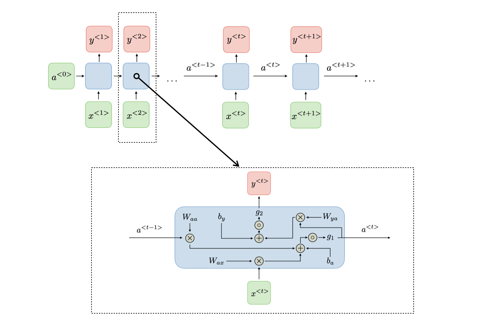

## Doğal Dil İşlemeye Giriş

> **Translated to Turkish by** himmetcanumutlu

Doğal dil işleme (Natural Language Processing, NLP), bilgisayar bilimi ve yapay zekâ alanının önemli bir dalıdır; amacı bilgisayarın insan dilini anlamasını, üretmesini ve insan diliyle etkileşime girmesini sağlamaktır. NLP'nin uygulama alanları geniştir; metin sınıflandırma, duygu analizi, makine çevirisi, konuşma tanıma, sohbet robotu gibi alanları içerir. Derin öğrenmenin hızla gelişmesiyle birlikte NLP araştırmaları da geleneksel makine öğrenmesi yöntemlerinden derin öğrenme yöntemlerine doğru kaymıştır. Klasik NLP yöntemleri özellik mühendisliğine ve model tasarımına dayanırken, modern derin öğrenme yöntemleri daha çok veriye dayalı ve otomatik özellik öğrenmeye dayanır.

### Kelime Çantası Modeli

Kelime çantası modeli (Bag of Words), NLP'deki en basit metin temsil yöntemlerinden biridir; metindeki her sözcüğü bir "kelime çantası" olarak ele alır, sözcüklerin sırasını ve dil bilgisini yok sayar, yalnızca her sözcüğün görülme sıklığını dikkate alır. Kısacası kelime çantası modeli, metni sözcük sıklığı vektörüne (TF) dönüştürerek temsil eder. Kelime çantası modelini oluşturmanın çok basit iki adımı vardır:

1. **Sözcük dağarcığını oluşturma**: Önce tüm belgeler taranır, metindeki tüm sözcükler listelenir (tekrar eden sözcükler yalnızca bir kez tutulur) ve bir sözcük dağarcığı oluşturulur.
2. **Metni vektörleştirme**: Her belgedeki sözcükler sözcük dağarcığına eşlenir, her sözcüğün görülme sayısı sayılır ve belgenin vektör temsili oluşturulur.

Örneğin, üç belge şöyle olsun:

1. `I love programming.`
2. `I love machine learning.`
3. `I love apple.`

O zaman sözcük dağarcığı şöyle olur: `['I', 'love', 'programming', 'machine', 'learning', 'apple']`. Ardından her belge sözcük sıklığı vektörüne dönüştürülür:

1. `[1, 1, 1, 0, 0, 0]`
2. `[1, 1, 0, 1, 1, 0]`
3. `[1, 1, 0, 0, 0, 1]`

Scikit-learn kütüphanesi, kelime çantası modelini oluşturmak için `CountVectorizer` sınıfını sağlar; kullanımı şöyledir:

```python
from sklearn.feature_extraction.text import CountVectorizer

# Belge listesi
documents = [
    'I love programming.',
    'I love machine learning.',
    'I love apple.'
]

# Kelime çantası modelini oluştur
cv = CountVectorizer()
X = cv.fit_transform(documents)

# Sözcük dağarcığını ve sözcük sıklığı vektörünü yazdır
print('Sözcük dağarcığı:\n', cv.get_feature_names_out())
print('Sözcük sıklığı vektörü:\n', X.toarray())
```

Çıktı:

```
Sözcük dağarcığı:  ['apple' 'learning' 'love' 'machine' 'programming']
Sözcük sıklığı vektörü:
[[0 0 1 0 1]
 [0 1 1 1 0]
 [1 0 1 0 0]]
```

> **Not**: Yukarıdaki sözcük dağarcığında `'I'` sözcüğü yoktur; çünkü bu sözcük durdurma sözcüğü olarak kabul edilip yok sayılmıştır. Durdurma sözcüğü, belirli bir dilde yüksek sıklıkta görülen ama metin analizi görevine katkısı küçük olan sözcüktür.

Çince belgeler için, Çince sözcük bölümleme işlemini gerçekleştirmek üzere üçüncü taraf `jieba` kütüphanesini kullanmak gerekir; önce cümle sözcüklere ayrılır, sonra sözcük sıklığı vektörü oluşturulur; kod şöyledir:

```python
import jieba
from sklearn.feature_extraction.text import CountVectorizer

# Belge listesi
documents = [
    '我在四川大学读书',
    '四川大学是四川最好的大学',
    '大学校园里面有很多学生',
]

# Kelime çantası modelini oluştur ve sözcük bölümleme fonksiyonunu belirt
cv = CountVectorizer(
    tokenizer=lambda x: jieba.cut(x),
    token_pattern=None
)
X = cv.fit_transform(documents)

# Sözcük dağarcığını ve sözcük sıklığı vektörünü yazdır
print('Sözcük dağarcığı:\n', cv.get_feature_names_out())
print('Sözcük sıklığı vektörü:\n', X.toarray())
```

> **Açıklama**: Çince sözcük bölümleme kütüphanesini henüz kurmadıysanız `pip install jieba` komutuyla kurabilirsiniz.

Çıktı:

```
Sözcük dağarcığı:
 ['四川' '四川大学' '在' '大学' '大学校园' '学生' '很多' '我' '是' '最好' '有' '的' '读书' '里面']
Sözcük sıklığı vektörü:
 [[0 1 1 0 0 0 0 1 0 0 0 0 1 0]
  [1 1 0 1 0 0 0 0 1 1 0 1 0 0]
  [0 0 0 0 1 1 1 0 0 0 1 0 0 1]]
```

Çincedeki yaygın durdurma sözcüklerini çıkarmak istiyorsanız, `CountVectorizer` nesnesini oluştururken `stop_words` parametresini belirtebilirsiniz; durdurma sözcüğü listesini bir Çince durdurma sözcüğü dosyasından yükleyebiliriz; kod şöyledir:

```python
import jieba
from sklearn.feature_extraction.text import CountVectorizer

with open('cince-durdurma-sozcukleri.txt') as file_obj:
    stop_words_list = file_obj.read().split('\n')

# Belge listesi
documents = [
    '我在四川大学读书',
    '四川大学是四川最好的大学',
    '大学校园里面有很多学生',
]

# Kelime çantası modelini oluştur ve sözcük bölümleme fonksiyonunu belirt
cv = CountVectorizer(
    tokenizer=lambda x: jieba.lcut(x),
    token_pattern=None,
    stop_words=stop_words_list
)
X = cv.fit_transform(documents)

# Sözcük dağarcığını ve sözcük sıklığı vektörünü yazdır
print('Sözcük dağarcığı:\n', cv.get_feature_names_out())
print('Sözcük sıklığı vektörü:\n', X.toarray())
```

> **Açıklama**: Yukarıda kullanılan Çince durdurma sözcüğü dosyasını [bu bağlantıdan](https://github.com/goto456/stopwords) edinebilirsiniz.
>
> **Çevirmen notu**: Bu örnekteki `cince-durdurma-sozcukleri.txt` dosyası (orijinal adı `哈工大停用词表.txt`) orijinal depoda yer almamaktadır; dosya adı ve referans yine de Türkçeye çevrilmiştir. Dosyayı yukarıdaki bağlantıdan indirip bu adla kaydetmeniz gerekir.

Çıktı:

```
Sözcük dağarcığı:
 ['四川' '四川大学' '大学' '大学校园' '学生' '很多' '最好' '读书' '里面']
Sözcük sıklığı vektörü:
 [[0 1 0 0 0 0 0 1 0]
  [1 1 1 0 0 0 1 0 0]
  [0 0 0 1 1 1 0 0 1]]
```

### Kelime Vektörü

Kelime çantası modelinden farklı olarak kelime vektörü (Word Embedding), her sözcüğü yoğun bir vektör uzayına eşler; böylece bilgisayarın metin verisini anlayıp işleyebilmesini sağlar. Bu vektörler, sözcükler arasındaki anlam ve bağlam ilişkilerini yakalayarak modelin daha iyi sözcük anlamı eşleştirmesi ve anlam analizi yapmasına olanak tanır. Örneğin `'king'` ile `'queen'` sözcükleri arasındaki ilişki, `'cat'` ile `'dog'` sözcükleri arasındaki ilişki vb. vektör uzayında yansıtılmalıdır.

Yaygın kelime vektörü modelleri şunlardır:

1. **Word2Vec**: Sığ sinir ağı eğitimiyle kelime vektörü öğrenir; iki mimariye ayrılır: CBOW (Continuous Bag Of Words) ve Skip-Gram.
    - CBOW modelinin temel düşüncesi şudur: bir bağlam sözcüğü verildiğinde merkez sözcüğü tahmin etmek, yani bağlamdaki sözcükler aracılığıyla hedef sözcüğü tahmin etmektir; bağlamın sırası önemli değildir, çünkü kelime çantası bir kümedir ve kümede sıra kavramı yoktur. "The cat sits on the mat." cümleniz olduğunu varsayalım; hedef "sits" sözcüğünü tahmin etmekse, CBOW bağlam sözcükleri olan "The", "cat", "on", "the", "mat" sözcüklerini kullanarak "sits"i tahmin eder. Eğitim sürecinde CBOW, bağlamdaki sözcüklere göre "sits" kelime vektörünü ayarlar; böylece bu sözcük bağlam ortamında anlamı daha doğru temsil edebilir. Bu yolla CBOW, bir sözcüğün bağlama bağlı temsilini öğrenir.
    - CBOW'un tersine, Skip-Gram modelinin temel düşüncesi şudur: bir hedef sözcük verildiğinde, o sözcüğün bağlam sözcüklerini tahmin etmek; yani bir merkez sözcük aracılığıyla çevresindeki sözcükleri tahmin etmektir. Yine "The cat sits on the mat." cümlesini örnek alalım, hedef sözcük "sits" olsun. Skip-Gram modelinde sistem, "sits"i kullanarak bağlam sözcüklerini, yani "The", "cat", "on", "the", "mat"i tahmin eder. Skip-Gram modeli, "sits" kelime vektörünün eğitim verisinde bağlam sözcükleriyle ilişkisini en üst düzeye çıkaracak şekilde eğitim yapar.
2. **GloVe**: Sözcük sıklığı matrisinin ayrıştırılmasına dayanır; sözcüklerin küresel istatistiksel bilgisini yakalayabilir; 2014 yılında Stanford Üniversitesi araştırma ekibi tarafından önerilmiştir. GloVe kelime vektörleri; metin sınıflandırma, duygu analizi, makine çevirisi gibi çeşitli doğal dil işleme görevlerinde kullanılabilir. Sonraki derin öğrenme modelleri için etkili girdi özellikleri sağlar.

Aşağıda kelime vektörü öğrenmenin temel düşüncesini kısaca anlatıyoruz; başlıca üç temel unsuru vardır:

1. **Girdi ve hedef**: Word2Vec modelini (CBOW veya Skip-Gram) kullandığımızı varsayalım; hedef, bir sözcük (merkez sözcük) veya bağlam sözcükleri aracılığıyla kelime vektörünü öğrenmektir. Skip-Gram'de bir sözcük verilir, hedef onun bağlamındaki sözcükleri tahmin etmektir; CBOW'da bağlam sözcükleri verilir, hedef merkez sözcüğü tahmin etmektir.

2. **Sinir ağı modeli**: Word2Vec, kelime vektörünü basit bir sinir ağıyla öğrenir; giriş katmanı her sözcüğe karşılık gelen one-hot kodlamadır; gizli katman düşük boyutlu yoğun bir vektördür (yani kelime vektörü) ve eğitim sürecinde geri yayılımla kademeli olarak optimize edilir; çıktı katmanı hedef sözcüğün olasılık dağılımıdır; aşağıdaki şekilde gösterilmiştir.

    

3. **Eğitim süreci**: Bağlam ve hedef sözcüğün birlikte görülme bilgisi aracılığıyla model, her sözcüğün bağlamına göre kelime vektörünü ayarlar; böylece anlamca benzer sözcüklerin vektörleri birbirine yaklaşır. Eğitim sürecinde sinir ağı, hatayı (yani tahmin edilen sözcük ile gerçek sözcük arasındaki farkı) minimize ederek kelime vektörünü ayarlar; böylece sözcükler arasındaki bağlantı doğru tahmin edilebilir.

Kelime vektörünün boyutu genellikle bir hiperparametredir ve somut duruma göre seçilmesi gerekir. Genellikle yaygın boyut aralığı 50 ile 300 arasındadır, ama bazen daha yüksek veya daha düşük olabilir. Daha düşük boyut, sözcüklerin zengin anlam bilgisini yakalayamayabilir ama hesaplama karmaşıklığını azaltır; eğitim verisi az veya hassasiyet gereksinimi düşük senaryolar için uygundur; daha yüksek boyut daha fazla anlam özelliği yakalayabilir, büyük ölçekli veri kümeleri için uygundur, ancak hesaplama maliyeti de artar.

Kelime vektörleri eğitildikten sonra sözcükler arasındaki çeşitli ilişkileri yakalayabilirler. En yaygın yol, kelime vektörleri arasındaki uzaklığı veya benzerliği hesaplayarak ilişkilerini anlamaktır. İki kelime vektörü arasındaki kosinüs benzerliğini hesaplamak en çok kullanılan yöntemdir; kosinüs benzerliğinin formülünden daha önce bahsetmiştik, şöyledir:

$$
\text{Cosine Similarity}(\mathbf{A}, \mathbf{B}) = \frac{\mathbf{A} \cdot \mathbf{B}}{\lVert \mathbf{A} \rVert \lVert \mathbf{B} \rVert}
$$

Burada, $\small{\mathbf{A}}$ ve $\small{\mathbf{B}}$ iki sözcüğün kelime vektörleridir; $\small{\cdot}$ vektörlerin iç çarpım işlemidir; $\small{\lVert \mathbf{A} \rVert}$ ve $\small{\lVert \mathbf{B} \rVert}$ bunların uzunluklarıdır. Kosinüs benzerliğinin değeri -1 ile 1 arasındadır; değer ne kadar büyükse iki sözcük o kadar benzerdir, ne kadar küçükse o kadar farklıdır.

Öte yandan, kelime vektörlerinin uzay ilişkilerini inceleyip bazı ilginç işlemler yapabiliriz. Örneğin, `'king'` (kral) ile `'queen'` (kraliçe) arasındaki ilişkiyi öğrenmek istiyorsak şöyle keşfedebiliriz:

$$
\text{king} − \text{man} + \text{woman} \approx \text{queen}
$$

Bu ifade, `'king'`den `'man'` (erkek) kısmının çıkarılıp `'woman'` (kadın) kısmının eklenmesiyle elde edilen sonucun yaklaşık olarak `'queen'` olduğunu gösterir. Böyle işlemler cinsiyet üzerindeki benzerliği yakalayabilir. Ayrıca kelime vektörlerini kullanarak kümeleme analizi, sözcük anlamı belirsizliğini giderme (bağlam ve benzerlikle sözcüğün belirli senaryodaki anlamını belirleme), metin sınıflandırma, duygu analizi gibi işlemler de yapabiliriz.

Aşağıdaki kodla kelime vektörünün oluşturulmasını ve sözcükler arası benzerliğin ölçülmesini gösteriyoruz; burada `gensim` adlı bir üçüncü taraf kütüphaneyi kurmak gerekir.

```bash
pip install gensim
```

Ayrıca modeli eğitmek için kullanılacak derlemi önceden yüklememiz gerekir; burada Hugging Face'in sağladığı `datasets` kütüphanesini kullanıyorum; bu kütüphaneyle bazı yaygın derlemler de dâhil olmak üzere çeşitli açık veri kümeleri yüklenebilir. Elbette `nltk` gibi doğal dil işlemeye özel bir araç setiyle de derlem indirebilirsiniz. `datasets` kütüphanesini henüz kurmadıysanız aşağıdaki komutla kurmanız gerekir.

```bash
pip install datasets
```

Önce IMDB veri kümesini yüklüyoruz; bu, özellikle duygu analizi ve doğal dil işleme alanlarında yaygın olarak kullanılan bir metin sınıflandırma veri kümesidir. IMDB veri kümesi çok sayıda film yorumu içerir ve her yorumun duygu eğilimi işaretlenmiştir (burada şimdilik kullanmayacağız). IMDB veri kümesi genellikle 50000 yorum içerir; bunların 25000'i eğitim, 25000'i test için kullanılır. Her yorum, izleyicinin filme dair değerlendirmesidir; içerikleri kısa da olabilir uzun da; biz bunu modeli eğitmek için derlem olarak kullanacağız.

```python
import re

from datasets import load_dataset
from gensim.models import Word2Vec
from sklearn.metrics.pairwise import cosine_similarity

# IMDB veri kümesini yükle
imdb = load_dataset('imdb')
# 50000 yorumu doğrudan derlem olarak kullan
temp = [imdb['unsupervised'][i]['text'] for i in range(50000)]
# Yorum metnini düzenli ifadeyle basitçe işle
corpus = [re.sub(r'[^\w\s]', '', x) for x in temp]

# Derlemi ön işle (İngilizce sözcük bölümleme)
sentences = [sentence.lower().split() for sentence in corpus]
# Word2Vec modelini eğit
# sentences - Girdi derlemi (cümlelerden oluşan liste; her cümle bir veya daha fazla sözcükten oluşan listedir)
# vector_size - Kelime vektörünün boyutu (boyut ne kadar yüksekse temsil edilebilen bilgi o kadar fazladır)
# window - Bağlam penceresi boyutu (modelin eğitimde kullandığı bağlam sözcüklerinin aralığı)
# min_count - Sıklığı bu değerden düşük sözcükleri yok say (derlemde az görünen sözcükleri filtrele)
# workers - Eğitimde kullanılan CPU çekirdeği sayısı
# seed - Rastgele sayı tohumu (model ağırlıklarını başlatmak için kullanılır)
model = Word2Vec(sentences, vector_size=100, window=10, min_count=2, workers=4, seed=3)

# Model aracılığıyla king ve queen kelime vektörlerini al
king_vec, queen_vec = model.wv['king'], model.wv['queen']

# İki kelime vektörünün kosinüs benzerliğini hesapla
cos_similarity = cosine_similarity([king_vec], [queen_vec])
print(f'king ve queen kosinüs benzerliği: {cos_similarity[0, 0]:.2f}')

# Kelime vektörüyle çıkarım yap (king - man + woman ≈ queen)
man_vec, woman_vec = model.wv['man'], model.wv['woman']
result_vec = king_vec - man_vec + woman_vec
# Hesaplama sonucuna en benzer üç sözcüğü bul
similar_words = model.wv.similar_by_vector(result_vec, topn=3)
print(f'king - man + woman ile en benzer sözcükler:\n {similar_words}')

# dog ile en benzer beş sözcüğü bul
dog_similar_words = model.wv.most_similar('dog', topn=5)
print(f'dog ile en benzer sözcükler:\n {dog_similar_words}')
```

Çıktı:

```
king ve queen kosinüs benzerliği: 0.43
king - man + woman ile en benzer sözcükler:
 [('queen', 0.7126370668411255), ('princess', 0.6760246753692627), ('mary', 0.5891180038452148)]
dog ile en benzer sözcükler:
 [('cat', 0.7801533937454224), ('sheep', 0.6783771514892578), ('pet', 0.6658452749252319), 
  ('doll', 0.655034065246582), ('dude', 0.6548768877983093)]
```

Kodun çıktısından görüldüğü gibi, `'king' - 'man' + 'woman'` ile en benzer sözcükler `'queen'` ve `'princess'`tir (prenses, hanımefendi); diğer sözcük ise bir kız ismidir. `'dog'` (köpek) ile en benzer sözcükler şunlardır: `'cat'` (kedi), `'sheep'` (koyun), `'pet'` (evcil hayvan), `'doll'` (oyuncak bebek) ve `'dude'` (herif).

### NPLM ve RNN

Word2Vec, sözcükler arasındaki bağlantıyı kavramamıza yardımcı olsa da, uzun mesafeli bağımlılığı yakalayamama (bağlam penceresini aşan sözcükler) ve bilinmeyen sözcüğü işleyememe (eğitimde görülmeyen sözcükler) gibi sorunlar nedeniyle NLP'nin somut alt görevlerde atılım yapıp uygulamaya geçmesini sağlayamadı. Word2Vec'in sınırlılıkları fark edildikçe araştırmacılar **NPLM**'yi (sinir ağı dil modeli) önerdi; bu model, sözcük dizisindeki bir sonraki sözcüğü tahmin etmek için sinir ağı yapısını kullanır. Geleneksel dil modellerinden farklı olarak NPLM, yalnızca yerel bağlam bilgisini değil, tüm sözcük dizisini sinir ağıyla (genellikle ileri beslemeli sinir ağı) işler; böylece daha karmaşık dil yapılarını modelleyebilir; yapısı aşağıdaki şekilde gösterilmiştir.


Elbette NPLM modelinin de uzun vadeli bağımlılık ilişkisini etkili biçimde yakalayamama sorunu vardır; bu nedenle araştırmacılar **RNN** (yinelemeli sinir ağı) modelini önerdi. RNN, dizi verisini işleyebilen bir sinir ağıdır; temel özelliği, önceki andaki gizli durumu bir sonraki ana aktarabilmesi ve böylece zaman boyutunda bağlantı kurabilmesidir. RNN, eğitim sırasında metindeki zamansal bağımlılık ilişkisini yakalayabilir ve sabit uzunluktaki bağlam penceresiyle sınırlı değildir. RNN her zaman adımında mevcut girdiye ve önceki andaki gizli duruma bağlıdır; dizi verisindeki zamansal bağımlılığı etkili biçimde yakalayabilir ve ağırlıkları geri yayılım algoritmasıyla günceller; aşağıdaki şekilde gösterilmiştir.



Geleneksel RNN'deki gradyan kaybolması ve gradyan patlaması sorunlarını çözmek için araştırmacılar **uzun kısa süreli bellek** (LSTM) ve **kapılı yinelemeli birim** (GRU) gibi iyileştirilmiş algoritmalar önerdi. LSTM ve GRU, modelin bilgi akışını ve unutmayı kontrol etmesine olanak tanıyan kapı mekanizmasını devreye sokar; böylece gradyan kaybolması sorununu etkili biçimde önler ve uzun zaman dizilerindeki bağımlılık ilişkilerini yakalayabilir. Ancak LSTM ve GRU'da hesaplama verimliliğinin düşük olması, eğitim hızının yavaş olması ve paralel eğitim yapılamaması gibi sorunlar hâlâ vardır.

### Seq2Seq

Başlangıçta araştırmacılar makine çevirisi, metin özetleme, konuşma tanıma gibi NLP görevlerini çözmek için tek bir RNN kullanmayı denedi, ancak etkinin ideal olmadığını gördü. Bunun başlıca nedeni, RNN'nin girdi ve çıktı dizisini aynı anda işlerken hem kodlama hem kod çözme yapmak zorunda kalması ve bu yüzden kolayca bilgi kaybına uğramasıdır. Daha sonra Google, Seq2Seq modelini önerdi; temel düşüncesi, girdi ile çıktı dizisi arasındaki eşleme ilişkisini öğrenerek diziden diziye dönüşümü gerçekleştirmektir. Seq2Seq modeli genellikle bir **kodlayıcı** ve bir **kod çözücü** içerir; kodlayıcı genellikle RNN veya türevlerinden (LSTM, GRU vb.) oluşur; ana görevi girdi dizisini okuyup onu bağlam vektörüne dönüştürmektir; bağlam vektörü tüm girdi dizisinin anlam bilgisini içerir ve kod çözücünün çıktı üretmesinin temelini oluşturur; kod çözücü de genellikle RNN veya türevlerinden oluşur; ana görevi bağlam vektörüne göre hedef diziyi üretmektir. Seq2Seq modelinin yapısı aşağıdaki şekilde gösterilmiştir.


Basit Seq2Seq modeli, tüm girdi dizisinin bilgisini sabit boyutlu bir bağlam vektörüne sıkıştırır; bu, özellikle uzun dizileri işlerken bilgi kaybına yol açabilir. **Dikkat mekanizması**, Seq2Seq modelinin önemli bir uzantısıdır; her kod çözme adımında kodlayıcı çıktısının farklı bölümlerine dinamik olarak ağırlıklı toplam uygulayarak, kod çözücünün her sözcüğü üretirken girdi dizisindeki ilgili bölümlere odaklanabilmesini sağlar. Böylece model, mevcut kod çözme gereksinimine göre otomatik olarak girdinin belirli bir alt bölümüne "odaklanabilir"; sabit boyutlu bir bağlam vektörüne bağlı kalmak zorunda değildir.

### Transformer

LSTM, GRU gibi modellerin uzun dizi modellemedeki sınırlılıklarını daha da aşmak için 2017'de Google Brain ekibinden Vaswani ve arkadaşları, [*Attention Is All You Need*](https://arxiv.org/pdf/1706.03762) başlıklı makalelerinde **Transformer** mimarisini önerdi; bu mimari kısa sürede NLP alanının ana akım yöntemi hâline geldi ve bu alanın ekosistemini kökten değiştirdi; ünlü GPT ve BERT modelleri Transformer mimarisine dayanır. Transformer'ın çekirdeği **öz dikkat mekanizmasıdır** (Self-Attention); girdi dizisindeki her öğeye farklı ağırlık atayarak dizi içindeki bağımlılık ilişkilerini daha iyi yakalayabilir. Ayrıca Transformer, RNN ve LSTM'deki yinelemeli yapıyı bir kenara bırakıp tamamen yeni bir kodlayıcı-kod çözücü mimarisi benimsemiştir; bu tasarım modelin girdi verisini paralel işleyebilmesini sağlar ve eğitim sürecini daha da hızlandırır. NLP alanının yanı sıra Transformer, bilgisayarla görme ve konuşma tanıma gibi alanlarda da kayda değer sonuçlar elde etmiştir.


Transformer mimarisi yukarıdaki şekilde gösterildiği gibidir; o da bir kodlayıcı-kod çözücü yapısıdır; şeklin sol tarafındaki kırmızı kutuda istiflenmiş N kodlayıcı, sağ tarafındaki mavi kutuda ise istiflenmiş N kod çözücü bulunur. Kodlayıcı, girdi dizisini işleyip onu bağlama bağlı bir temsile dönüştürmekten sorumludur; kod çözücü ise kodlayıcının çıktısına göre hedef diziyi üretir (örneğin çeviri görevindeki hedef dil). Aşağıda önce kodlayıcı ve kod çözücünün yapısından kısaca bahsedelim.

1. Kodlayıcı: Her kodlayıcı; çok başlı dikkat mekanizması, ileri beslemeli sinir ağı, artık bağlantı ve katman normalizasyonu içerir.
2. Kod çözücü: Kod çözücünün yapısı kodlayıcıya benzer, ancak öz dikkat katmanı ile kodlayıcı-kod çözücü dikkat katmanı arasında ek bir katman bulunur; bu katman kodlayıcı çıktısındaki bağlam bilgisini işlemek içindir.

Transformer'ın çekirdek bileşenlerini biraz daha açalım; aşağıdaki gibidir.

1. Gömme katmanı (girdi gömme ve çıktı gömme): Geleneksel kelime vektörü yöntemlerine (Word2Vec veya GloVe gibi) benzer şekilde, Transformer'ın girdisi önce sözcük gömme katmanından geçirilerek ayrık sözcükler yoğun vektörlere eşlenir.

2. Konum kodlaması: Transformer, RNN veya LSTM gibi dizideki zamansal bilgiyi işlemediği için sözcük sırası bilgisini enjekte etmek üzere konum kodlamasına (Positional Encoding) ihtiyaç duyar. Konum kodlaması genellikle sözcük gömme ile aynı boyutta bir vektördür; her boyut, sözcüğün dizideki konum bilgisini kodlar. Bu konum kodlamalarını oluşturmak için yaygın olarak sinüs ve kosinüs fonksiyonları kullanılır.

3. Öz dikkat mekanizması: Modelin her zaman adımında, girdi dizisindeki tüm diğer sözcüklere göre her sözcüğün temsilini hesaplamasını sağlar. Böylece her sözcük, girdinin sırasına bağlı kalmadan dizideki diğer konumların bilgisine dikkat edebilir. Öz dikkat mekanizmasının prensibi şudur: her girdi sözcüğü için gömme katmanı aracılığıyla üç vektör hesaplanır; bunlar **sorgu vektörü** (Q), **anahtar vektörü** (K) ve **değer vektörüdür** (V).

- Sorgu vektörü: Diğer sözcüklerin bilgisini sorgulamak için kullanılan vektördür; dikkatimizi verdiğimiz içeriği temsil eder; her girdi sözcüğünün buna karşılık gelen bir sorgu vektörü vardır.

- Anahtar vektörü: Girdi dizisindeki her öğeden üretilen bir vektördür; sorgu vektörüyle karşılaştırılır ve her sözcüğün diğer sözcüklerle dikkat skoru hesaplanır; bu skor, mevcut sözcüğün diğer sözcüklerle ilişkisini belirler; hesaplama formülü şöyledir; burada $\small{d_{k}}$ anahtar vektörünün boyutudur; $\small{\sqrt{d_k}}$'ye bölme işlemi, iç çarpım değerinin aşırı büyümesini önlemek içindir.

$$
\text{Attention Score}(Q, K) = \frac{Q \cdot K^{T}}{\sqrt{d_{k}}}
$$

- Değer vektörü: Gerçek bilgi taşıyıcısıdır. Dikkat skorları hesaplandıktan sonra ağırlıklı toplam işlemiyle her sözcüğün nihai temsili elde edilir; bu nihai temsil, sözcüğün bağlama bağlı vektörüdür ve sözcüğün bağlamdaki önemini yansıtır.

$$
\text{Output} = \sum_{i} \text{softmax} \left( \frac{Q \cdot K^{T}}{\sqrt{d_{k}}} \right) \cdot V_{i}
$$

Burada, elde ettiğimiz bir sözcüğün nihai temsili yalnızca kendi anlamı değil, aynı zamanda diğer sözcüklerle ilişkisini ve bağlam bilgisini de içerir.

4. Çok başlı dikkat: Standart öz dikkat mekanizmasında Q, K, V vektörleri aynı doğrusal dönüşümle elde edilir; bu, bilgi yakalamayı sınırlayabilir. Çok başlı dikkat, bu sorunu birden çok paralel dikkat başı kullanarak çözer; her baş, farklı özellikleri veya ilişkileri yakalamak için farklı doğrusal dönüşümler kullanır.

5. İleri beslemeli sinir ağı: Her sözcük için doğrusal olmayan dönüşüm sağlar, daha üst düzey özellikler çıkarır ve modelin yeteneğini artırır.

6. Artık bağlantı ve katman normalizasyonu: Transformer'da artık bağlantı (girdiyi doğrudan çıktıya ekleme) ve katman normalizasyonu (her örneğin tüm özelliklerini standartlaştırma) yaygın olarak kullanılır; bu teknikler eğitim sırasında gradyan kaybolmasını önlemeye ve eğitimi hızlandırmaya yardımcı olur.

### Özet

Geleneksel kural tabanlı ve istatistik tabanlı yöntemlerden derin öğrenme ve Transformer mimarisine kadar araştırmacılar, yapay zekânın birkaç "kış"ını yaşamış olsalar da NLP keşiflerine hiç ara vermedi. GPT ve BERT'in ortaya çıkışından bugün çeşitli büyük modellerin farklı alanlarda geniş çapta uygulanmasına kadar, bilgisayar artık neredeyse tüm dillerin özünü anlayıp üretebiliyor ve "Turing testi"nden başarıyla geçebiliyor. Bütün bunlar yalnızca makinelerle etkileşim biçimimizi değiştirmekle kalmadı; bilginin edinilmesi, anlaşılması ve paylaşılması için de yepyeni bir alan açtı; dilin gücü asla durmuyor!
