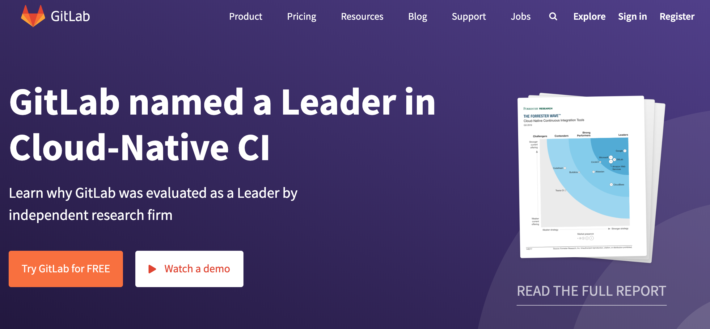
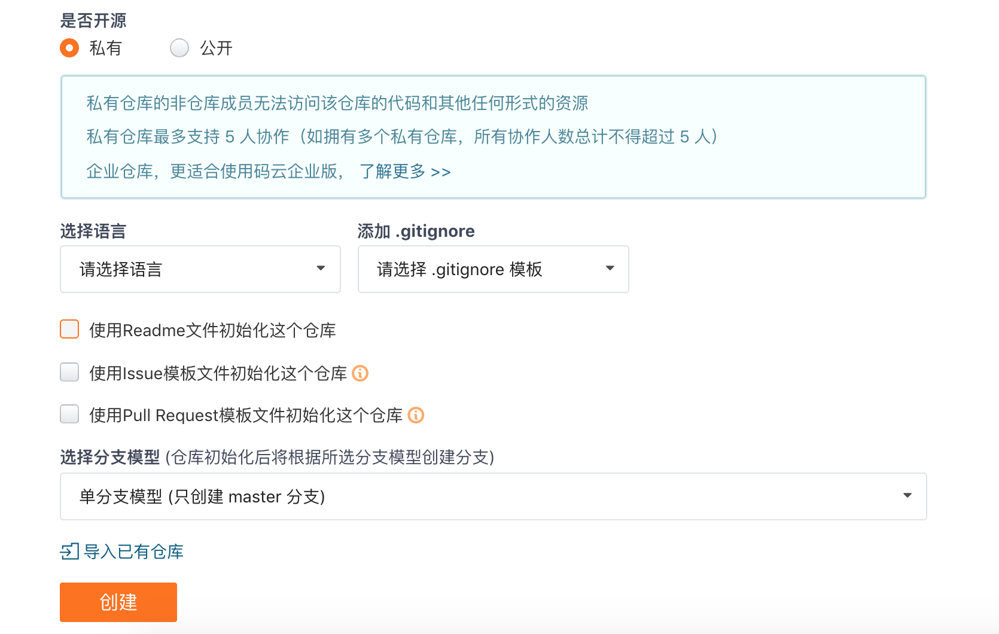
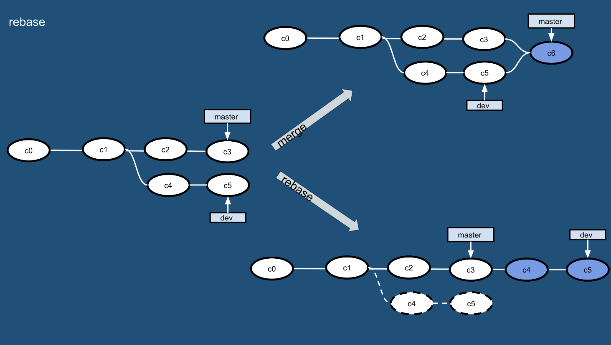

## Takım Projesi Geliştirmede Sorunlar ve Çözümler

> **Translated to Turkish by** himmetcanumutlu

Bireysel geliştirme ve takım geliştirme kavramları herkese yabancı değildir. Bireysel geliştirme, ürünün tüm içeriğini tek bir kişinin kontrol etmesidir; takım geliştirme ise birden çok kişinin bir araya gelip ürünün geliştirmesini tamamlamasıdır. Takım geliştirmeyi uygulayabilmek için şu noktalar vazgeçilmezdir:

1. Geliştirme sürecindeki çeşitli olayları (örneğin: kimin, ne zaman, neyi tamamladığı) yönetmek ve paylaşmak.
2. Takım içinde çeşitli iş sonuçlarını ve yeni bilgi ile teknikleri paylaşmak.
3. İş sonuçlarının değişimini yönetmek; hem sonuçların bozulmasını önlemek hem de her üyenin mevcut sonuçları kullanarak paralel çalışmasını sağlamak.
4. Takımın geliştirdiği yazılımın her an çalışabilir durumda olduğunu kanıtlamak.
5. Otomatikleştirilmiş bir iş akışı kullanarak takım üyelerinin geliştirmeyi, testi ve dağıtımı doğru biçimde uygulamasını sağlamak.

### Takım Projesi Geliştirmede Yaygın Sorunlar

Takım geliştirme, bireysel geliştirmeye kıyasla şu yönlerden sorunlarla karşılaşmaya daha yatkındır.

#### Sorun 1: Geleneksel iletişim yöntemiyle işlem önceliği belirlenemiyor

Örneğin: E-posta ile iletişim kurarken, posta sayısının çok fazla olması önemli postaların gözden kaçmasına yol açabilir; durum yönetilemez, hangi sorunların çözüldüğü, hangilerinin henüz ele alınmadığı bilinemez; ilgili sorunları tam metin aramayla sorgulamak da son derece verimsizdir.

Çözüm: Hata yönetimi aracı kullanmak.

#### Sorun 2: Doğrulama için kullanılabilecek bir ortam yok

Örneğin: Projenin canlı ortamında oluşan bir arıza raporu alındıktan sonra, canlı ortamı yeniden oluşturmak çok uzun zaman alır.

Çözüm: Sürekli teslimatı uygulamak.

#### Sorun 3: Proje dallarını takma adlı dizinlerle yönetmek

Çözüm: Sürüm kontrolü uygulamak.

#### Sorun 4: Veritabanını yeniden oluşturmak çok zor

Örneğin: Canlı ortam ile geliştirme ortamındaki veritabanı tablo yapıları tutarsızdır veya bir tablodaki sütunların sırası farklıdır.

Çözüm: Sürüm kontrolü uygulamak.

#### Sorun 5: Sistemi çalıştırmadan sorunu fark edememek

Örneğin: Bir hatayı (bug) çözmek başka hataların ortaya çıkmasına veya sistemin gerilemesine yol açabilir; sürüm sisteminin yanlış kullanımı başkalarının değişikliklerinin üzerine yazabilir; değişiklikler birbiriyle çakışabilir; sorun erken fark edilmezse, aylar sonra sorunun kaynağına inmek çok zahmetli hale gelir.

Çözüm: Sürekli entegrasyonu uygulamak; takım üyelerinin iş sonuçlarını sık ve sürekli biçimde derlemek ve test etmek.

#### Sorun 6: Diğer üyelerin düzelttiği kodun üzerine yazmak

Çözüm: Sürüm kontrolü uygulamak.

#### Sorun 7: Kod yeniden düzenleme (refactoring) yapılamıyor

Örneğin: Kod yeniden düzenleme (kodun ürettiği sonucu etkilemeden kodun iç yapısını ayarlamak) sırasında gerileme ortaya çıkabilir.

Çözüm: Çok sayıda yeniden kullanılabilir test ve sürekli entegrasyon uygulamak.

#### Sorun 8: Hatanın düzeltilme tarihi bilinmediğinden gerileme izlenemiyor

Çözüm: Sürüm kontrol sistemi, hata yönetim sistemi ve sürekli entegrasyonun etkileşim içinde olması gerekir; bunları otomatik dağıtım araçlarıyla bütünleştirerek kullanmak en iyisidir.

#### Sorun 9: Yayınlama süreci çok karmaşık

Çözüm: Sürekli teslimatı uygulamak.

Yukarıdaki sorunların açıklanmasına ve analizine dayanarak şu sonuca varabiliriz: Takım geliştirmede sürüm kontrolü, hata yönetimi ve sürekli entegrasyon çok önemli ve vazgeçilmezdir.

### Sürüm Kontrolü

Yukarıda bahsedilen bir dizi soruna yönelik basit bir sonuç çıkarabiliriz: Sürüm kontrolü, takım geliştirmenin ilk ön koşuludur; ürün geliştirme sürecinde oluşan çeşitli bilgilerin sürüm kontrolüyle yönetilmesi gerekir. Bu içerikler şunlardır:

1. Kod.
2. Gereksinim ve tasarımla ilgili dokümanlar.
3. Veritabanı şeması ve başlangıç verileri.
4. Yapılandırma dosyaları.
5. Kütüphane bağımlılık tanımları.

#### Git'e Giriş


Git, 2005 yılında doğmuş açık kaynaklı dağıtık bir sürüm kontrol sistemidir; başlangıçta Linux'un babası Linus Torvalds tarafından Linux çekirdeği geliştirmesini yönetmeye yardımcı olması için geliştirilmiş bir sürüm kontrol yazılımıdır. Git, yaygın kullanılan Subversion gibi sürüm kontrol araçlarından farklı olarak dağıtık sürüm kontrolü yaklaşımını benimser; merkezi sunucu desteği olmayan ortamlarda bile sürüm kontrolü uygulanabilir.

Subversion (bundan sonra kısaca SVN) kullanma deneyimi olanlar için Git ile SVN'in ortak noktası, geleneksel kilitleme tabanlı sürüm kontrolünü (ilk dönemdeki CVS ve VSS kilitleme modelini kullanıyordu; bir geliştirici bir dosyayı düzenlerken o dosyayı kilitliyor ve diğer geliştiriciler bu süre boyunca dosyayı düzenleyemiyordu) bir kenara bırakıp daha verimli olan birleştirme tabanlı sürüm kontrolünü benimsemeleridir. İkisi arasındaki farklar ise şunlardır:

1. Git dağıtıktır, SVN merkezidir; SVN'in çalışması için merkezi sunucu desteği gerekir.
2. Git içeriği meta veri biçiminde saklarken, SVN dosya olarak saklar; yani dosyanın meta bilgisini bir `.svn` klasöründe gizler.
3. Git'in dalları SVN'in dallarından farklıdır; SVN'in dal işleme biçimi oldukça "berbattır".
4. Git'in küresel bir sürüm numarası yoktur, ancak kendiniz bir sürüm etiketi tutabilirsiniz.
5. Git'in içerik bütünlüğü SVN'den üstündür; Git içerik saklamada SHA-1 özet algoritmasını kullanır. Bu, kod içeriğinin bütünlüğünü sağlar; disk arızası ve ağ sorunlarıyla karşılaşıldığında sürüm deposuna verilecek zararı azaltır.

Kısacası, **Git gerçekten harika!!!**

#### Git'i Kurmak

[Git resmî sitesinden](http://git-scm.com/) kendi sisteminize uygun Git indirme bağlantısını bulup kurabilirsiniz; macOS ve Windows platformlarında Git kurmak çok basittir.

#### Git Yerel İşlemleri

Bir klasörü Git deposuna dönüştürmek için aşağıdaki komut kullanılabilir.
```Shell
git init 
```

Yukarıdaki işlemi tamamladıktan sonra yerel dizin aşağıdaki gibi olur; şeklin sol tarafı çalışma alanınız (üzerinde çalıştığınız çalışma dizini), sağ tarafı ise yerel deponuzdur; ortada çalışma alanı ile yerel depo arasındaki geçici alan (aynı zamanda önbellek alanı olarak da adlandırılır) bulunur.


> **İpucu**: `ls -la` ile tüm dosyaları görüntülediğinizde, yukarıdaki komutu çalıştırdıktan sonra klasörün içinde `.git` adlı gizli bir klasörün eklendiğini görürsünüz; bu, yerel Git sürüm deposudur.

`git add` ile belirli bir dosyayı veya tüm dosyaları geçici alana ekleyebilirsiniz.

```Shell
git add <file>
git add .
```

Bu sırada aşağıdaki komutla çalışma alanının, geçici alanın ve yerel deponun durumunu görüntüleyebilirsiniz.

```Shell
git status
```

> **İpucu**: Bir dosyayı geçici alana eklemek istemiyorsanız, ipucuna göre `git rm --cached <file>` komutuyla dosyayı geçici alandan çalışma alanına geri koyabilirsiniz.

Bu sırada çalışma alanındaki dosyaları yeniden değiştirirseniz ve çalışma alanı ile geçici alanın içeriği farklılaşırsa, `git status` komutunu tekrar çalıştırarak hangi dosya veya dosyaların değiştirildiğini görebilirsiniz; çalışma alanını geçici alanın içeriğiyle geri yüklemek isterseniz aşağıdaki komutu kullanabilirsiniz.

```Shell
git restore <file>
git restore .
```

> **Not**: Yukarıdaki komut hâlâ deneme aşamasındadır; Git'in daha eski sürümlerinde karşılık gelen komut `git checkout -- <file>` idi. `git checkout` komutu dal değiştirmek için de kullanılabildiğinden karışıklığa yol açıyordu; bu nedenle Git'in en yeni sürümünde bu komutun iki işlevi iki yeni komuta ayrıldı: biri yukarıdaki `git restore`, diğeri ise `git switch`.

Git'i ilk kez kullanıyorsanız, kodu depoya göndermeden önce kullanıcı adı ve e-posta yapılandırması gerekir.

```Shell
git config --global user.name "jackfrued"
git config --global user.email "jackfrued@126.com"
```

> **İpucu**: Git yapılandırma bilgisini `git config --list` ile görüntüleyebilirsiniz.

Aşağıdaki komutla geçici alanın içeriği yerel depoya alınabilir.

```Shell
git commit -m 'bu commit için açıklama'
```

Her commit'e karşılık gelen günlüğü `git log` ile görüntüleyebilirsiniz.

```Shell
git log
git log --graph --oneline --abbrev-commit
```

#### Git Sunucusuna Genel Bakış

Git, SVN gibi mutlaka merkezi bir sunucuya ihtiyaç duymaz; yukarıda gösterdiğimiz sürüm kontrolü işlemlerinin tümü yerel olarak gerçekleştirildi. Ancak çok kişili iş birliği gerektiren kurumsal geliştirme senaryolarında merkezi sunucu desteği yine de gerekir. Genellikle şirketler, bir kod barındırma platformu (örneğin [GitHub](https://github.com)) kullanmayı veya kendi Git özel sunucularını kurmayı tercih ederek merkezi sunucuyu (sürüm deposu) oluşturabilir; elbette çoğu şirket ikincisini tercih eder. GitHub, Nisan 2008'de kurulmuştur; şu anda dünyanın en büyük kod barındırma platformudur; kurumsal kullanıcıları (özel depo oluşturabilir, özel deponun içeriği dışarıya açık değildir) ve sıradan kullanıcıları (özel depoyu kısıtlı kullanır, açık depoyu kısıtsız kullanır, açık deponun içeriği başkalarına görünür) destekler. GitHub'daki kod depolarının şaşırtıcı büyüme hızı, onun çok başarılı olduğunu kanıtlamıştır; Haziran 2018'de Microsoft tarafından 7,5 milyar dolar gibi astronomik bir bedelle satın alınmıştır.

Ülkede de GitHub'a benzer pek çok kod barındırma platformu vardır (örneğin: [Gitee](https://gitee.com/) ve [CODING](https://coding.net/)); şu anda Gitee ve CODING, kayıtlı kullanıcılara özel depoyu kısıtlı kullanma imkânı sunar, **Pull Request**'i (bir diyalog mekanizması; iş sonucunuzu gönderirken ilgili kişilerin veya takımın bu işten haberdar olmasını sağlar) destekler ve ayrıca **hata yönetimi**, **Webhook** gibi işlevler sunar; bunlar sürüm kontrol sistemine hata yönetimi ve sürekli entegrasyon yeteneği de kazandırır. Elbette birçok şirket ticari kodunu başkalarının platformunda barındırmak istemez; bu tür şirketler şirket içi Git özel sunucusunu kurmak için [Gitlab](<https://about.gitlab.com/>) kullanabilir; somut uygulama bir sonraki bölümde anlatılmaktadır.



Burada Git sunucusunu kullanmanın dikkat edilmesi gereken noktalarını doğrudan Gitee örneğiyle açıklıyoruz. Önce Gitee'de hesap oluşturmak gerekir; elbette üçüncü taraf girişi de kullanılabilir (GitHub hesabı, WeChat hesabı, Sina Weibo hesabı, CSDN hesabı vb.); giriş başarılı olduktan sonra proje oluşturulabilir; proje oluşturmak neredeyse "çocuk oyuncağı kadar kolay"dır, üzerinde uzun uzun durmaya gerek yok; yalnızca birkaç noktayı açıklayalım.

1. Proje oluştururken aşağıdaki şekilde gösterilen seçenekleri işaretlememeniz önerilir; programlama dili şimdilik seçilmeyebilir; `.gitignore` şablonu da daha sonra kendiniz yazılabilir veya daha profesyonel bir araçla (örneğin <http://gitignore.io/> sitesi) otomatik oluşturulabilir.

   

2. Proje üyesi ekleme. Projeyi oluşturduktan sonra projenin "Ayarlar" veya "Yönetim" bölümünde "Üye Yönetimi" işlevini bulabilirsiniz; böylece diğer geliştiricileri proje takımının üyesi olarak ayarlayabilirsiniz; proje üyeleri genellikle "sahip", "yönetici", "normal üye" ve "kısıtlı üye" rollerine ayrılır.

   

3. Projenin dalları. Proje oluşturulduktan sonra projede yalnızca varsayılan bir **master** dalı bulunur; proje yöneticisi dışındaki üyelerin bu dalı değiştirmesini (doğrudan commit atmasını) önlemek için bu dal "korunan dal" olarak ayarlanmalıdır. Elbette gerekirse çevrimiçi olarak yeni kod dalı da oluşturulabilir.

4. Parola gerektirmeyen erişim için açık anahtar ayarlama. Projenin "Ayarlar" veya "Yönetim" bölümünde "Dağıtım Açık Anahtar Yönetimi" seçeneğini de bulabiliriz; dağıtım açık anahtarı ekleyerek SSH (güvenli uzak bağlantı) yoluyla her seferinde kullanıcı adı ve parola girmeden sunucuya erişebiliriz. Anahtar çifti oluşturmak için `ssh-keygen` komutu kullanılabilir.

   ```Shell
   ssh-keygen -t rsa -b 2048 -C "your_email@example.com"
   ```

   > **Açıklama**: Yukarıdaki komutun ürettiği anahtar çifti `~/.ssh` dizinindedir; açık anahtar dosyasının varsayılan adı `id_rsa.pub`'dır; açık anahtarınızı `cat id_rsa.pub` ile görüntüleyebilirsiniz. Windows kullanıcıları Git aracını kurduktan sonra yukarıdaki komutu **Git Bash** üzerinden girebilir.

#### Git Uzak İşlemleri

Git sunucusuna sahip olduktan sonra, Git'in uzak işlemleriyle kendi iş sonuçlarımızı sunucudaki depoya itebilir, başkalarının iş sonuçlarını da sunucudaki depodan yerel olarak güncelleyebiliriz. Uzak işlemleri nasıl yapacağımızı az önce Gitee'de oluşturduğumuz depo (depo adı `python`) örneğiyle açıklayalım. Aşağıdaki gibi bir sayfada deponun adresini (URL) bulabilirsiniz; **SSH Key** yapılandırıldıysa depoya SSH yöntemiyle erişilir, aksi halde HTTPS yöntemi kullanılır; ikincisi uzak işlem sırasında kullanıcı adı ve parola sağlamayı gerektirir.


1. Uzak depo (Git sunucusu) ekleme.

   ```Shell
   git remote add origin git@gitee.com:jackfrued/python.git
   ```

   Burada `git@gitee.com:jackfrued/python.git`, yukarıdaki şekilde gösterilen deponun URL'sidir; önündeki `origin` ise bu uzun URL'nin yerine kullanılan kısa addır; kısacası `origin`, sunucudaki deponun takma adıdır (birden çok Git sunucusu varsa bu kısa adlar da birden çok olur). Belirtilmiş Git servislerini `git remote -v` ile görüntüleyebilir, belirtilen Git sunucusunu `git remote remove` ile silebilirsiniz.

2. Yerel kodu (iş sonuçlarını) uzak depoya itme.

   ```Shell
   git push -u origin master:master
   ```

   Burada `-u`, `--set-upstream`'in kısaltmasıdır; itme yapılacak sunucu deposunu belirtmek için kullanılır; arkadaki `origin` depoya az önce verdiğimiz kısa addır; iki nokta üst üstenin önündeki `master` yerel dal adı, sonrasındaki `master` ise uzak dal adıdır; yerel `master` dalı zaten uzak `master` dalıyla ilişkilendirilmişse iki nokta ve sonrası çıkarılabilir.

3. Uzak depodan kod çekme.

   ```Shell
   git pull origin master
   ```

#### Git Dal İşlemleri

1. Dal **oluşturma** ve **değiştirme**. Aşağıdaki komut `dev` adlı bir dal oluşturur ve bu dala geçer.

   ```Shell
   git branch <branch-name>
   git switch <branch-name>
   ```

   veya

   ```Shell
   git switch -c <branch-name>
   ```

   > **Not**: Önceki Git sürümlerinde dal değiştirmek için `git checkout <branch-name>` komutu kullanılıyordu; dal oluşturup değiştirmek için de `git checkout -b <branch-name>` kullanılabilirdi. `git switch` komutu şu anda hâlâ deneme aşamasındadır, ancak bu komutun yaptığı işi çok daha net ifade ettiği açıktır.

2. **Uzak dala ilişkilendirme**. Örneğin: Bulunduğunuz dal henüz bir uzak dalla ilişkilendirilmemişse, ilişki kurmak için aşağıdaki komut kullanılabilir.

   ```Shell
   git branch --set-upstream-to origin/develop
   ```

   Belirli bir dalı uzak dalla ilişkilendirmek için şu işlem yapılabilir.

   ```Shell
   git branch --set-upstream-to origin/develop <branch-name>
   ```

   > **İpucu**: Yukarıdaki işlem, Git sunucusunda `develop` adlı bir dal bulunduğunu varsayar; `--set-upstream-to`, `-u` olarak kısaltılabilir.

   Elbette dal oluştururken `--track` parametresi kullanılırsa, yerel dalla ilişkilendirilecek uzak dal doğrudan belirtilebilir; aşağıdaki gibidir.

   ```Shell
   git branch --track <branch-name> origin/develop
   ```

   Yerel dal ile uzak dal arasındaki ilişkiyi kaldırmak gerekirse aşağıdaki komut kullanılabilir.

   ```Shell
   git branch --unset-upstream <branch-name>
   ```

3. Dal **birleştirme**. Örneğin `dev` dalında geliştirme görevi tamamlandıktan sonra, `dev` dalındaki sonuçları `master`'a birleştirmek isterseniz önce `master` dalına geri dönüp `git merge` ile dal birleştirme yapabilirsiniz; birleştirme sonucu aşağıdaki şeklin sağ üst kısmında gösterilmiştir.

   ```Shell
   git switch master
   git merge --no-ff dev
   ```

   `git merge` ile dal birleştirirken varsayılan olarak `Fast Forward` birleştirme kullanılır; bu, dal silindiğinde daldaki bilgilerin tamamen kaybolacağı anlamına gelir; daldaki geçmiş sürümleri korumak isterseniz `Fast Forward`'ı devre dışı bırakmak için `--no-ff` parametresini kullanabilirsiniz.

   Dal birleştirirken çakışma olmayan kısımları Git otomatik birleştirir. Çakışma oluşursa (örneğin hem `dev` hem `master` dalında aynı dosya değiştirildiyse), `CONFLICT (content): Merge conflict in <filename>. Automatic merge failed; fix conflicts and then commit the result` (otomatik birleştirme başarısız; çakışmaları giderip yeniden commit edin) uyarısını görürsünüz; bu sırada çakışan içeriği `git diff` ile görüntüleyebilirsiniz. Çakışmayı çözmek genellikle ilgili kişilerin yüz yüze görüşüp kimin sürümünün korunacağına karar vermesini gerektirir; çakışma çözüldükten sonra kodu yeniden commit etmek gerekir.

4. Dal **yeniden temellendirme (rebase)**. Dal birleştirme işlemi, birden çok daldaki iş sonuçlarını en sonunda tek bir dalda birleştirebilir; ancak birçok birleştirme işleminden sonra dallar çok karışık ve karmaşık hale gelebilir; bu sorunu çözmek için `git rebase` işlemi kullanılabilir. Aşağıdaki şekilde gösterildiği gibi, `master` ve `dev` üzerindeki iş sonuçlarını tek bir yerde toplamak istediğimizde yeniden temellendirme işlemi de kullanılabilir.

   

   ```Shell
   git rebase master
   git switch master
   git merge dev
   ```

   `dev` dalında `git rebase` komutunu çalıştırdığımızda, önce `dev` dalı ile `master` dalının fark kümesi hesaplanır, ardından bu fark kümesi `dev` dalına uygulanır; son olarak `master` dalına geri dönüp birleştirme işlemini çalıştırırız; böylece yukarıdaki şeklin sağ alt kısmında gösterilen temiz dalı elde ederiz.

5. Dal **silme**. Dal silmek için `git branch` komutu `-d` parametresiyle kullanılabilir; daldaki iş sonuçları henüz birleştirilmemişse, dal silinirken `error: The branch '<branch-name>' is not fully merged.` gibi bir hata uyarısı görürsünüz. Dalı zorla silmek isterseniz `-D` parametresini kullanabilirsiniz. Dal silme işlemi şöyledir:

   ```Shell
   git branch -d <branch-name>
   error: The branch '<branch-name>' is not fully merged.
   If you are sure you want to delete it, run 'git branch -D <branch-name>'.
   git branch -D <branch-name>
   ```

   Uzak dalı silmek için aşağıdaki komut kullanılabilir; ancak bu işlemi dikkatli yapın.

   ```Shell
   git branch -r -d origin/develop
   git push origin :develop
   ```

   veya

   ```Shell
   git push origin --delete develop
   ```

#### Git'in Diğer İşlemleri

1. `git fetch`: Uzak depodaki tüm değişiklikleri indirir; uzak depoyu geçici bir dala indirip gerektiğinde birleştirme işlemi yapılabilir; `git fetch` ve `git merge` komutları, daha önce anlatılan `git pull` komutunun ayrıştırılmış hâli olarak görülebilir.

   ```Shell
   git fetch origin master:temp
   git merge temp
   ```

2. `git diff`: Çalışma alanı ile depo, geçici alan ile depo, iki dal arasındaki farkları karşılaştırmak için sıkça kullanılır.

3. `git stash`: Mevcut çalışma alanı ve geçici alanda oluşan değişiklikleri geçici bir bölgeye koyarak çalışma alanını temizler. Bu komut, eldeki iş henüz commit edilmemişken aniden daha acil bir görevin (örneğin canlıda düzeltilmesi gereken bir hatanın) ortaya çıktığı senaryolar için uygundur.

   ```Shell
   git stash
   git stash list
   git stash pop
   ```

4. `git reset`: Belirtilen sürüme geri döner. Bu komutun başlıca üç parametresi vardır; aşağıdaki şekilde gösterilmiştir.

   

5. `git cherry-pick`: Belirli bir daldaki tek bir commit'i seçip mevcut dalınıza yeni bir commit olarak ekler.

6. `git revert`: Commit bilgisini geri alır.

7. `git tag`: Bir etiketi görüntülemek veya yeni etiket eklemek için sıkça kullanılır.

#### Git İş Akışı (Dal Yönetim Stratejisi)

Git takım geliştirmenin vazgeçilmez bir aracı olduğuna göre, takım iş birliğinde standart bir iş akışı olmalıdır; ancak böylece takım verimli çalışır ve proje sorunsuz ilerler. Aksi halde araç ne kadar güçlü olursa olsun, takım üyeleri kendi başlarına hareket ederse çakışmalar her yerde ortaya çıkar ve iş birliğinden söz edilemez. Yine az önce Gitee'de oluşturduğumuz `python` projesini örnek alarak Git dal yönetim stratejisini açıklayalım.

##### Github-flow

1. Sunucudaki kodu yerel olarak klonlama.

   ```Shell
   git clone git@gitee.com:jackfrued/python.git
   ```

2. Kendi dalınızı oluşturma ve bu dala geçme.

   ```Shell
   git switch -c <branch-name>
   ```

   veya

   ```Shell
   git checkout -b <branch-name>
   ```

3. Kendi dalınızda geliştirme yapıp yerel olarak sürüm kontrolü uygulama.

4. Kendi dalınızı (iş sonuçlarınızı) sunucuya itme.

   ```Shell
   git push origin <branch-name>
   ```

5. Çevrimiçi olarak bir birleştirme isteği başlatma (genellikle **Pull Request** denir, bazı yerlerde **Merge Request** olarak adlandırılır); iş sonuçlarınızı `master` dalına birleştirmeyi talep edin; birleştirmeden sonra bu dal silinebilir.

   

Yukarıdaki dal yönetim stratejisine **github-flow** veya **PR** akışı denir; çok basittir ve anlaşılması kolaydır; yalnızca şu noktalara dikkat etmek gerekir:

1. `master` içeriği yayınlanabilir içeriktir (`master` üzerinde doğrudan değişiklik yapılamaz).
2. Geliştirme sırasında `master`'ı temel alarak yeni dal oluşturulmalıdır (günlük geliştirme görevleri kendi dalınızda yapılır).
3. Dal önce yerel olarak sürüm kontrolüne tabi tutulur, ardından aynı adlı dalla düzenli olarak sunucuya push yapılır.
4. Geliştirme görevi tamamlandıktan sonra `master`'a birleştirme isteği gönderilir.
5. Birleştirme isteği incelenip onaylandıktan sonra `master`'a birleştirilir ve `master`'dan canlı ortama yayınlanır.

Elbette github-flow'un dezavantajı da açıktır; `master` dalı varsayılan olarak mevcut çevrimiçi koddur, ancak bazen iş sonuçlarının `master` dalına birleştirilmesi, onun hemen yayınlanabileceği anlamına gelmez; bu da çevrimiçi sürümün `master` dalının gerisinde kalmasına yol açabilir.

##### Git-flow

Yukarıdaki github-flow dal yönetim stratejisinin yanı sıra, git-flow adlı bir dal yönetim stratejisi daha vardır; çoğu şirketin kullanmayı tercih ettiği bir akıştır. Git-flow, merkeziyetçi sürüm kontrol sistemlerinin güçlü yanlarından ilham alarak takım içinde dalları birleşik biçimde oluşturma, birleştirme ve kapatma yöntemi sunar; aşağıdaki şekilde gösterilmiştir.


Bu modelde projede iki uzun soluklu dal vardır: `master` ve `develop`; diğerleri geçici yardımcı dallardır; bunlar `feature` (belirli bir işlevi geliştirmek için kullanılan dal; geliştirme bitince `develop`'a birleştirilir), `release` (`develop`'tan ayrılan, yayına hazırlık yapan dal; yayın bitince `master` ve `develop`'a birleştirilir) ve `hotfix` (ürün yayınlandıktan sonra sorun çıktığında acil oluşturulan dal; doğrudan `master`'dan ayrılır; sorun giderildikten sonra `master`'a birleştirilip etiket eklenir, aynı zamanda ileride bu düzeltmenin atlanmaması için `develop`'a da birleştirilir; o sırada yayınlanmakta olan bir `release` dalı varsa `release` dalına da birleştirilir). Somut uygulama süreci şöyledir:


1. Başlangıçta yalnızca `master` ve `develop` dalları vardır; yukarıdaki şeklin sol tarafında gösterildiği gibidir.

2. `develop` dalından `feature` dalı oluşturulur (şeklin sağ üstü); iş tamamlandıktan sonra iş sonuçları `develop` dalına birleştirilir (şeklin sağ ortası).

   `feature` dalını oluşturma:

   ```Shell
   git switch -c feature/user develop
   ```

   veya

   ```Shell
   git checkout -b feature/user develop
   ```

   Ardından `feature` dalında geliştirme yapılır ve sürüm kontrolü uygulanır; bu bölümün nasıl yapılacağını yeniden anlatmayacağız. İş tamamlandıktan sonra `feature` dalı `develop` dalına birleştirilir:

   ```Shell
   git checkout develop
   git merge --no-ff feature/user
   git branch -d feature/user
   git push origin develop
   ```

3. `develop` dalından `release` dalı oluşturulur; yayın bittikten sonra `master` ve `develop` dallarına geri birleştirilir.

   `release` dalını oluşturma:

   ```Shell
   git checkout -b release-0.1 develop
   git push -u origin release-0.1
   ... ... ...
   git pull
   git commit -a -m "............"
   ```

   `release` dalını `master` ve `develop` dallarına geri birleştirme:

   ```Shell
   git checkout master
   git merge --no-ff release-0.1
   git push
   
   git checkout develop
   git merge --no-ff release-0.1
   git push
   
   git branch -d release-0.1
   git push --delete release-0.1
   git tag v0.1 master
   git push --tags
   ```

4. `master` dalından `hotfix` dalı oluşturulur; hata giderildikten sonra `develop` ve `master` dallarına birleştirilir (şeklin sağ altı).

   `hotfix` dalını oluşturma:

   ```Shell
   git checkout -b hotfix-0.1.1 master
   git push -u origin hotfix-0.1.1
   ... ... ...
   git pull
   git commit -a -m "............"
   ```

   `hotfix` dalını `develop` ve `master` dallarına geri birleştirme:

   ```Shell
   git checkout master
   git merge --no-ff hotfix-0.1.1
   git push
   
   git checkout develop
   git merge --no-ff hotfix-0.1.1
   git push
   
   git branch -d hotfix-0.1.1
   git push --delete hotfix-0.1.1
   git tag v0.1.1 master
   git push --tags
   ```

Git-flow süreci, her dalın durumunu kontrol etmeyi görece kolaylaştırır; ancak kullanımı github-flow'a göre çok daha karmaşıktır. Bu nedenle pratikte genellikle `gitflow` adlı komut satırı aracı kurulur (Windows ortamındaki Git bu aracı kendisiyle birlikte getirir) veya grafiksel Git araçları (SmartGit, SourceTree gibi) kullanılarak işlem basitleştirilir; ayrıntı için [《git-flow çalışma akışı》](<https://www.git-tower.com/learn/git/ebook/cn/command-line/advanced-topics/git-flow>) yazısına başvurabilirsiniz; bu yazı zaten çok iyi yazıldığından burada yeniden anlatmıyoruz.

### Hata Yönetimi

İyi bir takım yönetim aracının olmaması projenin sorunsuz ilerlememesine ve görev yönetiminin zorlaşmasına yol açar; hata yönetim sistemini devreye sokmak tam da bu sorunları çözer. Bir hata yönetim sistemi genellikle şu işlevleri içerir:

1. Görev yönetimi (ne yapılması gerektiği, kimin yapacağı, ne zaman bitireceği, şu an hangi durumda olduğu vb. dâhil).
2. Geçmişte oluşan çeşitli sorunları sezgisel biçimde görüntüleyip arayabilme.
3. Bilgiyi birleşik biçimde yönetme ve paylaşma.
4. Çeşitli raporlar üretebilme.
5. Diğer sistemlerle ilişkilendirilebilme ve genişletilebilirlik.

#### ZenTao

[ZenTao](<https://www.zentao.net/>), yerli profesyonel bir proje yönetim yazılımıdır; yalnızca bir hata yönetim aracı değildir; eksiksiz yazılım yaşam döngüsü yönetimi işlevleri sunar, [Scrum çevik geliştirmeyi](<http://www.scrumcn.com/agile/scrum-knowledge-library/scrum.html>) destekler; gereksinim yönetimi, hata yönetimi, görev yönetimi gibi bir dizi işlevi gerçekleştirebilir ve güçlü bir genişletme mekanizması ile zengin işlev eklentilerine sahiptir. ZenTao'yu, resmî sitesinin sunduğu [indirme bağlantısından](<https://www.zentao.net/download.html>) indirebilirsiniz; tek tıkla kurulum paketini kullanmanız önerilir.

Aşağıda yine CentOS Linux örneğiyle, resmî olarak sağlanan tek tıkla kurulum paketi kullanılarak ZenTao'nun nasıl kurulacağını açıklıyoruz.

```Shell
cd /opt
wget http://dl.cnezsoft.com/zentao/pro8.5.2/ZenTaoPMS.pro8.5.2.zbox_64.tar.gz
gunzip ZenTaoPMS.pro8.5.2.zbox_64.tar.gz
tar -xvf ZenTaoPMS.pro8.5.2.zbox_64.tar
```

`/opt` dizininde (resmî olarak bu dizinin kullanılması önerilir) ZenTao'nun sıkıştırılmış arşiv dosyasını indirip açma işlemlerini yaptık; yukarıdaki adımları tamamladıktan sonra `zbox` adlı bir klasör görürsünüz. Tek tıkla kurulum paketinde Apache, MySQL, PHP gibi uygulamalar yerleşik olarak bulunur; yani bunların ayrıca kurulup dağıtılmasına gerek yoktur. Ardından aşağıdaki komutla ZenTao'yu başlatıyoruz.

```Shell
/opt/zbox/zbox -ap 8080 -mp 3307
/opt/zbox/zbox start
```

> Açıklama: Yukarıda `zbox` klasöründeki `zbox` komutu kullanıldı; `-ap`, Apache sunucusunun kullanacağı portu belirtmek içindir; `-mp`, MySQL veritabanının kullanacağı portu belirtmek içindir; burada 3307 portu, sunucuda zaten var olabilecek MySQL servisinin 3306 portuyla çakışmayı önlemek için kullanıldı; `start` servisi başlatmayı, `stop` ise servisi durdurmayı ifade eder. Ayrıca ZenTao'ya erişebilmek için güvenlik duvarında 8080 portunu açmak gerekir; dikkat edin, **veritabanının portu kesinlikle genel ağa açılmamalıdır**.

Tarayıcıyı açıp sunucunun genel IP adresini girdiğinizde ZenTao'ya erişebilirsiniz; isterseniz DNS çözümlemesiyle bir alan adı bağlayarak da erişebilirsiniz; ZenTao'nun ana sayfası aşağıdaki şekilde gösterilmiştir; varsayılan yönetici `admin`, parola `123456`dır.

ZenTao'yu ilk kez kullandığınızda, kullanıcı adına tıklayıp ardından "Yardım" menüsündeki "Yeni Başlayanlar Eğitimi" ile ZenTao'yu hızla tanımanız önerilir. Resmî sitenin doküman bağlantılarında [video eğitimleri](<https://www.zentao.net/video/c1454.html>) de sunulmaktadır; yeni başlayanlar video eğitimleriyle de başlayabilir.

Çevik geliştirmeyi ve çevik döngü araçlarını özellikle iyi bilmeyenler, [《JIRA Tabanlı Scrum Çevik Geliştirme Proje Yönetimi》](<https://blog.51cto.com/newthink/1775427>) yazısına başvurabilir.

#### GitLab

Yaygın kod barındırma platformları ve daha önce bahsedilen Git özel sunucusu Gitlab, hata yönetimi işlevi sunar; bir hatayı bildirmek istediğimizde aşağıdaki şekilde gösterilen arayüzde yeni bir sorun kaydı (issue ticket) oluşturabiliriz. Doldurulacak içerikler şunlardır:

1. **[Zorunlu]** Sorunun oluştuğu yazılım sürüm numarası, somut kullanım ortamı (işletim sistemi gibi) gibi ilgili bilgiler.
2. **[Zorunlu]** Bu sorunu kararlı biçimde yeniden üretebilen ilgili adımlar.
3. **[Zorunlu]** Burada beklenen davranışı ve gerçek davranışı açıklayın.
4. **[İsteğe bağlı]** Bu hataya ilişkin görüşünüz (hatanın oluşma nedeni nedir).


Yukarıdaki şekilde gösterildiği gibi, sorun kaydı oluştururken sorunu, sorunu işleyecek kişiye atamamız da gerekir; bu hatayı kimin düzelteceği net değilse proje yöneticisine atayın; ayrıca sorunun önceliğini (çok acil, acil, normal, acil değil vb.), sorunun etiketini (işlev hatası, yeni özellik, iyileştirme, ileriye dönük araştırma vb.), kilometre taşını (kilometre taşı aracılığıyla sorunlar belirli proje düğümleriyle ilişkilendirilebilir; daha sonra her kilometre taşının ilerlemesi görüntülenebilir; kilometre taşı yazılım sürüm numarasına veya yineleme döngüsüne göre oluşturulabilir) ve hangi zamandan önce düzeltilmesi gerektiği gibi bilgileri de belirtmek gerekir.

Bazı çevik takımlar ürün gereksinimlerini yönetmek için sorun kayıtlarını kullanır; buna "sorun güdümlü geliştirme" (TiDD) denir; yani yeni özelliklerin geliştirilmesi sorun kaydı oluşturularak yönlendirilir; somut adımlar şunlardır: sorun kaydı oluşturma, sorumluyu atama, geliştirme, commit etme, kod deposuna push etme. Gereksinimle ilgili bir sorun kaydı oluşturulacaksa şu içerikler doldurulmalıdır:

1. **[Zorunlu]** Gereksinimi kısaca açıklayın ve başlık olarak kullanın.
2. **[Zorunlu]** Bu gereksinim hangi sorunu çözüyor.
3. **[Zorunlu]** Bu gereksinim, yazılımın mevcut işlevlerini nasıl etkiliyor.
4. **[Zorunlu]** Bu gereksinim hangi işlevleri gerçekleştirmeli.
5. **[Zorunlu]** Bu gereksinim, diğer modüllerin ilgili destek sağlamasına bağlı mı.
6. **[İsteğe bağlı]** Bu gereksinimin hangi uygulama biçimleri var.
7. **[İsteğe bağlı]** Bu seçilebilir uygulama biçimlerinin avantaj ve dezavantajları nelerdir.

#### Diğer Ürünler

ZenTao ve GitLab'in yanı sıra [JIRA](<https://www.atlassian.com/zh/software/jira>), [Redmine](<https://www.redmine.org/>), Backlog gibi araçlar da iyi hata yönetim sistemleridir. Günümüzde bu sistemlerin çoğu yalnızca hata yönetimi işlevi sunmakla kalmaz; çoğu zaman çevik döngü aracı olarak da kullanılır; çevik döngü aracı konusu için [《JIRA Tabanlı Scrum Çevik Geliştirme Proje Yönetimi》](<https://blog.51cto.com/newthink/1775427>) yazısına başvurun.


### Sürekli Entegrasyon

Yüksek kaliteli yazılımı hızlıca üretebilmek için takım geliştirmede sürekli entegrasyon (CI) çok önemli bir halkadır. CI, bilgisayarın derleme, test, raporlama gibi işleri otomatik olarak istediği sayıda tekrarlamasını sağlayan bir yöntemdir; CI sayesinde geliştiricilerin sorunları erken fark etmesine yardımcı olunur ve çeşitli insan hatalarının projeye getirdiği risk azaltılır. Klasik yazılım süreç modeline (şelale modeli) göre entegrasyon işi genellikle tüm geliştirme işleri bittikten sonra başlar; ancak bu sırada bir sorun fark edilirse sorunu düzeltmenin bedeli çok somuttur. Temelde, entegrasyon ne kadar geç uygulanırsa kod miktarı o kadar büyür ve sorun çözmek o kadar zorlaşır. Sürekli entegrasyon; sürüm kontrolü, otomatik derleme ve kod testini bir araya getirerek bu işleri otomatik ve iş birlikçi hale getirir. Tüm geliştirme sürecini sık sık tekrarladığı için (belirli süreler içinde kaynak kodunu birden çok kez çekip test kodunu çalıştırır), geliştiricilerin sorunları erken fark etmesine yardımcı olur.

Tüm CI araçları arasında Jenkins ve [TravisCI](<https://www.travis-ci.org/>) en temsili olanlardır; birincisi Java tabanlı açık kaynaklı bir CI aracıdır, ikincisi ise yeni ortaya çıkan çevrimiçi bir CI aracıdır; aşağıdaki şekil Jenkins'in çalışma panelidir.


Sürekli entegrasyon, derlenen diller için daha büyük anlam taşır; Python gibi yorumlanan diller içinse çoğu zaman sürüm kontrol sistemine bağlanarak otomatik testi tetikleyip ilgili raporu üretmek için kullanılır; benzer işlevler **Webhook** yapılandırılarak da gerçekleştirilebilir. Docker gibi sanallaştırma konteynerleriyle proje paketleyip dağıtmak veya K8S ile konteyner yönetimi yapmak isterseniz, sürekli entegrasyon platformuna ilgili eklentiyi kurarak bu işlevleri destekleyebilirsiniz. Gitee, [DingTalk açık platformuna](<https://ding-doc.dingtalk.com/>) doğrudan bağlanarak proje ilgili kişilerine anlık mesaj göndermek için DingTalk robotunu bile kullanabilir. GitLab de CI ve CD'ye (sürekli teslimat) destek sağlar; ayrıntılı bilgi için [《GitLab CI/CD Temel Eğitimi》](<https://blog.stdioa.com/2018/06/gitlab-cicd-fundmental/>) yazısına bakın.

> **Açıklama**:
>
> 1. Çevik geliştirmeyle ilgili içerik için ilgilenen okuyucular Zhihu'daki [《İşte Çevik Geliştirme Bu》](<https://zhuanlan.zhihu.com/p/33472102>) yazısını okuyabilir.
>
> 2. Bu bölümdeki bazı görseller NetEase Cloud Classroom'daki [《Herkesin Kullanabileceği Git》](<https://study.163.com/course/introduction/1003268008.htm>) dersinden alınmıştır (ücretsiz); buradan teşekkür ederiz.
