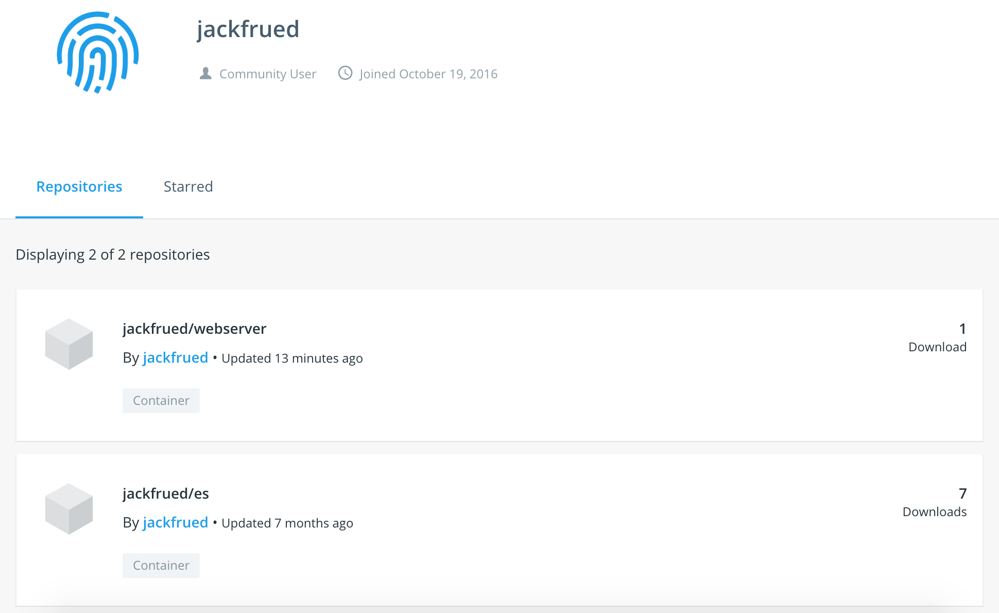

## Docker Konteyner Teknolojisi Detayları

> **Translated to Turkish by** himmetcanumutlu

Docker, Go diliyle geliştirilmiş açık kaynaklı bir uygulama konteyner motorudur; Apache Licence 2.0 protokolüne uyar; geliştiricilerin uygulamayı ve uygulamanın bağımlılık paketlerini taşınabilir bir konteynere paketlemesine, ardından çeşitli dağıtımlardaki Linux sistemlerine yayınlamasına olanak tanır.

### Docker'a Giriş

Yazılım geliştirmede en zahmetli iş muhtemelen ortam yapılandırmaktır. Kullanıcıların kullandığı işletim sistemleri çeşitli olduğundan, platformlar arası geliştirme dili (Java ve Python gibi) kullanılsa bile kodun her platformda sorunsuz çalışacağı garanti edilemez; ayrıca farklı ortamlarda kurduğumuz yazılımların ihtiyaç duyduğu yazılım paketleri de farklıdır.

O zaman şu soru akla geliyor: Yazılım kurarken yazılımın çalışma ortamını da birlikte kurabilir miyiz? Orijinal ortamı birebir kopyalayabilir miyiz?

Sanal makine (virtual machine), ortamıyla birlikte kurulum yapan bir çözümdür; bir işletim sisteminin içinde başka bir işletim sistemi çalıştırabilir; örneğin Windows sisteminde Linux sistemi, macOS üzerinde Windows çalıştırılabilir; uygulama ise bunların hiçbirini fark etmez. Sanal makine kullanmış olanlar bilir: Sanal makine gerçek sistem gibi çalışır; sanal makinenin konak sistemi açısından ise sanal makine sıradan bir dosyadır, gerekmediğinde silinir, konak sisteme veya diğer programlara bir etkisi olmaz. Ancak sanal makine genellikle daha fazla sistem kaynağı tüketir; başlatma ve kapatma da çok yavaştır; kısacası kullanıcı deneyimi sanıldığı kadar iyi değildir.

Docker, Linux konteyner teknolojisinin (LXC) bir sarmalayıcısıdır (Linux'un namespace ve cgroup teknolojilerini kullanır); basit ve kullanımı kolay bir konteyner kullanım arayüzü sunar; şu anda en popüler Linux konteyner çözümüdür. Docker, uygulamayı ve uygulamanın bağımlılıklarını tek bir dosyada paketler; bu dosya çalıştırıldığında sanal bir konteyner oluşur. Program bu sanal konteynerde, sanki gerçek bir fiziksel makinede çalışıyormuş gibi çalışır. Aşağıdaki şekil sanal makine ile konteynerin karşılaştırmasıdır; solda geleneksel sanal makine, sağda Docker bulunur.


Şu anda Docker başlıca şu amaçlarla kullanılır:

1. Tek seferlik ortam sağlamak.
2. Esnek bulut hizmeti sağlamak (Docker ile kapasite artırma ve azaltma çok kolaydır).
3. Mikro servis mimarisini uygulamak (gerçek ortamı yalıtıp konteynerde birden çok servis çalıştırmak).

### Docker'ı Kurmak

Aşağıda CentOS örneğiyle Docker'ın nasıl kurulacağını açıklıyoruz; [Ubuntu](https://docs.docker.com/install/linux/docker-ce/ubuntu/), [macOS](https://docs.docker.com/docker-for-mac/install/) veya [Windows](https://docs.docker.com/docker-for-windows/install/) kullananlar ilgili bağlantılara tıklayarak bu platformlarda nasıl kurulacağını öğrenebilir.

1. İşletim sistemi çekirdek sürümünü belirleyin (CentOS 7, 64 bit ve çekirdek sürümü 3.10+ gerektirir; CentOS 6, 64 bit ve çekirdek sürümü 2.6+ gerektirir).

   ```Bash
   uname -r
   ```

2. Sistemin alt katmanındaki kütüphane dosyalarını güncelleyin (kesinlikle çalıştırmanız önerilir; aksi halde Docker kullanırken anlaşılmaz sorunlar çıkabilir).

   ```Bash
   yum update
   ```

3. Var olabilecek eski Docker sürümlerini kaldırın.

   ```Bash
   yum list installed | grep docker
   yum erase -y docker docker-common docker-engine
   ```

4. yum araç paketini ve bağımlılıklarını kurun.

   ```Bash
   yum install -y yum-utils device-mapper-persistent-data lvm2
   ```

5. yum araç paketiyle yum deposu ekleyin (Docker-ce kurulum deposu).

   ```Bash
   yum-config-manager --add-repo https://download.docker.com/linux/centos/docker-ce.repo
   ```

6. CentOS'ta yum kullanarak Docker-ce'yi kurun ve başlatın.

   ```Bash
   yum -y install docker-ce
   systemctl start docker
   ```

7. Docker'ın bilgilerini ve sürümünü görüntüleyin.

   ```Shell
   docker version
   docker info
   ```

Ardından imaj indirip konteyner oluşturarak Docker'ın çalışıp çalışmadığını görebilirsiniz. Docker imaj deposundan hello-world adlı imaj dosyasını indirmek için aşağıdaki komut kullanılabilir.

 ```Shell
docker pull hello-world
 ```

Tüm imaj dosyalarını görüntüleyin.

```Shell
docker images
```

```
REPOSITORY               TAG        IMAGE ID            CREATED             SIZE
docker.io/hello-world    latest     fce289e99eb9        7 months ago        1.84 kB
```

İmaj dosyasıyla konteyner oluşturun ve çalıştırın.

```Shell
docker container run --name mycontainer hello-world
```

> Açıklama: Burada `mycontainer`, konteynere verdiğimiz addır; `--name` parametresinin arkasına yazılır; `hello-world` ise az önce indirdiğimiz imaj dosyasıdır.

```
Hello from Docker!
This message shows that your installation appears to be working correctly.

To generate this message, Docker took the following steps:
 1. The Docker client contacted the Docker daemon.
 2. The Docker daemon pulled the "hello-world" image from the Docker Hub.
    (amd64)
 3. The Docker daemon created a new container from that image which runs the
    executable that produces the output you are currently reading.
 4. The Docker daemon streamed that output to the Docker client, which sent it
    to your terminal.

To try something more ambitious, you can run an Ubuntu container with:
 $ docker run -it ubuntu bash

Share images, automate workflows, and more with a free Docker ID:
 https://hub.docker.com/

For more examples and ideas, visit:
 https://docs.docker.com/get-started/
```

Bu konteyneri silmek isterseniz aşağıdaki komutu kullanabilirsiniz.

```Shell
docker container rm mycontainer
```

Konteyneri sildikten sonra az önce indirdiğimiz imaj dosyasını da silebiliriz.

```Shell
docker rmi hello-world
```

> Açıklama: Ubuntu (çekirdek sürümü 3.10+) altında Docker'ı kurup başlatmak için şu adımlar izlenebilir.
>
> ```Shell
> apt update
> apt install docker-ce
> service docker start
> ```
>
> Yurt içi kullanıcılar, Ubuntu yazılım indirme deposunu değiştirerek indirme hızını artırabilir; ayrıntı için Tsinghua Üniversitesi açık kaynak yazılım ayna sitesindeki [《Ubuntu Ayna Kullanım Yardımı》](<https://mirrors.tuna.tsinghua.edu.cn/help/ubuntu/>) sayfasına bakın.

Docker'ı kurduktan sonra, [dockerhub](https://hub.docker.com/)'a doğrudan erişip imaj indirmek çok yavaş olacağından sunucuyu yurt içi aynaya çevirmeniz önerilir; bu, `/etc/docker/daemon.json` dosyasını değiştirerek yapılabilir. Genel bulut sunucularının kendine özel aynası olur; o zaman elle değiştirmeye gerek kalmaz.

```JavaScript
{
	"registry-mirrors": [
        "http://hub-mirror.c.163.com",
        "https://registry.docker-cn.com"
    ]
}
```

### Docker'ı Kullanmak

Docker'da ustalaşmanın en kolay yolu, öğrenme ve çalışma sırasında gereksinim duyacağınız konteynerleri hemen Docker ile oluşturmaktır; aşağıda bu konteynerleri birlikte oluşturuyoruz.

#### Nginx'i Çalıştırmak

Nginx, yüksek performanslı bir Web sunucusudur ve aynı zamanda ters vekil (reverse proxy) sunucusu için mükemmel bir seçimdir. Docker ile Nginx çalıştıran bir konteyner oluşturmak çok basittir; komut şöyledir:

```Shell
docker container run -d -p 80:80 --rm --name mynginx nginx
```

> Açıklama: Yukarıdaki `-d` parametresi konteynerin arka planda çalıştığını (Shell'e çıktı üretmez) ve konteynerin ID'sini gösterdiğini ifade eder; `-p`, konteynerin portunu ana makinenin portuna eşlemek için kullanılır, iki nokta üst üstenin önü ana makinenin portu, sonrası konteynerin içinde kullanılan porttur; `--rm`, konteyner durdurulduktan sonra otomatik silinmesini ifade eder, örneğin `docker container stop mynginx` komutu çalıştırıldıktan sonra konteyner artık var olmaz; `--name`'in arkasındaki mynginx özel olarak verilen konteyner adıdır; konteyner oluşturma sürecinde nginx imaj dosyasına ihtiyaç duyulur, imaj dosyasının indirilmesi otomatik yapılır, sürüm numarası belirtilmezse varsayılan olarak en yeni sürüm (latest) kullanılır.

Kendi Web projenizi (sayfalarınızı) Nginx üzerine dağıtmak isterseniz, konteyner kopyalama komutuyla belirtilen yoldaki tüm dosya ve klasörleri konteynerin belirtilen dizinine kopyalayabilirsiniz.

```Shell
docker container cp /root/web/index.html mynginx:/usr/share/nginx/html
```

Dosya kopyalamak istemiyorsanız, konteyner oluştururken `--volume` veri birimi işlemiyle belirtilen klasörü konteynerin bir dizinine eşleyebilirsiniz; örneğin Web projesinin klasörünü doğrudan `/usr/share/nginx/html` dizinine eşleyin. Önce aşağıdaki komutla az önce oluşturduğumuz konteyneri durduralım.

```Shell
docker container stop mynginx
```

Sonra aşağıdaki komutla konteyneri yeniden oluşturalım.

```Shell
docker container run -d -p 80:80 --rm --name mynginx --volume /root/docker/nginx/html:/usr/share/nginx/html nginx
```

> Açıklama: Yukarıdaki konteyner oluşturma ve dosya kopyalama komutlarında `container` çıkarılabilir; yani `docker container run` ile `docker run` aynıdır, `docker container cp` ile `docker cp` aynıdır. Ayrıca komuttaki `--volume`, `-v` olarak kısaltılabilir; tıpkı `-d`'nin `--detach`'in, `-p`'nin `--publish`'in kısaltması olduğu gibi. `$PWD`, ana sistemin mevcut klasörünü temsil eder; bunlar Unix veya Linux sistemi kullanmış olanlar için kolayca anlaşılabilir.

Çalışan konteynerleri görüntülemek için aşağıdaki komut kullanılabilir.

```Shell
docker ps
```

```
CONTAINER ID    IMAGE    COMMAND                  CREATED            STATUS             PORTS                 NAMES
3c38d2476384    nginx    "nginx -g 'daemon ..."   4 seconds ago      Up 4 seconds       0.0.0.0:80->80/tcp    mynginx
```

Konteyneri başlatmak ve durdurmak için aşağıdaki komutlar kullanılabilir.

```Shell
docker start mynginx
docker stop mynginx
```

Konteyner oluştururken `--rm` seçeneği kullanıldığından, konteyner durdurulduğunda silinir; aşağıdaki komutla tüm konteynerleri görüntülediğimizde artık az önceki `mynginx` konteynerini görmemeliyiz.

```Shell
docker container ls -a
```

Konteyner oluştururken `--rm` seçeneği belirtilmediyse, konteyneri silmek için aşağıdaki komut kullanılabilir.

```Shell
docker rm mynginx
```

Çalışmakta olan bir konteyneri silmek için `-f` seçeneği kullanılmalıdır.

```Shell
docker rm -f mynginx
```

#### MySQL'i Çalıştırmak

Şimdi Docker ile bir MySQL sunucusu kurmayı deneyelim; önce MySQL imaj dosyası olup olmadığını kontrol edebiliriz.

```Shell
docker search mysql
```

```
INDEX        NAME            DESCRIPTION        STARS        OFFICIAL        AUTOMATED
docker.io    docker.io/mysql MySQL is a ...     8486         [OK]
...
```

> Açıklama: Yukarıdaki sorgu sonucunun sütunları sırasıyla dizin, imaj adı, imaj açıklaması, kullanıcı değerlendirmesi, resmî imaj olup olmadığı ve otomatik derlemeyi temsil eder.

MySQL imajını indirin ve imajın sürüm numarasını belirtin.

```Shell
docker pull mysql:5.7
```

İndirilmiş imaj dosyalarını görüntülemek isterseniz aşağıdaki komutu kullanabilirsiniz.

```Shell
docker images
```

```
REPOSITORY          TAG                 IMAGE ID            CREATED             SIZE
docker.io/nginx     latest              e445ab08b2be        2 weeks ago         126 MB
docker.io/mysql     5.7                 f6509bac4980        3 weeks ago         373 MB
```

MySQL konteynerini oluşturun ve çalıştırın.

```Shell
docker run -d -p 3306:3306 --name mysql57 -v /root/docker/mysql/conf:/etc/mysql/mysql.conf.d -v /root/docker/mysql/data:/var/lib/mysql -e MYSQL_ROOT_PASSWORD=123456 mysql:5.7
```

> **Not**: Yukarıda konteyner oluştururken veri birimi işlemini bir kez daha kullandık; çünkü konteynerler genellikle istenildiği anda oluşturulup istenildiği anda silinir, oysa veritabanındaki verinin korunması gerekir.

Yukarıdaki iki veri birimi işleminden biri MySQL yapılandırma dosyasının bulunduğu klasörü, diğeri MySQL verisinin bulunduğu klasörü eşler; bu iki veri birimi işlemi çok önemlidir. MySQL yapılandırma dosyasını `$PWD/mysql/conf` dizinine koyabiliriz; yapılandırma dosyasının içeriği şöyledir:

```INI
[mysqld]
pid-file=/var/run/mysqld/mysqld.pid
socket=/var/run/mysqld/mysqld.sock
datadir=/var/lib/mysql
log-error=/var/log/mysql/error.log
server-id=1
log-bin=/var/log/mysql/mysql-bin.log
expire_logs_days=30
max_binlog_size=256M
symbolic-links=0
```

MySQL 8.x (şu anki en yeni sürüm) kurduysanız, istemci aracıyla sunucuya bağlanırken `error 2059: Authentication plugin 'caching_sha2_password' cannot be loaded` sorunuyla karşılaşabilirsiniz; bunun nedeni, MySQL 8.x'in kullanıcı parolalarını daha iyi korumak için varsayılan olarak "caching_sha2_password" adlı mekanizmayı kullanmasıdır; ancak istemci aracı yeni kimlik doğrulama yöntemini desteklemiyorsa bağlantı başarısız olur. Bu sorunu çözmenin iki yolu vardır: biri istemci aracını MySQL 8.x'in kimlik doğrulama yöntemini destekleyecek şekilde yükseltmek; diğeri konteynere girip MySQL kullanıcı parolasının kimlik doğrulama yöntemini değiştirmektir. Somut adımlar şöyledir; önce `docker exec` komutuyla konteynerin etkileşimli ortamına giriyoruz; MySQL 8.x çalıştıran konteynerin adının `mysql8x` olduğunu varsayalım.

```Shell
docker exec -it mysql8x /bin/bash
```

Konteynerin etkileşimli Shell'ine girdikten sonra, önce MySQL istemci aracıyla MySQL sunucusuna bağlanabiliriz.

```Shell
mysql -u root -p
Enter password:
Your MySQL connection id is 16
Server version: 8.0.12 MySQL Community Server - GPL
Copyright (c) 2000, 2018, Oracle and/or its affiliates. All rights reserved.
Oracle is a registered trademark of Oracle Corporation and/or its
affiliates. Other names may be trademarks of their respective
owners.
Type 'help;' or '\h' for help. Type '\c' to clear the current input statement.
mysql>
```

Ardından SQL ile kullanıcı parolasını değiştirmeniz yeterlidir.

```SQL
alter user 'root'@'%' identified with mysql_native_password by '123456' password expire never;
```

Elbette isterseniz kullanıcı tablosuna bakıp değişikliğin başarılı olup olmadığını da kontrol edebilirsiniz.

```SQL
use mysql;
select user, host, plugin, authentication_string from user where user='root';
+------+-----------+-----------------------+-------------------------------------------+
| user | host      | plugin                | authentication_string                     |
+------+-----------+-----------------------+-------------------------------------------+
| root | %         | mysql_native_password | *6BB4837EB74329105EE4568DDA7DC67ED2CA2AD9 |
| root | localhost | mysql_native_password | *6BB4837EB74329105EE4568DDA7DC67ED2CA2AD9 |
+------+-----------+-----------------------+-------------------------------------------+
2 rows in set (0.00 sec)
```

Yukarıdaki adımları tamamladıktan sonra, istemci aracını güncellemeseniz bile artık MySQL 8.x'e bağlanabilirsiniz.

#### Redis'i Çalıştırmak

Şimdi birden çok konteyner çalıştırıp bu konteynerlerin ağ üzerinden haberleşmesini sağlamayı deneyelim. Bir ana üç uydu (1 master 3 slave) ana-uydu çoğaltma yapısı oluşturmak için 4 Redis konteyneri oluşturuyoruz.

```Shell
docker run -d -p 6379:6379 --name redis-master redis
docker run -d -p 6380:6379 --name redis-slave-1 --link redis-master:redis-master redis redis-server --replicaof redis-master 6379
docker run -d -p 6381:6379 --name redis-slave-2 --link redis-master:redis-master redis redis-server --replicaof redis-master 6379
docker run -d -p 6382:6379 --name redis-slave-3 --link redis-master:redis-master redis redis-server --replicaof redis-master 6379
```

Yukarıdaki komutta `--link` parametresi, konteynere ağ takma adı oluşturmak için kullanılır; çünkü üç uydu (slave) makinenin kendi ana makinesine (master) ağ üzerinden bağlanması gerekir. Konteynerin IP adresini `docker inspect --format '{{ .NetworkSettings.IPAddress }}' <container-ID>` komutuyla görüntüleyebilsek de, konteynerlerin hemen kurulup hemen kullanılma özelliği nedeniyle IP adresleri değişebilir; IP adresi doğrudan kullanılırsa konteyner yeniden başlatıldığında IP değişikliği yüzünden uydu ana makineye bağlanamayabilir. `--link` parametresiyle ağ takma adı oluşturmanın amacı, Redis sunucusunu başlatırken `redis-server`'ın arkasındaki `--replicaof` parametresinde IP adresi yerine bu takma adı kullanmaktır.

Ardından `redis-master` adlı konteynere girip ana-uydu çoğaltma yapılandırmasının başarılı olup olmadığına bakalım.

```Shell
docker exec -it redis-master /bin/bash
```

`redis-cli` ile komut satırı aracını başlatın.

```Shell
redis-cli
127.0.0.1:6379> info replication
# Replication
role:master
connected_slaves:3
slave0:ip=172.17.0.4,port=6379,state=online,offset=1988,lag=0
slave1:ip=172.17.0.5,port=6379,state=online,offset=1988,lag=1
slave2:ip=172.17.0.6,port=6379,state=online,offset=1988,lag=1
master_replid:94703cfa03c3ddc7decc74ca5b8dd13cb8b113ea
master_replid2:0000000000000000000000000000000000000000
master_repl_offset:1988
second_repl_offset:-1
repl_backlog_active:1
repl_backlog_size:1048576
repl_backlog_first_byte_offset:1
repl_backlog_histlen:1988
```

#### GitLab'i Çalıştırmak

GitLab, GitLab Inc. tarafından geliştirilen bir Git depo yönetim aracıdır; wiki, sorun takibi, sürekli entegrasyon gibi bir dizi işleve sahiptir; topluluk sürümü ve kurumsal sürüm olmak üzere ikiye ayrılır. Docker'ın sağladığı sanallaştırma konteynerleriyle topluluk sürümünü kurabiliriz. GitLab güvenli bağlantı için SSH protokolünü kullandığından konteynerin 22 portunu dışa açmamız gerekir; bu nedenle önce ana makinenin SSH bağlantısı için kullandığı 22 portunu başka bir porta (örneğin 12345) değiştirip sonra sonraki işlemlere geçebiliriz.

```Shell
vim /etc/ssh/sshd_config
```

İçinde portu tanımlayan satırın yorumunu kaldırıp portu 12345 olarak değiştirin.

```
Port 12345
```

`sshd` servisini yeniden başlatın.

```Shell
systemctl restart sshd
```

> **İpucu**: Portu değiştirdikten sonra güvenlik duvarında ilgili portun açık olduğundan emin olun; aksi halde Linux sunucusuna SSH ile bağlanılamaz.

Veri birimi eşleme işlemi için gereken klasörleri oluşturun.

```Shell
mkdir -p /root/gitlab/{config,logs,data}
```

`gitlab/gitlab-ce` imajına dayanarak konteyner oluşturun ve 80 (HTTP bağlantısı) ile 22 (SSH bağlantısı) portlarını dışa açın.

```Shell
docker run -d -p 80:80 -p 22:22 --name gitlab -v /root/gitlab/config:/etc/gitlab -v /root/gitlab/logs:/var/log/gitlab -v /root/gitlab/data:/var/opt/gitlab gitlab/gitlab-ce
```

> Açıklama: GitLab'in başlatılması görece yavaştır; konteyner oluşturulduktan sonra tarayıcıdan erişebilmek için bir süre beklemeniz gerekebilir.

GitLab erişim arayüzüne ilk girdiğimizde yönetici parolasını değiştirmemiz istenir; yönetici parolasını ayarladıktan sonra giriş arayüzünde `root` kullanıcı adını ve az önce belirlediğimiz parolayı girerek yönetici paneline giriş yapabiliriz; kullanımı yine de çok basit ve kullanıcı dostudur.

### İmaj Oluşturmak

Yukarıdaki anlatımla, resmî olarak sağlanan imajlarla nasıl konteyner oluşturulacağını öğrendik. Elbette isterseniz, yapılandırdığımız konteynerden de imaj üretebiliriz. Kısacası, **Docker imajı, dosya sistemlerinin üst üste binmesiyle oluşur; sistemin en alt katmanı bootfs'tir, yani Linux çekirdeğinin önyükleme dosya sistemine karşılık gelir; ikinci katman rootfs'tir, bu katman bir veya birden çok işletim sistemi (Debian veya Ubuntu dosya sistemi gibi) olabilir; Docker'daki rootfs salt okunurdur; Docker, birleşik bağlama teknolojisiyle her katmandaki dosya sistemini üst üste bindirir; sonuçta oluşan dosya sistemi alttaki dosya ve dizinleri içerir; böyle bir dosya sistemi bir imajdır**.

Daha önce imajların nasıl aranacağını, listeleneceğini ve çekileceğini (indirileceğini) anlatmıştık; şimdi imaj oluşturmanın iki yoluna bakalım:

1. `docker commit` komutunu kullanmak. (Önerilmez)
2. `docker build` komutunu ve Dockerfile dosyasını kullanmak.

#### commit Komutuyla İmaj Oluşturmak

İmaj oluşturmayı göstermek için önce Ubuntu imajıyla bir konteyner özelleştirelim; komut şöyledir:

```Shell
docker run --name myubuntu -it ubuntu /bin/bash
```

Konteynerde Apache sunucusunu kurmak ve konteynerden çıkmak için aşağıdaki komutları çalıştırın.

```Shell
apt -y upgrade
apt -y install apache2
exit
```

Bu konteyneri özelleştirilmiş bir Web sunucusu olarak saklıyoruz; böyle bir Web sunucusuna ihtiyaç duyulduğunda konteyneri yeniden oluşturup Apache kurmaya gerek kalmaz.

Önce aşağıdaki komutla konteynerin ID'sini görüntüleyin.

```Shell
docker container ls -a
```

```
docker container ls -a
CONTAINER ID    IMAGE    COMMAND        CREATED        STATUS        PORTS    NAMES
014bdb321612    ubuntu   "/bin/bash"    5 minutes ago  Exited (0)             myubuntu
```

Özelleştirilmiş konteyneri teslim edin.

```Shell
docker commit 014bdb321612 jackfrued/mywebserver
```

İmaj dosyasını görüntüleyin.

```Shell
docker images
```

```
REPOSITORY              TAG       IMAGE ID        CREATED             SIZE
jackfrued/mywebserver   latest    795b294d265a    14 seconds ago      189 MB
```

İmaj dosyası üretildikten sonra, az önce oluşturduğumuz imaj dosyasıyla yeni konteynerler oluşturabiliriz.

#### Dockerfile ile İmaj Oluşturmak

Dockerfile, bir Docker imajı oluşturmak için DSL (Domain Specific Language) kullanır; Dockerfile dosyasını düzenledikten sonra `docker build` komutuyla yeni bir imaj oluşturabiliriz.

Önce proje kodunu ve Dockerfile dosyasını saklamak için myapp adlı bir klasör oluşturalım; şöyledir:

```Shell
[ECS-root temp]# tree myapp
myapp
├── api
│   ├── app.py
│   ├── requirements.txt
│   └── start.sh
└── Dockerfile
```

Burada api, Flask projesinin klasörüdür; proje kodu, bağımlılıklar ve başlatma betiği gibi dosyaları içerir; somut içerikler şöyledir:

`app.py` dosyası:

```Python
from flask import Flask
from flask_restful import Resource, Api
from flask_cors import CORS

app = Flask(__name__)
CORS(app, resources={r'/api/*': {'origins': '*'}})
api = Api(app)


class Product(Resource):

    def get(self):
        products = ['Ice Cream', 'Chocolate', 'Coca Cola', 'Hamburger']
        return {'products': products}


api.add_resource(Product, '/api/products')
```

`requirements.txt` dosyası:

```INI
flask
flask-restful
flask-cors
gunicorn
```

`start.sh` dosyası:

```Shell
#!/bin/bash
exec gunicorn -w 4 -b 0.0.0.0:8000 app:app
```

> **İpucu**: start.sh dosyasına çalıştırma izni vermek gerekir; bu, `chmod 755 start.sh` komutuyla yapılabilir.

Dockerfile dosyası:

```Dockerfile
# Temel imajı belirt
FROM python:3.7
# İmajın bakımcısını belirt
MAINTAINER jackfrued "jackfrued@126.com"
# Belirtilen dosyaları konteynerde belirtilen konuma ekle
ADD api/* /root/api/
# Çalışma dizinini ayarla
WORKDIR /root/api
# Komutu çalıştır (Flask projesinin bağımlılıklarını kur)
RUN pip install -r requirements.txt -i https://pypi.doubanio.com/simple/
# Konteyner başlatılırken çalıştırılacak komut
ENTRYPOINT ["./start.sh"]
# Portu dışa aç
EXPOSE 8000
```

Yukarıdaki Dockerfile dosyasını açıklayalım. Dockerfile dosyası, özel yönergelerle temel imajı (FROM yönergesi), konteyner oluşturulduktan sonra çalıştırılacak komutu (RUN yönergesi) ve dışa açılacak portu (EXPOSE) gibi bilgileri belirtir. Bu Dockerfile yönergelerini birazdan sizler için ayrıca tanıtacağız.

Ardından `docker build` komutuyla imaj oluşturabiliriz; şöyledir:

```Shell
docker build -t "jackfrued/myapp" .
```

> İpucu: Yukarıdaki komutun en sonundaki `.` işaretini sakın unutmayın; bu, Dockerfile'ın mevcut yoldan aranacağını gösterir.

Oluşturulan imajı aşağıdaki komutla görüntüleyebilirsiniz.

```Shell
docker images
```

```
REPOSITORY                   TAG                 IMAGE ID            CREATED             SIZE
jackfrued/myapp              latest              6d6f026a7896        5 seconds ago       930 MB
```

İmaj dosyasının nasıl oluşturulduğunu öğrenmek isterseniz aşağıdaki komutu kullanabilirsiniz.

```Shell
docker history jackfrued/myapp
```

```
IMAGE               CREATED             CREATED BY                                      SIZE                COMMENT
6d6f026a7896        31 seconds ago      /bin/sh -c #(nop)  EXPOSE 8000/tcp              0 B                 
3f7739173a79        31 seconds ago      /bin/sh -c #(nop)  ENTRYPOINT ["./start.sh"]    0 B                 
321e6bf09bf1        32 seconds ago      /bin/sh -c pip install -r requirements.txt...   13 MB               
2f9bf2c89ac7        37 seconds ago      /bin/sh -c #(nop) WORKDIR /root/api             0 B                 
86119afbe1f8        37 seconds ago      /bin/sh -c #(nop) ADD multi:4b76f9c9dfaee8...   870 B               
08d465e90d4d        3 hours ago         /bin/sh -c #(nop)  MAINTAINER jackfrued "j...   0 B                 
fbf9f709ca9f        12 days ago         /bin/sh -c #(nop)  CMD ["python3"]              0 B 
```

Bu imajı kullanarak Web sunucusunu çalıştıran konteyner oluşturun.

```Shell
docker run -d -p 8000:8000 --name myapp jackfrued/myapp
```

Yukarıda oluşturduğumuz imaj dosyasını dockerhub deposuna koymak isterseniz, aşağıdaki adımları izleyebilirsiniz.

Aşağıdaki komutla dockerhub'a giriş yapın.

```Shell
docker login
```

Giriş yapmak için kullanıcı adı ve parolayı girin.

```
Login with your Docker ID to push and pull images from Docker Hub. If you don't have a Docker ID, head over to https://hub.docker.com to create one.
Username: jackfrued
Password: 
Login Succeeded
```

Aşağıdaki komutla imajı depoya itin.

```Shell
docker push jackfrued/webserver
```



#### Dockerfile Yönergeleri

Dockerfile yönergelerini öğrenmek için resmî olarak sağlanan [referans kılavuzuna](<https://docs.docker.com/engine/reference/builder/>) bakabilirsiniz; aşağıda sık kullanılan bazı yönergeleri tanıtıyoruz.

1. **FROM**: Temel imajı belirler; Dockerfile'daki ilk yönerge olmalıdır.

   ```Dockerfile
   FROM <imaj adı> [AS <takma ad>]
   ```

   veya

   ```Dockerfile
   FROM <imaj adı>[:<etiket>] [AS <takma ad>]
   ```

2. **RUN**: İmaj oluşturulurken çalıştırılacak komutu belirtir.

   ```Dockerfile
   RUN <komut> [parametre1], [parametre2], ... 
   ```

   veya

   ```Dockerfile
   RUN ["çalıştırılabilir dosya", "parametre1", "parametre2", ...]
   ```

3. **CMD**: İmaj oluşturulduktan sonra çalıştırılacak komutu belirtir.

   ```Dockerfile
   CMD <komut> [parametre1], [parametre2], ...
   ```

   veya

   ```Dockerfile
   CMD ["çalıştırılabilir dosya", "parametre1", "parametre2", ...]
   ```

   > Açıklama: Docker sanal makineden farklıdır; konteynerin kendisi bir süreçtir, konteynerdeki uygulama ön planda çalışmalıdır. CMD komutu, konteynerin ana sürecini (konteyner oluşturulduktan sonra ön planda çalıştırılacak programı) belirtmek için kullanılır; ana süreç biterse konteyner de durur. Bu nedenle konteynerde Nginx'i başlatmak için `service nginx start` veya `systemctl start nginx` kullanılamaz; `CMD ["nginx", "-g", "daemon off;"]` ile ön planda çalıştırılması gerekir.

4. **ENTRYPOINT**: CMD'ye benzer, komut da çalıştırabilir; ancak `docker run` komut satırında belirtilen herhangi bir parametre, ENTRYPOINT yönergesindeki komuta yeniden parametre olarak iletilir; bu da varsayılan bir komut çalıştırabilen ve aynı zamanda `docker run` komut satırıyla bu komut için geçersiz kılınabilir parametre seçenekleri belirtmeyi destekleyen bir imaj oluşturmamızı sağlar.

   ```Dockerfile
   ENTRYPOINT <komut> [parametre1], [parametre2], ...
   ```

   veya

   ```Dockerfile
   ENTRYPOINT ["çalıştırılabilir dosya", "parametre1", "parametre2", ...]
   ```

5. **WORKDIR**: İmajdan yeni konteyner oluşturulurken konteyner içinde bir çalışma dizini oluşturur; ENTRYPOINT ve CMD ile belirtilen program bu dizinde çalıştırılır. `docker run` komutu kullanılırken WORKDIR'in belirttiği çalışma dizini `-w` parametresiyle geçersiz kılınabilir. Örneğin:

   ```Dockerfile
   WORKDIR /opt/webapp
   ```

   ```Shell
   docker run -w /usr/share/webapp ...
   ```

6. **ENV**: İmaj oluşturulurken ortam değişkeni ayarlar. `docker run` komutu kullanılırken ortam değişkeni ayarı `-e` parametresiyle değiştirilebilir. Örneğin:

   ```Dockerfile
   ENV DEFAULT_PORT=8080
   ```

   ```Shell
   docker run -e "DEFAULT_PORT=8000" ...
   ```

7. **USER**: İmajın hangi kullanıcı kimliğiyle çalışacağını belirtir. Örneğin:

   ```Dockerfile
   USER nginx
   ```

8. **VOLUME**: Konteyner oluşturulurken bir veri birimi bağlama noktası ekler. Veri birimi işlemiyle konteynerler arası veri paylaşımı ve yeniden kullanım sağlanabilir; birime yapılan değişiklikler konteyneri yeniden başlatmaya gerek kalmadan hemen etkili olur; daha önce konteyner oluştururken `--volume` parametresini kullanmamızın amacı da veri birimi eşleme işlemini gerçekleştirmekti.

   ```Dockerfile
   VOLUME ["/yol1", "/yol2/altyol2.1/", ...]
   ```

9. **ADD**: Derleme dizinindeki dosya ve klasörleri imaja kopyalar; sıkıştırılmış ve arşiv dosyalarıysa ADD komutu bunları açar (sıkıştırmayı ve arşivlemeyi çözer).

   ```Dockerfile
   ADD [--chown=<kullanıcı>:<kullanıcı grubu>] <kaynak dosya> <hedef dosya>
   ```

10. **COPY**: ADD'ye çok benzer, ancak dosyaları etkin biçimde açma işlemi yapmaz.

11. **LABEL**: Docker imajına bazı meta veriler ekler; `docker inspect` komutu kullanıldığında bu meta veriler görülür.

    ```Dockerfile
    LABEL version="1.0.0" location="Chengdu"
    ```

12. **ONBUILD**: İmaja tetikleyici ekler; bir imaj başka bir imajın temel imajı olarak kullanıldığında tetikleyici çalıştırılır. Örneğin:

    ```Dockerfile
    ONBUILD ADD . /app/src
    ONBUILD RUN cd /app/src && make
    ```

### Çoklu Konteyner Yönetimi

Projemiz birden çok konteyner kullanabilir; konteyner sayısı arttıkça konteynerleri yönetmek zahmetli hale gelir. Birden çok konteyneri otomatik yapılandırarak birbirleriyle iş birliği yapmasını ve hatta karmaşık zamanlama gerçekleştirmesini istiyorsak konteyner düzenleme (orchestration) gerekir. Docker'ın konteyner düzenlemeye yerleşik desteği çok zayıftır; ancak topluluğun sağladığı araçlarla konteyner düzenleme gerçekleştirilebilir.

#### Docker Compose

YAML dosyasına dayalı konteyner düzenleme gerçekleştirmek için Docker Compose aracı kurulabilir; YAML dosyası bir dizi konteyneri ve konteynerlerin çalışma zamanı özelliklerini tanımlar; Docker Compose bu yapılandırmalara göre konteynerleri yönetir.

1. Docker Compose'u kurmak.

   ```Shell
   curl -L "https://github.com/docker/compose/releases/download/1.25.4/docker-compose-$(uname -s)-$(uname -m)" -o /usr/local/bin/docker-compose
   chmod +x /usr/local/bin/docker-compose
   ```

   > Açıklama: curl aracı yoksa, CentOS'ta önce paket yönetim aracı yum ile curl kurulup ardından yukarıdaki komut çalıştırılabilir.

   Elbette Docker Compose'u kurmak için Python paket yönetim aracı pip de kullanılabilir; komut şöyledir:

   ```Shell
   pip3 install -U docker-compose
   ```

2. Docker Compose'u kullanmak.

   Az önceki Flask projesine önbellek ekleyelim; ardından Flask'ın sağladığı veri arayüzüyle ön yüz sayfasına veri sağlayalım; sayfayı Vue.js ile oluşturup statik sayfayı Nginx sunucusuna dağıtalım. Proje klasör yapısı şöyledir:

   ```Shell
   [ECS-root ~]# tree temp
   temp
   ├── docker-compose.yml
   ├── html
   │   └── index.html
   └── myapp
       ├── api
       │   ├── app.py
       │   ├── requirements.txt
       │   └── start.sh
       └── Dockerfile
   ```

   Değiştirilen app.py dosyasının kodu şöyledir:

   ```Python
   from pickle import dumps, loads
   
   from flask import Flask
   from flask_restful import Resource, Api
   from flask_cors import CORS
   from redis import Redis
   
   app = Flask(__name__)
   CORS(app, resources={r'/api/*': {'origins': '*'}})
   api = Api(app)
   redis = Redis(host='redis-master', port=6379)
   
   
   class Product(Resource):
   
       def get(self):
           data = redis.get('products')
           if data:
               products = loads(data)
           else:
               products = ['Ice Cream', 'Chocolate', 'Coca Cola', 'Hamburger']
               redis.set('products', dumps(products))
           return {'products': products}
   
   
   api.add_resource(Product, '/api/products')
   ```

   html klasörü statik sayfayı saklamak için kullanılır; birazdan Nginx çalıştıran bir konteynerle tarayıcıya statik sayfa sunacağız. index.html dosyasının içeriği şöyledir:

   ```HTML
   <!DOCTYPE html>
   <html lang="en">
   <head>
       <meta charset="utf-8">
       <title>Ana Sayfa</title>
   </head>
   <body>
       <div id="app">
           <h2>Ürün Listesi</h2>
           <ul>
               <li v-for="product in products">{{ product }}</li>
           </ul>
       </div>
       <script src="https://cdn.bootcss.com/vue/2.6.10/vue.min.js"></script>
       <script>
           new Vue({
               el: '#app', 
               data: {
                   products: []
               },
               created() {
                   fetch('http://1.2.3.4:8000/api/products')
                       .then(resp => resp.json())
                       .then(json => {this.products = json.products})
               }
           })
       </script>
   </body>
   </html>
   ```

   Ardından docker-compose.yml dosyasıyla üç konteyner oluşturup konteynerler arasındaki bağımlılık ilişkilerini belirtelim.

   ```YAML
   version: '3'
   services:
     api-server:
       build: ./myapp
       ports:
         - '8000:8000'
       links:
         - redis-master
     web-server:
       image: nginx
       ports:
         - '80:80'
       volumes:
         - ./html:/usr/share/nginx/html
     redis-master:
       image: redis
       expose:
         - '6379'
   ```

   Bu YAML dosyası elimizde olduğuna göre, `docker-compose` komutuyla konteyner oluşturup projeyi çalıştırabiliriz; komut şöyledir:

   ```Shell
   [ECS-root temp]# docker-compose up
   Creating network "temp_default" with the default driver
   Creating temp_web-server_1   ... done
   Creating temp_redis-master_1 ... done
   Creating temp_api-server_1   ... done
   Attaching to temp_redis-master_1, temp_web-server_1, temp_api-server_1
   redis-master_1  | 1:C 05 Dec 2019 11:57:26.828 # oO0OoO0OoO0Oo Redis is starting oO0OoO0OoO0Oo
   redis-master_1  | 1:C 05 Dec 2019 11:57:26.828 # Redis version=5.0.6, bits=64, commit=00000000, modified=0, pid=1, just started
   redis-master_1  | 1:C 05 Dec 2019 11:57:26.828 # Warning: no config file specified, using the default config. In order to specify a config file use redis-server /path/to/redis.conf
   redis-master_1  | 1:M 05 Dec 2019 11:57:26.830 * Running mode=standalone, port=6379.
   redis-master_1  | 1:M 05 Dec 2019 11:57:26.831 # WARNING: The TCP backlog setting of 511 cannot be enforced because /proc/sys/net/core/somaxconn is set to the lower value of 128.
   redis-master_1  | 1:M 05 Dec 2019 11:57:26.831 # Server initialized
   redis-master_1  | 1:M 05 Dec 2019 11:57:26.831 # WARNING overcommit_memory is set to 0! Background save may fail under low memory condition. To fix this issue add 'vm.overcommit_memory = 1' to /etc/sysctl.conf and then reboot or run the command 'sysctl vm.overcommit_memory=1' for this to take effect.
   redis-master_1  | 1:M 05 Dec 2019 11:57:26.831 # WARNING you have Transparent Huge Pages (THP) support enabled in your kernel. This will create latency and memory usage issues with Redis. To fix this issue run the command 'echo never > /sys/kernel/mm/transparent_hugepage/enabled' as root, and add it to your /etc/rc.local in order to retain the setting after a reboot. Redis must be restarted after THP is disabled.
   redis-master_1  | 1:M 05 Dec 2019 11:57:26.831 * Ready to accept connections
   api-server_1    | [2019-12-05 11:57:27 +0000] [1] [INFO] Starting gunicorn 20.0.4
   api-server_1    | [2019-12-05 11:57:27 +0000] [1] [INFO] Listening at: http://0.0.0.0:8000 (1)
   api-server_1    | [2019-12-05 11:57:27 +0000] [1] [INFO] Using worker: sync
   api-server_1    | [2019-12-05 11:57:27 +0000] [8] [INFO] Booting worker with pid: 8
   api-server_1    | [2019-12-05 11:57:27 +0000] [9] [INFO] Booting worker with pid: 9
   api-server_1    | [2019-12-05 11:57:27 +0000] [10] [INFO] Booting worker with pid: 10
   api-server_1    | [2019-12-05 11:57:27 +0000] [11] [INFO] Booting worker with pid: 11
   ```

    Konteynerleri durdurmak için aşağıdaki komut kullanılabilir.

   ```Shell
   docker-compose down
   ```

#### Kubernetes (K8S)

Gerçek üretim ortamlarında, birlikte çalışan birden çok konteynerin dağıtılması ve yönetilmesi sıklıkla gerekir; docker compose çoklu konteyner oluşturma ve yönetme sorununu çözer, ancak gerçek projelerde ana makineler arası bir kümede konteyner zamanlama platformu sağlaması için Kubernetes'e (bundan sonra kısaca K8S) de ihtiyaç duyarız. K8S, konteynerlerin otomatik dağıtımını, ölçeklenmesini ve işletilmesini gerçekleştirerek konteyner merkezli bir altyapı sağlayabilir. Bu proje, Google'ın 2014'te başlattığı bir projedir; Google'ın on yılı aşkın işletme deneyimine dayanır ve Google'ın kendi uygulamaları da konteynerler üzerinde çalışmaktadır.
