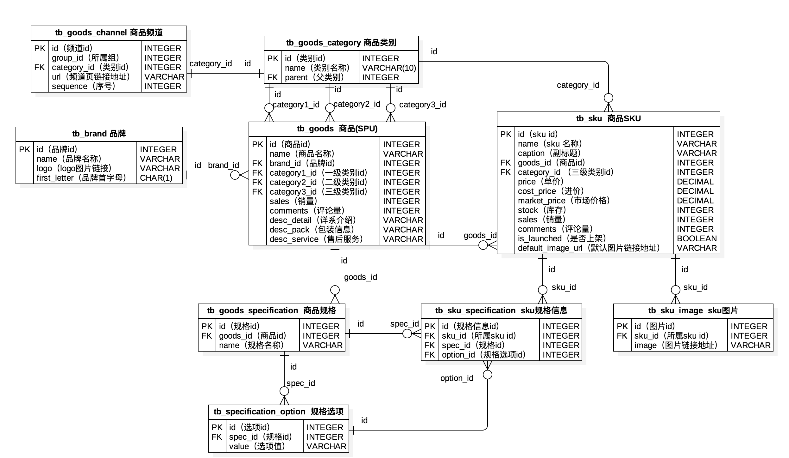
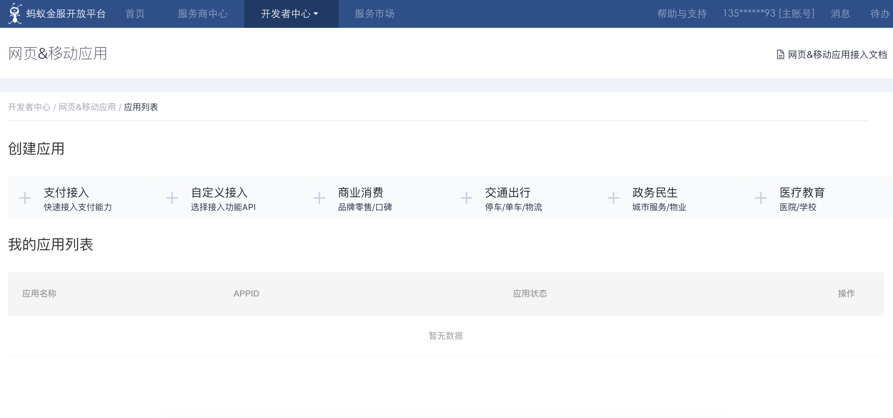

## E-ticaret Sitesi Teknik Noktalarının Analizi

> **Translated to Turkish by** himmetcanumutlu

### İş Modeli

1. B2B - işletmeden işletmeye, işlemin her iki tarafı da işletmedir (satıcı), en tipik örnek Alibaba'dır.
2. C2C - bireyden bireye, örneğin: Taobao, Renrenche.
3. B2C - işletmeden bireye, örneğin: Vipshop, Jumei.
4. C2B - bireyden işletmeye, önce tüketici gereksinimi ortaya koyar, sonra işletme gereksinime göre üretim düzenler, örneğin: Shangpin Home Collection.
5. O2O - çevrimiçiden çevrimdışına, çevrimdışı iş fırsatlarını internetle birleştirip interneti çevrimdışı işlemin platformu haline getirir, örneğin: Meituan Waimai, Ele.me.
6. B2B2C - işletmeden işletmeye bireye, örneğin: Tmall, JD.com.

### Gereksinim Noktaları

1. Kullanıcı tarafı
   - Ana sayfa (ürün sınıflandırması, reklam döngüsü, kayan haberler, şelale yükleme, öneriler, indirimler, çok satanlar, ……)

   - Kullanıcı (giriş (üçüncü taraf girişi), kayıt, çıkış, self-servis (kişisel bilgiler, tarama geçmişi, teslimat adresi, ……))

   - Ürün (sınıflandırma, liste, detay, arama, popüler arama, arama geçmişi, sepete ekleme, favori, takip, yorum, ……)
   - Alışveriş sepeti (görüntüleme, düzenleme (adet değiştirme, ürün silme, temizleme))
   - Sipariş (sipariş verme (ödeme), geçmiş siparişler, sipariş detayı, sipariş değerlendirme, ……)
2. Yönetim tarafı
   - Çekirdek iş varlıklarının CRUD'u
   - Zamanlanmış görevler (periyodik ve periyodik olmayan; örneğin ödenmemiş siparişleri işleme, veri toplayıp anormal olaylara alarm verme, ……)
   - Rapor işlevi (Excel, PDF vb. içe/dışa aktarma ve ön uç ECharts istatistik grafiği gösterimi)
   - Yetki denetimi (RBAC, beyaz liste, kara liste, ……)
   - İş akışı (örneğin iade süreci başlatma, yaygın akış motorları: Activity, Airflow, Spiff vb.)
   - Üçüncü taraf hizmetleri (harita, SMS, lojistik, ödeme, gerçek ad doğrulama, hava durumu, izleme, bulut depolama, ……)

### Fiziksel Model Tasarımı

Önce iki kavramı netleştirmek gerekir: SPU (Standard Product Unit) ve SKU (Stock Keeping Unit).

- SPU: iPhone 6s
- SKU: iPhone 6s 64G altın sarısı



### Üçüncü Taraf Girişi

Üçüncü taraf girişi, giriş doğrulaması için üçüncü taraf bir sitenin (genellikle tanınmış bir sosyal site) hesabının kullanılmasıdır (esas olarak tanınmış üçüncü taraf siteden kullanıcının ilgili bilgilerinin alınması); örneğin yurt içinde QQ, Weibo; yurt dışında Google, Facebook vb. Üçüncü taraf girişinin büyük bölümü [OAuth](<https://en.wikipedia.org/wiki/OAuth>) protokolünü kullanır; OAuth, yetkilendirmeye ilişkin açık bir ağ standardıdır (**verinin sahibi sisteme, üçüncü taraf uygulamanın sisteme girip bu verilere erişmesine izin verdiğini söyler. Sistem böylece parolanın yerine üçüncü taraf uygulamanın kullanması için kısa süreli bir erişim token'i üretir**); geniş çapta kullanılmıştır; günümüzde genellikle 2.0 sürümü kullanılır. OAuth hakkında temel bilgi için Ruan Yifeng hocanın [《OAuth 2.0'ı Anlamak》](http://www.ruanyifeng.com/blog/2014/05/oauth_2_0.html) yazısını okuyabilirsiniz. **Token** ile **parola** arasındaki farkı şu üç noktayla özetleyebiliriz:

1. Token kısa sürelidir, süresi dolunca otomatik geçersiz olur, kullanıcı kendisi değiştiremez. Parola genellikle uzun süre geçerlidir; kullanıcı değiştirmediği sürece değişmez.
2. Token, verinin sahibi tarafından iptal edilebilir, hemen geçersiz olur. Yukarıdaki örnekte ev sahibi, kuryenin token'ini istediği zaman iptal edebilir. Parolanın başkalarınca iptal edilmesine genellikle izin verilmez.
3. Token'in yetki kapsamı (scope) vardır; örneğin yalnızca sitenin 2 numaralı kapısından girilebilir. Ağ servisleri için salt okunur token, okuma-yazma tokeninden daha güvenlidir. Parola genellikle tam yetkidir.

Dolayısıyla token aracılığıyla hem üçüncü taraf uygulamaya yetki verilir hem de her an kontrol edilebilir; sistem güvenliği tehlikeye atılmaz. OAuth protokolünün avantajı budur.

#### OAuth 2.0 Yetkilendirme Akışı

1. Kullanıcı istemciyi açtıktan sonra, istemci kullanıcıdan (kaynak sahibi) yetkilendirme ister.
2. Kullanıcı (kaynak sahibi) istemciye yetki vermeyi kabul eder.
3. İstemci, önceki adımda aldığı yetkiyi kullanarak kimlik doğrulama sunucusundan erişim token'i talep eder.
4. Kimlik doğrulama sunucusu istemciyi doğruladıktan sonra erişim token'i verir.
5. İstemci, erişim token'ini kullanarak kaynak sunucusundan kaynak almayı talep eder.
6. Kaynak sunucusu erişim token'inin doğru olduğunu onaylayıp kaynağı istemciye açmayı kabul eder.


Weibo girişiyle entegrasyon için somut adımlar, Weibo açık platformundaki [“Weibo Giriş Entegrasyonu”](http://open.weibo.com/wiki/Connect/login) dokümanına bakılabilir. QQ girişiyle entegrasyon için önce QQ İnternet geliştiricisi olarak kaydolup denetimden geçmek gerekir; somut adımlar için QQ İnternet'teki [“Entegrasyon Kılavuzu”](http://wiki.connect.qq.com/) ve [“Site Geliştirme Süreci”](http://wiki.connect.qq.com/%E5%87%86%E5%A4%87%E5%B7%A5%E4%BD%9C_oauth2-0) sayfalarına bakılabilir.

> İpucu: Gitbook'da [《Django Blog Giriş》](https://shenxgan.gitbooks.io/django/content/publish/2015-08-10-django-oauth-login.html) adlı bir kitap, Github örneğiyle üçüncü taraf hesap girişini anlatır; ilgilenenler okuyabilir.

Genellikle e-ticaret siteleri üçüncü taraf girişini kullanırken, site hesabıyla bağlama yapmayı veya alınan üçüncü taraf hesap bilgisine (örneğin cep telefonu numarası) göre otomatik hesap bağlamayı gerektirir.

### Önbellek Isıtma ve Sorgu Önbelleği

#### Önbellek Isıtma

Önbellek ısıtma, sunucu başlatılırken verinin önceden önbelleğe yüklenmesidir; bunun için Django uygulamasının `apps.py` modülünde `AppConfig`'in alt sınıfını yazıp `ready()` yöntemini yeniden yazmak gerekir; kod şöyledir:

```Python
import pymysql

from django.apps import AppConfig
from django.core.cache import cache

SELECT_PROVINCE_SQL = 'select distid, name from tb_district where pid is null'


class CommonConfig(AppConfig):
    name = 'common'

    def ready(self):
        conn = pymysql.connect(host='1.2.3.4', port=3306,
                               user='root', password='pass',
                               database='db', charset='utf8',
                               cursorclass=pymysql.cursors.DictCursor)
        try:
            with conn.cursor() as cursor:
                cursor.execute(SELECT_PROVINCE_SQL)
                provinces = cursor.fetchall()
                cache.set('provinces', provinces)
        finally:
            conn.close()
```

Ardından uygulamanın `__init__.py` dosyasına aşağıdaki kodu yazmak gerekir.

```Python
default_app_config = 'common.apps.CommonConfig'
```

Veya projenin `settings.py` dosyasında uygulamayı kaydedin.

```Python
INSTALLED_APPS = [
    ...
    'common.apps.CommonConfig',
    ...
]
```

#### Sorgu Önbelleği

Sorgu sonucunun önbelleğe alınmasını gerçekleştirmek için özel dekoratör yazın.

```Python
from pickle import dumps, loads

from django.core.cache import caches

MODEL_CACHE_KEY = 'project:modelcache:%s'


def my_model_cache(key, section='default', timeout=None):
    """Model önbelleğini gerçekleştiren dekoratör"""

    def wrapper1(func):

        def wrapper2(*args, **kwargs):
            real_key = '%s:%s' % (MODEL_CACHE_KEY % key, ':'.join(map(str, args)))
            serialized_data = caches[section].get(real_key)
            if serialized_data:
                data = loads(serialized_data)
            else:
                data = func(*args, **kwargs)
                cache.set(real_key, dumps(data), timeout=timeout)
            return data

        return wrapper2

    return wrapper1
```

```Python
@my_model_cache(key='provinces')
def get_all_provinces():
    return list(Province.objects.all())
```

### Alışveriş Sepetinin Uygulanması

Soru 1: Giriş yapmış kullanıcının sepeti nerede tutulur? Giriş yapmamış kullanıcının sepeti nerede tutulur?

```Python
class CartItem(object):
    """Alışveriş sepetindeki ürün kalemi"""

    def __init__(self, sku, amount=1, selected=False):
        self.sku = sku
        self.amount = amount
        self.selected = selected

    @property
    def total(self):
        return self.sku.price * self.amount


class ShoppingCart(object):
    """Alışveriş sepeti"""

    def __init__(self):
        self.items = {}
        self.index = 0

    def add_item(self, item):
        if item.sku.id in self.items:
            self.items[item.sku.id].amount += item.amount
        else:
            self.items[item.sku.id] = item

    def remove_item(self, sku_id):
        if sku_id in self.items:
            self.items.remove(sku_id)

    def clear_all_items(self):
        self.items.clear()

    @property
    def cart_items(self):
        return self.items.values()

    @property
    def cart_total(self):
        total = 0
        for item in self.items.values():
            total += item.total
        return total
```

Giriş yapmış kullanıcının sepeti veritabanında tutulabilir (önce Redis'te önbelleğe alınabilir); giriş yapmamış kullanıcının sepeti Cookie, localStorage veya sessionStorage'da saklanabilir (sunucu tarafı bellek kullanımını azaltır).

```JSON
{
    '1001': {sku: {...}, 'amount': 1, 'selected': True}, 
    '1002': {sku: {...}, 'amount': 2, 'selected': False},
    '1003': {sku: {...}, 'amount': 3, 'selected': True},
}
```

```Python
request.get_signed_cookie('cart')

cart_base64 = base64.base64encode(pickle.dumps(cart))
response.set_signed_cookie('cart', cart_base64)
```

Soru 2: Kullanıcı giriş yaptıktan sonra alışveriş sepetleri nasıl birleştirilir? (Günümüzde e-ticaret uygulamalarının sepetleri neredeyse tamamen kalıcılaştırılmıştır; bu, esas olarak birden çok terminal arasında veri paylaşımını kolaylaştırır)

### Ödeme İşlevini Entegre Etme

Soru 1: Ödeme bilgisi nasıl kalıcılaştırılır? (Her işlemin kaydının tutulması sağlanmalıdır)

Soru 2: Alipay'e nasıl entegre olunur? (Diğer platformlara entegrasyon temelde benzerdir)

1. [Ant Financial Açık Platformu](https://open.alipay.com/platform/home.htm).
2. [Platforma katılma](https://open.alipay.com/platform/homeRoleSelection.htm).
3. [Geliştirici Merkezi](https://openhome.alipay.com/platform/appManage.htm#/apps).
4. [Dokümantasyon Merkezi](https://docs.open.alipay.com/270/105899/).
5. [SDK Entegrasyonu](https://docs.open.alipay.com/54/103419) - [PYPI bağlantısı](https://pypi.org/project/alipay-sdk-python/).
6. [API listesi](https://docs.open.alipay.com/270/105900/).



Yapılandırma dosyası:

```Python
ALIPAY_APPID = '......'
ALIPAY_URL = 'https://openapi.alipaydev.com/gateway.do'
ALIPAY_DEBUG = False
```

Ödeme bağlantısını alma (ödeme başlatma):

```Python
# Alipay'i çağıran nesneyi oluştur
alipay = AliPay(
    # Uygulamayı çevrimiçi oluştururken atanan ID
    appid=settings.ALIPAY_APPID,
    app_notify_url=None,
    # Kendi uygulamanızın özel anahtarı
    app_private_key_path=os.path.join(
        os.path.dirname(os.path.abspath(__file__)), 
        'keys/app_private_key.pem'),
    # Alipay'in açık anahtarı
    alipay_public_key_path=os.path.join(
        os.path.dirname(os.path.abspath(__file__)), 
        'keys/alipay_public_key.pem'),
    sign_type='RSA2',
    debug=settings.ALIPAY_DEBUG
)
# Ödeme sayfasını alma işlemini çağır
order_info = alipay.api_alipay_trade_page_pay(
    out_trade_no='...',
    total_amount='...',
    subject='...',
    return_url='http://...'
)
# Tam ödeme sayfası URL'sini üret
alipay_url = settings.ALIPAY_URL + '?' + order_info
return JsonResponse({'alipay_url': alipay_url})
```

Yukarıda dönen bağlantıyla ödeme sayfasına girilebilir; ödeme tamamlandıktan sonra yukarıdaki kodda ayarlanan proje sayfasına otomatik yönlendirilir; bu sayfada sipariş numarası (out_trade_no), ödeme akış numarası (trade_no), işlem tutarı (total_amount) ve karşılık gelen imza (sign) alınabilir ve işlem sonucunun doğrulanıp kaydedilmesi için arka uca istek gönderilir; kod şöyledir:

```Python
# Alipay'i çağıran nesneyi oluştur
alipay = AliPay(
    # Uygulamayı çevrimiçi oluştururken atanan ID
    appid=settings.ALIPAY_APPID,
    app_notify_url=None,
    # Kendi uygulamanızın özel anahtarı
    app_private_key_path=os.path.join(
        os.path.dirname(os.path.abspath(__file__)), 
        'keys/app_private_key.pem'),
    # Alipay'in açık anahtarı
    alipay_public_key_path=os.path.join(
        os.path.dirname(os.path.abspath(__file__)), 
        'keys/alipay_public_key.pem'),
    sign_type='RSA2',
    debug=settings.ALIPAY_DEBUG
)
# İstek parametreleri (POST isteği olduğunu varsayalım) sipariş numarası, ödeme akış numarası, işlem tutarı ve imzayı içerir
params = request.POST.dict()
# Doğrulama işlemini çağır
if alipay.verify(params, params.pop('sign')):
    # İşlemi kalıcılaştır
```

Alipay'in ödeme API'si ayrıca işlem sorgulama, işlem kapatma, iade, iade sorgulama gibi bir dizi arayüz sunar; iş gereksinimine göre çağrılabilir; burada üzerinde durmuyoruz.

### Flaş İndirim ve Aşırı Satış

1. Flaş indirim: Flaş indirim genellikle çok kısa sürede son derece yüksek eş zamanlılığı işlemek anlamına gelir; sistem kısa sürede normalin yüz katından fazla trafiğe dayanmak zorundadır; bu nedenle flaş indirim mimarisi görece karmaşık bir sorundur; çekirdek düşüncesi trafik kontrolü ve performans optimizasyonudur; ön uçtan (JavaScript ile geri sayım gerçekleştirme, tekrarlı gönderimi önleme ve sık yenilemeyi sınırlama) arka uca kadar her halkanın iş birliğini gerektirir. Trafik kontrolü, esas olarak yalnızca küçük bir trafik bölümünün servis arka ucuna girmesini sınırlamaktır (sonuçta yalnızca az sayıda kullanıcı flaş indirimde başarılı olabilir); aynı zamanda fiziksel mimaride önbellek (bir yandan okuma işlemi çok yazma işlemi azdır; diğer yandan stok Redis'e konulabilir, DECR ilkel komutuyla stok azaltma gerçekleştirilebilir; ayrıca Redis ile hız sınırlama da yapılabilir; mantık, sık sık cep telefonu doğrulama kodu göndermeyi sınırlamakla aynıdır) ve mesaj kuyruğu (mesaj kuyruğunun en önemli işlevi "zirve kırma" ve "akış yukarı-aşağı düğüm ayrıştırmadır") kullanılarak optimizasyon yapılır; ayrıca yatay ölçeklenmeyi kolaylaştırmak için (cihaz ekleyerek sisteme kapasite kazandırmak) durumsuz servis tasarımı benimsenmelidir.
2. Aşırı satış olgusu: Örneğin bir ürünün stoğu 1 olsun; bu sırada kullanıcı 1 ve kullanıcı 2 eş zamanlı bu ürünü satın alsın; kullanıcı 1 sipariş verdikten sonra ürünün stoğu 0 olarak değiştirilir; ancak kullanıcı 2 bunu bilmeden sipariş verirse ürünün stoğu -1 olarak değiştirilir; işte bu aşırı satış olgusudur. Aşırı satış olgusunu çözmek için üç yaygın düşünce vardır:
   - Kötümser kilit kontrolü: Ürün adedi sorgulanırken `select ... for update` ile veriye kilit konur; böylece kullanıcı 1 stok sorgularken, kullanıcı 2 stok adedini okuyamadığı için bloklanır; kullanıcı 1 stok güncelleme işlemini commit edene veya geri alana kadar devam edemez; böylece aşırı satış sorunu çözülür. Ancak bu yaklaşım, eş zamanlı erişimi çok yüksek ürünler için performans açısından çok kötüdür; pratik geliştirmede yalnızca stok belirli bir değerin altına düştüğünde kilit koymak düşünülebilir; ama genel olarak bu yaklaşım pek tercih edilmez.
   - İyimser kilit kontrolü: Ürün adedi sorgulanırken kilit konmaz; stok güncellenirken ürün adedinin önceki sorgu adediyle aynı olması şartı konur; aksi halde başka bir işlemin stoğu zaten güncellediği anlaşılır ve istek yeniden gönderilmelidir.
   - Stok azaltmayı deneme: Yukarıdaki sorgu (`select`) ve güncelleme (`update`) işlemleri tek bir SQL işleminde birleştirilir; stok güncellenirken `where` filtre koşuluna `stok>=satın alma adedi` veya `stok-satın alma adedi>=0` koşulu eklenir; bu yaklaşım işlem yalıtım seviyesinin okuma commit (read committed) olmasını gerektirir.

> İpucu: İlgilenenler Zhihu'da bu tür sorunlar hakkındaki tartışmalara bakabilir.

### Statik Kaynak Yönetimi

Statik kaynakların yönetimi için kendiniz dosya sunucusu veya dağıtık dosya sunucusu (FastDFS) kurabilirsiniz; ancak genel projelerde buna gerek yoktur ve etkisi de her zaman en iyi olmayabilir; sitenin statik kaynaklarını yönetmek için bulut depolama hizmeti kullanmanızı öneririz; yurt içi ve yurt dışı bulut hizmeti sağlayıcıları olan [Amazon](<https://amazonaws-china.com/cn/>), [Aliyun](<https://www.aliyun.com/product/oss>), [Qiniu](<https://www.qiniu.com/products/kodo>), [LeanCloud](<https://leancloud.cn/storage/>), [Bmob](<https://www.bmob.cn/cloud>) vb. çok kaliteli bulut depolama hizmetleri sunar; fiyatları da genel şirketlerin kabul edebileceği düzeydedir; somut işlem için resmî dokümantasyona bakılabilir; örneğin Aliyun'un [Nesne Depolama OSS Geliştirici Kılavuzu](https://www.alibabacloud.com/zh/support/developer-resources).

### Tam Metin Araması

####  Çözüm Seçimi

1. Veritabanının bulanık sorgu işlevini kullanmak - verim düşük, her seferinde tam tablo taraması gerekir, sözcük bölümlemeyi desteklemez.
2. Veritabanının tam metin araması işlevini kullanmak - MySQL 5.6 öncesinde yalnızca MyISAM motoru için geçerliydi; arama işlemi ve diğer DML işlemleri veritabanında birleştiğinden arama işlemi çok yavaşlayabilir; veri miktarı milyon seviyesine ulaştığında performans belirgin biçimde düşer, sorgu süresi çok uzar.
3. Açık kaynak arama motoru kullanmak - indeks verisi ile ham veri ayrılır; harici indeks hizmeti sağlamak için ElasticSearch veya Solr kullanılabilir; yüksek eş zamanlı tam metin araması gereksinimi dikkate alınmıyorsa saf Python Whoosh da düşünülebilir.

#### ElasticSearch

ElasticSearch hem dağıtık bir doküman veritabanı hem de yüksek ölçeklenebilir açık kaynaklı bir tam metin araması ve analiz motorudur; büyük miktarda verinin saklanmasına, aranmasına ve analiz edilmesine olanak tanır ve bu süreç neredeyse gerçek zamanlıdır. Genellikle karmaşık arama işlevleri ve gereksinimlerine güç sağlayan alt katman motoru ve teknolojisi olarak kullanılır; herkesin bildiği Vikipedi, Stack-Overflow, Github ElasticSearch kullanır.

ElasticSearch'ün alt katmanı açık kaynak arama motoru [Lucene](https://lucene.apache.org/)'dir; ancak Lucene'i doğrudan kullanmak çok zahmetlidir; arayüzünü çağırmak için kodu kendiniz yazmanız gerekir ve yalnızca Java dilini destekler. ElasticSearch, Lucene'i kapsamlı biçimde sarmalayarak REST tarzı API arayüzü sağlar; HTTP protokolüne dayalı erişim biçimiyle programlama dili farklılığını gizler. ElasticSearch veri için [ters dizin](https://zh.wikipedia.org/zh-hans/%E5%80%92%E6%8E%92%E7%B4%A2%E5%BC%95) oluşturur; ancak ElasticSearch'ün yerleşik sözcük bölümleyicisi Çince sözcük bölümlemeyi neredeyse hiç desteklemez; bu nedenle Çince sözcük bölümleme hizmeti sağlamak için elasticsearch-analysis-ik eklentisini kurmak gerekir.

ElasticSearch'ün kurulumu ve yapılandırması için [《ElasticSearch'ün Docker ile Kurulumu》](https://blog.csdn.net/jinyidong/article/details/80475320) sayfasına bakılabilir. ElasticSearch'ün yanı sıra arama motoru hizmeti sağlamak için Solr, Whoosh vb. de kullanılabilir; temelde Django projelerinde şu çözümler düşünülebilir:

- haystack（django-haystack / drf-haystack） + whoosh + Jieba
- haystack （django-haystack / drf-haystack）+ elasticsearch
- requests + elasticsearch
- django-elasticsearch-dsl

#### ElasticSearch'ün Kurulumu ve Kullanımı

1. ElasticSearch'ü Docker ile kurma.

   ```Shell
   docker pull elasticsearch:7.6.0
   docker run -d -p 9200:9200 -p 9300:9300 -e "discovery.type=single-node" -e ES_JAVA_OPTS="-Xms512m -Xmx512m" --name es elasticsearch:7.6.0
   ```

   > Açıklama: Yukarıda konteyner oluştururken `-e` parametresiyle tek düğüm modu ve Java sanal makinesinin en küçük/en büyük kullanılabilir yığın alanı boyutu belirtildi; yığın alanı boyutu, sunucunun ElasticSearch'e fiilen sağlayabileceği bellek boyutuna göre belirlenebilir; varsayılanı 2G'dir.

2. Veritabanı oluşturma.

   İstek: PUT - `http://1.2.3.4:9200/demo/`

   Yanıt:

    ```JSON
   {
       "acknowledged": true,
       "shards_acknowledged": true,
       "index": "demo"
   }
    ```

3. Oluşturulan veritabanını görüntüleme.

   İstek: GET - `http://1.2.3.4:9200/demo/`

   Yanıt:

   ```JSON
   {
       "demo": {
           "aliases": {},
           "mappings": {},
           "settings": {
               "index": {
                   "creation_date": "1552213970199",
                   "number_of_shards": "5",
                   "number_of_replicas": "1",
                   "uuid": "ny3rCn10SAmCsqW6xPP1gw",
                   "version": {
                       "created": "6050399"
                   },
                   "provided_name": "demo"
               }
           }
       }
   }
   ```

4. Veri ekleme.

   İstek: POST - `http://1.2.3.4:9200/demo/goods/1/`

   İstek başlığı: Content-Type: application/json

   Parametreler:

   ```JSON
   {
       "no": "5089253",
       "title": "Apple iPhone X (A1865) 64GB 深空灰色 移动联通电信4G手机",
       "brand": "Apple",
       "name": "Apple iPhone X",
       "product": "中国大陆",
       "resolution": "2436 x 1125",
       "intro": "一直以来，Apple都心存一个设想，期待能够打造出这样一部iPhone：它有整面屏幕，能让你在使用时，完全沉浸其中，仿佛忘了它的存在。它是如此智能，哪怕轻轻一瞥，都能得到它心有灵犀的回应。而这个设想，终于随着iPhone X的到来成为了现实。现在，就跟未来见个面吧。"
   }
   ```

   Yanıt:

   ```JSON
   {
       "_index": "demo",
       "_type": "goods",
       "_id": "1",
       "_version": 4,
       "result": "created",
       "_shards": {
           "total": 2,
           "successful": 1,
           "failed": 0
       },
       "_seq_no": 3,
       "_primary_term": 1
   }
   ```

5. Veri silme.

   İstek: DELETE -  `http://1.2.3.4:9200/demo/goods/1/`

   Yanıt:

   ```JSON
   {
       "_index": "demo",
       "_type": "goods",
       "_id": "1",
       "_version": 2,
       "result": "deleted",
       "_shards": {
           "total": 2,
           "successful": 1,
           "failed": 0
       },
       "_seq_no": 1,
       "_primary_term": 1
   }
   ```

6. Veri güncelleme.

   İstek: PUT - `http://1.2.3.4:9200/demo/goods/1/_update`

   İstek başlığı: Content-Type: application/json

   Parametreler:

   ```JSON
   {
   	"doc": {
   		"no": "5089253",
       	"title": "Apple iPhone X (A1865) 64GB 深空灰色 移动联通电信4G手机",
       	"brand": "Apple(苹果)",
       	"name": "Apple iPhone X",
       	"product": "美国",
       	"resolution": "2436 x 1125",
       	"intro": "一直以来，Apple都心存一个设想，期待能够打造出这样一部iPhone：它有整面屏幕，能让你在使用时，完全沉浸其中，仿佛忘了它的存在。它是如此智能，哪怕轻轻一瞥，都能得到它心有灵犀的回应。而这个设想，终于随着iPhone X的到来成为了现实。现在，就跟未来见个面吧。"
       }
   }
   ```

   Yanıt:

   ```JSON
   {
       "_index": "demo",
       "_type": "goods",
       "_id": "1",
       "_version": 10,
       "result": "updated",
       "_shards": {
           "total": 2,
           "successful": 1,
           "failed": 0
       },
       "_seq_no": 9,
       "_primary_term": 1
   }
   ```

7. Veri sorgulama.

   İstek: GET - `http://1.2.3.4:9200/demo/goods/1/`

   Yanıt:

   ```JSON
   {
       "_index": "demo",
       "_type": "goods",
       "_id": "1",
       "_version": 10,
       "found": true,
       "_source": {
           "doc": {
               "no": "5089253",
               "title": "Apple iPhone X (A1865) 64GB 深空灰色 移动联通电信4G手机",
               "brand": "Apple(苹果)",
               "name": "Apple iPhone X",
               "product": "美国",
               "resolution": "2436 x 1125",
               "intro": "一直以来，Apple都心存一个设想，期待能够打造出这样一部iPhone：它有整面屏幕，能让你在使用时，完全沉浸其中，仿佛忘了它的存在。它是如此智能，哪怕轻轻一瞥，都能得到它心有灵犀的回应。而这个设想，终于随着iPhone X的到来成为了现实。现在，就跟未来见个面吧。"
           }
       }
   }
   ```

#### Çince Sözcük Bölümleme ve Pinyin Eklentisini Yapılandırma

1. Docker konteynerinin plugins dizinine girme.

   ```Shell
   docker exec -it es /bin/bash
   ```

2. ElasticSearch sürümüyle uyumlu [ik](https://github.com/medcl/elasticsearch-analysis-ik) ve [pinyin](https://github.com/medcl/elasticsearch-analysis-pinyin) eklentilerini indirme.

   ```Shell
   yum install -y wget
   cd plugins/
   mkdir ik
   cd ik
   wget https://github.com/medcl/elasticsearch-analysis-ik/releases/download/v7.6.0/elasticsearch-analysis-ik-7.6.0.zip
   unzip elasticsearch-analysis-ik-7.6.0.zip
   rm -f elasticsearch-analysis-ik-7.6.0.zip
   cd ..
   mkdir pinyin
   cd pinyin
   wget https://github.com/medcl/elasticsearch-analysis-pinyin/releases/download/v7.6.0/elasticsearch-analysis-pinyin-7.6.0.zip
   unzip elasticsearch-analysis-pinyin-7.6.0.zip
   rm -f elasticsearch-analysis-pinyin-7.6.0.zip
   ```

3. Konteynerden çıkıp ElasticSearch'ü yeniden başlatma.

   ```Shell
   docker restart es
   ```

4. Çince sözcük bölümleme etkisini test etme.

   İstek: POST - `http://1.2.3.4:9200/_analyze`

   İstek başlığı: Content-Type: application/json

   Parametreler:

   ```JSON
   {
     "analyzer": "ik_smart",
     "text": "中国男足在2022年卡塔尔世界杯预选赛中勇夺小组最后一名"
   }
   ```

   Yanıt:

   ```JSON
   {
       "tokens": [
           {
               "token": "中国",
               "start_offset": 0,
               "end_offset": 2,
               "type": "CN_WORD",
               "position": 0
           },
           {
               "token": "男足",
               "start_offset": 2,
               "end_offset": 4,
               "type": "CN_WORD",
               "position": 1
           },
           {
               "token": "在",
               "start_offset": 4,
               "end_offset": 5,
               "type": "CN_CHAR",
               "position": 2
           },
           {
               "token": "2022年",
               "start_offset": 5,
               "end_offset": 10,
               "type": "TYPE_CQUAN",
               "position": 3
           },
           {
               "token": "卡塔尔",
               "start_offset": 10,
               "end_offset": 13,
               "type": "CN_WORD",
               "position": 4
           },
           {
               "token": "世界杯",
               "start_offset": 13,
               "end_offset": 16,
               "type": "CN_WORD",
               "position": 5
           },
           {
               "token": "预选赛",
               "start_offset": 16,
               "end_offset": 19,
               "type": "CN_WORD",
               "position": 6
           },
           {
               "token": "中",
               "start_offset": 19,
               "end_offset": 20,
               "type": "CN_CHAR",
               "position": 7
           },
           {
               "token": "勇夺",
               "start_offset": 20,
               "end_offset": 22,
               "type": "CN_WORD",
               "position": 8
           },
           {
               "token": "小组",
               "start_offset": 22,
               "end_offset": 24,
               "type": "CN_WORD",
               "position": 9
           },
           {
               "token": "最后",
               "start_offset": 24,
               "end_offset": 26,
               "type": "CN_WORD",
               "position": 10
           },
           {
               "token": "一名",
               "start_offset": 26,
               "end_offset": 28,
               "type": "CN_WORD",
               "position": 11
           }
       ]
   }
   ```

5. Pinyin sözcük bölümleme etkisini test etme.

   İstek: POST - `http://1.2.3.4:9200/_analyze`

   İstek başlığı: Content-Type: application/json

   Parametreler:

   ```JSON
   {
     "analyzer": "pinyin",
     "text": "张学友"
   }
   ```

   Yanıt:

   ```JSON
   {
       "tokens": [
           {
               "token": "zhang",
               "start_offset": 0,
               "end_offset": 0,
               "type": "word",
               "position": 0
           },
           {
               "token": "zxy",
               "start_offset": 0,
               "end_offset": 0,
               "type": "word",
               "position": 0
           },
           {
               "token": "xue",
               "start_offset": 0,
               "end_offset": 0,
               "type": "word",
               "position": 1
           },
           {
               "token": "you",
               "start_offset": 0,
               "end_offset": 0,
               "type": "word",
               "position": 2
           }
       ]
   }
   ```

#### Tam Metin Arama İşlevi

GET veya POST isteğiyle arama yapılabilir; aşağıda "未来" (gelecek) anahtar kelimesini içeren ürünlerin araması gösterilmiştir.

1. GET - `http://120.77.222.217:9200/demo/goods/_search?q=未来`

   > Not: URL'deki Çince yüzde kodlamasına çevrilmelidir.

   ```JSON
   {
       "took": 19,
       "timed_out": false,
       "_shards": {
           "total": 5,
           "successful": 5,
           "skipped": 0,
           "failed": 0
       },
       "hits": {
           "total": 2,
           "max_score": 0.73975396,
           "hits": [
               {
                   "_index": "demo",
                   "_type": "goods",
                   "_id": "1",
                   "_score": 0.73975396,
                   "_source": {
                       "doc": {
                           "no": "5089253",
                           "title": "Apple iPhone X (A1865) 64GB 深空灰色 移动联通电信4G手机",
                           "brand": "Apple(苹果)",
                           "name": "Apple iPhone X",
                           "product": "美国",
                           "resolution": "2436*1125",
                           "intro": "一直以来，Apple都心存一个设想，期待能够打造出这样一部iPhone：它有整面屏幕，能让你在使用时，完全沉浸其中，仿佛忘了它的存在。它是如此智能，哪怕轻轻一瞥，都能得到它心有灵犀的回应。而这个设想，终于随着iPhone X的到来成为了现实。现在，就跟未来见个面吧。"
                       }
                   }
               },
               {
                   "_index": "demo",
                   "_type": "goods",
                   "_id": "3",
                   "_score": 0.68324494,
                   "_source": {
                       "no": "42417956432",
                       "title": "小米9 透明尊享版 手机 透明尊享 全网通(12GB + 256GB)",
                       "brand": "小米（MI）",
                       "name": "小米（MI）小米9透明",
                       "product": "中国大陆",
                       "resolution": "2340*1080",
                       "intro": "全面透明机身，独特科幻机甲风，来自未来的设计。"
                   }
               }
           ]
       }
   }
   ```

   URL'de kullanılabilen arama parametreleri aşağıdaki tabloda verilmiştir:

   | Parametre        | Açıklama                                              |
   | ---------------- | ------------------------------------------------- |
   | q                | Sorgu dizesi                                        |
   | analyzer         | Sorgu dizesini analiz etmek için kullanılan sözcük bölümleyici |
   | analyze_wildcard | Joker karakter veya önek sorgusunun analiz edilip edilmeyeceği, varsayılan false |
   | default_operator | Birden çok koşul arasındaki ilişki, varsayılan OR, AND olarak değiştirilebilir |
   | explain          | Dönen sonuca puanlama mekanizmasının açıklamasını ekle |
   | fields           | Yalnızca indekste belirtilen sütunları döndür, birden çok sütun virgülle ayrılır |
   | sort             | Sıralamanın referans aldığı alan, artan/azalanı belirtmek için :asc ve :desc kullanılabilir |
   | timeout          | Zaman aşımı süresi                                          |
   | from             | Eşleşen sonucun başlangıç değeri, varsayılan 0               |
   | size             | Eşleşen sonuç sayısı, varsayılan 10                          |

2. POST - `http://120.77.222.217:9200/demo/goods/_search`

   İstek başlığı: Content-Type: application/json

   Parametreler:

   ```JSON
   {
       "query": {
           "term": {
               "type": ""
           }
       }
   }
   ```

   POST araması DSL'e dayalıdır.


#### Django'nun ElasticSearch ile Bağlanması

Python'un ElasticSearch ile bağlanan üçüncü taraf kütüphanesi HayStack'tir; Django projelerinde django-haystack kullanılabilir; HayStack sayesinde kodu değiştirmeden birden çok arama motoru hizmetine bağlanılabilir.

```shell
pip install django-haystack elasticsearch
```

Yapılandırma dosyası:

```Python
INSTALLED_APPS = [
    ...
    'haystack',
    ...
]

HAYSTACK_CONNECTIONS = {
    'default': {
        # Motor yapılandırması
        'ENGINE': 'haystack.backends.elasticsearch_backend.ElasticsearchSearchEngine',
        # Arama motoru servisinin URL'si
        'URL': 'http://1.2.3.4:9200',
        # İndeks deposunun adı
        'INDEX_NAME': 'goods',
    },
}

# Veri ekleme/silme/güncelleme sırasında indeksi otomatik üret
HAYSTACK_SIGNAL_PROCESSOR = 'haystack.signals.RealtimeSignalProcessor'
```

İndeks sınıfı:

```Python
from haystack import indexes


class GoodsIndex(indexes.SearchIndex, indexes.Indexable):
    text = indexes.CharField(document=True, use_template=True)

    def get_model(self):
        return Goods

    def index_queryset(self, using=None):
        return self.get_model().objects.all()
```

text alanının şablonunu düzenleyin (templates/search/indexes/demo/goods_text.txt altına konmalıdır):

```
{{object.title}}
{{object.intro}}
```

URL'yi yapılandırın:

```Python
urlpatterns = [
    # ...
    url('search/', include('haystack.urls')),
]
```

Başlangıç indeksini üretin:

```Shell
python manage.py rebuild_index
```

>  Açıklama: Haystack'e dayalı tam metin aramasını daha derinlemesine anlamak için [《Django Haystack Tam Metin Araması ve Anahtar Kelime Vurgulama》](https://www.zmrenwu.com/post/45/) yazısına başvurabilirsiniz.
