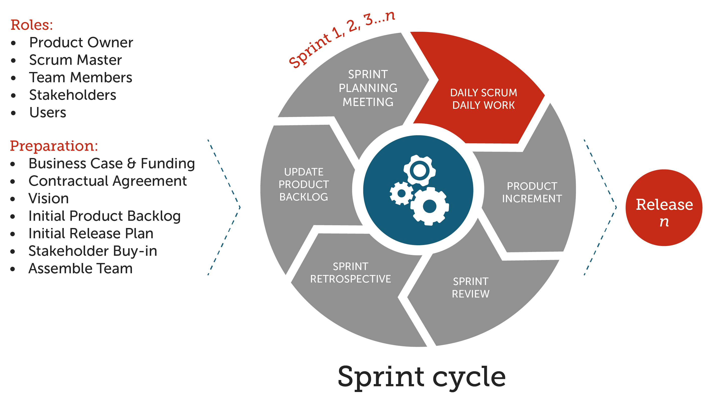
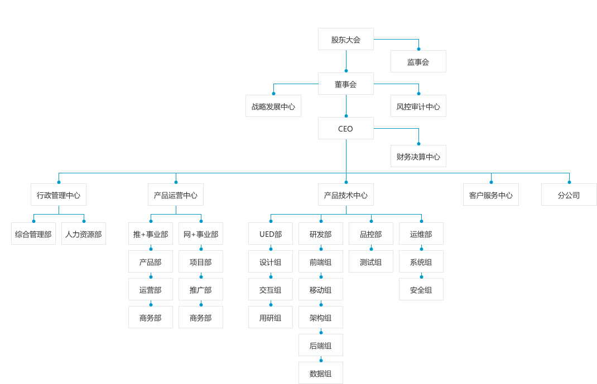
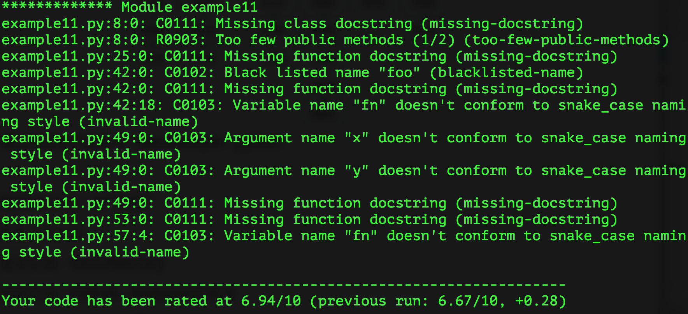
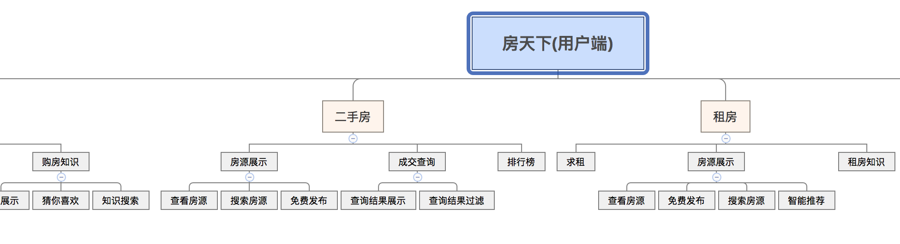
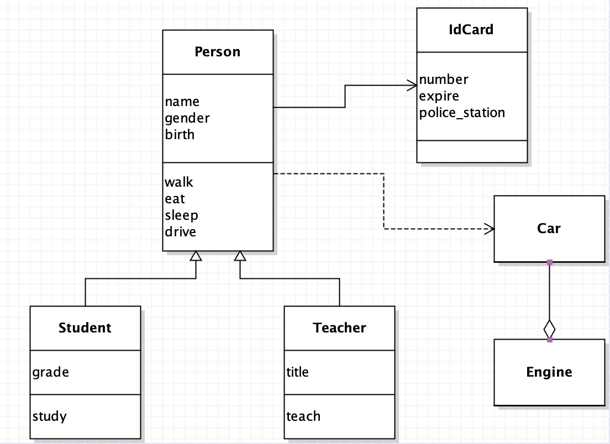
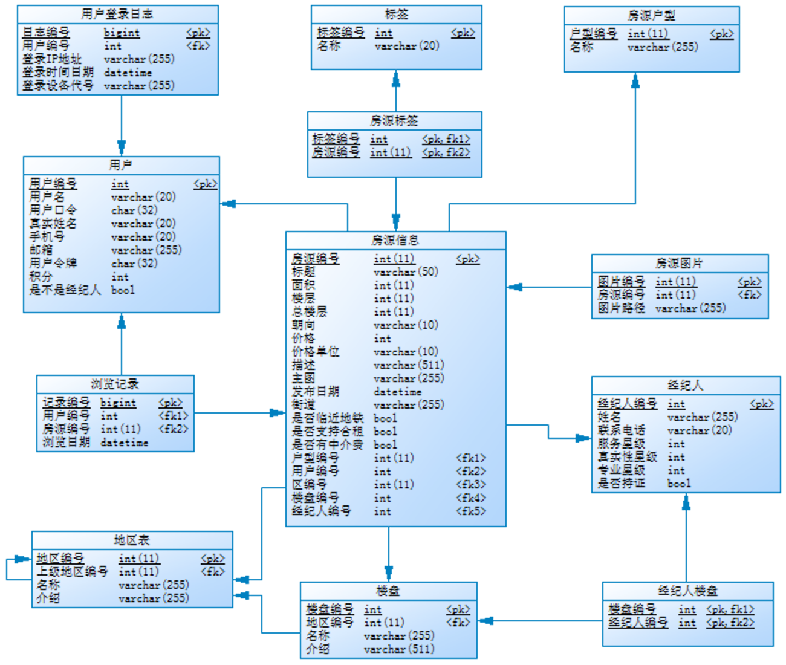

## Python - 100 Günde Acemiden Ustaya

> **Yazar**: 骆昊 (jackfrued)
>
> Bu repo, [jackfrued/Python-100-Days](https://github.com/jackfrued/Python-100-Days) projesinin Türkçe çevirisidir. Orijinal içerik Çince olup tüm hakları yazarına aittir. Bu çeviri, Python'u Türkçe öğrenmek isteyenler için hazırlanmıştır.
>
> **Translated to Turkish by** himmetcanumutlu

### Python'ın Uygulama Alanları ve Kariyer Gelişimi

Basitçe söylemek gerekirse Python "zarif", "açık" ve "basit" bir programlama dilidir.

 - Öğrenme eğrisi düşüktür, teknik olmayan kişiler bile kolayca başlayabilir
 - Açık kaynak bir sistemdir, güçlü bir ekosisteme sahiptir
 - Yorumlamalı bir dildir, platformlar arası taşınabilirliği mükemmeldir
 - Dinamik tipli bir dildir, nesne yönelimli ve fonksiyonel programlamayı destekler
 - Kod düzeni yüksektir, okunabilirliği güçlüdür

Python aşağıdaki alanlarda kullanılabilir.

 - Backend geliştirme - Python / Java / Go / PHP
 - DevOps - Python / Shell / Ruby
 - Veri toplama - Python / C++ / Java
 - Nicel ticaret (quant) - Python / C++ / R
 - Veri bilimi - Python / R / Julia / Matlab
 - Makine öğrenmesi - Python / R / C++ / Julia
 - Otomasyon testi - Python / Shell

Bir Python geliştiricisi olarak, ilgi alanlarına ve kariyer planına göre seçilebilecek iş alanları da oldukça fazladır.

- Python Backend Geliştiricisi (sunucu, bulut platformu, veri arayüzü)
- Python Operasyon Mühendisi (otomasyonlu operasyon, SRE, DevOps)
- Python Veri Analisti (veri analizi, iş zekâsı, dijital operasyon)
- Python Veri Bilimcisi (makine öğrenmesi, derin öğrenme, algoritma uzmanı)
- Python Web Scraping Mühendisi (bu alan önerilmez!!!)
- Python Test Mühendisi (otomasyon testi, test geliştirme)

> **Not**: Günümüzde **veri bilimi çok popüler bir alandır**, çünkü hem internet hem de geleneksel sektörler büyük miktarda veri biriktirmiştir. Her sektör, mevcut verilerden daha fazla ticari değer çıkaracak veri bilimcilerine ihtiyaç duyar; böylece kurumların kararlarına veri desteği sağlanır. Buna "veriye dayalı karar verme" denir.

Yeni başlayanlara birkaç tavsiye:

- **Make English as your working language.** (İngilizceyi çalışma diliniz yapın)
- **Practice makes perfect.** (Pratik mükemmelleştirir)
- **All experience comes from the mistakes you've made.** (Tüm deneyim, yaptığınız hatalardan gelir)
- **Don't be a freeloader.** (Sadece bedavacı olmayın, paylaşmayı öğrenin)
- **Embrace AI to boost your productivity.** (Verimliliği artırmak için yapay zekâyı kucaklayın)

### Gün 01~20 - Python Dilinin Temelleri

#### Gün 01 - [Python'la Tanışma](./Gun01-20/01.pythonla-tanisma.md)

1. Python'a Giriş
    - Python'un Tarihçesi
    - Python'un Avantajları ve Dezavantajları
    - Python'un Uygulama Alanları
2. Python Ortamını Kurmak
    - Windows Ortamı
    - macOS Ortamı

#### Gün 02 - [İlk Python Programı](./Gun01-20/02.ilk-python-programi.md)

1. Kod Yazma Araçları
2. Merhaba Dünya
3. Kodunuza Yorum Eklemek

#### Gün 03 - [Python Dilinde Değişkenler](./Gun01-20/03.python-dilinde-degiskenler.md)

1. Bazı Genel Bilgiler
2. Değişkenler ve Tipler
3. Değişken Adlandırma
4. Değişkenlerin Kullanımı

#### Gün 04 - [Python Dilinde Operatörler](./Gun01-20/04.python-dilinde-operatorler.md)

1. Aritmetik Operatörler
2. Atama Operatörleri
3. Karşılaştırma ve Mantıksal Operatörler
4. Operatörler ve İfadelerin Uygulaması
    - Fahrenheit-Celsius Sıcaklık Dönüşümü
    - Çemberin Çevresi ve Alanını Hesaplama
    - Artık Yıl Belirleme

#### Gün 05 - [Dallanma Yapısı](./Gun01-20/05.dallanma-yapisi.md)

1. if ve else ile Dallanma Yapısı Kurmak
2. match ve case ile Dallanma Yapısı Kurmak
3. Dallanma Yapısının Uygulamaları
    - Parçalı Fonksiyon Değerlendirme
    - 100'lük Notu Harfe Çevirme
    - Üçgenin Çevresini ve Alanını Hesaplama

#### Gün 06 - [Döngü Yapısı](./Gun01-20/06.dongu-yapisi.md)

1. for-in Döngüsü
2. while Döngüsü
3. break ve continue
4. İç İçe Döngüler
5. Döngü Yapısının Uygulamaları
    - Asal Sayı Belirleme
    - En Büyük Ortak Bölen
    - Sayı Tahmin Oyunu

#### Gün 07 - [Dallanma ve Döngü Yapısı Uygulamaları](./Gun01-20/07.dallanma-ve-dongu-uygulamasi.md)

1. Örnek 1: 100'e Kadar Asal Sayılar
2. Örnek 2: Fibonacci Dizisi
3. Örnek 3: Narsisistik (Armstrong) Sayıları Bulma
4. Örnek 4: 100 Para 100 Tavuk Problemi
5. Örnek 5: CRAPS Zar Oyunu

#### Gün 08 - [Yaygın Veri Yapıları: Liste-1](./Gun01-20/08.yaygin-veri-yapilari-liste-1.md)

1. Liste Oluşturmak
2. Liste İşlemleri
3. Elemanlar Üzerinde Gezinme

#### Gün 09 - [Yaygın Veri Yapıları: Liste-2](./Gun01-20/09.yaygin-veri-yapilari-liste-2.md)

1. Liste Metotları
    - Eleman Ekleme ve Silme
    - Eleman Konumu ve Sıklığı
    - Eleman Sıralama ve Ters Çevirme
2. Liste Anlama (Comprehension)
3. İç İçe Listeler
4. Listenin Uygulamaları

#### Gün 10 - [Yaygın Veri Yapıları: Demet (Tuple)](./Gun01-20/10.yaygin-veri-yapilari-demet.md)

1. Demetin Tanımı ve İşlemleri
2. Paketleme ve Çözme İşlemleri
3. Değişken Değerlerini Takas Etme
4. Demet ve Listenin Karşılaştırılması

#### Gün 11 - [Yaygın Veri Yapıları: String](./Gun01-20/11.yaygin-veri-yapilari-string.md)

1. String Tanımı
    - Kaçış Karakterleri
    - Ham (Raw) String
    - Karakterlerin Özel Gösterimi
2. String İşlemleri
    - Birleştirme ve Tekrarlama
    - Karşılaştırma İşlemleri
    - Üyelik İşlemleri
    - String Uzunluğunu Alma
    - İndeksleme ve Dilimleme
3. Karakterler Üzerinde Gezinme
4. String Metotları
    - Büyük/Küçük Harf İşlemleri
    - Arama İşlemleri
    - Özellik Kontrolü
    - Biçimlendirme
    - Kırpma İşlemleri
    - Değiştirme İşlemleri
    - Ayırma ve Birleştirme
    - Kodlama ve Kod Çözme
    - Diğer Metotlar

#### Gün 12 - [Yaygın Veri Yapıları: Küme (Set)](./Gun01-20/12.yaygin-veri-yapilari-kume.md)

1. Küme Oluşturmak
2. Elemanlar Üzerinde Gezinme
3. Küme İşlemleri
    - Üyelik İşlemleri
    - İkili İşlemler
    - Karşılaştırma İşlemleri
4. Küme Metotları
5. Değişmez Küme (Frozenset)

#### Gün 13 - [Yaygın Veri Yapıları: Sözlük (Dict)](./Gun01-20/13.yaygin-veri-yapilari-sozluk.md)

1. Sözlük Oluşturma ve Kullanma
2. Sözlük İşlemleri
3. Sözlük Metotları
4. Sözlüğün Uygulamaları

#### Gün 14 - [Fonksiyonlar ve Modüller](./Gun01-20/14.fonksiyonlar-ve-moduller.md)

1. Fonksiyon Tanımlama
2. Fonksiyon Parametreleri
    - Konumsal ve Anahtar Sözcük Parametreleri
    - Parametrelerin Varsayılan Değerleri
    - Değişken Sayıda Parametre
3. Fonksiyonları Modüllerle Yönetmek
4. Standart Kütüphanedeki Modüller ve Fonksiyonlar

#### Gün 15 - [Fonksiyon Uygulamaları](./Gun01-20/15.fonksiyon-uygulamalari.md)

1. Örnek 1: Rastgele Doğrulama Kodu
2. Örnek 2: Asal Sayı Belirleme
3. Örnek 3: EBOB ve EKOK
4. Örnek 4: Veri İstatistiği
5. Örnek 5: Çift Renkli Top Rastgele Seçimi

#### Gün 16 - [Fonksiyon Kullanımında İleri Seviye](./Gun01-20/16.fonksiyonlarda-ileri-seviye.md)

1. Yüksek Dereceli Fonksiyonlar
2. Lambda Fonksiyonları
3. Kısmi (Partial) Fonksiyonlar

#### Gün 17 - [Fonksiyonların İleri Uygulamaları](./Gun01-20/17.fonksiyonlarin-ileri-uygulamalari.md)

1. Dekoratörler
2. Özyinelemeli Çağrı

#### Gün 18 - [Nesne Yönelimli Programlamaya Giriş](./Gun01-20/18.nesne-yonelimli-programlamaya-giris.md)

1. Sınıf ve Nesne
2. Sınıf Tanımlama
3. Nesne Oluşturma ve Kullanma
4. Başlatıcı (__init__) Metodu
5. Nesne Yönelimli Programlamanın Temelleri
6. Nesne Yönelimli Programlama Örnekleri
    - Örnek 1: Dijital Saat
    - Örnek 2: Düzlemdeki Nokta

#### Gün 19 - [Nesne Yönelimli Programlamada İleri Seviye](./Gun01-20/19.nesne-yonelimli-programlama-ileri.md)

1. Görünürlük ve Özellik Dekoratörleri
2. Dinamik Özellikler
3. Statik Metotlar ve Sınıf Metotları
4. Kalıtım ve Çok Biçimlilik

#### Gün 20 - [Nesne Yönelimli Programlama Uygulamaları](./Gun01-20/20.nesne-yonelimli-programlama-uygulamalari.md)

1. Poker Oyunu
2. Maaş Hesaplama Sistemi

### Gün 21~30 - Python Dilinin Uygulamaları

#### Gün 21 - [Dosya Okuma/Yazma ve İstisna Yönetimi](./Gun21-30/21.dosya-okuma-yazma-ve-istisna-yonetimi.md)

1. Dosya Açma ve Kapatma
2. Metin Dosyası Okuma/Yazma
3. İstisna Yönetim Mekanizması
4. Bağlam Yöneticisi Sözdizimi
5. İkili (Binary) Dosya Okuma/Yazma

#### Gün 22 - [Nesnelerin Serileştirilmesi ve Serileştirmeden Çıkarılması](./Gun21-30/22.nesnelerin-serilestirilmesi.md)

1. JSON'a Genel Bakış
2. JSON Formatındaki Verileri Okuma/Yazma
3. Paket Yönetim Aracı pip
4. Ağ API'si ile Veri Alma

#### Gün 23 - [Python ile CSV Dosyası Okuma/Yazma](./Gun21-30/23.python-ile-csv-dosyasi.md)

1. CSV Dosyasına Giriş
2. CSV Dosyasına Veri Yazma
3. CSV Dosyasından Veri Okuma

#### Gün 24 - [Python ile Excel Dosyası Okuma/Yazma-1](./Gun21-30/24.python-ile-excel-1.md)

1. Excel'e Giriş
2. Excel Dosyası Okuma
3. Excel Dosyası Yazma
4. Stil Ayarlama
5. Formül Hesaplama

#### Gün 25 - [Python ile Excel Dosyası Okuma/Yazma-2](./Gun21-30/25.python-ile-excel-2.md)

1. Excel'e Giriş
2. Excel Dosyası Okuma
3. Excel Dosyası Yazma
4. Stil Ayarlama
5. İstatistik Grafiği Oluşturma

#### Gün 26 - [Python ile Word ve PowerPoint Dosyaları](./Gun21-30/26.python-ile-word-ve-powerpoint.md)

1. Word Belgesi ile Çalışmak
2. PowerPoint Oluşturmak

#### Gün 27 - [Python ile PDF Dosyaları](./Gun21-30/27.python-ile-pdf-dosyalari.md)

1. PDF'ten Metin Çıkarma
2. Sayfa Döndürme ve Üst Üste Bindirme
3. PDF Dosyasını Şifreleme
4. Toplu Filigran Ekleme
5. PDF Dosyası Oluşturma

#### Gün 28 - [Python ile Görüntü İşleme](./Gun21-30/28.python-ile-goruntu-isleme.md)

1. Temel Bilgiler
2. Pillow ile Görüntü İşleme
3. Pillow ile Çizim

#### Gün 29 - [Python ile E-posta ve SMS Gönderme](./Gun21-30/29.python-ile-eposta-ve-sms.md)

1. E-posta Gönderme
2. SMS Gönderme

#### Gün 30 - [Düzenli İfadelerin Uygulamaları](./Gun21-30/30.duzenli-ifadelerin-uygulamalari.md)

1. Düzenli İfadelerle İlgili Bilgiler
2. Python'ın Düzenli İfade Desteği
    - Örnek 1: Girdi Doğrulama
    - Örnek 2: İçerik Çıkarma
    - Örnek 3: İçerik Değiştirme
    - Örnek 4: Uzun Cümleyi Bölme

### Gün 31~35 - Diğer İlgili Konular

#### [Python Dilinde İleri Seviye](./Gun31-35/31.python-dilinde-ileri-seviye.md)

1. Önemli Bilgi Noktaları
2. Veri Yapıları ve Algoritmalar
3. Fonksiyon Kullanım Biçimleri
4. Nesne Yönelimli Programlama Bilgileri
5. Yineleyiciler ve Üreteçler
6. Eş Zamanlı Programlama

#### [Web Ön Yüzüne Giriş](./Gun31-35/32-33.web-on-yuzune-giris.md)

1. HTML Etiketleriyle Sayfa İçeriğini Taşımak
2. CSS ile Sayfayı Biçimlendirmek
3. JavaScript ile Etkileşimli Davranışlar
4. Ön Yüz Framework'leri
    - Vue.js
    - Element
    - ECharts
    - Bulma
    - Bootstrap

#### [Linux İşletim Sistemini Keşfetmek](./Gun31-35/34-35.linux-isletim-sistemi.md)

1. İşletim Sistemi Tarihi ve Linux'a Genel Bakış
2. Temel Linux Komutları
3. Linux'taki Yardımcı Programlar
4. Linux Dosya Sistemi
5. Vim Editörü Uygulamaları
6. Ortam Değişkenleri ve Shell Programlama
7. Yazılım Kurulumu ve Servis Yapılandırması
8. Ağ Erişimi ve Yönetimi
9. Diğer İlgili Konular

### Gün 36~45 - Veritabanı Temelleri ve İleri Seviye

#### Gün 36 - [İlişkisel Veritabanları ve MySQL'e Genel Bakış](./Gun36-45/36.iliskisel-veritabanlari-ve-mysql.md)

1. İlişkisel Veritabanlarına Genel Bakış
2. MySQL'e Giriş
3. MySQL Kurulumu
4. Temel MySQL Komutları

#### Gün 37 - [SQL Detayları: DDL](./Gun36-45/37.sql-detaylari-ddl.md)

1. Veritabanı ve Tablo Oluşturma
2. Tablo Silme ve Değiştirme

#### Gün 38 - [SQL Detayları: DML](./Gun36-45/38.sql-detaylari-dml.md)

1. insert İşlemi
2. delete İşlemi
3. update İşlemi

#### Gün 39 - [SQL Detayları: DQL](./Gun36-45/39.sql-detaylari-dql.md)

1. İzdüşüm ve Takma Ad (Alias)
2. Veri Filtreleme
3. Null Değer İşleme
4. Yinelenenleri Kaldırma
5. Sıralama
6. Toplama (Aggregate) Fonksiyonları
7. İç İçe Sorgular
8. Gruplama İşlemleri
9. Tablo Birleştirme
    - Kartezyen Çarpım
    - İç Birleştirme (INNER JOIN)
    - Doğal Birleştirme (NATURAL JOIN)
    - Dış Birleştirme (OUTER JOIN)
10. Pencere Fonksiyonları
    - Pencere Tanımlama
    - Sıralama Fonksiyonları
    - Veri Alma Fonksiyonları

#### Gün 40 - [SQL Detayları: DCL](./Gun36-45/40.sql-detaylari-dcl.md)

1. Kullanıcı Oluşturma
2. Yetki Verme
3. Yetki Geri Alma

#### Gün 41 - [MySQL'in Yeni Özellikleri](./Gun36-45/41.mysql-yeni-ozellikleri.md)

- JSON Tipi
- Pencere Fonksiyonları
- Ortak Tablo İfadeleri (CTE)

#### Gün 42 - [View, Fonksiyon ve Prosedür](./Gun36-45/42.view-fonksiyon-ve-prosedur.md)

1. View (Görünüm)
    - Kullanım Senaryoları
    - View Oluşturma
    - Kullanım Kısıtlamaları
2. Fonksiyonlar
    - Yerleşik Fonksiyonlar
    - Kullanıcı Tanımlı Fonksiyonlar (UDF)
3. Prosedürler
    - Prosedür Oluşturma
    - Prosedür Çağırma

#### Gün 43 - [İndeks (Index)](./Gun36-45/43.indeks.md)

1. Yürütme Planı
2. İndeksin Çalışma Prensibi
3. İndeks Oluşturma
    - Normal İndeks
    - Benzersiz İndeks
    - Önek İndeksi
    - Bileşik İndeks
4. Dikkat Edilmesi Gerekenler

#### Gün 44 - [Python'ı MySQL Veritabanına Bağlama](./Gun36-45/44.python-ile-mysql-veritabani.md)

1. Üçüncü Taraf Kütüphane Kurulumu
2. Bağlantı Oluşturma
3. İmleç (Cursor) Alma
4. SQL Komutu Çalıştırma
5. İmleç ile Veri Çekme
6. Transaction Commit ve Rollback
7. Bağlantıyı Serbest Bırakma
8. ETL Betiği Yazma

#### Gün 45 - [Hive Uygulamaları](./Gun36-45/45.hive-uygulamalari.md)

1. Hive'a Genel Bakış
2. Ortam Kurulumu
3. Yaygın Komutlar
4. Temel Sözdizimi
5. Tablo Oluşturma
6. Veri Yazma
7. Yaygın Fonksiyonlar
8. Gruplama ve Toplama
9. Örnekleme İşlemleri
10. Sıralama İşlemleri
11. Yatay Açılım (Lateral View)
12. Performans Optimizasyonu

### Gün 46~60 - Django ile Uygulamalı Geliştirme

#### Gün 46 - [Django'ya Hızlı Başlangıç](./Gun46-60/46.django-hizli-baslangic.md)

1. Web Uygulamalarının Çalışma Mekanizması
2. HTTP İstek ve Yanıt
3. Django Framework'e Genel Bakış
4. 5 Dakikada Hızlı Başlangıç

#### Gün 47 - [Modelleri Derinlemesine İncelemek](./Gun46-60/47.modelleri-derinlemesine.md)

1. İlişkisel Veritabanı Yapılandırması
2. ORM ile Model CRUD İşlemleri
3. Yönetim Panelinin Kullanımı
4. Django Model En İyi Uygulamaları
5. Model Tanımı Referansı

#### Gün 48 - [Statik Kaynaklar ve Ajax İstekleri](./Gun46-60/48.statik-kaynaklar-ve-ajax.md)

1. Statik Kaynakları Yükleme
2. Ajax'a Genel Bakış
3. Ajax ile Oylama Özelliği

#### Gün 49 - [Cookie ve Session](./Gun46-60/49.cookie-ve-session.md)

1. Kullanıcı Takibi
2. Cookie ve Session İlişkisi
3. Django Framework'ün Session Desteği
4. View Fonksiyonlarında Cookie Okuma/Yazma

#### Gün 50 - [Raporlar ve Loglama](./Gun46-60/50.raporlar-ve-loglama.md)

1. `HttpResponse` ile Yanıt Başlığını Değiştirme
2. `StreamingHttpResponse` ile Büyük Dosya İşleme
3. `xlwt` ile Excel Raporu Oluşturma
4. `reportlab` ile PDF Raporu Oluşturma
5. ECharts ile Ön Yüz Grafiği Oluşturma

#### Gün 51 - [Loglama ve Hata Ayıklama Araç Çubuğu](./Gun46-60/51.loglama-ve-debug-toolbar.md)

1. Loglama Yapılandırması
2. Django-Debug-Toolbar Yapılandırması
3. ORM Kodunu Optimize Etme

#### Gün 52 - [Middleware Uygulamaları](./Gun46-60/52.middleware-uygulamalari.md)

1. Middleware Nedir
2. Django Framework'ün Yerleşik Middleware'leri
3. Özel Middleware ve Uygulama Senaryoları

#### Gün 53 - [Ön/Arka Uç Ayrımına Giriş](./Gun46-60/53.on-arka-uc-ayrimina-giris.md)

1. JSON Formatında Veri Döndürme
2. Vue.js ile Sayfa Render Etme

#### Gün 54 - [RESTful Mimari ve DRF'e Giriş](./Gun46-60/54.restful-mimari-ve-drf-giris.md)

1. REST'e Genel Bakış
2. DRF Kütüphanesine Giriş
3. Ön/Arka Uç Ayrımıyla Geliştirme
4. JWT Uygulamaları

#### Gün 55 - [RESTful Mimari ve DRF'te İleri Seviye](./Gun46-60/55.restful-mimari-ve-drf-ileri.md)

1. CBV Kullanımı
2. Veri Sayfalama (Pagination)
3. Veri Filtreleme

#### Gün 56 - [Önbellek Kullanımı](./Gun46-60/56.onbellek-kullanimi.md)

1. Web Sitesi Optimizasyonunun Birinci Yasası
2. Django Projesinde Redis ile Önbellek Servisi
3. View Fonksiyonlarında Önbellek Okuma/Yazma
4. Dekoratör ile Sayfa Önbelleği
5. Veri Arayüzüne Önbellek Servisi

#### Gün 57 - [Üçüncü Taraf Platform Entegrasyonu](./Gun46-60/57.ucuncu-taraf-platform-entegrasyonu.md)

1. Dosya Yükleme Form Kontrolü ve Görsel Önizleme
2. Sunucu Tarafında Yüklenen Dosyanın İşlenmesi

#### Gün 58 - [Asenkron Görevler ve Zamanlanmış Görevler](./Gun46-60/58.asenkron-ve-zamanlanmis-gorevler.md)

1. Web Sitesi Optimizasyonunun İkinci Yasası
2. Mesaj Kuyruğu Servisini Yapılandırma
3. Projede Celery ile Görev Asenkronlaştırma
4. Projede Celery ile Zamanlanmış Görevler

#### Gün 59 - [Birim Testi](./Gun46-60/59.birim-testi.md)

> Bu günün ayrıntılı içeriği için bkz. [Gün 95 - Django ile Ticari Proje Geliştirme](./Gun91-100/95.django-ile-ticari-proje.md).

#### Gün 60 - [Projeyi Yayına Alma](./Gun46-60/60.projeyi-yayina-alma.md)

1. Python'da Birim Testi
2. Django Framework'ün Birim Testi Desteği
3. Sürüm Kontrol Sistemi Kullanımı
4. uWSGI Yapılandırma ve Kullanımı
5. Statik/Dinamik Ayrımı ve Nginx Yapılandırması
6. HTTPS Yapılandırması
7. Alan Adı Çözümleme Yapılandırması

### Gün 61~65 - Ağdan Veri Toplama (Web Scraping)

#### Gün 61 - [Ağdan Veri Toplamaya Genel Bakış](./Gun61-65/61.agdan-veri-toplamaya-genel-bakis.md)

1. Web Scraping Kavramı ve Uygulama Alanları
2. Web Scraping'in Yasal Boyutu
3. Web Scraping Araçları
4. Bir Scraping Programının Bileşenleri

#### Gün 62 - Veri Çekme ve Ayrıştırma

1. [`requests` Kütüphanesiyle Veri Çekme](./Gun61-65/62.python-ile-ag-kaynaklari-1.md)
2. [Sayfa Ayrıştırmanın Üç Yolu](./Gun61-65/62.python-ile-html-ayristirma-2.md)
    - Düzenli İfade ile Ayrıştırma
    - XPath ile Ayrıştırma
    - CSS Seçici ile Ayrıştırma


#### Gün 63 - Python'da Eş Zamanlı Programlama

1. [Çoklu İş Parçacığı](./Gun61-65/63.python-es-zamanli-programlama-1.md)
2. [Çoklu İşlem](./Gun61-65/63.python-es-zamanli-programlama-2.md)
3. [Asenkron I/O](./Gun61-65/63.python-es-zamanli-programlama-3.md)

#### Gün 64 - [Selenium ile Dinamik İçerik Çekme](./Gun61-65/64.selenium-ile-dinamik-icerik.md)

1. Selenium Kurulumu
2. Sayfa Yükleme
3. Eleman Bulma ve Kullanıcı Davranışını Taklit Etme
4. Örtük ve Açık Bekleme
5. JavaScript Kodu Çalıştırma
6. Selenium Anti-Scraping Engeli Aşma
7. Başsız (Headless) Tarayıcı Kurma

#### Gün 65 - [Scraping Framework'ü Scrapy'e Giriş](./Gun61-65/65.scrapy-framework-giris.md)

1. Scrapy'nin Temel Bileşenleri
2. Scrapy İş Akışı
3. Scrapy Kurulumu ve Proje Oluşturma
4. Örümcek (Spider) Programı Yazma
5. Middleware ve Pipeline Yazma
6. Scrapy Yapılandırma Dosyası

### Gün 66~80 - Python ile Veri Analizi

#### Gün 66 - [Veri Analizine Genel Bakış](./Gun66-80/66.veri-analizine-genel-bakis.md)

1. Veri Analistinin Sorumlulukları
2. Veri Analistinin Beceri Seti
3. Veri Analiziyle İlgili Kütüphaneler

#### Gün 67 - [Ortam Hazırlığı](./Gun66-80/67.ortam-hazirligi.md)

1. Anaconda Kurulumu ve Kullanımı
    - conda İlgili Komutlar
2. jupyter-lab Kurulumu ve Kullanımı
    - Kurulum ve Başlatma
    - Kullanım İpuçları

#### Gün 68 - [NumPy Uygulamaları-1](./Gun66-80/68.numpy-uygulamalari-1.md)

1. Dizi (Array) Nesnesi Oluşturma
2. Dizi Nesnesinin Özellikleri
3. Dizi Nesnesinin İndeks İşlemleri
    - Normal İndeksleme
    - Fancy İndeksleme
    - Boolean İndeksleme
    - Dilim İndeksleme
4. Örnek: Dizilerle Görüntü İşleme

#### Gün 69 - [NumPy Uygulamaları-2](./Gun66-80/69.numpy-uygulamalari-2.md)

1. Dizi Nesnesinin İlgili Metotları
    - Tanımlayıcı İstatistik Bilgilerini Alma
    - Diğer İlgili Metotlar

#### Gün 70 - [NumPy Uygulamaları-3](./Gun66-80/70.numpy-uygulamalari-3.md)

1. Dizi İşlemleri
    - Dizi ile Skaler İşlemler
    - Dizi ile Dizi İşlemleri
2. Evrensel Tekli Fonksiyonlar
3. Evrensel İkili Fonksiyonlar
4. Yayın (Broadcasting) Mekanizması
5. NumPy'nin Yaygın Fonksiyonları

#### Gün 71 - [NumPy Uygulamaları-4](./Gun66-80/71.numpy-uygulamalari-4.md)

1. Vektör
2. Determinant
3. Matris
4. Polinom

#### Gün 72 - [pandas'ı Derinlemesine İncelemek-1](./Gun66-80/72.pandas-1.md)

1. Series Nesnesi Oluşturma
2. Series Nesnesinin İşlemleri
3. Series Nesnesinin Özellikleri ve Metotları

#### Gün 73 - [pandas'ı Derinlemesine İncelemek-2](./Gun66-80/73.pandas-2.md)

1. DataFrame Nesnesi Oluşturma
2. DataFrame Nesnesinin Özellikleri ve Metotları
3. DataFrame'de Veri Okuma/Yazma

#### Gün 74 - [pandas'ı Derinlemesine İncelemek-3](./Gun66-80/74.pandas-3.md)

1. Veriyi Yeniden Şekillendirme
    - Veri Birleştirme (Concat)
    - Veri Eşleştirme (Merge)
2. Veri Temizliği
    - Eksik Değerler
    - Yinelenen Değerler
    - Aykırı Değerler
    - Ön İşleme

#### Gün 75 - [pandas'ı Derinlemesine İncelemek-4](./Gun66-80/75.pandas-4.md)

1. Pivot Tablolar
    - Tanımlayıcı İstatistik Bilgilerini Alma
    - Sıralama ve İlk Değerler
    - Gruplama ve Toplama
    - Pivot Tablo ve Çapraz Tablo
2. Veri Sunumu

#### Gün 76 - [pandas'ı Derinlemesine İncelemek-5](./Gun66-80/76.pandas-5.md)

1. Yıllık ve Aylık Değişim Hesaplama
2. Pencere Hesaplamaları
3. Korelasyon Belirleme

#### Gün 77 - [pandas'ı Derinlemesine İncelemek-6](./Gun66-80/77.pandas-6.md)

1. İndeks Kullanımı
    - Aralık İndeksi
    - Kategorik İndeks
    - Çok Seviyeli İndeks
    - Aralıklı (Interval) İndeks
    - Tarih-Saat İndeksi

#### Gün 78 - [Veri Görselleştirme-1](./Gun66-80/78.veri-gorsellestirme-1.md)

1. matplotlib Kurulumu ve İçe Aktarımı
2. Kanvas (Canvas) Oluşturma
3. Koordinat Sistemi Oluşturma
4. Grafik Çizme
    - Çizgi Grafiği
    - Dağılım Grafiği
    - Sütun Grafiği
    - Pasta Grafiği
    - Histogram
    - Kutu Grafiği
5. Grafiği Gösterme ve Kaydetme

#### Gün 79 - [Veri Görselleştirme-2](./Gun66-80/79.veri-gorsellestirme-2.md)

1. İleri Seviye Grafikler
    - Baloncuk Grafiği
    - Alan Grafiği
    - Radar Grafiği
    - Gül (Rose) Grafiği
    - 3B Grafikler

#### Gün 80 - [Veri Görselleştirme-3](./Gun66-80/80.veri-gorsellestirme-3.md)

1. Seaborn
2. Pyecharts

### Gün 81~90 - Makine Öğrenmesi

#### Gün 81 - [Makine Öğrenmesine Giriş](./Gun81-90/81.makine-ogrenmesine-giris.md)

1. Yapay Zekânın Tarihi
2. Makine Öğrenmesi Nedir
3. Makine Öğrenmesinin Uygulama Alanları
4. Makine Öğrenmesinin Sınıflandırılması
5. Makine Öğrenmesinin Adımları
6. İlk Makine Öğrenmesi Deneyimi

#### Gün 82 - [k-En Yakın Komşu (kNN) Algoritması](./Gun81-90/82.knn-algoritmasi.md)

1. Uzaklık Ölçümü
2. Veri Kümesine Giriş
3. kNN Sınıflandırmasının Uygulanması
4. Model Değerlendirme
5. Parametre Optimizasyonu
6. kNN Regresyonunun Uygulanması

#### Gün 83 - [Karar Ağaçları ve Rastgele Orman](./Gun81-90/83.karar-agaclari-ve-rastgele-orman.md)

1. Karar Ağacının Oluşturulması
    - Özellik Seçimi
    - Veri Bölme
    - Ağaç Budama
2. Karar Ağacı Modelinin Uygulanması
3. Rastgele Ormana Genel Bakış

#### Gün 84 - [Naive Bayes Algoritması](./Gun81-90/84.naive-bayes.md)

1. Bayes Teoremi
2. Naive Bayes
3. Algoritmanın Prensibi
    - Eğitim Aşaması
    - Tahmin Aşaması
    - Kod Uygulaması
4. Algoritmanın Avantaj ve Dezavantajları

#### Gün 85 - [Regresyon Modelleri](./Gun81-90/85.regresyon-modelleri.md)

1. Regresyon Modellerinin Sınıflandırılması
2. Regresyon Katsayılarının Hesaplanması
3. Yeni Veri Kümesine Giriş
4. Doğrusal Regresyon Kod Uygulaması
5. Regresyon Modelinin Değerlendirilmesi
6. Düzenlileştirme Terimi Ekleme
7. Doğrusal Regresyonun Alternatif Uygulaması
8. Polinom Regresyon
9. Lojistik Regresyon

#### Gün 86 - [K-Means Kümeleme Algoritması](./Gun81-90/86.k-means-kumeleme.md)

1. Algoritmanın Prensibi
2. Matematiksel Açıklama
3. Kod Uygulaması

#### Gün 87 - [Topluluk Öğrenmesi Algoritmaları](./Gun81-90/87.topluluk-ogrenmesi.md)

1. Algoritma Sınıflandırması
2. AdaBoost
3. GBDT
4. XGBoost
5. LightGBM

#### Gün 88 - [Sinir Ağı Modelleri](./Gun81-90/88.sinir-agi-modelleri.md)

1. Temel Bileşenler
2. Çalışma Prensibi
3. Kod Uygulaması
4. Modelin Avantaj ve Dezavantajları

#### Gün 89 - [Doğal Dil İşlemeye Giriş](./Gun81-90/89.dogal-dil-islemeye-giris.md)

1. Kelime Çantası (Bag-of-Words) Modeli
2. Kelime Vektörleri
3. NPLM ve RNN
4. Seq2Seq
5. Transformer

#### Gün 90 - [Makine Öğrenmesi Uygulaması](./Gun81-90/90.makine-ogrenmesi-uygulamasi.md)

1. Veri Keşfi
2. Özellik Mühendisliği
3. Model Eğitimi
4. Model Değerlendirme
5. Model Dağıtımı

### Gün 91~99 - [Takım Projesi Geliştirme](./Gun91-100)

#### 91. Gün: [Takım Projesi Geliştirmede Sorunlar ve Çözümler](./Gun91-100/91.takim-projesi-sorunlar-ve-cozumler.md)

1. Yazılım Süreç Modelleri
   - Klasik Süreç Modeli (Şelale Modeli)
     - Fizibilite Analizi (yapılıp yapılmayacağını araştırmak), çıktı: 《Fizibilite Analizi Raporu》.
     - Gereksinim Analizi (ne yapılacağını araştırmak), çıktı: 《Gereksinim Belirtim Dokümanı》 ve ürün arayüzü prototipi.
     - Ön ve Ayrıntılı Tasarım, çıktı: kavramsal model diyagramı (ER diyagramı), fiziksel model diyagramı, sınıf diyagramı, zamanlama diyagramı vb.
     - Kodlama / Test.
     - Yayına Alma / Bakım.

     Şelale modelinin en büyük dezavantajı, gereksinim değişikliklerini karşılayamamasıdır; ürünü görmek için tüm sürecin bitmesi gerekir, bu da takım moralini düşürür.
   - Çevik Geliştirme (Scrum) - Ürün Sahibi, Scrum Master, Geliştiriciler - Sprint
     - Ürün Backlog'u (kullanıcı hikâyeleri, ürün prototipi).
     - Planlama Toplantısı (değerlendirme ve bütçeleme).
     - Günlük Geliştirme (ayakta toplantı, Pomodoro tekniği, ikili programlama, önce test, kod yeniden düzenleme...).
     - Hata düzeltme (sorun açıklaması, yeniden üretme adımları, testçi, atanan kişi).
     - Sürüm yayınlama.
     - İnceleme Toplantısı (Showcase, kullanıcı katılımı gerekir).
     - Retrospektif Toplantısı (mevcut iterasyonun özeti).

     > Ek: Çevik Yazılım Geliştirme Manifestosu
     >
     > - **Bireyler ve etkileşim**, süreçler ve araçlardan önce gelir
     > - **Çalışan yazılım**, kapsamlı dokümantasyondan önce gelir
     > - **Müşteri iş birliği**, sözleşme müzakeresinden önce gelir
     > - **Değişime yanıt vermek**, bir plana bağlı kalmaktan önce gelir

     

     > Roller: Ürün Sahibi (ne yapılacağına karar verir, gereksinimlerde son sözü söyler), Takım Lideri (çeşitli sorunları çözer, daha iyi çalışmaya odaklanır, dış etkileri geliştirme ekibinden uzak tutar), Geliştirme Ekibi (proje yürütücüleri; geliştiriciler ve testçiler).

     > Hazırlık: iş senaryosu ve fon, sözleşme, vizyon, başlangıç ürün gereksinimleri, başlangıç yayın planı, katılım, ekip kurma.

     >  Çevik ekipler genellikle 8-10 kişidir.

     >  İş yükü tahmini: geliştirme görevlerini nicelleştirmek; prototip, Logo tasarımı, UI tasarımı, ön yüz geliştirme vb. dahil olmak üzere her işi mümkün olan en küçük göreve bölün. En küçük görev standardı, çalışma süresinin iki günü geçmemesidir; sonra toplam proje süresi tahmin edilir. Her görev panoya yapıştırılır; pano üç bölüme ayrılır: to do (yapılacak), in progress (devam ediyor) ve done (tamamlandı).

2. Proje Ekibi Kurma

   - Ekibin Yapısı ve Roller

     

   - Kodlama Standartları ve Kod İnceleme (`flake8`, `pylint`)

     

   - Python'daki Bazı "Alışkanlıklar" (bkz. [《Python Alışkanlıkları - Pythonic Kod Nasıl Yazılır》](./ekstralar/python-programlama-aliskanliklari.md))

   - Kod Okunabilirliğini Etkileyen Nedenler:

     - Kod yorumlarının çok az olması veya hiç olmaması
     - Kodun dilin en iyi uygulamalarını ihlal etmesi
     - Anti-pattern programlama (spagetti kod, kopyala-yapıştır programlama, kibirli programlama, ...)
  
3. Takım Geliştirme Araçlarına Giriş
   - Sürüm Kontrolü: Git, Mercurial
   - Hata Yönetimi: [Gitlab](https://about.gitlab.com/), [Redmine](http://www.redmine.org.cn/)
   - Çevik Döngü Araçları: [ZenTao](https://www.zentao.net/), [JIRA](https://www.atlassian.com/software/jira/features)
   - Sürekli Entegrasyon: [Jenkins](https://jenkins.io/), [Travis-CI](https://travis-ci.org/)

   bkz. [《Takım Projesi Geliştirmede Sorunlar ve Çözümler》](./Gun91-100/91.takim-projesi-sorunlar-ve-cozumler.md).

##### Proje Konusu Seçimi ve İş Alanını Anlamak

1. Konu Kapsamını Belirleme

   - CMS (kullanıcı tarafı): haber toplama sitesi, soru-cevap/paylaşım topluluğu, film/kitap inceleme sitesi vb.
   - MIS (kullanıcı + yönetim tarafı): KMS, KPI değerlendirme sistemi, HRS, CRM sistemi, tedarik zinciri sistemi, depo yönetim sistemi vb.

   - Uygulama Backend'i (yönetim + veri arayüzü): ikinci el alım satım, gazete/dergi, niş e-ticaret, haber, turizm, sosyal, okuma vb.
   - Diğer türler: kendi sektör geçmişi ve iş deneyimi; işin kolay anlaşılır ve kontrol edilebilir olması.

2. Gereksinim Anlama, Modül Ayırma ve Görev Dağıtımı

   - Gereksinim Anlama: beyin fırtınası ve rakip analizi.
   - Modül Ayırma: zihin haritası çizme (XMind); her modül bir dal düğümü, her somut işlev bir yaprak düğümüdür (fiil ile ifade edilir). Her yaprak düğümün yeni düğüm üretemeyeceğinden emin olunmalı; her yaprak düğümün önemi, önceliği ve iş yükü belirlenir.
   - Görev Dağıtımı: proje lideri, yukarıdaki göstergelere göre her ekip üyesine görev atar.

   

3. Proje İlerleme Tablosu Oluşturma (günlük güncelleme)

   | Modül | İşlev     | Kişi   | Durum     | Tamamlanma | İş Süresi | Planlanan Başlangıç | Gerçek Başlangıç | Planlanan Bitiş | Gerçek Bitiş | Not             |
   | ---- | -------- | ------ | -------- | ---- | ---- | -------- | -------- | -------- | -------- | ---------------- |
   | Yorum | Yorum ekle | 王大锤 | Devam ediyor | 50%  | 4    | 2018/8/7 |          | 2018/8/7 |          |                  |
   |      | Yorum sil | 王大锤 | Bekliyor     | 0%   | 2    | 2018/8/7 |          | 2018/8/7 |          |                  |
   |      | Yorum görüntüle | 白元芳 | Devam ediyor | 20%  | 4    | 2018/8/7 |          | 2018/8/7 |          | Kod incelemesi gerekli |
   |      | Yorum oylama | 白元芳 | Bekliyor     | 0%   | 4    | 2018/8/8 |          | 2018/8/8 |          |                  |

4. OOAD ve Veritabanı Tasarımı

  - UML (Birleşik Modelleme Dili) sınıf diyagramı

    

  - Modelden tablo oluşturma (ileri mühendislik); örneğin bir Django projesinde aşağıdaki komutlarla iki boyutlu tablo oluşturulabilir.

    ```Shell
    python manage.py makemigrations app
    python manage.py migrate
    ```

  - PowerDesigner ile fiziksel model diyagramı çizme.

    

  - Veri tablosundan model oluşturma (tersine mühendislik); örneğin bir Django projesinde aşağıdaki komutla model üretilebilir.

    ```Shell
    python manage.py inspectdb > app/models.py
    ```

#### 92. Gün: [Docker Konteyner Teknolojisi Detayları](./Gun91-100/92.docker-konteyner-teknolojisi.md)

1. Docker'a Giriş
2. Docker Kurulumu
3. Docker ile Konteyner Oluşturma (Nginx, MySQL, Redis, Gitlab, Jenkins)
4. Docker İmajı Oluşturma (Dockerfile yazımı ve ilgili komutlar)
5. Konteyner Düzenleme (Docker-compose)
6. Küme Yönetimi (Kubernetes)

#### 93. Gün: [MySQL Performans Optimizasyonu](./Gun91-100/93.mysql-performans-optimizasyonu.md)

1. Temel İlkeler
2. InnoDB Motoru
3. İndeks Kullanımı ve Dikkat Edilmesi Gerekenler
4. Veri Bölümleme (Partition)
5. SQL Optimizasyonu
6. Yapılandırma Optimizasyonu
7. Mimari Optimizasyon

#### 94. Gün: [Ağ API Arayüzü Tasarımı](./Gun91-100/94.ag-api-arayuzu-tasarimi.md)

1. Tasarım İlkeleri
    - Kritik Sorunlar
    - Diğer Sorunlar
2. Dokümantasyon Yazımı

#### 95. Gün: [Django ile Ticari Proje Geliştirme](./Gun91-100/95.django-ile-ticari-proje.md)

##### Proje Geliştirmede Ortak Sorunlar

1. Veritabanı Yapılandırması (çoklu veritabanı, master-slave replikasyon, veritabanı yönlendirme)
2. Önbellek Yapılandırması (bölümlü önbellek, anahtar ayarı, zaman aşımı ayarı, master-slave replikasyon, hata kurtarma (sentinel))
3. Loglama Yapılandırması
4. Analiz ve Hata Ayıklama (Django-Debug-ToolBar)
5. Kullanışlı Python Modülleri (tarih hesaplama, görüntü işleme, veri şifreleme, üçüncü taraf API)

##### REST API Tasarımı

1. RESTful Mimari
   - [RESTful Mimariyi Anlamak](http://www.ruanyifeng.com/blog/2011/09/restful.html)
   - [RESTful API Tasarım Rehberi](http://www.ruanyifeng.com/blog/2014/05/restful_api.html)
   - [RESTful API En İyi Uygulamaları](http://www.ruanyifeng.com/blog/2018/10/restful-api-best-practices.html)
2. API Arayüz Dokümantasyonu Yazımı
   - [RAP2](http://rap2.taobao.org/)
   - [YAPI](http://yapi.demo.qunar.com/)
3. [django-REST-framework](https://www.django-rest-framework.org/) Uygulamaları

##### Projedeki Önemli ve Zor Noktaların Analizi

1. Önbellek ile Veritabanı Yükünü Azaltma - Redis
2. Mesaj Kuyruğu ile Decoupling ve Trafik Sönümleme - Celery + RabbitMQ

#### 96. Gün: [Yazılım Testi ve Otomasyon Testi](./Gun91-100/96.yazilim-testi-ve-otomasyon.md)

##### Birim Testi

1. Test Türleri
2. Birim Testi Yazma (`unittest`, `pytest`, `nose2`, `tox`, `ddt`, ...)
3. Test Kapsamı (`coverage`)

##### Django Projesini Dağıtma

1. Dağıtım Öncesi Hazırlık
   - Kritik Ayarlar (SECRET_KEY / DEBUG / ALLOWED_HOSTS / önbellek / veritabanı)
   - HTTPS / CSRF_COOKIE_SECURE  / SESSION_COOKIE_SECURE  
   - Loglama ile İlgili Yapılandırma
2. Yaygın Linux Komutlarına Bakış
3. Yaygın Linux Servislerinin Kurulumu ve Yapılandırılması
4. uWSGI/Gunicorn ve Nginx Kullanımı
   - Gunicorn ve uWSGI Karşılaştırması
     - Çok fazla özelleştirme gerektirmeyen basit uygulamalar için Gunicorn iyi bir seçimdir; uWSGI'nin öğrenme eğrisi Gunicorn'dan çok daha diktir. Gunicorn'un varsayılan parametreleri çoğu uygulamaya uygundur.
     - uWSGI heterojen dağıtımı destekler.
     - Nginx'in uWSGI'yi doğal olarak desteklemesi nedeniyle, canlıda genellikle Nginx ve uWSGI birlikte dağıtılır; uWSGI tam özellikli ve yüksek özelleştirilebilir bir WSGI middleware'idir.
     - Performans açısından Gunicorn ve uWSGI aslında birbirine oldukça yakındır.
5. Sanallaştırma Teknolojisi (Docker) ile Test ve Üretim Ortamını Dağıtma

##### Performans Testi

1. AB Kullanımı
2. SQLslap Kullanımı
3. sysbench Kullanımı

##### Otomasyon Testi

1. Shell ve Python ile Otomasyon Testi
2. Selenium ile Otomasyon Testi
   - Selenium IDE
   - Selenium WebDriver
   - Selenium Remote Control
3. Test Aracı Robot Framework'e Giriş

#### 97. Gün: [E-ticaret Sitesi Teknik Noktalarının Analizi](./Gun91-100/97.e-ticaret-sitesi-teknik-noktalari.md)

1. İş Modeli ve Gereksinim Noktaları
2. Fiziksel Model Tasarımı
3. Üçüncü Taraf Giriş
4. Önbellek Isıtma ve Sorgu Önbelleği
5. Alışveriş Sepetinin Uygulanması
6. Ödeme İşlevi Entegrasyonu
7. Flaş İndirim ve Aşırı Satış Sorunu
8. Statik Kaynak Yönetimi
9. Tam Metin Arama Çözümü

#### 98. Gün: [Proje Dağıtımı, Yayına Alma ve Performans Ayarı](./Gun91-100/98.proje-dagitim-ve-performans-ayari.md)

1. MySQL Veritabanı Ayarı
2. Web Sunucusu Performans Optimizasyonu
   - Nginx Yük Dengeleme Yapılandırması
   - Keepalived ile Yüksek Erişilebilirlik
3. Kod Performans Ayarı
   - Çoklu İş Parçacığı
   - Asenkronlaştırma
4. Statik Kaynak Erişim Optimizasyonu
   - Bulut Depolama
   - CDN

#### 99. Gün: [Mülakatlarda Sık Karşılaşılan Sorular](./Gun91-100/99.mulakat-sorulari.md)

1. Bilgisayar Temelleri
2. Python Temelleri
3. Web Framework İle İlgili
4. Web Scraping Sorunları
5. Veri Analizi
6. Proje İle İlgili

### 100. Gün - [Ek İçerik](./Gun91-100/100.ek-icerik.md)

- Mülakat Kılavuzu
    - Python Mülakat Kılavuzu
    - SQL Mülakat Kılavuzu (Veri Analisti)
    - İş Analizi Mülakat Kılavuzu
    - Makine Öğrenmesi Mülakat Kılavuzu

- Makine Öğrenmesi Matematik Temelleri
- Derin Öğrenme
    - Bilgisayarla Görme
    - Büyük Dil Modelleri

---

### Bu Çeviri Hakkında

Bu depo, [jackfrued/Python-100-Days](https://github.com/jackfrued/Python-100-Days) adlı Çince kaynağın **eksiksiz Türkçe çevirisidir**. Orijinal proje, Python'u sıfırdan başlayıp ileri seviyeye taşıyan 100 günlük bir öğrenme programıdır. Çeviride orijinal içerik, yazar atfı ve ders yapısı birebir korunmuş; yalnızca dil Türkçeleştirilmiştir.

> **Not**: Orijinal içerik ve telif hakları 骆昊 (jackfrued)'e aittir; bu depo herhangi bir açık lisans sağlamaz. Kaynak ve çeviri sahibi bilgisi için [NOTICE.md](./NOTICE.md) dosyasına, emeği geçenler için de [CREDITS.md](./CREDITS.md) dosyasına bakın.

#### Yol Haritası — Nereden Nereye

Bu repo, aşağıdaki öğrenme yolunu izler:

1. **Gün 01~20 — Python Temelleri**: Kurulum, değişkenler, operatörler, dallanma/döngü, liste/demet/string/küme/sözlük, fonksiyonlar, modüller ve nesne yönelimli programlama.
2. **Gün 21~30 — Dil Uygulamaları**: Dosya okuma/yazma, istisna yönetimi, serileştirme (JSON), Excel/Word/PowerPoint/PDF işleme, görüntü işleme, e-posta/SMS ve düzenli ifadeler.
3. **Gün 31~35 — İlgili Konular**: Python'da ileri seviye, web ön yüzüne giriş (HTML/CSS/JS) ve Linux işletim sistemi.
4. **Gün 36~45 — Veritabanı**: İlişkisel veritabanı, MySQL, SQL (DDL/DML/DQL/DCL), indeks, Python-MySQL bağlantısı ve Hive.
5. **Gün 46~60 — Django**: Web uygulama geliştirme, ORM, Ajax, Cookie/Session, önbellek, middleware, RESTful/DRF, test ve yayına alma.
6. **Gün 61~65 — Web Scraping**: Veri çekme, HTML ayrıştırma, eş zamanlı programlama, Selenium ve Scrapy.
7. **Gün 66~80 — Veri Analizi**: NumPy, pandas ve Matplotlib/Seaborn/Pyecharts ile veri analizi ve görselleştirme.
8. **Gün 81~90 — Makine Öğrenmesi**: kNN, karar ağaçları, Naive Bayes, regresyon, K-Means, topluluk öğrenmesi, sinir ağları ve NLP.
9. **Gün 91~100 — Proje ve Kariyer**: Takım geliştirme, Docker, MySQL optimizasyonu, API tasarımı, ticari proje, test, dağıtım, mülakat soruları ve ek içerik.

#### Çeviride Yapılanlar

- **125 `.md` dosyasının tamamı** Çinceden Türkçeye çevrildi; kod yorumları, docstring'ler ve kullanıcıya dönük metinler (print/input vb.) dahil olmak üzere tam yerelleştirme yapıldı.
- **Klasör adları** `DayXX-YY` biçiminden `GünXX-YY` biçimine Türkçeleştirildi; ders dosyası, görsel, kod ve veri dosyası adları da Türkçeye çevrildi.
- **Her dosyaya** çevirmen atfı eklendi: `> **Translated to Turkish by** himmetcanumutlu` (kod dosyalarında uygun yorum biçimiyle).
- **Yazar atfı korundu** ve `骆昊 (jackfrued)` olarak güncellendi.
- **Kırık bağlantı/görsel yolları düzeltildi** (ör. mutlak macOS yolları göreli yollara çevrildi).
- Orijinal depoda bulunmayan veri dosyaları için aşağıdaki **"Eksik Veri Dosyaları"** bölümü eklendi.
- Kod dosyaları (`.py`, `.java`, `.sql`, `.html`) ve Jupyter notebook'larındaki yorumlar ile kullanıcıya dönük metinler de Türkçeye çevrildi.
- Notebook ve SQL dosyalarında bilinçli olarak Çince bırakılan yerlere **"Çevirmen notu"** yorumu eklendi; böylece okuyan kişi bu sözcüklerin kasıtlı olarak çevrilmediğini görebilir.
- Kök dizine [CONTRIBUTING.md](./CONTRIBUTING.md) (katkı rehberi) ve [NOTICE.md](./NOTICE.md) (kaynak/telif bildirimi) eklendi.

#### Çeviride Bilinçli Bırakılan Çince İçerikler

Çeviride her şey Türkçeleştirilmedi; aşağıdaki durumlarda Çince **kasıtlı olarak bırakıldı**. Bunlar çeviri hatası değildir:

1. **Yazar ve yer tutucu adlar** — `骆昊` (yazar), `王大锤` / `白元芳` gibi kurgusal kişi adları ve ders örneklerindeki kişi adları (ör. `狄仁杰`, `白起`) korunur.
2. **Veri dosyası sütun adları** — Notebook'larda okunan veri dosyalarının şeması (ör. `销售额` = satış tutarı, `售价` = satış fiyatı, `销售日期` = satış tarihi). Bunlar çevrilirse, o veri dosyaları edinildiğinde `df['销售额']` gibi kod erişimleri çalışmaz. `.md` derslerde aynı kavramlar açıklama metni olduğu için Türkçe yazıldı; notebook'larda ise çalışan koda bağlı oldukları için orijinal bırakıldı.
3. **Çin il/şehir adları** — pyecharts'ın Çin haritasıyla eşleşmesi için zorunludur (ör. `广东省`, `北京市`); çevrilirse harita boş kalır.
4. **Örnek/gerçek veri** — ürün, kıyafet, meyve adları; sporcu adları (`马龙`, `水谷隼`); `微软雅黑` font adı; iş ilanı verisindeki eğitim/deneyim seviyeleri (`本科`, `学历不限`, `3-5年`) gibi.
5. **Çince sözcük bölümleme test verisi** — 89. Gün (NLP) ve 97. Gün (ElasticSearch) örneklerinde `jieba` / `ik` sözcük bölümleyicilerin gösterimi için Çince metin örnek olarak bırakıldı.

Kısaca kural şudur: **anlatılan/açıklanan her şey Türkçe; çalışan koda veya veriye bağlı tanımlayıcılar ve gerçek veri örnekleri orijinal kalır.**

---

### Eksik Veri Dosyaları

> **Çevirmen notu**: Aşağıdaki veri dosyaları, orijinal [jackfrued/Python-100-Days](https://github.com/jackfrued/Python-100-Days) deposunda da yer almamaktadır. İlgili derslerdeki kod örnekleri bu dosyalara referans verir; dosya adları ve referanslar yine de Türkçeye çevrilmiştir. Bu dosyaları, örnekleri çalıştırmadan önce belirtilen kaynaklardan edinmeniz gerekir.

| Dosya | Kullanıldığı yer | Nereden edinileceği |
| --- | --- | --- |
| `alibaba-2020-hisse-verileri.xlsx` (ve `.xls`, `-ozet.xls`) | 24. Gün, 25. Gün | Derste verilen Baidu ağ disk bağlantısı |
| `2022-hisse-verileri.xlsx` | 73, 76, 77. Gün + `day06.ipynb` | Orijinal depoda sağlanmamış |
| `2018-beijing-puan-yerlestirme.csv` | 73, 74. Gün | Orijinal depoda sağlanmamış |
| `bir-ilan-sitesi-verileri.csv` | 74. Gün | Orijinal depoda sağlanmamış |
| `boston_house_price.csv` | 76. Gün | Orijinal depoda sağlanmamış (sklearn veri kümelerinden de elde edilebilir) |
| `cince-durdurma-sozcukleri.txt` | 89. Gün | [goto456/stopwords](https://github.com/goto456/stopwords) deposundan |
| `train.csv` / `test.csv` | 90. Gün | Kaggle "[Titanic - Machine Learning from Disaster](https://www.kaggle.com/competitions/titanic)" yarışma sayfası |

> Not: `all_jobs.csv` ve `cleaned_jobs.csv` gibi bazı dosya adları ise notebook akışı içinde üretilir (eksik değildir); `data.csv` gibi örnekler ise ders içinde doğrudan internetten yüklenir veya kullanıcının oluşturduğu yerel örnek dosyalardır.

---

### Katkıda Bulunma

Bu depodaki kod örnekleri tek tek test edilmemiştir; yalnızca çeviri yapılmıştır. Kodlarda veya çevirilerde bir hata görürseniz, [CONTRIBUTING.md](./CONTRIBUTING.md) dosyasındaki adımları izleyerek katkıda bulunabilirsiniz. Kod düzeltmelerinde lütfen önce [orijinal depo](https://github.com/jackfrued/Python-100-Days) ile karşılaştırıp hatayı doğrulayın.

---

### About This Repository

This repository is a full Turkish translation of [jackfrued/Python-100-Days](https://github.com/jackfrued/Python-100-Days), a well-known 100-day Python learning program originally written in Chinese by 骆昊 (jackfrued). The translation covers every lesson, code example, and documentation in Turkish, preserving the original author attribution and structure.
