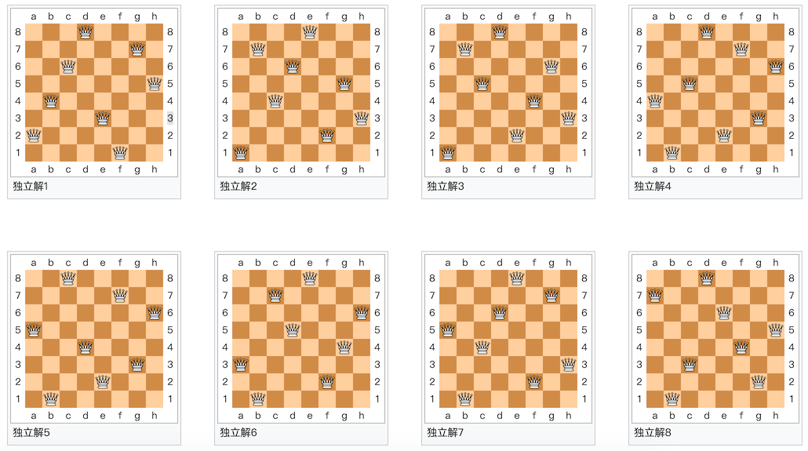

## Algoritma Giriş Serisi Ders 2 - Suyun Öte Yakasında

> **Translated to Turkish by** himmetcanumutlu

İlk açık derste kaba kuvvet yönteminden bahsettik. Kaba kuvvet yöntemi, brute-force arama olarak da adlandırılır; bugün anlatacağımız geri izleme (backtracking) yöntemi de brute-force aramanın bir türüdür. Bundan sonra anlatacağımız birçok algoritmanın "özyineleme" kavramıyla az ya da çok ilişkisi vardır; bu yüzden önce "özyineleme"den bahsedelim.

### Gerçek Hayatta Özyineleme

Bir varmış bir yokmuş, bir dağ varmış, dağda bir tapınak varmış, tapınakta yaşlı bir keşiş varmış, genç keşişe hikâye anlatıyormuş! Hikâye neymiş? Bir varmış bir yokmuş, bir dağ varmış, dağda bir tapınak varmış, tapınakta yaşlı bir keşiş varmış, genç keşişe hikâye anlatıyormuş! Hikâye neymiş? Bir varmış bir yokmuş, bir dağ varmış, dağda bir tapınak varmış, tapınakta yaşlı bir keşiş varmış, genç keşişe hikâye anlatıyormuş! Hikâye neymiş?……

Nobita odasında, zaman televizyonuyla geleceği izliyor. Televizyon görüntüsünde Nobita odasında, zaman televizyonuyla geleceği izliyor. Televizyon görüntüsünde Nobita odasında, zaman televizyonuyla geleceği izliyor……

Faktöriyelin özyinelemeli tanımı：$$0! = 1$$，$$n!=n*(n-1)!$$；tanımlanan nesnenin kendisi kullanılarak onun tanımının yapılmasına özyinelemeli tanım denir.

[Droste etkisi](https://zh.wikipedia.org/wiki/%E5%BE%B7%E7%BD%97%E6%96%AF%E7%89%B9%E6%95%88%E5%BA%94) özyinelemenin görsel bir biçimidir. Görseldeki kadının elinde tuttuğu nesnede, kendisinin aynı nesneyi tuttuğu küçük bir görsel vardır; küçük görselin içinde ise daha da küçük, aynı nesneyi tuttuğu bir görsel vardır……


### Özyinelemenin Uygulanması

Programda, bir fonksiyon doğrudan veya dolaylı olarak kendisini çağırıyorsa ona özyinelemeli fonksiyon deriz.

Özyinelemeli fonksiyon yazmanın iki önemli noktası vardır:

1. Yakınsama koşulu - özyinelemenin ne zaman biteceği.
2. Özyineleme formülü - her terimin bir önceki terimle（ilk *N* terimle）ilişkisi.

Örnek 1: Faktöriyel bulma.

```Python
def fac(num):
    if num == 0:
        return 1
    return num * fac(num - 1)
```

Python özyineleme derinliğini sınırlar（varsayılan 1000 katman fonksiyon çağrısı）；bu sınırı aşmak isterseniz aşağıdaki yöntemi kullanabilirsiniz.

```Python
import sys

sys.setrecursionlimit(10000)
```

Örnek 2: Merdiven çıkma - merdivende *n* basamak vardır; bir adımda 1, 2 veya 3 basamak çıkılabilir; *n* basamağı çıkmanın kaç farklı yolu vardır.

```Python
def climb(num):
    if num == 0:
        return 1
    elif num < 0:
        return 0
    return climb(num - 1) + climb(num - 2) + climb(num - 3)
```

**Not**: Yukarıdaki özyinelemeli fonksiyonun performansı çok kötüdür; çünkü zaman karmaşıklığı geometrik dizi düzeyindedir.

Optimize edilmiş kod.

```Python
from functools import lru_cache


@lru_cache()
def climb(num):
    if num == 0:
        return 1
    elif num < 0:
        return 0
    return climb(num - 1) + climb(num - 2) + climb(num - 3)
```

Özyineleme kullanmayan kod.

```Python
def climb(num):
    a, b, c = 1, 2, 4
    for _ in range(num - 1):
        a, b, c = b, c, a + b + c
    return a
```

**Önemli nokta**: Daha iyi bir yol varken özyinelemeyi düşünmeyin.

### Geri İzleme Yöntemi

**Geri izleme yöntemi**, [brute-force aramanın](https://zh.wikipedia.org/wiki/%E6%9A%B4%E5%8A%9B%E6%90%9C%E5%B0%8B%E6%B3%95) bir türüdür. Bazı hesaplama problemleri için geri izleme yöntemi, tüm (veya bir kısmı) çözümleri bulabilen genel bir algoritmadır; özellikle kısıt sağlama problemleri için uygundur (kısıt sağlama problemini çözerken giderek daha fazla aday çözüm oluştururuz ve belirli bir kısmi aday çözümün doğru çözüme tamamlanamayacağını belirlediğimizde, bu kısmi aday çözümün kendisini ve ondan genişletilebilecek alt aday çözümleri aramayı bırakıp başka kısmi aday çözümleri test ederiz).

### Klasik Örnekler

Örnek 1: **Labirentte yol bulma**.


```Python
"""
Labirentte yol bulma
"""
import random
import sys

WALL = -1
ROAD = 0

ROWS = 10
COLS = 10


def find_way(maze, i=0, j=0, step=1):
    """Labirentte yürü"""
    if 0 <= i < ROWS and 0 <= j < COLS and maze[i][j] == 0:
        maze[i][j] = step
        if i == ROWS - 1 and j == COLS - 1:
            print('=' * 20)
            display(maze)
            sys.exit(0)
        find_way(maze, i + 1, j, step + 1)
        find_way(maze, i, j + 1, step + 1)
        find_way(maze, i - 1, j, step + 1)
        find_way(maze, i, j - 1, step + 1)
        maze[i][j] = ROAD


def reset(maze):
    """Labirenti sıfırla"""
    for i in range(ROWS):
        for j in range(COLS):
            num = random.randint(1, 10)
            maze[i][j] = WALL if num > 7 else ROAD
    maze[0][0] = maze[ROWS - 1][COLS - 1] = ROAD


def display(maze):
    """Labirenti göster"""
    for row in maze:
        for col in row:
            if col == -1:
                print('■', end=' ')
            elif col == 0:
                print('□', end=' ')
            else:
                print(f'{col}'.ljust(2), end='')
        print()


def main():
    """Ana fonksiyon"""
    maze = [[0] * COLS for _ in range(ROWS)]
    reset(maze)
    display(maze)
    find_way(maze)
    print('Çıkış yok!!!')


if __name__ == '__main__':
    main()
```

**Açıklama:** Yukarıdaki kod, rastgele duvar yerleştirerek labirent üretir; labirent üretmenin daha iyi bir yolu için [《Geri izleme ile Tile Tabanlı Labirent Üretmenin Basit Yolu》](<https://indienova.com/indie-game-development/generate-tile-based-maze-with-backtracking/>) yazısına bakın.

Örnek 2: **Şövalye devriyesi** - satrançtaki şövalye (at), şövalyenin hareket kurallarına göre tüm tahtanın her karesini dolaşır ve her kareye yalnızca bir kez uğrar.


```Python
"""
Şövalye devriyesi
"""
import sys

SIZE = 8


def display(board):
    """Tahtayı göster"""
    for row in board:
        for col in row:
            print(f'{col}'.rjust(2, '0'), end=' ')
        print()


def patrol(board, i=0, j=0, step=1):
    """Devriye"""
    if 0 <= i < SIZE and 0 <= j < SIZE and board[i][j] == 0:
        board[i][j] = step
        if step == SIZE * SIZE:
            display(board)
            sys.exit(0)
        patrol(board, i + 1, j + 2, step + 1)
        patrol(board, i + 2, j + 1, step + 1)
        patrol(board, i + 2, j - 1, step + 1)
        patrol(board, i + 1, j - 2, step + 1)
        patrol(board, i - 1, j - 2, step + 1)
        patrol(board, i - 2, j - 1, step + 1)
        patrol(board, i - 2, j + 1, step + 1)
        patrol(board, i - 1, j + 2, step + 1)
        board[i][j] = 0


def main():
    """Ana fonksiyon"""
    board = [[0] * SIZE for _ in range(SIZE)]
    patrol(board)


if __name__ == '__main__':
    main()
```

Örnek 3: **Sekiz vezir** - 8×8'lik satranç tahtasına sekiz veziri öyle yerleştirmek gerekir ki hiçbir vezir diğerini doğrudan yiyemesin. Bunu sağlamak için herhangi iki vezir aynı satırda, aynı sütunda veya aynı diyagonalde olamaz.



**Açıklama**: Bu problem çok klasiktir; internette bir sürü yanıtı vardır; kendiniz halletmeniz için size bırakıyorum.
